# Harnessix Code 总体架构

## 1. 文档定位

本文是Harnessix Code当前系统结构的事实入口，回答“系统由什么组成、组件如何协作、状态保存在哪里、失败后如何恢复、哪些能力尚未接入默认产品”。历史版本的设计增量保留在[里程碑文档](README.md#4-里程碑设计)和[ADR](adr/)，不再与当前架构混写。

本文当前已验收基线为提交`27e0b5918c6497dfe9df10e3f5a9d4c0ed08d8f7`：0.9.1e4固定Container Process已经由[CI 35434198163](https://github.com/carrie1988/Harnessix/actions/runs/35434198163)完成七任务全矩阵验收，0.9.1f1已经由[CI 35418034976](https://github.com/carrie1988/Harnessix/actions/runs/35418034976)关闭旧Action公共入口并收敛单一产品边界。e5的外部Action Config、Doctor能力报告、双配置原子CAS与启动只对账恢复是当前实现候选，尚未取得关闭CI证据。能力状态按“当前默认产品、实现候选、迁移兼容、规划中”区分：

| 标签 | 含义 |
|---|---|
| **当前默认产品** | `harnessix agent-server`启动时实际装配并可由薄CLI调用 |
| **实现候选** | 代码、合同和专项测试已经完成，仍等待全量及发布矩阵验证，不得写成已关闭能力 |
| **已实现/显式装配** | 源码与测试已经存在，但默认产品入口尚未自动装配，需要宿主显式组合 |
| **规划中** | 路线图已有边界但当前源码未提供完整产品能力 |

## 2. 需求背景

生产级Coding Agent不是单次“模型生成代码”的脚本。一个真实任务至少需要：

1. 接收并持久化用户任务，在进程退出后恢复Thread和Turn；
2. 将模型流规范化为Provider中立的消息、Tool Call、用量和错误；
3. 在Workspace边界内读取、搜索、修改文件并执行进程；
4. 对写入、命令和外部副作用执行策略判断、审批、幂等和对账；
5. 对取消、超时、并发、宿主崩溃和存储失败给出确定语义；
6. 通过稳定协议把运行时能力暴露给CLI、TUI或其他宿主；
7. 留下可审计、可评测、可诊断的持久事实和观测数据。

Harnessix Code据此把“Agent决策”“可信执行”“持久事实”“产品协议”分离，避免模型Provider、交互界面和高风险工具直接相互耦合。

## 3. 设计目标与非目标

### 3.1 当前设计目标

- 本地优先、Provider中立的Thread/Turn Agent Runtime；
- 版本化的无头App Server协议与薄客户端；
- 事件溯源Session、协议请求幂等和崩溃恢复；
- Workspace约束下的只读Coding Tool与默认Artifact分页；
- 默认产品中的受控Workspace Patch/Delivery，以及由独立Action Config显式启用的强Sandbox Process；MCP、Skill和Hook仍为显式装配库；
- 内置Trusted Action Runtime中的Policy、Approval、Execution Plan、Audit、`UNKNOWN`和Reconcile；
- SQLite本地持久化、Workspace/Process专用效果账本与可恢复产品状态；
- 结构化日志、Metric、Trace和可重复Eval基础设施。

### 3.2 当前非目标或未完成目标

- 当前薄CLI不是最终完整TUI；
- App Server当前只有本地stdio传输，不是公网多租户服务；
- 默认`agent-server`装配只读`CodingToolRuntime`、Session绑定Artifact及统一Trusted Action组合；Patch只在POSIX no-follow语义成立时进入目录，Process只有显式外部Action Config且Engine、镜像、Owner、Sandbox与Secret全部验证后才进入目录；
- 默认产品在Windows使用原生Handle四项只读端口并省略Workspace Patch；固定Profile Process具备Windows Owner代码路径但尚无Windows真实Container发布矩阵，Git写入与发行物证据仍未完成；
- 旧Action HTTP/Worker、Demo Executor和PostgreSQL Queue仅为迁移兼容代码，不是1.0产品能力；
- 当前版本未宣称满足大规模C端商用所需的固定Eval、Soak、安全供应链和三平台发行门槛。

这些缺口由[路线图0.9.1～0.9.6](roadmap.md)管理。

## 4. 架构原则与约束

1. **事实先于副作用**：接受、审批、执行意图和终态必须按各子系统契约持久化；
2. **不确定不重放**：不能证明外部效果是否发生时进入`UNKNOWN`、等待观察或人工处理，不自动重复写入；
3. **控制面不越权执行**：Model和扩展只能提出Tool Call或Action，不能绕过Policy、Workspace和Executor；
4. **Provider中立历史**：Session保存规范化内容，不把上游SDK对象作为领域事实；
5. **显式版本和兼容性**：Agent Protocol当前为`1.0`，Agent Event当前为`schema_version=20`，Session数据库迁移当前连续到23；
6. **有界资源**：Turn具有步骤、Token、时长、输出字符和单步Tool Call预算；stdio、HTTP与进程输出也有边界；
7. **最小权限**：Workspace、状态目录、配置和Secret分离，路径、符号链接、可执行文件和网络能力显式校验；
8. **单一所有者**：Session Store运行时所有权、Workspace Lease和Action Lease避免多个执行者同时提交同一事实；
9. **当前与规划分离**：已实现库能力不能写成默认产品能力。

### 4.1 关键术语

| 术语 | 定义 | 不代表 |
|---|---|---|
| Thread | 绑定一个Workspace的持久会话聚合 | 操作系统线程 |
| Turn | 一次用户输入驱动的有预算Agent执行 | 一次模型HTTP请求；一个Turn可含多个Model Attempt |
| Item | Turn内的消息、Tool、审批、计划或错误记录 | 独立事务；其事实由Event提交 |
| Agent Event | 带Thread内单调递增序号的Session持久事实 | 临时流式Delta |
| Delta | 为低延迟UI提供的有界临时增量 | 可恢复的持久事件；缺口时必须Replay |
| Action | framework-agnostic的版本化工具执行请求 | Agent Turn；二者生命周期独立 |
| Effect Journal | Action状态、副作用身份、Lease和对账事实源 | 普通应用日志 |
| Trusted Action | Patch、Process、MCP等高风险能力的统一受控计划 | 允许扩展任意执行宿主代码 |
| Workspace Snapshot | 执行前文件集合与版本证明 | 长期锁；它必须与Lease和提交期检查组合 |
| UNKNOWN | 外部效果无法证明成功或失败 | 可直接重试的普通失败 |

### 4.2 跨模块术语词典

本节解释架构图、数据流和状态机中反复出现的领域词。术语相似不表示数据相同；“权威来源”列说明发生冲突时应信任哪一侧。字段级约束以对应模块合同为准，详见[领域模型目录](modules/domain.md)、[Agent模型](modules/agent.md)、[Context模型](modules/context.md)、[Protocol模型](modules/protocol.md)及第7节的模块设计链接。

#### 会话与Agent运行时

| 术语 | 含义与用途 | 权威来源/边界 |
|---|---|---|
| Thread | 绑定一个Workspace的持久会话聚合，含多个Turn、事件序列、归档状态及可选Fork来源；解决多次用户输入需要连续历史、稳定身份和并发边界的问题 | Session Event流经Reducer生成的Thread投影 |
| Turn | 一次用户请求驱动的有预算执行，可含多步模型调用、工具执行、审批、等待、取消或恢复；用于隔离单次任务的预算、用量和终态 | Agent Event流 |
| Item | Turn内的语义单元，如用户/助手文本、Tool Call/Result、审批、问题、计划、压缩或错误；保持历史结构化，不依赖解析自由文本 | 创建Item的持久Agent Event |
| Agent Event | 带Thread内单调递增序号的不可变事实；Event Draft被Session Store接受后获得序号 | Session Store中的事件记录 |
| Event Draft | Runtime提出、尚未分配持久序号的写入意图，用来区分“准备写”与“已提交事实” | 本身不是权威事实，append成功后才成为Agent Event |
| Reducer / Projection | 将有序Agent Event折叠成当前Thread/Turn视图的纯逻辑，使在线更新和重放采用同一规则 | 持久事件序列及版本化Reducer |
| Model Attempt | 一次完整Provider调用及开始、结束、用量或失败记录；一个Turn可有多次Attempt | Session中的Attempt事件 |
| Item Delta | 生成期间发给客户端的暂时增量，用于低延迟体验 | 传输缓冲；非持久事实，缺口以Replay补齐 |
| Retry | 为失败/取消/中断的前一Turn创建新Turn并保留前驱身份 | 新Turn及retry关联；不得改写原Turn |
| Resume | 根据已持久化状态继续可证明安全的等待/运行流程 | Session事实与对应执行账本共同决定 |
| CAS | Compare-And-Swap；仅当数据库序号等于调用者的预期序号时提交 | Session Store事务条件，防止并发写静默覆盖 |
| Runtime Owner | 当前允许驱动本地Session数据库的宿主所有权，避免将SQLite误当多主协调器 | Session Store锁/所有权记录 |
| Fork Snapshot | 从源Thread复制的已闭合历史、内容摘要、来源序号、Artifact所有权及结果查看策略 | 新Thread持久化的快照；权限固定为none，不继承执行权 |

#### Context、模型历史与Artifact

| 术语 | 含义与用途 | 权威来源/边界 |
|---|---|---|
| Context Fragment | 带Kind、来源和文本的不可变片段；把必选Runtime/User指令与可选项目/环境事实分开排序、信任和预算 | Context合同；Trust由Kind决定，不接受来源自报 |
| Context Source | 每个Model Step采集一类受控动态信息的端口/实现，避免模型反复使用陈旧仓库状态 | 当前Step生成的Observation |
| Observation | Source在某一时刻读取到的文档、Workspace范围和Revision；用于处理并发修改与来源一致性 | Source返回值，不是长期业务事实 |
| Source Snapshot | 不含正文的来源身份和Revision记录，用于证明模型上下文取自哪些版本 | Context Inspection事实 |
| Context Inspection | 一次上下文构建的预算、排序、来源快照和省略决定，可解释哪些内容被纳入 | ContextPrepared等Session事件 |
| Prepared Context | 已通过预算选择和渲染、准备进入本次Model Request的指令/历史视图 | 当前Step的临时值；正文不因此成为持久事件 |
| Model History View | 将规范化Session Items映射成Provider消息格式的只读视图；隔离厂商消息模型 | 原始Session Items与已冻结的View Decision |
| Tool Result View Decision | 决定一个结果用原文、Artifact引用或有界摘要呈现给模型；避免大结果撑爆上下文且保持重放一致 | 首次生成并持久化的决定 |
| Compaction Plan | 将可压缩闭合历史划为覆盖、保留和Pin区域的纯计划，先证明不拆散调用/结果组 | 从当次冻结历史确定性重算并与持久计划核对 |
| Compaction Record | 摘要请求的计划、请求意图、Attempt、用量、候选或失败账本 | 持久Compaction事件；避免崩溃后重复可能计费的请求 |
| Compaction Window | 已激活的摘要Item、保留历史及后续原始增量组成的线性窗口 | Session窗口链及源序号；压缩不删除原始历史 |
| Artifact | 按用途和摘要保存的大内容对象，通过授权引用读取 | Artifact Store元数据与内容；不是任意路径别名 |
| Artifact Ref | 不透明的Artifact身份、用途、摘要、大小和访问范围引用 | Artifact Store负责授权；引用本身不授予范围外访问 |

#### Trusted Action与可信副作用

| 术语 | 含义与用途 | 权威来源/边界 |
|---|---|---|
| Trusted Action Runtime | Agent内部统一规划、策略、审批、执行、审计和对账子系统；将模型提议与宿主权限分开 | Trusted Action Router、Execution Plan与Action Audit |
| Action Request | harnessix.action/v1版本的调用合同，包含Action ID、工具、参数、主体、上下文及可选幂等/Secret引用 | Domain校验后由Journal接收 |
| Tool Definition / Descriptor | Definition是宿主登记的权威执行合同；Descriptor是派生给模型/客户端的能力说明 | Registry Definition有权威；Descriptor不得提升权限 |
| Principal | 租户、主体、框架和角色等调用身份值；为策略提供主体上下文 | 外层认证及宿主绑定才证明身份，字段本身不是认证 |
| Policy Decision | 策略引擎产生的ALLOW、DENY或REQUIRE_APPROVAL结论 | Policy Engine决定记录 |
| Approval | 对冻结请求指纹的人工允许/拒绝，防止批准后替换参数或资源 | Agent持久交互与Trusted Action审批检查点；旧Action审批记录仅约束迁移兼容调用 |
| Effect Class | 只读、幂等写、非幂等写、破坏性等副作用类别 | 宿主Tool Definition |
| Risk Level | LOW至CRITICAL的风险分级，为Policy提供输入 | 宿主注册和Policy规则；不等同副作用类别 |
| Effect Ledger | Workspace、Process或外部效果的专用持久账本；Action Audit保存统一路由摘要，不复制真实效果 | 对应Executor的专用Ledger与Action Audit |
| Lease | 有期限的执行所有权凭证；失租者不能提交终态 | Journal中的Owner和Deadline |
| Fencing | 用所有权世代/令牌拒绝暂停后复活的旧执行者迟到提交 | 具体Lease与提交合同 |
| Idempotency Key | 业务操作的稳定去重键；使重试关联到同一操作记录，但不能让非幂等外部系统自动变成幂等 | Journal约束和Executor能力声明 |
| Execution Outcome | Executor对成功、失败或未知的外部结果判断 | Executor/Receipt观察后由Journal提交 |
| Effect Receipt | 外部资源、标识、摘要等效果证据，供审计和恢复对账 | 受信Executor生成并由Journal保存；结构合法不等于真实 |
| UNKNOWN | 无法证明效果发生或未发生的状态；不能按普通失败盲目重试 | Journal状态；进入Reconcile或人工处理 |
| Reconciliation | 再次观察外部资源，将UNKNOWN收敛为成功、失败、仍未知或人工处理 | Reconciler观察与Journal迁移 |

#### 可信执行、Workspace与交付

| 术语 | 含义与用途 | 权威来源/边界 |
|---|---|---|
| Trusted Action | 宿主显式绑定并由统一Router规划、审批、执行和对账的高影响能力；隔离模型提议与宿主权限 | Trusted Action Route及其宿主Binding |
| Host Binding | 将公开名称绑定到Definition、Executor、资源范围和能力证据的宿主注册 | 构造时校验并冻结的绑定集合 |
| Execution Plan | 冻结工具参数、环境/Secret版本、Workspace和能力绑定的执行计划 | Execution Store与Plan Fingerprint |
| Capability Evidence | 宿主、容器或运行器能力探测的带版本证据；区别配置意图与检测事实 | Sandbox/Execution探测结果，过期需重新探测 |
| Workspace | 受宿主约束的项目根目录和逻辑资源命名空间 | Workspace Root与安全文件系统观察 |
| Workspace Resource | Workspace范围内规范化的文件/目录对象及其观察Revision | Workspace Observation/Snapshot |
| Workspace Snapshot | 执行前涉及资源的版本/摘要证明；与提交前复核配合发现并发编辑，不是长期锁 | 文件系统观察和提交期校验 |
| Workspace Lease | 对Workspace或资源集合的限时协调/独占权，可带Fencing | Workspace Lease Store |
| Patch Plan | 冻结的文件变更、来源版本、指纹和审批身份计划 | Patch/Trusted Action账本 |
| Delivery Transaction | 对文件变更按可恢复成员顺序发布的事务记录；解决普通文件系统缺少多文件原子提交的问题 | Delivery Store与Workspace实际文件 |
| Process Action | 带命令、目录、环境、预算和生命周期合同的受控进程操作 | Process/Supervisor状态记录 |
| Sandbox | 为进程提供隔离的宿主/容器机制和能力证据；探测到容器不代表每条执行路径都已隔离 | 实际Sandbox Binding和运行器 |
| MCP / Skill / Hook | 分别是远程/本地工具协议、渐进加载的指令包、宿主事件扩展；均需通过宿主受控能力边界 | 各自Registry；是否默认装配见第7节 |

#### Protocol、配置与运行支撑

| 术语 | 含义与用途 | 权威来源/边界 |
|---|---|---|
| Agent Protocol | 面向产品客户端的版本化JSON-RPC命令、消息和公开投影合同 | Protocol合同与投影 |
| Command Request ID | 客户端在写命令前分配的稳定身份；响应丢失后用于重发或发现冲突 | Client Instance、请求记录及参数指纹 |
| Event Cursor / Replay | 客户端已观察的持久事件序号及其后的补取机制；用持久Replay修复易丢Delta | Session事件序列 |
| Projection | 将内部模型裁剪并转换为版本化公开响应 | Protocol公开合同；不得暴露内部/敏感字段 |
| Model Provider Event | Provider流被归一化后的开始、文本、Tool Call、用量、结束或失败事件 | Models适配器输出 |
| Secret Ref / Secret Material | Ref是名字/版本等非明文引用；Material是运行时短暂解析的凭证正文 | Secret Provider；正文不应写入Session、配置或日志 |
| Trace Context | W3C Trace ID/Span传播字段，用于跨进程关联；不是业务身份 | 首次接收Runtime或上游；不得携带Secret |
| Budget | Turn或子操作的步骤、Token、时长、输出和并发上限 | 类型化配置及对应持久运行事实 |

## 5. 系统上下文

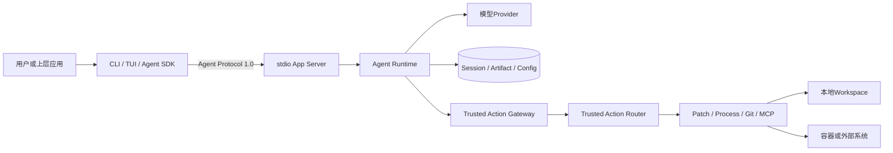
```mermaid
flowchart LR
    User[用户或上层应用]
    Client[CLI / TUI / Agent SDK]
    Product[stdio App Server]
    Agent[Agent Runtime]
    Provider[模型Provider]
    Session[(Session / Artifact / Config)]
    Gateway[Trusted Action Gateway]
    Router[Trusted Action Router]
    Executors[Patch / Process / Git / MCP]
    Workspace[本地Workspace]
    External[容器或外部系统]

    User --> Client
    Client -->|Agent Protocol 1.0| Product
    Product --> Agent
    Agent --> Provider
    Agent --> Session
    Agent --> Gateway --> Router --> Executors
    Executors --> Workspace
    Executors --> External
```

### 5.1 上下文说明

- [顶层CLI](../src/harnessix/cli.py)只分派Coding Agent产品、配置、Smoke和Eval命令；`serve/worker`已经退役；
- [产品装配](../src/harnessix/product_config/server.py)构造Provider、Session绑定Artifact Store、只读Tool、Agent Runtime、Scoped Artifact Reader、Application Service和stdio Server；
- [Agent Runtime](../src/harnessix/agent/runtime.py)拥有Agent Loop和Turn恢复；
- [模型契约](../src/harnessix/models/contracts.py)隔离具体Provider；
- [Coding Tool Runtime](../src/harnessix/tools/runtime.py)受Workspace边界约束；
- [Trusted Action Router](../src/harnessix/trusted_actions/router.py)是高风险能力的唯一计划、批准、执行和对账入口；
- Artifact、POSIX Workspace Patch、对应Delivery事务和验证通过的固定Container Process Profile已进入当前[产品装配](../src/harnessix/product_config/server.py)；MCP、Skill和Hook虽有实现与测试，仍未默认注册，Git交付能力也需显式装配。

### 5.2 4+1视图索引

本节按经典4+1架构视图组织系统事实。四个视图分别从逻辑结构、运行行为、源码组织和部署节点观察系统；“+1”用关键场景验证前四个视图能否共同解释一次真实运行。它们是同一实现的不同投影，不代表五套独立架构。

| 视图 | 核心问题 | 本文位置 | 主要读者 |
|---|---|---|---|
| 逻辑视图（Logical） | 哪些组件构成系统，责任与调用边界是什么？ | [组件交互图](#53-逻辑视图与组件交互图)、[组件映射](#7-逻辑组件与源码映射) | 设计、开发、评审 |
| 进程视图（Process） | 请求如何经过异步执行、持久化、工具和取消/恢复？ | [Turn流程图](#54-进程视图与turn流程图)、[系统级时序](#11-六条系统级时序) | Runtime、集成、测试 |
| 开发视图（Development） | 职责落在哪些Python包，允许的依赖方向是什么？ | [源码组织视图](#55-开发视图与源码组织)、[依赖边界](#8-模块所有权依赖方向与禁止旁路) | 开发、维护、代码评审 |
| 物理视图（Physical） | 默认组件运行在哪些进程/机器，状态和网络边界在哪里？ | [部署视图](#56-物理视图与部署拓扑)、[部署边界](#17-部署与平台边界) | 部署、运维、安全 |
| 场景视图（Scenarios，+1） | 重要质量属性如何在端到端场景中兑现？ | [场景索引](#57-场景视图1)、[系统级时序](#11-六条系统级时序) | 全体角色、验收 |

### 5.3 逻辑视图与组件交互图

下图只展示1.0产品主链。实线表示默认产品或已经定义的调用关系；可选能力仍必须由产品组合根完成能力证明后进入同一个Gateway和Router，不能建立第二个公共入口。

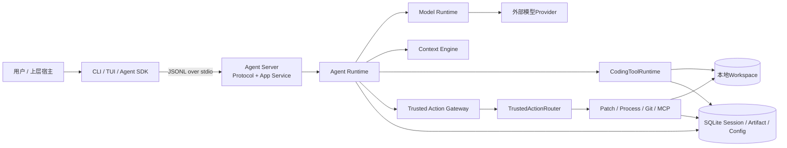
```mermaid
flowchart LR
    User[用户 / 上层宿主]
    Client[CLI / TUI / Agent SDK]
    Product[Agent Server<br/>Protocol + App Service]
    Agent[Agent Runtime]
    Models[Model Runtime]
    Provider[外部模型Provider]
    Context[Context Engine]
    Tools[CodingToolRuntime]
    Gateway[Trusted Action Gateway]
    Router[TrustedActionRouter]
    Executors[Patch / Process / Git / MCP]
    Workspace[(本地Workspace)]
    Session[(SQLite Session / Artifact / Config)]

    User --> Client -->|JSONL over stdio| Product --> Agent
    Agent --> Models --> Provider
    Agent --> Context
    Agent --> Tools --> Workspace
    Agent --> Gateway --> Router --> Executors
    Executors --> Workspace
    Agent --> Session
    Tools --> Session
    Executors --> Session
```

**图示说明。** 用户界面只通过Agent Protocol调用Application Service。只读Coding Tool受Workspace边界约束；高风险文件、进程、Git和扩展调用进入Gateway与Router。Router持有Plan、Policy、Approval和统一Action Audit，具体效果由Workspace Transaction、Process Owner或外部效果Ledger持有。Session Event保存Thread/Turn交互事实，Artifact保存有界正文。独立Action HTTP/Worker不属于1.0产品拓扑。

**失败语义。** Runtime先持久化Turn接受事实，再调用Provider或Tool。Router只执行与当前Binding、Workspace Snapshot、Sandbox能力和批准指纹匹配的Plan。跨越副作用边界后无法确认结果时进入`unknown`，恢复只能调用Reconcile观察专用效果账本或外部权威状态，不能盲目重放。

**源码映射。** 产品入口位于[Product Config Server](../src/harnessix/product_config/server.py)的`run_product_stdio`；协议与应用服务分别位于[AgentProtocolServer](../src/harnessix/app_server/server.py)和[AgentApplicationService](../src/harnessix/app_server/service.py)；Agent Loop位于[AgentRuntime](../src/harnessix/agent/runtime.py)；统一高风险边界位于[RouterBackedAgentActionGateway](../src/harnessix/trusted_actions/agent_gateway.py)和[TrustedActionRouter](../src/harnessix/trusted_actions/router.py)。旧`ActionService/ActionWorker`只在[ADR 0081](adr/0081-single-coding-agent-product-boundary.md)登记的迁移调用方内保留。

### 5.4 进程视图与Turn流程图

下图展开单次用户命令的主路径。`turn/start`的接受事实先持久化，再返回接受结果并驱动后台Turn；相同身份和参数的重试复用既有请求/Turn身份，已完成或失败命令直接重放账本结果。Agent Loop每轮准备Provider中立History，调用模型，随后按Tool效果类别分流。为保持图可读，取消和进程重启的详细分支见[取消时序](#113-取消)与[崩溃恢复时序](#114-宿主崩溃与恢复)。

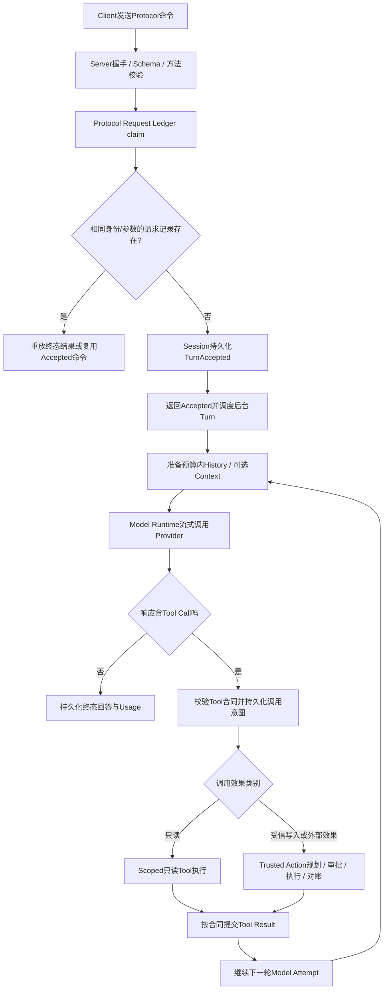
```mermaid
flowchart TD
    A[Client发送Protocol命令]
    B[Server握手 / Schema / 方法校验]
    C[Protocol Request Ledger claim]
    D{相同身份/参数的请求记录存在?}
    E[重放终态结果或复用Accepted命令]
    F[Session持久化TurnAccepted]
    G[返回Accepted并调度后台Turn]
    H[准备预算内History / 可选Context]
    I[Model Runtime流式调用Provider]
    J{响应含Tool Call吗}
    K[持久化终态回答与Usage]
    L[校验Tool合同并持久化调用意图]
    M{调用效果类别}
    N[Scoped只读Tool执行]
    O[Trusted Action规划 / 审批 / 执行 / 对账]
    P[按合同提交Tool Result]
    Q[继续下一轮Model Attempt]

    A --> B --> C --> D
    D -->|是| E
    D -->|否| F --> G --> H --> I --> J
    J -->|否| K
    J -->|是| L --> M
    M -->|只读| N --> P
    M -->|受信写入或外部效果| O --> P
    P --> Q --> H
```

**流程说明。** Protocol Server负责握手、严格解码、请求幂等和公开投影；Application Service先记录接受状态，再调度后台工作，因此调用方断线不等于Turn不存在。Agent Runtime按Thread串行化领域提交，执行每个有预算的Model Attempt。模型提出工具调用只构成不可信意图：Runtime先校验工具定义并记录调用，之后才分派到只读Tool或Trusted Action。只读调用在声明允许时可有限并行，但完成结果按Provider原始顺序持久化；写入Action经过Router确定身份、风险与审批事实，再由受信Executor触碰Workspace。每一轮Tool结果提交后才进入下一次模型请求；无Tool Call时提交完成状态。

**失败与异步边界。** Provider流、数据库、Tool Runtime和受信执行都是可能阻塞的异步边界；取消通过`CancelToken`协作传播，不等于撤销已经发生的外部效果。Session追加依赖`expected_sequence` CAS；失败时内存状态不构成提交。若进程在效果执行边界崩溃，新Runtime只根据Session/Router/Delivery持久事实恢复：可证明未执行时才可续跑，无法证明的效果进入等待、`UNKNOWN`或`INTERRUPTED`，不盲目重放。临时Delta用于实时体验，断线后从持久事件Replay。

**源码与测试映射。** 接受和后台调度位于[AgentApplicationService](../src/harnessix/app_server/service.py)；Turn状态机和Tool执行顺序位于[AgentRuntime](../src/harnessix/agent/runtime.py)；Provider抽象见[Model Contracts](../src/harnessix/models/contracts.py)；请求账本与投影见[Protocol Request Store](../src/harnessix/protocol/requests.py)和[Protocol Projection](../src/harnessix/protocol/projection.py)。主验证为[Server/SDK集成测试](../tests/app_server/test_server_sdk.py)、[Tool并发顺序测试](../tests/agent/test_tool_scheduling.py)、[Agent Runtime测试](../tests/agent/test_runtime.py)及[崩溃恢复测试](../tests/agent/test_crash_recovery.py)。

### 5.5 开发视图与源码组织

开发视图描述责任如何映射到代码，而非列举每个类。下表中的“上游”表示主要被谁调用，“关键边界”表示包之间优先采用的Port/Contract。当前仓库存在已登记的跨包强连通分量，因此分层表达的是目标责任方向，不应被误读为已经完全实现的无环依赖图；精确包级规则见[依赖方向与禁止旁路](#8-模块所有权依赖方向与禁止旁路)。

| 开发层 | 代表源码包 | 对外责任与关键接口 |
|---|---|---|
| 产品入口与客户端 | `cli`、`agent_cli`、`product_ui`、`sdk`、`protocol`、`app_server`、`product_config` | 命令解析、客户端状态、JSON-RPC合同、产品组装；不直接拥有模型或Workspace副作用 |
| Agent编排与模型 | `agent`、`context`、`models` | Thread/Turn事件与Loop、Context准备、Provider中立请求和流事件 |
| 能力与可信执行 | `tools`、`workspace`、`execution`、`patches`、`processes`、`delivery`、`sandbox`、`trusted_actions`、`mcp`、`skills`、`hooks` | 文件/进程边界、冻结计划、审批、执行、交付和扩展能力；通过稳定合同向编排层提供能力 |
| 领域与持久化/平台基础设施 | `domain`、`session`、`artifacts`、`storage`、`policy`、`executors`、`secrets`、`observability` | 领域状态、事件/快照、Artifact、Action Journal、Policy/Executor端口、Secret与信号接口 |
| 迁移兼容内核与质量工具 | 根级`runtime`、`api`、`worker`、`evals`、`smoke` | 旧Action链只服务已登记迁移调用方；Eval/Smoke继续作为受控质量工具 |

建议阅读方向是“入口 → 协议/产品组装 → Agent Port与状态机 → Adapter/能力实现 → 持久化与恢复测试”。例如，要理解文件读取，应从`AgentRuntime`的工具调度进入`CodingToolRuntime`与Workspace Reader；要理解Patch，不从模型Prompt推断安全性，而沿Agent Gateway → Router → Execution Plan/Approval → Delivery Executor追踪。所有31个源码包的边界与禁止旁路见[包所有权表](#82-31个顶层包边界)，文件级阅读路线见[源码阅读地图](guides/source-reading-map.md)。

### 5.6 物理视图与部署拓扑

默认产品是本地优先的父子进程组合。TUI或薄CLI通过子进程stdio与Headless Agent Server交换有界JSONL；Server访问本地Workspace和私有SQLite状态，并按Product Config连接模型Provider。高风险执行位于Server生命周期内，但Container Process由受管Process Owner和Sandbox实现隔离，不等于独立业务Worker。

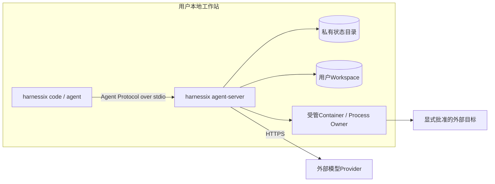
```mermaid
flowchart LR
    subgraph Local[用户本地工作站]
        UI[harnessix code / agent]
        Server[harnessix agent-server]
        State[(私有状态目录)]
        Workspace[(用户Workspace)]
        Container[受管Container / Process Owner]
        UI -->|Agent Protocol over stdio| Server
        Server --> State
        Server --> Workspace
        Server --> Container
    end
    Provider[外部模型Provider]
    External[显式批准的外部目标]
    Server -->|HTTPS| Provider
    Container --> External
```

**部署边界说明。** stdout只承载协议，状态目录不能与Workspace重叠，Provider Secret只在运行时解析。独立Action HTTP API、PostgreSQL Queue和常驻Action Worker不再是1.0部署形态。未来远程执行必须位于Trusted Action Executor端口之后，并重新完成身份、租户、配额、Secret和服务SLO设计。

### 5.7 场景视图（+1）

场景视图使用端到端用例检验组件边界和质量属性；它是对逻辑、进程、开发和物理视图的校验集，不是单独的功能列表。

| 场景 | 入口与主要参与者 | 关键不变量/质量属性 | 详细时序或证据 |
|---|---|---|---|
| S1 普通只读Coding Turn | SDK/CLI → App Server → Agent → Model/Read Tool | 接受先持久化；Tool结果依Provider顺序提交；断线可Replay | [正常Turn](#111-正常只读coding-turn)、[Tool调度测试](../tests/agent/test_tool_scheduling.py) |
| S2 受控Workspace Patch | 模型Tool Call → Gateway/Router → Review/审批 → Delivery/Workspace | 计划身份冻结；批准绑定原请求指纹；Lease与Snapshot防漂移；不确定效果不自动重放 | [Patch时序](#116-默认posix-workspace-patch时序)、[Trusted Patch集成测试](../tests/delivery/test_trusted_action_patch.py) |
| S3 取消活动Turn | Client → Server → Agent → Provider/Tool/Executor | 取消意图持久化；协作取消；已跨越的外部效果按其恢复协议处理 | [取消时序](#113-取消)、[交互测试](../tests/agent/test_interactions.py) |
| S4 Server/宿主崩溃 | 原Runtime → SQLite/Journal → 新Runtime | 依持久事实恢复；不凭丢失的内存Task判断；不安全调用不盲目重放 | [崩溃恢复时序](#114-宿主崩溃与恢复)、[恢复测试](../tests/agent/test_crash_recovery.py) |
| S5 兼容内核迁移回归 | 已登记旧调用方 → ActionService/Worker | 迁移前保持幂等、Lease和`UNKNOWN`；不成为新产品入口 | [迁移边界](#62-旧action兼容内核迁移边界)、[治理测试](../tests/governance/test_product_runtime_convergence.py) |

阅读产品场景时沿两类主要身份贯穿数据：`thread_id/turn_id/call_id`关联Agent Session与Protocol投影，`plan_id/invocation_id`关联Trusted Action和审批。迁移期旧`action_id/idempotency_key`只属于兼容内核，不能成为新能力的业务身份。

## 6. 当前运行拓扑

### 6.1 默认Coding Agent产品链

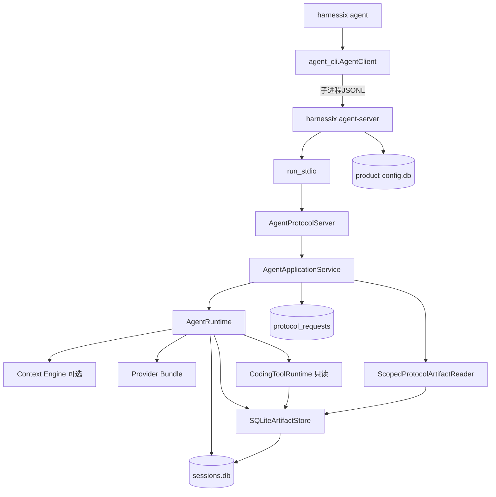
```mermaid
flowchart TD
    Entry[harnessix agent]
    Thin[agent_cli.AgentClient]
    Child[harnessix agent-server]
    Stdio[run_stdio]
    Server[AgentProtocolServer]
    Service[AgentApplicationService]
    Runtime[AgentRuntime]
    Context[Context Engine 可选]
    Model[Provider Bundle]
    Tools[CodingToolRuntime 只读]
    Artifact[SQLiteArtifactStore]
    Reader[ScopedProtocolArtifactReader]
    Session[(sessions.db)]
    Requests[(protocol_requests)]
    Config[(product-config.db)]

    Entry --> Thin -->|子进程JSONL| Child --> Stdio --> Server --> Service --> Runtime
    Runtime --> Context
    Runtime --> Model
    Runtime --> Tools
    Runtime --> Artifact
    Tools --> Artifact
    Reader --> Artifact
    Service --> Reader
    Runtime --> Session
    Artifact --> Session
    Service --> Requests
    Child --> Config
```

启动顺序不是任意的。`run_product_stdio`先对Product Config v2和Product Action Config v1执行同一Preflight，再重新安全加载并核对预检摘要，随后校验Workspace、两个配置文件和状态目录不重叠。进入托管生命周期后依次构造Provider、Session、共享Artifact、Coding Tool、Action Store/Process Owner和Agent Runtime；上一活动Action配置先重建恢复Router并完成全局只对账，候选配置再生成模型目录。全部成功后，Product与Action活动指针在同一SQLite事务中CAS发布，最后才开放stdio。任何中间失败都不会留下单边活动指针、已创建Thread或一个内部未就绪的Server。

### 6.1.1 0.9.1e1能力目录与规划地基

0.9.1e1新增独立`ProductActionConfigV1`、短时`ProductActionCapabilityReport`和`ProductActionCatalog`。Catalog只从
`verified`能力生成模型Descriptor，并要求同一个Binding、Schema、Fingerprint和Executor Evidence闭合；`omitted`能力只进入诊断，
不能广告或注册。`TrustedActionRouter.register_many`先验证全集再发布，避免产品目录半安装。

Action规划以Action Audit中完整Route为首个可恢复事实，再保存内嵌Execution Plan。若进程在两次提交之间退出，同一规范
Invocation重试会修复Execution Plan Store，不重新捕获Workspace或决策Policy。该地基不代表Patch、Process或Delivery已经成为默认产品能力。详细字段、时序和测试见[0.9.1e详细设计](changes/m09-1e-default-trusted-action-composition.md)。

### 6.1.2 0.9.1e2 Agent Gateway显式装配链

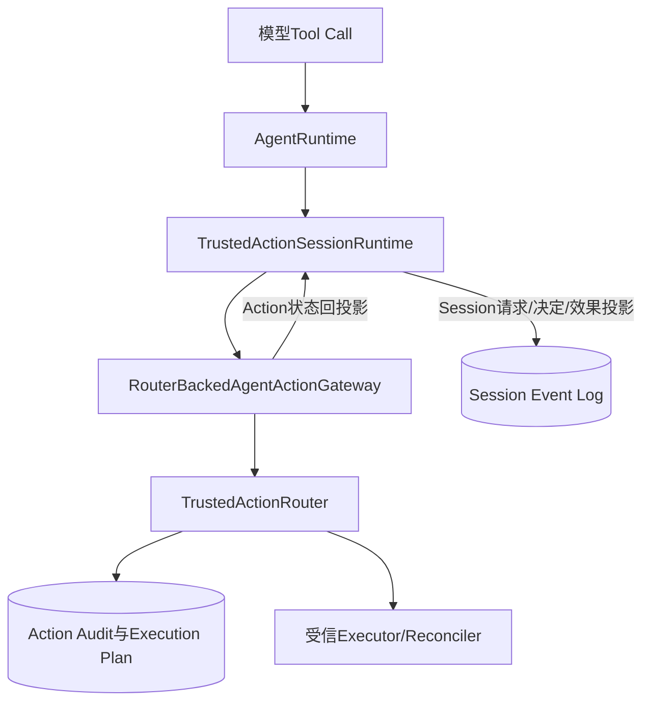
```mermaid
flowchart TD
    Model[模型Tool Call]
    Runtime[AgentRuntime]
    SessionRuntime[TrustedActionSessionRuntime]
    Gateway[RouterBackedAgentActionGateway]
    Router[TrustedActionRouter]
    Session[(Session Event Log)]
    Audit[(Action Audit与Execution Plan)]
    Executor[受信Executor/Reconciler]

    Model --> Runtime --> SessionRuntime
    SessionRuntime -->|Session请求/决定/效果投影| Session
    SessionRuntime --> Gateway --> Router
    Router --> Audit
    Router --> Executor
    Gateway -->|Action状态回投影| SessionRuntime
```

[Agent Gateway合同](../src/harnessix/agent/trusted_action_contracts.py)把`prepare/decide/execute/recover`
暴露给Agent Runtime；[Router适配](../src/harnessix/trusted_actions/agent_gateway.py)负责稳定Invocation/Plan/Idempotency
身份、精确Descriptor/Binding核对和Action状态机推进；[Session编排](../src/harnessix/agent/trusted_action_runtime.py)
把审批请求、决定和Effect保存为Agent Event v20事实。审批只由Router中的Approval Checkpoint授权，Session记录仅作为交互和恢复投影。

e2交付时这是一条仅供宿主显式组合的装配链。e3开始，`harnessix agent-server`在POSIX平台通过同源Catalog注册
`apply_patch_batch`的Descriptor、Definition、Review Provider、Executor与Reconciler。e4把固定Container Process按Profile加入同一Catalog；Windows继续省略Patch，但只有真实Container能力验证通过的Process Profile才可注册。

### 6.1.3 0.9.1e3默认Workspace Patch纵向链

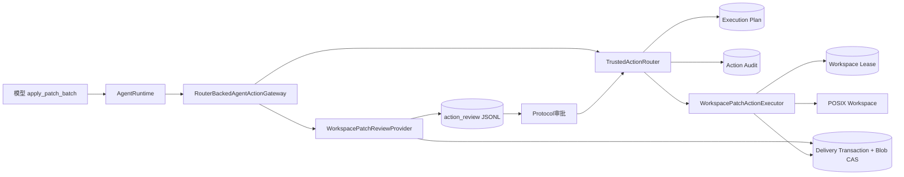
```mermaid
flowchart LR
    Model[模型 apply_patch_batch] --> Agent[AgentRuntime]
    Agent --> Gateway[RouterBackedAgentActionGateway]
    Gateway --> Router[TrustedActionRouter]
    Router --> Plan[(Execution Plan)]
    Router --> Audit[(Action Audit)]
    Gateway --> Review[WorkspacePatchReviewProvider]
    Review --> Delivery[(Delivery Transaction + Blob CAS)]
    Review --> Artifact[(action_review JSONL)]
    Artifact --> Approval[Protocol审批]
    Approval --> Router
    Router --> Executor[WorkspacePatchActionExecutor]
    Executor --> Lease[(Workspace Lease)]
    Executor --> Files[POSIX Workspace]
    Executor --> Delivery
```

公开输入由[`WorkspacePatchInput`](../src/harnessix/delivery/trusted_action_contracts.py)限制为1～16个文本文件、最多512 KiB正文及明确的`create/replace/delete`前置条件。路径、操作、来源SHA、目标SHA和模式进入规范Action资源；Router捕获的Workspace Snapshot与Delivery来源Snapshot覆盖同一资源集合。

[`WorkspacePatchTransactionPlanner`](../src/harnessix/delivery/trusted_action.py)令Delivery事务ID与Action Plan ID相同，查询既有事务时执行完整身份复核。[`WorkspacePatchReviewProvider`](../src/harnessix/product_config/workspace_patch_review.py)把完整Diff发布为确定性`action_review` JSONL；Artifact先提交而Session审批尚未提交时可能留下有界孤儿，但未经Session反向引用不能读取，过期后可回收。

批准后，[`WorkspacePatchActionExecutor`](../src/harnessix/delivery/trusted_action.py)获取Workspace Lease，并通过[`publish_next`](../src/harnessix/delivery/filesystem.py)一次最多提交一个成员。取消只发生在有界成员之间；进入效果边界后的恢复只观察，不续写。严格after前缀与before后缀映射为`manual_intervention`，全after才可证明成功，第三状态保持保守失败。

默认状态布局新增`execution-plans.db`、`action-audit.db`、`workspace-leases.db`和`workspace-transactions/`，Session与Review Artifact继续共用`sessions.db`。构造失败由同步Owner逆序关闭；e5候选实现已在对外开放Agent Protocol前全局扫描Product Action在途Route，将中断执行先收敛为`unknown`再只调用Reconcile。Windows及缺少POSIX no-follow能力的平台不安装Patch Binding。


### 6.1.4 0.9.1e4固定Container Process纵向链

[`open_default_product_action_runtime`](../src/harnessix/product_config/action_runtime.py)统一拥有Action Stores和可选平台
Process Supervisor。配置包含Profile时，启动阶段逐项证明Engine文件身份、Daemon版本、不可变镜像Repo Digest、Process Owner、
`container_strong` Sandbox、资源上限和Secret版本；失败Profile只生成`omitted`能力事实，不建立Host Process fallback。

[`build_product_action_composition`](../src/harnessix/product_config/action_composition.py)把Patch和全部Profile探测结果原子转换为同一
Report/Catalog/Gateway。Gateway按Tool选择规划上下文和Provider：Patch使用Host Guard及Diff Review，Process使用Container Sandbox、
固定环境、Secret版本和终态Output Provider。Agent只看到`run_profile.<id>`及`profile/selectors`输入，不能提供程序、镜像、环境或Secret。

Process批准后，[`ProductProcessActionExecutor`](../src/harnessix/product_config/process_action.py)重新核对Route，派生
`ContainerExecutionSpec`并通过`ContainerProcessRuntime`执行。Process Lease是效果权威；取消先使Router进入`unknown`，恢复只调用
Reconcile读取Lease，不再次运行命令。stdout/stderr按Lease摘要重建为`action_output` JSONL，Router仅保存Hash，Session只保存有界摘要
和作用域Artifact引用。完整设计、失败矩阵和测试映射见[0.9.1e详细设计](changes/m09-1e-default-trusted-action-composition.md)。

### 6.1.5 0.9.1e5配置、诊断与启动恢复候选

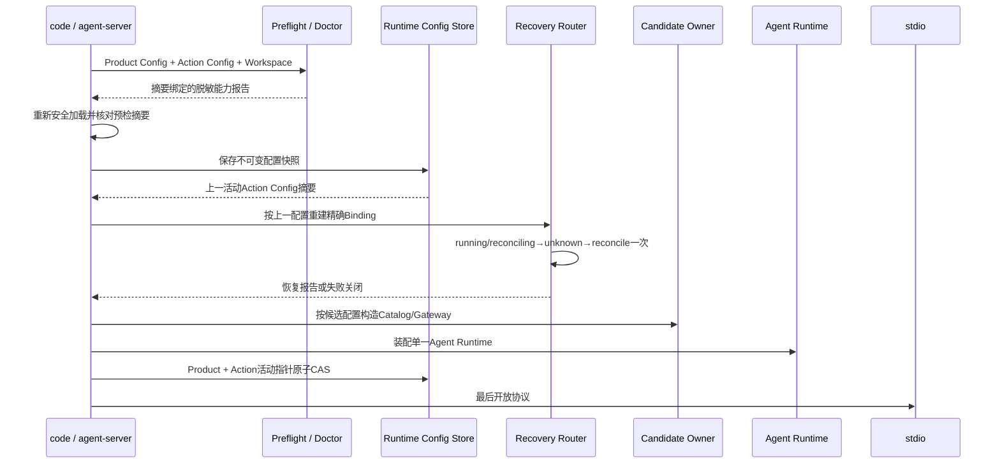
```mermaid
sequenceDiagram
    participant CLI as code / agent-server
    participant PF as Preflight / Doctor
    participant CS as Runtime Config Store
    participant RO as Recovery Router
    participant CO as Candidate Owner
    participant A as Agent Runtime
    participant IO as stdio

    CLI->>PF: Product Config + Action Config + Workspace
    PF-->>CLI: 摘要绑定的脱敏能力报告
    CLI->>CLI: 重新安全加载并核对预检摘要
    CLI->>CS: 保存不可变配置快照
    CS-->>CLI: 上一活动Action Config摘要
    CLI->>RO: 按上一配置重建精确Binding
    RO->>RO: running/reconciling→unknown→reconcile一次
    RO-->>CLI: 恢复报告或失败关闭
    CLI->>CO: 按候选配置构造Catalog/Gateway
    CLI->>A: 装配单一Agent Runtime
    CLI->>CS: Product + Action活动指针原子CAS
    CLI->>IO: 最后开放协议
```

[`action_codec.py`](../src/harnessix/product_config/action_codec.py)复用Product Config的有界严格JSON和安全文件读取原语；
[`action_diagnostics.py`](../src/harnessix/product_config/action_diagnostics.py)复用正式Patch/Process Binding构造，只读证明平台Owner、
容器Engine、固定镜像、Sandbox与Secret版本，不创建State Root或Process Lease。[`action_store.py`](../src/harnessix/product_config/action_store.py)
把Action快照、连续Hash事件、恢复报告和活动指针放入`product-config.db`，`activate_runtime`在一个`BEGIN IMMEDIATE`事务中校验
Product/Action两个CAS前提并切换两个指针。

[`ProductActionRuntimeOwner`](../src/harnessix/product_config/action_runtime.py)先用上一活动Action快照构造恢复Router。所有产品来源的
`running/reconciling` Route先持久转入`unknown`，随后每个`unknown`只调用一次`reconcile`；缺少旧精确Binding或仍未知时启动
失败，绝不调用`execute`。上一配置与候选配置不同则创建第二个Router；旧`pending_approval/ready`只有在候选提供逐字段相等的
Binding时才允许继续。上一Process Profile所引用的Secret版本应保留到旧Route结算完成，否则能力证明失败并阻止启动。

该切片没有恢复独立Action HTTP/Worker，也不新增网络控制面。`harnessix code`、内部`agent-server`与Python SDK仍统一经Agent
Protocol进入同一Thread/Turn和Trusted Action Runtime。实现候选的专项测试已覆盖严格文件读取、双CAS回滚、Hash链损坏、Doctor
只读/省略、预检后配置漂移、启动恢复不重放、缺失旧Binding、CLI透传和Schema；在全量及七任务CI通过前仍不标记e5关闭。


### 6.2 旧Action兼容内核迁移边界

`ActionService`、`ActionWorker`、SQLite/PostgreSQL Effect Journal、HTTP API和LangChain Adapter来自0.1产品。顶层`serve/worker`命令与HTTP Client公共导出已经撤销；这些实现不再出现在默认产品、部署或能力目录中。

迁移期只有Process旧桥、Git Push旧效果投影、历史Eval及旧实现自身可以引用兼容内核，精确集合由[`test_product_runtime_convergence.py`](../tests/governance/test_product_runtime_convergence.py)冻结。0.9.1f按Process、Git Push、Eval顺序迁移；白名单清零并提供旧数据库归档方案后，删除HTTP/Worker/PostgreSQL Queue及对应依赖。完整决策和切片见[ADR 0081](adr/0081-single-coding-agent-product-boundary.md)与[0.9.1f详细设计](changes/m09-1f-single-product-runtime-convergence.md)。

## 7. 逻辑组件与源码映射

| 组件 | 状态 | 责任 | 关键源码/符号 | 主要验证 |
|---|---|---|---|---|
| 顶层命令 | 当前默认产品 | 命令解析与入口分派 | [cli.py](../src/harnessix/cli.py) `main` | [CLI许可测试](../tests/unit/test_cli_license.py)、[产品CLI测试](../tests/product_config/test_server_and_cli.py) |
| Product Config | 当前默认产品/e5实现候选 | Secret-free Configure、双配置Preflight/Doctor、模型Profile与Fallback、Action快照/能力报告、同源目录、启动恢复报告和双活动指针原子CAS；详见[模块设计](modules/product-config.md) | [preflight.py](../src/harnessix/product_config/preflight.py)、[action_codec.py](../src/harnessix/product_config/action_codec.py)、[action_store.py](../src/harnessix/product_config/action_store.py)、[action_runtime.py](../src/harnessix/product_config/action_runtime.py)、[server.py](../src/harnessix/product_config/server.py) | [product_config测试](../tests/product_config/)、[产品CLI测试](../tests/product_ui/test_cli.py) |
| Agent Protocol | 当前默认产品 | 版本化Schema、JSON-RPC编解码、投影与命令幂等；详见[模块设计](modules/protocol.md) | [contracts.py](../src/harnessix/protocol/contracts.py)、[requests.py](../src/harnessix/protocol/requests.py) | [protocol测试](../tests/protocol/) |
| App Server | 当前默认产品 | 连接状态、方法路由、应用服务、Scoped Artifact分页和有界stdio；详见[模块设计](modules/app-server.md) | [server.py](../src/harnessix/app_server/server.py) `AgentProtocolServer`、[service.py](../src/harnessix/app_server/service.py) `AgentApplicationService` | [app_server测试](../tests/app_server/) |
| Python SDK | 当前默认客户端 | Agent进程内/子进程Transport、严格响应、协商方法和消息/Replay上限；旧Action HTTP Client不再公共导出 | [agent_client.py](../src/harnessix/sdk/agent_client.py) | [app_server测试](../tests/app_server/)、[收敛治理测试](../tests/governance/test_product_runtime_convergence.py) |
| Product UI终端产品 | 0.9.1a/0.9.1b/0.9.1c已关闭 | 最小Client State、发送前Command ID、连接代际、冷暖Replay、单Actor Controller，以及Plan、Tool、Approval、Question、Diff证据、Usage/Cost未知、Cancel、Steer和错误自助；三平台CI已通过，详见[模块设计](modules/product-ui.md) | [interactions.py](../src/harnessix/product_ui/interactions.py)、[interaction_service.py](../src/harnessix/product_ui/interaction_service.py)、[controller.py](../src/harnessix/product_ui/controller.py)、[app.py](../src/harnessix/product_ui/app.py) | [product_ui测试](../tests/product_ui/) |
| 旧Action HTTP API | 迁移兼容/禁止新增部署 | FastAPI资源投影仅供旧调用方迁移；顶层CLI和部署入口已撤销，详见[迁移模块说明](modules/api.md) | [app.py](../src/harnessix/api/app.py) `create_app` | [API兼容测试](../tests/integration/test_api.py) |
| 旧Framework Adapter | 迁移兼容/禁止新增接入 | 早期LangChain StructuredTool到Action Submit映射；不属于Agent Protocol公共集成，详见[迁移模块说明](modules/adapters.md) | [langgraph.py](../src/harnessix/adapters/langgraph.py) `create_harnessix_tool` | [Adapter兼容测试](../tests/unit/test_langgraph_adapter.py) |
| Agent Runtime | 当前默认产品/Trusted Action显式装配 | Thread/Turn、Agent Loop、Tool调度、审批、取消和恢复；可选Gateway把受信Action接入同一Turn且不改变默认权限，详见[模块设计](modules/agent.md) | [runtime.py](../src/harnessix/agent/runtime.py) `AgentRuntime`、[trusted_action_runtime.py](../src/harnessix/agent/trusted_action_runtime.py) | [agent测试](../tests/agent/)、[Gateway集成测试](../tests/agent/test_trusted_action_runtime.py) |
| Session Store | 当前默认产品 | Event append、CAS、重放、迁移、Fork和运行时所有权；v20投影Trusted Action审批与Effect，详见[模块设计](modules/session.md) | [sqlite.py](../src/harnessix/session/sqlite.py) `SQLiteSessionStore` | [Session合同](../tests/agent/test_session_contract.py)、[恢复测试](../tests/agent/test_crash_recovery.py)、[升级测试](../tests/agent/test_session_upgrade.py) |
| Model Runtime | 当前默认产品 | Provider配置、流事件规范化、历史映射、用量与成本；详见[模块设计](modules/models.md) | [contracts.py](../src/harnessix/models/contracts.py) `ModelProvider`、[config.py](../src/harnessix/models/config.py) | [models测试](../tests/models/) |
| Context | 已实现/显式装配 | Source聚合、预算、压缩窗口和Tool结果视图；详见[模块设计](modules/context.md) | [engine.py](../src/harnessix/context/engine.py) `ContextEngine`、[sources.py](../src/harnessix/context/sources.py) | [context测试](../tests/context/) |
| 只读Tool | 当前默认产品 | macOS/Linux使用POSIX FD，Windows使用原生Handle；四项文件/搜索工具跨平台并共享默认Artifact Store，Git仅POSIX显式装配；详见[模块设计](modules/tools.md) | [runtime.py](../src/harnessix/tools/runtime.py) `CodingToolRuntime`、[windows_read.py](../src/harnessix/tools/windows_read.py) | [tools测试](../tests/tools/)、[Windows原生测试](../tests/tools/test_windows_native_runtime.py) |
| Artifact | 当前默认产品/部分用途显式装配 | 只读Tool大结果、Workspace Patch `action_review`和固定Profile Process `action_output`共享Session授权与Scoped协议分页；旧Batch Diff仍随兼容Action显式装配；详见[模块设计](modules/artifacts.md) | [sqlite.py](../src/harnessix/artifacts/sqlite.py)、[ports.py](../src/harnessix/artifacts/ports.py) | [artifacts测试](../tests/artifacts/) |
| Patch | 已实现/显式装配 | Patch规划、指纹、批次、审批、应用和恢复；详见[模块设计](modules/patches.md) | [planner.py](../src/harnessix/patches/planner.py)、[agent_bridge.py](../src/harnessix/patches/agent_bridge.py) | [patches测试](../tests/patches/) |
| Execution Plan | 已实现/显式装配 | v1/v2不可变执行计划、环境/Secret摘要、能力/Sandbox绑定和一次性Approval Checkpoint；详见[模块设计](modules/execution.md) | [contracts.py](../src/harnessix/execution/contracts.py)、[store.py](../src/harnessix/execution/store.py) | [execution测试](../tests/execution/) |
| Process | 当前默认产品的条件能力/兼容链待迁移 | 固定Profile在强Container证明通过时经统一Gateway执行；任意Host Process与旧Saga不进入默认目录；Lease、取消和保守恢复详见[模块设计](modules/processes.md) | [runtime.py](../src/harnessix/processes/runtime.py)、[supervisor.py](../src/harnessix/processes/supervisor.py) | [processes测试](../tests/processes/) |
| 旧Action Policy | 迁移兼容 | 通用Action Plane默认决策；新增能力使用资源感知Trusted Action Policy | [default.py](../src/harnessix/policy/default.py) | [兼容测试](../tests/integration/test_action_service.py) |
| 旧Action Executors | 迁移兼容 | Echo与Issue样例仅保留旧效果回归，不进入产品目录 | [executors](../src/harnessix/executors/) | [兼容测试](../tests/integration/test_action_service.py) |
| 旧Action Storage | 迁移兼容 | SQLite/PostgreSQL Queue、Lease与Claim等待0.9.1f3归档删除 | [storage](../src/harnessix/storage/) | [兼容测试](../tests/integration/test_worker.py)、[PostgreSQL测试](../tests/integration/test_postgres_journal.py) |
| Sandbox | 当前默认产品的条件能力/其他路径显式装配 | 固定Profile Process已接入`container_strong`、无网络、只读Workspace和资源限制；Selective Egress、Host Sandbox Adapter及MCP其他路径仍显式装配，详见[模块设计](modules/sandbox.md) | [planner.py](../src/harnessix/sandbox/planner.py)、[container.py](../src/harnessix/sandbox/container.py)、[process_runtime.py](../src/harnessix/sandbox/process_runtime.py) | [sandbox测试](../tests/sandbox/)、[真实Container测试](../tests/integration/test_container_sandbox.py) |
| Secrets | 默认模型Provider使用/其他路径显式装配 | 环境Source、名称/版本/Target绑定、短生命周期Material、流式脱敏和结构化Guard；不提供Vault、轮换或全局DLP，详见[模块设计](modules/secrets.md) | [provider.py](../src/harnessix/secrets/provider.py)、[redaction.py](../src/harnessix/secrets/redaction.py)、[guard.py](../src/harnessix/secrets/guard.py) | [secrets测试](../tests/secrets/)、[Provider凭据测试](../tests/product_config/test_provider_credentials.py)、[Process输出测试](../tests/processes/test_supervisor.py) |
| Workspace | 已实现/显式装配 | 跨平台逻辑路径、选择资源Snapshot、POSIX/Windows对象安全观察、Secure Reader、执行前校验与SQLite Fencing Lease；详见[模块设计](modules/workspace.md) | [contracts.py](../src/harnessix/workspace/contracts.py)、[snapshot.py](../src/harnessix/workspace/snapshot.py)、[windows.py](../src/harnessix/workspace/windows.py)、[leases.py](../src/harnessix/workspace/leases.py) | [workspace测试](../tests/workspace/) |
| Delivery | 当前默认产品/部分能力显式装配 | 默认POSIX Workspace Patch使用Transaction、私有Blob、完整Diff和可恢复文件发布；Git Worktree/Checkpoint/Commit/Push仍为显式装配，详见[模块设计](modules/delivery.md) | [planner.py](../src/harnessix/delivery/planner.py)、[filesystem.py](../src/harnessix/delivery/filesystem.py)、[git.py](../src/harnessix/delivery/git.py)、[git_push.py](../src/harnessix/delivery/git_push.py) | [delivery测试](../tests/delivery/)、[Push Schema测试](../tests/trusted_actions/test_schemas.py) |
| Trusted Action | 当前默认产品/部分能力显式装配 | 宿主Binding、规范资源、Policy、Approval、Route Hash链、UNKNOWN对账、原子注册及Agent Gateway；默认组合注册POSIX Patch和验证通过的固定Process Profile，其他扩展仍显式装配，详见[模块设计](modules/trusted-actions.md) | [router.py](../src/harnessix/trusted_actions/router.py) `TrustedActionRouter`、[agent_gateway.py](../src/harnessix/trusted_actions/agent_gateway.py) `RouterBackedAgentActionGateway`、[trusted_action.py](../src/harnessix/delivery/trusted_action.py) | [trusted_actions测试](../tests/trusted_actions/)、[Patch纵向测试](../tests/delivery/test_trusted_action_patch.py)、[Gateway测试](../tests/trusted_actions/test_agent_gateway.py) |
| MCP | 已实现/显式装配 | 受管stdio/受信进程内Target、不可变目录、调用前Schema漂移、Trusted Action与只读stdio Server；默认产品未装配，详见[模块设计](modules/mcp.md) | [runtime.py](../src/harnessix/mcp/runtime.py)、[actions.py](../src/harnessix/mcp/actions.py)、[store.py](../src/harnessix/mcp/store.py) | [MCP](../tests/mcp/)与[真实Container](../tests/integration/test_container_sandbox.py)测试 |
| Skill | 已实现/显式装配 | 本地来源、不可变目录、冲突消歧、渐进加载、安全Reader、无正文访问事件及只读Trusted Action；默认产品未装配，详见[模块设计](modules/skills.md) | [runtime.py](../src/harnessix/skills/runtime.py)、[store.py](../src/harnessix/skills/store.py)、[actions.py](../src/harnessix/skills/actions.py) | [Skill测试](../tests/skills/) |
| Hook | 已实现/显式装配 | Definition/Grant/Registry、精确Matcher、Blocking/Advisory、确定Run、双账本、Action执行Timeout、取消和Interrupted恢复；默认产品未装配且授权/对账仍有缺口，详见[模块设计](modules/hooks.md) | [runtime.py](../src/harnessix/hooks/runtime.py)、[contracts.py](../src/harnessix/hooks/contracts.py)、[store.py](../src/harnessix/hooks/store.py) | [Hook测试](../tests/hooks/) |
| Eval | 已实现/显式运行 | 固定历史任务、私有物化、正式Agent运行、确定性分级、Campaign与成本聚合；详见[Evals模块设计](modules/evals.md) | [evals](../src/harnessix/evals/) | [evals](../tests/evals/)测试 |
| Smoke | 已实现/显式运行 | 显式门禁、固定文本/工具/审批场景、临时Session重开、Replay与白名单报告；配置安全打开、端点—凭据绑定、金额预算和持久证据尚未完成，详见[Smoke模块设计](modules/smoke.md) | [smoke](../src/harnessix/smoke/) | [smoke](../tests/smoke/)测试 |
| 可观测性 | Action默认可配置/Agent默认未装配 | 内部端口、No-op/OTel适配、W3C持久传播、结构化日志及Agent安全包装；故障隔离和隐私保证因调用链不同，详见[模块设计](modules/observability.md) | [core.py](../src/harnessix/observability/core.py)、[opentelemetry.py](../src/harnessix/observability/opentelemetry.py)、[agent/telemetry.py](../src/harnessix/agent/telemetry.py) | [观测单元测试](../tests/unit/test_observability_core.py)、[跨进程测试](../tests/integration/test_observability_flow.py)、[Agent遥测测试](../tests/agent/test_telemetry.py) |

### 7.1 重点类与生命周期

| 类/组件 | 状态所有权 | 并发/生命周期 | 直接依赖 | 扩展点 |
|---|---|---|---|---|
| `AgentProtocolServer` | 单连接协议状态和协商能力 | 一个连接实例；`NEW`到`CLOSED` | `AgentApplicationService`、Protocol codec | 新协议方法必须先进入版本化合同 |
| `AgentApplicationService` | 后台Turn Task、Delta Buffer、命令编排 | `close`有界等待后取消；每个Turn最多一个后台Task | `AgentRuntime`、Session、Protocol Request Store | Scoped Artifact Reader |
| `AgentRuntime` | Thread锁、活动Cancel Token/Task和运行配置 | Async context拥有Session Store；每Thread串行 | Model、Context、Tool、Session及可选Trusted Action Gateway | 各Port/Scoped Runtime |
| `SQLiteSessionStore` | Event、Migration、运行时Owner | 单进程异步连接；WAL与CAS；Owner进入/退出 | SQLite、Agent Event/Reducer | `SessionStore`其他实现 |
| `CodingToolRuntime` | Workspace根、固定Git执行文件、Artifact捕获和受限并行能力 | Async context打开/关闭Workspace资源 | Files/Search/Git、Workspace、Artifact | `ScopedToolRuntime`合同 |
| `ProductActionCatalog` | Patch与Process能力报告、Definition和模型Descriptor同源集合 | 构造时全量验证；安装时证据必须未过期 | Product Action合同、`TrustedActionRouter` | 新Action类型必须先形成可证明Entry |
| `RouterBackedAgentActionGateway` | Agent调用身份、Router状态同步和恢复判断 | 无自有持久状态；所有决定回到Router和Session账本 | `TrustedActionRouter`、Descriptor/Binding集合 | `TrustedActionGateway` |
| `TrustedActionRouter` | Definition Registry与持久Action Route | `plan/decide/execute/reconcile`按Plan身份推进 | Policy、Store、受信Executor | `ExtensionActionPort` |
| `ActionService` | 旧Registry、Policy、Journal与Worker身份 | 仅迁移兼容；禁止新增调用 | `EffectJournal`、Executor、Observability | 0.9.1f3删除 |
| `ActionWorker` | 旧Poll、Heartbeat和恢复周期 | 仅兼容测试；无产品启动入口 | `ActionService` | 0.9.1f3删除 |
| `WorkspaceTransactionRuntime` | 多文件发布游标和恢复判断 | 同步端口；每成员检查Lease | Transaction Store、Workspace Lease/Snapshot | 文件系统交付实现 |
| `ProductController` | Workspace级会话选择、连接代际、Intent队列和不可变快照 | 唯一Actor串行Session I/O；64项Intent、1份更新；关闭共用绝对Deadline | `RecoverableAgentSession` | 新Intent必须形成类型化身份和失败合同 |
| `InteractionService` | 当前交互复核与临时Approval Evidence | Controller Actor内调用；自身无后台任务 | `RecoverableAgentSession`、公开投影 | 新交互必须先定义冻结身份和失败语义 |
| `ProductMainView` | 基础Widget与已渲染Revision | Textual生命周期；拆卸后拒绝迟到快照 | Controller不可变快照、框架中立Renderer | 新展示不得持有SDK或Store |
| `InteractionPresenter` | 一次性Modal编排 | 单交互Worker；不持久化正文 | `ProductController`公开状态/Intent、四类Screen | 新Modal只能返回本地值 |
| `ProductApp` | Textual生命周期、焦点和本地Intent等待状态 | View消息循环；不拥有领域I/O，卸载时关闭Controller | `ProductController`、MainView、Presenter | 0.9.1e统一Action装配 |

### 7.2 31个包的需求背景、上下游与设计取舍

下表回答每个包“为何存在、解决什么问题、把什么交给谁”。上下游表示本架构希望维持的主责任流，不是对全部Python import的穷举；第8.2节列出旁路禁令。收益和限制按当前边界描述，能力是否进入默认产品仍以第6节及第7节组件状态为准。字段、异常、迁移和测试细节以7.1节链接的模块设计文档为准。

#### 产品入口与集成边界

| 包 | 需求背景与设计目标 | 上游 → 下游 | 收益与代价/限制 |
|---|---|---|---|
| **product_config** | 需要安全配置、Preflight、模型Profile、Secret引用及Action能力目录，避免CLI各处自行解释配置 | CLI/用户配置 → 类型化Snapshot、Provider与Action Catalog | 装配事实单一、可诊断；增加配置版本与能力证据校验复杂度，Secret正文不进入配置 |
| **product_ui** | 需要可恢复终端交互和审批/提问界面，不让UI保存第二份会话历史 | 用户 → Controller/SDK → App Server Protocol | 连接中断后可Replay、单Actor避免并发乱序；客户端状态仍需与服务端投影协调 |
| **app_server** | 需要把Protocol命令映射到Agent应用服务、管理连接和有界stdio | SDK/Client → 协议服务 → Agent、Session、Artifact | 集中握手、路由和关闭语义；连接Task、Delta缓冲及关闭过程需受资源上限约束 |
| **protocol** | 需要稳定、可版本化、与Provider和内部数据库无关的客户端合同 | App Server/Runtime投影 → SDK及外部Client | 可兼容演进并过滤内部字段；版本、投影和错误映射需持续维护 |
| **sdk** | 需要客户端传输、握手、并发请求及严格响应校验的复用实现 | 产品UI/应用 → stdio或HTTP Transport → Protocol/API | 隔离传输细节、统一错误；协商能力不等于所有客户端缓冲上限均已动态强制 |
| **api** | 需要显式部署的通用Action HTTP入口 | HTTP调用方 → Action Service → Journal/Executor | 复用领域生命周期和错误合同；当前不自动等于带认证、租户授权的生产公网API |
| **adapters** | 需要将外部Agent框架调用转换为Harnessix Action合同 | 框架调用 → Adapter → Domain/Action Service | 集成边界不污染核心模型；适配范围窄，不代表框架级Checkpoint/Interrupt完备 |

#### 会话、模型、上下文与横切基础

| 包 | 需求背景与设计目标 | 上游 → 下游 | 收益与代价/限制 |
|---|---|---|---|
| **agent** | 需要把用户输入组织成有预算、可取消、可等待和可恢复的多步Agent Turn | App Service → Agent Runtime → models/context/tools/session及显式Trusted Action端口 | 统一控制循环和持久时序；多个账本仍需协同，没有跨库原子性 |
| **session** | 需要持久化Agent事件、做CAS、迁移、重放和Thread所有权控制 | Agent Runtime → Event Store/Reducer → 可恢复Thread投影 | 崩溃后可还原事实；当前SQLite属于本地单宿主，不是分布式多主存储 |
| **models** | 需要隔离不同Provider协议、流式事件、用量与能力 | Agent/Config → Provider Adapter → 规范化Model Event | 上游SDK差异不扩散至领域层；成本/Token估算受Provider报告准确性限制 |
| **context** | 需要在有限模型窗口内确定性选择动态来源、历史和Tool结果，并提供Compaction账本 | Session/Workspace/Artifact → Context → Model Request | 有预算、可解释、可重放校验；不是RAG/向量检索，默认产品未自动装配动态Source/压缩 |
| **artifacts** | 需要安全存放大型Tool结果、Diff等内容，避免事件、Prompt和Protocol消息无界增长 | Tool/Context/Delivery → Artifact Store → 带范围的读取接口 | 内容摘要、分页和授权引用；跨存储提交可能留下不可访问的孤儿对象 |
| **secrets** | 需要把持久化引用、运行时明文解析、输出脱敏和敏感字段拦截分开 | Product Config/Executor → Secret Provider/Guard → Provider或受控执行器 | 缩短明文作用域；不提供通用Vault、自动轮换或全局DLP |
| **observability** | 需要结构化日志、Trace/Metric端口及Agent/Action传播 | Runtime/Service/Worker → 内部观测端口 → No-op/OTel适配器 | 后端可替换且观测故障不应改写业务事实；不同调用链的故障隔离和隐私边界并不完全相同 |

#### Workspace能力与可信执行

| 包 | 需求背景与设计目标 | 上游 → 下游 | 收益与代价/限制 |
|---|---|---|---|
| **tools** | 需要让模型使用有限的文件、搜索等只读能力，而非直接获得任意文件系统接口 | Agent → Scoped Tool → Workspace/Artifact | 默认工具面较小、结果可控；写入必须走专门Trusted Action路径 |
| **workspace** | 需要统一逻辑路径、安全对象观察、版本Snapshot及Lease/Fencing | Product/Tool/Execution → Workspace合同 → 文件系统、Delivery | 抵御越界路径、符号链接和并发修改；文件系统语义随OS及文件系统而异 |
| **trusted_actions** | 需要统一绑定宿主能力、解析资源、审批、执行计划、Hash链、恢复与对账 | Agent/Product Catalog → Router/Gateway → 专用Executor及各账本 | 模型不可直达高影响副作用；Router、Session、Execution和Delivery账本仍需恢复协调 |
| **execution** | 需要冻结工具、环境、Secret版本、能力和审批Checkpoint，确保批准对象等于执行对象 | Trusted Action → Execution Plan Store → 专用执行器 | 指纹化和重新校验降低漂移；Plan本身不执行，也不自动提供Sandbox隔离 |
| **patches** | 需要对文件修改做规范化规划、指纹、批次审批和可恢复应用 | Agent/Trusted Action → Patch Plan/Batch → Workspace与Delivery | 审批绑定精确变更并保留Diff；不是所有Patch路径都默认开放 |
| **delivery** | 需要将文件结果事务化发布、保存Blob/完整Diff并处理部分提交恢复 | Trusted Executor → Delivery Transaction → Workspace/文件系统或显式Git路径 | 多文件发布可逐项对账；普通文件系统不具备真正的多文件原子提交 |
| **processes** | 需要以预算、进程树Owner、流输出、Lease和状态合同运行外部命令 | Trusted Action → Process Runtime/Supervisor → OS或Sandbox | 固定Container Profile已成为条件产品能力；任意Host Process仍不开放，未知副作用必须对账 |
| **sandbox** | 需要探测并绑定容器/宿主隔离、网络和执行能力 | Product/Execution → Sandbox Evidence/Binding → Process Runtime | 固定Profile已条件装配强Container；探测成功仍不等于全部平台和攻击面的发布证明 |
| **mcp** | 需要管理远端或进程内MCP目标、工具目录和调用前Schema校验 | MCP配置 → 受管Target/不可变Catalog → Trusted Action或只读Server | 接入异构工具并限制Schema漂移；远端服务仍属外部信任边界，默认未装配 |
| **skills** | 需要安全发现、消歧和渐进加载本地操作指引 | 本地Skill来源 → 不可变目录/安全Reader → Context或只读Action | 降低一次性加载全部指令的成本；Skill文本不具有权限，默认未装配 |
| **hooks** | 需要在宿主事件点运行可匹配、可审计、可取消的扩展动作 | 宿主事件/Grant → Hook Runtime → Trusted Action | 以定义、授权、确定Run和恢复账本约束扩展；授权/对账仍有缺口，默认未装配 |

#### 旧Action兼容内核、存储与质量门禁

| 包 | 需求背景与设计目标 | 上游 → 下游 | 收益与代价/限制 |
|---|---|---|---|
| **domain** | 需要与API、数据库、Executor解耦的Action模型、状态枚举、端口和不变量 | Runtime/Policy/Storage/Executor → Domain合同 | 依赖倒置使实现可替换；结构校验不代表认证、授权或真实效果证明 |
| **policy** | 需要把Action默认ALLOW/DENY/审批决策从执行代码中独立出来 | Action Service → Policy Engine → Domain Decision | 决策逻辑可测且可替换；通用策略不等同Workspace资源感知的Trusted Action策略 |
| **storage** | 保留旧SQLite/PostgreSQL Journal用于迁移核对 | 兼容Action Service/Worker → Journal Port → 数据库 | 不进入产品；白名单清零和归档完成后删除 |
| **executors** | 需要内置样例验证Action执行、Receipt和UNKNOWN对账合同 | Action Service → Executor → 外部测试目标 | 验证端口/生命周期而非绑定单一业务系统；内置Executor只是示例 |
| **evals** | 需要对固定任务、正式Agent运行、结果分级和Campaign成本进行回归评估 | Eval数据集 → 正式产品入口 → 可比较报告 | 可重复比较行为变化；覆盖取决于数据集和判定器，不等于线上可靠性保证 |
| **smoke** | 需要显式运行少量真实Provider、工具和审批路径作为端到端门禁 | 操作员/CI配置 → 固定场景 → 白名单报告 | 验证装配和真实路径；涉及网络和费用，安全打开、端点凭据绑定等仍有限制 |

### 8. 模块所有权、依赖方向与禁止旁路

### 8.1 允许的宏观依赖方向

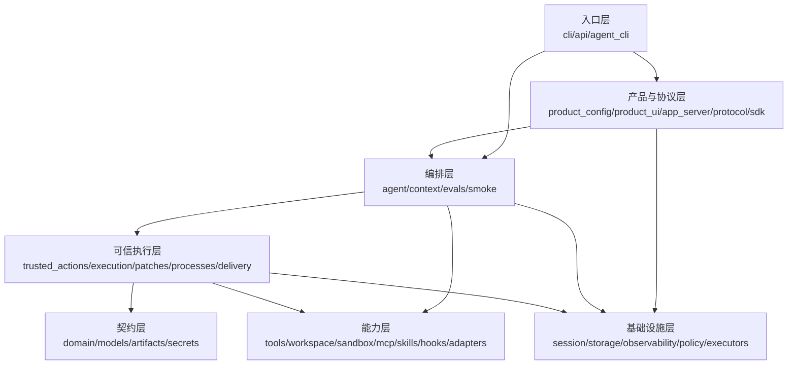
```mermaid
flowchart TD
    Entry[入口层<br/>cli/api/agent_cli]
    Product[产品与协议层<br/>product_config/product_ui/app_server/protocol/sdk]
    Orchestration[编排层<br/>agent/context/evals/smoke]
    Trust[可信执行层<br/>trusted_actions/execution/patches/processes/delivery]
    Capability[能力层<br/>tools/workspace/sandbox/mcp/skills/hooks/adapters]
    Domain[契约层<br/>domain/models/artifacts/secrets]
    Infra[基础设施层<br/>session/storage/observability/policy/executors]

    Entry --> Product
    Entry --> Orchestration
    Product --> Orchestration
    Orchestration --> Trust
    Orchestration --> Capability
    Trust --> Capability
    Trust --> Domain
    Product --> Infra
    Orchestration --> Infra
    Trust --> Infra
```

图表示期望的责任方向，不是当前Python import的严格DAG。0.9.0基线记录了164条顶层包依赖边和一个包含`agent/artifacts/context/execution/models/patches/processes/secrets/session/tools/workspace`的强连通分量；这是已知结构债务，不应通过新增跨包内部导入继续扩大。机器证据见[可读性基线](baselines/readability-0.9.0-final.json)。

### 8.2 31个顶层包边界

“允许下游”列只列主方向而非穷举导入；跨包复用应优先依赖公开契约或端口。

| 包 | 所有者 | 允许下游 | 禁止旁路 |
|---|---|---|---|
| `adapters` | integrations | `domain`公开契约 | 直接操纵Journal私有Schema |
| `agent` | runtime | `models/context/tools/session`端口及可信执行桥 | Provider SDK对象写入Session；绕过Runtime写事件 |
| `api` | action-plane | 根级`runtime`与协议模型 | 在HTTP Handler内直接执行副作用 |
| `app_server` | product | `protocol/agent/session/artifacts`公开面 | 绕过协议请求账本执行可重试命令 |
| `artifacts` | storage | 自身契约、`session`身份 | 把未经授权的绝对路径暴露给客户端 |
| `context` | runtime | `models/tools/artifacts`只读契约 | 修改Workspace或直接调用Provider |
| `delivery` | execution | `workspace/execution/trusted_actions/tools` | 未校验Snapshot直接发布；绕过事务记录 |
| `domain` | action-plane | Python/Pydantic基础类型 | 反向依赖API、存储或Executor实现 |
| `evals` | quality | 产品公开入口与Eval契约 | 用测试夹具改写生产事实 |
| `execution` | execution | `workspace`与持久计划契约 | 将未持久计划直接交给执行器 |
| `executors` | action-plane | `domain`端口 | 自行更新Action生命周期 |
| `hooks` | extensions | `trusted_actions/execution/secrets` | Hook处理器绕过统一Action Router，或把Binding声明误当成副作用隔离证明 |
| `mcp` | extensions | `trusted_actions/execution/secrets`与MCP契约 | 远端Schema直接获得宿主执行权限 |
| `models` | model | Provider中立契约、Secret引用 | 上游响应对象泄漏进Agent领域模型 |
| `observability` | platform | 标准观测SDK | 日志记录Secret、Prompt正文或未脱敏输出 |
| `patches` | execution | `workspace/execution/artifacts` | 指纹或审批前修改文件 |
| `policy` | action-plane | `domain`只读输入 | 执行工具或修改Journal |
| `processes` | execution | `sandbox/workspace/execution/artifacts` | 未持久Action直接启动高风险进程 |
| `product_config` | product | `models/secrets/session/artifacts/tools/trusted_actions/app_server`公开构造器 | 配置值直接携带明文Secret；状态目录落入Workspace；广告与Router绑定分叉 |
| `product_ui` | product | `sdk/protocol/file_lock`公开合同 | 保存Transcript正文；Widget绕过Session分配Command或推进Cursor |
| `protocol` | product | 协议模型与兼容规则 | 依赖具体Provider或执行器实现 |
| `sandbox` | security | 宿主能力与执行计划 | 把能力探测结果当作已强制隔离证明 |
| `sdk` | product | `protocol` | 猜测Server内部状态或绕过握手 |
| `secrets` | security | 环境/引用解析与脱敏 | Secret进入持久事件、日志或Artifact |
| `session` | storage | `agent`稳定事件契约 | 业务层直接修改SQLite表或跳过CAS |
| `skills` | extensions | `trusted_actions/execution` | Skill文本直接升级为宿主权限 |
| `smoke` | quality | `models`公开Provider契约 | 默认联网、自动重试或无预算请求 |
| `storage` | action-plane | `domain`与数据库驱动 | API/Worker直接改Action表绕过Journal端口 |
| `tools` | execution | `workspace`、Artifact和只读工具契约 | 接收任意绝对路径；把只读工具伪装成写工具 |
| `trusted_actions` | execution | `execution/tools/workspace/domain` | 扩展直接拿到原始Executor或Secret Provider |
| `workspace` | security | 文件系统与锁基础设施 | 通过字符串前缀判断路径归属；忽略链接身份 |

### 8.3 10个根级生产模块归属

| 模块 | 所有者/事实源 | 依赖方向 | 禁止旁路 |
|---|---|---|---|
| `__init__.py` | core/公共导出 | 仅导出稳定公共类型 | 导出包内部实现 |
| `__main__.py` | product/入口 | 单向调用`cli.main` | 复制CLI分派逻辑 |
| `agent_cli.py` | product/交互入口 | `sdk → protocol` | 直接访问Session数据库 |
| `bootstrap.py` | action-plane/装配 | `settings → storage/policy/executors/runtime` | 在装配外创建另一套生命周期 |
| `cli.py` | product/总入口 | 只负责解析和分派 | 在解析器中实现领域逻辑 |
| `file_lock.py` | platform/基础锁 | 被配置和存储模块调用 | 将文件锁等同分布式锁 |
| `licensing.py` | legal/许可输出 | 读取固定许可事实 | 运行时改变授权边界 |
| `runtime.py` | action-plane/服务门面 | `domain/registry/policy/journal/executor` | 跳过Journal提交副作用终态 |
| `settings.py` | platform/基础设置 | 环境到类型化配置 | 保存动态Secret正文 |
| `worker.py` | 旧Action兼容Worker | `journal → runtime` | 无产品入口；禁止新增调用 |

### 8.4 根级模块为什么单独存在

根级模块承担进程入口、装配或兼容性职责，不是与31个业务包并列的领域子系统。把它们留在根级可让入口简单、装配集中；代价是根级代码容易成为跨层便利入口，新增逻辑应优先放回对应包。

| 模块 | 为什么需要/解决的问题 | 上游 → 下游 | 收益与边界 |
|---|---|---|---|
| **__init__.py** | 提供少量稳定的包级公共导出，避免调用方依赖内部文件布局 | 外部Python调用方 → 稳定公共类型/SDK | 保持兼容入口；必须克制导出，内部实现不能自动升级为公共API |
| **__main__.py** | 支持以Python模块方式启动并复用同一个命令行入口 | Python模块启动 → cli.main | 入口行为唯一；不得复制一套CLI分派逻辑 |
| **agent_cli.py** | 提供面向Agent Server的薄客户端命令，不直接操纵存储 | 用户 → SDK → Agent Protocol | 与其他客户端共享协议行为；只做交互和参数转换 |
| **bootstrap.py** | 组合旧Action兼容服务 | Settings → Storage/Policy/Executors/Runtime | 仅冻结调用方迁移；不得从默认产品引用 |
| **cli.py** | 统一解析子命令、许可输出和产品入口分派 | Shell/用户 → 产品子命令/Bootstrap | 进程入口容易发现；不承担领域业务逻辑 |
| **file_lock.py** | 提供配置/本地状态需要的文件级互斥基础 | Product Config/本地存储 → OS文件锁 | 跨进程本地协调；不是跨主机分布式锁，也不替代数据库CAS/Lease |
| **licensing.py** | 输出固定许可/版权事实供命令行使用 | CLI → 静态许可信息 | 避免各命令复制许可文本；不改变运行时权限或产品授权策略 |
| **runtime.py** | 旧Action兼容服务门面 | 冻结调用方 → Action Service → Journal/Executor | 迁移期保持旧恢复语义；不得新增依赖 |
| **settings.py** | 将环境/启动配置解析成有类型、可校验的运行设置 | 环境变量/启动参数 → Bootstrap/CLI | 启动错误尽早暴露；不负责秘密生命周期，不保存动态Secret明文 |
| **worker.py** | 保留旧Ready/Lease执行语义供兼容回归 | 兼容测试 → Journal Lease → Runtime/Executor | 顶层启动已撤销，0.9.1f3删除 |

## 9. 数据流与信任边界

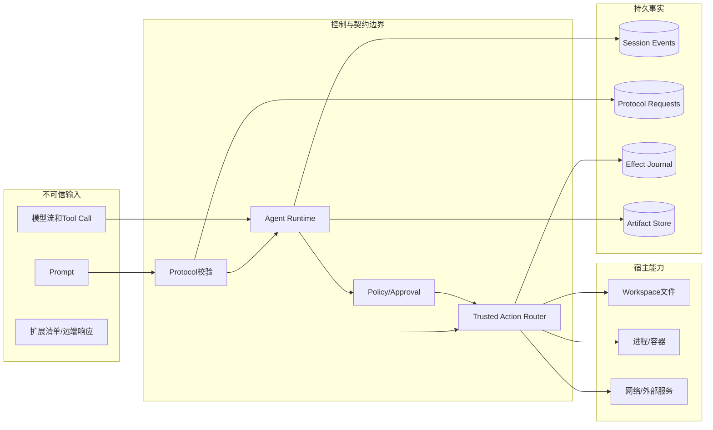
```mermaid
flowchart LR
    subgraph Untrusted[不可信输入]
      Prompt[Prompt]
      ModelOut[模型流和Tool Call]
      Extension[扩展清单/远端响应]
    end
    subgraph Control[控制与契约边界]
      Protocol[Protocol校验]
      Agent[Agent Runtime]
      Policy[Policy/Approval]
      Router[Trusted Action Router]
    end
    subgraph Durable[持久事实]
      Session[(Session Events)]
      Request[(Protocol Requests)]
      Journal[(Effect Journal)]
      Artifact[(Artifact Store)]
    end
    subgraph Host[宿主能力]
      FS[Workspace文件]
      Proc[进程/容器]
      Net[网络/外部服务]
    end

    Prompt --> Protocol --> Agent
    ModelOut --> Agent
    Extension --> Router
    Agent --> Session
    Protocol --> Request
    Agent --> Policy --> Router
    Router --> Journal
    Agent --> Artifact
    Router --> FS
    Router --> Proc
    Router --> Net
```

### 9.1 数据分类

| 数据 | 来源 | 持久位置 | 主要保护 |
|---|---|---|---|
| Product Config | 运维/用户 | 配置文件、`product-config.db`审计 | v2 Schema、Hash、Profile CAS；Secret只存引用 |
| Prompt与消息 | 用户/模型 | Session Event；大正文可外置Artifact | 长度/预算、协议投影、Artifact访问边界 |
| Tool Call与结果 | 模型/Executor | Session Event、Artifact或Effect Journal | Schema、Workspace Scope、Policy、指纹 |
| 审批 | 用户/策略 | Session或Effect Journal | `approval_id`、请求指纹、唯一决定 |
| Secret | 环境或Secret Provider | 不写入业务持久层 | 引用解析、使用点注入、日志脱敏 |
| Trace/Metric/Log | 各组件 | 配置的观测后端 | 有界属性、稳定ID、敏感字段过滤 |

不存在“模型输出即可信命令”的路径。Tool参数、扩展描述和远端结果都按不可信数据处理。

## 10. 核心状态模型

### 10.1 Protocol连接

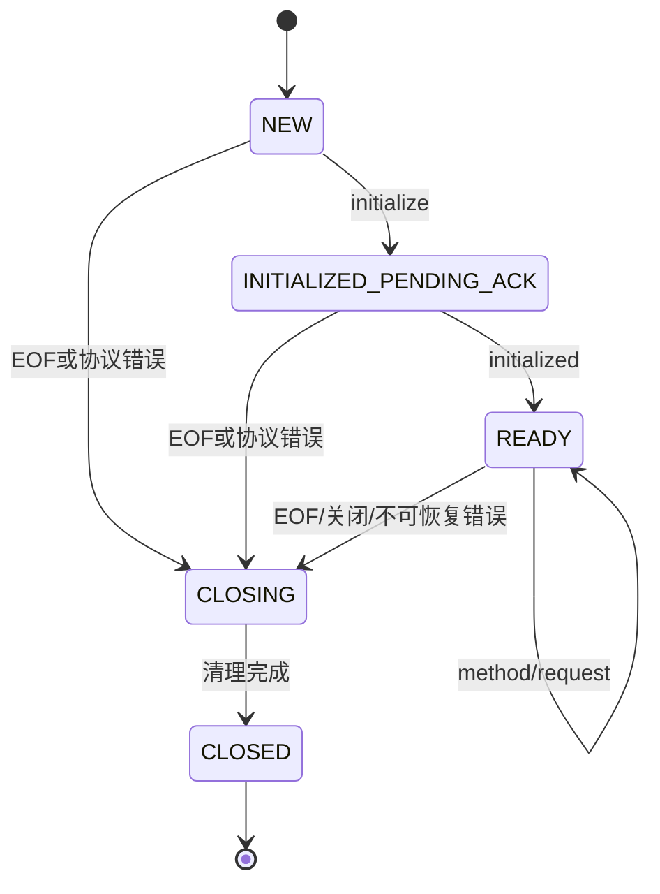
```mermaid
stateDiagram-v2
    [*] --> NEW
    NEW --> INITIALIZED_PENDING_ACK: initialize
    INITIALIZED_PENDING_ACK --> READY: initialized
    READY --> READY: method/request
    NEW --> CLOSING: EOF或协议错误
    INITIALIZED_PENDING_ACK --> CLOSING: EOF或协议错误
    READY --> CLOSING: EOF/关闭/不可恢复错误
    CLOSING --> CLOSED: 清理完成
    CLOSED --> [*]
```

Server在`READY`前拒绝业务方法；协议版本不等于`1.0`时握手失败。JSON-RPC、严格解码、公共投影、Replay游标与持久命令账本见[Protocol模块设计](modules/protocol.md)，连接执行见[AgentProtocolServer](../src/harnessix/app_server/server.py)，合同测试见[Server SDK测试](../tests/app_server/test_server_sdk.py)。当前`AgentClient`会在Transport写入前校验广告方法、协商`maxMessageBytes`和`maxReplayEvents`；`SubprocessAgentTransport`仍以构造期Reader上限分配缓冲，`maxPendingRequests`与`maxOutboundMessages`尚未形成完整客户端容量控制，不能把初始化返回值全部解释为动态强制配额。

### 10.2 Turn生命周期

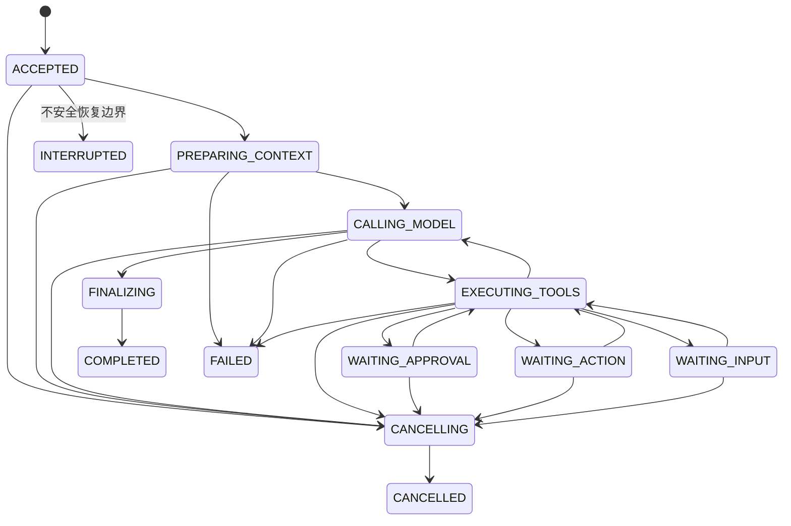
```mermaid
stateDiagram-v2
    [*] --> ACCEPTED
    ACCEPTED --> PREPARING_CONTEXT
    PREPARING_CONTEXT --> CALLING_MODEL
    CALLING_MODEL --> EXECUTING_TOOLS
    CALLING_MODEL --> FINALIZING
    EXECUTING_TOOLS --> CALLING_MODEL
    EXECUTING_TOOLS --> WAITING_APPROVAL
    EXECUTING_TOOLS --> WAITING_ACTION
    EXECUTING_TOOLS --> WAITING_INPUT
    WAITING_APPROVAL --> EXECUTING_TOOLS
    WAITING_ACTION --> EXECUTING_TOOLS
    WAITING_INPUT --> EXECUTING_TOOLS
    FINALIZING --> COMPLETED
    ACCEPTED --> CANCELLING
    PREPARING_CONTEXT --> CANCELLING
    CALLING_MODEL --> CANCELLING
    EXECUTING_TOOLS --> CANCELLING
    WAITING_APPROVAL --> CANCELLING
    WAITING_ACTION --> CANCELLING
    WAITING_INPUT --> CANCELLING
    CANCELLING --> CANCELLED
    ACCEPTED --> INTERRUPTED: 不安全恢复边界
    PREPARING_CONTEXT --> FAILED
    CALLING_MODEL --> FAILED
    EXECUTING_TOOLS --> FAILED
```

终态为`COMPLETED/FAILED/CANCELLED/INTERRUPTED`。图省略了多个活动态直接失败的边，以保持可读性；权威枚举和Reducer见[agent/models.py](../src/harnessix/agent/models.py)与[agent/reducer.py](../src/harnessix/agent/reducer.py)。

### 10.3 Action生命周期

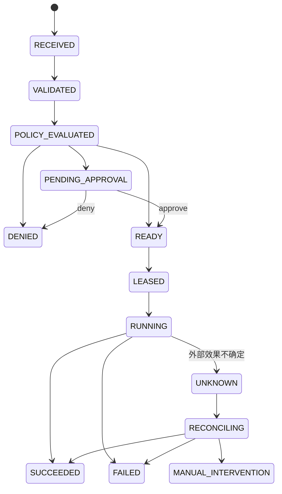
```mermaid
stateDiagram-v2
    [*] --> RECEIVED
    RECEIVED --> VALIDATED
    VALIDATED --> POLICY_EVALUATED
    POLICY_EVALUATED --> DENIED
    POLICY_EVALUATED --> PENDING_APPROVAL
    POLICY_EVALUATED --> READY
    PENDING_APPROVAL --> READY: approve
    PENDING_APPROVAL --> DENIED: deny
    READY --> LEASED
    LEASED --> RUNNING
    RUNNING --> SUCCEEDED
    RUNNING --> FAILED
    RUNNING --> UNKNOWN: 外部效果不确定
    UNKNOWN --> RECONCILING
    RECONCILING --> SUCCEEDED
    RECONCILING --> FAILED
    RECONCILING --> MANUAL_INTERVENTION
```

Action领域模型、端口及其当前强弱约束见[Domain模块设计](modules/domain.md)，服务状态转换见[根级runtime.py](../src/harnessix/runtime.py)，双后端Schema、Migration、事务、Claim与恢复见[Storage模块设计](modules/storage.md)。`UNKNOWN`不是普通失败，也不是终态成功；它禁止无证据自动重放。

### 10.4 稳定身份

| 身份 | 作用域 | 用途 |
|---|---|---|
| `client_instance_id + request_id` | Protocol命令 | 重试返回同一结果或报指纹冲突 |
| `thread_id` | Workspace会话 | Session事件流、Artifact授权和并发锁 |
| `turn_id` | 单次用户任务 | 预算、取消、恢复、用量和终态 |
| `call_id` | 模型Tool Call | Tool Result排序、审批和恢复关联 |
| `approval_id + fingerprint` | 高风险请求 | 防止批准对象被替换 |
| `action_id + idempotency_key` | 旧Action兼容内核 | 迁移数据的副作用唯一性与对账 |
| `plan_id/transaction_id` | 可信执行/交付 | 计划、快照、执行结果和恢复 |

### 10.5 关键接口契约

| 接口/方法 | 调用者 → 实现者 | 输入/输出 | 错误、取消与超时 | 幂等/顺序与权限 |
|---|---|---|---|---|
| `ModelProvider.stream` | `AgentRuntime` → Provider Adapter | `ModelRequest` → Async `ProviderEvent` | Provider错误分类；由Turn预算和Cancel Token停止消费 | 单次Attempt有稳定身份；Provider无Workspace权限 |
| `SessionStore.append` | Runtime → Session Store | `EventDraft[] + expected_sequence` → `Thread` | 存储错误或CAS冲突；不产生半组Event | 单事务追加并按序Reducer；只有Owner Runtime写 |
| `ScopedToolRuntime.execute` | Agent → Tool Runtime | `thread_id/turn_id/call` → Tool Result | 有界取消/超时；参数或路径失败关闭 | Tool Contract决定效果类别；Workspace Scope授权 |
| `ProtocolRequestStore.claim` | App Service → Request Store | 客户端、请求、方法、Payload → Claim | 指纹冲突不可重试；存储失败不执行业务操作 | 相同身份/同Payload重放同一结果 |
| `AgentRuntime.reply_approval` | App Service → Agent | 审批ID、指纹、决定 → `Turn` | 过期、关闭、ID或指纹不匹配均拒绝 | 相同决定幂等，不同决定冲突；只授权绑定请求 |
| `EffectJournal.claim_ready` | Worker → Journal | Worker、Lease时长 → Action | 无Ready返回空；存储失败不执行 | 原子Claim；仅Lease持有者可推进 |
| `Executor.execute/reconcile` | Action Service → Tool Executor | 已验证Action → Outcome | 执行结果未知进入`UNKNOWN`；Reconcile有界 | 写工具声明幂等/对账；不能直接改Journal |
| `WorkspaceTransactionRuntime.publish` | 宿主 → Delivery | Transaction、Root、审批指纹、Lease → Record | Lease丢失、来源漂移或效果未知；无通用自动重试 | Plan指纹、Snapshot、游标和before/after证明 |

### 10.6 重点数据字段

| 结构/字段 | 类型/必填 | 来源与约束 | 敏感级别 | 持久化与兼容 |
|---|---|---|---|---|
| `Budget.max_steps` | 正整数/是 | 客户端或默认配置；限制Agent循环 | 非敏感 | `TurnStarted`事实；旧事件按Upcaster兼容 |
| `Budget.max_tokens` | 正整数/是 | 限制累计Provider用量 | 非敏感 | Session Event；成本计算引用Usage |
| `Budget.timeout_seconds` | 正数/是 | Turn墙钟截止预算 | 非敏感 | 开始时间与预算持久化；恢复重新计算剩余时间 |
| `Turn.status` | `TurnStatus`/是 | 仅合法Event转换产生 | 非敏感 | Event投影；Event v19仍可读取旧版本 |
| `AgentEvent.sequence` | 递增整数/是 | Session Store分配 | 非敏感 | SQLite唯一顺序；CAS和Replay游标 |
| `ToolCallContent.call_id` | 字符串/是 | Provider规范化层 | 非敏感 | Session Event；关联审批、结果和恢复 |
| `ApprovalContent.request_fingerprint` | SHA-256样式摘要/是 | 对批准对象的规范化内容计算 | 安全敏感元数据 | Session Event；响应必须精确匹配 |
| `ProtocolRequestRecord.params_sha256` | SHA-256摘要/是 | 方法和规范化Params共同计算 | 受控摘要 | Protocol Request表；阻止请求键换方法或Payload |
| `ActionRequest.idempotency_key` | 条件必填 | 调用者；写工具按Definition要求 | 非敏感 | Effect Journal唯一性范围；冲突拒绝 |
| `ActionSnapshot.status` | `ActionStatus`/是 | 旧Action Service/Journal转换 | 非敏感 | 迁移兼容SQLite/PostgreSQL Journal；非法转换拒绝 |
| `TraceContext` | trace/span身份/可选 | 上游或运行时 | 受控元数据 | Session/Journal和观测属性；不得承载Secret |
| Product `secret_ref` | 字符串引用/条件必填 | 配置文件 | 敏感引用，不是Secret正文 | 配置Snapshot；正文只在运行时解析 |
| `WorkspaceTransactionRecord.cursor` | 非负整数/是 | 每个成员效果证明后递增 | 非敏感 | Delivery Store；用于中断恢复 |

### 10.7 领域模型关系与边界

以下图画的是领域身份和事实归属，不是数据库外键图。一次高层操作会跨多个独立账本；箭头表示业务关联或派生关系，不承诺跨存储原子提交。

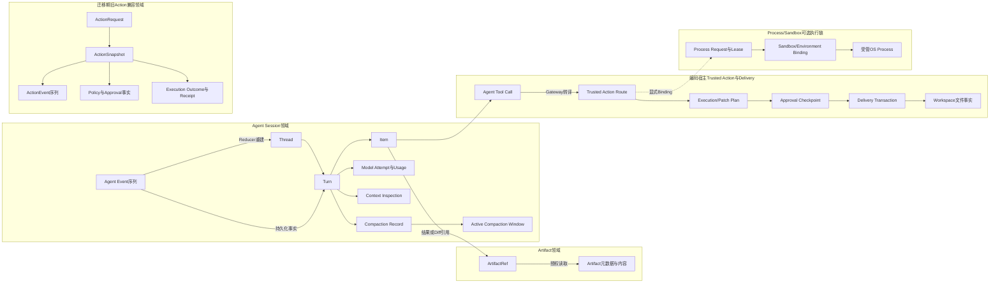
```mermaid
flowchart LR
    subgraph AgentLedger[Agent Session领域]
        Thread[Thread]
        Turn[Turn]
        Item[Item]
        Event[Agent Event序列]
        Attempt[Model Attempt与Usage]
        Context[Context Inspection]
        Compact[Compaction Record]
        Window[Active Compaction Window]
        Thread --> Turn --> Item
        Turn --> Attempt
        Turn --> Context
        Turn --> Compact --> Window
        Event -->|Reducer重建| Thread
        Event -->|持久化事实| Turn
    end
    subgraph ArtifactLedger[Artifact领域]
        Ref[ArtifactRef]
        Blob[Artifact元数据与内容]
        Ref -->|授权读取| Blob
    end
    Item -->|结果或Diff引用| Ref
    subgraph LegacyAction[迁移期旧Action兼容领域]
        Request[ActionRequest]
        Snapshot[ActionSnapshot]
        AEvent[ActionEvent序列]
        Decision[Policy与Approval事实]
        Outcome[Execution Outcome与Receipt]
        Request --> Snapshot
        Snapshot --> AEvent
        Snapshot --> Decision
        Snapshot --> Outcome
    end
    subgraph TrustedExecution[编码宿主Trusted Action与Delivery]
        Call[Agent Tool Call]
        Route[Trusted Action Route]
        Plan[Execution/Patch Plan]
        Checkpoint[Approval Checkpoint]
        Tx[Delivery Transaction]
        FS[Workspace文件事实]
        Call -->|Gateway转译| Route --> Plan --> Checkpoint --> Tx --> FS
    end
    Item --> Call
    subgraph ProcessBoundary[Process/Sandbox可选执行链]
        Process[Process Request与Lease]
        Binding[Sandbox/Environment Binding]
        OS[受管OS Process]
        Process --> Binding --> OS
    end
    Route -. 显式Binding .-> Process
```

#### 领域模型分层说明

1. **Agent会话领域**以Thread作为会话身份，以Turn表达一次运行，以Item表达语义内容；Event是不可变事实，Thread/Turn等对象是Reducer生成的投影。Context检查、Attempt和Compaction记录服务于模型调用及恢复，不能取代原始Item/Event。
2. **旧Action兼容领域**以ActionRequest/ActionSnapshot/ActionEvent表达0.1通用工具生命周期，只服务已登记迁移调用方，不是1.0产品入口。
3. **Trusted Action领域**是Coding宿主唯一新增能力边界。Gateway将Agent Tool Call翻译成Router Route，再关联Execution、Delivery、Process或外部效果专用合同；新能力不得投影回旧ActionRequest。
4. **Artifact领域**保存大内容和授权引用，Session只保存引用/摘要；Artifact提交与Session Event提交不在同一事务中。没有有效Thread/用途范围的引用不能仅凭ID读取。
5. **Workspace/Delivery领域**中，Workspace Snapshot记录观察到的文件版本，Workspace Lease提供协调所有权，Delivery Transaction记录逐成员发布和恢复游标；文件系统才是最终文件内容的事实源，数据库记录不能代替重新观察。
6. **审批身份不可混为一谈**：Session中的审批Item用于展示及恢复用户交互；新执行许可只由Router Approval Checkpoint约束。兼容调用方在迁移前仍核对旧审批记录，但不得据此批准新Trusted Action。

### 10.8 关键数据模型、身份与持久事实

| 数据模型/集合 | 主身份与关系 | 权威事实及持久位置 | 用途、敏感性与恢复边界 |
|---|---|---|---|
| Thread/Turn/Item | thread_id；turn_id属于Thread；item_id在会话/继承历史范围内唯一；call_id关联模型工具调用 | Agent Event序列；SQLite Session Store将其Reducer为当前投影 | 保存历史、交互和状态；Session文本可能含代码/提示，按工作区数据保护 |
| Agent Event | thread_id + sequence；Event改变Thread、Turn或Item投影 | Session事件表，追加并经expected_sequence CAS | 可重放的业务事实；序号是Thread流内顺序，不等于全局墙钟顺序 |
| Attempt/Usage | 归属turn_id；Usage汇总多个Model Attempt和Compaction尝试 | Session事件与Turn投影 | 解释调用、失败和消耗；Token用量依赖Provider报告，不保证精确计费金额 |
| Tool Call/Result/Approval | call_id；approval_id与请求fingerprint绑定；Result关联对应Call | Session Item/Event；实际许可另由Action或Trusted Action账本保存 | 实现排序、用户等待和恢复；不能仅凭Session结果推断外部副作用成功 |
| Context/Compaction | 归属Thread/Turn/Model Step；window_id/compaction_id组成线性窗口链 | Session检查、摘要Attempt及激活窗口；原始Items不删除 | 保存来源版本、预算决定和压缩恢复点；动态来源正文仍可能依赖Workspace可用 |
| Protocol Request | client_instance_id + request_id；记录方法与参数指纹 | Session数据库内的Protocol Request表 | 写命令响应丢失时去重并拒绝同身份换参；客户端重启需保留身份才能重试 |
| Product Config Snapshot/Audit | 配置Snapshot Hash、Profile及活动版本 | 独立product-config SQLite库，保存Snapshot并CAS活动指针 | 审计配置变更和Profile选择；Secret正文仅运行时解析 |
| Artifact元数据/内容 | artifact_id、用途、摘要、大小、访问Scope；调用方持有ArtifactRef | Artifact Store SQLite元数据与内容 | 大结果有界分页读取；与Session/Delivery无跨Store原子性，可能留下受控孤儿 |
| 旧ActionRequest/Snapshot/Event | action_id；租户范围可有idempotency_key；Event按Action序列推进 | 迁移期Effect Journal | 只用于兼容恢复和归档；不作为1.0公共合同 |
| Trusted Action Route/Execution Plan | route/plan身份、调用身份、规范化Request Fingerprint及审批绑定 | Trusted Action/Execution SQLite计划账本 | 固定宿主能力和待执行对象；计划记录不等同副作用成功，需Executor/Receipt证明 |
| Workspace Observation/Snapshot/Lease | Workspace Scope、规范资源、Revision及Lease/Fencing身份 | 文件系统观察为内容事实；Lease/Snapshot合同由Workspace相关存储维护 | 防越界、竞态和旧持有者提交；版本须经重新观察/校验 |
| Delivery Transaction/Blob | transaction_id、Plan/Request指纹、成员顺序和cursor | Delivery SQLite记录及私有Blob；文件系统保存已发布成员 | 支持逐成员恢复；状态须与真实文件效果对账，不具通用多文件原子性 |
| Process/Sandbox运行事实 | Process Action身份、Lease、启动绑定、输出观察和能力Evidence | Process/Supervisor与Sandbox相关存储 | 限时、取消、观察与恢复；退出码或容器探测不足以证明所有外部效果 |
| Trace/日志/指标 | trace_id/span_id与低基数属性 | 配置的观测后端；不是核心业务账本 | 诊断调用路径，不作为Session/Action恢复来源；禁止记录Secret、Prompt全文和未脱敏结果 |

## 11. 六条系统级时序

### 11.1 正常只读Coding Turn

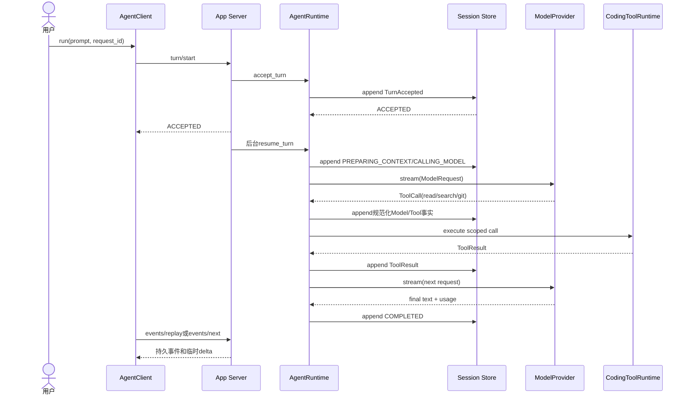
```mermaid
sequenceDiagram
    actor U as 用户
    participant C as AgentClient
    participant S as App Server
    participant R as AgentRuntime
    participant DB as Session Store
    participant M as ModelProvider
    participant T as CodingToolRuntime

    U->>C: run(prompt, request_id)
    C->>S: turn/start
    S->>R: accept_turn
    R->>DB: append TurnAccepted
    DB-->>R: ACCEPTED
    S-->>C: ACCEPTED
    S->>R: 后台resume_turn
    R->>DB: append PREPARING_CONTEXT/CALLING_MODEL
    R->>M: stream(ModelRequest)
    M-->>R: ToolCall(read/search/git)
    R->>DB: append规范化Model/Tool事实
    R->>T: execute scoped call
    T-->>R: ToolResult
    R->>DB: append ToolResult
    R->>M: stream(next request)
    M-->>R: final text + usage
    R->>DB: append COMPLETED
    C->>S: events/replay或events/next
    S-->>C: 持久事件和临时delta
```

关键顺序是“先持久化接受，再异步驱动”。即使Server在响应后、后台任务调度前退出，重开后同一`request_id`仍能得到原Turn并继续。多只读Tool Call可按受控前缀并行执行，但结果按Provider原始顺序持久化。实现主线见[Application Service](../src/harnessix/app_server/service.py)、[AgentRuntime._drive](../src/harnessix/agent/runtime.py)和[Tool调度测试](../tests/agent/test_tool_scheduling.py)。

### 11.2 审批后执行

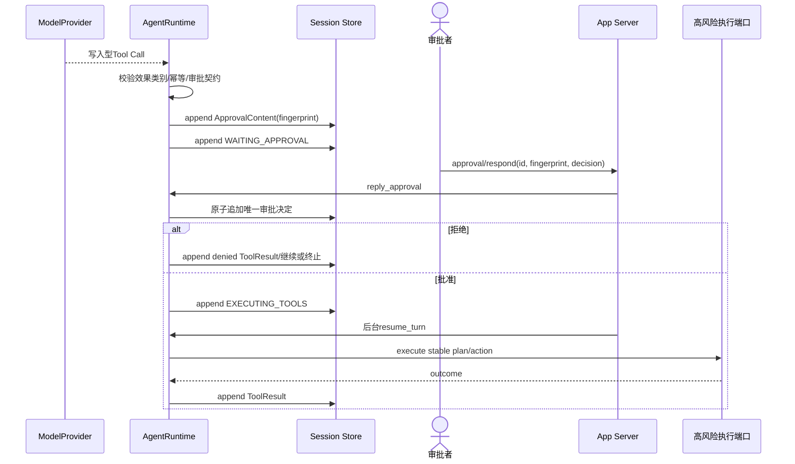
```mermaid
sequenceDiagram
    participant M as ModelProvider
    participant R as AgentRuntime
    participant DB as Session Store
    actor U as 审批者
    participant S as App Server
    participant X as 高风险执行端口

    M-->>R: 写入型Tool Call
    R->>R: 校验效果类别/幂等/审批契约
    R->>DB: append ApprovalContent(fingerprint)
    R->>DB: append WAITING_APPROVAL
    U->>S: approval/respond(id, fingerprint, decision)
    S->>R: reply_approval
    R->>DB: 原子追加唯一审批决定
    alt 拒绝
        R->>DB: append denied ToolResult/继续或终止
    else 批准
        R->>DB: append EXECUTING_TOOLS
        S->>R: 后台resume_turn
        R->>X: execute stable plan/action
        X-->>R: outcome
        R->>DB: append ToolResult
    end
```

响应必须同时匹配`approval_id`和原请求指纹；重复相同决定返回已保存事实，不同决定报冲突。审批不是执行权限的永久提升，只对绑定请求有效。实现见[AgentRuntime.reply_approval](../src/harnessix/agent/runtime.py)和[审批崩溃恢复测试](../tests/agent/test_approval_crash_recovery.py)。

### 11.3 取消

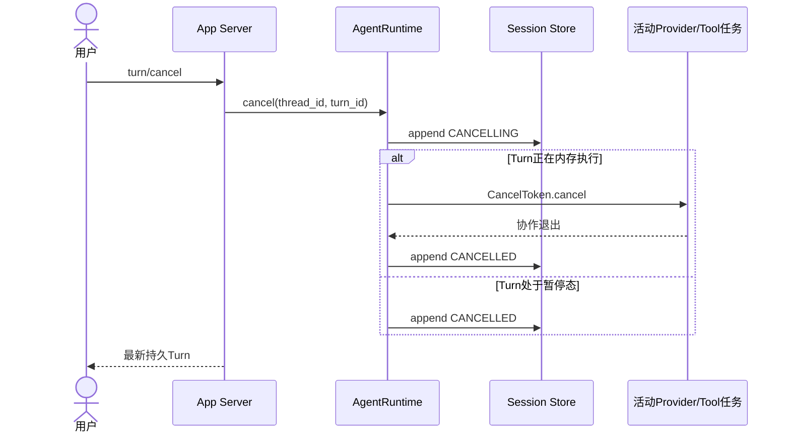
```mermaid
sequenceDiagram
    actor U as 用户
    participant S as App Server
    participant R as AgentRuntime
    participant DB as Session Store
    participant W as 活动Provider/Tool任务

    U->>S: turn/cancel
    S->>R: cancel(thread_id, turn_id)
    R->>DB: append CANCELLING
    alt Turn正在内存执行
        R->>W: CancelToken.cancel
        W-->>R: 协作退出
        R->>DB: append CANCELLED
    else Turn处于暂停态
        R->>DB: append CANCELLED
    end
    S-->>U: 最新持久Turn
```

取消是持久意图，不等同于直接取消Python Task。Provider、Tool或Process必须在契约允许的边界响应取消；外部非幂等效果若已越过提交边界，仍按对应Action/Process对账语义处理。实现见[agent/cancellation.py](../src/harnessix/agent/cancellation.py)、`AgentRuntime.cancel`及[交互测试](../tests/agent/test_interactions.py)。

### 11.4 宿主崩溃与恢复

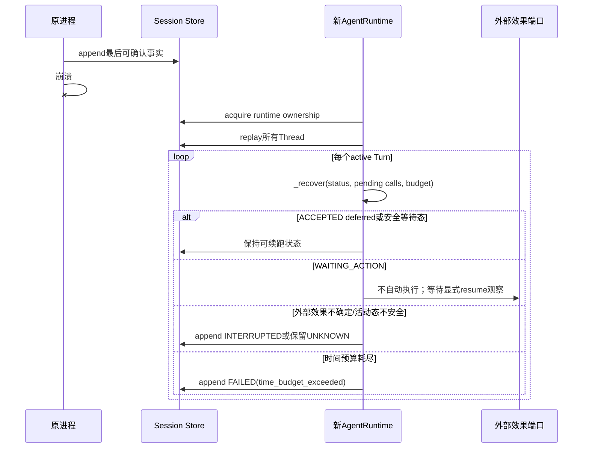
```mermaid
sequenceDiagram
    participant Old as 原进程
    participant DB as Session Store
    participant New as 新AgentRuntime
    participant E as 外部效果端口

    Old->>DB: append最后可确认事实
    Old-xOld: 崩溃
    New->>DB: acquire runtime ownership
    New->>DB: replay所有Thread
    loop 每个active Turn
        New->>New: _recover(status, pending calls, budget)
        alt ACCEPTED deferred或安全等待态
            New->>DB: 保持可续跑状态
        else WAITING_ACTION
            New->>E: 不自动执行；等待显式resume观察
        else 外部效果不确定/活动态不安全
            New->>DB: append INTERRUPTED或保留UNKNOWN
        else 时间预算耗尽
            New->>DB: append FAILED(time_budget_exceeded)
        end
    end
```

恢复只使用持久事实，不依据丢失的内存Future。`ACCEPTED`的deferred Turn尚未调用Provider，可安全续跑；审批、问题和Process等待保持原状态；无法证明安全的活动操作不会自动重放。实现见[AgentRuntime._recover](../src/harnessix/agent/runtime.py)、[SQLiteSessionStore](../src/harnessix/session/sqlite.py)和[恢复测试](../tests/agent/test_crash_recovery.py)。

### 11.5 事务性交付（显式装配能力）

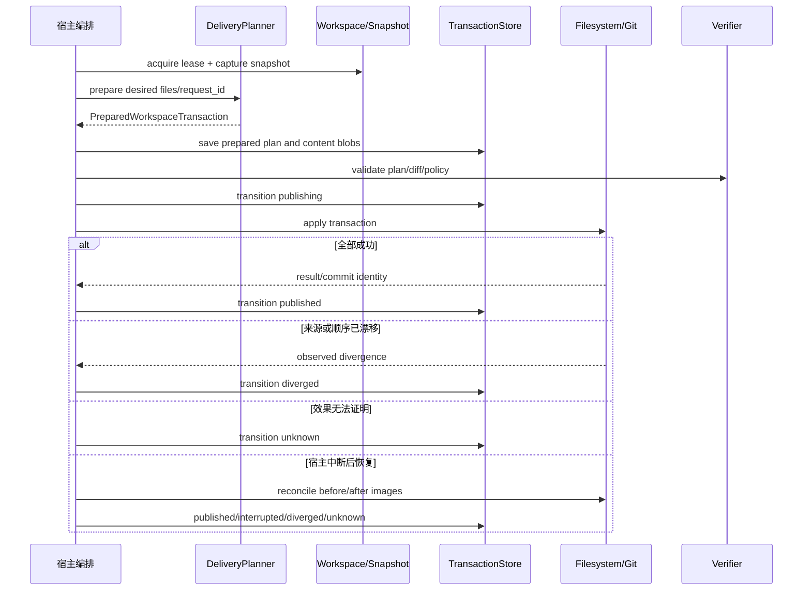
```mermaid
sequenceDiagram
    participant H as 宿主编排
    participant P as DeliveryPlanner
    participant WS as Workspace/Snapshot
    participant J as TransactionStore
    participant F as Filesystem/Git
    participant V as Verifier

    H->>WS: acquire lease + capture snapshot
    H->>P: prepare desired files/request_id
    P-->>H: PreparedWorkspaceTransaction
    H->>J: save prepared plan and content blobs
    H->>V: validate plan/diff/policy
    H->>J: transition publishing
    H->>F: apply transaction
    alt 全部成功
        F-->>H: result/commit identity
        H->>J: transition published
    else 来源或顺序已漂移
        F-->>H: observed divergence
        H->>J: transition diverged
    else 效果无法证明
        H->>J: transition unknown
    else 宿主中断后恢复
        H->>F: reconcile before/after images
        H->>J: published/interrupted/diverged/unknown
    end
```

该时序描述通用Delivery库的宿主组合方式，不是默认POSIX Workspace Patch的完整调用链；默认Patch通过Gateway/Router接入该事务能力，精确交互见[11.6时序](#116-默认posix-workspace-patch时序)。交付计划和正文Blob先以`prepared`状态落盘；发布后逐成员推进游标，成功进入`published`。Workspace Lease和Snapshot防止静默覆盖并发修改；恢复通过比较每个成员的before/after镜像判断`published/interrupted/diverged/unknown`，不会用不存在的通用“失败”状态掩盖部分副作用。Git Worktree/Push仍需独立装配，Push还需要认证和发布策略。实现见[delivery/planner.py](../src/harnessix/delivery/planner.py)、[delivery/store.py](../src/harnessix/delivery/store.py)、[delivery/filesystem.py](../src/harnessix/delivery/filesystem.py)及[Delivery测试](../tests/delivery/)。

### 11.6 默认POSIX Workspace Patch时序

本时序是当前默认POSIX产品中`apply_patch_batch`的纵向链。它展示Agent Session投影、Trusted Action Router权威账本、Review Artifact和Delivery Transaction之间的边界。它不适用于Windows默认只读装配；固定Profile Process使用下一节独立时序。

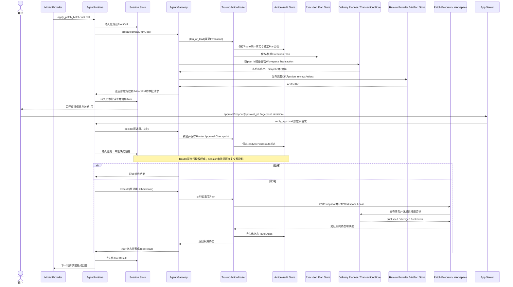
```mermaid
sequenceDiagram
    actor U as 用户
    participant M as Model Provider
    participant R as AgentRuntime
    participant S as Session Store
    participant G as Agent Gateway
    participant T as TrustedActionRouter
    participant A as Action Audit Store
    participant P as Execution Plan Store
    participant D as Delivery Planner / Transaction Store
    participant V as Review Provider / Artifact Store
    participant X as Patch Executor / Workspace
    participant App as App Server

    M-->>R: apply_patch_batch Tool Call
    R->>S: 持久化规范Tool Call
    R->>G: prepare(thread, turn, call)
    G->>T: plan_or_load(规范Invocation)
    T->>A: 保存Route审计事实与稳定Plan身份
    T->>P: 保存/核验Execution Plan
    G->>D: 按plan_id准备受管Workspace Transaction
    D-->>G: 冻结的成员、Snapshot和摘要
    G->>V: 发布完整Diff为action_review Artifact
    V-->>G: ArtifactRef
    G-->>R: 返回绑定指纹和ArtifactRef的审批请求
    R->>S: 持久化审批请求并暂停Turn
    S-->>U: 公开审批信息与Diff引用
    U->>App: approval/respond(approval_id, fingerprint, decision)
    App->>R: reply_approval(绑定原请求)
    R->>G: decide(原调用, 决定)
    G->>T: 校验并保存Router Approval Checkpoint
    T->>A: 保存ready/denied Route状态
    R->>S: 持久化唯一审批决定投影
    Note over S,A: Router是执行授权权威；Session审批是可恢复交互投影
    alt 拒绝
        G-->>R: 稳定拒绝结果
    else 批准
        R->>G: execute(原调用, Checkpoint)
        G->>T: 执行已批准Plan
        T->>X: 校验Snapshot并获取Workspace Lease
        X->>D: 发布事务并逐成员推进游标
        D-->>X: published / diverged / unknown
        X-->>T: 受证明的终态和摘要
        T->>A: 持久化终态Route/Audit
        T-->>G: 返回权威终态
        G-->>R: 核对终态并形成Tool Result
    end
    R->>S: 持久化Tool Result
    R->>M: 下一轮请求或最终回答
```

**时序说明。** 第一个可恢复事实是Router记录的规范Action Route；Plan、审批和执行都绑定相同的稳定`plan_id`与调用身份。Review Provider先将完整Diff存为`action_review` Artifact，再把引用放入Session审批项；两者之间崩溃可能留下有界孤儿，但没有Session反向引用的Artifact不能被协议客户端读取。用户决定必须匹配`approval_id`及请求指纹。Agent Session负责持久化交互事实和恢复投影，Router中的Approval Checkpoint才授权执行；如果两份账本间发生崩溃，恢复以Router事实校正Session，不重复危险效果。

批准后，Executor重新核验计划及Workspace Snapshot，获取Fencing Lease，并调用与`plan_id`绑定的Delivery Transaction。事务对成员逐个发布并记录游标；取消只在合同允许的成员边界生效。完全匹配预期after镜像才证明成功；部分提交、外部修改或效果不确定分别按`interrupted`、`diverged`或`unknown`处理，不盲目重试。终态回到Agent后先持久化Tool Result，之后才会进入下一次模型请求。核心实现见[Agent Session Runtime](../src/harnessix/agent/trusted_action_runtime.py)、[Gateway](../src/harnessix/trusted_actions/agent_gateway.py)、[Router](../src/harnessix/trusted_actions/router.py)、[Workspace Patch Delivery](../src/harnessix/delivery/trusted_action.py)和[Artifact Store](../src/harnessix/artifacts/sqlite.py)；验证见[Trusted Action Patch测试](../tests/delivery/test_trusted_action_patch.py)、[Gateway恢复测试](../tests/agent/test_trusted_action_runtime.py)及[Router测试](../tests/trusted_actions/test_agent_gateway.py)。
\n### 11.7 固定Profile Process审批、取消与输出时序\n\n```mermaid\nsequenceDiagram\n    participant M as Model\n    participant A as Agent Runtime\n    participant G as Agent Gateway\n    participant R as TrustedActionRouter\n    participant P as Process Executor\n    participant O as Container/Process Owner\n    participant L as Process Lease Store\n    participant F as Artifact Store\n\n    M->>A: run_profile.id(profile, selectors)\n    A->>G: prepare(call)\n    G->>R: plan with verified container context\n    R-->>A: pending approval\n    A-->>A: persist process approval item\n    A->>G: decide(exact fingerprint)\n    G->>R: persist approval checkpoint\n    A->>G: execute\n    G->>R: execute(plan id)\n    R->>P: revalidate and derive execution spec\n    P->>O: run fixed container\n    O->>L: persist lease and output observations\n    alt terminal fact proved\n        L-->>P: exited/failed lease\n        P-->>R: result summary + artifact digest\n        G->>F: publish verified action_output\n        F-->>A: scoped ArtifactRef\n    else cancellation or owner uncertainty\n        R-->>A: unknown\n        A->>G: recover\n        G->>R: reconcile only\n        R->>O: inspect lease; never spawn\n    end\n```\n\nProgram、镜像、环境、网络和资源均不来自模型。输出正文发布晚于Router终态，Session结果引用晚于Artifact发布；任一中间崩溃都\n通过稳定Plan/Process/Artifact身份查询并补齐，不通过重新执行非幂等命令恢复。\n\n
## 12. 持久化与事务边界

| 数据集合 | 所有者与主身份 | 持久形式/事务边界 | 权威用途与恢复/保护边界 |
|---|---|---|---|
| Agent Session | Session Store；thread_id + sequence，turn_id、item_id、call_id在事件内容中关联 | SQLite sessions.db；一次append的事件组以expected_sequence CAS原子提交，Thread等由事件重放投影 | Agent对话/状态的权威事实；支持WAL、迁移校验、重放和Runtime Owner。内容可能包含用户代码及提示，需按会话数据保护 |
| Protocol Request | App Server Request Store；client_instance_id + request_id + 方法/参数指纹 | Session数据库中的独立请求账本；claim/complete/fail各自事务化 | 处理响应丢失后的命令去重；与业务事件仍是不同写阶段，宿主重启后需按记录恢复 |
| Product Config与审计 | Product Config Store；Snapshot Hash、Profile、活动版本 | SQLite product-config.db；Snapshot保存与活动指针CAS分开 | 配置快照、诊断和变更事实；只保存Secret Ref，不保存凭证正文 |
| Artifact元数据与内容 | Artifact Store；artifact_id、用途、digest及Thread/用途范围 | SQLite元数据与内容存储；单Artifact提交，不与Session/Delivery跨库原子提交 | 大结果和Review Diff的权威内容；访问需Scoped授权，崩溃可能留下不可访问孤儿 |
| 旧Action Journal | Effect Journal；action_id、Action序号及可选租户范围idempotency_key | 迁移归档SQLite或PostgreSQL | 不进入产品启动；只用于旧效果核对，0.9.1f3后按保留策略处置 |
| Trusted Action/Execution计划 | Router/Execution Store；Route身份、plan_id、调用身份和指纹 | SQLite计划账本；计划、审批Checkpoint和状态按各自合同保存 | 证明宿主绑定与执行对象；不证明外部副作用已完成，必须核对Action/Delivery/Workspace事实 |
| Workspace Lease与观察 | Workspace模块；规范Scope、资源Revision、Lease所有者及Fencing身份 | 文件系统观察是资源版本事实；Lease/计划记录写入对应本地协调存储 | 防止路径越界、资源漂移和并发发布；不能仅凭旧Snapshot推断当前文件仍未变化 |
| Delivery Transaction与Blob | Delivery Store；transaction_id、源Plan/Request指纹、成员序号和cursor | SQLite元数据与私有Blob；事务状态/游标按成员效果推进 | 支持部分发布后的恢复与差异判断；文件系统副作用与数据库提交无法构成通用原子事务 |
| Process/Sandbox运行记录 | Process/Supervisor；Action身份、Process Lease、启动Binding和输出观察 | Process与Sandbox各自存储合同；外部OS进程/容器状态需重新探测 | 支持启动、输出、取消及保守恢复；持久记录不能替代检查实际进程是否仍运行 |
| Trace/Metric/Log | Observability；trace/span身份和受限属性 | 配置的观测后端 | 诊断数据，不是任何业务状态的恢复权威；禁止记录Secret、完整Prompt或未脱敏输出 |

Session Event、Action Journal、Trusted Action/Execution计划、Artifact及Delivery各自拥有局部事务。系统没有分布式事务；跨存储组合必须明确先写哪个事实、崩溃后哪个模块恢复、重复请求如何去重，以及怎样从外部世界重新证明效果。数据库状态与文件、进程或远端API效果不一致时，以专用观察/对账合同处理，不用单一布尔成功标志覆盖差异。

## 13. 失败与恢复矩阵

| 失败点 | 可观察事实 | 当前语义 | 恢复动作 |
|---|---|---|---|
| 配置/Secret诊断失败 | 启动错误码 | fail closed，不开放stdio | 修复配置后重启 |
| Protocol重复请求 | 已有请求记录 | 相同Payload重放结果；不同Payload冲突 | 客户端保留同一`request_id` |
| Provider限流/协议错误 | Model Attempt与错误 | 按可重试性和预算终止或切换 | 显式Retry/Provider策略，不无限重试 |
| Context超预算 | Compaction计划/尝试 | 压缩、失败或终止 | 从持久窗口和尝试账本恢复 |
| 只读Tool失败 | Tool Result | 失败结果反馈模型 | 模型可调整后续调用 |
| 审批期间退出 | Approval事实 | 保持`WAITING_APPROVAL` | 重连后响应同一请求 |
| 进程等待期间退出 | Process Action/Session投影 | 保持`WAITING_ACTION` | 显式resume作有界观察 |
| Patch提交边界不确定 | Patch账本与Workspace事实 | 不自动重复应用 | 通过Digest/Snapshot对账 |
| Action Worker失租 | Lease与Worker ID | 失租Worker不得提交终态 | 新Worker按Journal事实领取/对账 |
| Session写入失败 | 无成功Event或CAS冲突 | 内存状态不算提交 | 重读最新序列并按操作契约重试 |
| stdio背压/客户端退出 | 有界队列与连接关闭 | 停止接收，限时清理后台Turn | 客户端重连、事件Replay |
| 观测后端不可用 | 业务事实仍可提交 | 观测失败不能改变业务结果 | 后端恢复；依靠本地日志/Journal诊断 |

## 14. 并发、幂等与资源边界

- `AgentRuntime`按`thread_id`串行化持久状态变更，同时允许受限数量的只读Tool并行；
- `SQLiteSessionStore`通过`expected_sequence`阻止丢失更新，通过运行时Owner阻止两个Agent Runtime同时拥有同一数据库；
- App Server通过`SQLiteProtocolRequestStore`持久化写命令结果，进程崩溃后仍可识别重试；
- Action Worker必须持有未过期Lease并持续心跳，失租后不得提交执行终态；
- 高风险工具定义必须声明效果类别、审批、幂等和对账能力，构造Runtime时即校验不安全组合；
- `Budget`限制`max_steps`、`max_tokens`、`timeout_seconds`、`max_output_chars`和`max_tool_calls_per_step`；
- stdio pending请求、outbox和关闭等待均有界，Process输出通过捕获限制与Artifact外置避免无界内存增长。

### 14.1 可量化资源上限与指标口径

下表区分“合同/配置上限”与“实测性能指标”。这些数值能够限制单次请求或单个对象的资源消耗，不代表系统吞吐、延迟、模型质量或生产可用性承诺。

| 维度 | 当前合同/默认值 | 解决的问题 | 指标解释与非承诺 |
|---|---|---|---|
| Agent Turn预算 | 默认最多16步、100,000 Token、120秒、65,536输出字符、每步32个Tool Call；Schema分别将步数限制在1–1,000、超时限制在24小时、输出限制在1,000,000字符、每步Tool Call限制在128 | 阻止循环、时长、输出或一次模型响应无限扩张 | 这是默认预算和字段上限，不是平均Token、P95延迟或成本保证 |
| Context输入结构 | 历史文档最多8,192份、Tool文档最多256份，总UTF-8输入文档不超过8 MiB；Context Window合同范围为1,024至10,000,000 Token | 在构建Prompt前限制输入对象规模和Token预算计算规模 | utf8-bytes/v1估算不是Provider真实Tokenizer；10,000,000是合同上限，不是推荐窗口 |
| Artifact单对象与分页 | 单Artifact最多1 MiB和10,000条记录；单页最多24 KiB、200条记录；默认TTL 24小时，可配置60至604,800秒 | 避免大结果进入Session/stdio单帧，并使客户端分段读取 | 是存储/读取合同上限；不意味着客户端一定能在任意网络条件下达到特定吞吐 |
| Artifact累计策略 | 默认每Turn最多4 MiB/128个Artifact，活动内容最多32 MiB；相关Schema允许各上限经配置调整 | 限制长Turn造成的对象数量及活动存储膨胀 | 是配置默认值/边界，不是清理任务的时限或磁盘容量承诺 |
| Action并发所有权 | Worker通过Journal Claim及有期限Lease获取执行权；失租者禁止提交终态 | 防止两个Worker同时认为自己拥有同一Action | 测试覆盖租约竞争与陈旧Worker；未声明可承受的Worker数量或队列吞吐 |
| Workspace交付 | 多文件变更按成员记录游标并对before/after镜像恢复 | 在文件系统无多文件原子事务时识别部分发布 | 这是恢复语义，不等于零停机发布或固定恢复时间 |

当前有合同上限、跨平台测试矩阵和状态机故障测试，但没有固定并发布的端到端吞吐/延迟基准、长会话Soak结果、模型任务成功率或恢复时间目标。性能与可靠性量化需使用固定数据集/环境/模型，报告P50/P95/P99、失败率、重试率、Token/费用、UNKNOWN比例及恢复耗时；在对应基准落地前不得从单元测试或CI通过率推断生产SLO。

## 15. 安全边界

### 15.1 Workspace与文件系统

- Product Config文件和状态目录不得位于Workspace内，状态目录也不得包含Workspace；
- 路径判断使用解析后的身份，不使用字符串前缀；链接、Junction和重解析点按平台规则处理；
- POSIX默认只读Tool要求`O_NOFOLLOW`，不满足时拒绝启动；
- 写入由Patch/Delivery计划、Snapshot、Lease和审批控制，而不是复用只读文件接口。

### 15.2 模型与扩展

- Provider输出、Tool参数、MCP Schema、Skill正文和Hook配置均是不可信输入；
- Model只能调用注册后的稳定工具契约；未知工具、无效参数或效果类别不匹配会失败关闭；
- MCP/Skill/Hook只获得受限`ExtensionActionPort`，不应取得原始宿主执行器；
- 远程MCP/OAuth与受管Egress尚未进入默认产品，不能用现有本地实现推导其安全完成度。

### 15.3 Secret与审计

- Product Config保存Secret引用，启动时由环境Secret Provider解析；
- Secret不得进入Session Event、Artifact、日志、Trace或验证证据；
- 审批保存Actor、Reason、绑定指纹和结果；Action/Trusted Action账本记录状态转换和执行身份；
- 完整攻击面和缓解措施见[威胁模型](threat-model.md)。

## 16. 可观测性

| 信号 | 当前用途 | 关联身份 |
|---|---|---|
| 结构化日志 | 启动、Worker、错误与运维诊断 | service/component、action/thread/turn |
| Trace | Action提交/执行/审批/对账，Agent恢复/取消/审批等操作 | trace context、action/thread/turn |
| Metric | Action吞吐、状态、延迟、Lease与运维指标 | tool、status、component |
| Session/Journal事件 | 业务级可审计事实和重放 | sequence、event/action ID |
| Eval报告 | 任务成功、检查、成本、Token和延迟 | campaign/run/task ID |

观测数据不是业务提交事实；恢复与重放必须依据已持久化的Session或Action。Agent `KernelTelemetry`已保证Observer故障不改变Turn结果，但Action/API主链的直接Observer调用尚未统一隔离，不能把该保证外推到所有调用点。信号合同、持久Trace、单位缺陷、日志与异常隐私边界见[Observability模块设计](modules/observability.md)，验证见[observability flow](../tests/integration/test_observability_flow.py)、[OTLP export](../tests/integration/test_otlp_export.py)与[Agent telemetry](../tests/agent/test_telemetry.py)。

## 17. 部署与平台边界

| 形态 | 入口 | 存储 | 平台现状 | 当前用途 |
|---|---|---|---|---|
| 完整终端产品 | `harnessix code` | Workspace私有状态目录 | macOS/Linux/Windows候选 | 交互式Coding Agent |
| 薄CLI | `harnessix agent` | 由子进程Server持有 | 三平台协议客户端 | 自动化和无TUI操作 |
| Headless Agent Server | `harnessix agent-server` | SQLite Session、Artifact、Config与执行账本 | 本地stdio | 唯一产品服务边界 |
| Eval/Smoke | 独立CLI子命令 | 报告/临时状态 | 显式启用 | 受控验证，不是常驻服务 |

Windows原生Handle四项只读Tool已接入默认启动并由CI 34735529084完成真实Runner验收；该证据不等于完整Windows产品支持，Git读取、写入、安装器和长期运行仍未关闭。安装、升级、备份和命令参数见[部署与运行](deployment.md)。

## 18. 核心业务伪代码

### 18.1 产品启动

```text
load ProductConfig v2
select requested profile
resolve workspace and config identities
reject config/state/workspace overlap
resolve Secret references and run offline diagnostics
require supported read-only tool platform
open config audit store
enter provider bundle
initialize and own session store
enter coding tool runtime and agent runtime
CAS activate the exact diagnosed config snapshot
run bounded stdio protocol server
close components in reverse order
```

### 18.2 Protocol写命令

```text
claim(client_instance_id, request_id, method, payload_fingerprint)
if completed: return persisted result
if failed: raise persisted error
if same identity with different payload: reject idempotency conflict
result = execute domain operation
persist completed result
schedule deferred turn only after the accepted result exists
return result
```

### 18.3 Agent Loop

```text
while turn is active and budget remains:
    persist current phase
    prepare provider-neutral context/history
    stream one model attempt
    persist normalized output, usage and pending tool calls
    if no tool calls:
        persist final answer and COMPLETED
        return
    validate every tool contract before side effects
    execute bounded read-only prefix in parallel; writes serially
    persist tool results in provider order
on cancellation: persist deterministic cancellation boundary
on unsafe external uncertainty: preserve waiting/unknown or mark interrupted
```

### 18.4 Trusted Action执行与恢复

```text
plan invocation through the host-owned tool binding
persist immutable execution plan and action audit
if policy requires approval: wait for exact plan decision
reopen plan, binding, workspace and sandbox evidence
execute once through the registered executor
persist succeeded, failed or unknown
if unknown: reconcile by stable effect identity; never replay execute
```

## 19. 源码与测试阅读索引

| 问题 | 先读源码 | 再读测试 |
|---|---|---|
| 命令如何进入产品 | [cli.py](../src/harnessix/cli.py)、[agent_cli.py](../src/harnessix/agent_cli.py) | [test_agent_cli.py](../tests/app_server/test_agent_cli.py) |
| 产品如何安全装配 | [product_config/server.py](../src/harnessix/product_config/server.py) | [test_server_and_cli.py](../tests/product_config/test_server_and_cli.py) |
| 协议如何严格解码、握手、投影、Replay和幂等 | [Protocol模块设计](modules/protocol.md)、[protocol/contracts.py](../src/harnessix/protocol/contracts.py)、[protocol/projection.py](../src/harnessix/protocol/projection.py)、[protocol/requests.py](../src/harnessix/protocol/requests.py) | [protocol测试](../tests/protocol/)、[test_server_sdk.py](../tests/app_server/test_server_sdk.py) |
| Turn如何运行 | [agent/runtime.py](../src/harnessix/agent/runtime.py)、[agent/reducer.py](../src/harnessix/agent/reducer.py) | [test_runtime.py](../tests/agent/test_runtime.py)、[test_tool_scheduling.py](../tests/agent/test_tool_scheduling.py) |
| 只读工具如何约束路径和结果 | [Coding Tool Runtime模块设计](modules/tools.md)、[tools/runtime.py](../src/harnessix/tools/runtime.py) | [tools测试](../tests/tools/) |
| Patch如何冻结计划、批准、落盘和恢复 | [Managed Patch Runtime模块设计](modules/patches.md)、[patches/managed.py](../src/harnessix/patches/managed.py) | [patches测试](../tests/patches/) |
| Execution Plan如何绑定Workspace、环境、Secret、Sandbox、Policy、能力与批准 | [Execution Plan模块设计](modules/execution.md)、[execution/contracts.py](../src/harnessix/execution/contracts.py) | [execution测试](../tests/execution/) |
| Workspace如何规范路径、捕获选择资源事实、校验漂移并提供跨进程Fencing | [Workspace模块设计](modules/workspace.md)、[workspace/snapshot.py](../src/harnessix/workspace/snapshot.py)、[workspace/leases.py](../src/harnessix/workspace/leases.py) | [workspace测试](../tests/workspace/)、[delivery测试](../tests/delivery/) |
| Delivery如何冻结多文件变更、持久Blob、恢复部分效果并形成Git Commit/Push | [Delivery模块设计](modules/delivery.md)、[delivery/filesystem.py](../src/harnessix/delivery/filesystem.py)、[delivery/git.py](../src/harnessix/delivery/git.py)、[delivery/git_push.py](../src/harnessix/delivery/git_push.py) | [delivery测试](../tests/delivery/)、[trusted_actions测试](../tests/trusted_actions/) |
| Coding Eval如何固定历史任务、运行正式Agent、评分、聚合Campaign并恢复 | [Evals模块设计](modules/evals.md)、[evals/runner.py](../src/harnessix/evals/runner.py)、[evals/grader.py](../src/harnessix/evals/grader.py)、[evals/campaign_execution.py](../src/harnessix/evals/campaign_execution.py) | [evals测试](../tests/evals/) |
| Trace如何跨暂停和队列传播、Metric/日志记录什么、Observer故障是否隔离 | [Observability模块设计](modules/observability.md)、[observability/core.py](../src/harnessix/observability/core.py)、[agent/telemetry.py](../src/harnessix/agent/telemetry.py) | [观测单元测试](../tests/unit/test_observability_core.py)、[跨进程测试](../tests/integration/test_observability_flow.py)、[Agent遥测测试](../tests/agent/test_telemetry.py) |
| Sandbox如何探测能力、冻结网络、物化Container并证明清理 | [Sandbox模块设计](modules/sandbox.md)、[sandbox/contracts.py](../src/harnessix/sandbox/contracts.py)、[sandbox/container.py](../src/harnessix/sandbox/container.py) | [sandbox测试](../tests/sandbox/)、[真实Container测试](../tests/integration/test_container_sandbox.py) |
| Secret如何从引用解析、注入并在输出边界阻断泄漏 | [Secrets模块设计](modules/secrets.md)、[secrets/provider.py](../src/harnessix/secrets/provider.py)、[secrets/redaction.py](../src/harnessix/secrets/redaction.py) | [secrets测试](../tests/secrets/)、[Process输出测试](../tests/processes/test_supervisor.py)、[MCP输出测试](../tests/mcp/test_runtime_actions.py) |
| 默认Action Policy如何拒绝、审批和允许 | [Policy模块设计](modules/policy.md)、[policy/default.py](../src/harnessix/policy/default.py) | [test_action_service.py](../tests/integration/test_action_service.py)、[test_action_executor.py](../tests/processes/test_action_executor.py) |
| 状态如何恢复 | [session/sqlite.py](../src/harnessix/session/sqlite.py)、`AgentRuntime._recover` | [test_crash_recovery.py](../tests/agent/test_crash_recovery.py)、[test_session_upgrade.py](../tests/agent/test_session_upgrade.py) |
| Provider如何隔离 | [models/contracts.py](../src/harnessix/models/contracts.py)、[models/config.py](../src/harnessix/models/config.py) | [test_openai_contract.py](../tests/models/test_openai_contract.py)、[test_anthropic_contract.py](../tests/models/test_anthropic_contract.py) |
| 真实Provider固定场景如何限制请求、恢复并生成白名单报告 | [Smoke模块设计](modules/smoke.md)、[smoke/contracts.py](../src/harnessix/smoke/contracts.py)、[smoke/runner.py](../src/harnessix/smoke/runner.py) | [test_runner.py](../tests/smoke/test_runner.py)、[test_cli.py](../tests/smoke/test_cli.py)、[test_interrupt.py](../tests/smoke/test_interrupt.py) |
| 高风险能力如何收口 | [Trusted Actions模块设计](modules/trusted-actions.md)、[trusted_actions/agent_gateway.py](../src/harnessix/trusted_actions/agent_gateway.py)、[trusted_actions/router.py](../src/harnessix/trusted_actions/router.py) | [test_agent_gateway.py](../tests/trusted_actions/test_agent_gateway.py)、[test_trusted_action_runtime.py](../tests/agent/test_trusted_action_runtime.py)、[test_git_push.py](../tests/delivery/test_git_push.py) |
| Trusted Action如何执行和对账 | [Trusted Actions模块设计](modules/trusted-actions.md)、[router.py](../src/harnessix/trusted_actions/router.py) | [Trusted Action测试](../tests/trusted_actions/) |
| 旧Action如何迁移归档 | [Action兼容内核资料](subsystems/action-plane.md)、[0.9.1f详细设计](changes/m09-1f-single-product-runtime-convergence.md) | [收敛治理测试](../tests/governance/test_product_runtime_convergence.py)、旧兼容测试 |
| 交付如何持久化 | [delivery/planner.py](../src/harnessix/delivery/planner.py)、[delivery/store.py](../src/harnessix/delivery/store.py) | [test_planner.py](../tests/delivery/test_planner.py)、[test_store.py](../tests/delivery/test_store.py) |

更细的逐文件阅读顺序见[源码阅读地图](guides/source-reading-map.md)，全部31个包与资料覆盖关系见[追踪矩阵](governance/documentation-traceability.md)。

## 20. 已知限制与后续演进

| 缺口 | 当前影响 | 路线图归属 |
|---|---|---|
| Product UI尚无真实用户终端长期运行和发行物证据 | 0.9.1c三平台CI只证明领域交互与当前矩阵，不能外推长期稳定性和可安装性 | 0.9.3、0.9.5 |
| 外部Action Config安全加载、Doctor能力报告、Product/Action双指针原子CAS和启动全局Route恢复已形成实现候选 | 未取得全量及七任务CI证据前不作为生产已关闭能力 | 0.9.1e5 |
| Windows原生只读链已验证且Patch被明确省略，但无Git/写Tool | 尚不能声明完整Windows产品支持 | 0.9.5 |
| 固定多仓库Eval与Transcript基线未完成 | 无法量化真实软件工程成功率 | 0.9.2 |
| 长会话Soak、并发和故障基准未固定 | 大规模可靠性尚无发布证据 | 0.9.3 |
| 供应链、SBOM、攻击测试和权利链未闭环 | 不满足正式商用发布门槛 | 0.9.4 |
| 三平台发行、升级、恢复和Beta未闭环 | 安装运维仍非最终产品 | 0.9.5 |
| Provider计价和真实Smoke证据仍有限 | 成本与兼容结论不可泛化 | 0.9.6 |
| 顶层包存在一个强连通分量 | 维护边界仍需治理 | 0.9后续结构治理 |

## 21. 变更维护规则

以下变化必须在同一提交更新本文或其链接的现行模块设计：

- 默认产品装配新增或移除组件；
- Protocol、Event Schema、Session Migration或配置版本变化；
- Turn/Action状态、失败语义、恢复或幂等边界变化；
- Workspace、Sandbox、Secret、审批或网络信任边界变化；
- 平台支持和部署拓扑变化；
- 组件所有权或允许依赖方向变化。

重大变更同时使用[重大变更设计模板](governance/templates/change-design-template.md)，并按[文档工程规范](governance/documentation-standard.md)完成源码与测试双向追踪。

## 22. 兼容性与迁移

- Protocol只接受版本`1.0`，握手时校验版本和初始化参数；新增不兼容字段必须升级协议并补兼容矩阵；
- Agent Event允许读取`schema_version` 1～20，当前新事件写20；字段语义由模型校验、Upcast和Reducer共同保证；
- Session Migration文件版本必须从1连续到23，已应用Migration的Checksum变化会失败关闭；
- Product Config当前运行格式是v2，旧配置必须先显式迁移，启动不会静默改写来源文件；
- Protocol Request、Action、Execution Plan和Delivery Record均有独立Schema/版本，不能用一次数据库迁移代替跨边界兼容设计；
- SQLite状态升级前应按[部署文档](deployment.md)备份；迁移失败不得继续开放协议或执行副作用；
- 当前产品不提供从POSIX状态到Windows完整产品运行的发布承诺，三平台迁移和回滚属于0.9.5。

## 23. 测试设计与验收标准

### 23.1 测试分层

| 层级 | 证明内容 | 代表测试 |
|---|---|---|
| 领域/Reducer单元 | 合法状态、非法转换、预算和投影 | [test_runtime.py](../tests/agent/test_runtime.py)、[test_session_contract.py](../tests/agent/test_session_contract.py) |
| 协议合同 | 版本、Schema、请求指纹、投影白名单 | [protocol测试](../tests/protocol/) |
| 产品集成 | 配置诊断、生命周期、stdio、SDK和重连 | [test_server_and_cli.py](../tests/product_config/test_server_and_cli.py)、[test_server_sdk.py](../tests/app_server/test_server_sdk.py) |
| 故障恢复 | Provider/Tool/审批/进程/存储崩溃边界 | [test_crash_recovery.py](../tests/agent/test_crash_recovery.py)、[test_approval_crash_recovery.py](../tests/agent/test_approval_crash_recovery.py) |
| 可信执行 | Patch、Process、Sandbox、Workspace和Delivery边界 | [patches测试](../tests/patches/)、[processes测试](../tests/processes/)、[delivery测试](../tests/delivery/) |
| 兼容内核迁移 | 旧Policy、Lease、UNKNOWN、Reconcile和PostgreSQL在迁移期不退化 | [test_action_service.py](../tests/integration/test_action_service.py)、[test_worker.py](../tests/integration/test_worker.py)、[收敛治理测试](../tests/governance/test_product_runtime_convergence.py) |
| 真实场景 | 固定模型Smoke与Coding Eval Campaign | [smoke测试](../tests/smoke/)、[evals测试](../tests/evals/)及版本化验证证据 |

### 23.2 设计结论与具体测试函数

| 设计结论 | 测试函数/合同 |
|---|---|
| 配置失败不会发布活动Profile或开放协议 | `tests/product_config/test_server_and_cli.py::test_provider_construction_failure_does_not_activate_config`、`::test_runtime_owner_conflict_does_not_activate_or_open_protocol` |
| Protocol握手和命令幂等 | `tests/app_server/test_server_sdk.py::test_handshake_enforces_state_version_and_params`、`::test_agent_sdk_drives_turn_replay_and_duplicate_command` |
| 接受结果可在重启后恢复 | `tests/app_server/test_server_sdk.py::test_completed_ledger_recovers_accepted_turn_after_restart` |
| Tool必须先持久化再执行 | `tests/agent/test_runtime.py::test_multiple_steps_and_calls_are_persisted_before_execution` |
| 取消与时限产生确定终态 | `tests/agent/test_runtime.py::test_user_cancel_during_provider_and_active_turn_conflict`、`::test_time_budget_closes_stream` |
| 并行读取仍按Provider顺序提交 | `tests/agent/test_tool_scheduling.py::test_parallel_read_results_commit_in_provider_order` |
| 活动Tool崩溃不盲目重放 | `tests/agent/test_crash_recovery.py::test_process_crash_recovers_without_replaying_tool` |
| 审批各崩溃边界可恢复 | `tests/agent/test_approval_crash_recovery.py::test_approval_crash_boundaries` |
| Action未知效果只对账不重执行 | `tests/integration/test_action_service.py::test_uncertain_effect_is_reconciled_without_reexecution` |
| 旧Worker终态提交与续租竞态在迁移期不退化 | `tests/integration/test_worker.py::test_execution_commit_wins_renewal_race`、`::test_stale_worker_cannot_advance_state` |
| Agent与Router双账本崩溃后按权威Action事实修复，UNKNOWN只对账 | `tests/agent/test_trusted_action_runtime.py::test_router_first_crash_is_repaired_without_reexecution`、`tests/trusted_actions/test_agent_gateway.py::test_recovery_reconciles_running_action_without_blind_reexecution` |
| 多文件交付崩溃后按镜像恢复 | `tests/delivery/test_filesystem.py::test_reconcile_effect_after_crash_and_resume_remaining_members`、`::test_real_process_exit_after_replace_reconciles_without_repeating_effect` |
| Product与Action活动指针只能原子切换 | `tests/product_config/test_action_config_runtime.py::test_product_and_action_activation_is_atomic_and_hash_chained` |
| 产品冷启动只对账不重放Action | `tests/product_config/test_action_runtime.py::test_startup_recovery_reconciles_without_reexecuting`、`::test_startup_recovery_unknown_fails_closed_without_retry` |
| 预检后的Action配置替换不能复用旧报告 | `tests/product_config/test_server_and_cli.py::test_product_server_rejects_action_config_changed_after_preflight` |

### 23.3 DOC-1.1验收

- [x] 跨模块术语同时解释语义、用途及权威来源/边界；
- [x] 31个顶层包与10个根级模块均说明需求背景、上下游及收益/限制；
- [x] Agent、Trusted Action、迁移兼容Action、Artifact、Workspace和Delivery领域模型及主要数据身份/持久边界有关系图和目录；
- [x] 文档入口到31个生产包源码地图不超过三次跳转；
- [x] 当前默认、显式装配和规划能力分开标注；
- [x] 正常、审批、取消、崩溃恢复和事务性交付均有时序与文字说明；
- [x] 系统组件、40个源码边界和关键设计结论具有源码/测试入口；
- [x] 相对链接、YAML元数据、Mermaid渲染、敏感信息和Markdown格式检查通过；
- [x] 文档变更不修改生产代码，仓库全量质量门禁通过。

## 24. 变更记录

| 文档版本 | 代码版本 | 日期 | 变更摘要 |
|---|---|---|---|
| 49 | `27e0b5918c6497dfe9df10e3f5a9d4c0ed08d8f7` | 2026-09-19 | 同步e5候选的Action安全加载、Doctor、双配置原子CAS、上一配置恢复Router与stdio开放顺序；等待关闭CI |
| 48 | `4b28fa4010bf1f9590f86a3c2e639916043894c2` | 2026-09-19 | 记录0.9.1e4固定Container Process由CI 35434198163完成真实镜像及七任务全矩阵验收 |
| 47 | `030deeb31bb9f2ff64b6ecbd8fd7c98c3419ed86` | 2026-09-19 | 同步0.9.1e4统一Patch/Process产品组合、固定Profile能力探测、Process Owner生命周期、取消只对账和输出Artifact时序；等待全矩阵CI验收 |
| 46 | 809ed2b1a10f5cb462989a12dddf44f83a9d01ab | 2026-09-17 | 补齐跨模块术语词典、31个包与10个根模块的需求背景/上下游/设计取舍、Agent/Action/Trusted Action领域模型关系图及关键数据身份/持久事实目录；扩展存储权威、事务和恢复边界 |
| 45 | `809ed2b1a10f5cb462989a12dddf44f83a9d01ab` | 2026-09-17 | 增补经典4+1视图索引、逻辑组件交互图、Agent Turn流程图、开发视图、部署物理视图和场景校验矩阵；新增默认POSIX Workspace Patch跨账本审批/执行时序；同步0.9.1e3全矩阵关闭状态 |
| 44 | `71a479439edcdd29b863ec3a9bad7a52586dd1bf` | 2026-09-13 | 同步0.9.1e3默认POSIX Workspace Patch、Review Artifact、Delivery事务、Lease、逐成员取消和状态布局；本地完整门禁通过，等待全矩阵CI |
| 43 | `328aa2d6c8ee85a75ab2baef51b80869dc4089a8` | 2026-09-13 | 记录0.9.1e2由[CI 34744116155](https://github.com/carrie1988/Harnessix/actions/runs/34744116155)完成Linux Python 3.12/3.13、macOS、Windows、PostgreSQL、Container和Documentation全矩阵验收并关闭 |
| 42 | `328aa2d6c8ee85a75ab2baef51b80869dc4089a8` | 2026-09-13 | 同步0.9.1e2显式Agent Gateway、Router审批权威、Agent Event v20、Session migration23、双账本恢复和Protocol v1兼容投影；本地完整门禁通过，等待CI |
| 41 | `82e247a8d083f3f8a7d68ee091a43d59096f298d` | 2026-09-13 | 记录0.9.1e1由[CI 34739842959](https://github.com/carrie1988/Harnessix/actions/runs/34739842959)全矩阵验收并关闭 |
| 40 | `82e247a8d083f3f8a7d68ee091a43d59096f298d` | 2026-09-13 | 同步0.9.1e1实现：Action合同/同源目录、原子注册、Audit优先规划和默认Artifact产品链 |
| 38 | `684a17ecc013549e3472978f1c0e8c1eca4db92e` | 2026-09-13 | 记录0.9.1c实现提交`684a17e`、测试同步提交`84ffd59`及[CI 34727612571](https://github.com/carrie1988/Harnessix/actions/runs/34727612571)全矩阵通过，正式关闭完整领域交互子切片 |
| 37 | `35e9e889f78534fd8866f76cfe24d936b08d345d` | 2026-09-13 | 同步0.9.1c本地实现：完整交互绑定、Diff证据、专用Modal、Plan/Tool/Usage渲染、错误自助及Cancel/Steer/Quit分离；等待实现Revision与三平台CI |
| 36 | `5e8d71f019b30cac28229f1fddcee3778fe8e8eb` | 2026-09-13 | 记录0.9.1b实现与并发稳定化通过Linux Python 3.12/3.13、macOS、Windows、PostgreSQL、Container及文档矩阵并正式关闭 |
| 35 | `1c11956d3fdc95ccc5a051a96e2107becfdbe78d` | 2026-09-13 | 同步0.9.1b本地实现：正式`harnessix code`组合根、Textual基础View、单Actor Controller及真实stdio恢复；等待实现提交和CI |
| 34 | `ca656aa26cee7f1aefbe6b0cb85b5fc7e0336ec1` | 2026-09-13 | 记录Product UI客户端内核通过Linux Python 3.12/3.13、macOS和Windows矩阵并关闭0.9.1a |
| 33 | `608c548feb909aa5ae572bab7db35859283d3d01` | 2026-09-13 | 新增Product UI客户端内核，明确Client State、发送前Command身份、冷暖Replay、纯投影、连接代际及SDK协商方法/消息/Replay上限 |
| 32 | `8f91bbebaf08edf0c68488a8604cddcbe2e6e225` | 2026-09-12 | 接入Smoke现行模块设计，明确网络门禁、Config/Report v1、固定场景、请求与Token预算、审批重开、Replay、凭据/端点边界、白名单诊断和真实Provider证据范围；DOC-1.4完成30/30包覆盖 |
| 31 | `097f23b24c03df0d9d5b540c5b65ddc12029e9f1` | 2026-09-12 | 接入Hook现行模块设计，明确Definition/Grant、Registry、Matcher、确定Run、Hook/Action双账本、Timeout/取消、Interrupted恢复、来源错配和默认产品未装配边界 |
| 30 | `e1aa95764da726d2c1e8f286e4400579ce3efae7` | 2026-09-12 | 接入Skill现行模块设计，明确本地来源、目录与Manifest绑定、渐进加载、安全Reader、访问账本、Action Gateway、Secret发布窗口、提示注入和默认产品未装配边界 |
| 29 | `3a81225fe8014d28ba559001f7a1fdf3da5d36a0` | 2026-09-12 | 接入MCP现行模块设计，明确受管Target、目录与Schema、调用前漂移、Trusted Action、UNKNOWN、只读Server、关闭风险和默认产品未装配边界 |
| 25 | `658e04d216d7d7efb01cd2e6a9db9788917552b9` | 2026-09-12 | 接入SDK现行模块设计，区分Agent Protocol与Action HTTP客户端，明确Transport并发取消、身份恢复、错误、安全和平台边界 |
| 24 | `8cd3358bdf0e8f550d7584ee3d81b5e5f7ae4e3e` | 2026-09-12 | 接入App Server现行模块设计，明确单连接状态、应用命令顺序、后台Turn、Replay/Delta、stdio并发关闭、Scoped Artifact与默认装配边界 |
| 20 | `ac05a74fb953ff6f56c8bc8a6736dd2f95fe9ce7` | 2026-09-12 | 接入Delivery现行模块设计，明确Workspace Transaction、Blob、POSIX发布与对账、Rollback、Diff、Git Worktree/Checkpoint/Commit、Push统一Route和跨Store边界 |
| 19 | `8323f0fb5d0dcb95316f76b3e0fcb2140501642d` | 2026-09-12 | 接入Workspace现行模块设计，明确逻辑路径、选择资源Snapshot、POSIX/Windows对象观察、Secure Reader、执行前校验、Fencing Lease与跨模块消费边界 |
| 18 | `a6c2082c40bd159ea00e16ada877bb2dc03088bc` | 2026-09-12 | 接入Trusted Actions现行模块设计，明确宿主Binding、资源/Policy、Execution/Approval、Route Hash链、取消/恢复和扩展/Git旁路边界 |
| 17 | `d655c60f54f94823f671d18080573e1b56c433d9` | 2026-09-12 | 接入Secrets现行模块设计，明确引用合同、环境Provider、明文作用域、输出防泄漏、跨模块装配及轮换/DLP缺口 |
| 16 | `49c798bb6a9b18052f298258ef28bc3e4ef73104` | 2026-09-12 | 接入Sandbox现行模块设计，明确能力证据、Container物化、网络/Egress、Process监督、Profile持久化和默认装配缺口 |
| 15 | `ffa56de02b372df981d234fafd1feffbb0b870fb` | 2026-09-12 | 接入Storage现行模块设计，明确双后端Schema/Migration、事务、队列、Lease、恢复、Readiness和数据保护边界 |
| 14 | `4dc613f12e0deb5ce5ab53937fca226afab21516` | 2026-09-12 | 接入Executors现行模块设计，明确内置效果样例、双库事务、Outcome证明、UNKNOWN对账与版本漂移边界 |
| 13 | `5cb6903d3efe6c97e39f4f7d7d0e7bcfa2556197` | 2026-09-12 | 接入Policy现行模块设计，明确默认决策矩阵、Action Service事务边界及Trusted Action资源策略分界 |
| 12 | `69bd39ac3b0445ca96813c32bbdaf855e9861756` | 2026-09-12 | 接入Domain现行模块设计，明确Action v1模型、状态、Registry、端口及模型与组合层不变量边界 |
| 11 | `c7449164a2bbf08164472a36c11102dc408ebb15` | 2026-09-12 | 接入Process Runtime现行模块设计，明确兼容Saga、跨平台Owner、Lease/CAS、PTY、输出脱敏和恢复边界 |
| 10 | `8ab1d0380941206b7a5fddc52e780fe7b3f937bd` | 2026-09-12 | 接入Execution Plan现行模块设计，补充执行授权绑定、持久计划和审批检查点入口 |
| 9 | `5db59f1ae4c5632ba6a9aec4b7ea3869fac1c0d1` | 2026-09-12 | 接入Managed Patch Runtime现行模块设计入口，同步独立模块覆盖进度 |
| 8 | `efc7d82062681469651925bff411134c95d89a01` | 2026-09-12 | 接入Coding Tool Runtime现行模块设计入口，同步独立模块覆盖进度 |
| 2 | `48f286938ddd877bf9fdbb6ad3e64f8403098723` | 2026-09-12 | 按DOC-1.1重构为当前系统事实源，补齐边界、状态、系统级时序、数据、安全、恢复和源码测试映射 |
