# Harnessix Code 总体架构

## 1. 文档定位

本文是Harnessix Code当前系统结构的事实入口，回答“系统由什么组成、组件如何协作、状态保存在哪里、失败后如何恢复、哪些能力尚未接入默认产品”。历史版本的设计增量保留在[里程碑文档](README.md#4-里程碑设计)和[ADR](adr/)，不再与当前架构混写。

本文基于提交`58d6fd8d356c744588cc1f3ad58bce6eb92ab608`上的0.9.1a实现。状态标签含义如下：

| 标签 | 含义 |
|---|---|
| **当前默认产品** | `harnessix agent-server`启动时实际装配并可由薄CLI调用 |
| **已实现/显式装配** | 源码与测试已经存在，但默认产品入口尚未自动装配，需要宿主显式组合 |
| **规划中** | 路线图已有边界但当前源码未提供完整产品能力 |

## 2. 需求背景

生产级Coding Agent不是单次“模型生成代码”的脚本。一个真实任务至少需要：

1. 接收并持久化用户任务，在进程退出后恢复Thread和Turn；
2. 将模型流规范化为Provider中立的消息、Tool Call、用量和错误；
3. 在Workspace边界内读取、搜索、修改文件并执行进程；
4. 对写入、命令和外部副作用执行策略判断、审批、幂等和对账；
5. 对取消、超时、并发、宿主崩溃和存储失败给出确定语义；
6. 通过稳定协议把运行时能力暴露给CLI、TUI或其他宿主；
7. 留下可审计、可评测、可诊断的持久事实和观测数据。

Harnessix Code据此把“Agent决策”“可信执行”“持久事实”“产品协议”分离，避免模型Provider、交互界面和高风险工具直接相互耦合。

## 3. 设计目标与非目标

### 3.1 当前设计目标

- 本地优先、Provider中立的Thread/Turn Agent Runtime；
- 版本化的无头App Server协议与薄客户端；
- 事件溯源Session、协议请求幂等和崩溃恢复；
- Workspace约束下的只读Coding Tool；
- 可显式装配的Patch、Process、Sandbox、Delivery和扩展运行库；
- 独立Action Plane中的Policy、Approval、Effect Journal、Lease和Reconcile；
- SQLite本地持久化与Action Plane PostgreSQL部署选择；
- 结构化日志、Metric、Trace和可重复Eval基础设施。

### 3.2 当前非目标或未完成目标

- 当前薄CLI不是最终完整TUI；
- App Server当前只有本地stdio传输，不是公网多租户服务；
- 默认`agent-server`只装配只读`CodingToolRuntime`，不会自动开放Patch、Process、Delivery、MCP、Skill或Hook；
- 默认产品工具入口目前要求POSIX与`O_NOFOLLOW`，Windows仅有若干底层端口和测试，尚未达到产品可用；
- Action Plane内置`demo.issue.create`用于验证契约，不代表完整SaaS工具生态；
- 当前版本未宣称满足大规模C端商用所需的固定Eval、Soak、安全供应链和三平台发行门槛。

这些缺口由[路线图0.9.1～0.9.6](roadmap.md)管理。

## 4. 架构原则与约束

1. **事实先于副作用**：接受、审批、执行意图和终态必须按各子系统契约持久化；
2. **不确定不重放**：不能证明外部效果是否发生时进入`UNKNOWN`、等待观察或人工处理，不自动重复写入；
3. **控制面不越权执行**：Model和扩展只能提出Tool Call或Action，不能绕过Policy、Workspace和Executor；
4. **Provider中立历史**：Session保存规范化内容，不把上游SDK对象作为领域事实；
5. **显式版本和兼容性**：Agent Protocol当前为`1.0`，Agent Event当前为`schema_version=19`，Session数据库迁移当前连续到22；
6. **有界资源**：Turn具有步骤、Token、时长、输出字符和单步Tool Call预算；stdio、HTTP与进程输出也有边界；
7. **最小权限**：Workspace、状态目录、配置和Secret分离，路径、符号链接、可执行文件和网络能力显式校验；
8. **单一所有者**：Session Store运行时所有权、Workspace Lease和Action Lease避免多个执行者同时提交同一事实；
9. **当前与规划分离**：已实现库能力不能写成默认产品能力。

### 4.1 关键术语

| 术语 | 定义 | 不代表 |
|---|---|---|
| Thread | 绑定一个Workspace的持久会话聚合 | 操作系统线程 |
| Turn | 一次用户输入驱动的有预算Agent执行 | 一次模型HTTP请求；一个Turn可含多个Model Attempt |
| Item | Turn内的消息、Tool、审批、计划或错误记录 | 独立事务；其事实由Event提交 |
| Agent Event | 带全局序列的Session持久事实 | 临时流式Delta |
| Delta | 为低延迟UI提供的有界临时增量 | 可恢复的持久事件；缺口时必须Replay |
| Action | framework-agnostic的版本化工具执行请求 | Agent Turn；二者生命周期独立 |
| Effect Journal | Action状态、副作用身份、Lease和对账事实源 | 普通应用日志 |
| Trusted Action | Patch、Process、MCP等高风险能力的统一受控计划 | 允许扩展任意执行宿主代码 |
| Workspace Snapshot | 执行前文件集合与版本证明 | 长期锁；它必须与Lease和提交期检查组合 |
| UNKNOWN | 外部效果无法证明成功或失败 | 可直接重试的普通失败 |

## 5. 系统上下文

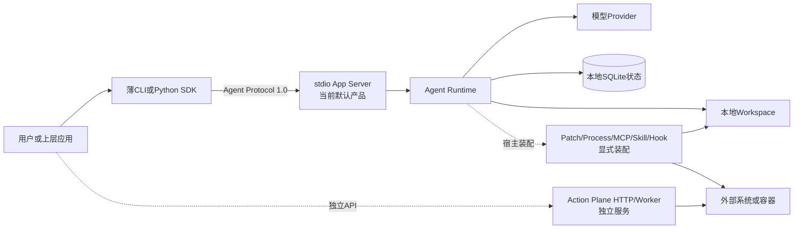

### 5.1 上下文说明

- [顶层CLI](../src/harnessix/cli.py)分派`agent`、`agent-server`、`serve`、`worker`、配置、Smoke和Eval命令；
- [产品装配](../src/harnessix/product_config/server.py)构造Provider、Session、只读Tool、Agent Runtime、Application Service和stdio Server；
- [Agent Runtime](../src/harnessix/agent/runtime.py)拥有Agent Loop和Turn恢复；
- [模型契约](../src/harnessix/models/contracts.py)隔离具体Provider；
- [Coding Tool Runtime](../src/harnessix/tools/runtime.py)受Workspace边界约束；
- [Action Plane Runtime](../src/harnessix/runtime.py)及[Worker](../src/harnessix/worker.py)是另一条可独立部署的副作用执行链；
- Patch、Process、Delivery和扩展均有实现与测试，但没有在当前[产品装配](../src/harnessix/product_config/server.py)中默认注册。

## 6. 当前运行拓扑

### 6.1 默认Coding Agent产品链

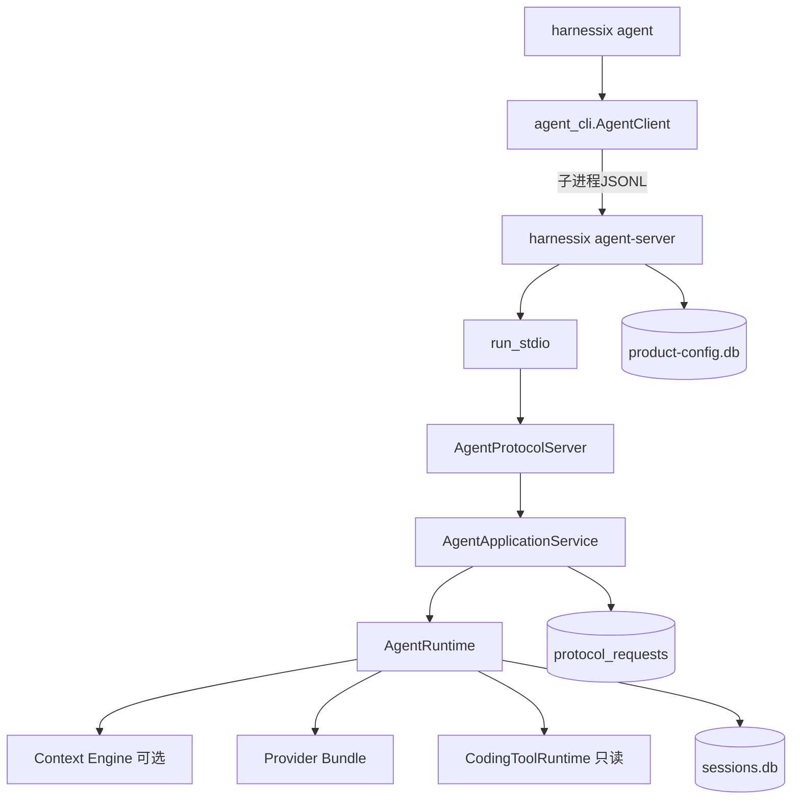

启动顺序不是任意的。`run_product_stdio`先解析并诊断Product Config v2，再校验Workspace、配置文件和状态目录不重叠，随后依次进入Provider、Session、Tool和Agent Runtime生命周期。全部成功后才以CAS发布活动配置，最后开放stdio。任何中间失败都不会留下一个已对外服务但内部未就绪的Server。

### 6.2 独立Action Plane链

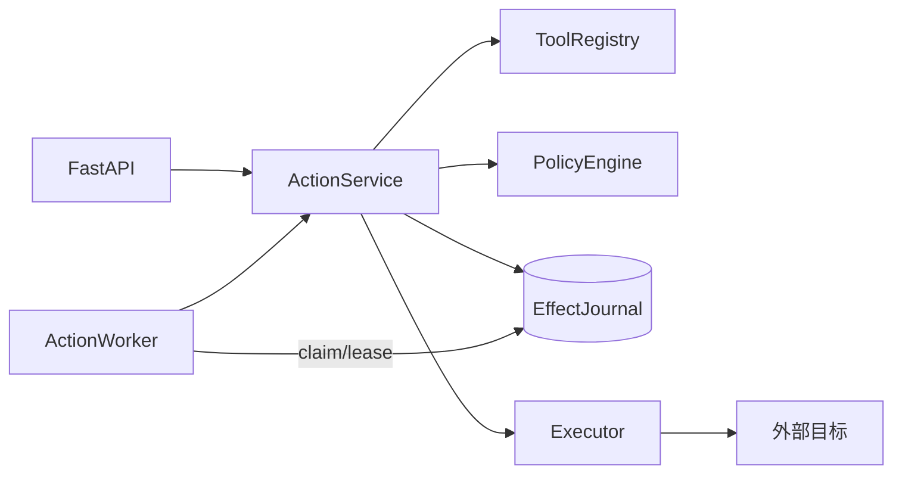

`serve`可按配置内联执行或只入队，`worker`领取`READY` Action并续租。SQLite适合本地单机，PostgreSQL用于独立Worker和多进程协调。Action Plane和Agent Session目前没有一个全局数据库事务；宿主集成必须依赖稳定身份、幂等键和恢复协议，而不能假定跨库原子提交。跨包状态机、事务和故障语义见[Action Plane子系统设计](subsystems/action-plane.md)。

## 7. 逻辑组件与源码映射

| 组件 | 状态 | 责任 | 关键源码/符号 | 主要验证 |
|---|---|---|---|---|
| 顶层命令 | 当前默认产品 | 命令解析与入口分派 | [cli.py](../src/harnessix/cli.py) `main` | [CLI许可测试](../tests/unit/test_cli_license.py)、[产品CLI测试](../tests/product_config/test_server_and_cli.py) |
| Product Config | 当前默认产品 | Profile、Secret引用、诊断、迁移、安全Fallback和活动配置CAS；详见[模块设计](modules/product-config.md) | [server.py](../src/harnessix/product_config/server.py) `run_product_stdio`、[runtime.py](../src/harnessix/product_config/runtime.py) | [product_config测试](../tests/product_config/) |
| Agent Protocol | 当前默认产品 | 版本化Schema、JSON-RPC编解码、投影与命令幂等；详见[模块设计](modules/protocol.md) | [contracts.py](../src/harnessix/protocol/contracts.py)、[requests.py](../src/harnessix/protocol/requests.py) | [protocol测试](../tests/protocol/) |
| App Server | 当前默认产品 | 连接状态、方法路由、应用服务和有界stdio；详见[模块设计](modules/app-server.md) | [server.py](../src/harnessix/app_server/server.py) `AgentProtocolServer`、[service.py](../src/harnessix/app_server/service.py) `AgentApplicationService` | [app_server测试](../tests/app_server/) |
| Python SDK | 当前默认CLI/显式Action API客户端 | Agent进程内/子进程Transport、严格响应、协商方法和消息/Replay上限，以及Action HTTP同步/异步包装；详见[模块设计](modules/sdk.md) | [agent_client.py](../src/harnessix/sdk/agent_client.py)、[client.py](../src/harnessix/sdk/client.py) | [app_server测试](../tests/app_server/)、[SDK单元测试](../tests/unit/test_sdk.py) |
| Product UI客户端内核 | 已实现/待TUI装配 | 最小Client State、发送前Command ID、连接代际、冷暖Replay和纯投影；当前没有Textual View或产品Controller，详见[模块设计](modules/product-ui.md) | [state_store.py](../src/harnessix/product_ui/state_store.py)、[projection.py](../src/harnessix/product_ui/projection.py)、[session.py](../src/harnessix/product_ui/session.py) | [product_ui测试](../tests/product_ui/) |
| Action HTTP API | 已实现/显式部署 | FastAPI Lifespan、Action资源投影、领域错误与HTTP观测；当前无认证、Tenant授权和全局资源预算，详见[模块设计](modules/api.md) | [app.py](../src/harnessix/api/app.py) `create_app` | [API测试](../tests/integration/test_api.py) |
| Framework Adapter | 已实现/显式库接入 | 把LangChain StructuredTool调用映射为Action Submit；当前不包含真实LangGraph、Checkpoint/Interrupt、终态等待或持久Tool Call绑定，详见[模块设计](modules/adapters.md) | [langgraph.py](../src/harnessix/adapters/langgraph.py) `create_harnessix_tool` | [Adapter单元测试](../tests/unit/test_langgraph_adapter.py) |
| Agent Runtime | 当前默认产品 | Thread/Turn、Agent Loop、Tool调度、审批、取消和恢复；详见[模块设计](modules/agent.md) | [runtime.py](../src/harnessix/agent/runtime.py) `AgentRuntime`、[reducer.py](../src/harnessix/agent/reducer.py) | [agent测试](../tests/agent/) |
| Session Store | 当前默认产品 | Event append、CAS、重放、迁移、Fork和运行时所有权；详见[模块设计](modules/session.md) | [sqlite.py](../src/harnessix/session/sqlite.py) `SQLiteSessionStore` | [Session合同](../tests/agent/test_session_contract.py)、[恢复测试](../tests/agent/test_crash_recovery.py) |
| Model Runtime | 当前默认产品 | Provider配置、流事件规范化、历史映射、用量与成本；详见[模块设计](modules/models.md) | [contracts.py](../src/harnessix/models/contracts.py) `ModelProvider`、[config.py](../src/harnessix/models/config.py) | [models测试](../tests/models/) |
| Context | 已实现/显式装配 | Source聚合、预算、压缩窗口和Tool结果视图；详见[模块设计](modules/context.md) | [engine.py](../src/harnessix/context/engine.py) `ContextEngine`、[sources.py](../src/harnessix/context/sources.py) | [context测试](../tests/context/) |
| 只读Tool | 当前默认产品 | Workspace内读取、搜索和可选固定Git查询；详见[模块设计](modules/tools.md) | [runtime.py](../src/harnessix/tools/runtime.py) `CodingToolRuntime` | [tools测试](../tests/tools/) |
| Artifact | 已实现/显式装配 | 有界正文、模型历史、Diff与进程输出外置；详见[模块设计](modules/artifacts.md) | [sqlite.py](../src/harnessix/artifacts/sqlite.py)、[ports.py](../src/harnessix/artifacts/ports.py) | [artifacts测试](../tests/artifacts/) |
| Patch | 已实现/显式装配 | Patch规划、指纹、批次、审批、应用和恢复；详见[模块设计](modules/patches.md) | [planner.py](../src/harnessix/patches/planner.py)、[agent_bridge.py](../src/harnessix/patches/agent_bridge.py) | [patches测试](../tests/patches/) |
| Execution Plan | 已实现/显式装配 | v1/v2不可变执行计划、环境/Secret摘要、能力/Sandbox绑定和一次性Approval Checkpoint；详见[模块设计](modules/execution.md) | [contracts.py](../src/harnessix/execution/contracts.py)、[store.py](../src/harnessix/execution/store.py) | [execution测试](../tests/execution/) |
| Process | 已实现/显式装配 | 命令计划、进程树Owner、pipe/PTY、Lease/CAS、脱敏输出和保守恢复；兼容Saga与跨平台Supervisor边界详见[模块设计](modules/processes.md) | [runtime.py](../src/harnessix/processes/runtime.py)、[supervisor.py](../src/harnessix/processes/supervisor.py) | [processes测试](../tests/processes/) |
| Action Policy | 已实现/显式装配 | 通用Action Plane的默认三分支决策；不等同资源感知Trusted Action策略，详见[模块设计](modules/policy.md) | [default.py](../src/harnessix/policy/default.py) `DefaultPolicyEngine` | [Action Service测试](../tests/integration/test_action_service.py)、[Process审批测试](../tests/processes/test_action_executor.py) |
| Action Executors | 已实现/显式装配 | Echo只读和Issue幂等写样例，验证外部效果、Receipt及UNKNOWN对账；详见[模块设计](modules/executors.md) | [echo.py](../src/harnessix/executors/echo.py)、[demo_issue.py](../src/harnessix/executors/demo_issue.py) | [Action Service测试](../tests/integration/test_action_service.py)、[Worker测试](../tests/integration/test_worker.py) |
| Action Storage | 已实现/显式装配 | SQLite/PostgreSQL Snapshot/Event、Migration、持久队列、Lease、Claim与过期恢复；详见[模块设计](modules/storage.md) | [sqlite_journal.py](../src/harnessix/storage/sqlite_journal.py)、[postgres_journal.py](../src/harnessix/storage/postgres_journal.py) | [Action Service测试](../tests/integration/test_action_service.py)、[Worker测试](../tests/integration/test_worker.py)、[PostgreSQL测试](../tests/integration/test_postgres_journal.py) |
| Sandbox | 已实现/显式装配 | 严格合同、能力探测、固定Container执行、DNS快照、受管Egress、Process监督和Profile Store；当前默认产品未装配，详见[模块设计](modules/sandbox.md) | [planner.py](../src/harnessix/sandbox/planner.py)、[container.py](../src/harnessix/sandbox/container.py)、[process_runtime.py](../src/harnessix/sandbox/process_runtime.py) | [sandbox测试](../tests/sandbox/)、[真实Container测试](../tests/integration/test_container_sandbox.py) |
| Secrets | 默认模型Provider使用/其他路径显式装配 | 环境Source、名称/版本/Target绑定、短生命周期Material、流式脱敏和结构化Guard；不提供Vault、轮换或全局DLP，详见[模块设计](modules/secrets.md) | [provider.py](../src/harnessix/secrets/provider.py)、[redaction.py](../src/harnessix/secrets/redaction.py)、[guard.py](../src/harnessix/secrets/guard.py) | [secrets测试](../tests/secrets/)、[Provider凭据测试](../tests/product_config/test_provider_credentials.py)、[Process输出测试](../tests/processes/test_supervisor.py) |
| Workspace | 已实现/显式装配 | 跨平台逻辑路径、选择资源Snapshot、POSIX/Windows对象安全观察、Secure Reader、执行前校验与SQLite Fencing Lease；详见[模块设计](modules/workspace.md) | [contracts.py](../src/harnessix/workspace/contracts.py)、[snapshot.py](../src/harnessix/workspace/snapshot.py)、[windows.py](../src/harnessix/workspace/windows.py)、[leases.py](../src/harnessix/workspace/leases.py) | [workspace测试](../tests/workspace/) |
| Delivery | 已实现/显式装配 | Workspace Transaction、私有Blob、完整Diff、POSIX可恢复发布、Git Worktree/Checkpoint/确定性Commit和经统一Route单独批准的Push；默认产品尚未装配，详见[模块设计](modules/delivery.md) | [planner.py](../src/harnessix/delivery/planner.py)、[filesystem.py](../src/harnessix/delivery/filesystem.py)、[git.py](../src/harnessix/delivery/git.py)、[git_push.py](../src/harnessix/delivery/git_push.py) | [delivery测试](../tests/delivery/)、[Push Schema测试](../tests/trusted_actions/test_schemas.py) |
| Trusted Action | 已实现/显式装配 | 宿主Binding、规范资源、风险Policy、Execution/Approval、Route Hash链、扩展端口和UNKNOWN对账；默认产品尚未装配，详见[模块设计](modules/trusted-actions.md) | [router.py](../src/harnessix/trusted_actions/router.py) `TrustedActionRouter`、[store.py](../src/harnessix/trusted_actions/store.py) | [trusted_actions测试](../tests/trusted_actions/)、[Git Push测试](../tests/delivery/test_git_push.py) |
| MCP | 已实现/显式装配 | 受管stdio/受信进程内Target、不可变目录、调用前Schema漂移、Trusted Action与只读stdio Server；默认产品未装配，详见[模块设计](modules/mcp.md) | [runtime.py](../src/harnessix/mcp/runtime.py)、[actions.py](../src/harnessix/mcp/actions.py)、[store.py](../src/harnessix/mcp/store.py) | [MCP](../tests/mcp/)与[真实Container](../tests/integration/test_container_sandbox.py)测试 |
| Skill | 已实现/显式装配 | 本地来源、不可变目录、冲突消歧、渐进加载、安全Reader、无正文访问事件及只读Trusted Action；默认产品未装配，详见[模块设计](modules/skills.md) | [runtime.py](../src/harnessix/skills/runtime.py)、[store.py](../src/harnessix/skills/store.py)、[actions.py](../src/harnessix/skills/actions.py) | [Skill测试](../tests/skills/) |
| Hook | 已实现/显式装配 | Definition/Grant/Registry、精确Matcher、Blocking/Advisory、确定Run、双账本、Action执行Timeout、取消和Interrupted恢复；默认产品未装配且授权/对账仍有缺口，详见[模块设计](modules/hooks.md) | [runtime.py](../src/harnessix/hooks/runtime.py)、[contracts.py](../src/harnessix/hooks/contracts.py)、[store.py](../src/harnessix/hooks/store.py) | [Hook测试](../tests/hooks/) |
| Eval | 已实现/显式运行 | 固定历史任务、私有物化、正式Agent运行、确定性分级、Campaign与成本聚合；详见[Evals模块设计](modules/evals.md) | [evals](../src/harnessix/evals/) | [evals](../tests/evals/)测试 |
| Smoke | 已实现/显式运行 | 显式门禁、固定文本/工具/审批场景、临时Session重开、Replay与白名单报告；配置安全打开、端点—凭据绑定、金额预算和持久证据尚未完成，详见[Smoke模块设计](modules/smoke.md) | [smoke](../src/harnessix/smoke/) | [smoke](../tests/smoke/)测试 |
| 可观测性 | Action默认可配置/Agent默认未装配 | 内部端口、No-op/OTel适配、W3C持久传播、结构化日志及Agent安全包装；故障隔离和隐私保证因调用链不同，详见[模块设计](modules/observability.md) | [core.py](../src/harnessix/observability/core.py)、[opentelemetry.py](../src/harnessix/observability/opentelemetry.py)、[agent/telemetry.py](../src/harnessix/agent/telemetry.py) | [观测单元测试](../tests/unit/test_observability_core.py)、[跨进程测试](../tests/integration/test_observability_flow.py)、[Agent遥测测试](../tests/agent/test_telemetry.py) |

### 7.1 重点类与生命周期

| 类/组件 | 状态所有权 | 并发/生命周期 | 直接依赖 | 扩展点 |
|---|---|---|---|---|
| `AgentProtocolServer` | 单连接协议状态和协商能力 | 一个连接实例；`NEW`到`CLOSED` | `AgentApplicationService`、Protocol codec | 新协议方法必须先进入版本化合同 |
| `AgentApplicationService` | 后台Turn Task、Delta Buffer、命令编排 | `close`有界等待后取消；每个Turn最多一个后台Task | `AgentRuntime`、Session、Protocol Request Store | Scoped Artifact Reader |
| `AgentRuntime` | Thread锁、活动Cancel Token/Task和运行配置 | Async context拥有Session Store；每Thread串行 | Model、Context、Tool、Session及可选专用端口 | 各Port/Scoped Runtime |
| `SQLiteSessionStore` | Event、Migration、运行时Owner | 单进程异步连接；WAL与CAS；Owner进入/退出 | SQLite、Agent Event/Reducer | `SessionStore`其他实现 |
| `CodingToolRuntime` | Workspace根、固定Git执行文件和受限并行能力 | Async context打开/关闭Workspace资源 | Files/Search/Git、Workspace | `ScopedToolRuntime`合同 |
| `TrustedActionRouter` | Definition Registry与持久Action Route | `plan/decide/execute/reconcile`按Plan身份推进 | Policy、Store、受信Executor | `ExtensionActionPort` |
| `ActionService` | Registry、Policy、Journal与Worker身份 | 初始化恢复；内联或Lease执行 | `EffectJournal`、Executor、Observability | Journal/Policy/Executor端口 |
| `ActionWorker` | Poll、Heartbeat和恢复周期 | 单Worker循环；终态提交前保持Lease证明 | `ActionService` | 多Worker靠Journal协调 |
| `WorkspaceTransactionRuntime` | 多文件发布游标和恢复判断 | 同步端口；每成员检查Lease | Transaction Store、Workspace Lease/Snapshot | 文件系统交付实现 |

## 8. 模块所有权、依赖方向与禁止旁路

### 8.1 允许的宏观依赖方向

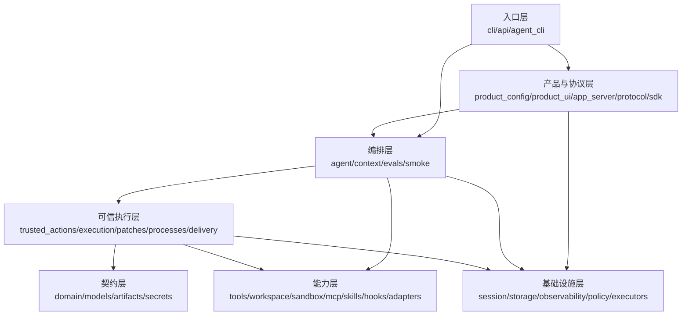

图表示期望的责任方向，不是当前Python import的严格DAG。0.9.0基线记录了164条顶层包依赖边和一个包含`agent/artifacts/context/execution/models/patches/processes/secrets/session/tools/workspace`的强连通分量；这是已知结构债务，不应通过新增跨包内部导入继续扩大。机器证据见[可读性基线](baselines/readability-0.9.0-final.json)。

### 8.2 31个顶层包边界

“允许下游”列只列主方向而非穷举导入；跨包复用应优先依赖公开契约或端口。

| 包 | 所有者 | 允许下游 | 禁止旁路 |
|---|---|---|---|
| `adapters` | integrations | `domain`公开契约 | 直接操纵Journal私有Schema |
| `agent` | runtime | `models/context/tools/session`端口及可信执行桥 | Provider SDK对象写入Session；绕过Runtime写事件 |
| `api` | action-plane | 根级`runtime`与协议模型 | 在HTTP Handler内直接执行副作用 |
| `app_server` | product | `protocol/agent/session/artifacts`公开面 | 绕过协议请求账本执行可重试命令 |
| `artifacts` | storage | 自身契约、`session`身份 | 把未经授权的绝对路径暴露给客户端 |
| `context` | runtime | `models/tools/artifacts`只读契约 | 修改Workspace或直接调用Provider |
| `delivery` | execution | `workspace/execution/trusted_actions/tools` | 未校验Snapshot直接发布；绕过事务记录 |
| `domain` | action-plane | Python/Pydantic基础类型 | 反向依赖API、存储或Executor实现 |
| `evals` | quality | 产品公开入口与Eval契约 | 用测试夹具改写生产事实 |
| `execution` | execution | `workspace`与持久计划契约 | 将未持久计划直接交给执行器 |
| `executors` | action-plane | `domain`端口 | 自行更新Action生命周期 |
| `hooks` | extensions | `trusted_actions/execution/secrets` | Hook处理器绕过统一Action Router，或把Binding声明误当成副作用隔离证明 |
| `mcp` | extensions | `trusted_actions/execution/secrets`与MCP契约 | 远端Schema直接获得宿主执行权限 |
| `models` | model | Provider中立契约、Secret引用 | 上游响应对象泄漏进Agent领域模型 |
| `observability` | platform | 标准观测SDK | 日志记录Secret、Prompt正文或未脱敏输出 |
| `patches` | execution | `workspace/execution/artifacts` | 指纹或审批前修改文件 |
| `policy` | action-plane | `domain`只读输入 | 执行工具或修改Journal |
| `processes` | execution | `sandbox/workspace/execution/artifacts` | 未持久Action直接启动高风险进程 |
| `product_config` | product | `models/secrets/session/tools/app_server`公开构造器 | 配置值直接携带明文Secret；状态目录落入Workspace |
| `product_ui` | product | `sdk/protocol/file_lock`公开合同 | 保存Transcript正文；Widget绕过Session分配Command或推进Cursor |
| `protocol` | product | 协议模型与兼容规则 | 依赖具体Provider或执行器实现 |
| `sandbox` | security | 宿主能力与执行计划 | 把能力探测结果当作已强制隔离证明 |
| `sdk` | product | `protocol` | 猜测Server内部状态或绕过握手 |
| `secrets` | security | 环境/引用解析与脱敏 | Secret进入持久事件、日志或Artifact |
| `session` | storage | `agent`稳定事件契约 | 业务层直接修改SQLite表或跳过CAS |
| `skills` | extensions | `trusted_actions/execution` | Skill文本直接升级为宿主权限 |
| `smoke` | quality | `models`公开Provider契约 | 默认联网、自动重试或无预算请求 |
| `storage` | action-plane | `domain`与数据库驱动 | API/Worker直接改Action表绕过Journal端口 |
| `tools` | execution | `workspace`、Artifact和只读工具契约 | 接收任意绝对路径；把只读工具伪装成写工具 |
| `trusted_actions` | execution | `execution/tools/workspace/domain` | 扩展直接拿到原始Executor或Secret Provider |
| `workspace` | security | 文件系统与锁基础设施 | 通过字符串前缀判断路径归属；忽略链接身份 |

### 8.3 10个根级生产模块归属

| 模块 | 所有者/事实源 | 依赖方向 | 禁止旁路 |
|---|---|---|---|
| `__init__.py` | core/公共导出 | 仅导出稳定公共类型 | 导出包内部实现 |
| `__main__.py` | product/入口 | 单向调用`cli.main` | 复制CLI分派逻辑 |
| `agent_cli.py` | product/交互入口 | `sdk → protocol` | 直接访问Session数据库 |
| `bootstrap.py` | action-plane/装配 | `settings → storage/policy/executors/runtime` | 在装配外创建另一套生命周期 |
| `cli.py` | product/总入口 | 只负责解析和分派 | 在解析器中实现领域逻辑 |
| `file_lock.py` | platform/基础锁 | 被配置和存储模块调用 | 将文件锁等同分布式锁 |
| `licensing.py` | legal/许可输出 | 读取固定许可事实 | 运行时改变授权边界 |
| `runtime.py` | action-plane/服务门面 | `domain/registry/policy/journal/executor` | 跳过Journal提交副作用终态 |
| `settings.py` | platform/基础设置 | 环境到类型化配置 | 保存动态Secret正文 |
| `worker.py` | action-plane/Worker | `journal → runtime` | 无Lease执行或提交Action |

## 9. 数据流与信任边界

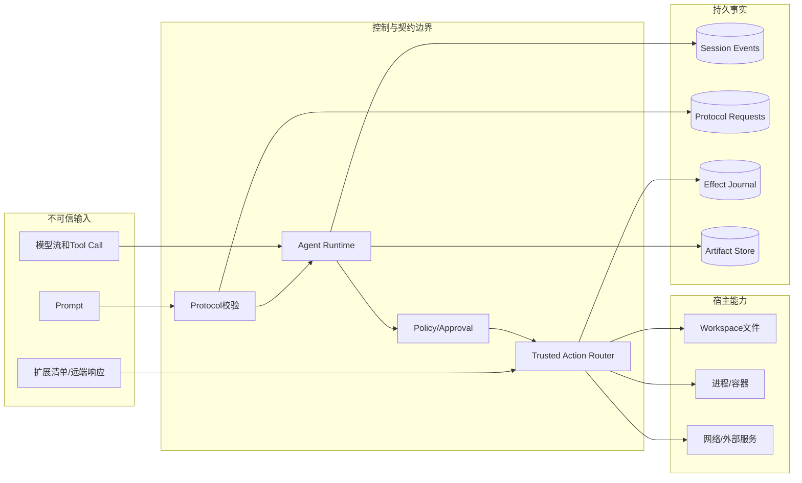

### 9.1 数据分类

| 数据 | 来源 | 持久位置 | 主要保护 |
|---|---|---|---|
| Product Config | 运维/用户 | 配置文件、`product-config.db`审计 | v2 Schema、Hash、Profile CAS；Secret只存引用 |
| Prompt与消息 | 用户/模型 | Session Event；大正文可外置Artifact | 长度/预算、协议投影、Artifact访问边界 |
| Tool Call与结果 | 模型/Executor | Session Event、Artifact或Effect Journal | Schema、Workspace Scope、Policy、指纹 |
| 审批 | 用户/策略 | Session或Effect Journal | `approval_id`、请求指纹、唯一决定 |
| Secret | 环境或Secret Provider | 不写入业务持久层 | 引用解析、使用点注入、日志脱敏 |
| Trace/Metric/Log | 各组件 | 配置的观测后端 | 有界属性、稳定ID、敏感字段过滤 |

不存在“模型输出即可信命令”的路径。Tool参数、扩展描述和远端结果都按不可信数据处理。

## 10. 核心状态模型

### 10.1 Protocol连接

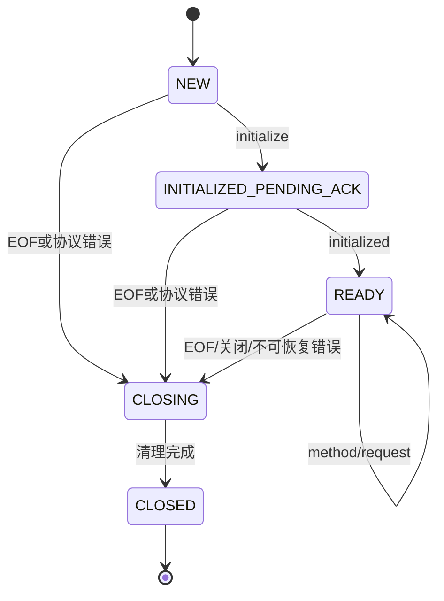

Server在`READY`前拒绝业务方法；协议版本不等于`1.0`时握手失败。JSON-RPC、严格解码、公共投影、Replay游标与持久命令账本见[Protocol模块设计](modules/protocol.md)，连接执行见[AgentProtocolServer](../src/harnessix/app_server/server.py)，合同测试见[Server SDK测试](../tests/app_server/test_server_sdk.py)。当前`AgentClient`会在Transport写入前校验广告方法、协商`maxMessageBytes`和`maxReplayEvents`；`SubprocessAgentTransport`仍以构造期Reader上限分配缓冲，`maxPendingRequests`与`maxOutboundMessages`尚未形成完整客户端容量控制，不能把初始化返回值全部解释为动态强制配额。

### 10.2 Turn生命周期

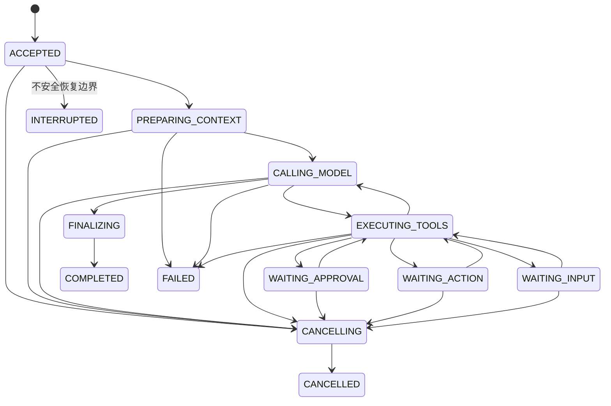

终态为`COMPLETED/FAILED/CANCELLED/INTERRUPTED`。图省略了多个活动态直接失败的边，以保持可读性；权威枚举和Reducer见[agent/models.py](../src/harnessix/agent/models.py)与[agent/reducer.py](../src/harnessix/agent/reducer.py)。

### 10.3 Action生命周期

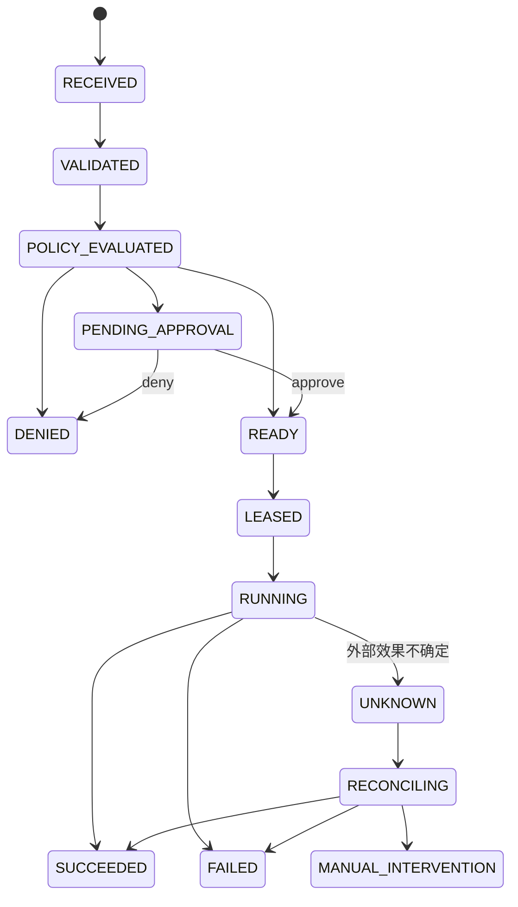

Action领域模型、端口及其当前强弱约束见[Domain模块设计](modules/domain.md)，服务状态转换见[根级runtime.py](../src/harnessix/runtime.py)，双后端Schema、Migration、事务、Claim与恢复见[Storage模块设计](modules/storage.md)。`UNKNOWN`不是普通失败，也不是终态成功；它禁止无证据自动重放。

### 10.4 稳定身份

| 身份 | 作用域 | 用途 |
|---|---|---|
| `client_instance_id + request_id` | Protocol命令 | 重试返回同一结果或报指纹冲突 |
| `thread_id` | Workspace会话 | Session事件流、Artifact授权和并发锁 |
| `turn_id` | 单次用户任务 | 预算、取消、恢复、用量和终态 |
| `call_id` | 模型Tool Call | Tool Result排序、审批和恢复关联 |
| `approval_id + fingerprint` | 高风险请求 | 防止批准对象被替换 |
| `action_id + idempotency_key` | Action Plane | 副作用唯一性与对账 |
| `plan_id/transaction_id` | 可信执行/交付 | 计划、快照、执行结果和恢复 |

### 10.5 关键接口契约

| 接口/方法 | 调用者 → 实现者 | 输入/输出 | 错误、取消与超时 | 幂等/顺序与权限 |
|---|---|---|---|---|
| `ModelProvider.stream` | `AgentRuntime` → Provider Adapter | `ModelRequest` → Async `ProviderEvent` | Provider错误分类；由Turn预算和Cancel Token停止消费 | 单次Attempt有稳定身份；Provider无Workspace权限 |
| `SessionStore.append` | Runtime → Session Store | `EventDraft[] + expected_sequence` → `Thread` | 存储错误或CAS冲突；不产生半组Event | 单事务追加并按序Reducer；只有Owner Runtime写 |
| `ScopedToolRuntime.execute` | Agent → Tool Runtime | `thread_id/turn_id/call` → Tool Result | 有界取消/超时；参数或路径失败关闭 | Tool Contract决定效果类别；Workspace Scope授权 |
| `ProtocolRequestStore.claim` | App Service → Request Store | 客户端、请求、方法、Payload → Claim | 指纹冲突不可重试；存储失败不执行业务操作 | 相同身份/同Payload重放同一结果 |
| `AgentRuntime.reply_approval` | App Service → Agent | 审批ID、指纹、决定 → `Turn` | 过期、关闭、ID或指纹不匹配均拒绝 | 相同决定幂等，不同决定冲突；只授权绑定请求 |
| `EffectJournal.claim_ready` | Worker → Journal | Worker、Lease时长 → Action | 无Ready返回空；存储失败不执行 | 原子Claim；仅Lease持有者可推进 |
| `Executor.execute/reconcile` | Action Service → Tool Executor | 已验证Action → Outcome | 执行结果未知进入`UNKNOWN`；Reconcile有界 | 写工具声明幂等/对账；不能直接改Journal |
| `WorkspaceTransactionRuntime.publish` | 宿主 → Delivery | Transaction、Root、审批指纹、Lease → Record | Lease丢失、来源漂移或效果未知；无通用自动重试 | Plan指纹、Snapshot、游标和before/after证明 |

### 10.6 重点数据字段

| 结构/字段 | 类型/必填 | 来源与约束 | 敏感级别 | 持久化与兼容 |
|---|---|---|---|---|
| `Budget.max_steps` | 正整数/是 | 客户端或默认配置；限制Agent循环 | 非敏感 | `TurnStarted`事实；旧事件按Upcaster兼容 |
| `Budget.max_tokens` | 正整数/是 | 限制累计Provider用量 | 非敏感 | Session Event；成本计算引用Usage |
| `Budget.timeout_seconds` | 正数/是 | Turn墙钟截止预算 | 非敏感 | 开始时间与预算持久化；恢复重新计算剩余时间 |
| `Turn.status` | `TurnStatus`/是 | 仅合法Event转换产生 | 非敏感 | Event投影；Event v19仍可读取旧版本 |
| `AgentEvent.sequence` | 递增整数/是 | Session Store分配 | 非敏感 | SQLite唯一顺序；CAS和Replay游标 |
| `ToolCallContent.call_id` | 字符串/是 | Provider规范化层 | 非敏感 | Session Event；关联审批、结果和恢复 |
| `ApprovalContent.request_fingerprint` | SHA-256样式摘要/是 | 对批准对象的规范化内容计算 | 安全敏感元数据 | Session Event；响应必须精确匹配 |
| `ProtocolRequestRecord.params_sha256` | SHA-256摘要/是 | 方法和规范化Params共同计算 | 受控摘要 | Protocol Request表；阻止请求键换方法或Payload |
| `ActionRequest.idempotency_key` | 条件必填 | 调用者；写工具按Definition要求 | 非敏感 | Effect Journal唯一性范围；冲突拒绝 |
| `ActionSnapshot.status` | `ActionStatus`/是 | Action Service/Journal转换 | 非敏感 | SQLite/PostgreSQL Journal；非法转换拒绝 |
| `TraceContext` | trace/span身份/可选 | 上游或运行时 | 受控元数据 | Session/Journal和观测属性；不得承载Secret |
| Product `secret_ref` | 字符串引用/条件必填 | 配置文件 | 敏感引用，不是Secret正文 | 配置Snapshot；正文只在运行时解析 |
| `WorkspaceTransactionRecord.cursor` | 非负整数/是 | 每个成员效果证明后递增 | 非敏感 | Delivery Store；用于中断恢复 |

## 11. 五条系统级时序

### 11.1 正常只读Coding Turn

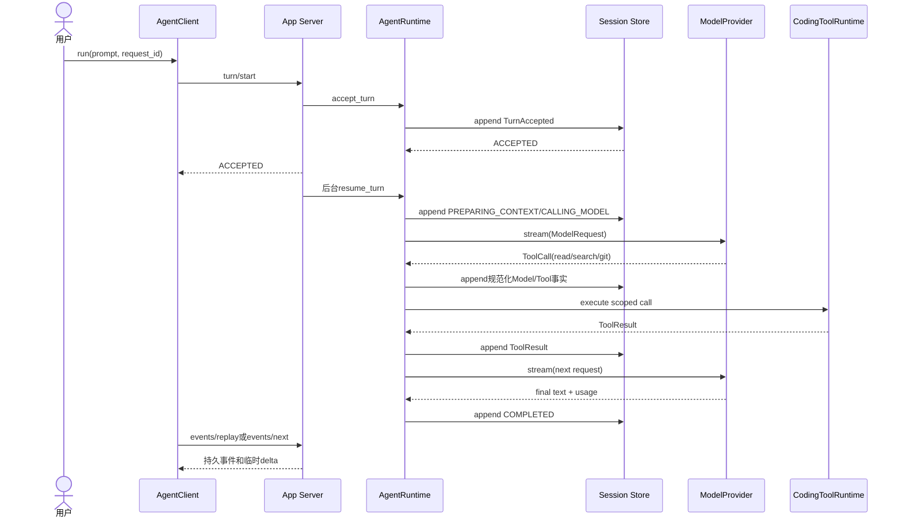

关键顺序是“先持久化接受，再异步驱动”。即使Server在响应后、后台任务调度前退出，重开后同一`request_id`仍能得到原Turn并继续。多只读Tool Call可按受控前缀并行执行，但结果按Provider原始顺序持久化。实现主线见[Application Service](../src/harnessix/app_server/service.py)、[AgentRuntime._drive](../src/harnessix/agent/runtime.py)和[Tool调度测试](../tests/agent/test_tool_scheduling.py)。

### 11.2 审批后执行

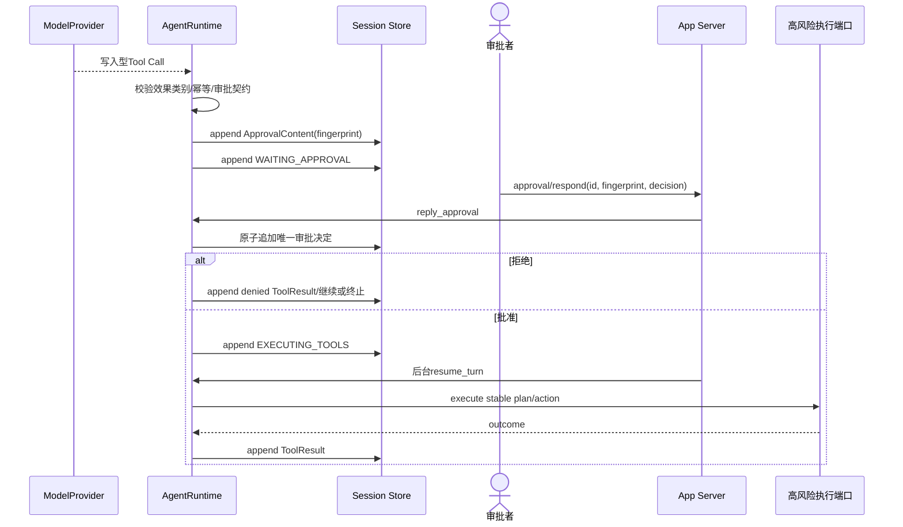

响应必须同时匹配`approval_id`和原请求指纹；重复相同决定返回已保存事实，不同决定报冲突。审批不是执行权限的永久提升，只对绑定请求有效。实现见[AgentRuntime.reply_approval](../src/harnessix/agent/runtime.py)和[审批崩溃恢复测试](../tests/agent/test_approval_crash_recovery.py)。

### 11.3 取消

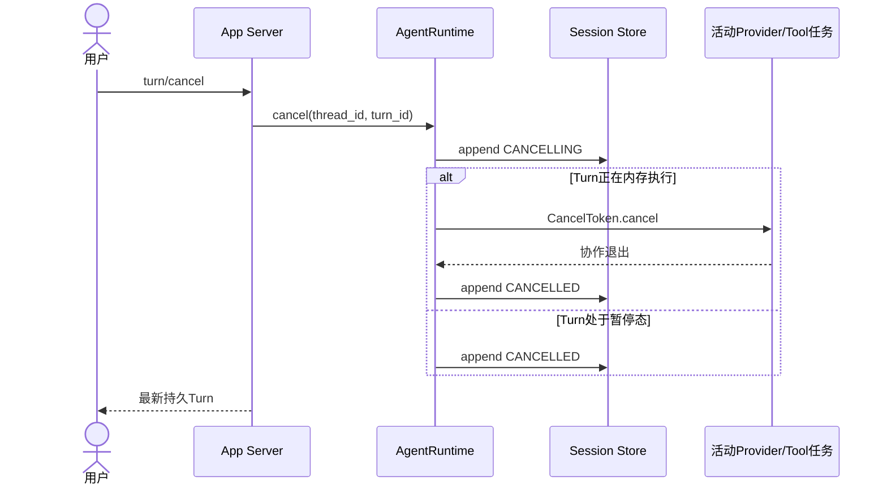

取消是持久意图，不等同于直接取消Python Task。Provider、Tool或Process必须在契约允许的边界响应取消；外部非幂等效果若已越过提交边界，仍按对应Action/Process对账语义处理。实现见[agent/cancellation.py](../src/harnessix/agent/cancellation.py)、`AgentRuntime.cancel`及[交互测试](../tests/agent/test_interactions.py)。

### 11.4 宿主崩溃与恢复

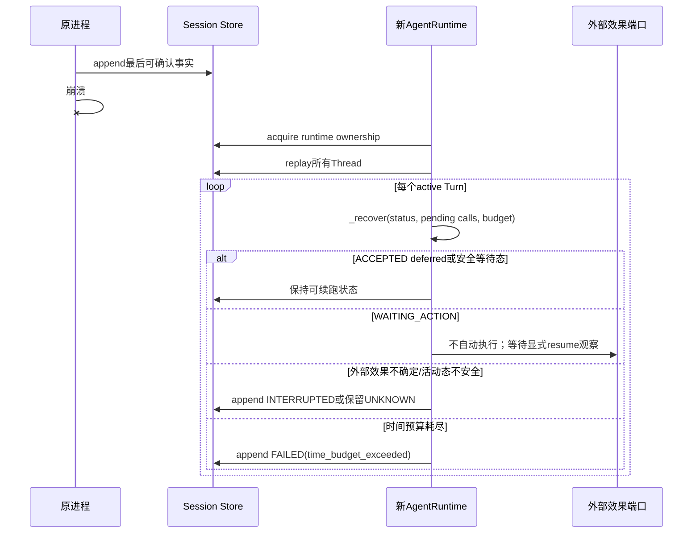

恢复只使用持久事实，不依据丢失的内存Future。`ACCEPTED`的deferred Turn尚未调用Provider，可安全续跑；审批、问题和Process等待保持原状态；无法证明安全的活动操作不会自动重放。实现见[AgentRuntime._recover](../src/harnessix/agent/runtime.py)、[SQLiteSessionStore](../src/harnessix/session/sqlite.py)和[恢复测试](../tests/agent/test_crash_recovery.py)。

### 11.5 事务性交付（显式装配能力）

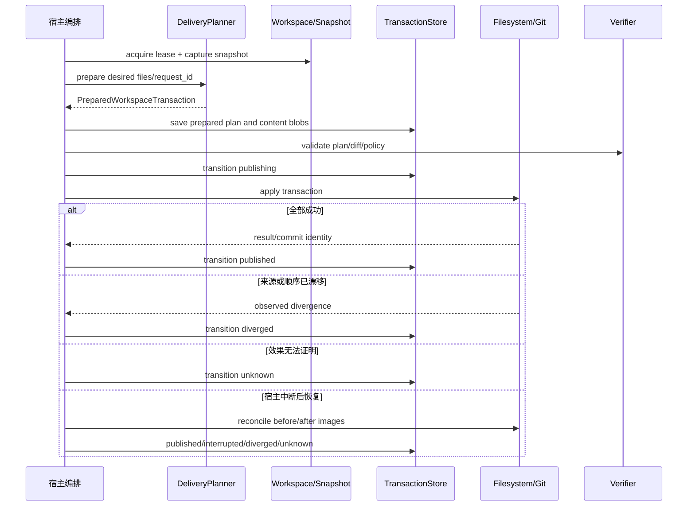

该时序描述已实现库的宿主组合方式，不是当前默认`agent-server`路径。交付计划和正文Blob先以`prepared`状态落盘；发布后逐成员推进游标，成功进入`published`。Workspace Lease和Snapshot防止静默覆盖并发修改；恢复通过比较每个成员的before/after镜像判断`published/interrupted/diverged/unknown`，不会用不存在的通用“失败”状态掩盖部分副作用。Git Push还需要独立认证和发布策略。实现见[delivery/planner.py](../src/harnessix/delivery/planner.py)、[delivery/store.py](../src/harnessix/delivery/store.py)、[delivery/filesystem.py](../src/harnessix/delivery/filesystem.py)及[Delivery测试](../tests/delivery/)。

## 12. 持久化与事务边界

| 存储 | 当前实现 | 事务单位 | 并发/恢复保证 |
|---|---|---|---|
| Agent Session | SQLite `sessions.db` | 单次`append`的一组Event | `expected_sequence` CAS、WAL、运行时所有权、迁移校验、重放 |
| Protocol Request | Session数据库内独立表 | `claim/complete/fail` | 客户端实例与请求ID绑定Payload指纹，提供命令幂等 |
| Product Config审计 | SQLite `product-config.db` | Snapshot保存和活动指针CAS | 配置Hash、Profile和期望版本冲突检测 |
| Artifact | SQLite元数据与内容存储 | Artifact提交 | Digest/身份、分页读取、Thread授权和崩溃恢复 |
| Action Journal | SQLite或PostgreSQL | Action事件/快照状态转换 | 幂等键、Lease、Worker身份、UNKNOWN/Reconcile |
| Execution/Trusted Action | SQLite计划账本 | 计划与状态转换；Execution合同详见[模块设计](modules/execution.md) | 指纹、审批、稳定Plan ID和恢复扫描 |
| Delivery Transaction | SQLite元数据与内容Blob | Prepared计划保存/状态转换 | Request ID、Digest、Snapshot与恢复读取 |

跨这些存储没有分布式事务。组合操作必须明确“先写哪条事实、失败后由谁恢复、重复请求返回什么”，并以稳定ID连接记录。

## 13. 失败与恢复矩阵

| 失败点 | 可观察事实 | 当前语义 | 恢复动作 |
|---|---|---|---|
| 配置/Secret诊断失败 | 启动错误码 | fail closed，不开放stdio | 修复配置后重启 |
| Protocol重复请求 | 已有请求记录 | 相同Payload重放结果；不同Payload冲突 | 客户端保留同一`request_id` |
| Provider限流/协议错误 | Model Attempt与错误 | 按可重试性和预算终止或切换 | 显式Retry/Provider策略，不无限重试 |
| Context超预算 | Compaction计划/尝试 | 压缩、失败或终止 | 从持久窗口和尝试账本恢复 |
| 只读Tool失败 | Tool Result | 失败结果反馈模型 | 模型可调整后续调用 |
| 审批期间退出 | Approval事实 | 保持`WAITING_APPROVAL` | 重连后响应同一请求 |
| 进程等待期间退出 | Process Action/Session投影 | 保持`WAITING_ACTION` | 显式resume作有界观察 |
| Patch提交边界不确定 | Patch账本与Workspace事实 | 不自动重复应用 | 通过Digest/Snapshot对账 |
| Action Worker失租 | Lease与Worker ID | 失租Worker不得提交终态 | 新Worker按Journal事实领取/对账 |
| Session写入失败 | 无成功Event或CAS冲突 | 内存状态不算提交 | 重读最新序列并按操作契约重试 |
| stdio背压/客户端退出 | 有界队列与连接关闭 | 停止接收，限时清理后台Turn | 客户端重连、事件Replay |
| 观测后端不可用 | 业务事实仍可提交 | 观测失败不能改变业务结果 | 后端恢复；依靠本地日志/Journal诊断 |

## 14. 并发、幂等与资源边界

- `AgentRuntime`按`thread_id`串行化持久状态变更，同时允许受限数量的只读Tool并行；
- `SQLiteSessionStore`通过`expected_sequence`阻止丢失更新，通过运行时Owner阻止两个Agent Runtime同时拥有同一数据库；
- App Server通过`SQLiteProtocolRequestStore`持久化写命令结果，进程崩溃后仍可识别重试；
- Action Worker必须持有未过期Lease并持续心跳，失租后不得提交执行终态；
- 高风险工具定义必须声明效果类别、审批、幂等和对账能力，构造Runtime时即校验不安全组合；
- `Budget`限制`max_steps`、`max_tokens`、`timeout_seconds`、`max_output_chars`和`max_tool_calls_per_step`；
- stdio pending请求、outbox和关闭等待均有界，Process输出通过捕获限制与Artifact外置避免无界内存增长。

## 15. 安全边界

### 15.1 Workspace与文件系统

- Product Config文件和状态目录不得位于Workspace内，状态目录也不得包含Workspace；
- 路径判断使用解析后的身份，不使用字符串前缀；链接、Junction和重解析点按平台规则处理；
- POSIX默认只读Tool要求`O_NOFOLLOW`，不满足时拒绝启动；
- 写入由Patch/Delivery计划、Snapshot、Lease和审批控制，而不是复用只读文件接口。

### 15.2 模型与扩展

- Provider输出、Tool参数、MCP Schema、Skill正文和Hook配置均是不可信输入；
- Model只能调用注册后的稳定工具契约；未知工具、无效参数或效果类别不匹配会失败关闭；
- MCP/Skill/Hook只获得受限`ExtensionActionPort`，不应取得原始宿主执行器；
- 远程MCP/OAuth与受管Egress尚未进入默认产品，不能用现有本地实现推导其安全完成度。

### 15.3 Secret与审计

- Product Config保存Secret引用，启动时由环境Secret Provider解析；
- Secret不得进入Session Event、Artifact、日志、Trace或验证证据；
- 审批保存Actor、Reason、绑定指纹和结果；Action/Trusted Action账本记录状态转换和执行身份；
- 完整攻击面和缓解措施见[威胁模型](threat-model.md)。

## 16. 可观测性

| 信号 | 当前用途 | 关联身份 |
|---|---|---|
| 结构化日志 | 启动、Worker、错误与运维诊断 | service/component、action/thread/turn |
| Trace | Action提交/执行/审批/对账，Agent恢复/取消/审批等操作 | trace context、action/thread/turn |
| Metric | Action吞吐、状态、延迟、Lease与运维指标 | tool、status、component |
| Session/Journal事件 | 业务级可审计事实和重放 | sequence、event/action ID |
| Eval报告 | 任务成功、检查、成本、Token和延迟 | campaign/run/task ID |

观测数据不是业务提交事实；恢复与重放必须依据已持久化的Session或Action。Agent `KernelTelemetry`已保证Observer故障不改变Turn结果，但Action/API主链的直接Observer调用尚未统一隔离，不能把该保证外推到所有调用点。信号合同、持久Trace、单位缺陷、日志与异常隐私边界见[Observability模块设计](modules/observability.md)，验证见[observability flow](../tests/integration/test_observability_flow.py)、[OTLP export](../tests/integration/test_otlp_export.py)与[Agent telemetry](../tests/agent/test_telemetry.py)。

## 17. 部署与平台边界

| 形态 | 入口 | 存储 | 平台现状 | 当前用途 |
|---|---|---|---|---|
| 薄Coding CLI | `harnessix agent` | 由子进程Server持有 | macOS/Linux可用；Windows产品入口未完成 | 人工操作本地Agent |
| Headless Agent Server | `harnessix agent-server` | SQLite本地状态目录 | POSIX且支持`O_NOFOLLOW` | stdio协议宿主 |
| Action API内联 | `harnessix serve` | SQLite或PostgreSQL | Python支持平台，具体Executor另验收 | 提交并同步执行Action |
| Action API排队 | `harnessix serve` + `harnessix worker` | PostgreSQL优先 | 服务部署环境 | Lease Worker执行 |
| Eval/Smoke | 独立CLI子命令 | 报告/临时状态 | 显式启用 | 受控验证，不是常驻服务 |

Windows底层已有路径、锁、Process Owner/Job Object等实现和测试，但默认Coding Tool平台门仍会拒绝启动；因此文档不得写成“Windows产品已支持”。安装、升级、备份和命令参数见[部署与运行](deployment.md)。

## 18. 核心业务伪代码

### 18.1 产品启动

```text
load ProductConfig v2
select requested profile
resolve workspace and config identities
reject config/state/workspace overlap
resolve Secret references and run offline diagnostics
require supported read-only tool platform
open config audit store
enter provider bundle
initialize and own session store
enter coding tool runtime and agent runtime
CAS activate the exact diagnosed config snapshot
run bounded stdio protocol server
close components in reverse order
```

### 18.2 Protocol写命令

```text
claim(client_instance_id, request_id, method, payload_fingerprint)
if completed: return persisted result
if failed: raise persisted error
if same identity with different payload: reject idempotency conflict
result = execute domain operation
persist completed result
schedule deferred turn only after the accepted result exists
return result
```

### 18.3 Agent Loop

```text
while turn is active and budget remains:
    persist current phase
    prepare provider-neutral context/history
    stream one model attempt
    persist normalized output, usage and pending tool calls
    if no tool calls:
        persist final answer and COMPLETED
        return
    validate every tool contract before side effects
    execute bounded read-only prefix in parallel; writes serially
    persist tool results in provider order
on cancellation: persist deterministic cancellation boundary
on unsafe external uncertainty: preserve waiting/unknown or mark interrupted
```

### 18.4 Action Worker

```text
recover expired leases according to journal policy
claim one READY action with worker identity and lease deadline
start heartbeat renewal
execute only through ActionService and registered Executor
before terminal commit, prove lease ownership is still valid
persist SUCCEEDED, FAILED or UNKNOWN
if UNKNOWN: require reconcile instead of blind replay
```

## 19. 源码与测试阅读索引

| 问题 | 先读源码 | 再读测试 |
|---|---|---|
| 命令如何进入产品 | [cli.py](../src/harnessix/cli.py)、[agent_cli.py](../src/harnessix/agent_cli.py) | [test_agent_cli.py](../tests/app_server/test_agent_cli.py) |
| 产品如何安全装配 | [product_config/server.py](../src/harnessix/product_config/server.py) | [test_server_and_cli.py](../tests/product_config/test_server_and_cli.py) |
| 协议如何严格解码、握手、投影、Replay和幂等 | [Protocol模块设计](modules/protocol.md)、[protocol/contracts.py](../src/harnessix/protocol/contracts.py)、[protocol/projection.py](../src/harnessix/protocol/projection.py)、[protocol/requests.py](../src/harnessix/protocol/requests.py) | [protocol测试](../tests/protocol/)、[test_server_sdk.py](../tests/app_server/test_server_sdk.py) |
| Turn如何运行 | [agent/runtime.py](../src/harnessix/agent/runtime.py)、[agent/reducer.py](../src/harnessix/agent/reducer.py) | [test_runtime.py](../tests/agent/test_runtime.py)、[test_tool_scheduling.py](../tests/agent/test_tool_scheduling.py) |
| 只读工具如何约束路径和结果 | [Coding Tool Runtime模块设计](modules/tools.md)、[tools/runtime.py](../src/harnessix/tools/runtime.py) | [tools测试](../tests/tools/) |
| Patch如何冻结计划、批准、落盘和恢复 | [Managed Patch Runtime模块设计](modules/patches.md)、[patches/managed.py](../src/harnessix/patches/managed.py) | [patches测试](../tests/patches/) |
| Execution Plan如何绑定Workspace、环境、Secret、Sandbox、Policy、能力与批准 | [Execution Plan模块设计](modules/execution.md)、[execution/contracts.py](../src/harnessix/execution/contracts.py) | [execution测试](../tests/execution/) |
| Workspace如何规范路径、捕获选择资源事实、校验漂移并提供跨进程Fencing | [Workspace模块设计](modules/workspace.md)、[workspace/snapshot.py](../src/harnessix/workspace/snapshot.py)、[workspace/leases.py](../src/harnessix/workspace/leases.py) | [workspace测试](../tests/workspace/)、[delivery测试](../tests/delivery/) |
| Delivery如何冻结多文件变更、持久Blob、恢复部分效果并形成Git Commit/Push | [Delivery模块设计](modules/delivery.md)、[delivery/filesystem.py](../src/harnessix/delivery/filesystem.py)、[delivery/git.py](../src/harnessix/delivery/git.py)、[delivery/git_push.py](../src/harnessix/delivery/git_push.py) | [delivery测试](../tests/delivery/)、[trusted_actions测试](../tests/trusted_actions/) |
| Coding Eval如何固定历史任务、运行正式Agent、评分、聚合Campaign并恢复 | [Evals模块设计](modules/evals.md)、[evals/runner.py](../src/harnessix/evals/runner.py)、[evals/grader.py](../src/harnessix/evals/grader.py)、[evals/campaign_execution.py](../src/harnessix/evals/campaign_execution.py) | [evals测试](../tests/evals/) |
| Trace如何跨暂停和队列传播、Metric/日志记录什么、Observer故障是否隔离 | [Observability模块设计](modules/observability.md)、[observability/core.py](../src/harnessix/observability/core.py)、[agent/telemetry.py](../src/harnessix/agent/telemetry.py) | [观测单元测试](../tests/unit/test_observability_core.py)、[跨进程测试](../tests/integration/test_observability_flow.py)、[Agent遥测测试](../tests/agent/test_telemetry.py) |
| Sandbox如何探测能力、冻结网络、物化Container并证明清理 | [Sandbox模块设计](modules/sandbox.md)、[sandbox/contracts.py](../src/harnessix/sandbox/contracts.py)、[sandbox/container.py](../src/harnessix/sandbox/container.py) | [sandbox测试](../tests/sandbox/)、[真实Container测试](../tests/integration/test_container_sandbox.py) |
| Secret如何从引用解析、注入并在输出边界阻断泄漏 | [Secrets模块设计](modules/secrets.md)、[secrets/provider.py](../src/harnessix/secrets/provider.py)、[secrets/redaction.py](../src/harnessix/secrets/redaction.py) | [secrets测试](../tests/secrets/)、[Process输出测试](../tests/processes/test_supervisor.py)、[MCP输出测试](../tests/mcp/test_runtime_actions.py) |
| 默认Action Policy如何拒绝、审批和允许 | [Policy模块设计](modules/policy.md)、[policy/default.py](../src/harnessix/policy/default.py) | [test_action_service.py](../tests/integration/test_action_service.py)、[test_action_executor.py](../tests/processes/test_action_executor.py) |
| 状态如何恢复 | [session/sqlite.py](../src/harnessix/session/sqlite.py)、`AgentRuntime._recover` | [test_crash_recovery.py](../tests/agent/test_crash_recovery.py)、[test_session_upgrade.py](../tests/agent/test_session_upgrade.py) |
| Provider如何隔离 | [models/contracts.py](../src/harnessix/models/contracts.py)、[models/config.py](../src/harnessix/models/config.py) | [test_openai_contract.py](../tests/models/test_openai_contract.py)、[test_anthropic_contract.py](../tests/models/test_anthropic_contract.py) |
| 真实Provider固定场景如何限制请求、恢复并生成白名单报告 | [Smoke模块设计](modules/smoke.md)、[smoke/contracts.py](../src/harnessix/smoke/contracts.py)、[smoke/runner.py](../src/harnessix/smoke/runner.py) | [test_runner.py](../tests/smoke/test_runner.py)、[test_cli.py](../tests/smoke/test_cli.py)、[test_interrupt.py](../tests/smoke/test_interrupt.py) |
| 高风险能力如何收口 | [Trusted Actions模块设计](modules/trusted-actions.md)、[trusted_actions/router.py](../src/harnessix/trusted_actions/router.py) | [test_router.py](../tests/trusted_actions/test_router.py)、[test_git_push.py](../tests/delivery/test_git_push.py) |
| Action如何执行和对账 | [Executors模块设计](modules/executors.md)、[runtime.py](../src/harnessix/runtime.py)、[worker.py](../src/harnessix/worker.py) | [test_action_service.py](../tests/integration/test_action_service.py)、[test_worker.py](../tests/integration/test_worker.py) |
| Action如何持久化、Claim和过期恢复 | [Storage模块设计](modules/storage.md)、[sqlite_journal.py](../src/harnessix/storage/sqlite_journal.py)、[postgres_journal.py](../src/harnessix/storage/postgres_journal.py) | [test_worker.py](../tests/integration/test_worker.py)、[test_postgres_journal.py](../tests/integration/test_postgres_journal.py) |
| 交付如何持久化 | [delivery/planner.py](../src/harnessix/delivery/planner.py)、[delivery/store.py](../src/harnessix/delivery/store.py) | [test_planner.py](../tests/delivery/test_planner.py)、[test_store.py](../tests/delivery/test_store.py) |

更细的逐文件阅读顺序见[源码阅读地图](guides/source-reading-map.md)，全部31个包与资料覆盖关系见[追踪矩阵](governance/documentation-traceability.md)。

## 20. 已知限制与后续演进

| 缺口 | 当前影响 | 路线图归属 |
|---|---|---|
| 完整TUI、Diff/审批/成本交互不足 | 可恢复客户端内核已实现但尚未接入Textual与正式产品入口 | 0.9.1b～0.9.1c |
| 默认产品未装配写工具、Process和Delivery | 代码库能力无法直接形成端到端Coding Agent写入链 | 0.9.1 |
| Windows默认只读Tool入口失败关闭 | Windows不能运行完整产品链 | 0.9.1、0.9.5 |
| 固定多仓库Eval与Transcript基线未完成 | 无法量化真实软件工程成功率 | 0.9.2 |
| 长会话Soak、并发和故障基准未固定 | 大规模可靠性尚无发布证据 | 0.9.3 |
| 供应链、SBOM、攻击测试和权利链未闭环 | 不满足正式商用发布门槛 | 0.9.4 |
| 三平台发行、升级、恢复和Beta未闭环 | 安装运维仍非最终产品 | 0.9.5 |
| Provider计价和真实Smoke证据仍有限 | 成本与兼容结论不可泛化 | 0.9.6 |
| 顶层包存在一个强连通分量 | 维护边界仍需治理 | 0.9后续结构治理 |

## 21. 变更维护规则

以下变化必须在同一提交更新本文或其链接的现行模块设计：

- 默认产品装配新增或移除组件；
- Protocol、Event Schema、Session Migration或配置版本变化；
- Turn/Action状态、失败语义、恢复或幂等边界变化；
- Workspace、Sandbox、Secret、审批或网络信任边界变化；
- 平台支持和部署拓扑变化；
- 组件所有权或允许依赖方向变化。

重大变更同时使用[重大变更设计模板](governance/templates/change-design-template.md)，并按[文档工程规范](governance/documentation-standard.md)完成源码与测试双向追踪。

## 22. 兼容性与迁移

- Protocol只接受版本`1.0`，握手时校验版本和初始化参数；新增不兼容字段必须升级协议并补兼容矩阵；
- Agent Event允许读取`schema_version` 1～19，当前新事件写19；字段语义由模型校验、Upcast和Reducer共同保证；
- Session Migration文件版本必须从1连续到22，已应用Migration的Checksum变化会失败关闭；
- Product Config当前运行格式是v2，旧配置必须先显式迁移，启动不会静默改写来源文件；
- Protocol Request、Action、Execution Plan和Delivery Record均有独立Schema/版本，不能用一次数据库迁移代替跨边界兼容设计；
- SQLite状态升级前应按[部署文档](deployment.md)备份；迁移失败不得继续开放协议或执行副作用；
- 当前产品不提供从POSIX状态到Windows完整产品运行的发布承诺，三平台迁移和回滚属于0.9.5。

## 23. 测试设计与验收标准

### 23.1 测试分层

| 层级 | 证明内容 | 代表测试 |
|---|---|---|
| 领域/Reducer单元 | 合法状态、非法转换、预算和投影 | [test_runtime.py](../tests/agent/test_runtime.py)、[test_session_contract.py](../tests/agent/test_session_contract.py) |
| 协议合同 | 版本、Schema、请求指纹、投影白名单 | [protocol测试](../tests/protocol/) |
| 产品集成 | 配置诊断、生命周期、stdio、SDK和重连 | [test_server_and_cli.py](../tests/product_config/test_server_and_cli.py)、[test_server_sdk.py](../tests/app_server/test_server_sdk.py) |
| 故障恢复 | Provider/Tool/审批/进程/存储崩溃边界 | [test_crash_recovery.py](../tests/agent/test_crash_recovery.py)、[test_approval_crash_recovery.py](../tests/agent/test_approval_crash_recovery.py) |
| 可信执行 | Patch、Process、Sandbox、Workspace和Delivery边界 | [patches测试](../tests/patches/)、[processes测试](../tests/processes/)、[delivery测试](../tests/delivery/) |
| Action Plane集成 | Policy、Approval、Lease、UNKNOWN、Reconcile和PostgreSQL | [test_action_service.py](../tests/integration/test_action_service.py)、[test_worker.py](../tests/integration/test_worker.py) |
| 真实场景 | 固定模型Smoke与Coding Eval Campaign | [smoke测试](../tests/smoke/)、[evals测试](../tests/evals/)及版本化验证证据 |

### 23.2 设计结论与具体测试函数

| 设计结论 | 测试函数/合同 |
|---|---|
| 配置失败不会发布活动Profile或开放协议 | `tests/product_config/test_server_and_cli.py::test_provider_construction_failure_does_not_activate_config`、`::test_runtime_owner_conflict_does_not_activate_or_open_protocol` |
| Protocol握手和命令幂等 | `tests/app_server/test_server_sdk.py::test_handshake_enforces_state_version_and_params`、`::test_agent_sdk_drives_turn_replay_and_duplicate_command` |
| 接受结果可在重启后恢复 | `tests/app_server/test_server_sdk.py::test_completed_ledger_recovers_accepted_turn_after_restart` |
| Tool必须先持久化再执行 | `tests/agent/test_runtime.py::test_multiple_steps_and_calls_are_persisted_before_execution` |
| 取消与时限产生确定终态 | `tests/agent/test_runtime.py::test_user_cancel_during_provider_and_active_turn_conflict`、`::test_time_budget_closes_stream` |
| 并行读取仍按Provider顺序提交 | `tests/agent/test_tool_scheduling.py::test_parallel_read_results_commit_in_provider_order` |
| 活动Tool崩溃不盲目重放 | `tests/agent/test_crash_recovery.py::test_process_crash_recovers_without_replaying_tool` |
| 审批各崩溃边界可恢复 | `tests/agent/test_approval_crash_recovery.py::test_approval_crash_boundaries` |
| Action未知效果只对账不重执行 | `tests/integration/test_action_service.py::test_uncertain_effect_is_reconciled_without_reexecution` |
| Worker终态提交与续租竞态受控 | `tests/integration/test_worker.py::test_execution_commit_wins_renewal_race`、`::test_stale_worker_cannot_advance_state` |
| 多文件交付崩溃后按镜像恢复 | `tests/delivery/test_filesystem.py::test_reconcile_effect_after_crash_and_resume_remaining_members`、`::test_real_process_exit_after_replace_reconciles_without_repeating_effect` |

### 23.3 DOC-1.1验收

- [x] 文档入口到31个生产包源码地图不超过三次跳转；
- [x] 当前默认、显式装配和规划能力分开标注；
- [x] 正常、审批、取消、崩溃恢复和事务性交付均有时序与文字说明；
- [x] 系统组件、40个源码边界和关键设计结论具有源码/测试入口；
- [x] 相对链接、YAML元数据、Mermaid渲染、敏感信息和Markdown格式检查通过；
- [x] 文档变更不修改生产代码，仓库全量质量门禁通过。

## 24. 变更记录

| 文档版本 | 代码版本 | 日期 | 变更摘要 |
|---|---|---|---|
| 33 | `58d6fd8d356c744588cc1f3ad58bce6eb92ab608`基础上的0.9.1a实现 | 2026-09-13 | 新增Product UI客户端内核，明确Client State、发送前Command身份、冷暖Replay、纯投影、连接代际及SDK协商方法/消息/Replay上限 |
| 32 | `8f91bbebaf08edf0c68488a8604cddcbe2e6e225` | 2026-09-12 | 接入Smoke现行模块设计，明确网络门禁、Config/Report v1、固定场景、请求与Token预算、审批重开、Replay、凭据/端点边界、白名单诊断和真实Provider证据范围；DOC-1.4完成30/30包覆盖 |
| 31 | `097f23b24c03df0d9d5b540c5b65ddc12029e9f1` | 2026-09-12 | 接入Hook现行模块设计，明确Definition/Grant、Registry、Matcher、确定Run、Hook/Action双账本、Timeout/取消、Interrupted恢复、来源错配和默认产品未装配边界 |
| 30 | `e1aa95764da726d2c1e8f286e4400579ce3efae7` | 2026-09-12 | 接入Skill现行模块设计，明确本地来源、目录与Manifest绑定、渐进加载、安全Reader、访问账本、Action Gateway、Secret发布窗口、提示注入和默认产品未装配边界 |
| 29 | `3a81225fe8014d28ba559001f7a1fdf3da5d36a0` | 2026-09-12 | 接入MCP现行模块设计，明确受管Target、目录与Schema、调用前漂移、Trusted Action、UNKNOWN、只读Server、关闭风险和默认产品未装配边界 |
| 25 | `658e04d216d7d7efb01cd2e6a9db9788917552b9` | 2026-09-12 | 接入SDK现行模块设计，区分Agent Protocol与Action HTTP客户端，明确Transport并发取消、身份恢复、错误、安全和平台边界 |
| 24 | `8cd3358bdf0e8f550d7584ee3d81b5e5f7ae4e3e` | 2026-09-12 | 接入App Server现行模块设计，明确单连接状态、应用命令顺序、后台Turn、Replay/Delta、stdio并发关闭、Scoped Artifact与默认装配边界 |
| 20 | `ac05a74fb953ff6f56c8bc8a6736dd2f95fe9ce7` | 2026-09-12 | 接入Delivery现行模块设计，明确Workspace Transaction、Blob、POSIX发布与对账、Rollback、Diff、Git Worktree/Checkpoint/Commit、Push统一Route和跨Store边界 |
| 19 | `8323f0fb5d0dcb95316f76b3e0fcb2140501642d` | 2026-09-12 | 接入Workspace现行模块设计，明确逻辑路径、选择资源Snapshot、POSIX/Windows对象观察、Secure Reader、执行前校验、Fencing Lease与跨模块消费边界 |
| 18 | `a6c2082c40bd159ea00e16ada877bb2dc03088bc` | 2026-09-12 | 接入Trusted Actions现行模块设计，明确宿主Binding、资源/Policy、Execution/Approval、Route Hash链、取消/恢复和扩展/Git旁路边界 |
| 17 | `d655c60f54f94823f671d18080573e1b56c433d9` | 2026-09-12 | 接入Secrets现行模块设计，明确引用合同、环境Provider、明文作用域、输出防泄漏、跨模块装配及轮换/DLP缺口 |
| 16 | `49c798bb6a9b18052f298258ef28bc3e4ef73104` | 2026-09-12 | 接入Sandbox现行模块设计，明确能力证据、Container物化、网络/Egress、Process监督、Profile持久化和默认装配缺口 |
| 15 | `ffa56de02b372df981d234fafd1feffbb0b870fb` | 2026-09-12 | 接入Storage现行模块设计，明确双后端Schema/Migration、事务、队列、Lease、恢复、Readiness和数据保护边界 |
| 14 | `4dc613f12e0deb5ce5ab53937fca226afab21516` | 2026-09-12 | 接入Executors现行模块设计，明确内置效果样例、双库事务、Outcome证明、UNKNOWN对账与版本漂移边界 |
| 13 | `5cb6903d3efe6c97e39f4f7d7d0e7bcfa2556197` | 2026-09-12 | 接入Policy现行模块设计，明确默认决策矩阵、Action Service事务边界及Trusted Action资源策略分界 |
| 12 | `69bd39ac3b0445ca96813c32bbdaf855e9861756` | 2026-09-12 | 接入Domain现行模块设计，明确Action v1模型、状态、Registry、端口及模型与组合层不变量边界 |
| 11 | `c7449164a2bbf08164472a36c11102dc408ebb15` | 2026-09-12 | 接入Process Runtime现行模块设计，明确兼容Saga、跨平台Owner、Lease/CAS、PTY、输出脱敏和恢复边界 |
| 10 | `8ab1d0380941206b7a5fddc52e780fe7b3f937bd` | 2026-09-12 | 接入Execution Plan现行模块设计，补充执行授权绑定、持久计划和审批检查点入口 |
| 9 | `5db59f1ae4c5632ba6a9aec4b7ea3869fac1c0d1` | 2026-09-12 | 接入Managed Patch Runtime现行模块设计入口，同步独立模块覆盖进度 |
| 8 | `efc7d82062681469651925bff411134c95d89a01` | 2026-09-12 | 接入Coding Tool Runtime现行模块设计入口，同步独立模块覆盖进度 |
| 2 | `48f286938ddd877bf9fdbb6ad3e64f8403098723` | 2026-09-12 | 按DOC-1.1重构为当前系统事实源，补齐边界、状态、五条时序、数据、安全、恢复和源码测试映射 |
