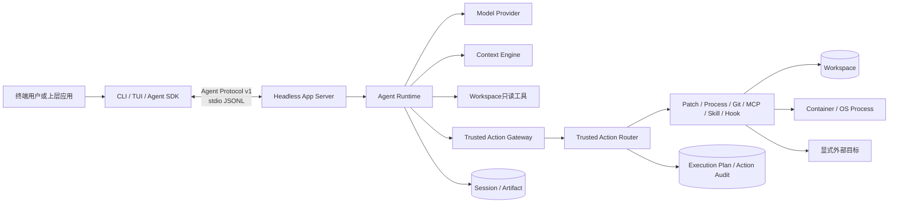
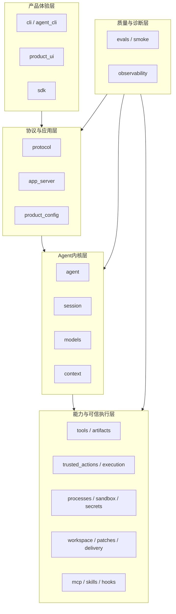
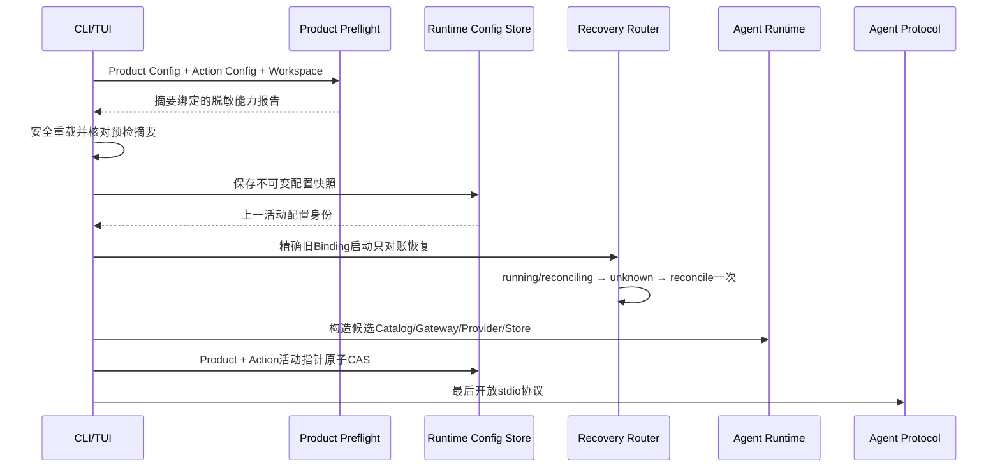
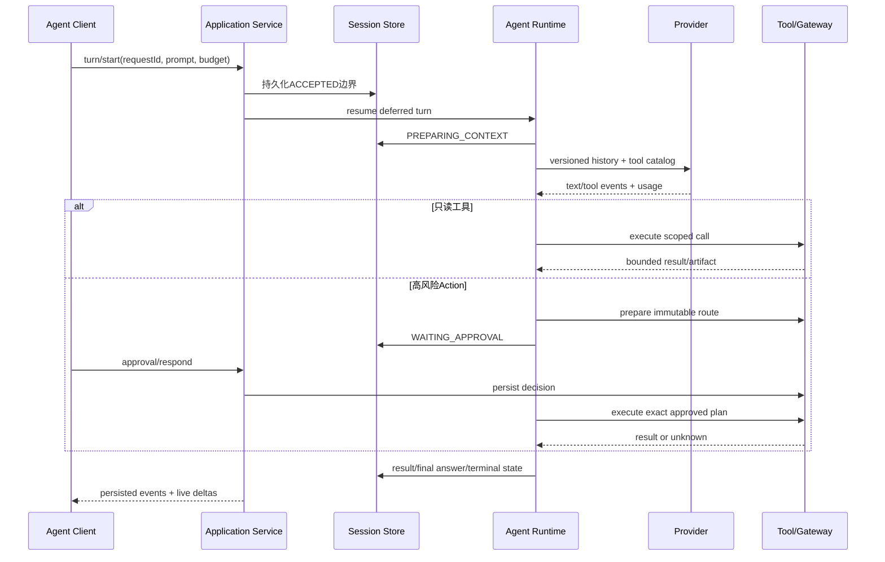
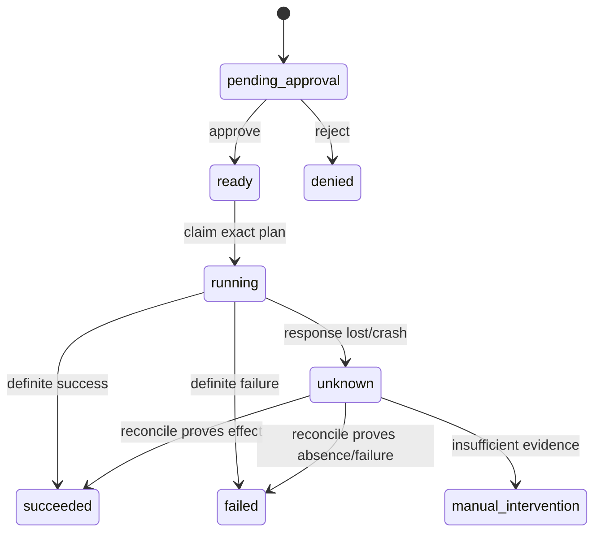
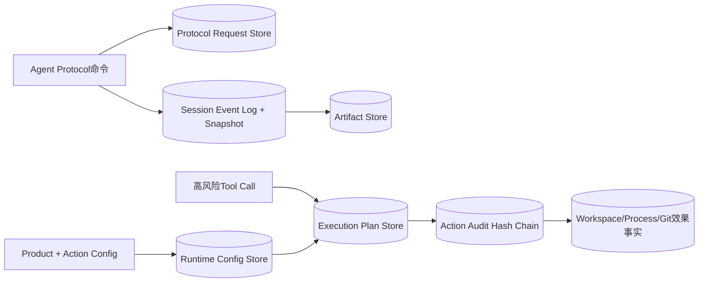
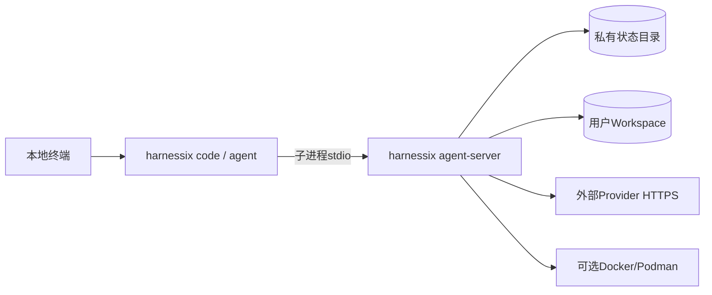

# Harnessix Code总体架构

## 1. 文档摘要

Harnessix Code是本地优先、Provider中立的Coding Agent。唯一公共控制协议是Agent Protocol v1；CLI、TUI和Python
SDK均通过Headless App Server进入同一个Agent Runtime。高风险副作用统一由Trusted Action Gateway/Router持有计划、
Policy、审批、执行和对账权威，不存在面向用户的第二套Action HTTP API或独立Worker Queue。

0.9.1f3已物理删除旧HTTP API、Action HTTP SDK、LangGraph Action Adapter、Effect Journal、Worker、旧Bootstrap、
Demo Executor和服务专用领域合同。旧Process Session事件及旧Process Artifact仅保留只读解码；旧SQLite/PostgreSQL库不
自动迁移、不自动执行，按[归档手册](operations/legacy-action-archive.md)处置。实现Revision `a81868c`已经由
[CI 35453082992](https://github.com/carrie1988/Harnessix/actions/runs/35453082992)完成六实例全矩阵验收。

| 能力标签 | 含义 |
|---|---|
| 当前默认产品 | `harnessix agent-server`实际装配且通过Agent Protocol可达 |
| 显式装配能力 | 源码和测试存在，但需要宿主配置及能力证明，不默认广告 |
| 历史只读兼容 | 只允许解码、展示或归档，不允许审批、恢复或执行 |
| 规划中 | 路线图已定义但没有完成生产验收 |

## 2. 需求背景、目标与非目标

### 2.1 需求背景

真实软件工程任务跨越多轮模型调用、文件读取与修改、测试进程、审批暂停、Git交付和宿主重启。若把这些能力堆在单次
Prompt或一个Shell工具中，就无法回答“谁批准了什么、效果是否已经发生、崩溃后能否重放、哪些内容进入模型历史”。
系统因此将决策、执行、持久事实和产品协议分层。

### 2.2 设计目标

1. Thread/Turn/Item生命周期可持久、可回放、可取消、可恢复；
2. Provider流统一为模型中立事件，重试和用量有明确边界；
3. Context来源、预算、压缩和Tool Result视图可检查；
4. Workspace读写、Process、Git、MCP、Skill和Hook遵守最小权限；
5. 高风险调用先冻结Plan，再Policy/Approval，执行后审计，未知效果只对账不重放；
6. macOS、Linux和Windows差异通过能力探测和平台端口显式表达；
7. CLI/TUI、SDK和自动化共享Agent Protocol与同一持久Session；
8. 测试、Eval、Telemetry和文档能给出可重复发布证据。

### 2.3 当前非目标

- 1.0不建设公网多租户Agent Server、集中控制面或远程Worker池；
- 不向模型开放任意Shell、任意环境或宿主隐式凭据；
- 不把Trace/Metric/Log当作业务账本；
- 不把SQLite文件直接暴露给产品客户端；
- 不恢复已删除的通用Action HTTP/Worker产品面；
- 未通过0.9.2～0.9.6门禁前不宣称正式商用完成。

## 3. 系统上下文



用户或上层应用只能通过Agent Protocol操作Thread、Turn、审批、问题、Steering、取消和Artifact。Router、数据库与Executor
均是内部端口，不是旁路API。未来Remote Executor也只能出现在Router之后，并复用同一Plan、批准和Audit身份。

## 4. 逻辑分层与组件职责



| 分层 | 主要职责 | 禁止旁路 |
|---|---|---|
| 产品体验 | 参数、交互状态、显示、客户端恢复 | 不直接打开Session或执行工具 |
| 协议与应用 | JSON-RPC合同、请求幂等、Product组合根 | 不保存Provider SDK对象，不自行执行副作用 |
| Agent内核 | Loop、状态机、调度、取消、审批和历史 | 不持有OS/Container实现细节 |
| 可信执行 | Plan、Policy、Approval、审计、效果Owner | 不接受模型伪造的身份、路径或权限 |
| 质量与诊断 | 确定性测试、真实Eval、Trace/Metric | 不替代权威业务事实 |

## 5. 产品启动与配置流程



任何配置漂移、Workspace/状态目录重叠、Secret缺失、能力证据不足或旧Route无法安全对账都会在协议开放前失败关闭。
Container不可用时固定Process不广告，不回退到Host执行。

## 6. Agent Turn主流程



`requestId`提供持久业务幂等，JSON-RPC `id`只关联一次连接响应。Live text delta不是权威历史；断线后客户端以持久Event
Replay恢复。任何工具结果必须先提交Session，模型循环才可继续。

## 7. Trusted Action执行与恢复



Router持有统一路由状态和Hash链审计；Execution Plan持有冻结参数、资源、Workspace、Sandbox、Network和Secret版本；
实际效果事实由Workspace Transaction、Process Lease/Receipt、Git远端Ref或外部系统身份持有。重启发现`running`时先转
`unknown`，只调用`reconcile`，绝不重新调用`execute`。

## 8. 数据流与持久化架构



| 持久事实 | Owner | 关键身份 | 恢复语义 |
|---|---|---|---|
| Thread/Turn/Item/Event | Session Store | `thread_id/turn_id/sequence` | Event Replay与Snapshot一致；CAS防并发写 |
| 协议命令结果 | Protocol Request Store | client/request/method | 重连可返回原结果，不重复执行 |
| 大正文 | Artifact Store | artifact/hash/owner scope | 校验摘要、分页、TTL和归属 |
| 执行计划 | Execution Plan Store | `plan_id/fingerprint` | 批准后不可替换参数或资源 |
| Action路由审计 | Action Audit Store | `plan_id/event hash` | running恢复为unknown，只对账 |
| Workspace写入 | Delivery Store | transaction/lease/fencing | 发布游标恢复或Rollback |
| Process | Process Lease/Receipt | process/plan/spec/capability | 不凭PID恢复控制权 |
| 产品配置 | Runtime Config Store | snapshot digest/active pointer | 双配置CAS，上一配置用于恢复 |

各Store共享“先持久事实、后执行副作用、提交结果后继续”的原则，但不被合并为一个万能数据库。跨账本通过稳定身份与摘要核对，
不使用不可靠的分布式事务假象。

## 9. Context、Model与Artifact边界

- Context Source按固定顺序和预算生成带来源/Revision的片段；多来源可做两轮一致性观察；
- Provider适配器只产生规范事件，不把SDK对象写入Session；任意响应后关闭Fallback窗口；
- Tool Result进入模型前按策略裁剪或外置，原始持久Item保持不变；
- Compaction保存计划、输入窗口、摘要、用量和激活边界，失败不替换原历史；
- Artifact正文受Workspace/Thread/Call归属、SHA-256、字节/记录上限和TTL控制；
- Prompt、代码、argv、Diff和Provider正文不进入普通Telemetry。

## 10. Workspace、Process与交付边界

### 10.1 Workspace

路径必须是规范相对路径；读取在POSIX使用FD/no-follow，在Windows使用原生Handle并复核文件身份。Workspace Snapshot与
Lease将Revision、Owner和Fencing绑定到Plan，防止审批后目标漂移或多个执行者并发提交。

### 10.2 Process

模型不能提交任意Shell。产品只从宿主固定Profile派生`ProcessSpec`，并绑定Execution Plan、cwd、程序、argv摘要、环境、
Sandbox、Network和Secret版本。POSIX Owner管理Session/Process Group，Windows Owner使用Job Object/ConPTY；输出先脱敏，
再有界计量、摘要和持久化。

### 10.3 Delivery与Git

Patch先生成Review Artifact和不可变计划，批准后进入Workspace Transaction。Git commit与push分离；push需独立批准、
exact lease和稳定远端Ref，响应丢失后只`ls-remote`对账。

## 11. 扩展模型

| 扩展 | 当前边界 | 默认产品状态 |
|---|---|---|
| MCP | 受管Target、固定Schema目录、Trusted Action调用 | 库实现；按配置和能力显式接入 |
| Skill | 不可执行内容包、来源优先级、渐进读取 | 库实现；内容不自动获得执行权 |
| Hook | 宿主预注册低风险Action、精确摘要授权、持久事件 | 默认未装配 |
| 自定义Executor | 只能实现Trusted Action Definition/Executor端口 | 必须经过Catalog、Policy和Audit |

任何扩展都不能接收Session Store、Secret正文、文件系统对象或裸Executor作为通用能力句柄。

## 12. 失败、取消、超时与恢复矩阵

| 场景 | 权威行为 | 禁止行为 |
|---|---|---|
| Provider零响应传输失败 | 可按显式候选Fallback | 已有任意响应后切换Provider |
| Turn预算耗尽 | 持久FAILED/time_budget_exceeded | 刷新截止时间继续运行 |
| 客户端取消 | 协作取消并持久CANCELLED/保守UNKNOWN | 仅取消Python Task就宣称进程停止 |
| 宿主在副作用后退出 | Route进入unknown并只对账 | 重放非幂等调用 |
| Session结果提交丢确认 | 读取原Plan/Audit/效果后补投影 | 创建第二个Action或Process |
| Workspace漂移 | 执行前失败关闭 | 使用已失效审批继续写入 |
| Process清理失败 | 显式cleanup_failed/unknown | 把非零退出与清理失败混为一谈 |
| 旧Process Session恢复 | `legacy_process_state_archived`且不写库 | 启动已删除Worker或伪造失败终态 |
| 旧Effect Journal | 离线只读检查/归档 | 当前产品自动导入或消费READY记录 |

## 13. 安全与信任边界

1. Agent Protocol当前是本地stdio边界，不是公网认证协议；
2. Model输出全部为不可信建议，Tool定义、Policy和执行身份由宿主提供；
3. Workspace、状态目录和配置文件不得互相包含，也不得通过链接/Junction逃逸；
4. Secret只以引用持久化，明文仅在Provider/Executor最小内存窗口存在；
5. Container不可用时强隔离能力失败关闭，不回退Host；
6. 网络默认拒绝，允许目标需进入冻结Plan；
7. Approval绑定请求指纹、Plan和资源摘要，批准后变化必须重新规划；
8. 日志、Trace、Metric和诊断包只使用受控字段，不保存代码、参数、路径或Secret；
9. Action Audit是审计摘要，不替代目标系统的效果事实；
10. 历史兼容Codec不提供执行端口。

详细威胁与控制见[威胁模型](threat-model.md)。

## 14. 可观测性与评测

Agent `KernelTelemetry`为Turn、Context、Model、Tool、Approval和Recovery生成低基数信号；可选OpenTelemetry适配器传播
W3C Trace Context。Observer故障不得改变Agent结果。可恢复性、质量和成本由持久Session、Action Audit与Eval报告证明，
不依据“日志看起来成功”。

Eval采用`Run → Campaign → Suite`三层证据：Run固定任务结果，Campaign重复同一任务，Suite按预先冻结的Case、任务类别、
仓库Revision和Campaign指纹聚合跨任务指标。0.9.2a已实现并验收从完整Campaign与持久Turn生成摘要、计数和可重算率，不复制
Prompt、回答、工具正文、Diff或路径；Task Pack、可恢复Runner和真实多仓库基线仍是0.9.2后续边界。

测试分为合同、Reducer、集成、故障注入、旧版本升级、三平台、真实Container、Provider Smoke、Coding Eval和文档/Mermaid
门禁。0.9.1f3删除PostgreSQL旧服务后，CI不再启动旧Journal服务，当前矩阵为Linux Python 3.12/3.13、macOS、Windows、
固定镜像Container和Documentation。

## 15. 部署拓扑与平台边界



- macOS/Linux：原生只读文件端口；满足no-follow条件时可广告Workspace Patch；
- Windows：原生Handle只读端口；Patch在完整抗Reparse写端口完成前省略；
- Container Process：要求固定镜像Digest、Engine能力、Owner、资源/网络策略和Secret证明；
- 正式Wheel、安装器、签名、SBOM、升级/卸载和Beta证据属于0.9.5；
- 旧PostgreSQL Journal不是1.0依赖，只有外部归档流程。

## 16. 源码包边界（26个）

| 包 | 单一职责 | 主要下游 |
|---|---|---|
| `agent` | Turn状态机、调度、审批、取消与恢复 | session/models/context/tools/trusted_actions |
| `app_server` | Agent应用服务与stdio生命周期 | protocol/agent |
| `artifacts` | 有界正文、归属、分页、TTL | session/tools/patches |
| `context` | Source、预算、视图和Compaction | agent/models |
| `delivery` | Workspace事务和Git交付 | workspace/execution |
| `domain` | 最小共享值类型与错误信号 | 无基础设施下游 |
| `evals` | Coding Eval任务、评分、Campaign | product_config/agent/processes |
| `execution` | 不可变Plan和批准检查点 | workspace/sandbox/secrets |
| `hooks` | 生命周期匹配与受限Action | trusted_actions |
| `mcp` | 受管连接、目录和Tool Action | trusted_actions |
| `models` | Provider合同、适配器、价格与用量 | 外部SDK |
| `observability` | Trace/Metric/日志抽象与OTel | 可选OTel SDK |
| `patches` | Patch提案、Review、桥接和Diff | agent/artifacts/delivery |
| `processes` | 固定Host Runtime与跨平台Supervisor/Owner | execution/workspace/secrets |
| `product_config` | 配置、Preflight、产品组合和Action Catalog | 全部产品能力 |
| `product_ui` | TUI状态、Controller和子进程Client | sdk |
| `protocol` | Agent Protocol合同、Projection和Server | agent/app_server |
| `sandbox` | 容器、网络、资源与能力证明 | execution/processes |
| `sdk` | Agent Client与Transport | protocol/app_server |
| `secrets` | Secret引用解析、最小注入与脱敏 | models/processes |
| `session` | Event Log、Snapshot、迁移和运行时Owner | SQLite |
| `skills` | 内容包目录、加载与访问账本 | trusted_actions |
| `smoke` | Provider/产品Smoke合同与CLI | product_config/models |
| `tools` | Workspace只读与Git读工具 | agent/workspace/processes |
| `trusted_actions` | 统一Route、Policy、Approval、Audit、Reconcile | execution/专用Executor |
| `workspace` | 路径、Snapshot、Lease和平台文件端口 | OS |

根级`cli.py`、`agent_cli.py`和`__main__.py`只负责命令分发；`file_lock.py`提供受限文件锁；`licensing.py`输出许可信息；
根包不导出旧Action合同。

## 17. 关键接口与数据结构

| 接口/结构 | Owner | 说明 |
|---|---|---|
| `AgentRuntime` | agent | 唯一Turn执行宿主；持久状态只经Session端口提交 |
| `AgentProtocolServer` | protocol | 严格JSON-RPC方法、Frame和错误边界 |
| `AgentApplicationService` | app_server | 命令幂等、投影和长轮询协调 |
| `ModelProvider` | models | 流式Provider中立事件 |
| `ContextPlanner` | context | 构建带检查记录的有界模型输入 |
| `ScopedToolRuntime` | agent/tools | 注入Thread/Turn/Call Workspace作用域 |
| `TrustedActionGateway` | agent/trusted_actions | Agent侧唯一高风险Action端口 |
| `TrustedActionRouter` | trusted_actions | Plan、Policy、Approval、Audit、Execute/Reconcile |
| `ExecutionPlanV2` | execution | 冻结执行参数和全部能力摘要 |
| `ProcessSpec/ProcessLease` | processes | 受监督进程意图与持久生命周期 |
| `WorkspaceTransactionPlan` | delivery | 多文件原子交付计划 |
| `ProductConfigV2` | product_config | Provider/Profile/Secret引用和产品组合 |

## 18. 核心伪代码

```text
start_product(config, workspace, state):
    preflight = inspect_without_side_effects(config, workspace, state)
    require reload(config).digest == preflight.digest
    recover_previous_routes_by_exact_binding(reconcile_only=True)
    owner = build_candidate_product(preflight.capabilities)
    atomically_activate_product_and_action_snapshots()
    open_agent_protocol_last(owner)

execute_high_risk_call(thread, turn, call):
    route = gateway.prepare(call, trusted_context)
    persist immutable plan and policy decision
    if approval_required: persist WAITING_APPROVAL and stop
    require current approval matches exact route fingerprint
    outcome = router.execute_once(route)
    if outcome uncertain: persist UNKNOWN
    persist audited result before continuing model loop

recover_route(route):
    if route.state in {running, reconciling}: persist unknown
    if route.state == unknown: reconcile once by stable external identity
    never call execute during startup recovery
```

## 19. 源码与测试阅读路径

1. [产品组合根](../src/harnessix/product_config/server.py)与[产品配置模块](modules/product-config.md)；
2. [协议合同](../src/harnessix/protocol/contracts.py)、[App Server](../src/harnessix/app_server/server.py)和
   [Agent SDK](../src/harnessix/sdk/agent_client.py)；
3. [Agent Runtime](../src/harnessix/agent/runtime.py)、[Reducer](../src/harnessix/agent/reducer.py)和
   [Session Store](../src/harnessix/session/sqlite.py)；
4. [Trusted Action Router](../src/harnessix/trusted_actions/router.py)、[Execution Plan](../src/harnessix/execution/contracts.py)；
5. [Process Supervisor](../src/harnessix/processes/supervisor.py)、[Workspace](../src/harnessix/workspace/)与
   [Delivery](../src/harnessix/delivery/)；
6. [产品收敛门禁](../tests/governance/test_product_runtime_convergence.py)、
   [历史Session兼容](../tests/agent/test_legacy_process_compatibility.py)和
   [旧库归档测试](../tests/governance/test_legacy_action_archive.py)。

更细文件级路径见[源码阅读地图](guides/source-reading-map.md)，测试分层见[测试与Eval规范](testing-and-evals.md)。

## 20. 当前限制、风险与后续路线

| 风险/缺口 | 当前控制 | 后续切片 |
|---|---|---|
| 三平台发行物未完成 | 源码与CI矩阵验证 | 0.9.5 |
| 长会话容量和退化未固化 | 确定性预算、局部故障测试 | 0.9.3 |
| 多仓库Eval尚无Task Pack与真实基线 | Suite合同候选、单任务Campaign历史证据 | 0.9.2b～e |
| 真实攻击面覆盖不足 | 威胁模型、路径/Secret/网络门禁 | 0.9.4 |
| 默认产品扩展面仍有限 | 显式组合、能力证明、失败关闭 | 0.9.1/0.9.4 |
| 历史Process事件仍占当前模型 | 只读Codec与稳定拒绝错误 | 后续兼容清理窗口 |
| 旧数据库含敏感正文 | 离线归档、不自动迁移、0600输出 | 运维保留策略 |

0.9.1f3关闭了双产品结构，但不等于Harnessix Code已经达到1.0。正式发布仍要求固定Eval/Soak阈值、安全供应链、
签名制品、升级回滚、Beta Dogfooding和最终Go/No-Go证据。

## 21. 变更记录

| 版本 | Revision | 日期 | 变更 |
|---:|---|---|---|
| 58 | `d42ab6c9c55f7f62da0fe8dade6455bd0b1f0373` | 2026-09-20 | 记录0.9.2a Suite与Transcript证据由CI 35456635653完成六实例验收，Task Pack、Runner和真实基线仍未完成 |
| 57 | `459bc4de3e60bf92ed570fa99bdc39b948689591` | 2026-09-20 | 登记0.9.2a多仓库Suite与脱敏Transcript证据候选边界 |
| 56 | `a81868cae5b8092d565a6f465e8a9441b0e1c67b` | 2026-09-20 | 记录单一Coding Agent架构由CI 35453082992完成Linux双版本、macOS、Windows、Container与文档全矩阵验收 |
| 55 | `296650216e5ec0f6819d4fb607e297b988a956a7` | 2026-09-19 | 物理删除独立Action HTTP/Worker体系，重写26包单一Coding Agent架构、历史只读兼容和归档边界 |
| 54 | `89485f321b1a0f73a2e552818298c24b30e3cb3e` | 2026-09-19 | 历史Eval迁入Trusted Action并通过全矩阵验收 |
