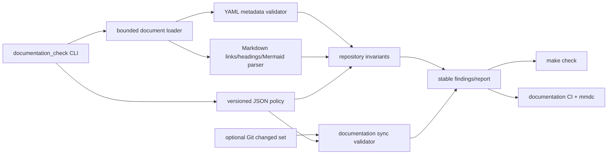
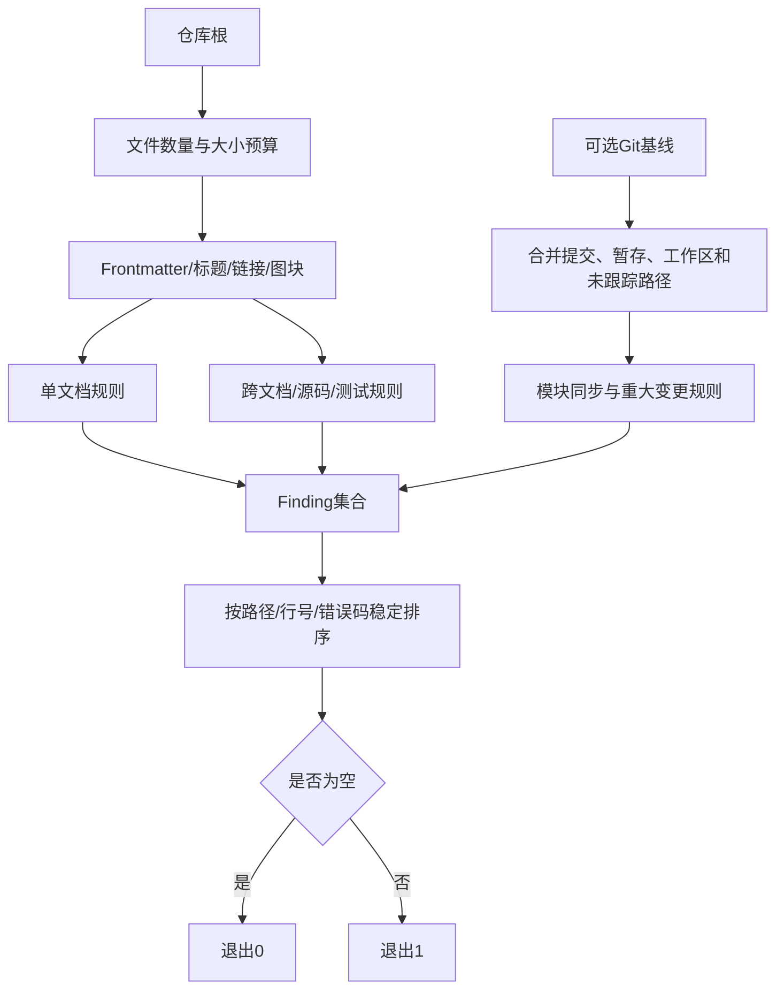

# DOC-1.6自动文档门禁详细设计

## 1. 需求背景

DOC-1.0～DOC-1.5已把历史上按里程碑追加的资料迁移为“当前事实、历史决策、冻结研究、验证证据”四层体系。
当前仓库包含189份Markdown、30个顶层生产源码包、10个根级生产模块、76份既有ADR和27份冻结研究。
人工检查已经证明这些约束可执行，但尚未形成持续阻断：后续0.9产品切片仍可能新增无元数据文档、失效链接、
不完整设计或只改源码不改现行模块说明。

本切片把已经评审的文档规则转为正式工程门禁，不扩展Coding Agent产品功能，也不修改生产协议或持久化Schema。

## 2. 源码求证与设计约束

| 现有位置 | 已核对事实 | 对本设计的约束 |
|---|---|---|
| `Makefile` | `check`依次运行Lint、Readability、Mypy和Pytest | 文档静态检查进入`check`，失败必须阻断 |
| `scripts/readability_report.py` | 仓库工具以纯函数构建报告、CLI选择检查模式 | 文档检查器复用“报告 + 稳定错误”形态，不耦合Runtime |
| `tests/governance/` | 现有许可与可读性门禁通过真实仓库正例和篡改反例验证 | 新规则同时覆盖全库正例与最小反例 |
| `.github/workflows/ci.yml` | Linux双Python、macOS、Windows、PostgreSQL和Container分工明确 | 离线检查三平台执行；Mermaid只在独立Linux文档任务运行 |
| `pyproject.toml` | PyYAML已经是运行依赖，Ruff和Pytest是开发依赖 | 不新增Python依赖；YAML使用安全且拒绝重复键的Loader |
| `docs/governance/documentation-standard.md` | 已定义17类文档、6种状态和9个必填字段 | JSON策略必须与该规范一致 |

## 3. 设计目标与非目标

### 3.1 目标

1. 对全部Markdown执行确定性元数据、生命周期和资源预算检查；
2. 验证全部相对链接、标题锚点、源码路径、测试路径和目录索引覆盖；
3. 验证30个生产包均有`current`模块设计及源码/测试追踪；
4. 对现行模块设计与DOC-1后变更设计执行结构完整度检查；
5. 对Git差异执行“源码包 → 模块设计”和“重大变更 → 变更设计”同步检查；
6. 离线检查Mermaid围栏和图类型，CI使用固定CLI完成变化图表渲染；
7. 一次聚合输出全部问题，提供稳定错误码和JSON报告能力；
8. 拒绝个人绝对路径、疑似Secret和明确的对话过程措辞。

### 3.2 非目标

- 不实现完整CommonMark、GitHub Markdown或Mermaid解析器；
- 不自动生成空章节、ADR、模块文档或测试链接；
- 不依据文档长度判断设计质量；
- 不联网检查外部URL的长期可用性；
- 不将文档工具打包进`harnessix`生产模块；
- 不用门禁替代人工架构、安全和可维护性评审。

## 4. 总体架构



### 4.1 组件职责

| 组件 | 职责 | 明确不承担 |
|---|---|---|
| Policy Loader | 读取并严格校验策略版本、枚举、预算、章节和路径规则 | 不修改策略或补默认安全规则 |
| Document Loader | 有界读取、拒绝符号链接/非法UTF-8、分离Frontmatter与正文 | 不解析任意YAML对象图 |
| Metadata Validator | 字段、类型、状态、版本、提交、关系目标和生命周期 | 不判断正文技术结论正确性 |
| Markdown Validator | 标题、相对链接、锚点、围栏和Mermaid声明 | 不联网访问外链 |
| Repository Validator | ADR/研究索引、源码包模块覆盖、源码/测试链接 | 不推断运行时依赖 |
| Change Sync Validator | 解析Git差异并要求同步模块/变更设计 | 不自动判断业务是否正确 |
| Mermaid Renderer | 调用固定`mmdc`渲染变化图 | 不作为Python安装依赖 |
| Reporter | 排序、去重、文本/JSON输出和退出码 | 不输出Secret匹配正文 |

## 5. 数据流程



输入正文只在内存中解析。报告保存路径、行号、错误码和有界解释，不保存整个文档或疑似Secret值。

## 6. 接口设计

### 6.1 CLI

```text
uv run python scripts/documentation_check.py
uv run python scripts/documentation_check.py --changed-from <git-revision>
uv run python scripts/documentation_check.py --changed-from <git-revision> --render-mermaid
uv run python scripts/documentation_check.py --format json
```

| 参数 | 含义 | 失败语义 |
|---|---|---|
| `--root` | 仓库根；默认脚本父目录 | 不存在或缺少策略时`policy_root_invalid` |
| `--policy` | 策略JSON相对路径 | 非法JSON、未知版本或字段为`policy_invalid` |
| `--changed-from` | 差异基线提交 | 非零且不可解析时`git_base_invalid`；全库静态检查仍执行 |
| `--render-mermaid` | 调用外部`mmdc`渲染变化图或全库图 | 命令缺失/超时/失败分别产生稳定错误 |
| `--format` | `text`或`json` | 未知值由参数解析器拒绝 |

### 6.2 Python接口

| 符号 | 输入 | 输出 |
|---|---|---|
| `load_policy(root, path)` | 根目录、策略路径 | `DocumentationPolicy`或策略Finding |
| `load_documents(root, policy)` | 根目录和预算 | `Document`映射与加载Finding |
| `validate_repository(...)` | 文档、策略、可选变化集合 | 聚合`Finding`列表 |
| `collect_changed_paths(root, revision)` | Git基线 | POSIX相对路径集合或Finding |
| `render_mermaid(...)` | 待渲染图块、命令和超时 | 渲染Finding |

## 7. 数据结构设计

### 7.1 DocumentationPolicy

| 字段 | 含义 | 约束 |
|---|---|---|
| `schema_version` | 策略合同 | 固定`harnessix.documentation-policy/v1` |
| `allowed_doc_types/statuses` | YAML枚举 | 非空、唯一字符串 |
| `required_metadata` | 必填字段 | 必须包含规范的9个字段 |
| `limits` | 文档数、正文、Frontmatter、链接、Mermaid预算 | 正整数且有硬上限 |
| `required_sections` | 文档类型对应语义标题组 | 每组满足任一关键词，禁止空组 |
| `major_change_patterns` | 高风险源码路径正则 | 编译失败则策略整体无效 |
| `root_source_documents` | 根级源码到现行资料映射 | 目标必须存在 |
| `forbidden_patterns` | 个人路径、Secret和过程措辞 | 只报告规则名，不复制匹配值 |

### 7.2 Document

| 字段 | 含义 |
|---|---|
| `path` | 仓库相对POSIX路径 |
| `metadata` | 严格YAML对象 |
| `body` | Frontmatter之后正文 |
| `headings` | 排除围栏后的标题、行号和GitHub风格锚点 |
| `links` | 相对/外部链接目标与行号 |
| `mermaid_blocks` | 图正文、起始行和来源文档 |

### 7.3 Finding

| 字段 | 含义 | 稳定性 |
|---|---|---|
| `code` | 机器错误码 | v1内不改义 |
| `path` | 仓库相对路径 | 使用`/`分隔 |
| `line` | 可选1起始行号 | 未知时为空 |
| `message` | 简体中文有界说明 | 不含Secret正文 |

## 8. 核心业务逻辑伪代码

```text
policy = load_and_validate_policy()
documents = bounded_load_all_markdown()

for document in documents:
    validate_frontmatter_schema_and_lifecycle(document)
    validate_required_semantic_sections(document)
    validate_local_links_and_anchors(document, documents)
    validate_mermaid_structure(document)
    scan_forbidden_content_without_echo(document)

validate_adr_and_research_index_coverage(documents)
validate_every_source_package_has_current_module_document(documents)
validate_module_documents_link_source_and_tests(documents)

if changed_from:
    changed = committed_diff ∪ staged_diff ∪ worktree_diff ∪ untracked
    for changed_source_package:
        require canonical_module_document in changed
    if touches_major_pattern or changes_multiple_packages:
        require changed docs/changes/*.md

if render_mermaid:
    render blocks from changed documents, otherwise all blocks

sort_and_deduplicate_findings()
exit 0 only when findings is empty
```

## 9. 失败、恢复与取消语义

| 场景 | 行为 |
|---|---|
| 单文档解析失败 | 记录Finding，继续检查其他文档；不对该文档执行依赖元数据的规则 |
| 策略无效 | 立即失败，不使用隐式默认值继续 |
| Git基线无效 | 报告`git_base_invalid`，保留全库静态结果，不伪装已执行差异门禁 |
| 某个链接目标缺失 | 报告来源行，继续检查其余链接 |
| Mermaid渲染失败 | 记录来源图块；继续渲染其他变化图，最终失败 |
| 外部取消/SIGINT | 子进程由`subprocess.run`同步回收，CLI传播非零退出；不写仓库文件 |
| 检查器异常 | 顶层转换为单个`internal_error`且不输出文档正文 |

检查器无持久状态，失败后可直接重跑。Mermaid使用临时目录，进程退出后由上下文管理器清理；不会修改原Markdown。

## 10. 安全与资源边界

1. 拒绝Markdown符号链接和仓库外相对路径；
2. YAML使用SafeLoader并拒绝重复键、Alias及未知顶层字段；
3. 文档数量、单文档字节、Frontmatter字节、链接数、标题数和图块数均有预算；
4. Git和Mermaid调用使用固定argv、`shell=False`、有界超时和有界输出；
5. 外部HTTP链接只做语法分类，不联网，避免CI成为SSRF入口；
6. Secret扫描错误不回显匹配内容；
7. JSON报告只包含元数据Finding，不嵌入文档正文；
8. CI权限保持`contents: read`，不接触发布凭据。

## 11. 可观测性与错误分类

CLI成功输出文档数、链接数、图块数、源码包覆盖数和变化文件数；失败按`path:line [code] message`输出。
JSON格式包含策略版本、计数和排序后的Finding数组。检查器不接入生产OpenTelemetry，CI运行时间和失败由GitHub Actions记录。

错误类别至少包括：`policy_*`、`document_*`、`metadata_*`、`link_*`、`anchor_*`、`section_*`、
`index_*`、`module_*`、`content_*`、`git_*`、`doc_sync_*`和`mermaid_*`。

## 12. 测试方案

| 层级 | 场景 | 断言 |
|---|---|---|
| 当前仓库正例 | 全部Markdown、索引和30个源码包 | 零Finding |
| YAML反例 | 缺字段、重复键、错误类型、非法状态、Alias、不可解析提交 | 聚合稳定错误码 |
| Markdown反例 | 目标缺失、锚点缺失、路径逃逸、未闭合围栏 | 精确来源路径和行号 |
| 结构反例 | 模块/变更设计缺语义章节 | 不以正文关键词冒充标题 |
| 追踪反例 | 模块无源码链接、无测试、索引漏文档 | 对应覆盖错误 |
| 安全反例 | 个人路径、伪API Key、超限正文 | 不回显Secret值 |
| 差异正反例 | 单包、根模块、多包、合同/迁移/安全路径 | 正确要求模块设计和变更设计 |
| Mermaid反例 | 空块、未知图类型、渲染器缺失/超时/失败 | 稳定错误且继续聚合 |
| CLI | text/json、成功/失败退出码 | 输出Schema稳定 |

## 13. 源码与测试映射

实施后本节必须链接到实际文件和关键符号。计划位置如下：

- `governance/documentation-policy-v1.json`：策略合同；
- `scripts/documentation_check.py`：检查器和CLI；
- `tests/governance/test_documentation_policy.py`：策略、解析、仓库和差异反例；
- `Makefile`：本地质量门；
- `.github/workflows/ci.yml`：三平台静态检查和Linux Mermaid渲染。

## 14. 部署、兼容与回退

文档工具只在源码仓库和CI运行，不进入wheel入口。`make documentation`提供独立门禁，`make check`组合执行。
CI新增独立文档任务并固定Mermaid CLI版本；Python 3.12/3.13继续执行Pytest中的治理测试。

回退时可从`make check`和CI移除调用，但不得删除策略、设计、测试和失败证据来伪造通过。策略v1不原地改义；
新增文档类型、状态或重大路径语义时递增策略版本并新增ADR或变更设计。

## 15. 风险、取舍与验收标准

| 风险 | 控制 |
|---|---|
| Markdown子集与GitHub渲染差异 | 锚点算法回归 + 变化图真实`mmdc`渲染 |
| 章节关键词被机械满足 | 只检查标题；人工评审继续核对内容、源码和测试 |
| 差异门禁误判普通重构 | 高风险路径和跨包才要求变更设计；单包始终要求模块同步 |
| Windows路径差异 | 内部统一`PurePosixPath`，三平台运行离线测试 |
| Mermaid安装波动 | 固定CLI版本，独立任务，不污染Python门禁 |

完成标准：策略、检查器、测试、Makefile和CI全部落地；当前仓库静态检查零Finding；所有反例测试通过；
变化图表实际渲染通过；全量`make spec`无漂移、`make check`通过；文档中心、路线图和治理待办同步后，
DOC-1.6才可标记完成。
