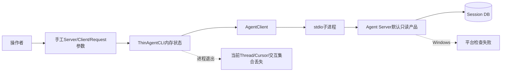
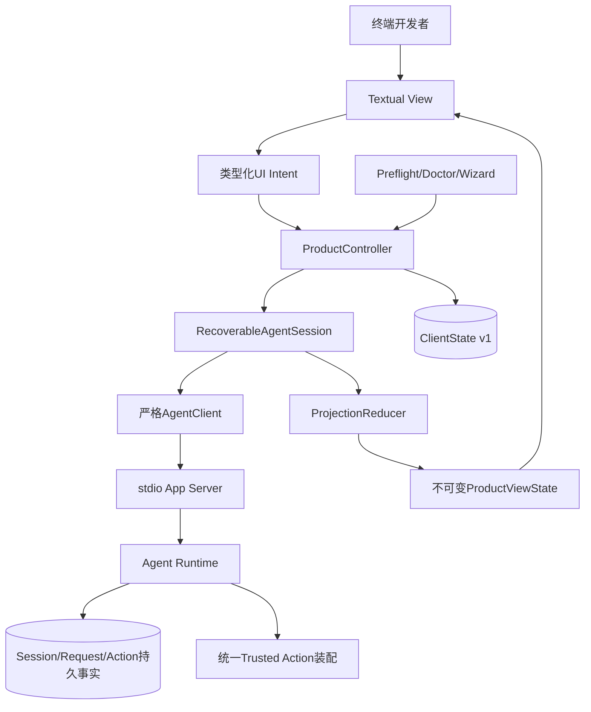
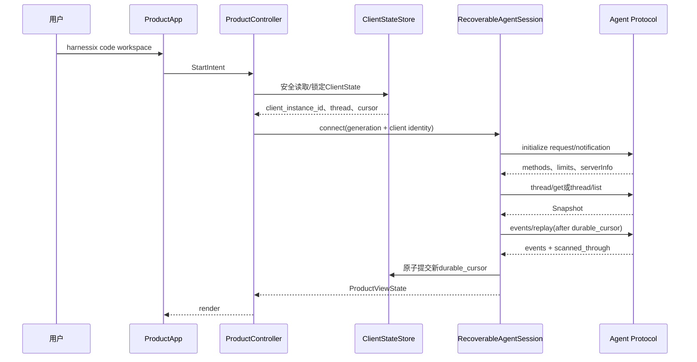
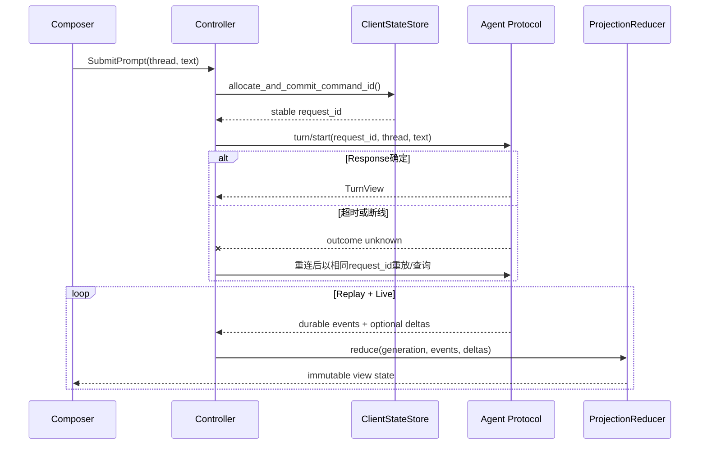
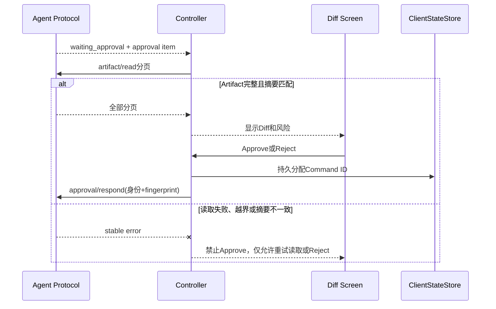
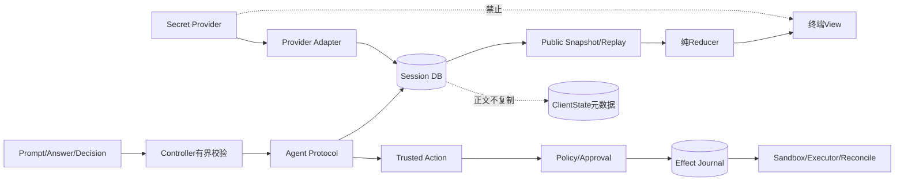
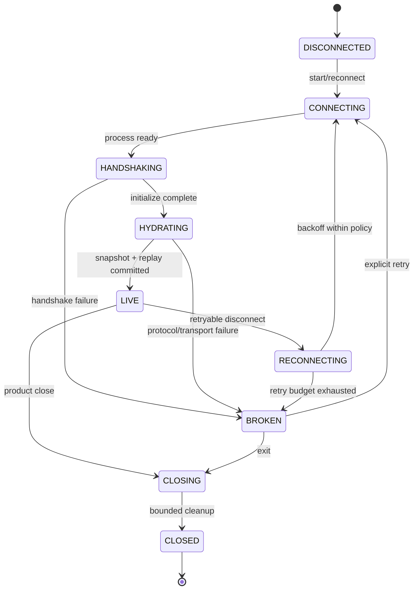
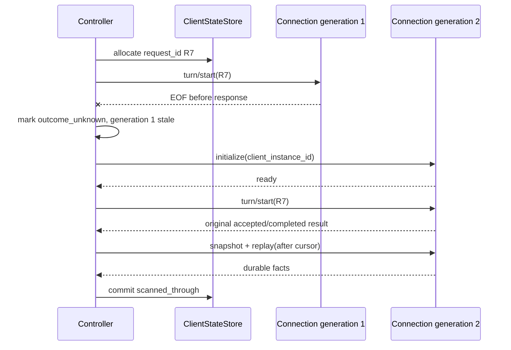

# Harnessix Code 0.9.1 CLI/TUI产品体验详细设计

## 1. 变更摘要

| 项目 | 内容 |
|---|---|
| 需求背景 | 把现有薄CLI和协议能力建设为可恢复、可诊断、三平台可运行的日常Coding Agent终端产品 |
| 当前问题 | 客户端身份/Command/Cursor不持久，SDK边界未完全加固，无完整TUI，Windows默认工具被拒绝，高风险能力未统一装配 |
| 目标结果 | `harnessix code`提供完整终端体验；断线/重启不重复命令、不丢持久事件，默认能力经过统一安全链 |
| 影响模块 | CLI、TUI、SDK、Protocol、App Server、Product Config、Tools、Trusted Actions、Delivery |
| 兼容级别 | 保留Agent Protocol v1及现有`harnessix agent`；新增内部客户端状态v1与产品入口；协议修复不扩大方法集合 |
| 发布/回滚单元 | 0.9.1a～0.9.1e五个可独立验证和回滚的纵向子切片 |

## 2. 需求背景与证据

### 2.1 产品问题

当前`harnessix agent`是协议验收用薄客户端，不是面向真实C端开发者的完整产品：每次启动要求操作者理解stdio
Server argv、客户端UUID、Command ID和Thread ID；进程退出后不保存当前Thread和Cursor；计划、工具、Diff、审批、
成本与错误只按行输出；配置诊断和产品Server是分开的专家命令。

这会产生三类生产风险：

1. **正确性风险**：断线后生成新Command ID可能重复创建Thread或Turn；只记Live Delta可能丢失正文；
2. **安全风险**：Widget或临时CLI逻辑容易绕过Capability、Approval和错误清洗；
3. **可运维风险**：终端异常、配置错误和平台不支持没有统一诊断，Windows默认产品无法启动。

### 2.2 源码证据

- [`ThinAgentCLI`](../../src/harnessix/agent_cli.py)仅在内存保存Item与交互集合；
- [`_parser`](../../src/harnessix/agent_cli.py)要求人工传递Server、Client和Request身份；
- [`AgentClient`](../../src/harnessix/sdk/agent_client.py)没有持久状态Store或连接代际控制器；
- [SDK模块限制](../modules/sdk.md#41-已知限制风险与后续工作)登记Response、Frame、Result和半握手缺口；
- [App Server模块限制](../modules/app-server.md#31-已知限制风险与后续工作)登记版本错误、出站字节和协商Limit缺口；
- [`_require_coding_tool_platform`](../../src/harnessix/product_config/server.py)拒绝非POSIX产品入口；
- [总体架构限制](../architecture.md#20-已知限制与后续演进)登记完整TUI、统一装配和Windows缺口。

参考实现与TUI框架证据已冻结在
[CLI/TUI产品体验源码研究](../research/cli-tui-product-experience.md)，长期取舍进入
[ADR 0078](../adr/0078-product-shell-and-recoverable-client-state.md)。

## 3. 设计目标、非目标与验收标准

### 3.1 设计目标

1. 建立严格、有界、错误稳定的Agent SDK连接边界；
2. 自动且持久管理客户端实例、Command序列、当前Thread和持久Cursor；
3. 通过纯Reducer从Snapshot/Replay/Live构建可重复的产品视图；
4. 交付Textual TUI的完整交互、流式消息、计划、工具进度、Diff、审批、Question、Usage/Cost和会话管理；
5. 提供配置向导、环境Preflight、Doctor和错误自助；
6. 完成Windows原生只读Coding Tool Runtime及默认产品启动；
7. 将Artifact、Patch、Process、Delivery和统一Action安全装配到默认产品，不增加旁路执行；
8. 每个子切片包含失败、恢复、取消、超时、可观测性、跨平台测试和文档同步。

### 3.2 非目标

- 不在0.9.1新增远程多租户、Web UI、云端会话同步或账号系统；
- 不改变Agent Protocol v1的领域模型，不开放JSON-RPC Batch或任意TCP端口；
- 不在TUI实现长期权限授予；“始终允许”必须等待独立Grant契约；
- 不把任意Shell直接暴露给模型或UI；Process仍经过Execution Plan、Policy、Sandbox和Journal；
- 不在客户端复制完整Session数据库或Provider原始响应；
- 不以视觉完成、单一平台手测或正常Prompt成功代替生产验收。

### 3.3 总体验收标准

0.9.1只有在以下全部成立时才能关闭：

- 五个子切片均形成实现提交、回归测试、平台证据和现行模块文档；
- macOS、Linux、Windows可以安装正式终端产品并运行原生只读任务；
- 客户端在发送前、响应前、响应后、Replay中和Live中任一断点重启，不重复命令且不丢持久事件；
- Approval/Question绑定正确Thread、Turn、Item与Fingerprint，Diff失败时不允许盲批；
- 退出、Turn取消、超时、子进程关闭和终端恢复具有可区分结果；
- 默认写入、进程和交付能力没有绕过Policy、Approval、Effect Journal、Sandbox或Reconcile；
- 完整`make check`、三平台CI、实际Mermaid渲染和产品场景验收通过。

## 4. 当前实现、根因与变更前架构



### 4.1 根因

| 表象 | 根因 | 不能采用的局部修复 |
|---|---|---|
| CLI参数复杂 | 产品没有稳定组合根和默认路径解析 | 继续增加Shell脚本拼argv |
| 重启后可能换身份 | SDK只生成进程内默认UUID | 把UUID写入日志后人工复制 |
| Cursor丢失 | `follow`局部变量不是持久确认点 | 用Live Delta数量推算Cursor |
| UI事件竞态 | 无独立Projection Reducer和连接代际 | Widget直接共享可变Dict |
| Windows不能启动 | POSIX Workspace对象安全实现不可移植 | 删除`os.name`检查或仅用`resolve()` |
| 工具能力单一 | 默认产品组合根未接入现有高风险执行链 | TUI直接调用文件/进程库 |

根因是产品层权威、恢复和装配缺失，不是终端颜色或布局不足。

## 5. 方案与变更后总体架构



### 5.1 组件职责

| 组件 | 负责 | 明确不负责 |
|---|---|---|
| `ProductApp` | Textual生命周期、Screen、Widget、Key Binding和渲染 | Agent状态、Command身份、业务重试 |
| `ProductController` | UI Intent排队、命令串行化、任务拥有和关闭 | 协议编解码、终端具体布局 |
| `RecoverableAgentSession` | 连接代际、初始化、Hydration、Replay/Live循环和恢复 | 持久Thread事实和Tool执行 |
| `ProjectionReducer` | 纯函数更新视图、Gap/终态归并和焦点候选 | I/O、时钟、随机数、持久化 |
| `ClientStateStore` | 本地恢复元数据的安全原子读写、锁和迁移 | Transcript、Secret和审批正文 |
| `AgentClient` | 严格协议请求、能力/Limit门禁和稳定错误 | 产品选Thread和UI重试策略 |
| `PreflightService` | 安全关键检查、体验检查和修复动作目录 | 自动修改未知配置或安装软件 |
| `ProductComposition` | 按能力和平台装配现有Action安全链 | 新建旁路Executor |

### 5.2 依赖方向

`tui.widgets → tui.controller → tui.session → sdk → protocol`单向依赖。`ProjectionReducer`只依赖公共Protocol
投影和TUI View Model；SDK不得反向导入TUI。产品组合根可以依赖Tools、Trusted Actions、Patch、Process和
Delivery，但这些模块不能导入Textual。

### 5.3 替代方案

| 方案 | 优点 | 缺点 | 风险 | 结论 |
|---|---|---|---|---|
| 扩展`ThinAgentCLI` | 改动少 | 无布局/焦点/恢复模型 | 继续堆叠单类职责 | 仅保留兼容入口 |
| Widget直连SDK | 上手快 | I/O与生命周期分散 | 重复Command、迟到更新 | 拒绝 |
| Textual + 框架无关应用层 | 三平台、异步、可测试 | 新依赖与分层成本 | 版本兼容 | 采用 |
| TUI本地复制Transcript | 离线显示快 | 双重事实和隐私成本 | 数据漂移 | 拒绝 |
| Windows使用WSL | 无需原生端口 | 不满足正式支持目标 | 安全声明失真 | 拒绝 |

## 6. 正常流程、时序与数据流

### 6.1 启动与恢复时序



图示说明：Client State先于连接读取，使初始化使用稳定实例身份。只有Replay页成功通过Reducer并形成可渲染状态后，
`scanned_through`才持久化。Snapshot不证明本地Cursor已消费，二者不能合并成一个“已同步”布尔值。

### 6.2 新Turn与流式消息时序



Command ID在网络/管道写入前成为持久事实。连接错误不自动生成新ID。Live Delta只刷新临时文本；最终
`item_finished`由持久事件提供完整正文。

### 6.3 审批与Diff时序



审批Modal显示的是待决请求投影，不拥有批准权。提交必须携带协议要求的Thread、Turn、Approval与Fingerprint；
连接恢复后从持久事件重新枚举待决交互。

### 6.4 数据流与信任边界



终端输入是不可信数据，先经过长度、类型和当前状态校验。公开投影是TUI唯一的Agent数据输入。Secret只在Provider或
受控执行作用域解析，不进入View State、Client State、错误Modal或剪贴板默认路径。

## 7. 接口设计

### 7.1 产品CLI

规划入口：

```text
harnessix code [WORKSPACE] [--config PATH] [--profile ID] [--state-directory PATH]
harnessix code --resume [THREAD_ID]
harnessix code doctor [WORKSPACE] [--json]
harnessix code configure [--output PATH]
```

| 参数/动作 | 前置条件 | 结果 | 失败语义 |
|---|---|---|---|
| 默认启动 | Workspace存在且配置/状态安全 | 进入最近Thread或新建选择页 | 安全检查失败不开启Agent交互 |
| `--resume` | Thread属于固定Workspace | 恢复Snapshot/Replay/Live | 不存在/归档/Workspace错配稳定报错 |
| `doctor` | 不要求Provider联网 | 输出有序诊断与修复动作 | `--json`不含Secret值和本机敏感正文 |
| `configure` | 输出目录可安全创建 | 生成严格Product Config草案 | 不覆盖变化文件；使用摘要CAS |

现有`harnessix agent`、`agent-server`和`config`保持兼容，作为低层调试、嵌入和运维入口。

### 7.2 ProductController

```python
class ProductController:
    async def start(self, request: StartRequest) -> ProductViewState: ...
    async def dispatch(self, intent: ProductIntent) -> None: ...
    async def close(self, *, deadline_seconds: float) -> CloseReport: ...
```

`dispatch`接收封闭的Intent联合类型。会产生领域副作用的Intent按单Thread串行化；只读Artifact分页与诊断可以并行，
但结果携带连接代际和目标身份，过期结果被丢弃。方法取消只取消等待者，不据此伪造领域命令取消。

### 7.3 RecoverableAgentSession

```python
class RecoverableAgentSession:
    async def connect(self) -> NegotiatedCapabilities: ...
    async def hydrate(self, thread_id: UUID | None) -> ProductViewState: ...
    async def follow(self) -> AsyncIterator[ProductViewState]: ...
    async def execute(self, command: ProductCommand) -> CommandResolution: ...
    async def reconnect(self, cause: AgentSDKError) -> ProductViewState: ...
    async def close(self) -> None: ...
```

`execute`只接受已经分配`request_id`的Command。自动重连仅用于协议声明可恢复的本地stdio连接错误；参数、权限、
合同和服务端非重试错误不自动重放。重连创建新代际、重做完整握手并以持久事实消解旧命令。

### 7.4 ProjectionReducer

```python
def reduce_snapshot(state: ProductViewState, thread: ThreadView) -> ProductViewState: ...
def reduce_replay(state: ProductViewState, page: EventsReplayResult) -> ProductViewState: ...
def reduce_delta(state: ProductViewState, delta: PublicItemDelta) -> ProductViewState: ...
def reduce_connection(state: ProductViewState, event: ConnectionEvent) -> ProductViewState: ...
```

Reducer是无I/O纯函数。输入违反游标、Item身份或终态不变量时返回稳定Projection错误，不部分修改原状态。

### 7.5 Agent SDK加固

| 接口边界 | 目标合同 |
|---|---|
| Response Envelope | 严格JSON-RPC 2.0；拒绝布尔ID、未知顶层字段、`result/error`共存或缺失、错误ID |
| stdout Frame | `readuntil`/有界缓冲；超限在解析前失败并关闭连接代际 |
| Result | Pydantic Validation Error统一为`AgentSDKError("invalid_result", ...)`，不暴露原始正文 |
| Initialize | Response和Notification作为同一握手事务；第二步失败后连接不可复用，重建子进程 |
| Capability | 方法未广告、本地请求Limit超过协商值时在写入前失败 |
| 迟到Response | 只在同一连接代际和Pending ID匹配时结算；旧代际直接丢弃并计数 |

### 7.6 View与可访问性接口

首版Screen包括Session Picker、Transcript、Composer、Approval/Diff、Question、Cost/Usage、Doctor和Configuration。
所有核心动作同时提供键盘命令和可发现Help；颜色不是状态的唯一表达，窄终端有文本降级，Resize不改变命令状态。

## 8. 数据结构与领域契约

### 8.1 `ClientStateV1`

```text
spec_version: "harnessix.client-state/v1"
client_instance_id: UUID
workspace_fingerprint: SHA-256
next_command_sequence: integer >= 1
selected_thread_id: UUID | null
thread_cursors: map<UUID, integer >= 0>
clean_shutdown: boolean
state_revision: integer >= 1
digest: SHA-256
```

| 字段 | 来源与含义 | 敏感级别 | 持久化/兼容 |
|---|---|---|---|
| `spec_version` | 固定Schema版本 | 公开 | 未知版本拒绝，不宽松读取 |
| `client_instance_id` | 首次安全初始化生成；跨重启稳定 | 内部 | 不作为认证身份 |
| `workspace_fingerprint` | 规范Workspace身份的无正文摘要 | 内部 | 防误绑定，不证明内容未变 |
| `next_command_sequence` | 下一个待分配序列 | 内部关键 | 在发送前原子递增并落盘 |
| `selected_thread_id` | 最近选择Thread | 用户元数据 | 必须由服务端重新验证 |
| `thread_cursors` | 每Thread持久Replay确认点 | 用户元数据 | Live事件不得推进 |
| `clean_shutdown` | 上次是否按序关闭 | 诊断 | `false`触发保守Hydration，不代表损坏 |
| `state_revision` | 本地CAS版本 | 内部关键 | 每次写入单调递增 |
| `digest` | 除自身外规范正文摘要 | 完整性 | 读取不匹配时隔离损坏文件 |

资源上限：最多记录1000个Thread Cursor；文件正文不超过1 MiB；未知字段拒绝。超过Thread数量时只清理已验证归档且
非当前Thread的最旧Cursor，不删除服务端Thread。

### 8.2 Command身份

```text
request_id = "tui-" + compact(client_instance_id) + "-" + base36(sequence)
```

字符串只用于协议幂等命名空间，不含Prompt、Workspace路径或用户信息。序列分配事务返回`request_id`和新
`state_revision`。调用方取消后，该ID仍视为已消费，禁止回退序列。

### 8.3 `ProductViewState`

| 字段组 | 核心字段 | 权威来源 |
|---|---|---|
| Connection | generation、phase、last_error_code | 本地连接状态机 |
| Session | selected_thread、thread_summary、durable_cursor | Snapshot/Replay + ClientState选择 |
| Transcript | 有序Public Item、临时Delta、Gap集合 | 持久Event为权威，Delta为临时 |
| Turn | turn_id、status、可用动作 | `ThreadView.latest_turn`和Turn Event |
| Interaction | pending approval/question、focus target | 持久Public Item投影 |
| Progress | plan steps、tool calls/results | 持久Public Item投影 |
| Cost | token usage、已知货币成本、适用性 | Public Usage/Cost投影；未知不估算 |
| Diagnostics | 稳定错误、自助动作、限制 | Error Catalog/Preflight |

### 8.4 连接状态机



状态转换由Controller单写者执行。`BROKEN`保留最后稳定错误和可重试性，不保留原始响应正文。自动重连只在无安全
错误且未超过当前交互预算时执行；0.9.3再扩展Soak与自适应退避。

## 9. 失败、恢复、取消与超时

### 9.1 失败矩阵

| 故障点 | 对外结果 | 持久事实 | 恢复 |
|---|---|---|---|
| ClientState不存在 | 首次启动 | 原子创建新实例 | 正常继续 |
| ClientState损坏/摘要不符 | `client_state_corrupt` | 原文件只读隔离，不覆盖 | 新实例 + 服务端Thread列表恢复 |
| 状态锁被占用 | `client_state_busy` | 无修改 | 提示现有进程或稍后重试 |
| Command落盘前取消 | 未提交 | 序列不变 | 可重新发起 |
| Command落盘后、写管道前崩溃 | 结果未知 | ID已消费 | 重启后同ID重放/查询 |
| 请求写入后断线 | 结果未知 | 服务端Ledger可能已接受 | 新连接同ID消解 |
| Replay页Reducer失败 | `projection_invalid` | Cursor不推进 | 重新取Snapshot；重复失败则停止 |
| Replay已应用、Cursor落盘失败 | 客户端状态失败 | 服务端事实完整 | 重启重复应用；Reducer须幂等 |
| Live Delta缺口 | 提示恢复中 | Cursor不推进 | Replay持久Item并替换临时文本 |
| Artifact分页失败 | Approval保持待决 | 不提交Decision | 重试读取或Reject |
| Renderer异常 | TUI退出错误 | Agent Turn不自动取消 | 恢复终端；下次启动Replay |
| App Server半握手失败 | `handshake_failed` | 不复用连接 | 关闭并创建新代际 |
| Windows路径对象变化 | 稳定Workspace错误 | 不执行读取 | 重新观察后由新命令重试 |

### 9.2 超时语义

| 超时 | 默认初值 | 语义 |
|---|---:|---|
| 子进程启动/握手 | 10秒 | 未建立可用连接，无领域命令 |
| 普通协议Request | 30秒 | 等待者超时；有Command ID的领域结果为未知 |
| `events/next` | 协商值且不高于30秒 | 正常空轮询，不算故障 |
| Artifact分页 | 每页10秒 | 当前页失败，不允许提交Approve |
| 关闭 | 5秒软限 + 2秒升级 | 先协作关闭，再Terminate/Kill；记录清理结果 |
| Preflight单项 | 5秒 | 安全项失败关闭，体验项降级 |

数值在实现时进入常量与测试，不接受负值、NaN或无限值。外层TUI Worker取消不改变领域超时合同。

### 9.3 失败恢复时序



旧连接的迟到Response即使ID等于R7也不能结算新代际Pending。服务端Command Ledger决定R7是新执行、进行中重开还是
已完成重放；客户端不依据EOF猜测。

## 10. 持久化、事务、并发与数据流程

### 10.1 ClientState写事务

```text
acquire exclusive file lock
read current bytes with size and link checks
validate schema, workspace fingerprint, revision and digest
apply one deterministic mutation
serialize canonical UTF-8 JSON to same-directory temporary file
set private permissions
flush and fsync temporary file
atomic replace target
fsync parent directory where supported
release lock
return committed revision and value
```

Windows使用现有`file_lock`跨平台模式和同卷原子替换；POSIX检查Owner和`0600`。状态目录继续遵循Product Config现有
私有目录及Workspace互斥包含规则。崩溃后目标要么为旧完整版本，要么为新完整版本，不接受半JSON。

### 10.2 并发规则

- 一个状态目录同一时刻只允许一个交互式产品实例持有写锁；
- Controller是UI Intent和Connection State的单写者；
- 每Thread最多一个持久命令执行队列，Artifact只读分页可以并行；
- Projection Reducer按事件Cursor顺序调用；同Cursor重复事件必须幂等，相同Item终态冲突则失败；
- Connection generation单调递增，所有异步结果必须携带发起代际；
- Textual Worker取消后，Controller拥有的协议Task仍按命令语义结算或转入未知恢复。

### 10.3 服务端持久化不变

Agent Session、Protocol Request Ledger、Approval/Question和Effect Journal Schema在0.9.1a不迁移。客户端状态是独立
产品元数据，不能与服务端SQLite放在同一事务中；跨库一致性通过Command ID和Replay恢复，不引入伪分布式事务。

## 11. 安全、权限与信任边界

1. TUI输入限制Prompt、Answer、搜索和路径长度；所有协议Params继续严格拒绝未知字段；
2. ClientState目录与Workspace互不包含，拒绝符号链接/Junction和非私有状态文件；
3. 子进程Transport默认使用受控`harnessix agent-server` argv，不继承无关Secret环境；Provider引用只在Server解析；
4. stdout只允许Agent Protocol帧，日志必须走stderr；超长、Malformed或重复键帧使连接代际失败；
5. 错误目录和诊断报告不回显原始Provider响应、stderr全文、Prompt、Secret或完整环境变量；
6. Approval必须展示资源、风险、Diff可用性和Fingerprint；缺少完整证据不能Approve；
7. Question答案只提交给绑定Question ID，不作为Shell或配置模板直接执行；
8. Windows Workspace拒绝Reparse Point/Junction、ADS、设备名和根逃逸，读前后核对对象身份；
9. Patch、Process、Git Push和扩展继续通过统一Trusted Action与Sandbox；TUI没有直接Executor引用；
10. Textual及传递依赖进入0.9.4许可证、漏洞、SBOM和供应链门禁。

## 12. 可观测性与错误分类

### 12.1 信号

| 信号 | 类型 | 低基数字段 | 禁止字段 |
|---|---|---|---|
| `product.client.connection` | Span/Counter | phase、result、platform | argv全文、stderr正文 |
| `product.client.reconnect` | Counter | reason_code、attempt_bucket | Thread内容 |
| `product.client.command` | Span | method、resolution、retryable | request_id全文、Prompt |
| `product.client.replay` | Span/Histogram | event_count_bucket、gap、result | Event正文 |
| `product.client.state_write` | Counter | operation、result | 状态文件路径、UUID |
| `product.ui.intent` | Counter | intent_type、result | 输入文本 |
| `product.ui.render_failure` | Counter | screen、error_code | Terminal buffer |
| `product.preflight.check` | Counter | check_code、severity、result | Secret值 |

### 12.2 稳定错误分类

| 分类 | 示例错误码 | 默认重试 |
|---|---|---|
| 配置 | `product_config_*`、`configuration_required` | 修复后重试 |
| 客户端状态 | `client_state_busy/corrupt/version/permissions` | 视修复动作 |
| Transport | `transport_start/closed/frame_limit/write_timeout` | 可重建连接 |
| Protocol | `invalid_response/invalid_result/capability_missing` | 不盲重试 |
| Projection | `projection_cursor/item/state_invalid` | 重取Snapshot一次 |
| 交互 | `approval_stale/diff_unavailable/question_stale` | 刷新待决事实 |
| 平台 | `workspace_platform/path_object/feature_unsupported` | 改配置或升级 |
| 生命周期 | `close_timeout/terminal_restore_failed` | 记录并安全退出 |

错误自助目录把错误码映射为简体中文标题、原因、影响、建议命令和文档锚点。未知异常统一为
`product_internal_failure`并生成脱敏诊断关联ID。

## 13. 核心业务逻辑伪代码

### 13.1 启动与Hydration

```text
preflight = run_bounded_preflight()
if preflight.has_security_failure:
    render_repair_only_screen(preflight)
    stop_before_agent_connection()

state = client_state_store.open_exclusive(workspace)
generation = connection_generation.next()
client = connect_and_complete_handshake(generation, state.client_instance_id)
capabilities = validate_required_methods_and_limits(client.initialize_result)

thread = resolve_selected_thread_or_show_picker(state.selected_thread_id)
view = reduce_snapshot(empty_view(generation), get_thread(thread))
cursor = state.cursor_for(thread)

while replay_has_more:
    page = replay(after=cursor)
    candidate = reduce_replay(view, page)
    client_state_store.commit_cursor(thread, page.scanned_through)
    view = candidate
    cursor = page.scanned_through

publish_view(view)
start_live_follow_owned_by_controller(generation, cursor)
```

### 13.2 Command执行与未知结果

```text
validate_intent_against_current_view()
request_id = client_state_store.allocate_command_id_before_send()
command = build_command(intent, request_id, bound_thread_and_turn)

try:
    result = agent_session.execute(command)
except retryable_transport_failure:
    mark_command_outcome_unknown(request_id)
    reconnect_with_new_generation()
    result = agent_session.execute_same_command(command)

hydrate_from_durable_snapshot_and_replay()
publish_resolution(result)
```

### 13.3 Approval

```text
pending = require_current_pending_approval()
artifact = read_all_pages_with_scope_and_digest_checks(pending.diff_artifact)
if artifact is incomplete:
    disable_approve()
    allow_retry_or_reject_only()

decision = await show_modal(pending, artifact)
revalidate_same_pending_identity_and_fingerprint()
request_id = allocate_command_id_before_send()
submit_approval(request_id, pending.identity, decision)
recover_by_replay_until_decision_fact_visible()
```

### 13.4 关闭

```text
stop_accepting_new_ui_intents()
cancel_local_poll_waiters_without_cancelling_turns()
wait_for_inflight_commands_until_soft_deadline()
persist_clean_shutdown_if_state_is_consistent()
close_agent_client_with_terminate_kill_escalation()
restore_terminal_in_finally()
emit_sanitized_close_report()
```

## 14. 实施切片

| 顺序 | 代码/数据改动 | 行为保持或新契约 | 测试 | 可独立回滚 |
|---|---|---|---|---|
| 0.9.1a | SDK Response/Frame/Result/Handshake加固；ClientState、Store、Command分配、连接代际和纯Reducer | 保持Protocol v1；新增Client State v1 | 恶意帧、断线窗口、状态崩溃、Reducer属性与三平台文件测试 | 是；不含Textual |
| 0.9.1b | `harnessix code`、Textual App、Transcript、Composer、Session Picker/Resume | 保留薄CLI；新增正式TUI入口 | `run_test`/Pilot、真实stdio、Resize、Prompt重复提交和退出 | 是；可退回薄CLI |
| 0.9.1c | Plan、Tool、Approval、Question、Diff、Usage/Cost、Cancel/Steer、错误自助 | 不扩张Approval领域值 | 身份错配、Artifact失败、Gap、成本未知、终端恢复 | 是；Screen按能力关闭 |
| 0.9.1d | Configure、Preflight、Doctor、Windows Workspace只读端口和产品装配 | Windows成为原生只读支持平台 | 盘符/UNC/ADS/Reparse/共享竞态、三平台产品Smoke | 是；Windows能力失败关闭 |
| 0.9.1e | Artifact、Patch、Process、Delivery和统一Trusted Action默认装配 | 不新增旁路执行；能力广告按验证结果 | Policy/Approval/Journal/Sandbox/UNKNOWN/交付恢复端到端 | 是；逐能力Feature Gate回退 |

每个子切片执行顺序固定为：源码研究补证据、架构/契约更新、最小实现、故障恢复测试、真实场景验证、现行文档同步。

## 15. 源码与测试映射

### 15.1 当前源码与计划改动

| 设计元素 | 当前源码/计划位置 | 关键符号 | 当前测试/计划验证 |
|---|---|---|---|
| 薄CLI兼容入口 | [`agent_cli.py`](../../src/harnessix/agent_cli.py) | `ThinAgentCLI`、`follow`、`_answer_pending` | [`test_agent_cli.py`](../../tests/app_server/test_agent_cli.py)现有4类行为 |
| SDK严格边界 | [`response.py`](../../src/harnessix/sdk/response.py)、[`agent_client.py`](../../src/harnessix/sdk/agent_client.py) | `_decode_response`、`_validate_result`、`SubprocessAgentTransport`、`AgentClient.initialize` | [`test_server_sdk.py`](../../tests/app_server/test_server_sdk.py)攻击/帧上限/半握手测试 |
| Protocol Envelope/Limit | [`contracts.py`](../../src/harnessix/protocol/contracts.py)、[`server.py`](../../src/harnessix/app_server/server.py) | `validate_server_output`、`InitializeResult`、`AgentProtocolServer` | [`tests/protocol`](../../tests/protocol/)、App Server合同测试 |
| 客户端状态 | 计划`src/harnessix/product_ui/state.py`、`state_store.py` | `ClientStateV1`、`ClientStateStore` | 计划`tests/product_ui/test_state_store.py` |
| 投影Reducer | 计划`src/harnessix/product_ui/projection.py` | `ProductViewState`、`ProjectionReducer` | 计划`tests/product_ui/test_projection.py` |
| Controller/Session | 计划`controller.py`、`session.py` | `ProductController`、`RecoverableAgentSession` | 计划断线窗口和Intent测试 |
| Textual View | 计划`app.py`与`views/` | `ProductApp`和专用Screen/Widget | 计划`App.run_test()`与Pilot测试 |
| 产品配置/启动 | [`product_config/server.py`](../../src/harnessix/product_config/server.py)、[`cli.py`](../../src/harnessix/cli.py) | `run_product_stdio`、`main` | [`test_server_and_cli.py`](../../tests/product_config/test_server_and_cli.py) |
| Windows Workspace | [`workspace`](../../src/harnessix/workspace/)、[`tools`](../../src/harnessix/tools/) | 新Windows观察/读取端口，保留统一Tool合同 | 计划Windows Runner对象安全测试 |
| 统一Action装配 | [`trusted_actions`](../../src/harnessix/trusted_actions/)、[`delivery`](../../src/harnessix/delivery/)、[`processes`](../../src/harnessix/processes/) | `TrustedActionRouter`及现有Executor/Store端口 | 现有模块测试 + 计划产品端到端场景 |

计划路径在对应实现子切片创建后才成为现行源码入口；在此之前不得从本文推断这些文件已经存在。

### 15.2 文档同步矩阵

| 子切片 | 必须更新的现行资料 |
|---|---|
| 0.9.1a | SDK、Protocol、App Server模块；新增Product UI模块设计；总体架构 |
| 0.9.1b | Product UI模块、Product Config模块、部署安装/平台资料、源码阅读路线 |
| 0.9.1c | Product UI、Agent、Models、Artifacts、Tools模块与测试规范 |
| 0.9.1d | Product Config、Workspace、Tools、部署平台/安装/配置/诊断资料与威胁模型 |
| 0.9.1e | Trusted Actions、Patches、Processes、Delivery、Sandbox、Secrets、总体架构与威胁模型 |

## 16. 测试、验证与验收设计

### 16.1 测试层次

| 层级 | 场景 | 核心断言 |
|---|---|---|
| 合同 | Client State、View State、Error Catalog、Intent | 严格字段、未知拒绝、Schema冻结、摘要稳定 |
| Store | 原子写、锁、权限、链接、崩溃窗口、迁移 | 旧或新完整版本；不出现半状态 |
| Reducer | Snapshot、Replay、重复事件、Gap、终态覆盖、乱序 | 确定性、幂等、冲突失败关闭 |
| SDK | 恶意Response、布尔ID、超长帧、无效Result、半握手 | 稳定`AgentSDKError`，有界内存，连接不可误复用 |
| Controller | 重复Submit、关闭、旧代际结果、Command未知 | 一次Intent至多一个持久Command身份 |
| 无头UI | Screen、Modal、焦点、Resize、按键、终端退出 | View与Intent一致，无真实TTY依赖 |
| 纵向stdio | 真实子进程、断线/重启、Replay/Live、审批/问题 | 不丢持久事件，不重复领域副作用 |
| Windows | 盘符、UNC、保留名、ADS、Junction、共享替换 | 根逃逸与对象变化在I/O前后失败关闭 |
| 统一Action | Patch、Process、Delivery、UNKNOWN/Reconcile | 所有副作用经过既有安全链且可恢复 |
| 性能冒烟 | 1万Item投影、千Thread Cursor、大Diff分页 | 预算内完成，无无界正文缓存 |

### 16.2 故障注入点

至少覆盖：状态临时文件flush前后、replace前后、Command分配前后、stdin写入前后、服务端accepted/completed前后、
Initialize Response与Notification之间、Replay应用与Cursor提交之间、Live Gap、Artifact中间页、Approval提交前后、
Renderer异常、Close软限和Windows对象替换。

### 16.3 真实场景

1. 新Workspace通过向导配置并完成只读代码理解；
2. 创建Session、重启TUI、恢复流式Turn并继续Steer；
3. 生成多文件Patch，分页查看Diff，批准后事务提交并验证Git状态；
4. 运行受控测试进程，取消、超时并从持久结果恢复；
5. Windows原生打开含空格/Unicode路径的Git仓库，执行文件读取、搜索和状态查询；
6. 配置缺Secret、状态目录不安全、协议版本不匹配时进入可诊断失败界面。

真实Provider调用只在离线合同和Fake路径通过后进行，并复用既有受控Smoke预算、脱敏和网络门禁；TUI正确性不依赖
付费模型才能验证。

## 17. 部署、兼容与回退

### 17.1 依赖与安装

`pyproject.toml`新增`tui = ["textual>=8.2,<9"]`。开发和CI使用`uv sync --all-extras --dev`；正式终端发行物安装
`harnessix[tui]`。纯App Server、SDK或嵌入部署可不安装TUI Extra。

### 17.2 兼容

- Agent Protocol保持v1；严格客户端只拒绝原合同本就非法的Response；
- `harnessix agent`保留现有参数和输出，不转成全屏界面；
- 新`harnessix code`使用独立产品状态，不读取或改写旧CLI内存状态；
- Client State v1未知版本拒绝，未来升级采用备份、摘要CAS和回退收据；
- Textual View Model不进入Agent公共Schema；更换TUI框架不要求Session迁移。

### 17.3 回退

每个子切片通过独立Feature Gate或入口装配回退：

1. TUI故障时保留薄CLI和`agent-server`；
2. 新能力装配可逐项从广告目录移除，但不得删除已产生的Session/Action事实；
3. Client State升级回退前保留旧文件和迁移收据，不用旧版本读取新Schema；
4. Windows端口失败时明确标记平台不支持，不能回退为不安全POSIX仿真；
5. Protocol严格修复若发现对合法服务端不兼容，修复兼容读取规则，不恢复接受非法Envelope。

## 18. 风险、取舍与停止条件

| 风险 | 控制 | 停止条件 |
|---|---|---|
| 0.9.1范围过大 | 五个可发布子切片、逐片文档和回滚 | 任一切片依赖未满足则不跨层赶工 |
| Textual升级破坏布局/输入 | `<9`约束、无头测试和三平台CI | 无法恢复终端或Windows输入不稳定则停止发布 |
| 本地状态成为第二事实源 | 只存元数据，Transcript始终Replay | 出现正文复制或Command结果猜测则拒绝合入 |
| 自动重连重复副作用 | 发送前持久ID、同ID重放、连接代际 | 无法证明幂等时关闭自动重试 |
| UI隐藏安全信息 | Approval绑定、完整Diff、风险文本 | Diff不完整或Fingerprint不匹配时禁止Approve |
| Windows路径安全复杂 | 独立端口和攻击测试 | 仅靠字符串路径检查时不得宣称支持 |
| 默认装配扩大攻击面 | 逐能力广告、Trusted Action、安全链 | 任一能力可旁路Policy/Journal时立即回退 |
| 大Transcript内存增长 | 分页/虚拟化、有界临时Delta | 1万Item基准超预算时不关闭0.9.1 |

## 19. 实现偏差与最终结论

当前为设计评审状态。0.9.1a已实现第一组SDK边界：严格Response Envelope与JSON预算、构造期子进程Response
Frame上限、`invalid_result`统一错误，以及Initialize任一步失败后关闭并禁止复用当前连接。该组由
`test_sdk_rejects_invalid_response_envelopes`、`test_subprocess_transport_rejects_oversized_response_frame`、
`test_sdk_normalizes_invalid_result_contract`和`test_initialize_notification_failure_makes_connection_unusable`验证；
自动连接代际、Client State、Command分配和Projection Reducer尚未实现，因此0.9.1a仍保持未完成。

后续实施中的任何接口、状态字段、依赖版本、平台边界或切片顺序偏差都必须先更新本文和ADR，再修改代码。每个
子切片完成后记录实际提交、测试数量、三平台CI、真实场景证据和已更新的现行模块文档；五个子切片全部通过前，
路线图0.9.1保持未完成。
