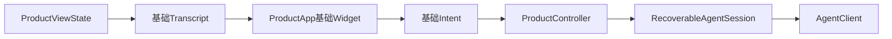
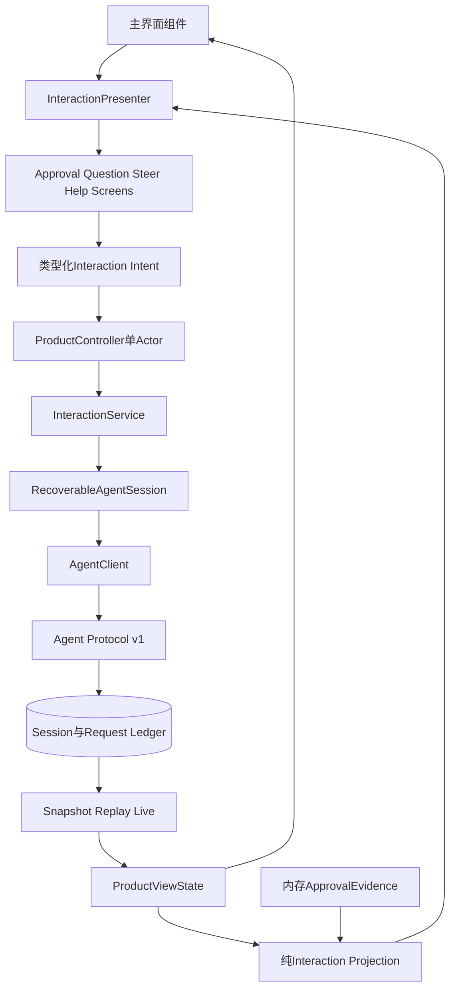
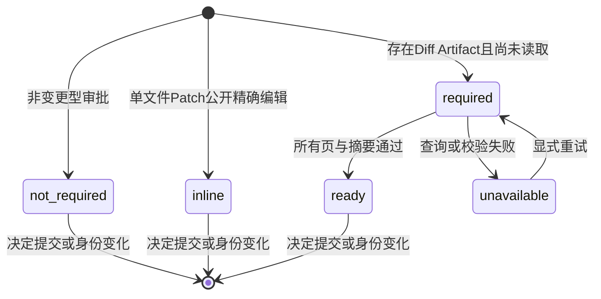
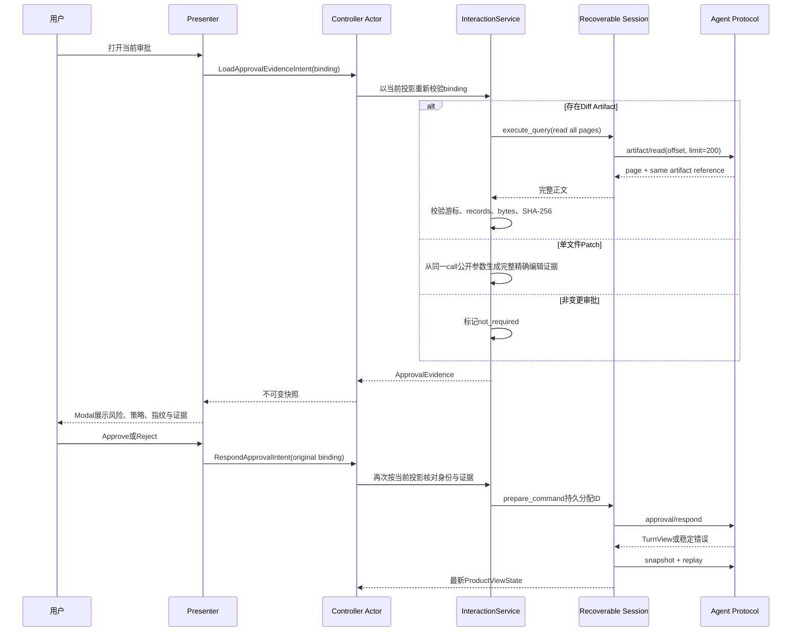
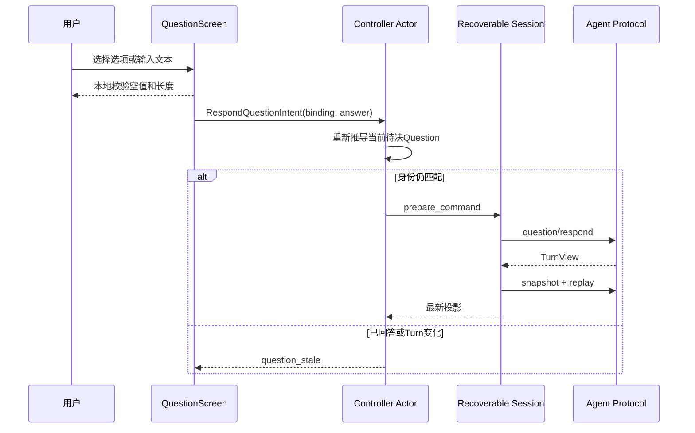
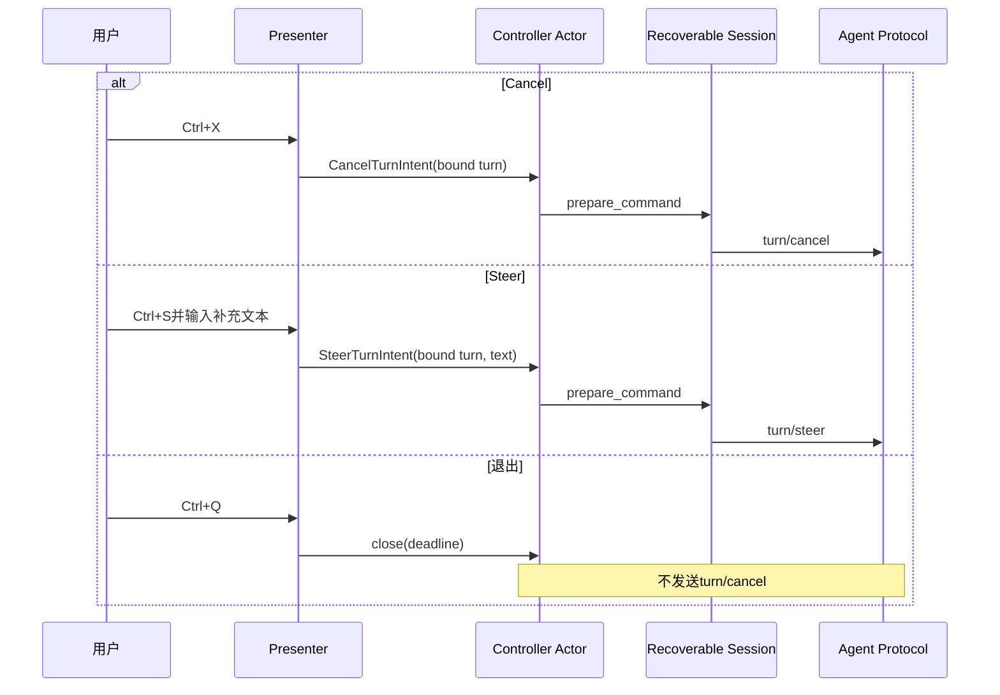

# Harnessix Code 0.9.1c完整领域交互详细设计

## 1. 文档摘要与能力边界

本文定义0.9.1c从基础终端产品链演进到完整领域交互的增量设计。0.9.1a已经建立严格Agent SDK、可恢复
Client State和确定性投影；0.9.1b已经交付`harnessix code`、单Actor Controller、基础Textual界面与真实stdio
冷恢复。0.9.1c在不改变Agent Protocol v1领域值、不建立第二事实源、不开放新执行旁路的前提下增加：

- 完整Plan步骤、Tool生命周期和错误展示；
- 与Thread、Turn、Call、Approval及Fingerprint绑定的审批；
- Patch变更证据和分页Diff Artifact的完整性校验；
- 与Question身份绑定的选项及自由文本回答；
- 显式Turn Cancel与Steer；
- Token Usage、成本未知语义和稳定错误自助；
- 专用Textual Screen/Presenter及无头交互测试。

本切片不实现配置向导、Preflight、Doctor、Windows原生Coding Tool、统一写Action默认装配、价格配置、正式
安装器或长期Soak。它只使已经由协议和Runtime提供的领域交互可以在正式TUI中安全操作。

## 2. 需求背景

基础TUI当前把Plan压缩为步骤数量，把Tool压缩为开始/结果，把Approval压缩为“需要确认操作”，并把Question
作为普通Transcript文本。用户无法在界面中读取审批证据、提交决定或回答问题，也无法区分退出应用、取消Turn与
Steer。状态行只显示Turn状态，不显示Token用量；稳定错误也没有原因、影响和修复动作。

如果直接让Widget调用Agent SDK，会产生以下生产风险：

1. 重绘、焦点切换或重复按键可能发送重复命令；
2. 旧Modal可能对已经变化的Approval或Question提交答案；
3. Diff分页失败后仍允许批准会形成盲批；
4. Cancel、Steer和退出应用混用会破坏领域语义；
5. 把Token Usage解释为金额会把未知成本错误显示为零；
6. 在现有`ProductApp`与`ProductController`继续堆叠职责会突破0.9.0可维护性基线。

## 3. 源码研究与独立决策

固定版本、证据等级和Clean-room边界以
[CLI/TUI产品体验源码研究](../research/cli-tui-product-experience.md)为准。本切片复核以下机制：

| 参考事实 | 可借鉴机制 | Harnessix独立决策 |
|---|---|---|
| Codex TUI把协议审批归一为TUI模型，并由顶层事件路由决定 | 展示模型与审批权分离；旧请求按身份关闭 | `ApprovalReview`只承载公开事实；决定仍由类型化Intent进入Controller |
| Codex Diff使用独立最小展示模型 | Widget不解析Runtime私有状态 | 只消费`PublicToolCallContent`和`PublicArtifactRef`，不读取Agent内部计划对象 |
| OpenCode把Permission和Question作为专用交互 | 焦点和回答状态不与普通Prompt混用 | Approval、Question、Steer分别使用专用Modal，Composer不承担这些输入 |
| OpenCode Hydration与Live投影按事件身份归并 | 旧视图不能覆盖新事实 | 每次提交前重新从当前`ProductViewState`核对完整身份 |
| Claude Code样本把Doctor、Resume、成本和权限分屏 | 避免单个REPL组件承担全部职责 | 新增Presenter与Screen，不继续扩大Controller/App；Doctor保留到0.9.1d |

参考项目的“始终允许”、会话级授权、问题拒绝、价格口径和快捷键不进入本切片。Harnessix只暴露现有协议的
`approved/rejected`，Question协议没有拒绝值时，关闭Modal只表示暂不回答，不伪造领域结果。

## 4. 设计目标与非目标

### 4.1 设计目标

1. 所有领域操作在发送前绑定当前Thread、Turn和交互身份；
2. 产生协议副作用的操作继续先持久分配Command ID；
3. Diff Artifact完整读取、引用一致、游标推进和SHA-256全部通过后才能批准；
4. 单文件Patch无独立Artifact时，完整展示同一Call的公开精确编辑参数，并明确证据类型；
5. Question回答严格限制为1～4000字符，选项只提供输入便利，不放宽协议；
6. Cancel、Steer、关闭应用是三类独立Intent；
7. Plan、Tool、Usage和错误信息由框架中立投影生成，Textual只渲染；
8. 成本不可从当前公共协议证明时显示“未知”，禁止显示零或估算金额；
9. Controller/App不提高已批准规模预算，新逻辑进入专用模块；
10. 正常、身份错配、重复提交、取消、超时、Artifact损坏和恢复均有自动化证据。

### 4.2 非目标

- 不修改Approval outcome或建立“本次会话始终允许”；
- 不把Diff、回答、Steer正文或错误原文写入Client State；
- 不自动批准、不自动回答、不自动重放结果未知的业务命令；
- 不从Provider名称或模型名猜测价格；
- 不让TUI直接依赖Agent内部`Turn`、Patch私有计划或Effect Journal对象；
- 不在本切片开放Windows产品Tool Runtime或写Action默认能力。

## 5. 约束、假设与术语

| 术语 | 定义 |
|---|---|
| 交互绑定 | 一组Thread、Turn、Call和交互ID；Approval额外绑定请求Fingerprint |
| 审批证据 | 用户决定前可见的Tool摘要、参数及可选Diff Artifact完整正文 |
| 完整证据 | 所需Artifact所有页均读取，引用逐页一致，游标严格推进，最终字节数与SHA-256匹配 |
| 待决交互 | 当前Turn状态与持久Item共同证明尚未结算的Approval或Question |
| Presenter | 驱动Modal与类型化Intent的Textual适配层，不访问Transport |
| 费用未知 | 当前协议只证明Token Usage，没有价格绑定和金额报告，不等于零费用 |

Agent Session与Protocol Request Ledger继续是事实源。客户端内存证据只用于当前显示和准入，不在进程重启后恢复；
重启后必须从Replay重新发现交互并重新读取需要的Artifact。

## 6. 总体架构与变更前后对比

### 6.1 变更前



图示说明：基础View只能提交Prompt、选择会话、创建会话和重连；领域Item虽然已经进入投影，但没有专用交互模型。

### 6.2 变更后



图示说明：Presenter可以创建和关闭Screen，但只能发送类型化Intent；Controller仍是唯一协议I/O任务所有者。
`InteractionService`在发送前复核当前投影，调用Session的受控Query或Prepared Command边界。主界面组件负责基础
布局和渲染，从`ProductApp`抽离以守住规模基线。

### 6.3 依赖方向与禁止边界

```text
interaction_screens -> interaction_presenter -> controller -> interactions -> session -> sdk
main_view            -> interaction projection / rendering
```

- `interaction_screens`不得导入SDK、Protocol Transport或Session；
- `interaction_presenter`不得生成Command ID或保存交互正文；
- `interactions`只消费公开协议投影，不导入Agent私有模型；
- `session`不返回裸Transport，不允许Widget发协议帧；
- `ProductApp`只拥有Textual生命周期和Presenter，不实现领域校验。

## 7. 模块与重点类设计

| 组件 | 生命周期与状态 | 直接依赖 | 禁止依赖 |
|---|---|---|---|
| `ProductMainView` | 随App挂载；拥有已渲染Revision和Widget状态 | Controller不可变快照、框架中立渲染函数 | SDK、文件系统、Command ID |
| `InteractionPresenter` | 随App存在；一次只启动一个本地交互Worker | Controller、Screen、错误展示回调 | Transport、持久Store |
| `ApprovalScreen` | 单次Modal；返回批准、拒绝或关闭 | `ApprovalReview` | Controller、Session |
| `QuestionScreen` | 单次Modal；返回规范回答或关闭 | `PendingQuestion` | Question协议调用 |
| `SteerScreen` | 单次Modal；返回补充文本或关闭 | `ActiveTurnControl` | Cancel或退出语义 |
| `HelpScreen` | 单次只读Modal | `ProductErrorHelp` | 原始异常、stderr和环境变量 |
| `InteractionService` | 随Controller存在；无后台任务 | Recoverable Session、当前投影 | Widget、Textual |
| `RecoverableAgentSession.execute_query` | 当前连接代际内串行执行只读SDK查询 | AgentClient、operation lock | Command序列分配 |

`InteractionService`本身不缓存领域事实。`ApprovalEvidence`放在Controller不可变快照中，并在Thread、Turn、Approval
或Fingerprint变化时立即丢弃。

## 8. 接口设计、领域契约与数据结构

### 8.1 类型化Intent

| Intent | 必填字段 | 前置条件 | 是否分配Command ID |
|---|---|---|---|
| `LoadApprovalEvidenceIntent` | `ApprovalBinding` | 当前仍是同一待决Approval | 否，只读Query |
| `RespondApprovalIntent` | Binding、`approved/rejected`、可选reason | 当前身份与Fingerprint一致；批准时证据完整 | 是 |
| `RespondQuestionIntent` | `QuestionBinding`、answer | 当前仍等待同一Question | 是 |
| `CancelTurnIntent` | `TurnBinding` | 当前Turn可取消且仍活动 | 是 |
| `SteerTurnIntent` | `TurnBinding`、text | 当前Turn处于协议允许Steer的状态 | 是 |

Intent对象是冻结Dataclass。调用方取消等待不取消已经进入Actor队列的Intent；Actor关闭超时仍返回
`controller_operation_unknown`并保持已分配Command序列已消费。

### 8.2 身份字段

| 字段 | 类型 | 来源 | 约束 | 敏感级别 | 持久化 |
|---|---|---|---|---|---|
| `thread_id` | UUID | `ProductViewState.thread` | 必须等于当前选择 | 内部身份 | 服务端已有；不新增 |
| `turn_id` | UUID | `current_turn`和Item事件 | 必须等于当前Turn | 内部身份 | 服务端已有；不新增 |
| `call_id` | UUID | Tool Call及交互Item | 两处必须唯一一致 | 内部身份 | 服务端已有；不新增 |
| `approval_id` | UUID | Approval Item | 当前Turn唯一 | 内部身份 | 服务端已有；不新增 |
| `question_id` | UUID | Question Item | 当前Turn唯一且未回答 | 内部身份 | 服务端已有；不新增 |
| `fingerprint` | 64位小写十六进制 | Approval Item | 提交前逐字复核 | 安全关键 | 服务端已有；不新增 |

### 8.3 `ApprovalEvidence`

| 字段 | 类型 | 含义与约束 |
|---|---|---|
| `binding` | `ApprovalBinding` | 证据只属于这一审批身份 |
| `status` | `not_required/inline/required/ready/unavailable` | `ready`只适用于完整Artifact；`inline`为完整公开Tool参数；`required`表示尚未读取 |
| `artifact_id` | UUID或空 | `ready/unavailable`的目标Artifact |
| `text` | String | 最多1 MiB UTF-8，只在内存；不可写Client State |
| `sha256` | 64位摘要或空 | `ready`必须等于公开Artifact引用 |
| `records` | 0～10000 | 完整读取的JSONL记录数 |
| `error_code` | 稳定码或空 | `unavailable`时必填，不保存原始异常 |

状态转换：



图示说明：`required`是派生状态，不持久化。Artifact失败不会关闭Approval，也不会自动Reject；界面保持拒绝和重试
可用，但批准按钮必须禁用。

### 8.4 `UsageCostView`

| 字段 | 类型 | 来源与语义 |
|---|---|---|
| `input_tokens` | 非负整数 | 当前Turn公开累计Usage |
| `output_tokens` | 非负整数 | 当前Turn公开累计Usage |
| `total_tokens` | 非负整数 | 必须等于输入与输出之和 |
| `max_tokens` | 正整数或空 | 当前Turn Budget |
| `cost_status` | 固定`unknown` | Agent Protocol v1未公开价格绑定 |
| `cost_reason` | 固定稳定码 | `price_not_exposed`，禁止输出金额零 |

0.9.6完成价格适用性和发布证据前，不从内部模型账本旁路读取金额，也不在客户端维护价格表。

## 9. 核心流程与时序

### 9.1 Approval与Diff



图示说明：首次打开和最终提交之间可能发生Replay更新，因此提交前必须第二次核对。只读Artifact查询不消费
Command ID；决定请求一定消费Command ID。关闭Modal不发送任何协议命令。

### 9.2 Question回答



图示说明：数字快捷选择只在Screen内转换为实际选项文本；协议收到的始终是明确答案。Modal关闭不等于拒绝问题。

### 9.3 Cancel、Steer与退出分离



图示说明：三条路径具有不同持久事实。退出只关闭客户端；Cancel改变当前Turn；Steer追加当前Turn用户Item。

## 10. Artifact分页与完整性算法

分页读取必须满足：

1. 目标引用`complete=true`，格式为`jsonl/v1`且大小、记录数在协议上限内；
2. 每页`artifact`逐字段等于最初引用；
3. 返回`offset`等于请求值，正文以换行结束，每行计一条记录；
4. `next_offset`严格等于`offset + page_records`并向前推进；
5. 最后一页`next_offset=null`且总记录数等于引用；
6. 拼接UTF-8字节数等于`size_bytes`，SHA-256等于引用；
7. 全部读取受5秒绝对Deadline控制；超时转为`artifact_read_timeout`；
8. 任一失败只保留稳定错误码，不把正文、路径或原始异常写入Notice。

最多读取50页，每页200条；记录数上限10000天然形成页数上限。空Artifact由一页空正文结束，其摘要和字节数仍须匹配。

## 11. 失败、恢复、取消与超时

| 故障 | 对外结果 | Command事实 | 恢复与限制 |
|---|---|---|---|
| Approval身份不再匹配 | `approval_stale` | 不分配 | 刷新投影后重新打开 |
| Question已经回答 | `question_stale` | 不分配 | 等待后续Turn状态 |
| Artifact方法未广告 | `diff_unavailable` | 不分配 | 只能Reject或升级Server |
| 中间页引用变化 | `artifact_reference_changed` | 不分配 | 禁止Approve，可显式重试 |
| 分页游标停滞 | `artifact_pagination_stalled` | 不分配 | 禁止Approve |
| 字节、记录或摘要不符 | `artifact_integrity_failed` | 不分配 | 禁止Approve并诊断服务端 |
| Artifact读取超时 | `artifact_read_timeout` | 不分配 | 重试读取或Reject |
| Approve时证据不完整 | `approval_evidence_required` | 不分配 | 先加载完整证据 |
| 回答/Steer为空或超限 | `question_answer_invalid`/`steering_invalid` | 不分配 | 修正输入 |
| Turn状态不允许Cancel/Steer | `turn_control_stale` | 不分配 | 刷新状态 |
| Command已分配后连接断开 | 原有连接失败与UNKNOWN语义 | ID已消费 | 显式重连并从持久Replay消解，不盲重放正文 |
| Modal或Presenter取消 | 本地关闭 | 不分配 | 不改变领域事实 |
| 应用关闭超时 | `controller_operation_unknown` | 已分配ID不复用 | 冷启动Replay |

Artifact查询取消只终止只读查询，不产生领域命令。已经进入Actor的Approval、Question、Cancel或Steer仍遵循
0.9.1b的shield与有界关闭语义。

## 12. 持久化、事务、并发与幂等

- Client State Schema保持v1，不新增字段和迁移；
- Approval Evidence、Modal输入和错误帮助只在内存存在；
- 每个命令继续由`ClientStateStore.allocate_command_id`先提交序列，再写Transport；
- Controller单Actor保证交互Intent、Poll和会话切换不并发访问同一SDK；
- Agent Protocol Request Ledger以`client_instance_id + request_id + method + params`处理重复与冲突；
- 只读Artifact分页不进入Command Ledger，也不能改变客户端Command序列；
- 提交后是否执行Tool由Agent Runtime和既有Approval事实决定，TUI不预测；
- 证据在选择其他Thread或绑定身份变化时清除，避免跨会话正文残留。
- Steering可能与模型历史Artifact验证并发；Agent Runtime在验证后持Thread锁重建最新历史，只有快照仍相同才
  提交`ModelHistoryPrepared`，否则重新准备。取消已进入`CANCELLING/CANCELLED`时直接走领域取消路径，不能
  因旧历史快照产生`invalid_event`或把取消误记为失败。

## 13. 安全、权限、隐私与信任边界

1. Approval Screen显示类型、Tool、effect class、Policy、Fingerprint短摘要和证据状态；
2. Fingerprint提交使用完整原值，界面只可缩略显示但不得重新计算替代服务端值；
3. Batch Patch只有完整Artifact证据可批准；失败时Reject仍可用，避免用户被锁死；
4. 单文件Patch显示公开精确编辑参数，控制字符由Textual非Markup文本渲染，不解释ANSI/Markup；
5. Question和Steer正文不进入日志、Telemetry、Client State或异常消息；
6. Tool参数和Diff只在当前终端内存展示，不复制到错误自助或状态行；
7. Error Help只使用静态目录，不拼接stderr、Provider响应、环境变量或文件绝对路径；
8. Presenter不能构造长期Grant，Approval outcome严格限定`approved/rejected`；
9. TUI没有Executor、Workspace写句柄、Secret Provider或Effect Journal引用；
10. Windows完整产品支持仍失败关闭，不能由Textual交互通过推导Tool Runtime可用。

## 14. 可观测性与错误自助

0.9.1c暂不引入第二套Telemetry实现。Controller的稳定状态和Notice继续作为本地诊断信号；0.9.3再接入统一产品
Telemetry。错误自助目录使用冻结数据合同：

| 字段 | 说明 |
|---|---|
| `code` | 稳定错误码或受控前缀分类 |
| `title` | 简体中文短标题 |
| `cause` | 不含原始异常的常见原因 |
| `impact` | 对当前Turn、命令或连接的影响 |
| `action` | 用户可以执行的安全动作 |
| `doc_anchor` | 仓库内运维文档相对入口，不含本机路径 |

未知错误统一映射为`product_internal_failure`帮助项；它不声称业务命令失败，只提示重新打开、查看脱敏诊断并根据
持久Replay确认结果。

## 15. 核心业务逻辑伪代码

### 15.1 发现待决交互

```text
derive(view, evidence):
    if view is absent or current_turn is absent:
        return empty interaction view
    select only items whose turn_id equals current_turn.turn_id
    if status is waiting_approval:
        require exactly one undecided approval
        require exactly one tool call with same call_id
        bind thread + turn + call + approval + fingerprint
        retain evidence only when complete binding equals
    if status is waiting_input:
        require exactly one unanswered question
        bind thread + turn + call + question
    derive cancel/steer flags from explicit status allowlists
    derive usage; set cost unknown without amount
```

### 15.2 读取审批证据

```text
load_evidence(intent, current_view):
    pending = derive current approval
    require intent.binding == pending.binding
    if pending is single-file patch:
        return complete non-markup rendering of same-call public arguments
    if pending has no required artifact:
        return not_required
    within absolute deadline:
        offset = 0
        while offset is not terminal:
            page = session.execute_query(artifact/read)
            validate same reference, exact offset, newline records and progress
            append bytes within advertised size
            offset = page.next_offset
    validate total records, bytes and sha256
    return ready evidence
on safe domain failure:
    return unavailable evidence with stable code
on transport failure:
    propagate connection failure; do not claim evidence unavailable only
```

### 15.3 提交审批

```text
respond_approval(intent, current_view, evidence):
    pending = derive current approval again
    require all identity and fingerprint fields equal
    if outcome is approved:
        require evidence status satisfies approval type
    validate reason before command allocation
    command = prepare_command()  # persistent sequence commit
    execute_prepared(command, approval/respond with fixed local actor)
    hydrate same thread from durable snapshot and replay
    clear evidence
```

### 15.4 Cancel与Steer

```text
control_turn(intent, current_view):
    control = derive active turn binding and allowed actions
    require intent binding equals control binding
    validate steer text before allocation
    command = prepare_command()
    call turn/cancel or turn/steer with exact current identity
    hydrate current thread
    never map application close to turn/cancel
```

## 16. Textual交互与无障碍规则

| 动作 | 默认键 | 结果 |
|---|---|---|
| 打开Approval | `Ctrl+A` | 加载证据并打开审批Modal |
| 打开Question | `Ctrl+U` | 打开选项/文本回答Modal |
| Cancel当前Turn | `Ctrl+X` | 发送显式Cancel Intent |
| Steer当前Turn | `Ctrl+S` | 打开Steer Modal |
| 错误帮助 | `F1` | 打开静态自助Modal |
| 退出产品 | `Ctrl+Q` | 有界关闭客户端，不取消Turn |

按钮必须同时具有可见文字，不能只依赖颜色。Modal可由Escape关闭；Escape不提交Approval、Question或Steer。
Approval的Approve按钮在证据不足时禁用，Reject保持可用。终端Resize后内容保持可滚动，输入焦点不能落回主Composer。

## 17. 测试、故障注入与验收

### 17.1 合同与纯函数

- 唯一待决Approval/Question推导、已决/已回答过滤和Turn错绑拒绝；
- Approval Binding逐字段比较，旧Fingerprint、Call或Turn拒绝；
- Plan步骤、Tool状态、Usage/Cost未知和帮助目录确定性；
- Inline Patch证据完整、非Markup、安全大小边界；
- Evidence身份变化后清除。

### 17.2 Session与Controller

- Artifact 0/1/多页、50页上限、引用变化、offset停滞、空页、记录/字节/SHA不一致和超时；
- Load Evidence不消费Command序列；
- Approval、Question、Cancel、Steer在发送前消费且只消费一个Command ID；
- 非法输入和陈旧身份不消费Command ID；
- 调用方取消不取消已接纳Intent；关闭超时保持UNKNOWN；
- 断线后不自动重放Approval reason、Question answer或Steer正文。

### 17.3 无头UI与纵向场景

- Plan、Tool、Token与费用未知在不同终端宽度稳定显示；
- Approval Modal展示证据，Evidence失败时Approve禁用、Reject可用；
- Question选项和自由文本提交，Escape不产生命令；
- Cancel、Steer和Quit分别产生不同效果；
- Steering恰好发生在历史验证与提交之间时，旧检查被丢弃，补充输入进入首个模型请求且Turn不误失败；
- F1未知/已知错误帮助不泄漏原始正文；
- 冷重启后从Replay重新发现待决交互，旧内存证据不存在；
- Linux Python 3.12/3.13、macOS和Windows CI均执行Product UI测试；
- 全量`make check`、真实Mermaid渲染和真实stdio回归通过。

### 17.4 完成标准

- [x] 领域合同、Presenter和Screen源码落地且依赖方向符合本文；
- [x] 所有副作用Intent通过Controller和Prepared Command；
- [x] Artifact完整性及失败关闭测试通过；
- [x] Approval、Question、Cancel、Steer无头纵向测试通过；
- [x] Plan、Tool、Usage/Cost和错误自助可见；
- [x] Controller/App不提高0.9.0批准规模与复杂度预算；
- [x] 本地全量测试、文档门禁和513幅Mermaid真实渲染通过；
- [ ] 三平台CI通过；
- [x] Product UI现行模块设计、总体架构、路线图和运维资料同步；
- [ ] 0.9.1c完成后本文转为`historical`并记录实际Revision与偏差。

## 18. 源码、测试、ADR与证据映射

### 18.1 当前基线

| 设计元素 | 当前源码 | 关键符号 | 当前测试 |
|---|---|---|---|
| 公共Approval/Question/Usage | [`protocol/contracts.py`](../../src/harnessix/protocol/contracts.py) | `PublicApprovalRequestContent`、`PublicQuestionRequestContent`、`PublicUsage` | [`test_server_sdk.py`](../../tests/app_server/test_server_sdk.py) |
| 客户端投影 | [`product_ui/projection.py`](../../src/harnessix/product_ui/projection.py) | `ProductViewState`、`apply_replay_page` | [`test_projection.py`](../../tests/product_ui/test_projection.py) |
| 单Actor命令入口 | [`product_ui/controller.py`](../../src/harnessix/product_ui/controller.py) | `ProductController.dispatch`、`_apply` | [`test_controller.py`](../../tests/product_ui/test_controller.py) |
| 连接与Prepared Command | [`product_ui/session.py`](../../src/harnessix/product_ui/session.py) | `prepare_command`、`execute_prepared` | [`test_recoverable_session.py`](../../tests/product_ui/test_recoverable_session.py) |
| 基础View | [`product_ui/app.py`](../../src/harnessix/product_ui/app.py) | `ProductApp` | [`test_app.py`](../../tests/product_ui/test_app.py) |

### 18.2 实际新增与修改源码

| 职责 | 实际源码与关键符号 | 自动化证据 |
|---|---|---|
| 冻结交互合同与纯投影 | [`interactions.py`](../../src/harnessix/product_ui/interactions.py) `ApprovalBinding`、`QuestionBinding`、`ApprovalEvidence`、`interaction_snapshot`、`approval_review` | [`test_interactions.py`](../../tests/product_ui/test_interactions.py)身份、状态白名单、未知费用及证据准入 |
| Artifact与副作用命令适配 | [`interaction_service.py`](../../src/harnessix/product_ui/interaction_service.py) `InteractionService`、`_read_artifact` | `test_artifact_evidence_*`、`test_batch_approval_without_diff_is_rejected_before_command_allocation` |
| 主视图与领域渲染 | [`main_view.py`](../../src/harnessix/product_ui/main_view.py) `ProductMainView`；[`rendering.py`](../../src/harnessix/product_ui/rendering.py) `transcript_lines` | [`test_rendering.py`](../../tests/product_ui/test_rendering.py)、`test_product_app_answers_question_from_dedicated_modal` |
| 专用Modal | [`interaction_screens.py`](../../src/harnessix/product_ui/interaction_screens.py)四类Screen | [`test_interaction_screens.py`](../../tests/product_ui/test_interaction_screens.py)禁用盲批、选项映射、Escape与脱敏帮助 |
| Textual适配 | [`interaction_presenter.py`](../../src/harnessix/product_ui/interaction_presenter.py) `InteractionPresenter`；[`app.py`](../../src/harnessix/product_ui/app.py)快捷键和生命周期 | [`test_app_interactions.py`](../../tests/product_ui/test_app_interactions.py)完整交互、陈旧Modal和退出语义 |
| Controller与Session边界 | [`controller.py`](../../src/harnessix/product_ui/controller.py)交互Intent分派；[`session.py`](../../src/harnessix/product_ui/session.py) `execute_query` | [`test_controller_interactions.py`](../../tests/product_ui/test_controller_interactions.py)、[`test_recoverable_session.py`](../../tests/product_ui/test_recoverable_session.py) |
| Steering历史竞态 | [`agent/model_history_runtime.py`](../../src/harnessix/agent/model_history_runtime.py) `prepare_and_commit_model_history`；[`agent/runtime.py`](../../src/harnessix/agent/runtime.py) `_drive` | [`test_interactions.py`](../../tests/agent/test_interactions.py) `test_steering_during_history_verification_restarts_preparation`及Product Controller取消/Steer纵向回归 |
| 稳定错误自助 | [`error_help.py`](../../src/harnessix/product_ui/error_help.py) `ProductErrorHelp`、`product_error_help` | `test_help_screen_uses_sanitized_fallback_for_unknown_code` |

决策来源为[ADR 0078](../adr/0078-product-shell-and-recoverable-client-state.md)；整体子切片关系见
[0.9.1详细设计](m09-1-cli-tui-product-experience.md)。实现将原计划中的Artifact读取职责独立为
`interaction_service.py`，并将错误目录独立为`error_help.py`，避免扩大纯合同模块和Textual组件；协议方法、Client
State Schema和Approval领域值均未变化。

## 19. 部署、兼容、迁移与回退

- Agent Protocol版本保持`1.0`，不新增方法和Approval领域值；
- Client State保持`harnessix.client-state/v1`，无需数据迁移；
- Textual依赖范围保持`>=8.2,<9`；
- `harnessix agent`薄CLI行为不变；
- 新Screen按快捷键显式进入，关闭后回到基础产品链；
- 若Screen或Presenter发生回归，可回退0.9.1c提交，0.9.1b的Transcript、Composer、Session Picker和恢复仍可用；
- Windows仅保证平台中立UI合同运行，完整`harnessix code`仍由0.9.1d工具平台门失败关闭。

## 20. 风险、取舍与停止条件

| 风险 | 取舍/控制 | 停止条件 |
|---|---|---|
| 单文件Patch没有Diff Artifact | 显示同一Call的完整公开精确编辑证据并标记类型 | 无法证明Call归属或参数完整时禁止Approve |
| 大Artifact阻塞交互 | 1 MiB、10000记录、50页及5秒绝对上限 | 分页不推进或预算超限立即失败关闭 |
| Modal与Replay竞态 | 提交前按最新投影重新绑定 | 旧Modal可以提交到新交互时停止合入 |
| Presenter重复启动Worker | 单交互本地门闩及Controller队列 | 重复按键可产生多个领域命令时停止合入 |
| 成本数据不足 | 明确显示未知，不旁路内部账本 | 出现金额猜测或未知显示为零时停止发布 |
| App/Controller继续膨胀 | 提取Main View、Presenter和Interaction Service | 可读性批准预算增长时重新设计 |
| UI误导Windows支持 | 平台文档和启动门保持失败关闭 | 仅凭TUI测试宣称Windows产品可用时停止发布 |

0.9.1c本地实现、专项验证、全仓3434项通过/13项跳过及513幅Mermaid真实渲染已经完成；只有三平台CI
通过后才能关闭并更新路线图状态。

## 21. 实现偏差与验证记录

| 设计项 | 实际结果 | 兼容与取舍 |
|---|---|---|
| 领域交互服务 | 从`interactions.py`拆分为`interaction_service.py` | 纯投影无I/O，Artifact和SDK调用集中在服务层，依赖方向更窄 |
| 错误帮助 | 独立`error_help.py`静态目录 | 未知码统一映射`product_internal_failure`，不回显输入、路径或异常正文 |
| Textual主布局 | 从`ProductApp`抽取`ProductMainView` | `ProductApp`保持既有可读性预算，View拆卸期间停止迟到快照渲染 |
| Scripted Provider延时 | 延时改由`CancelToken.run`托管 | 测试Provider与正式协作取消合同一致，取消测试不再等待人为延时结束 |
| Steering与历史准备竞态 | 新增`agent/model_history_runtime.py`乐观重备边界 | Artifact验证后重新核对最新Session模型视图；并发补充不会使Reducer接收过期检查，取消不会误收敛为失败 |
| 成本展示 | 固定`unknown/price_not_exposed` | 未引入客户端价格表或内部账本旁路 |

本地验收覆盖65项`tests/product_ui`测试，并增加1项Agent历史验证竞态确定性回归；`make check`最终为3434项
通过、13项跳过，Ruff、Mypy、Readability、合同生成、文档静态门禁及513幅Mermaid真实渲染均已通过。实现
Revision和CI链接在三平台流水线完成后写入本文，届时文档状态转为`historical`。
