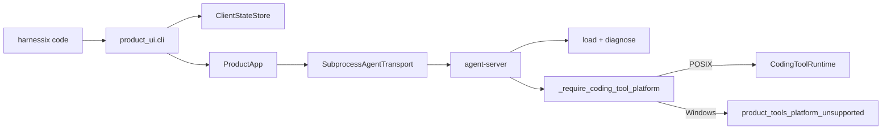
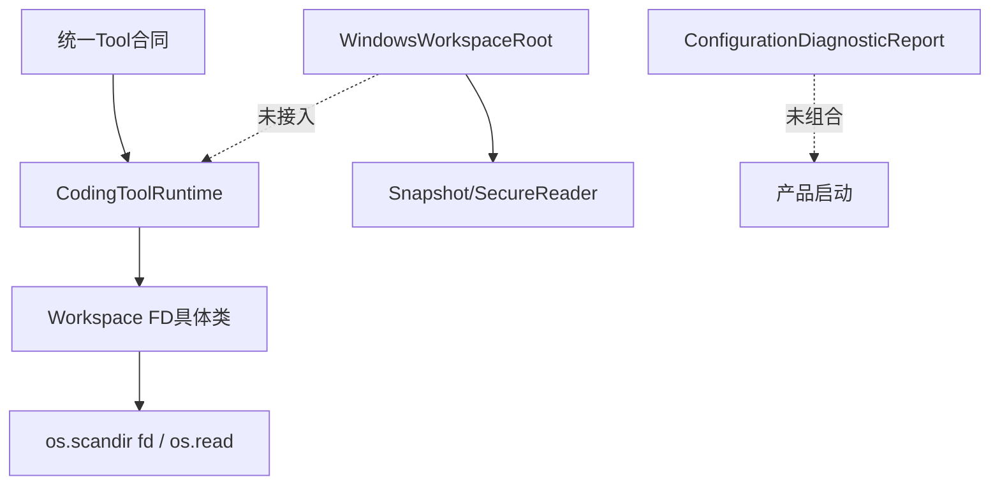
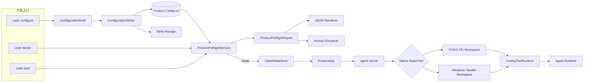
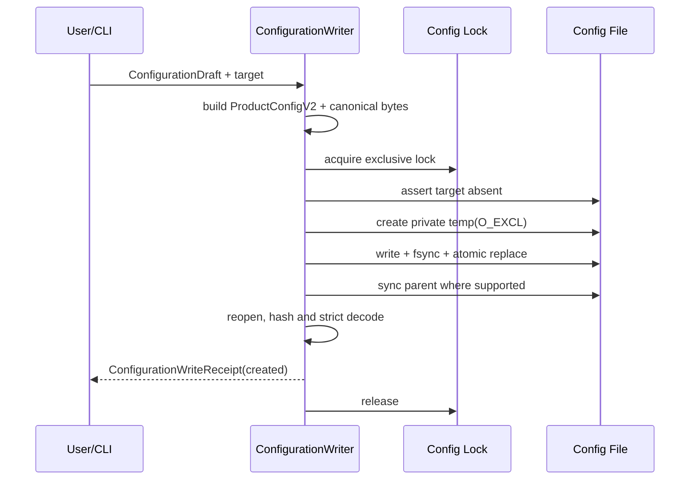
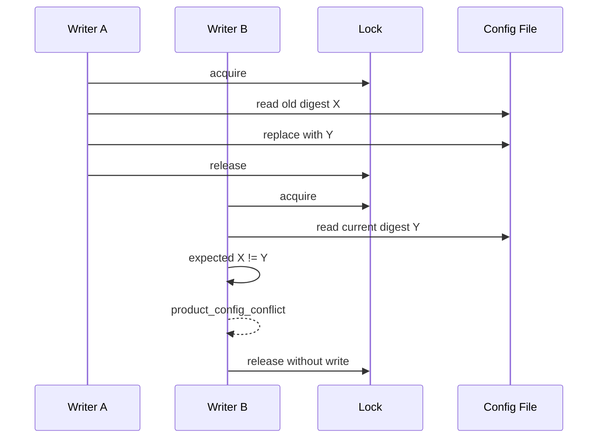
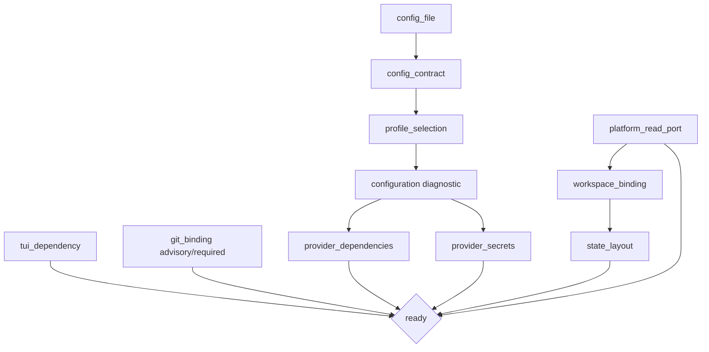
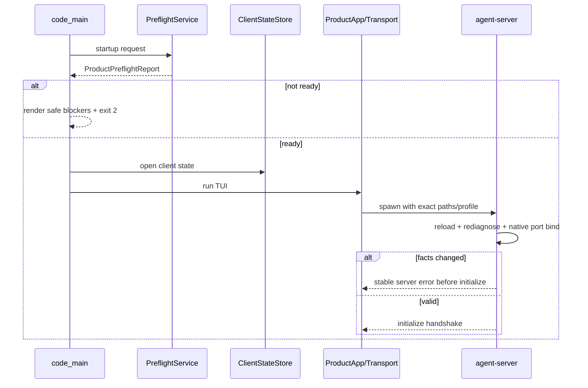
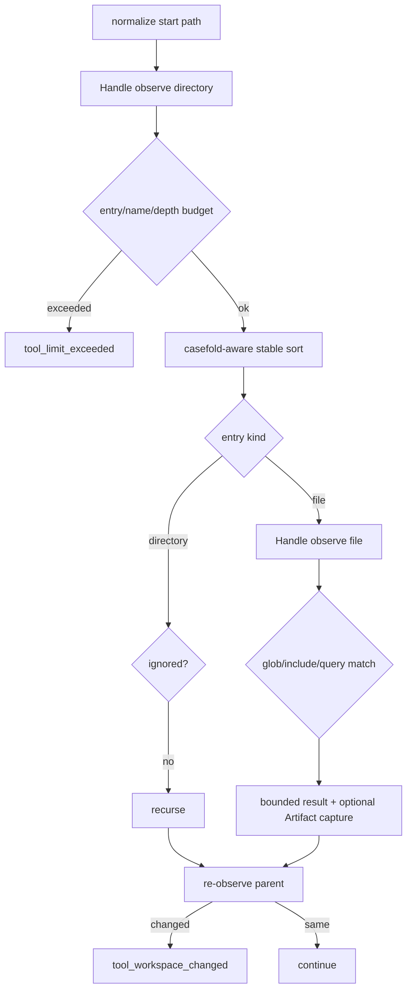

# Harnessix Code 0.9.1d配置、Preflight与Windows原生只读链详细设计

## 1. 变更摘要

| 项目 | 内容 |
|---|---|
| 需求 | 为终端用户提供Secret-free配置向导、离线Preflight/Doctor，并让Windows原生运行默认只读Coding Agent链 |
| 当前问题 | 配置只能手写；启动错误在子进程阶段暴露；Tools绑定POSIX FD；Windows产品入口主动拒绝 |
| 目标结果 | `harnessix code configure/doctor`可用；启动前稳定诊断；Windows Handle端口驱动List/Read/Glob/Grep；真实Server/SDK纵向运行 |
| 影响模块 | Product Config、Product UI CLI、Tools、Workspace、Schema、CI与运维资料 |
| 兼容级别 | Agent Protocol、Session、Client State及现有Tool输入输出Schema保持兼容；新增诊断与配置写收据Schema |
| 发布/回滚单元 | 0.9.1d独立提交；Windows端口失败时恢复平台门，POSIX产品链保持可用 |
| 当前状态 | 实现`532e59b`及本地故障/恢复验证已完成；Windows原生与全矩阵CI待完成 |

## 2. 需求背景与生产风险

0.9.1a～0.9.1c已经交付可恢复客户端、Textual主界面和完整领域交互。终端用户仍必须在启动前理解Product Config v2
全部字段，并自行定位配置、Secret、依赖、Workspace、状态目录或平台错误。Windows虽然已经有安全Workspace Handle
端口，默认Server仍拒绝启动。

这会产生四类真实产品风险：

1. **首次使用失败**：用户容易把API Key写入配置文件，或因字段顺序、能力与Fallback图错误无法启动；
2. **诊断不可操作**：TUI只得到子进程关闭，无法区分配置、依赖、Secret、Workspace和平台根因；
3. **安全虚假兼容**：删除平台门可使普通Path或POSIX假设进入Windows，无法抵抗Junction、ADS和对象替换；
4. **支持声明失真**：Windows UI单测通过不等于真实`agent-server`可运行。

[源码研究](../research/configuration-preflight-and-windows-read-runtime.md)与[ADR 0079](../adr/0079-preflight-and-native-read-port.md)
要求配置写入、只读诊断、启动Preflight和原生工具端口分层，且机器与人类输出共享一个版本化事实。

## 3. 设计目标、非目标与验收标准

### 3.1 目标

1. 提供`harnessix code configure`，从最小用户输入生成严格Product Config v2；
2. 向导只接收Secret引用和环境变量名，禁止接收、输出或持久化Secret值；
3. 新建配置采用安全目录、排他锁、原子替换、文件同步和同目录同步；
4. 已有配置只能通过源SHA-256 CAS替换，冲突不修改原文件；
5. 提供版本化、摘要自校验的产品Preflight报告；
6. `harnessix code doctor`与正常启动运行同一事实检查，Doctor只读、离线；
7. 启动在打开Client State、启动子进程和进入TUI前完成阻断检查；
8. Server在开放stdio前独立复核配置、Workspace、状态与平台端口；
9. Windows复用Win32 Handle Workspace端口实现List/Read/Glob/Grep；
10. Windows保持Tool输入输出、Artifact、取消、Deadline、分页Revision和错误码语义；
11. Windows Runner执行真实`agent-server` + Agent SDK纵向场景；
12. POSIX现有工具行为、版本化合同和性能预算不回退。

### 3.2 非目标

- 不保存API Key，不引入Keychain、Credential Manager或KMS；
- 不在Doctor或Preflight调用Provider网络；
- 不自动安装SDK、Textual、Git或系统组件；
- 不实现Windows写入、Patch、Process、Delivery和Sandbox默认装配；
- 不以WSL、Cygwin或Git Bash作为Windows实现；
- 不在0.9.1d发布安装器或自动更新；
- 不把瞬时Doctor报告当作启动授权或长期健康事实；
- 不改变Agent Protocol v1或Client State v1。

### 3.3 完成标准

- [x] 配置Draft、写收据和Preflight合同冻结并生成Schema；
- [x] 新建、CAS替换、并发、崩溃窗口、链接、权限和脱敏测试通过；
- [x] Doctor JSON/人类输出、退出码、异常隔离和只读性测试通过；
- [x] 启动Preflight失败时不创建状态、不启动Transport；
- [ ] Windows List/Read/Glob/Grep合同与攻击测试已由Fake Port跨平台验证，原生攻击用例待Windows CI；
- [ ] Windows取消、5秒Deadline、关闭和Artifact纵向测试已由Fake Port跨平台验证，原生纵向用例待Windows CI；
- [ ] Windows真实Server/SDK从Unicode、空格和长路径Workspace读取并关闭；
- [x] POSIX Tools和产品Server本地回归通过；
- [ ] Linux Python 3.12/3.13、macOS、Windows CI通过；
- [x] 全量`make check`、文档检查和真实Mermaid渲染在本地通过；
- [x] Product Config、Product UI、Tools、Workspace、平台、配置、诊断和威胁模型文档同步；
- [ ] 本文转为`historical`并记录实际Revision、测试、CI和实现偏差。

## 4. 当前实现与根因

### 4.1 当前启动调用链



问题不是Windows缺少所有底层能力，而是Tools层把Workspace具体类型固定为POSIX FD实现。TUI无法在启动前获得结构化
产品检查，且Client State可能先于最终错误打开。

### 4.2 现有能力可复用性

| 能力 | 当前源码 | 可复用结论 |
|---|---|---|
| 严格配置与摘要 | [`contracts.py`](../../src/harnessix/product_config/contracts.py)、[`codec.py`](../../src/harnessix/product_config/codec.py) | 直接复用Product Config v2与Canonical bytes |
| Provider离线诊断 | [`runtime.py`](../../src/harnessix/product_config/runtime.py) `diagnose_configuration` | 作为产品Preflight子报告 |
| 配置迁移安全写 | [`migration.py`](../../src/harnessix/product_config/migration.py) | 复用锁、原子替换与目录同步思路，不把迁移函数用于新建 |
| Windows对象安全 | [`windows.py`](../../src/harnessix/workspace/windows.py) `WindowsWorkspaceRoot` | 作为唯一Windows Workspace原生能力 |
| 跨平台安全读取 | [`snapshot.py`](../../src/harnessix/workspace/snapshot.py) `SecureWorkspaceReader` | 复用Native Root选择与Handle生命周期 |
| POSIX Tool合同 | [`runtime.py`](../../src/harnessix/tools/runtime.py)、[`files.py`](../../src/harnessix/tools/files.py)、[`search.py`](../../src/harnessix/tools/search.py) | 保持现有实现与公共合同 |

### 4.3 根因



- Tool Runtime的注册、并发和结果校验可跨平台，但读取执行路径直接依赖POSIX Workspace；
- Windows端口已在Workspace层建立，却没有Tools Adapter；
- 配置诊断是局部事实，没有产品级Report和启动编排；
- Config CLI拥有迁移写路径，但没有“从草案生成新配置”的独立事务。

## 5. 变更后总体架构



### 5.1 模块职责

| 模块/类 | 职责 | 禁止职责 |
|---|---|---|
| `ConfigurationDraft` | 保存不含Secret值的向导输入 | Provider对象、环境值、文件路径 |
| `ConfigurationWriter` | 构造严格Config、CAS与原子提交 | 激活Profile、启动Server |
| `ProductPreflightService` | 组合配置与产品环境检查 | 修复、联网、创建Thread |
| `ProductPreflightReport` | 唯一机器事实与摘要 | 原始异常、绝对路径、Secret |
| `DoctorRenderer` | 同一Report的人类文本 | 重新执行检查、改变Ready |
| `WindowsReadRuntime` | Handle观察到现有Read Contract | 普通Path跟随、写入、进程执行 |
| `CodingToolRuntime` | 平台选择、注册、并发、结果与Artifact | UI判断平台、弱化失败语义 |
| `run_product_stdio` | 最终独立复核与托管生命周期 | 信任父进程Report |

### 5.2 依赖方向

```text
product_ui.cli
  → product_config.preflight → product_config.runtime/contracts/codec
  → product_config.wizard → product_config.contracts/codec
  → product_ui state/session/app

product_config.server
  → product_config runtime/store
  → tools.runtime

tools.runtime
  → POSIX files/search/workspace
  → Windows tools.windows_read → workspace.windows/paths
```

`product_config`不导入Textual；Tools不导入Product UI；Windows Workspace不导入Agent或配置模块。

## 6. CLI与用户流程

### 6.1 命令兼容

```text
harnessix code [WORKSPACE] [现有选项]
harnessix code configure [配置草案选项]
harnessix code doctor [WORKSPACE] [启动相关选项] [--json]
```

`code WORKSPACE`保持现有位置参数。入口先检查首个Token是否为保留操作`configure/doctor`，否则使用原启动Parser，避免
把已有Workspace参数强制迁移为`start`子命令。

### 6.2 Configure参数

| 参数 | 必填/默认 | 语义 | 安全边界 |
|---|---|---|---|
| `--config` | 默认用户级Config | 输出文件 | 不进入配置正文或收据 |
| `--provider-kind` | 交互选择 | `openai_chat/anthropic` | 严格枚举 |
| `--provider-id` | `primary` | Provider逻辑ID | 不含地址或Secret |
| `--profile-id` | `primary` | 活动Profile | 单Provider初始图 |
| `--base-url` | 必填 | HTTPS API基址 | 复用`ModelHTTPConfig`校验 |
| `--model` | 必填 | 模型标识 | 严格字符与长度 |
| `--secret-name` | `model-api-key` | Secret逻辑名 | 不是Secret值 |
| `--secret-version` | `environment-v1` | 声明版本 | 非空单行 |
| `--api-key-env` | `MODEL_API_KEY` | 环境变量名 | 不读取其值 |
| `--output-token-parameter` | Provider默认 | OpenAI兼容参数 | Anthropic禁止 |
| `--replace` | 否 | 显式选择替换操作 | 单独使用因缺少CAS而失败 |
| `--expected-source-sha256` | 替换时必填 | 旧文件CAS | 不匹配不改文件；无`--replace`时也失败 |
| `--non-interactive` | 否 | 缺参直接失败 | CI/自动化使用 |

交互模式只提示缺失的非Secret字段。终端从不提示“请输入API Key”；只说明需要在进程环境中设置所选变量。

### 6.3 Doctor参数与退出码

| 场景 | 输出 | 退出码 |
|---|---|---:|
| 所有Required检查通过 | 报告；可含Advisory失败 | 0 |
| 任一Required失败/跳过 | 完整报告 | 2 |
| 参数解析失败 | argparse稳定Usage | 2 |
| Ctrl-C | 不写状态、不启动服务 | 130或Python标准中断 |

`--json`输出完整合同；默认人类输出按配置、依赖、Workspace、状态、平台、TUI、Git分组。两者不得改变检查集合。

## 7. 数据结构与领域契约

### 7.1 `ConfigurationDraft`

| 字段 | 类型/上限 | 语义 | 不变量 |
|---|---|---|---|
| `spec_version` | 固定`harnessix.configuration-draft/v1` | 草案版本 | 固定 |
| `provider_kind` | 枚举 | Provider Adapter | Anthropic无OpenAI参数 |
| `provider_id` | Identifier | Provider逻辑身份 | 小写稳定ID |
| `profile_id` | Identifier | 初始活动Profile | 单Profile且引用Provider |
| `base_url` | HTTPS URL，2048 | Provider API根 | 禁止userinfo/query/fragment |
| `model` | 1～256 | 模型名 | 复用ModelProfile规则 |
| `secret_name` | 1～128 | Secret引用 | 与Source/Provider一致 |
| `secret_version` | 1～128 | 声明版本 | 非空单行 |
| `environment_variable` | 1～128 | Secret来源变量名 | 大写安全格式 |
| `output_token_parameter` | 可空枚举 | OpenAI兼容差异 | Anthropic必须空 |

Builder固定使用现有ModelProfile的安全默认预算，不为首次向导暴露32个高级字段。高级用户可在生成后编辑严格v2文件并运行
Doctor。

### 7.2 `ConfigurationWriteReceipt`

| 字段 | 语义 | 隐私/一致性 |
|---|---|---|
| `spec_version` | `harnessix.configuration-write-receipt/v1` | 固定 |
| `operation` | `created/replaced` | 与旧摘要是否存在一致 |
| `previous_source_sha256` | 被替换旧字节摘要 | 新建时为空 |
| `source_sha256` | 新Canonical文件字节摘要 | 与实际提交字节一致 |
| `config_sha256` | Product Config领域摘要 | 与解析结果一致 |
| `occurred_at` | UTC时间 | Aware |
| `receipt_sha256` | 排除自身后的Canonical摘要 | 自校验 |

收据不含路径、环境变量值、Secret值、Base URL或Model正文。

### 7.3 `ProductPreflightCheck`

| 字段 | 类型 | 说明 |
|---|---|---|
| `check_id` | `product_[a-z0-9_]+` | 稳定唯一ID，按字典序排列 |
| `category` | config/profile/dependency/secret/workspace/state/platform/tui/git | 人类分组 |
| `requirement` | required/advisory | 是否阻断启动 |
| `status` | passed/failed/skipped | `skipped`表示前置事实不足，不伪装通过 |
| `code` | 稳定产品错误码 | 不含异常正文 |
| `remediation_id` | 可空稳定动作ID | Renderer映射安全文字 |
| `duration_ms` | 0～300000 | 单项单调耗时，低基数 |

Required检查只有`passed`才满足Ready；依赖前置失败导致`skipped`仍不满足Ready。Advisory失败不阻断。

### 7.4 `ProductPreflightReport`

| 字段 | 语义 | 不变量 |
|---|---|---|
| `spec_version` | `harnessix.product-preflight/v1` | 固定 |
| `mode` | startup/doctor | 不改变检查事实，仅记录用途 |
| `platform` | posix/windows | 未知平台不构造Ready报告 |
| `workspace_fingerprint` | Workspace规范路径Hash | 不暴露绝对路径 |
| `config_sha256` | 可空配置领域摘要 | 配置不可加载时为空 |
| `selected_profile` | 可空Profile ID | 选择成功时存在 |
| `configuration` | 可空现有ConfigurationDiagnosticReport | 只含脱敏子检查 |
| `checks` | 1～64项 | ID有序唯一 |
| `ready` | 启动结论 | 配置Ready且全部Required为passed |
| `generated_at` | UTC时间 | Aware |
| `report_sha256` | 完整事实摘要 | 自校验 |

## 8. Configure事务、并发与失败恢复

### 8.1 正常创建时序



### 8.2 CAS替换与冲突



- 新建时目标已存在：`product_config_exists`；
- 替换时未提供CAS：`product_config_expected_digest_required`；
- CAS错配：`product_config_conflict`；
- 锁超时：`product_config_lock_timeout`，不写临时结果；
- 写入或同步失败：保留旧文件，清理本次临时文件；
- 原子替换后目录同步失败：返回`product_config_commit_unknown`，不得自动重试；重新运行Doctor和摘要核对后再决定；
- 重开校验失败：`product_config_commit_unknown`，保留提交字节供人工恢复；
- 重复提交同一Canonical配置且CAS指向当前字节：返回`replaced`或可定义No-op，但不得产生不一致摘要。

向导不直接写Product Config审计DB；Server成功进入托管生命周期后，既有Store保存Snapshot并CAS激活。文件收据用于写事务
证据，Store事件用于运行时激活事实，两者职责不同。

## 9. Preflight检查图与失败语义

### 9.1 检查依赖图



### 9.2 检查目录

| Check ID | Requirement | 通过条件 | 失败码/修复动作 |
|---|---|---|---|
| `product_config_file` | required | 文件存在、受控读取可完成 | `product_config_unavailable` / run_configure |
| `product_config_contract` | required | 严格v2 Snapshot | migration_required或invalid / migrate_or_configure |
| `product_profile_selection` | required | Profile选择与摘要有效 | `product_profile_not_found` / select_profile |
| `product_provider_dependencies` | required | 选中链SDK均存在 | `product_dependency_missing` / install_provider_extra |
| `product_provider_secrets` | required | Secret版本存在且格式可用 | `secret_unavailable` / set_environment_secret |
| `product_platform_read_port` | required | POSIX FD或Windows Handle端口可构造 | platform_unsupported / use_supported_platform |
| `product_workspace_binding` | required | 根目录身份安全且可读取 | workspace_invalid / inspect_workspace |
| `product_state_layout` | required | 绝对位置不与Workspace互相包含且现有节点安全 | state_invalid/overlap / choose_state_directory |
| `product_tui_dependency` | required(startup) / advisory(doctor可指定no-tui) | Textual可导入 | tui_dependency_missing / install_tui_extra |
| `product_git_binding` | explicit时required，否则advisory skipped | 可执行文件普通、平台受支持 | product_git_invalid/unsupported / omit_or_install_git |

检查实现必须捕获预期`KernelError`并转换为稳定Check，不把异常文本进入报告。未知异常只把对应Check标记
`product_internal_failure`，Doctor继续后续独立检查；Startup仍不Ready。

### 9.3 启动时序



Preflight与Server复核之间不传递“已授权”布尔值。Server重新读取配置、重绑定Root、重新检查重叠并构造Tools，确保父进程
检查后替换不会绕过安全边界。

## 10. Windows原生Read Runtime

### 10.1 适配器边界

计划新增`src/harnessix/tools/windows_read.py`，内部持有`WindowsWorkspaceRoot`。它不导出新的Agent Tool名称，
只实现现有四种输入到现有输出的映射：

```text
ListFilesInput → ListFilesOutput
ReadFileInput  → ReadFileOutput
GlobInput      → GlobOutput
GrepInput      → GrepOutput
```

`CodingToolRuntime`根据`os.name`选择现有POSIX Workspace或Windows Adapter；未知平台抛出
`product_tools_platform_unsupported`。ToolDescriptor的`implementation`仍是`coding-read/v1`，但Scope包含平台、Root
身份、拒绝策略和Windows端口摘要，因此Version/Fingerprint不同。

### 10.2 路径和拒绝策略

调用顺序固定为：

```text
validate Tool input
→ validate common denied names/custom denied prefixes
→ normalize_workspace_path(path, "windows")
→ WindowsWorkspaceRoot.observe(...)
→ verify object/revision/result budgets
→ build existing output contract
```

共同拒绝：`.git`、`.harnessix`、`.codex`、`.ssh`、`.aws`、`.gnupg`、`.env`、私钥常见名、证书/私钥后缀和宿主配置的
Denied Prefix。Windows额外拒绝盘符、UNC逻辑输入、反斜线、ADS冒号、设备名、尾随点/空格、超长段、Reparse和多硬链接。
宿主Root本身可以是盘符或UNC绝对路径，但不进入模型路径。

### 10.3 List与Read Revision

目录Revision：

```text
sha256(platform_scope, logical_path, root/object identity, sorted member identity body)
```

文件Revision：

```text
sha256(platform_scope, logical_path, object stable identity, size, content sha256)
```

后续页携带`expected_revision`；不一致返回`tool_page_changed`。读取始终基于一次Handle观察的完整字节，再按现有24 KiB正文、
2000行、4 KiB单行和2 MiB扫描上限生成分页。大文件不会因只返回后续页而绕过总扫描预算。

### 10.4 Glob/Grep遍历



- 深度、条目、名称字节、单文件、总读取、单记录和预览上限与POSIX一致；
- 目录和结果排序使用Windows大小写比较键，并用原始名称输出；
- 大小写折叠冲突由Workspace端口拒绝；
- 不跟随Link，不扫描特殊项；
- 每个目录处理后重新观察，成员变化使调用失败，不返回伪完整结果；
- 每次Handle读取循环、目录项和匹配行执行`ReadOperation.checkpoint()`；
- Artifact Capture继续使用同一`SearchCapture`及记录/字节上限。

### 10.5 取消、Deadline和关闭

`CodingToolRuntime`继续通过`run_read_operation`在线程执行同步原生I/O。取消时设置`ReadOperation.stopped`，Windows读取、
遍历和重核对在下一检查点抛出`TurnCancelled`；调用方等待线程退出后再交付取消。5秒Deadline产生`tool_timeout`。

关闭流程：

1. 标记Runtime closed，拒绝新调用；
2. 获取全部BoundedSemaphore permits，等待活动读线程退出；
3. 关闭POSIX Root FD或Windows Root Handle；
4. 释放permits并完成关闭；
5. 调用方取消关闭时仍回收关闭Task，不泄漏Root能力。

### 10.6 Git能力

现有`GitReadRuntime`依赖POSIX `HostProcessRuntime`和POSIX环境隔离。0.9.1d不把它伪装为Windows可用：

- 未传`--git-executable`：Windows广告List/Read/Glob/Grep，产品正常启动；
- Windows显式传Git：Preflight和Server返回`product_git_platform_unsupported`；
- POSIX显式Git保持现有`git_status/git_diff`；
- Windows原生Git需以后建立受管Process/Job、环境、Hook、配置和路径等价验证，再独立开放。

## 11. 重点接口设计

### 11.1 配置Builder与Writer

```python
@dataclass(frozen=True, slots=True)
class ConfigurationWriteRequest:
    path: Path
    draft: ConfigurationDraft
    expected_source_sha256: str | None = None
    replace: bool = False


def build_product_config(draft: ConfigurationDraft) -> ProductConfigV2: ...


def write_product_config(request: ConfigurationWriteRequest) -> ConfigurationWriteReceipt: ...
```

Writer内部再次Pydantic round-trip Draft和Config；调用方不能传预编码字节绕过Canonical输出。

### 11.2 Preflight服务

```python
@dataclass(frozen=True, slots=True)
class ProductPreflightRequest:
    mode: Literal["startup", "doctor"]
    config_path: Path
    profile_id: str | None
    workspace: Path
    state_directory: Path
    git_executable: Path | None
    require_tui: bool = True


def run_product_preflight(request: ProductPreflightRequest) -> ProductPreflightReport: ...
```

服务依赖可注入的Dependency Finder、Clock和Workspace Probe用于确定性测试；正式入口使用真实实现。测试注入不得进入公共CLI。

### 11.3 Windows读取适配器

```python
class WindowsReadRuntime:
    root: Path
    scope: str

    def execute(
        self,
        args: ListFilesInput | ReadFileInput | GlobInput | GrepInput,
        operation: ReadOperation,
        *,
        capture: SearchCapture | None = None,
    ) -> ReadContract: ...

    def verify_root(self, operation: ReadOperation) -> None: ...
    def close(self) -> None: ...
```

该类只在`os.name == "nt"`构造。测试辅助不能在POSIX伪造Windows安全通过；纯排序、分页和文本转换可用Fake Observation
单测，真实Handle保证只能由Windows Runner证明。

## 12. 核心业务伪代码

### 12.1 Configure

```text
draft = collect_non_secret_fields(args, prompt_if_allowed)
config = strict_build_product_config(draft)
body = canonical_product_config_bytes(config)
with exclusive_config_lock:
    current = secure_read_if_exists()
    if current exists and expected_digest missing: fail_exists()
    if current_digest != expected_digest: fail_conflict()
    write_private_temp_and_fsync(body)
    atomic_replace()
    if directory_sync_failed: fail_commit_unknown()
    reopened = strict_secure_load()
    if reopened bytes/config digest mismatch: fail_commit_unknown()
return self_validating_receipt()
```

### 12.2 Product Preflight

```text
checks = stable_check_accumulator()
loaded = attempt_secure_config_load()
record config load/contract without raw exception
if v2:
    selection = attempt_select_profile()
    configuration = diagnose_configuration()
else:
    mark dependent checks skipped
platform = select native port or record unsupported
workspace_probe = bind native root, observe root, close
state_layout = inspect absolute overlap and existing node safety
check Textual dependency
check explicit Git binding; otherwise advisory skipped
ready = configuration.ready and every required check passed
return hashed ProductPreflightReport(sorted checks)
```

### 12.3 Windows Read

```text
validate common path policy
before = native.observe(logical_path, checkpoint)
if list:
    compute revision from identity/member body
    compare expected revision
    page sorted safe entries
if file:
    compute revision from identity/content
    compare expected revision
    decode bounded UTF-8 lines and page
if search:
    recursively observe directories with global budgets
    observe each selected file and generate bounded records
    re-observe each directory after descendants
    fail on any revision drift
validate output using existing Pydantic output model
```

## 13. 安全与隐私

### 13.1 信任边界

| 输入 | 信任级别 | 处理 |
|---|---|---|
| CLI非Secret参数 | 不可信 | Argparse + Pydantic严格校验 |
| 环境Secret值 | 高敏感 | 只由既有Secret Provider读取、可变副本清零 |
| Product Config | 不可信本地文件 | 大小/UTF-8/重复键/深度/严格Schema/摘要 |
| Workspace逻辑路径 | 模型不可信 | 共同拒绝策略 + 平台规范化 + 原生对象能力 |
| Workspace Root | 用户选择 | 绝对根绑定、Handle/FD身份和重核对 |
| Doctor异常 | 内部不可信文本 | 只转换稳定Code，不输出正文 |
| Report | 可输出事实 | 禁止路径、Secret、Prompt、Provider Body和环境快照 |

### 13.2 攻击测试

- 配置文件/父目录Symlink或Junction；
- 配置替换CAS竞态和临时文件预占；
- Workspace与State双向包含；
- Windows Root/父段/目标Junction；
- ADS、设备名、UNC逻辑路径、尾随点/空格和大小写冲突；
- 多硬链接；
- 枚举后同名对象替换；
- Root生命周期内重命名；
- 超长路径与Unicode组合；
- 超大文件、目录、搜索结果和长行；
- Doctor异常正文、环境Canary和Secret Canary泄漏。

## 14. 可观测性

0.9.1d不引入第二Telemetry系统。可观测事实为：

- `ProductPreflightReport.report_sha256`；
- 稳定Check ID、Category、Requirement、Status、Code、Remediation ID；
- 单项`duration_ms`，不含路径或高基数字段；
- Configure Write Receipt摘要；
- 既有Config Store的Loaded/Activated Hash链；
- 既有Tool Item、错误码和Session Event。

0.9.3再把产品Report映射为统一Metric/Trace；映射前不得记录Secret、路径或自由文本。Doctor默认人类输出只显示稳定说明，
`--json`供自动化和支持包使用。

## 15. 兼容、迁移和持久化

| 对象 | 变化 | 兼容策略 |
|---|---|---|
| Product Config | 仍为v2 | 向导只是新Writer；旧合法v2直接可用 |
| Product Config v1 | 不自动迁移 | Doctor给`migrate`动作；沿用显式CAS迁移 |
| Agent Protocol | 无变化 | v1方法和限制不变 |
| Client State | 无变化 | Preflight在Store打开前运行 |
| Session DB | 无变化 | Windows Server使用现有SQLite Store |
| Tool输入输出 | 无变化 | 同一Schema；平台Scope改变Tool Version |
| 新Draft/Receipt/Preflight | 新增v1 Schema | 旧版本无Reader依赖，不影响现有入口 |
| Doctor Report | 不默认持久保存 | JSON可由调用方显式保存；每次运行重新计算 |

Preflight报告不持久化是有意设计：它包含瞬时依赖与目录状态，重用旧报告会形成安全TOCTOU。可恢复事实已经由Config文件、
Write Receipt输出、Client State、Session和Config Store持有。

## 16. 实施切片

| 顺序 | 代码/数据改动 | 行为/契约 | 测试 | 可独立回滚 |
|---:|---|---|---|---|
| 1 | Contracts + Schema | Draft、Write Receipt、Preflight Report | Pydantic不变量、生成Spec | 是 |
| 2 | Wizard Writer + CLI | Secret-free构造、CAS、原子写 | 新建/替换/冲突/崩溃/脱敏 | 是；不影响start |
| 3 | Preflight Service + Renderer | Doctor/Startup同一事实 | 顺序、Ready、跳过、异常、输出 | 是；Server仍有最终检查 |
| 4 | Windows Workspace checkpoint扩展 | 原生I/O可取消/超时 | Fake checkpoint + Windows真实循环 | 是 |
| 5 | WindowsReadRuntime | 四项只读工具合同 | 分页/搜索/Artifact/攻击/关闭 | 是；恢复平台门 |
| 6 | CodingToolRuntime/Server装配 | 平台选择与能力广告 | POSIX回归 + Windows产品E2E | 是 |
| 7 | Product start接入Preflight | 状态/Transport前阻断 | 无副作用、错误帮助、真实start | 是 |
| 8 | 文档/运维/CI同步 | 支持边界真实 | 门禁、Mermaid、三平台 | 否；事实同步 |

不得在第5步完成前移除Windows Server平台门；不得在第6步通过前修改平台支持声明。以上八步已在实现提交
`532e59b346f50657518d11225102bc6999c301e6`完成本地验证；Windows原生Runner和全矩阵CI尚未通过前，本文及平台资料只声明
“候选支持”，不关闭切片。

## 17. 测试设计

### 17.1 合同与属性

- 所有合同`extra=forbid/frozen/strict/allow_inf_nan=False`；
- Draft随机非法ID、URL、Model、Env名和Anthropic参数组合；
- Receipt操作与旧摘要一致、摘要防篡改；
- Report检查有序唯一、Ready与Required/Config子报告一致、摘要防篡改；
- Schema提交字节与Runtime生成一致。

### 17.2 配置事务

- 新目录/新文件；
- 已有文件无CAS；
- 正确/错误CAS；
- 两Writer并发只有一个提交；
- 链接/Junction目标；
- 临时写、fsync、replace、directory sync、reopen故障注入；
- Commit前失败旧字节不变；Commit后不确定返回Unknown；
- Receipt不含路径、Base URL、Model和Secret Canary；
- 向导不读取`MODEL_API_KEY`值。

### 17.3 Preflight/Doctor

- 配置缺失、v1、损坏、Profile不存在；
- SDK缺失、Secret缺失/格式错；
- Workspace不存在/非目录/链接；
- State重叠、已有不安全节点；
- TUI缺失；
- Git未请求、显式无效、Windows显式不支持；
- 单项未知异常隔离；
- Check稳定排序与两种Renderer一致；
- 全输出Canary扫描；
- Startup失败不构造Store/Transport/App；
- Doctor不创建配置、状态DB、Session或Thread。

### 17.4 Windows工具合同

共享现有工具合同场景：

- List 0/1/200条与后续页Revision；
- Read 0字节、UTF-8、多页、长行、二进制、非法UTF-8；
- Glob `*/?/[]/**`、Ignored、结果/Artifact截断；
- Grep包含过滤、行号、预览、Revision、统计和Artifact；
- 1～16并发、取消、Timeout、Runtime Close；
- Tool Version/Fingerprint和Workspace mismatch；
- Junction、ADS、设备名、多硬链接、对象替换、大小写冲突、长路径和Unicode。

### 17.5 真实纵向场景

1. 全新目录运行Configure，设置环境Secret，Doctor Ready；
2. 使用生成配置启动`agent-server`，SDK初始化、创建Thread、发送模型请求并调用`read_file`；
3. 关闭、重开同一Server，Session与配置激活事实恢复；
4. Windows根含空格、Unicode和超过260字符路径；
5. Windows恶意Junction和分页漂移返回稳定错误，不泄漏外部正文；
6. Linux/macOS现有stdio与Product UI场景保持通过。

## 18. 源码与测试映射

### 18.1 实际产品配置实现

| 设计元素 | 实际源码与关键符号 | 验证测试 |
|---|---|---|
| v2基础配置合同 | [`contracts.py`](../../src/harnessix/product_config/contracts.py) `ProductConfigV2`、`ConfigurationDiagnosticReport` | [`test_contracts_and_codec.py`](../../tests/product_config/test_contracts_and_codec.py)、[`test_runtime.py`](../../tests/product_config/test_runtime.py) |
| Draft/Receipt/Preflight合同 | [`product_contracts.py`](../../src/harnessix/product_config/product_contracts.py) `ConfigurationDraft`、`ConfigurationWriteReceipt`、`ProductPreflightReport` | [`test_product_contracts.py`](../../tests/product_config/test_product_contracts.py)、[`test_schemas.py`](../../tests/product_config/test_schemas.py) |
| 配置创建/替换 | [`wizard.py`](../../src/harnessix/product_config/wizard.py) `_prepare_write`、`_commit_configuration`、`_verify_commit`、`write_product_config` | [`test_wizard.py`](../../tests/product_config/test_wizard.py)新建、CAS、双Writer、故障注入、脱敏 |
| 配置预检 | [`preflight_configuration.py`](../../src/harnessix/product_config/preflight_configuration.py) `inspect_configuration` | [`test_preflight.py`](../../tests/product_config/test_preflight.py)配置/Profile/Provider/Secret场景 |
| 环境预检 | [`preflight_environment.py`](../../src/harnessix/product_config/preflight_environment.py) `inspect_environment` | 同上：Workspace/State/平台/TUI/Git及未知异常隔离 |
| 报告编排 | [`preflight.py`](../../src/harnessix/product_config/preflight.py) `ProductPreflightRequest`、`run_product_preflight` | 有序、摘要、round-trip、只读与Canary用例 |
| CLI入口 | [`product_ui/cli.py`](../../src/harnessix/product_ui/cli.py) `_configure`、`_doctor`、`code_main` | [`tests/product_ui/test_cli.py`](../../tests/product_ui/test_cli.py)无Secret、显式替换、Doctor无副作用、Start前阻断 |
| Server二次校验 | [`server.py`](../../src/harnessix/product_config/server.py) `_preflight_request`、`run_product_stdio` | [`test_server_and_cli.py`](../../tests/product_config/test_server_and_cli.py)启动、回滚、隔离、Windows候选 |

### 18.2 实际Windows只读实现

| 设计元素 | 实际源码与关键符号 | 验证测试 |
|---|---|---|
| Handle安全观察 | [`workspace/windows.py`](../../src/harnessix/workspace/windows.py) `WindowsWorkspaceRoot`、`_observe_missing`、`_observe_file`、`_directory_body` | [`tests/workspace/test_snapshot.py`](../../tests/workspace/test_snapshot.py)原生平台专项 |
| Tool观察端口 | [`tools/windows_read_port.py`](../../src/harnessix/tools/windows_read_port.py) `WindowsReadPort`、`same_observation`、`file_revision` | [`test_windows_read_adapter.py`](../../tests/tools/test_windows_read_adapter.py)Fake Port合同 |
| List/Read | [`tools/windows_file_read.py`](../../src/harnessix/tools/windows_file_read.py) `list_files`、`read_file` | 分页、Revision、UTF-8、二进制、超时、取消 |
| Glob/Grep | [`tools/windows_search.py`](../../src/harnessix/tools/windows_search.py) `_collect`、`glob_files`、`grep_files` | 搜索过滤、Capture、统计、双观察 |
| Runtime门面与选择 | [`tools/windows_read.py`](../../src/harnessix/tools/windows_read.py) `WindowsReadRuntime`；[`tools/runtime.py`](../../src/harnessix/tools/runtime.py) `_build_read_backend` | [`test_windows_native_runtime.py`](../../tests/tools/test_windows_native_runtime.py)真实四工具、长路径、Junction、ADS、保留名、硬链接、Git拒绝和关闭 |

实现采用四层文件拆分，而非设计初稿中的单一`windows_read.py`大类。该偏差只改变内部可维护性，不改变Tool输入输出、
预算、错误或Scope合同；可读性门禁已证明没有新增超大文件、超大符号或高复杂度函数。

## 19. 发布、回滚与停止条件

### 19.1 发布顺序

1. 合同和离线测试；
2. POSIX保持回归；
3. Windows Runner原生工具攻击测试；
4. Windows真实Server/SDK E2E；
5. 三平台CI；
6. 现行文档和平台声明从“失败关闭”更新为“候选只读链可用”。

### 19.2 回滚

- Configure/Doctor可从CLI分派移除，不影响已有Config；
- 新配置仍是合法v2，旧版本可读取；
- Preflight可回退到Server最终检查，不迁移Client State；
- Windows Tool失败时恢复Server平台门；
- POSIX实现不依赖Windows模块，保持现有路径；
- 新Schema是添加项，回滚不会改变旧Schema字节；
- 已生成Write Receipt只作证据，不需要数据库迁移。

### 19.3 停止条件

出现以下任一情况不得关闭0.9.1d：

- Windows路径使用普通`resolve`替代Handle身份；
- Junction、ADS、硬链接或对象替换可读取Workspace外正文；
- 取消或关闭后仍有读线程/Root Handle存活；
- Doctor/Report出现Secret、Prompt、环境值、绝对路径或原始异常；
- 向导可以无CAS覆盖已有配置；
- Preflight通过后Server不再独立校验；
- Windows未运行真实Server/SDK，只用Mock证明；
- POSIX工具合同或性能预算回退；
- Windows Git在无等价Process隔离时被广告；
- 全量、三平台或文档门禁失败。

## 20. 风险与取舍

| 风险 | 控制 | 剩余归属 |
|---|---|---|
| Windows递归Handle观察比FD扫描慢 | 固定预算、基准与0.9.3性能验收 | 0.9.3 |
| Preflight与Server重复检查 | 有意防TOCTOU；检查只读有界 | 保留 |
| 配置向导字段过多 | 首次仅暴露最小草案，高级配置后编辑 | 1.x UX迭代 |
| Report时间戳导致摘要每次变化 | 摘要表达一次真实观察，不用于缓存授权 | 保留 |
| Windows Git缺失 | 不广告，稳定诊断 | 后续受管Process装配 |
| Windows ACL证据有限 | 配置不含Secret；状态ACL与安装器进入安全/发布切片 | 0.9.4/0.9.5 |
| Doctor无联网检查 | 保持离线确定性；Provider网络由Smoke证明 | 0.9.6 |
| 两个平台读取实现漂移 | 共享Pydantic合同、行为矩阵和CI | 持续门禁 |

## 21. 文档同步矩阵

实现关闭时至少更新：

- [Product Config模块设计](../modules/product-config.md)；
- [Product UI模块设计](../modules/product-ui.md)；
- [Tools模块设计](../modules/tools.md)；
- [Workspace模块设计](../modules/workspace.md)；
- [总体架构](../architecture.md)；
- [路线图](../roadmap.md)；
- [配置运维](../operations/configuration.md)；
- [诊断与排障](../operations/diagnostics.md)；
- [安装](../operations/installation.md)；
- [平台矩阵](../operations/platforms.md)；
- [威胁模型](../threat-model.md)；
- [文档追踪矩阵](../governance/documentation-traceability.md)。

## 22. 实现偏差与候选结论

0.9.1d代码实现绑定`532e59b346f50657518d11225102bc6999c301e6`，当前结论是“本地验收完成、三平台CI待完成”，尚未正式关闭。

### 22.1 与初稿的偏差

1. `ConfigurationWriteRequest`增加显式`replace`布尔值，防止仅凭目标存在与否推断破坏性操作；CLI替换必须同时提供
   `--replace`和`--expected-source-sha256`；
2. 新产品合同从已接近600行的`contracts.py`拆到`product_contracts.py`，包根公共导出不变且增加正式新API；
3. Preflight拆为配置检查、环境检查、记录支撑和薄编排四个文件，检查集合与报告合同不变；
4. Windows Tool拆为Facade、Read Port、List/Read和Search四层，避免单个类同时拥有平台I/O与搜索算法；
5. Product UI通过`product_config.errors.ProductConfigError`消费稳定错误，避免新增`product_ui -> agent`依赖；
6. `product_ui -> product_config`和`tools -> workspace`是ADR 0079批准的新一级依赖边，均无反向边或环。

### 22.2 已完成证据

- 合同产物：`configuration-draft-v1.json`、`configuration-write-receipt-v1.json`、`product-preflight-v1.json`与运行时一致；
- 本地Ruff Format、Ruff、Mypy和Spec检查通过；
- 更新治理基线后，完整`make check`通过：3478 passed、18 skipped；跳过项包含本机无法执行的Windows原生用例；
- 文档门禁通过199份文档、4988条链接、526幅Mermaid真实渲染、31个源码包和46个变化路径；
- 并发Writer证明单提交，故障注入覆盖提交前保留与提交后Unknown；
- Fake Windows Port证明跨平台合同，真实Windows用例已进入CI工作流但结果待本轮提交。

### 22.3 关闭剩余条件

- Windows Runner真实Handle、长路径、Junction、ADS、保留名、多硬链接、Server/SDK生命周期全部通过；
- Linux 3.12/3.13、macOS、Windows、PostgreSQL、Container和Documentation任务全绿；
- 将CI URL、精确测试数量和最终修复Revision回填本文、现行模块设计、路线图与平台资料；
- 上述条件未满足时，Windows能力只称为候选，不进入0.9.1e正式基线。
