# Harnessix Code 0.9.1e默认Trusted Action产品组合详细设计

## 1. 变更摘要

| 项目 | 内容 |
|---|---|
| 需求 | 让Artifact、Patch、Process和Delivery通过统一Trusted Action链进入默认Coding Agent能力目录 |
| 变更前问题 | 默认产品只装配只读Tool；高风险能力分散在专用Bridge；Agent审批与Router审批没有统一 |
| 目标结果 | 能力证明同时生成广告目录和可执行注册；多文件Patch真实事务发布；固定Profile Process在强Sandbox运行；完整Artifact与重启Reconcile可用 |
| 影响模块 | Agent、Trusted Actions、Artifacts、Patches、Processes、Delivery、Sandbox、Product Config、Product UI、Protocol |
| 兼容级别 | Product Config v2和Agent Protocol v1保持兼容；Agent Event追加v20；新增独立Product Action Config v1和内部Gateway合同 |
| 发布/回滚单元 | 0.9.1e1～0.9.1e5五个可独立回滚纵向切片；功能门只控制新目录，不删除历史事实 |
| 当前状态 | 0.9.1e1～e5均已通过对应全矩阵CI并关闭；e5实现Revision为`e5b7a8a`，验收证据为[CI 35439332019](https://github.com/carrie1988/Harnessix/actions/runs/35439332019) |

## 2. 需求背景与证据

### 2.1 用户可见缺口

0.9.1e实施前，0.9.1a～0.9.1d已经交付可恢复客户端、完整交互、配置/Doctor以及Windows原生只读链。用户能让模型理解仓库，
却不能在默认产品中完成一个真实的“修改→审批Diff→写入→运行测试→读取结果”循环。代码库中的Patch/Process/Delivery当时仅能
通过示例或自定义组合根使用，不能作为产品能力。

### 2.2 生产风险

简单把已有类传给`AgentRuntime`不能视为完成：

- 专用Patch Bridge写入受管副本，不能证明用户Workspace已事务提交；
- Host Process可受管终止进程树，但不是文件系统/网络强Sandbox；
- Agent审批Item与Trusted Action Execution Approval Checkpoint可能出现双权威；
- 广告能力若不依赖平台探测，会在Windows或无容器宿主上诱导模型选择不可执行Tool；
- 写入结果丢失后若Agent重跑Tool，可能产生重复或混合效果；
- Diff/Process完整输出若直接进入模型或协议，会突破Context、隐私和消息上限。

### 2.3 证据

- [默认Trusted Action产品组合源码研究](../research/default-trusted-action-product-composition.md)固定了Codex、OpenCode和非官方
  Claude重建代码的工具目录、审批和Sandbox证据；
- [ADR 0080](../adr/0080-capability-proven-product-action-composition.md)已经选择能力证明驱动的单一组合根；
- [`TrustedActionRouter`](../../src/harnessix/trusted_actions/router.py)已有Plan、Policy、Approval、Execute、UNKNOWN和Reconcile；
- [`WorkspaceTransactionRuntime`](../../src/harnessix/delivery/filesystem.py)已有POSIX Fencing和部分效果恢复；
- [`ContainerProcessRuntime`](../../src/harnessix/sandbox/process_runtime.py)已有固定容器执行合同；
- [`SQLiteArtifactStore`](../../src/harnessix/artifacts/sqlite.py)已有事务发布、范围与分页读取；
- e1实施前的[`run_product_stdio`](../../src/harnessix/product_config/server.py)基线证明默认组合当时尚未使用上述能力；e3、e4已在同一入口完成Patch与固定Container Process接线。

## 3. 设计目标、非目标与验收标准

### 3.1 目标

1. 创建版本化`ProductActionConfigV1`和能力报告，不改变Product Config v2；
2. 创建同源`ProductActionCatalog`，广告集合与Router定义集合严格一致；
3. 为Agent建立通用`TrustedActionGateway`，不为每种新Tool复制核心调度分支；
4. Agent Event v20持久化精确Plan、Policy、呈现和Artifact绑定，旧事件可继续读取；
5. 公共Agent Protocol v1 JSON形状、审批枚举和SDK解析保持不变；
6. 默认装配Artifact Store和Scoped Reader；
7. POSIX提供多文件Patch→完整Diff→审批→Workspace Transaction→结果闭环；
8. Process只通过固定Profile、不可变镜像和Container强Sandbox进入目录；
9. 取消、超时、执行返回丢失、进程崩溃和服务重启均由Router与领域Ledger对账；
10. Windows和能力不足宿主稳定省略未证明的写入/Process，不影响已关闭的只读链；
11. TUI和SDK能观察计划、Diff、审批、工具进度、终态及恢复结果；
12. 全量合同、故障、攻击、真实文件系统、真实Container和CI矩阵通过。

### 3.2 非目标

- 不开放任意Shell、任意程序路径、任意环境变量或明文Secret；
- 不实现公网Git Push、凭据Helper、known-hosts或远端MCP OAuth；
- 不把Host Process当作Container失败时的Fallback；
- 不在Windows普通目录使用POSIX实现、字符串`resolve`或弱化Reparse防护；
- 不在本切片实现Windows原生事务Writer；
- 不修改Product Config v2 Schema、摘要和现有配置文件；
- 不扩展公共Agent Protocol v1审批枚举；
- 不删除或迁移旧Patch/Process事件与专用Bridge；
- 不宣称TUI完整、四项只读通过或单次Patch成功等于1.0可商用；
- 不在0.9.1e关闭Router通用异常清洗、容量与长期Soak的全部债务，分别由0.9.3/0.9.4负责。

### 3.3 完成标准

- [ ] 源码研究、ADR、详细设计和现行模块文档完整同步；
- [x] Product Action Config/Capability Report合同冻结并生成Schema；
- [x] Catalog广告与Router注册同源且属性测试通过；
- [x] Agent Event v20新旧读取、Reducer、Approval Match、恢复和公共投影通过；
- [ ] Artifact默认Store/Reader、Action Review purpose与越权测试通过；
- [ ] POSIX多文件新增/修改/删除Diff审批和真实事务提交通过；
- [ ] 计划后/审批后Workspace漂移、租约丢失、部分效果与返回丢失恢复通过；
- [ ] 固定Profile Container Process正常、非零、超时、取消、崩溃和输出Artifact通过；
- [ ] 无容器/镜像漂移/错误配置/Windows普通目录均不广告高风险能力；
- [ ] SDK与TUI纵向验证同一审批和Artifact证据；
- [ ] 全仓Ruff、Mypy、Schema、Readability、文档与Pytest通过；
- [ ] Linux 3.12/3.13、macOS、Windows、PostgreSQL、Container及Documentation CI全绿；
- [ ] 本文转为`historical`，回填精确Revision、CI、测试数量和实现偏差；
- [ ] 0.9.1总体切片关闭并更新路线图、README、架构、运维和威胁模型。

## 4. 当前实现与根因

### 4.1 当前默认组合

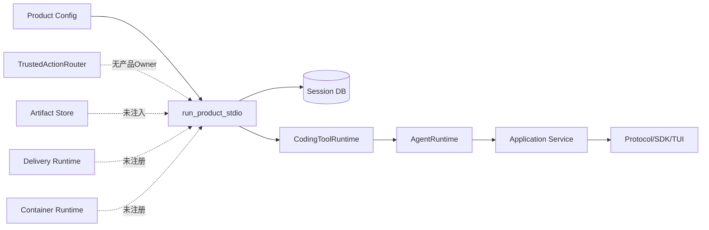

当前`CodingToolRuntime`只在显式传入Artifact Store时支持完整Artifact，产品Server未传。Agent Runtime虽能接收
`PatchRuntime/PatchBatchRuntime/ProcessRuntime`，但Server也未传这些端口。

### 4.2 当前高风险调用分支

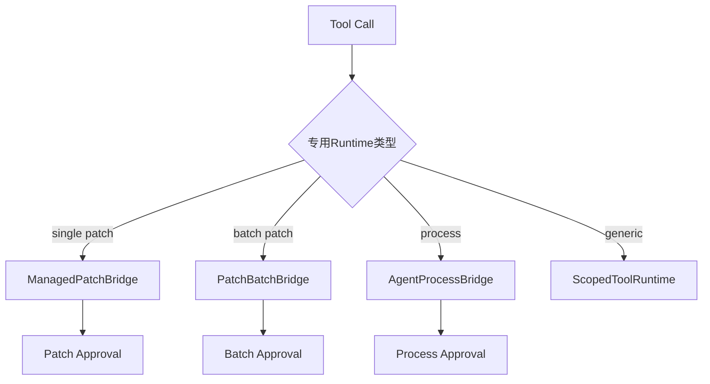

这种结构证明了各领域行为，却不适合作为未来高风险Tool扩展面。Agent核心必须只新增一个通用Trusted Action分支，现有专用分支
保留历史兼容，不再作为产品默认路径。

### 4.3 根因树

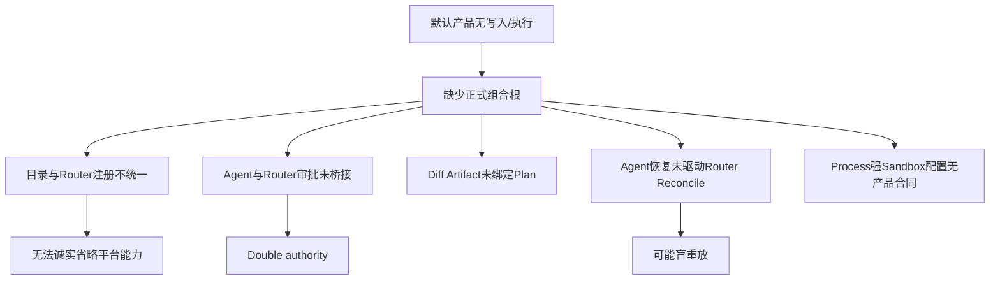

## 5. 方案与变更后架构

### 5.1 总体架构

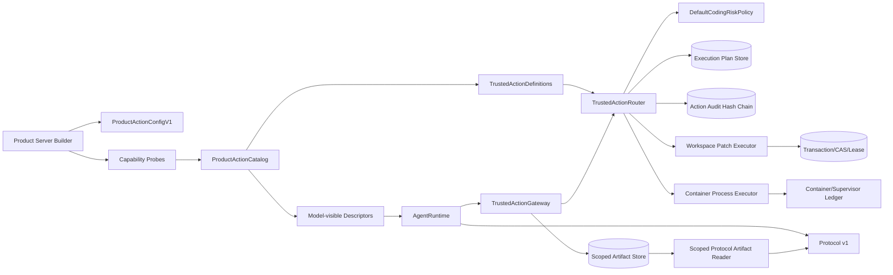

### 5.2 模块职责

| 计划模块/符号 | 职责 | 禁止职责 |
|---|---|---|
| `product_config/action_contracts.py` | Action Config、Profile、Capability Evidence/Report严格合同 | 读取环境、探测引擎、执行进程 |
| `product_config/action_config.py` | 安全读取与诊断独立Action配置 | 修改Product Config v2、保存Secret值 |
| `product_config/action_composition.py` | 构造并拥有Catalog、Router、Store、Executor生命周期 | Agent状态机、UI渲染 |
| `product_config/action_catalog.py` | 从已验证定义生成Descriptor并证明集合一致 | 动态加载任意Python插件 |
| `trusted_actions/planning.py` | 调用规范化、幂等Plan与跨Store规划恢复 | 审批、执行或具体产品能力探测 |
| `trusted_actions/agent_gateway.py` | Agent调用→确定性Plan→审批→执行/恢复适配 | 重新实现Policy、直接写文件、直接spawn |
| `trusted_actions/review.py` | 从精确Plan构造有界摘要和完整Artifact | 决定是否批准、执行写入 |
| `delivery/trusted_action.py` | Patch输入→事务计划→执行/对账 | 接受UI重构参数、绕过Lease |
| `sandbox/trusted_process_action.py` | Profile选择→Container Plan→执行/对账 | 任意Shell、Host Fallback |
| `agent/runtime.py` | 调用统一Gateway并持久化交互事实 | 读取Router私有Store或分支到具体Executor |
| `product_config/server.py` | 验证后进入Owner生命周期、注入Gateway/Artifact Reader | 内联实现Catalog与Executor细节 |

实际命名可在实施中根据现有包边界小幅调整，但职责和依赖方向不得改变。任何偏差必须回填第16节。

### 5.3 依赖方向

```text
product_config.action_composition
  -> artifacts / trusted_actions / delivery / sandbox
  -> agent TrustedActionGateway port implementation

agent.runtime
  -> agent ports/models
  -> no concrete delivery or sandbox executor

trusted_actions.agent_gateway
  -> trusted_actions.router/contracts
  -> agent models/ports

delivery.trusted_action / sandbox.trusted_process_action
  -> trusted_actions contracts
  -> their own domain runtime
```

禁止`delivery -> agent.runtime`、`sandbox -> product_ui`或`trusted_actions -> product_config`反向依赖。

### 5.4 替代方案

| 方案 | 优点 | 缺点 | 风险 | 结论 |
|---|---|---|---|---|
| 复用全部旧专用Bridge | 改动少 | 多审批/恢复权威，真实Delivery缺失 | 无法证明统一Action | 拒绝 |
| Agent直接依赖Router | 少一个接口 | 核心状态机知道计划Store与Executor细节 | 测试和扩展耦合 | 拒绝 |
| 通用Gateway + 同源Catalog | 权威清晰、可扩展、可探测 | 新合同和恢复Saga | 可通过分片测试控制 | 采用 |
| Product Config v3一次合并 | 单配置文件 | 迁移范围过大 | 0.9.1e失焦 | 延后 |
| Windows先用受管副本 | 快速广告Patch | 用户Workspace未提交 | 支持声明失真 | 拒绝 |

### 5.5 接口设计总览

产品组合只向Agent暴露`TrustedActionGateway`，Gateway只向具体适配器暴露冻结的`ActionRoutePlan`与已由宿主解码的严格参数。
Catalog Builder、Review Provider、Patch Executor和Process Executor均通过小型Protocol协作；接口不得传递数据库连接、普通文件句柄、
任意回调或未验证配置对象。具体方法、输入、输出和异常在第7.3节及第9～11节展开。

## 6. Product Action配置与能力目录

### 6.1 ProductActionConfigV1

```text
ProductActionConfigV1
  spec_version = harnessix.product-action-config/v1
  workspace_patch_enabled: bool = true
  process_profiles: tuple[ProductProcessProfile, ...] = ()
  config_sha256: sha256(canonical payload)

ProductProcessProfile
  profile_id: stable identifier
  version: non-blank version
  description: bounded non-secret text
  container_engine: absolute trusted executable OR approved discovered identity
  image: immutable digest reference only
  program: absolute path inside image
  arguments: fixed tuple
  selector_policy: none | bounded_path_or_test_id
  timeout_seconds: 1..3600
  max_output_bytes: bounded
  network_mode: none by default
  cpu/memory/process limits
  secret_refs: versioned references, never values
  profile_sha256: canonical digest
```

配置最大256 KiB，严格UTF-8 JSON，重复键、未知字段、相对宿主可执行文件、浮动镜像Tag、Shell元字符模式、未受支持网络或越界预算
失败关闭。文件使用与Product Config相同的安全读取原则，但具有独立Schema和摘要。

### 6.2 Capability Evidence

```text
ProductActionCapabilityEvidence
  capability_id
  status: verified | omitted
  reason_code
  binding_digest?
  executor_evidence_digest?
  platform
  probed_at
  expires_at
  evidence_sha256
```

`verified`必须同时具有Binding与Executor证据；`omitted`不得包含可执行Binding。报告稳定排序，面向Doctor的公开视图只暴露能力ID、
状态、原因和修复动作，不暴露绝对路径、镜像凭据、命令或环境。

### 6.3 Catalog集合不变量

```text
advertised = {descriptor identity from verified capabilities}
registered = {binding identity from router}
assert advertised == registered
assert every registered binding has executor + recovery mode
assert every write binding has idempotency requirement
assert every process binding has strong sandbox evidence
```

Artifact读取不是模型写副作用，可由`CodingToolRuntime`继续提供；其Store必须默认注入。Patch与Process由Gateway提供。

## 7. 数据结构与领域契约：Agent内部合同

### 7.1 TrustedActionApprovalRequestContent

```text
kind = trusted_action_approval_request
approval_id
call_id
presentation: tool | patch_batch | process
plan_id
plan_fingerprint
execution_fingerprint
request_fingerprint
policy_id
policy_version
route_state = pending_approval | ready | denied | unknown | ...
decision?
diff_artifact?
```

不变量：

- `call_id == persisted ToolCall.call_id`；
- `plan_id == route.plan.execution.plan_id == deterministic invocation_id`；
- `plan_fingerprint == route.plan.fingerprint`；
- `execution_fingerprint == route.plan.execution.fingerprint`；
- `request_fingerprint`绑定Thread、Turn、Workspace、完整Tool Call、Plan/Execution Fingerprint和Diff SHA；
- Patch批准前必须有`diff_artifact`且`presentation=patch_batch`；
- Process不得伪造Diff；
- decision的Session指纹绑定`request_fingerprint`，Router Checkpoint绑定`execution_fingerprint`，Gateway证明二者属于同一计划。

### 7.2 TrustedActionEffect

```text
plan_id
plan_fingerprint
state: succeeded | failed | unknown | manual_intervention
origin: execution | recovery
artifact_sha256?
```

`ToolResultContent.action_id`等于`plan_id`，`trusted_action`字段保存有界效果，完整结果和Diff只通过Artifact。交互式提问已占用
Agent Event v19，因此统一Action内部合同实际追加v20；v1～v19解码行为不变，新内容禁止使用旧`schema_version`。

### 7.3 Gateway端口

```text
definitions() -> tuple[ToolDescriptor, ...]
prepare(thread, turn, call, cancel) -> TrustedActionApprovalRequestContent | TrustedActionOutcome
decide(thread, turn, call, approval, decision) -> updated approval
sync_decision(thread, turn, call, approval) -> updated approval | None
execute(thread, turn, call, approval, cancel) -> TrustedActionOutcome
recover(thread, turn, call, approval, cancel) -> TrustedActionOutcome | None
close() -> None
```

`prepare`必须查询优先。确定性Plan已存在时验证后复用，不重新捕获Snapshot或创建Artifact；不存在时才调用Router规划。

### 7.4 公共协议兼容

公共Projection映射：

| 内部presentation | Public `approval_type` | `diff_artifact` |
|---|---|---|
| `patch_batch` | `patch_batch` | 必须 |
| `process` | `process` | 空 |
| `tool` | `tool` | 可选 |

不新增公共枚举，不投影Plan ID、执行参数、资源摘要或内部状态。现有SDK/TUI只需消费已有公共合同。

## 8. 持久化与事务：Router幂等规划及双账本Saga

### 8.1 确定性身份

```text
invocation_id = UUIDv5(
  namespace=HARNESSIX_PRODUCT_ACTION,
  name=thread_id + turn_id + call_id + tool_fingerprint
)
idempotency_key = sha256(thread_id, turn_id, call_id, request fingerprint)
```

同一个持久Tool Call在重启后得到相同Plan ID，不同Turn/Call不会碰撞。

### 8.2 `plan_or_load`

Router已经在0.9.1e1调整为Action Audit先行、Execution Plan后补；两者不是同一事务。当前查询优先流程：

```text
try load action route by invocation id:
    verify invocation + binding + normalized args
    return snapshot
if execution plan exists but route plan absent:
    verify persisted intent/binding/plan identity
    deterministically resolve canonical resources
    rebuild ActionRoutePlan around persisted ExecutionPlan
    save initial audit snapshot
    return snapshot
else:
    decode and normalize input
    capture workspace snapshot
    build execution plan and route plan
    save route/audit initial state
    save execution plan
    return snapshot
```

若残留Execution Plan与当前调用、Binding、Policy或资源不一致，返回`action_plan_conflict`，不能用新Snapshot覆盖。

### 8.3 决策传播

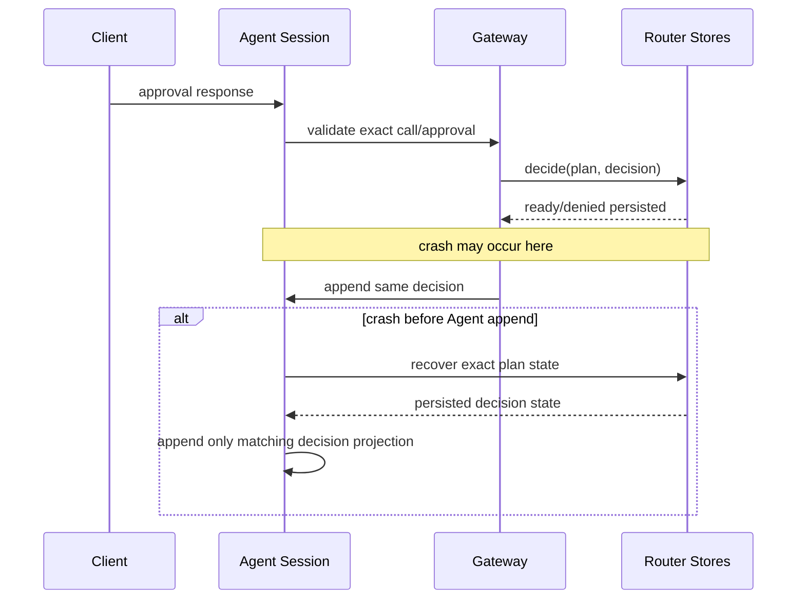

若Session已有决定而Router无Checkpoint，Gateway可补写同一决定；若内容不同则稳定`approval_conflict`并停止执行。

## 9. Patch、Diff与Delivery设计

### 9.1 公共输入

复用`PatchBatchProposal`语义：最多受现有合同限制的新增、修改和删除成员；路径是Workspace逻辑相对路径；正文有单文件及总字节
预算；不允许保护目录、链接、设备、目录目标或模式超集。模型不能指定事务ID、源摘要、租约、临时名或Artifact身份。

### 9.2 规划与审查

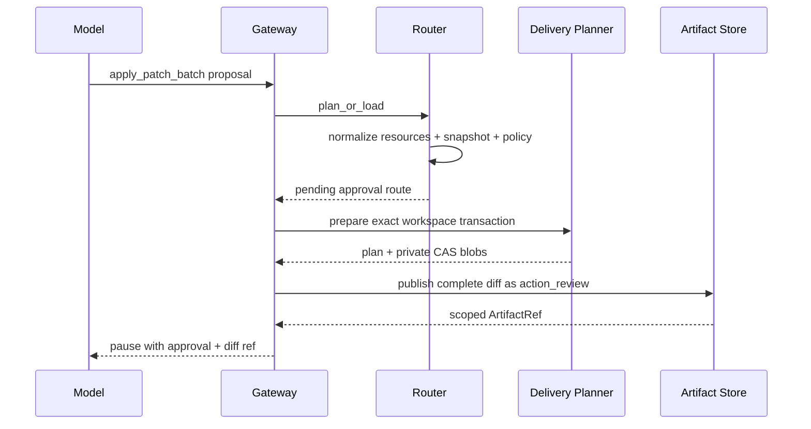

Delivery Planner必须使用与Router一致的Platform和逻辑路径集合。事务`transaction_id=plan_id`，`request_id`由Plan Fingerprint派生；
保存前校验Delivery Source Snapshot与Router Workspace Snapshot对相同资源的观察一致。事务计划和Artifact发布都采用查询优先，避免
崩溃后产生不同计划或重复Artifact。

### 9.3 执行

```text
reload route + approval + transaction
verify plan/transaction/diff fingerprints
router verifies current workspace snapshot and exact approval
acquire workspace fencing lease
publish(transaction_id, workspace, lease)
release lease
map published -> succeeded
map diverged -> failed(delivery_source_changed)
map interrupted/unknown -> unknown
return bounded summary + artifact sha
```

写入顺序由规范路径排序固定。任一成员提交前重新观察`before`版本；临时文件0600写入、fsync、模式设置、原子替换和父目录同步沿用
Delivery实现。成功后不自动Git Commit；0.9.1e验收用`git status/diff`只读工具证明效果，Commit/Push仍需独立Trusted Action。

### 9.4 Reconcile

- 全部成员为`after`：`succeeded`；
- 全部为`before`且事务从未进入发布：`failed`或保持可安全再提交的`ready`仅由原执行状态决定，Agent不得自行重跑；
- `after`前缀、`before`后缀且Cursor匹配：保留`unknown`或由Delivery继续受控发布的行为必须在本切片明确选择；默认只报告
  `manual_intervention`，不在Reconcile中继续写；
- 混合、第三状态或顺序不一致：`manual_intervention`；
- Reconcile只观察和读账本，不能创建新的事务或写文件。

## 10. Process与Sandbox设计

### 10.1 模型输入

```text
RunProfileInput
  profile: configured stable id
  selectors: tuple[str, ...] <= 32
```

Selector必须通过Profile声明的严格模式，不能包含NUL、控制字符、Shell操作符、绝对宿主路径或`..`逻辑路径。它作为独立argv元素
追加，永远不经Shell解释。

### 10.2 能力探测与广告

每个Profile启动前验证：

1. Action Config自身摘要和安全文件身份；
2. Container Engine绝对可执行文件身份、Owner和能力协议；
3. 镜像使用不可变Digest且本地/远端解析结果一致；
4. `network=none`或声明的受管网络能力存在；
5. Process Tree、取消、超时、输出捕获和清理能力通过；
6. Workspace挂载模式与Profile权限一致；测试Profile默认只读，确需写测试缓存时使用受控临时目录，不扩大Workspace写授权；
7. Secret引用能解析到声明版本，值不进入Plan。

任一失败，整个Profile不广告；其他独立Profile可继续进入目录。

### 10.3 执行与输出

Router Plan内部参数是由宿主Profile展开的完整`ContainerExecutionSpec`，公共Schema仍只含Profile/Selector。Executor使用
`ContainerCommandBuilder`复核Plan Intent等于持久Spec，再由`ContainerProcessRuntime`执行。stdout/stderr先经Secret Redactor，
有界摘要进入Tool Result，完整已清洗输出事务发布Artifact。

### 10.4 取消、超时和恢复

- 取消传播到Supervisor/Container Owner，完成终止树和回执核对后才可返回`cancelled`；
- 无法证明容器/进程已终止时返回`unknown`；
- Deadline使用原Turn持久墙钟剩余值与Profile上限的较小者；重启不刷新；
- 重启先查询Process Ledger和Container Owner，不重启命令；
- 已退出但返回丢失时从终止记录、输出摘要和Artifact收据恢复`succeeded/failed`；
- Owner丢失且无法证明外部进程状态时`manual_intervention`。

## 11. Artifact设计

### 11.1 默认Owner

`SQLiteArtifactStore`位于私有Product State Root的独立目录，生命周期包围Tools、Gateway、Agent和Protocol Service。Server向
`CodingToolRuntime`传入Store，向Agent传入Store，向`AgentApplicationService`传入`ScopedProtocolArtifactReader`。

### 11.2 新用途

新增严格purpose：

| purpose | 生产者 | 内容 | 读取作用域 |
|---|---|---|---|
| `action_review` | Trusted Action Review Provider | 规范多文件Diff JSONL | exact thread/turn/call |
| `action_output` | Trusted Action Executor | 清洗后的完整结构化输出 | exact thread/turn/call |

旧`batch_plan/batch_effect/process_output/tool_result`保持可读，不迁移。Artifact Store必须校验purpose枚举、记录数、字节、SHA、完整性、
到期时间和作用域。

### 11.3 数据流

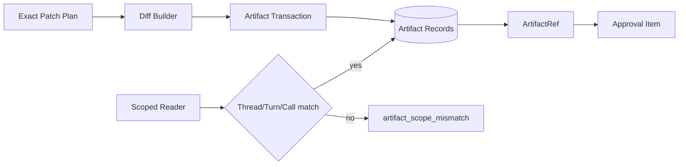

## 12. 正常产品纵向时序

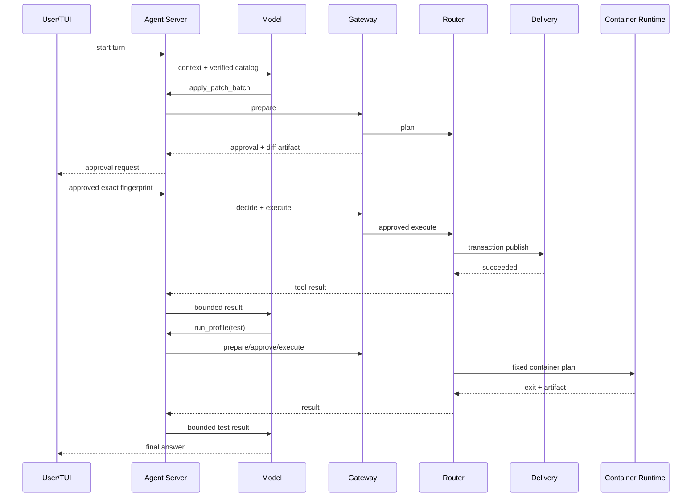

每个高风险调用都独立计划和审批。Patch批准不能授权Process，Process Profile批准不能授权其他Selector或后续调用。

## 13. 失败、恢复、并发与幂等

### 13.1 状态映射

| Router状态 | Agent Turn状态 | Tool Result | 是否可执行 |
|---|---|---|---|
| `denied` | `EXECUTING_TOOLS` | failed/approval_rejected | 否 |
| `pending_approval` | `WAITING_APPROVAL` | 无 | 否 |
| `ready` | `EXECUTING_TOOLS` | 无 | 仅Router claim一次 |
| `running` | `WAITING_ACTION`或执行中 | 无 | 不允许第二owner |
| `unknown` | `WAITING_ACTION` | unknown待Reconcile | 禁止execute |
| `reconciling` | `WAITING_ACTION` | 无 | 仅Reconcile owner |
| `succeeded` | `EXECUTING_TOOLS` | succeeded | 否 |
| `failed` | `EXECUTING_TOOLS` | failed | 否 |
| `manual_intervention` | `EXECUTING_TOOLS`后Turn失败/暂停 | unknown + action id | 否 |

### 13.2 崩溃窗口

| 窗口 | 权威事实 | 恢复动作 | 禁止动作 |
|---|---|---|---|
| Execution Plan已写、Route未写 | Execution Plan | `plan_or_load`重建精确Route | 用新Snapshot覆盖 |
| Route已写、审批Item未写 | Route pending | Gateway重建同一Review并追加审批Item | 新Plan |
| Diff已写、审批Item未写 | Artifact收据+Route | 查询同Scope/purpose/plan摘要后复用 | 重复发布不同Artifact |
| Router已记批准、Session未记 | Router Checkpoint | 追加同一Session决定投影 | 询问并允许相反决定 |
| Session已记决定、Router未记 | Session决定+精确Plan | 补写同一Router决定 | 内容不同仍执行 |
| ready→running后崩溃 | Router running | 启动恢复为unknown并Reconcile | execute重试 |
| Delivery部分写 | Delivery Ledger/Workspace事实 | 只观察并结算 | 无账本继续写 |
| Process结束回包丢失 | Process/Artifact Ledger | 读取终止事实并结算 | 重启Profile |
| Agent Tool Result未写 | Router终态 | 投影并追加一次Tool Result | 再执行副作用 |

### 13.3 并发

- 同一Turn仍由现有Agent调度保证非只读Tool串行；
- Router Audit Store CAS保证同Plan只有一个`ready -> running`；
- Workspace Lease保证同Workspace跨进程发布互斥并使用Fencing Token；
- Process Owner ID和Container Name由Plan ID确定，冲突时查询事实而不是覆盖；
- Artifact事务以作用域+purpose+source fingerprint幂等；
- Product启动恢复先于开放stdio，避免新调用与旧`running`计划竞争。

### 13.4 取消与Deadline

Gateway每个外部等待点检查Agent `CancelToken`。等待审批期间取消只取消Turn，不把未批准Plan变为执行；可在审计中保持
`pending_approval`并由恢复标记废弃，或显式拒绝，最终实现必须固定一种可查询终态。执行期间取消由Router处理，写入类返回未知后
仍必须Reconcile。所有恢复使用原Turn绝对截止时间，不因进程重启刷新预算。

## 14. 安全、隐私与可观测性

### 14.1 信任边界

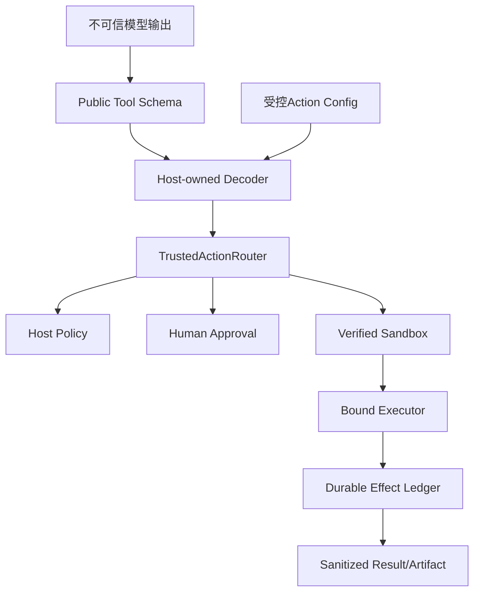

模型输入不能选择Executor、Sandbox、网络、Secret、宿主路径、事务ID或恢复策略。Hook/Skill/MCP即使能建议Action，也不能覆盖宿主
Policy或能力省略。

### 14.2 Secret和正文

- Action Config只保存Secret引用；
- Router继续拒绝敏感键路径；
- Secret值只在执行前由版本化Provider解析到可清零缓冲，不进入Plan；
- stdout/stderr、异常、Diff和Artifact写入前执行Canary扫描和Redaction；
- 审计只存摘要与稳定代码；
- 日志禁止绝对Workspace路径、文件正文、argv、环境值和Provider响应正文。

### 14.3 可观测信号

| 信号 | 类型 | 标签/字段 | 基数约束 |
|---|---|---|---|
| `product.action.capability` | startup event | capability_id/status/reason/platform | 固定目录 |
| `trusted_action.plan` | span/event | source/tool/effect/risk/policy decision | 不含plan id标签；ID仅trace字段 |
| `trusted_action.approval_wait` | histogram | presentation/outcome | 固定枚举 |
| `trusted_action.execute` | histogram/counter | executor_id/outcome | 固定注册表 |
| `trusted_action.reconcile` | counter | conclusion/error_code | 稳定白名单 |
| `workspace.transaction` | counter | terminal state/member bucket | 路径不作标签 |
| `process.profile` | histogram | profile_id/exit class | Profile数量受配置上限 |
| `artifact.publish` | counter/histogram | purpose/size bucket/outcome | 不含artifact id |

Observer失败不得改变Policy、执行或终态；审计Store失败必须失败关闭，因为它是权威事实而非可选Telemetry。

## 15. 核心业务伪代码

### 15.1 产品构造

```text
load and diagnose Product Config v2
load optional Product Action Config v1
open private state root
initialize session/protocol stores
open artifact, execution-plan, action-audit, delivery, lease, process stores
probe platform and executor capabilities
catalog = build verified definitions and descriptors from same evidence
assert catalog consistency
router.recover_interrupted()
reconcile all active product-owned plans before accepting protocol
enter tools(artifacts), gateway(catalog/router), agent(gateway), scoped artifact reader
activate exact config snapshot
open stdio protocol
close owners in reverse order
```

### 15.2 Agent调用

```text
if tool belongs to trusted_action_gateway:
    validate descriptor version/fingerprint/scope
    prepared = gateway.prepare(thread, turn, call, token)
    if prepared requires approval:
        append approval item + WAITING_APPROVAL atomically in Session
        stop turn driver
    outcome = gateway.execute_or_observe(prepared)
    append terminal Tool Result
else:
    keep existing read-only/legacy-compatible path
```

### 15.3 审批响应

```text
reload thread + active turn + approval + call
validate client fingerprint and exact ownership
gateway.verify_plan_binding(approval)
router.decide(plan_id, mapped decision)
append same decision to approval item
if rejected: append failed result and resume
if approved: execute only through gateway/router
```

### 15.4 恢复

```text
on product startup:
    changed = router.recover_interrupted()
    for plan in changed + product_active_unknown_plans:
        router.reconcile(plan)

on Agent turn resume:
    for unfinished trusted action call:
        route = gateway.status(plan_id)
        validate persisted approval binding
        if route pending: remain waiting
        if route ready: execute only if decision persisted and owner claimed by this resume
        if route unknown: reconcile, never execute
        if route terminal: append exactly one result from route/ledger
```

## 16. 实施切片

| 顺序 | 子切片 | 代码/数据改动 | 行为/契约 | 测试 | 可独立回滚 |
|---:|---|---|---|---|---|
| 1 | 0.9.1e1 Artifact与Catalog地基 | 默认Artifact Owner、Capability合同、同源Catalog、Router幂等规划 | 无高风险Tool默认执行；建立可证明目录 | 合同、Store、集合属性、产品只读回归 | [CI 34739842959](https://github.com/carrie1988/Harnessix/actions/runs/34739842959)验收关闭 |
| 2 | 0.9.1e2 Agent Gateway | Event v20、通用审批/效果、Gateway端口、Projection兼容、恢复映射 | Router成为批准权威 | Reducer、Session升级、重放、崩溃窗口、SDK | 实现提交`328aa2d`由[CI 34744116155](https://github.com/carrie1988/Harnessix/actions/runs/34744116155)验收关闭 |
| 3 | 0.9.1e3 Patch/Delivery | Patch定义、Review Artifact、事务Executor/Reconcile、POSIX广告 | 默认产品真实多文件写入 | 新增/改/删、Diff、漂移、Lease、部分效果、SDK/TUI | 是；停止新Patch目录 |
| 4 | 0.9.1e4 Process/Sandbox | Action Config、Profile Probe、Container Executor/Reconcile、输出Artifact | 有配置且能力通过才广告 | 配置攻击、固定镜像、非零/取消/超时/崩溃/输出 | 是；省略Profile |
| 5 | 0.9.1e5 产品关闭 | Server Builder/Owner、Preflight/Doctor、启动恢复、运维/威胁/CI | 完整产品纵向链与功能门 | 三平台、省略语义、真实Container、全量CI | 是；保留账本恢复 |

每个子切片必须遵循“源码研究→架构决策→领域契约→最小正式实现→失败与恢复测试→真实场景验证→文档同步”。不得在
e1/e2未关闭时直接向Server添加Patch或Process构造参数。

## 17. 源码与测试映射

### 17.1 当前可复用源码

| 设计点 | 当前源码 | 关键符号 | 当前测试 |
|---|---|---|---|
| 统一路由 | [`router.py`](../../src/harnessix/trusted_actions/router.py) | `TrustedActionRouter` | [`test_router.py`](../../tests/trusted_actions/test_router.py) |
| 路由持久化 | [`store.py`](../../src/harnessix/trusted_actions/store.py) | `SQLiteActionAuditStore` | [`test_router.py`](../../tests/trusted_actions/test_router.py) |
| Execution Plan | [`execution/store.py`](../../src/harnessix/execution/store.py) | `SQLiteExecutionPlanStore` | [`tests/execution`](../../tests/execution/) |
| Agent审批 | [`agent/approvals.py`](../../src/harnessix/agent/approvals.py) | `approval_matches` | [`tests/agent`](../../tests/agent/) |
| Artifact | [`artifacts/sqlite.py`](../../src/harnessix/artifacts/sqlite.py) | `SQLiteArtifactStore` | [`tests/artifacts`](../../tests/artifacts/) |
| 事务规划 | [`delivery/planner.py`](../../src/harnessix/delivery/planner.py) | `prepare_workspace_transaction` | [`test_planner.py`](../../tests/delivery/test_planner.py) |
| 事务执行/恢复 | [`delivery/filesystem.py`](../../src/harnessix/delivery/filesystem.py) | `WorkspaceTransactionRuntime` | [`test_filesystem.py`](../../tests/delivery/test_filesystem.py) |
| Container执行 | [`sandbox/process_runtime.py`](../../src/harnessix/sandbox/process_runtime.py) | `ContainerProcessRuntime` | [`test_container_sandbox.py`](../../tests/integration/test_container_sandbox.py) |
| 产品入口 | [`product_config/server.py`](../../src/harnessix/product_config/server.py) | `run_product_stdio` | [`test_server_and_cli.py`](../../tests/product_config/test_server_and_cli.py) |
| 公共投影 | [`protocol/projection.py`](../../src/harnessix/protocol/projection.py) | `_approval`、`project_item` | [`test_projection.py`](../../tests/protocol/test_projection.py) |

### 17.2 计划新增/修改路径

| 变更点 | 计划源码 | 关键符号 | 计划测试 |
|---|---|---|---|
| 能力合同 | `product_config/action_contracts.py` | `ProductActionConfigV1`、`ProductActionCapabilityReport` | `tests/product_config/test_action_contracts.py` |
| 能力组合 | `product_config/action_composition.py` | `ProductActionRuntimeOwner` | `tests/product_config/test_action_composition.py` |
| 同源目录 | `product_config/action_catalog.py` | `ProductActionCatalog` | `tests/product_config/test_action_catalog.py` |
| 路由规划 | `trusted_actions/planning.py`、`trusted_actions/router.py` | `plan_action`、`TrustedActionRouter.plan` | `tests/trusted_actions/test_router.py` |
| Agent Gateway | [`agent_gateway.py`](../../src/harnessix/trusted_actions/agent_gateway.py)、[`agent_gateway_support.py`](../../src/harnessix/trusted_actions/agent_gateway_support.py)、[`agent_gateway_output.py`](../../src/harnessix/trusted_actions/agent_gateway_output.py) | `RouterBackedAgentActionGateway`、函数式规划/决策/执行/恢复、终态输出核对与投影 | [`test_agent_gateway.py`](../../tests/trusted_actions/test_agent_gateway.py) |
| 内部事件 | [`trusted_action_contracts.py`](../../src/harnessix/agent/trusted_action_contracts.py)、[`models.py`](../../src/harnessix/agent/models.py)、Reducers、[`approvals.py`](../../src/harnessix/agent/approvals.py) | Trusted Action审批/效果与Agent Event v20 | [`test_trusted_action_runtime.py`](../../tests/agent/test_trusted_action_runtime.py)、[`test_schemas.py`](../../tests/agent/test_schemas.py) |
| Patch执行 | `delivery/trusted_action.py` | `WorkspacePatchActionExecutor` | `tests/delivery/test_trusted_action_patch.py` |
| Process执行候选 | [`process_profile.py`](../../src/harnessix/product_config/process_profile.py)、[`process_action.py`](../../src/harnessix/product_config/process_action.py) | `probe_product_process_profile`、`ProductProcessActionExecutor`、`ProductProcessOutputProvider` | [`test_process_action.py`](../../tests/product_config/test_process_action.py)已覆盖首批合同与前置失败；完整故障矩阵尚未补齐 |
| 产品纵向 | Product Server、Protocol Service、Product UI | 组合与恢复 | `tests/product_config/test_product_actions.py`、`tests/product_ui/test_product_actions.py` |

关闭时必须把“计划路径”更新为实际可点击源码/测试链接和符号；未实现项不得留在已关闭文档中。

## 18. 测试设计

### 18.1 合同与兼容

- Action Config重复键、未知字段、摘要篡改、浮动镜像、无效Profile、重复ID和预算边界；
- Capability Report排序、唯一性、verified/omitted字段互斥和摘要；
- Agent Event v1～v18旧Fixture仍可读，v19新内容不能降版本；
- Protocol v1 Schema逐字不因内部新内容变化；
- SDK旧版本Fixture能解析Patch/Process公共审批；
- Catalog Descriptor与Binding Schema Digest、Version、Fingerprint逐项一致。

### 18.2 规划、审批与幂等

- 同一Call重复prepare返回同一Plan/Artifact；
- 不同Thread/Turn/Call身份不同；
- Execution Plan写后Audit写前崩溃；
- Route写后Session Approval写前崩溃；
- Router决定写后Session决定写前崩溃及反向窗口；
- 相反重放决定、错误Actor、错误Fingerprint、错误Call和跨Thread响应失败；
- Policy allow/deny/require approval三分支；
- Tool/Binding/Capability/Policy版本漂移在执行前失败关闭。

### 18.3 Patch/Delivery

- 新增、修改、删除、模式变化、多文件和Unicode路径；
- 二进制/非法UTF-8、保护路径、链接、目录、超限和无变化；
- 完整Diff与实际before/after一致，模型摘要有界；
- 计划后、Diff后、审批后及逐成员提交前漂移；
- 两实例Workspace Lease竞争、过期Fencing和丢失Owner；
- 写临时文件、fsync、replace、目录sync、Ledger终态前后故障；
- 全before、全after、前缀after、第三状态和顺序混合Reconcile；
- 重启后只产生一个Tool Result，不重复写入。

### 18.4 Process/Sandbox

- 无Action Config、无引擎、错误引擎、镜像不存在、Digest漂移和探测超时均省略；
- 固定Profile正常0、非零退出、信号、超时、用户取消和输出上限；
- Selector注入、Shell字符、绝对路径、`..`、控制字符和超限；
- 网络none、Secret引用、Redaction Canary和环境隔离；
- Container创建前、创建后、进程启动后、退出后和Artifact提交后崩溃；
- Supervisor/Owner丢失、引擎重启和无法证明状态进入manual intervention；
- Host Process Fallback永不触发。

### 18.5 Product/Protocol/TUI

- 默认无Action Config：POSIX广告Patch、不广告Process；Windows两者均不广告；
- 有有效Profile且Container能力通过：广告Process；
- Artifact跨Thread/Turn/Call、过期、SHA篡改和分页Revision越权；
- SDK完成模型→Patch→审批→写入→测试Profile→最终答案；
- TUI展示完整Diff、确认指纹、取消和恢复；
- Server在开放stdio前完成旧Plan恢复；
- 功能门关闭后旧在途Plan仍可Reconcile，新Turn目录不含该能力；
- 0.9.1d Windows只读真实Server/SDK回归保持通过。

## 19. 发布、迁移、回滚与停止条件

### 19.1 发布顺序

1. e1只发布Artifact和Catalog地基，不广告新高风险Tool；
2. e2在测试组合根启用Gateway，生产功能门保持关闭；
3. e3仅POSIX受控测试启用Patch，真实仓库验证后再默认开启；
4. e4只对显式有效Profile与强Container能力广告Process；
5. e5完成Preflight、恢复、SDK/TUI、文档和CI后关闭0.9.1。

### 19.2 数据迁移

- Agent Event Store保持v20，不重写旧事件；Artifact用途通过migration24扩展；
- Execution Plan/Action Audit/Delivery/Artifact沿用现有Schema，若新增索引或purpose不需要迁移Payload；
- Action Config为新文件，无旧数据迁移；
- 旧专用Patch/Process在途Session仍由旧恢复路径结算，新目录不再生成旧计划；
- 同一State Root升级前必须备份，降级前必须排空新Trusted Action在途状态。

### 19.3 回滚

- 关闭Catalog功能门停止新Patch/Process广告；
- 保留Gateway恢复组件以结算旧Plan，不能只删除代码；
- Artifact Store回滚后旧Ref保留在磁盘，旧版本若不能读取则返回稳定不支持，不能删除；
- Action Config可忽略但不自动修改；
- Product Config v2和只读Tool链不受影响；
- Windows始终保持0.9.1d已验证只读路径。

### 19.4 停止条件

出现以下任一情况不得继续灰度或关闭0.9.1e：

- 广告Tool没有匹配Router定义/Executor/Reconcile；
- Agent决定可绕过Router Checkpoint或反向覆盖Router拒绝；
- Diff与最终事务Plan不一致；
- 写入`unknown`后能够再次`execute`；
- Windows普通目录使用字符串Path或POSIX API执行写入；
- Process接受任意Shell/程序/环境，或Container失败后回退Host；
- Secret Canary出现在Plan、Audit、Artifact、Tool Result、日志或协议；
- Artifact能跨Scope读取；
- 功能门回滚删除或遗弃在途事实；
- 0.9.1d只读链、旧Session或Protocol v1兼容回退；
- 全量、真实Container、三平台或文档门禁失败。

## 20. 风险登记

| 风险 | 控制 | 剩余归属 |
|---|---|---|
| Session与Router双Store传播窗口 | 确定性ID、Router权威、查询优先、故障注入 | 0.9.3长期Soak |
| Router与Delivery Store非原子 | plan/transaction同ID、查询优先、双向摘要、Reconcile | 保留Saga边界 |
| POSIX/Windows写能力不对称 | 能力省略、平台报告、Windows不降级 | 后续Windows Writer专项/0.9.5 |
| Container冷启动与镜像不可用 | 启动探测、Profile级省略、无Host Fallback | 0.9.3性能、0.9.5安装 |
| Artifact和账本增长 | 上限、TTL、状态指标 | 0.9.3容量治理 |
| 通用错误可能泄漏内部信息 | 0.9.1e只用稳定映射与Canary，完整异常净化专项 | 0.9.4 |
| Product Server Owner过多 | 单独Builder/Owner，逆序关闭和失败注入 | 本切片关闭 |
| 模型因Tool省略降低任务成功率 | 明确目录和系统能力摘要，不弱化执行 | 0.9.2 Eval |

## 21. 文档同步矩阵

实现关闭时必须更新：

- [总体架构](../architecture.md)与[路线图](../roadmap.md)；
- [Agent](../modules/agent.md)、[Trusted Actions](../modules/trusted-actions.md)、[Artifacts](../modules/artifacts.md)、
  [Patches](../modules/patches.md)、[Processes](../modules/processes.md)、[Delivery](../modules/delivery.md)、
  [Sandbox](../modules/sandbox.md)、[Product Config](../modules/product-config.md)、[Product UI](../modules/product-ui.md)、
  [Protocol](../modules/protocol.md)现行模块设计；
- [部署](../deployment.md)、[配置](../operations/configuration.md)、[诊断](../operations/diagnostics.md)、
  [平台](../operations/platforms.md)、[安装](../operations/installation.md)和[威胁模型](../threat-model.md)；
- [测试与Eval](../testing-and-evals.md)、[验证证据索引](../validation/README.md)和[文档追踪矩阵](../governance/documentation-traceability.md)；
- README、Schema产物、示例和CLI帮助。

## 22. 实现偏差与最终结论

### 22.1 0.9.1e1实际交付边界

0.9.1e1只建立Artifact与可信目录地基，不向默认产品注册Patch或Process。实际代码形成三条独立主链：

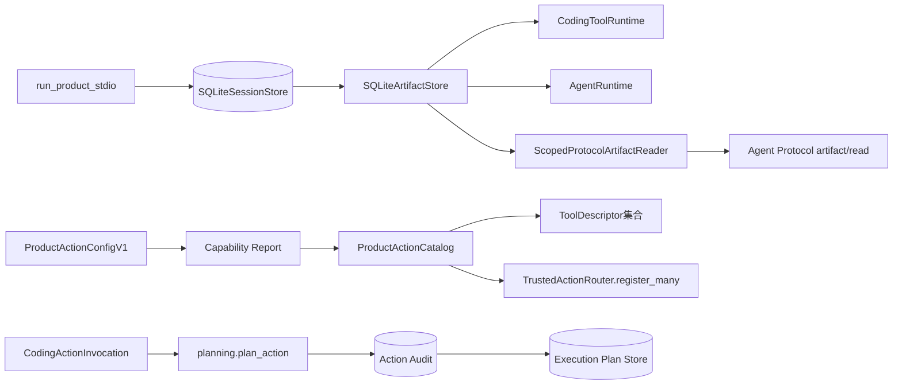

第一条主链使现有只读工具产生的大结果在正式产品中能够原子发布到Session数据库，并由公共协议按Thread、Turn、Call、
Workspace Scope和Artifact摘要重新授权读取。第二条主链冻结后续Patch/Process能力的配置、探测和目录集合合同。第三条主链
关闭同一Invocation在“Action Audit已提交、Execution Plan尚未提交”窗口中重复捕获Workspace的问题。

### 22.2 实际模块、类与接口

| 源码 | 关键符号 | 当前职责 | 失败边界 |
|---|---|---|---|
| [`action_contracts.py`](../../src/harnessix/product_config/action_contracts.py) | `ProductProcessProfile` | 固定Container Engine、不可变镜像、程序、argv、网络及资源预算 | 相对Engine、浮动Tag、非`none`网络、重复Secret和摘要漂移由严格合同拒绝 |
| 同上 | `ProductActionConfigV1` | 独立于Product Config v2保存Patch功能门和有序Profile | Profile乱序、重复或配置摘要漂移拒绝 |
| 同上 | `ProductActionCapabilityEvidence` | 表达一次`verified/omitted`能力探测及十分钟内时效 | `verified`缺证据、`omitted`携带绑定、非法TTL和证据摘要漂移拒绝 |
| 同上 | `ProductActionCapabilityReport` | 绑定Action Config摘要并稳定排序能力事实 | 能力乱序、重复和报告摘要漂移拒绝 |
| [`action_catalog.py`](../../src/harnessix/product_config/action_catalog.py) | `ProductActionCatalog` | 从同一个Binding、Schema、描述和Evidence生成Descriptor并批量安装Router | 报告/条目、Schema、Fingerprint、命名空间或过期证据不一致时安装前失败 |
| [`planning.py`](../../src/harnessix/trusted_actions/planning.py) | `plan_action` | 参数规范化、敏感字段拒绝、资源/Policy/Snapshot冻结、Route双Store持久化 | Invocation复用冲突、合同漂移、非法参数和Store故障使用稳定错误 |
| [`router.py`](../../src/harnessix/trusted_actions/router.py) | `register_many` | 全量验证定义与冲突后，以单次字典发布替换注册表 | 任一Schema或Key冲突不留下部分产品目录 |
| [`server.py`](../../src/harnessix/product_config/server.py) | `run_product_stdio` | 创建一个Session绑定Artifact Store并注入Tool、Agent与Scoped Reader | 仍在全部Runtime进入生命周期后才激活配置和开放stdio |

`ProductActionCatalog`位于`product_config`而不是原计划的`trusted_actions/catalog.py`。原因是目录同时依赖产品能力报告和
通用Router；若放入`trusted_actions`会形成`trusted_actions -> product_config`反向依赖，违反第5.3节。该调整不改变领域
职责：通用Router不知道产品配置，产品组合层单向消费通用Action能力。

### 22.3 关键字段与不变量

| 合同 | 字段 | 来源 | 不变量/用途 |
|---|---|---|---|
| `ProductProcessProfile` | `container_engine` | 宿主Action配置 | 必须是绝对路径；e4还要探测对象身份与可执行性 |
| 同上 | `image` | 宿主Action配置 | 仅接受`name@sha256:<64 hex>`，不接受Tag |
| 同上 | `arguments` | 宿主Action配置 | 有序固定tuple；单项不超过4096 UTF-8字节且禁止NUL/换行 |
| 同上 | `network_mode` | 宿主Action配置 | v1固定为`none`，无Host降级 |
| 同上 | `secret_refs` | 宿主Action配置 | 按`name/version`排序唯一，只保存引用不保存值 |
| `ProductActionCapabilityEvidence` | `status` | 启动探测 | 只有`verified`可以进入Catalog；`omitted`只形成诚实诊断 |
| 同上 | `binding_digest` | `TrustedToolBinding` | 必须与目录Entry的精确Binding相等 |
| 同上 | `executor_evidence_digest` | 能力探测器 | 证明Executor/Profile/Sandbox组合；Catalog不自行执行探测 |
| 同上 | `probed_at/expires_at` | 启动探测 | 时间必须递增且窗口不超过600秒；过期前才能安装 |
| `ProductActionCapabilityReport` | `config_sha256/created_at` | Action Config/探测时钟 | 把广告/省略结果绑定到精确配置版本；报告创建时间必须落在每项证据的有效区间内 |
| `ProductActionCatalogEntry` | `description/definition/evidence` | 产品组合Builder | Descriptor Fingerprint、Binding、Schema与Evidence必须形成一条摘要链 |
| `CodingActionInvocation` | `invocation_id` | Gateway确定性身份 | 同一ID只能绑定一份规范化Invocation和Binding |

四份新增JSON Schema由[`generate_specs.py`](../../scripts/generate_specs.py)确定性生成：

- [`product-action-config-v1.schema.json`](../../spec/product-action-config-v1.schema.json)；
- [`product-process-profile-v1.schema.json`](../../spec/product-process-profile-v1.schema.json)；
- [`product-action-capability-v1.schema.json`](../../spec/product-action-capability-v1.schema.json)；
- [`product-action-capability-report-v1.schema.json`](../../spec/product-action-capability-report-v1.schema.json)。

### 22.4 Catalog构造与安装流程

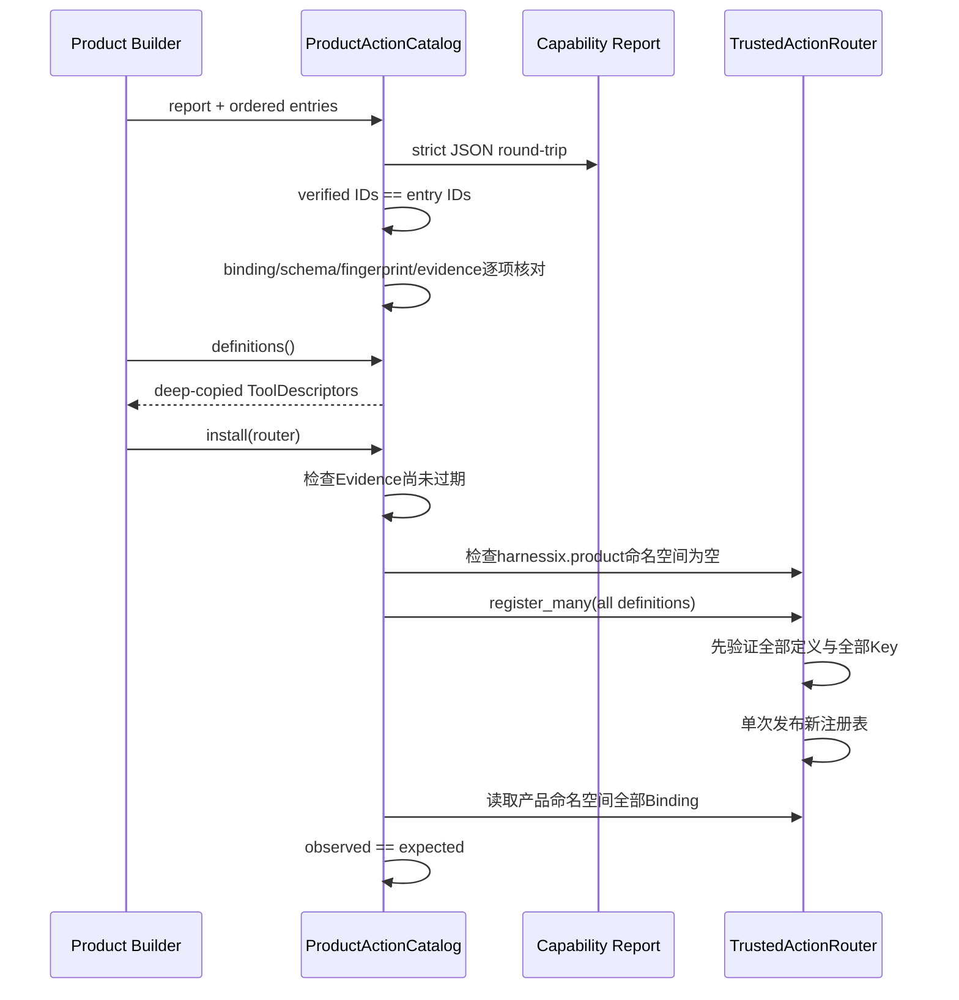

安装不是“先广告、调用时再发现不可执行”。Descriptor只有在Catalog构造成功后可得；产品命名空间已有任意定义时安装失败，
避免额外Binding被集合过滤掩盖。`register_many`先完成全部Schema摘要和重复Key检查，再替换内存注册表，因此第二个定义冲突不会
留下第一个定义的半安装状态。

### 22.5 幂等规划与跨Store恢复

规划使用Action Audit作为可恢复的首个持久事实，因为其Route正文已经完整包含`ExecutionPlanV2`。写入顺序与恢复如下：

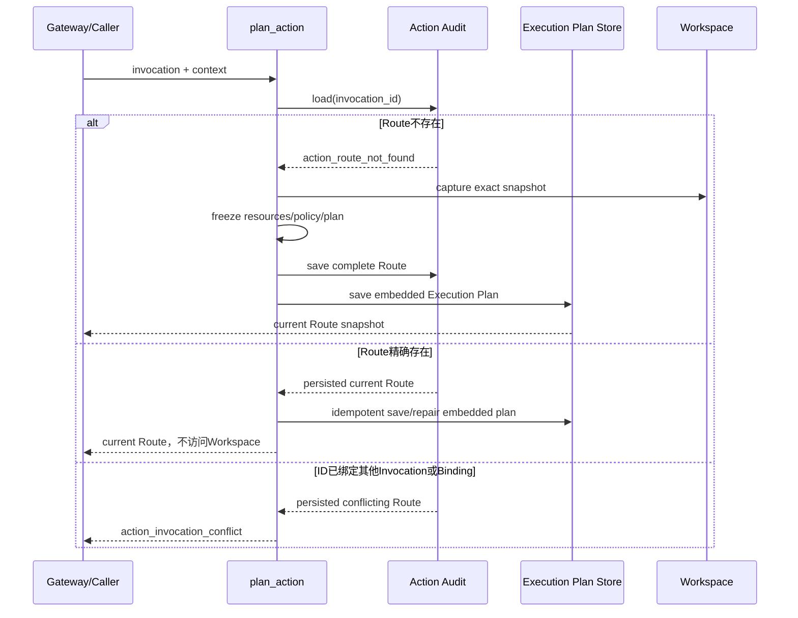

若进程在Audit提交后、Execution Store提交前退出，重试同一规范调用会从Audit读取原Route并补齐Execution Plan。它不会重新运行
Resolver、重新捕获Workspace、重新决策Policy或制造不同Snapshot。若调用已执行到终态，规划重试返回当前终态而不是旧的初始
状态。Execution Store仍以相同Plan ID、Fingerprint和正文提供自身冲突检查。

### 22.6 默认Artifact所有权与数据流

[`run_product_stdio`](../../src/harnessix/product_config/server.py)在Session初始化后创建唯一`SQLiteArtifactStore`，将同一个对象注入
`CodingToolRuntime`和`AgentRuntime`，并用它构造`ScopedProtocolArtifactReader`。因此Tool捕获、Session事务发布、模型历史验证和
协议分页读取共享同一Owner与同一SQLite事务边界：

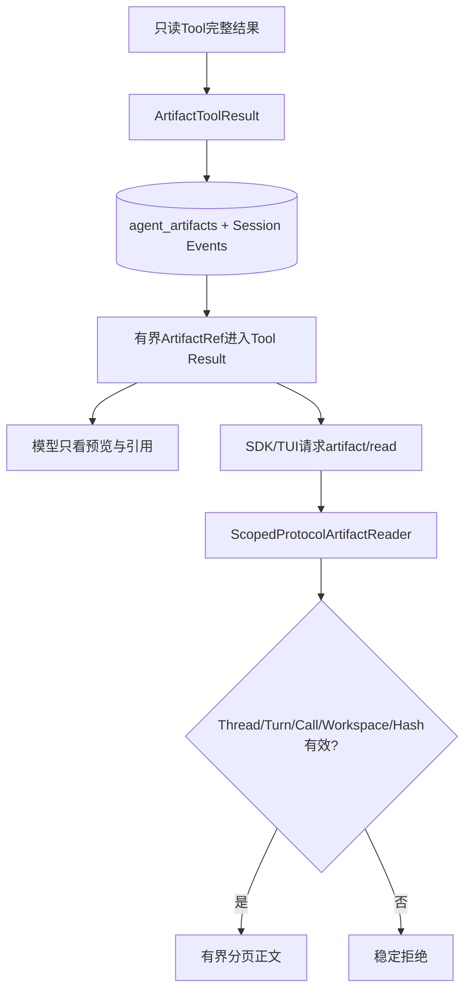

该变更不扩大Artifact权限，不增加新协议形状；它只让Server现有的条件能力在默认产品组合中真实满足。初始化响应现在将
`artifactPages=true`并包含`artifact/read`。EOF启动仍不产生模型请求，产品配置激活顺序保持不变。

### 22.7 失败语义与恢复矩阵

| 故障 | 稳定结果 | 是否产生部分可见能力 | 恢复/处置 |
|---|---|---:|---|
| Process Profile相对Engine或浮动镜像 | Pydantic严格校验失败 | 否 | 修复配置后重建 |
| Capability `verified`缺少任一摘要 | 能力证据不完整 | 否 | 探测器不得构造Verified |
| Capability `omitted`携带Binding | 能力证据不完整 | 否 | 保持省略且删除可执行摘要 |
| 任一Verified或Omitted Evidence过期、报告来自未来 | `product_action_capability_expired` | 否 | 重新探测并重建完整Report/Catalog |
| Report Verified集合与Entry集合不同 | `product_action_catalog_mismatch` | 否 | 修复组合Builder |
| Descriptor Fingerprint与Binding不同 | `product_action_catalog_mismatch` | 否 | 从同一Descriptor生成Binding |
| Router产品命名空间已被占用 | `product_action_catalog_mismatch` | 否 | 停止启动，禁止覆盖 |
| 批量注册任一Schema/Key冲突 | `trusted_tool_schema_mismatch`或`trusted_tool_duplicate` | 否 | 全集合修复后重试 |
| Invocation ID精确重试 | 返回当前Route | 不新增 | 以Audit内嵌Plan补齐Execution Store |
| Invocation ID绑定不同参数/Binding | `action_invocation_conflict` | 不新增 | 调用方必须使用新确定性身份 |
| Audit提交后Plan Store失败 | 原Route可查询，首次调用失败 | 不重抓Workspace | 精确重试补齐Plan Store |
| Artifact Reader未能构造 | Runtime进入失败，stdio不开放 | 否 | 修复State/Session依赖后重启 |

### 22.8 测试与验证证据

| 测试 | 证明内容 |
|---|---|
| [`test_action_contracts.py`](../../tests/product_config/test_action_contracts.py) | Profile/Config/Evidence/Report严格往返、排序唯一、TTL、Secret引用、固定网络、不可变镜像和摘要防篡改 |
| [`test_action_catalog.py`](../../tests/product_config/test_action_catalog.py) | Report与Entry集合、Descriptor/Binding/Schema/Fingerprint、诚实省略、过期拒绝、命名空间和原子安装 |
| [`test_router.py`](../../tests/trusted_actions/test_router.py) | 当前Route幂等返回、禁止重抓Workspace、跨Store故障修复和Invocation冲突 |
| [`test_server_and_cli.py`](../../tests/product_config/test_server_and_cli.py) | 默认产品真实stdio握手广告`artifact/read`且EOF不触发模型 |
| [`test_schemas.py`](../../tests/product_config/test_schemas.py) | 四份提交Schema与运行时合同逐字节等价 |

本地e1专项与相关回归为52项通过；全仓回归为3500项通过、19项跳过。Ruff、Mypy、合同生成、文档检查和可读性门禁均通过。
实现提交`82e247a8d083f3f8a7d68ee091a43d59096f298d`已由[CI 34739842959](https://github.com/carrie1988/Harnessix/actions/runs/34739842959)完成Linux Python 3.12/3.13、macOS、Windows、PostgreSQL、Container及Documentation全矩阵验收。

### 22.9 安全、兼容与回滚

- Action Config不并入Product Config v2，既有配置Schema、摘要、迁移和CLI保持兼容；
- e1未读取Action Config文件、未探测Container、未注册Patch/Process，不会提前开放高风险能力；
- 新增`product_config -> artifacts/trusted_actions`依赖由产品组合职责和ADR 0080批准，并进入可读性策略精确快照；未新增依赖环；
- Router的外部导入位置保持不变，规划实现下沉到`planning.py`后原有`TrustedActionRouter.plan`仍是稳定门面；
- 回退e1会使默认产品不再广告Artifact分页，但不会删除既有Session中的Artifact正文；旧Ref继续由兼容Reader规则决定可读性；
- 已持久Action Route仍由原Router合同读取；规划顺序回退前必须确认不存在只写入Audit、尚未补齐Execution Store的Route。

### 22.10 当前结论与后续前置

0.9.1e1实现、本地失败/恢复测试、Schema和现行资料同步已完成，并已通过全矩阵CI验收。该子切片不证明Patch、Process或Delivery已进入
默认产品，也不关闭0.9.1e。0.9.1e2开始后必须复用这里冻结的Catalog集合、确定性Invocation和Audit优先
恢复语义；不得重新建立Agent侧第二个执行批准权威。

0.9.1e2～e5完成后还需在本文记录实际事件版本、数据迁移、真实Patch/Container场景、平台证据与最终偏差。只有第3.3节全部
勾选后，本文才能转为`historical`并关闭0.9.1。

### 22.11 0.9.1e2实际交付边界

0.9.1e2建立Agent Session与Trusted Action Router之间唯一的高风险Action入口，但不把任何新Patch、Process或Delivery定义装入默认产品。显式组合方可将`RouterBackedAgentActionGateway`传给`AgentRuntime`；Gateway暴露的Tool集合必须与Router中同一`source/source_id`的Binding集合逐项相等。

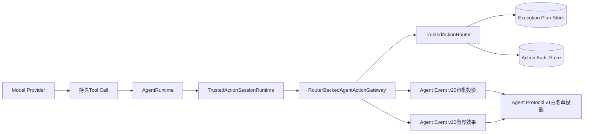

本切片不改变Product Config v2、Agent Protocol v1或默认Server能力广告。e3/e4必须复用此入口，不能再为产品Patch或Process添加新的Agent执行权威。

### 22.12 实际模块、类与接口

| 源码 | 关键符号 | 职责 | 禁止边界 |
|---|---|---|---|
| [`trusted_action_contracts.py`](../../src/harnessix/agent/trusted_action_contracts.py) | `TrustedActionApprovalRequestContent`、`TrustedActionEffect`、`TrustedActionReview` | 保存Session最小审批、终态与Review引用 | 不保存Router资源正文、执行参数、输出正文或执行许可 |
| [`ports.py`](../../src/harnessix/agent/ports.py) | `TrustedActionGateway` | 冻结Agent所需的目录、准备、决定同步、执行和恢复端口 | Agent不直接读取Router Store或调用Executor |
| [`agent_gateway.py`](../../src/harnessix/trusted_actions/agent_gateway.py) | `RouterBackedAgentActionGateway` | 提供不足100行的稳定门面和关闭语义 | 不拥有Router及Store生命周期 |
| [`agent_gateway_support.py`](../../src/harnessix/trusted_actions/agent_gateway_support.py) | `prepare_action`、`decide_action`、`execute_action`、`recover_action` | 校验目录、构造稳定Invocation、传播审批并映射终态 | 不绕过Router Policy、Approval Checkpoint和Audit状态机 |
| [`agent_gateway_output.py`](../../src/harnessix/trusted_actions/agent_gateway_output.py) | `terminal_result`、`build_result` | 核对Router终态摘要、调用输出Provider并投影Agent结果 | 不持久正文、不改变Route状态、不把人工介入伪装为成功 |
| [`trusted_action_runtime.py`](../../src/harnessix/agent/trusted_action_runtime.py) | `TrustedActionSessionRuntime` | Agent Runtime侧薄协调门面 | 不复制Gateway计划或Router状态机 |
| [`trusted_action_session.py`](../../src/harnessix/agent/trusted_action_session.py) | `sync_action_decision`、`record_action_decision` | Router先行决定与Session CAS投影的双账本Saga | 不以Session审批替代Execution Approval Checkpoint |
| [`runtime_recovery.py`](../../src/harnessix/agent/runtime_recovery.py) | `recover_pending_effects` | 聚合旧Patch与统一Action的只核对终结路径 | `pending_approval/ready`不得在终结路径启动副作用 |
| [`event_compatibility.py`](../../src/harnessix/agent/event_compatibility.py) | `validate_event_boundary` | 集中维护v1～v20新增语义边界 | 新内容不得伪装成旧版本Event |
| [`router.py`](../../src/harnessix/trusted_actions/router.py) | `decide`、`approval`、`recover_interrupted_plan` | Execution Approval先提交、同语义重放、单计划恢复 | 冲突决定、冲突时间戳和非法Route迁移失败关闭 |
| [`projection.py`](../../src/harnessix/protocol/projection.py) | `_approval`、`project_item` | 把内部统一审批映射到既有公共类型 | 不公开Plan/Execution Fingerprint、Policy ID和内部Route状态 |

`AgentRuntime`仍是Agent Loop门面。为防止0.9.1e2扩大既有超大类，Gateway校验/执行、Session双账本操作、历史Event版本守卫和效果恢复分别下沉到内聚模块；可读性策略不接受新增超大符号或热点增长。

### 22.13 Event v20与Session migration23

Agent Event v19已经承载提问、回答、`WAITING_INPUT`和Steering语义，不能被统一Action重复占用。实际版本演进如下：

| 层 | 旧版本 | 新版本 | 兼容行为 |
|---|---:|---:|---|
| Agent Event/Thread | 19 | 20 | v1～v19继续读取；v19及更早拒绝统一Action审批和效果 |
| Session Projection | 19 | 20 |读取1～20，后续写入统一升级为20 |
| SQLite Migration | 22 | 23 | `0023_trusted_action_gateway.sql`为语义升级标记，不重写历史Event或Snapshot正文 |
| Agent Protocol | 1.0 | 1.0 | Schema和枚举不变，内部presentation映射到现有`tool/patch_batch/process` |

冻结产物为[`agent-event-v20.schema.json`](../../spec/agent-event-v20.schema.json)和[`agent-thread-v20.schema.json`](../../spec/agent-thread-v20.schema.json)。v19产物保持逐字节冻结；升级测试证明旧v19数据库可初始化到migration23并追加v20事件，而旧事件原字节不被重写。

### 22.14 稳定身份与数据流

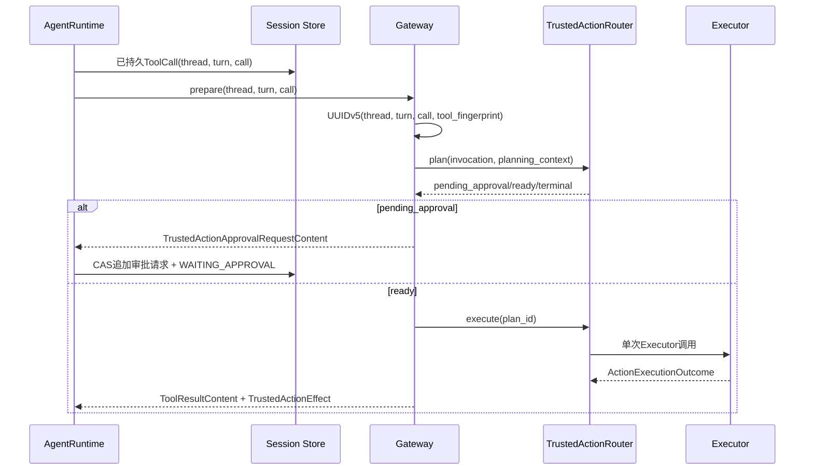

关键摘要链为：

```text
plan_id = UUIDv5(thread_id, turn_id, call_id, tool_fingerprint)
idempotency_key = SHA256(thread_id, turn_id, call_id, tool_fingerprint)
request_fingerprint = SHA256(
  thread + turn + workspace + complete_tool_call +
  plan_fingerprint + execution_fingerprint + policy + presentation + diff_sha256
)
```

`TrustedActionReview`只携带可选`ArtifactRef`。`presentation=patch_batch`必须携带Diff Artifact；`presentation=process`禁止携带Diff；审批投影序列化后不得超过16 KiB。`TrustedActionEffect`只保存Plan身份、Plan摘要、终态、来源和可选Artifact摘要，模型可见输出仍受Turn的输出字符预算约束。

### 22.15 Router先行审批Saga与崩溃恢复

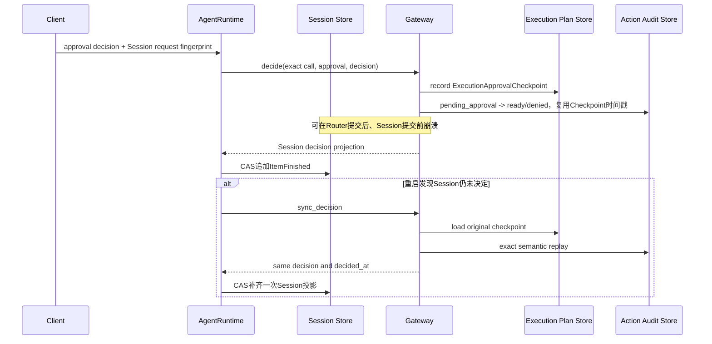

决定一致性采用两种不同但可证明关联的摘要：Router Checkpoint的`request_fingerprint`绑定不可变Execution Plan；Session `ApprovalRecord.request_fingerprint`绑定完整交互请求。Gateway同时核对Plan ID、Plan/Execution Fingerprint、Policy、presentation和Diff摘要，证明两个事实授权的是同一计划。

Router的`decide`先读取既有Checkpoint。同一`outcome/actor/reason`及相同显式时间戳属于幂等重放；任何语义或时间冲突返回`approval_conflict`。Checkpoint已经提交但Audit仍为`pending_approval`时，重放使用原`decided_at`推进Route，避免产生第二个审批事实。

### 22.16 执行、取消与UNKNOWN恢复

| 起始事实 | Gateway行为 | Session结果 | 是否允许Executor再次执行 |
|---|---|---|---:|
| `pending_approval`且无决定 | 返回审批请求 | `WAITING_APPROVAL` | 否 |
| Router `ready` | Router Claim后执行 | 有界成功/失败/未知效果 | 是，仅由Router单次Claim |
| 决定为`rejected` | 投影`denied` | 失败结果与Action ID | 否 |
| `running/reconciling`重启 | `recover_interrupted_plan`先收敛到`unknown` | 恢复来源效果 | 否 |
| `unknown` | 只调用`reconcile` | 成功/失败/未知/人工处置 | 否 |
| `succeeded/failed/manual_intervention` | 读取Audit终态 | 恢复来源效果 | 否 |
| 终结路径遇到`pending_approval/ready` | 返回`None` | 由Agent保守终结或保留等待 | 否 |

`CancelToken.run`取消等待中的Executor协程；Router已经在调用前写入`running`。取消后Router把该计划收敛到`unknown`，后续恢复只允许Reconcile。Agent reducer禁止`origin=recovery`的效果把一次中断执行伪装成成功Turn，也禁止`unknown`结果标记为完成或已取消。

### 22.17 公共投影与安全边界

内部统一审批复用公共Agent Protocol v1：

- `presentation=tool`投影为`approval_type=tool`；
- `presentation=patch_batch`投影为`approval_type=patch_batch`并保留公共Artifact引用；
- `presentation=process`投影为`approval_type=process`；
- `plan_id`仅通过既有`ToolResult.action_id`在终态公开；内部Plan/Execution Fingerprint、Policy ID、Route状态和Router错误正文不公开；
- 未识别异常统一映射为稳定`trusted_action_recovery_failed`，原始异常文本不进入Session；更完整的跨Router异常清洗仍由0.9.4关闭。

Gateway构造时对Descriptor与Router Binding执行精确集合和字段核对，包括版本、Fingerprint、Schema摘要、效果、风险、幂等、审批和Reconcile能力。任何漂移在产品开放前返回`trusted_action_gateway_mismatch`，不会留下部分能力目录。

### 22.18 0.9.1e2测试证据与剩余边界

| 测试 | 当前证明 |
|---|---|
| [`test_agent_gateway.py`](../../tests/trusted_actions/test_agent_gateway.py) | 确定性Prepare、目录漂移拒绝、Review Artifact绑定、Router权威审批、拒绝不执行、取消转UNKNOWN、Reconcile不重放和调用漂移失败关闭 |
| [`test_trusted_action_runtime.py`](../../tests/agent/test_trusted_action_runtime.py) | Agent审批→执行→结果纵向链，以及Router提交后Session提交前崩溃的重启补投影 |
| [`test_router.py`](../../tests/trusted_actions/test_router.py) | Approval Checkpoint先行、同决定幂等、冲突决定及Checkpoint/Audit崩溃窗口 |
| [`test_schemas.py`](../../tests/agent/test_schemas.py) | v19冻结摘要、v20运行时Schema一致及旧版本拒绝新语义 |
| [`test_session_upgrade.py`](../../tests/agent/test_session_upgrade.py) | migration23连续性、旧数据库升级和v20追加 |
| [`test_projection.py`](../../tests/protocol/test_projection.py) | 三种presentation复用Protocol v1且不泄漏内部字段 |

Agent、Trusted Actions与Protocol三个测试目录的联合回归已经通过；`uv run pytest -q`收集3535项并以退出码0结束，其中19项按平台或外部服务条件跳过；Ruff、Readability、Mypy、合同生成和文档门禁全部通过。[CI 34744116155](https://github.com/carrie1988/Harnessix/actions/runs/34744116155)进一步完成Linux Python 3.12/3.13、macOS、Windows、PostgreSQL、固定镜像Container及Documentation全矩阵验收，两个Linux全仓任务均为3516 passed、19 skipped。当前仍未证明默认产品可修改文件或运行Container；这些能力分别由e3、e4实现，产品Owner、Preflight/Doctor和启动恢复由e5关闭。

### 22.19 0.9.1e3实际交付边界

0.9.1e3把一个正式的多文件Workspace Patch纵向切片装入默认产品。该切片只在原生POSIX安全文件端口具备
`O_DIRECTORY`、`O_NOFOLLOW`和`O_CLOEXEC`语义时广告；Windows继续保留0.9.1d只读能力，不通过字符串路径、
Shell或Host进程模拟写入。Process/Sandbox、启动时在途计划恢复和外部Action Config仍由e4～e5实现。

本切片的权威链为：

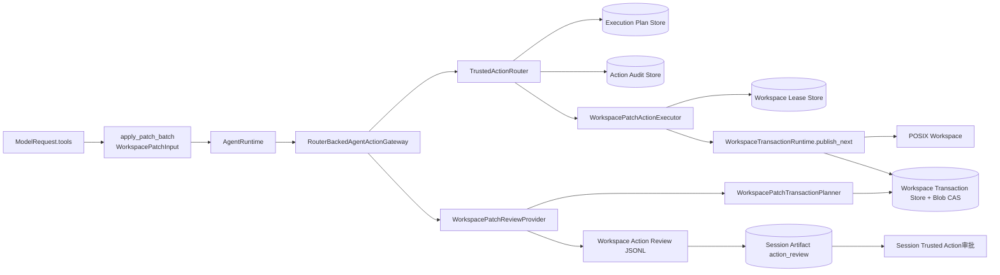

`ProductActionCatalog`仍同时生成模型Descriptor和Router Definition。实现中补充了
[`AgentRuntime`](../../src/harnessix/agent/runtime.py)的目录筛选：只有由`TrustedActionSessionRuntime`明确持有的名称才会进入
`ModelRequest.tools`，不能因为某个任意高风险Definition出现在内部字典中就被广告。

### 22.20 输入合同、预算与规范化

公开输入Schema为[`workspace-patch-input-v1`](../../spec/workspace-patch-input-v1.schema.json)，实现位于
[`trusted_action_contracts.py`](../../src/harnessix/delivery/trusted_action_contracts.py)。

| 合同/字段 | 类型与上限 | 语义 | 失败行为 |
|---|---|---|---|
| `WorkspacePatchInput.spec_version` | 常量`harnessix.workspace-patch-input/v1` | 防止模型参数被其他Patch协议误解 | 未知版本由严格Pydantic合同拒绝 |
| `files` | 1～16项 | 一个审批和一个Delivery事务内的完整变更集合 | 空集合、超项或原始重复路径拒绝 |
| `operation=create` | `content`和`mode`必填，`expected_sha256`禁止 | 只允许目标当前不存在时创建 | 已存在目标在事务规划阶段返回前置条件失败 |
| `operation=replace` | SHA-256、UTF-8 `content`、`0644/0755`必填 | SHA绑定模型读取过的完整来源正文 | 缺失、摘要漂移、目录或链接均失败关闭 |
| `operation=delete` | SHA-256必填，`content/mode`禁止 | 只删除模型明确读取并绑定的普通文件 | 缺失、摘要漂移、非普通文件拒绝 |
| 单个`content` | 最多512 KiB UTF-8 | 文本Patch，不接受任意二进制 | 非法Unicode、禁止控制字符或超限拒绝 |
| 全部正文 | 最多512 KiB | 限制模型请求、计划和CAS放大 | 总预算在创建Plan前校验 |
| `path` | 最多4096字符 | 按目标平台规范化的Workspace相对路径 | 根、别名重复、保护组件、`.env*`、逃逸和链接拒绝 |

路径先由[`normalize_workspace_path`](../../src/harnessix/workspace/paths.py)按计划平台规范化，再按
`path_comparison_key`检查别名重复。每个文件形成一个`workspace/write`规范资源，并增加根至目标父目录的`read`资源。
因此Router捕获的[`WorkspaceSnapshot`](../../src/harnessix/workspace/contracts.py)与Delivery最终来源Snapshot覆盖相同资源集合。
Action资源属性还绑定`operation`、来源SHA、目标SHA和目标模式，审批后不能只替换正文而复用原Route。

核心解析伪代码如下：

```text
parse strict WorkspacePatchInput
for each file:
    normalized_path = normalize(path, planned_platform)
    reject root / protected / .env / alias duplicate
    bind canonical write resource(operation, before_sha, after_sha, mode)
    bind read resources for every parent directory
sort by platform comparison key
return ResolvedAction(resources, workspace_resources)
```

### 22.21 Action Route与Delivery事务的同一身份

[`WorkspacePatchTransactionPlanner`](../../src/harnessix/delivery/trusted_action.py)不创建第二套业务身份：

```text
Delivery.transaction_id = ActionRoute.execution.plan_id
Delivery.request_id     = "action:" + plan_id
Delivery.source         = ActionRoute.execution.workspace
Delivery.mutations      = normalized proposal files in canonical order
```

物化前必须同时验证：

1. Route工具为`apply_patch_batch`且Executor为`product.workspace-patch`；
2. `plan_id == invocation_id`，调用参数与严格反序列化结果逐字段相同；
3. Route规范资源与根据参数重新求得的资源集合相同；
4. Delivery来源Snapshot与Execution Plan绑定Snapshot逐字段相同；
5. 每个Mutation的before满足`create/replace/delete`前置条件；
6. 每个after的SHA、字节数和模式与提案一致。

Planner采用查询优先：同一`plan_id`已有事务时只做全量身份复核并返回原Record；任何字段不同都返回
`delivery_action_mismatch`或`delivery_request_conflict`，不会覆盖旧Blob、刷新身份或重新捕获来源。

### 22.22 审批Review Artifact数据结构与发布顺序

Review的持久格式是[`workspace-action-review-record-v1`](../../spec/workspace-action-review-record-v1.schema.json)定义的规范
JSONL。首记录为`summary`，随后是按文件序号连续的`entry`，最后是按序号连续的`text`：

```text
summary(transaction_id, plan_fingerprint, workspace_revision,
        file_count, diff_utf8_bytes, diff_sha256, complete=true)
entry(index=0..N-1, WorkspaceDiffEntry)
text(sequence=0..M-1, <=3000 chars)
```

[`build_workspace_action_review`](../../src/harnessix/delivery/trusted_action_contracts.py)验证拼接后的完整Diff字节数和SHA；
每条文本记录最多3000字符，以便包含JSON转义和四字节Unicode后仍不突破Artifact 24 KiB单页记录上限。完整JSONL不得超过
1 MiB，且必须能由`parse_workspace_action_review`规范重编码为完全相同的字节。

审批前时序为：

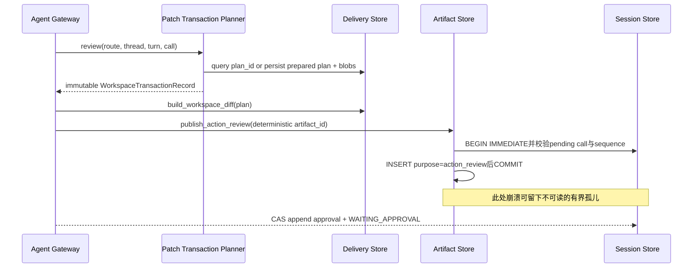

Artifact ID为`UUIDv5(plan_id, "action_review:v1")`等价的固定命名空间派生值。发布采用查询优先和提交确认恢复：同一
Call、Artifact ID、作用域、正文和manifest重放返回原`ArtifactRef`及原TTL；任何正文或身份冲突返回`artifact_conflict`。
Artifact已提交而Session审批尚未提交时，`read`和`verify_reference`统一返回`artifact_not_found`，不泄漏“存在但未授权”的
区别；超过TTL且不再受活动Turn保护后可由GC转为`expired`。migration
[`0024_trusted_action_review_artifacts.sql`](../../src/harnessix/session/migrations/0024_trusted_action_review_artifacts.sql)
仅重建Artifact用途约束以加入`action_review`，旧行逐列复制，Agent Event/Thread继续使用v20且历史事件正文不重写。

### 22.23 批准、执行、取消与成员提交

批准仍由e2的Router先行Saga完成。只有Execution Approval Checkpoint和Action Audit都证明Route为`ready`后，
[`WorkspacePatchActionExecutor`](../../src/harnessix/delivery/trusted_action.py)才能获取Workspace Lease。执行器按以下顺序工作：

```text
load exact Delivery record and verify Route/proposal binding
acquire workspace lease(owner = "workspace-patch:" + plan_id, ttl = 300s)
while transaction is not published:
    await cooperative cancellation checkpoint
    publish_next(exact transaction, approval fingerprint, lease)
release lease in finally
map durable Delivery state to ActionExecutionOutcome
```

[`WorkspaceTransactionRuntime.publish_next`](../../src/harnessix/delivery/filesystem.py)最多提交一个成员。成员内部仍执行现有安全链：

```text
verify plan source / recover existing publishing state
assert current fencing token
observe target with directory descriptors and no-follow
if target already equals after: advance cursor only
elif target differs from before: mark diverged and stop
else:
    create exclusive temporary file in verified parent
    write bounded blob, chmod, fsync(file)
    re-observe before image
    replace/unlink and fsync(parent)
    re-observe exact after image
    CAS advance transaction cursor
if cursor == mutation count: mark published
```

取消只能在两个有界成员之间被协作调度。取消发生在某一成员内部时，该成员先完成文件效果和Ledger记录；Router随后把运行中的
Action标为`unknown`。恢复路径只调用`reconcile`，不会继续提交剩余成员。若观察到一个严格after前缀和before后缀，Delivery
进入`interrupted(cursor=N)`，Action映射为`manual_intervention/delivery_partial_effect`；全after可证明成功；全before且游标为0
可证明未应用；第三状态、顺序混合或无法观察均保持保守终态。

### 22.24 失败语义矩阵

| 故障点/条件 | 持久事实 | Agent/Router结果 | 是否自动重放写入 |
|---|---|---|---:|
| 输入非法、保护路径、超预算 | 无Route或无Delivery事务 | 失败结果/稳定参数错误 | 否 |
| Route已存但Delivery尚未存 | Route `pending_approval`；无文件效果 | Review重放查询后可重新物化同一事务 | 仅规划，不写文件 |
| Delivery已存但Artifact未存 | `prepared`事务与Blob完整 | 重建同一Diff并发布同一Artifact ID | 否 |
| Artifact提交确认丢失 | 唯一`action_review`行已提交 | 查询原身份返回原Ref/TTL | 否 |
| Artifact已提交、审批未提交 | 有界孤儿，不可读 | Turn中断；重试同一调用可复用 | 否 |
| 审批后来源Snapshot漂移 | Route仍`ready`，事务`prepared` | `execution_plan_stale`，无覆盖 | 否 |
| Lease被其他Owner持有 | 无新成员效果 | Router执行不确定，随后Reconcile证明未应用 | 否 |
| 成员替换前漂移 | `diverged/delivery_source_changed` | 失败或人工处理 | 否 |
| 成员效果后、游标前取消/崩溃 | 文件可能after，Ledger仍旧游标 | Reconcile根据镜像推进或标记部分效果 | 否 |
| 第一个成员后取消 | 严格after前缀+before后缀 | `manual_intervention/delivery_partial_effect` | 否 |
| 全部文件after、终态前崩溃 | 全after可观察 | Reconcile标记`published/succeeded` | 否 |
| 观察到第三正文/类型 | `diverged`或`unknown` | 人工处理 | 否 |
| Windows或缺少no-follow标志 | Capability `omitted/platform_not_supported` | 模型目录无Patch Tool | 否 |

审批后来源漂移当前保留Route `ready`，因为Router在进入`running`前完成Snapshot复核。该状态不会产生文件效果，但需要新提案形成
新Plan，不能复用旧批准；0.9.3将把该失败纳入统一超时、重试和产品诊断统计。

### 22.25 默认产品生命周期与状态布局

[`open_default_product_action_runtime`](../../src/harnessix/product_config/action_runtime.py)在
[`run_product_stdio`](../../src/harnessix/product_config/server.py)内部拥有以下同步Store和可选异步Process Supervisor，并通过
`AsyncExitStack`保证部分构造失败也会逆序关闭：

```text
<state-root>/
├── product-config.db
├── sessions.db                 # Session、Protocol Request、Artifact/action_review
├── execution-plans.db          # Execution Plan与批准Checkpoint
├── action-audit.db             # Route快照和连续Hash链事件
├── workspace-leases.db         # Workspace跨进程Fencing
├── workspace-transactions/
    ├── transactions.db         # Delivery计划、状态与成员游标
    └── blobs/                  # SHA-256寻址的目标正文
└── process-owner/              # 仅配置固定Process Profile时创建
    ├── process-leases.db
    └── runs/<process-id>/
```

构造顺序为Provider Bundle→Session/Artifact→只读Tool Runtime→Action Stores→可选Process Supervisor/Profile探测→统一
Environment/Catalog/Gateway→Agent Runtime→配置CAS激活→stdio。任一Store、目录、Supervisor、Gateway或Agent构造失败都不会
激活配置或开放协议。e4仍不在启动前调用
`router.recover_interrupted()`；产品级Owner、在途Route扫描和Doctor/Preflight状态检查由e5统一关闭，不能把e3/e4局部恢复误写成
完整启动恢复能力。

### 22.26 SDK、协议与模型历史

Agent Protocol保持1.0且没有增加方法或公共枚举。统一Action的`presentation=patch_batch`继续投影为已有
`PublicApprovalRequestContent(approval_type=patch_batch)`；SDK通过原`events/replay`取得审批、通过`artifact/read`分页读取完整Diff、
通过`approval/respond`提交指纹绑定决定。最终`PublicToolResultContent.diff_artifact`沿用同一引用。

模型历史中，带`trusted_action`效果的`diff_artifact`绑定用途为`action_review`；旧专用Batch Patch仍绑定`batch_effect`。
[`reference.py`](../../src/harnessix/artifacts/reference.py)按用途分别验证Tool Result、Batch、Process和Action Review，避免在
`SQLiteArtifactStore`中继续扩张高复杂度分支。未经Session审批引用的Review不进入模型历史，也不能由公共Artifact Reader读取。

### 22.27 可读性、依赖与结构决策

实现提交`71a4794`新增一级依赖`product_config -> delivery`。该边只存在于产品组合模块：产品层需要把经能力证明的Catalog连接到
Delivery Executor，Delivery不反向依赖Product Config，因此没有扩大既有强连通分量。为避免形成
`artifacts -> delivery -> ... -> artifacts`环，Review编排位于
[`workspace_patch_review.py`](../../src/harnessix/product_config/workspace_patch_review.py)，Artifact包只负责通用存储、授权引用和GC。

Artifact发布、引用验证和Workspace成员提交分别拆至
[`action_review_store.py`](../../src/harnessix/artifacts/action_review_store.py)、
[`reference.py`](../../src/harnessix/artifacts/reference.py)及[`filesystem.py`](../../src/harnessix/delivery/filesystem.py)模块级函数。
可读性策略只接受上述单向产品组合依赖，不批准新的超大文件、超长/高复杂度符号或依赖环；现有热点预算随本次拆分只减不增。

### 22.28 测试证据与e3剩余边界

| 测试入口 | 已证明事实 |
|---|---|
| [`test_trusted_action_patch.py`](../../tests/delivery/test_trusted_action_patch.py) | 严格输入与Schema、创建/替换/删除、Unicode路径、完整Review、Artifact确认丢失与重放冲突、孤儿不可读、Lease竞争、成员间取消、部分效果、审批后漂移及Reconcile不重放 |
| [`test_filesystem.py`](../../tests/delivery/test_filesystem.py) | POSIX no-follow成员写、fsync/replace、Fencing、逐故障点、硬退出和镜像恢复 |
| [`test_server_and_cli.py`](../../tests/product_config/test_server_and_cli.py) | 默认状态Store构造、模型目录真实包含Patch、SDK读取Review并批准后真实写入，以及EOF/Artifact旧链回归 |
| [`tests/artifacts`](../../tests/artifacts/) | migration24兼容、Artifact分页/授权/过期/损坏与现有Batch/Process用途回归 |
| [`test_trusted_action_runtime.py`](../../tests/agent/test_trusted_action_runtime.py)与[`test_agent_gateway.py`](../../tests/trusted_actions/test_agent_gateway.py) | Router审批权威、Agent恢复和公共调用边界保持成立 |

实现Revision `71a479439edcdd29b863ec3a9bad7a52586dd1bf`本地收集3545项测试并以退出码0完成全量回归；19项仅因平台或外部
服务条件跳过。Ruff格式/规则、Mypy严格检查307个生产源码文件、Schema确定生成、文档链接和可读性治理门禁均通过。

首个文档候选的Windows任务暴露MCP超时测试把单次调用预算`0.1`秒同时误用为连接目录启动预算，慢速Runner尚未完成
握手即失败；该失败不是Patch运行时缺陷，也不能以重跑关闭。验证修复`a263f961a155ba0bd0c4d709f12691fe52e0b971`
将测试夹具的启动预算独立固定为2秒，仍保留调用预算0.1秒以及“写调用超时必须UNKNOWN且只能Reconcile”的原断言。
[CI 34748685155](https://github.com/carrie1988/Harnessix/actions/runs/34748685155)随后一次通过Linux Python 3.12/3.13、
macOS、Windows、PostgreSQL、固定镜像Container与Documentation七个任务，证明修复没有放宽生产超时或平台省略边界。

0.9.1e3尚不证明以下能力：

- Windows原生安全写；当前必须诚实省略；
- 固定Container Process Profile与强Sandbox；由e4实现；
- 产品启动前扫描并对账旧Route、Action Config文件加载、Doctor能力报告及统一Owner；由e5实现；
- 自动继续部分多文件事务；设计明确要求人工处理，不计划通过重放放宽；
- 多租户远端控制面、长期Soak和容量降级；分别由0.9.3～1.0处理。

因此e3已经独立关闭，但0.9.1e和0.9.1仍保持进行中。

### 22.29 0.9.1e4默认产品实现与验收边界

e4把固定Process Profile接入与Workspace Patch相同的产品内Trusted Action Runtime，不新增HTTP、Worker或第二套审批服务。
实际组合根由[`open_default_product_action_runtime`](../../src/harnessix/product_config/action_runtime.py)持有四类Action Store和
可选Process Supervisor；[`build_product_action_composition`](../../src/harnessix/product_config/action_composition.py)从同一
`ProductActionConfigV1`、Patch能力和Profile探测结果构造一个Capability Report、一个Catalog、一个Router注册集合和一个
Agent Gateway。

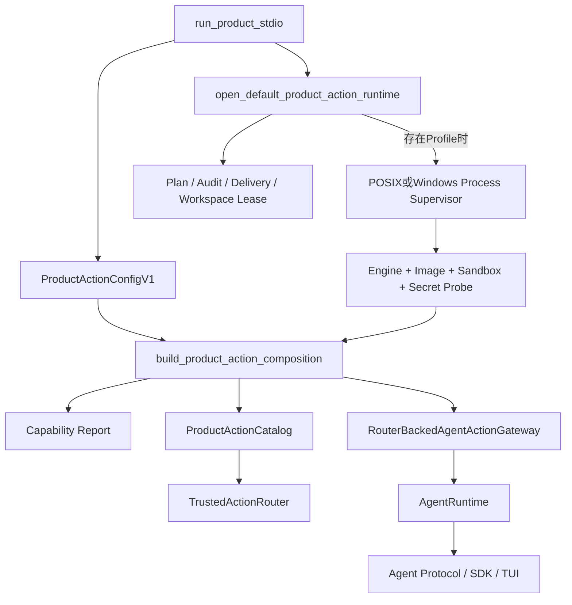

#### 22.29.1 组合接口与生命周期

| 符号 | 输入 | 输出/所有权 | 关键不变量 |
|---|---|---|---|
| `open_default_product_action_runtime` | State Root、Workspace、共享Artifact Store、Secret Provider、Action Config | 异步上下文中的`ProductActionComposition` | Store先进入Owner；有Profile才创建Supervisor；Gateway/Agent先关闭，随后Supervisor和Store逆序关闭 |
| `_probe_process_profiles` | 严格配置、唯一平台Supervisor、Secret Provider | 与配置同顺序的Probe Result | 探测放入工作线程；每个失败转成Profile级`omitted`，不构造Host执行路径 |
| `build_product_action_composition` | Patch环境、全部Probe Result、Router、Delivery/Artifact依赖 | Report、Catalog、可选Gateway | Probe Profile序列必须与配置逐项相等；Verified集合必须与Catalog Entry集合相等 |
| `_planning_context` | Thread Workspace、Tool名称、Verified Owner映射 | Patch或Process专属`ActionPlanningContext` | Workspace身份始终相同；Process使用自己的Container Sandbox、Capability、环境及Secret版本 |
| `RouterBackedAgentActionGateway` | 同源Descriptor、按Tool的Presentation/Review/Output Provider | Agent唯一高风险入口 | Patch才生成Review Diff；Process不调用Patch Review，只由输出Provider发布终态正文 |

`run_product_stdio`新增内部组合参数`action_config`。缺省值仍是仅开启Workspace Patch且不含Process Profile，因此现有CLI、配置
v2摘要和启动行为保持兼容；e5再负责外部Action Config文件的安全加载、迁移、诊断和活动版本Owner。传入配置在打开Store前经
严格JSON往返复核，不能以`model_construct`绕过摘要和字段约束。

#### 22.29.2 启动、规划与执行时序

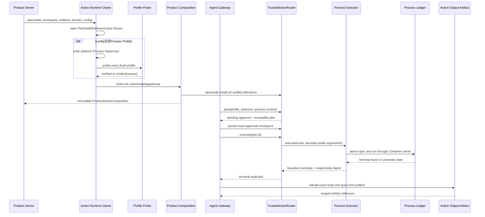

公共输入继续只有`profile`和受限`selectors`。Program、固定argv、镜像Digest、Engine绝对路径、网络、只读Workspace、资源预算、
环境和Secret引用均由宿主持有。执行前再次核对Route中的Binding、资源、Workspace、Environment、Sandbox、Capability与Secret；
Engine文件身份、镜像或批准事实漂移会在Spawn前失败关闭。

#### 22.29.3 持久化与失败/恢复语义

| 故障点 | Router/Session结果 | 持久事实 | 是否重放命令 |
|---|---|---|---:|
| Engine、Daemon、镜像或Secret探测失败 | Tool不进入模型目录，报告`omitted/<reason>` | Capability Report内省略事实 | 否 |
| 批量Catalog任一Entry、Probe顺序或配置摘要不一致 | 启动失败，stdio不开放 | 已打开Store保留，未发布半目录 | 否 |
| 批准前参数、Workspace或合同漂移 | 稳定失败，不启动Process | Route、Plan和审批事实保留 | 否 |
| Spawn前确定失败且不存在Lease | `failed/process_preflight_failed` | Action Audit终态 | 否 |
| 非零退出 | `failed/process_nonzero_exit`并发布输出Artifact | Process Lease、Audit摘要、Artifact | 否 |
| 超时或输出上限 | `failed/process_timeout`或`process_output_limit` | Owner终态、摘要和有界输出 | 否 |
| Task取消 | Router先记`unknown`；Owner停止并形成Lease后由Reconcile结算 | Audit UNKNOWN + Process Lease | 否 |
| 执行宿主丢失或输出不可证明 | `unknown`；恢复仍不可证明则`manual_intervention` | Audit、Lease或缺失证据 | 否 |
| Artifact提交确认丢失 | 查询同一Call/Plan确定性Artifact并返回原收据 | 单一`action_output`行 | 否 |
| Artifact已发布、Session结果未提交 | 正文保持不可读；Session恢复从Router终态重新投影 | Artifact正文 + Session事件缺口 | 否 |
| 产品关闭 | Agent/Gateway停止接收后关闭Supervisor，未终态Handle执行有界清理 | Store与Lease保留 | 否 |

Process正文使用规范JSONL：首记录是公开摘要，后续记录是二进制安全Base64分片。Router Audit仅保存公开摘要Hash和Artifact
SHA-256；Artifact Store在同一Session事务边界校验Thread、Turn、Call、批准的Process ID和Workspace Scope。提交确认丢失时按
稳定Artifact ID查询，不生成第二份正文或刷新TTL。

#### 22.29.4 测试与真实验证

| 测试入口 | 覆盖事实 |
|---|---|
| [`test_process_action.py`](../../tests/product_config/test_process_action.py) | Selector攻击、能力证明、镜像省略、配置/Probe集合闭合、前置失败、非零退出、超时、输出上限、取消后Reconcile不重放、完整Agent审批、输出Artifact及提交确认丢失 |
| [`test_server_and_cli.py`](../../tests/product_config/test_server_and_cli.py) | `run_product_stdio`真实持有Process Supervisor，模型目录同时出现Patch与Verified Profile，EOF和旧产品链保持兼容 |
| [`test_product_process_profile.py`](../../tests/integration/test_product_process_profile.py) | CI固定Digest镜像中的真实产品Profile：批准前不执行、批准后只读无网络Container运行、输出分页、Workspace未修改 |
| [`test_supervisor.py`](../../tests/processes/test_supervisor.py)、[`test_windows_supervisor.py`](../../tests/processes/test_windows_supervisor.py) | Owner硬退出、控制丢失、取消、超时、输出限制和重启只对账 |
| [`test_container_sandbox.py`](../../tests/integration/test_container_sandbox.py) | 固定镜像、网络none、只读挂载、资源限制、Secret脱敏和Container清理 |

实现提交`f5a3936`完成后，本地Ruff、Mypy、Schema生成、文档/链接/Mermaid、可读性与全量Pytest均通过。首次并发CI中的一份
重复运行暴露既有SDK后台Turn测试仅等待0.5秒的调度假设；`4b28fa4`把审批与问题状态等待统一为5秒单调时钟边界，并连续10轮
通过对应回归。最终[CI 35434198163](https://github.com/carrie1988/Harnessix/actions/runs/35434198163)七项全部通过：Linux Python
3.12/3.13均为3551 passed、20 skipped，固定镜像Container为3 passed，macOS、Windows、PostgreSQL与Documentation同时通过。
0.9.1e4据此关闭；Skip仅对应平台或外部能力条件，不包含固定镜像产品验收。

#### 22.29.5 与e5及0.9.1f的边界

本切片不实现外部Action Config文件发现、权限校验、活动版本CAS、Doctor修复动作和产品启动时全局扫描旧Route；这些属于e5。
本切片也不恢复独立Action HTTP/Worker：Process、Patch、Policy、Approval、Audit、UNKNOWN和Reconcile均位于单一Coding Agent
产品进程。旧Process Bridge、Git Push和Eval迁移及兼容内核物理删除继续分别由0.9.1f2、f3完成。

### 22.30 0.9.1e5实施前冻结设计

e5只关闭默认Coding Agent产品内的Action配置、诊断、生命周期和冷启动恢复，不新增独立HTTP/Worker、远端执行或第二套产品入口。
本节是实现前冻结合同；若实现需要改变下列状态或失败语义，必须先更新ADR和本节，再修改生产代码。

#### 22.30.1 组合根与数据所有权

```mermaid
flowchart TD
    CLI[harnessix code / agent-server] --> PC[Product Config v2安全加载]
    CLI --> AC[Product Action Config v1安全加载]
    PC --> PF[Preflight / Doctor]
    AC --> PF
    PF --> PR[脱敏配置与能力报告]
    PC --> CS[(product-config.db)]
    AC --> CS
    CS --> PREV[上一活动Action Config快照]
    PREV --> OWNER[ProductActionRuntimeOwner]
    AC --> OWNER
    OWNER --> STORES[Plan / Audit / Delivery / Lease / Process Owner]
    OWNER --> RECOVERY[启动恢复：running→unknown→reconcile]
    RECOVERY --> CATALOG[候选配置同源Catalog + Gateway]
    CATALOG --> AGENT[AgentRuntime]
    AGENT --> ACTIVATE[Product + Action活动指针原子CAS]
    ACTIVATE --> STDIO[开放Agent Protocol stdio]
```

`ProductActionRuntimeOwner`是Action Store、Process Supervisor、恢复Router、候选Catalog和Gateway的唯一产品生命周期Owner。
`ProductActionComposition`保留为一次启动冻结的能力视图，但不再承担Store和恢复生命周期。Product Config v2与Action Config v1
保持两个独立Schema和摘要；二者的活动指针保存在同一个私有SQLite数据库，并由一个事务原子切换，禁止出现“模型配置已激活、Action
配置未激活”或相反的半启动状态。

#### 22.30.2 Action Config文件、快照与CAS

外部文件通过`--action-config`显式传入；省略时使用版本化内建配置“启用POSIX安全Patch、无Process Profile”。外部文件沿用Product
Config的安全文件读取原语：最大256 KiB、严格UTF-8、拒绝NUL/重复键/非有限数/未知字段、深度32、节点20000；POSIX还要求普通
单链接文件、当前用户所有和`0600`，读取前后文件身份必须完全一致。

```text
ProductActionConfigSnapshot
  source_kind: builtin | file
  source_sha256: 原始文件或内建规范JSON的SHA-256
  config_sha256: ProductActionConfigV1规范摘要
  loaded_at: 带时区时间
  config: ProductActionConfigV1

ProductActionConfigAuditEvent
  sequence / operation(loaded|activated)
  config_sha256 / previous_active_sha256
  previous_digest / occurred_at / digest
```

快照不可变且按`config_sha256`去重；同摘要不同正文视为存储损坏。首次激活要求预期活动摘要为空；同一摘要重复启动幂等；切换必须
提供`--expected-active-action-sha256`并与数据库精确一致。产品配置与Action配置的活动切换在同一SQLite事务中完成，任一CAS冲突
都不得开放stdio、创建Thread或留下单边新活动指针。

#### 22.30.3 Doctor与能力诊断

`ProductPreflightRequest`新增可选Action Config路径；`ProductPreflightReport`新增Action Config摘要和
`ProductActionCapabilityReport`。显式文件不可读或合同无效属于required失败；省略外部文件属于通过的内建配置事实。每个候选能力
产生独立advisory检查：`verified`为通过，`omitted`为失败但不阻止只读产品启动，并携带稳定`reason_code/remediation_id`。

诊断不得创建请求的State Root。Patch诊断复用正式Binding构造和平台安全端口判断；Process诊断只执行只读的Owner实现、容器引擎、
不可变镜像、Sandbox、资源和Secret版本证明，不创建Process Lease、不启动容器命令。报告禁止绝对路径、argv、环境值、Secret值、
镜像凭据和原始异常。Startup在Preflight后仍重新执行一次正式能力探测，防止诊断与进入Owner之间发生能力漂移。

#### 22.30.4 冷启动恢复算法

```text
open all durable Action stores and optional Process Supervisor
load previous active Action Config snapshot; absent means current candidate
build recovery Router from previous exact config and current capability evidence
scan all active routes before accepting protocol
verify every active route has an exact registered binding
for running/reconciling routes: append host_interrupted transition to unknown
for every unknown route: call reconcile exactly once; never call execute
if any route remains running/reconciling/unknown or exact binding is unavailable: fail startup
build candidate Router/Catalog/Gateway
verify remaining pending_approval/ready routes match candidate exact bindings
only then construct AgentRuntime, atomically activate both configs, and open stdio
```

上一活动配置与候选配置不同时，恢复Router和候选Router必须是两个先后使用同一账本的实例，不能在一个注册表中同时注册同Tool的两个
版本。旧`running/unknown`先用上一快照结算；仍为`pending_approval/ready`的计划只有在候选配置提供逐字段相等的Binding时才允许继续。
否则以`product_action_recovery_binding_unavailable`失败关闭并保留全部账本。Reconcile返回`unknown`时不循环重试，启动以
`product_action_recovery_incomplete`失败；下一次启动或人工处置可再次观察，但任何路径不得调用`execute`。

#### 22.30.5 恢复报告与失败矩阵

成功恢复生成摘要绑定的`ProductActionStartupRecoveryReport`，至少记录配置摘要、扫描数、被中断数、Reconcile数、成功/失败/人工处置
数以及仍等待审批/ready数；逐Plan身份和事件留在Action Audit Hash链，不进入Doctor公开输出。

| 故障 | 对外结果 | 持久事实 | 禁止行为 |
|---|---|---|---|
| Action Config文件不安全或读取漂移 | Preflight/启动required失败 | 不激活候选快照 | 降级到内建配置 |
| Action Config摘要、重复键或未知字段错误 | 合同失败 | 不注册目录 | 宽松解析或忽略字段 |
| 活动配置CAS冲突 | 启动失败 | 旧活动双指针保持不变 | 单边覆盖指针 |
| 旧Route绑定无法由上一快照重建 | 恢复绑定不可用 | Route与Audit原样保留 | 用新Binding对账 |
| 旧`running/reconciling` | 先转`unknown`再对账 | Hash链追加恢复事件 | 再次execute |
| Reconcile仍为`unknown` | 启动恢复不完整 | UNKNOWN事实保留 | 循环重试或开放stdio |
| 候选配置删除仍在等待的Binding | 启动失败 | pending/ready保持 | 遗弃审批或静默换Tool |
| Doctor能力探测失败 | advisory omitted | 不创建State Root | Host执行Fallback |

#### 22.30.6 e5测试与关闭门禁

e5至少新增以下自动化证据：安全文件读取全部攻击面；快照/事件摘要、活动Action CAS、双配置原子CAS和损坏Hash链；Doctor内建与外部
配置、verified/omitted、脱敏和只读；启动扫描`running/reconciling/unknown`、Reconcile终态/仍未知、缺失旧Binding、配置切换与
`pending/ready`兼容；stdio开放顺序与部分构造逆序关闭；CLI参数透传；Windows省略语义；真实固定镜像产品链。关闭顺序仍是本地专项、
全仓Pytest、Ruff、Mypy、Schema双生成、可读性、文档/链接/Mermaid、七任务CI和现行文档同步。

e5关闭的是0.9.1e，不关闭0.9.1总项。0.9.1仍需0.9.1f2把剩余旧调用方迁入进程内Trusted Action Runtime，并由f3物理删除
HTTP API、Worker Queue、旧Bootstrap、专用Adapter及相关依赖后，才能按路线图评估整体完成。

### 22.31 0.9.1e5实现与源码对应

e5实现遵守22.30冻结合同，没有引入独立Action服务。实现Revision `e5b7a8a`已通过
[CI 35439332019](https://github.com/carrie1988/Harnessix/actions/runs/35439332019)七任务全矩阵验收，本文据此转为`current`并关闭e5。

#### 22.31.1 文件与职责

| 源码 | 重点符号 | 单一职责 |
|---|---|---|
| [`action_codec.py`](../../src/harnessix/product_config/action_codec.py) | `decode_product_action_config_bytes`、`load_product_action_config` | 严格解析外部v1文件或生成内建快照；不持久化、不构造Runtime |
| [`action_contracts.py`](../../src/harnessix/product_config/action_contracts.py) | `ProductActionConfigSnapshot`、`ProductActionConfigAuditEvent`、`ProductActionStartupRecoveryReport` | 定义来源、活动变更与恢复汇总的不可变摘要合同 |
| [`action_diagnostics.py`](../../src/harnessix/product_config/action_diagnostics.py) | `diagnose_product_actions` | 无状态生成Patch/Process能力证明或诚实省略事实 |
| [`preflight_actions.py`](../../src/harnessix/product_config/preflight_actions.py) | `inspect_product_actions` | 把Action文件与能力事实映射为Required/Advisory检查 |
| [`action_store.py`](../../src/harnessix/product_config/action_store.py) | `SQLiteProductRuntimeConfigStore`、`_activate_runtime` | 在Product配置数据库中保存Action事实并原子切换双指针 |
| [`action_runtime.py`](../../src/harnessix/product_config/action_runtime.py) | `ProductActionRuntimeOwner`、`open_default_product_action_runtime`、`_recover_product_actions` | 拥有Store/Supervisor，先恢复旧Route，再发布候选Gateway |
| [`server.py`](../../src/harnessix/product_config/server.py) | `_ProductRuntimeStartup`、`_serve_product_stdio`、`run_product_stdio` | 固定启动顺序并在最后一步开放stdio |
| [`product_ui/cli.py`](../../src/harnessix/product_ui/cli.py) | `_action_config`、`_server_command` | 把显式文件、环境变量和三个活动CAS前提传入内部Server |

`server.py`把“输入验证”和“托管运行期”拆成两个小阶段。`_ProductRuntimeStartup`只保存已经验证的固定事实，不保存任意原始配置
字节或Secret明文；`_serve_product_stdio`只负责编排生命周期，避免配置解析、路径检查和业务运行混入同一超大函数。

#### 22.31.2 数据结构与字段语义

| 合同/表 | 关键字段 | 不变量与用途 |
|---|---|---|
| `ProductActionConfigSnapshot` | `source_kind/source_sha256/config_sha256/loaded_at/config` | 来源摘要与规范配置摘要分离；运行期只按规范摘要去重 |
| `ProductActionConfigAuditEvent` | `sequence/operation/previous_active_sha256/previous_digest/digest` | 连续序号和前向摘要链；`loaded`不能伪造上一活动摘要 |
| `ProductActionStartupRecoveryReport` | 候选/恢复配置摘要、扫描/中断/对账/终态/等待计数 | 终态计数必须等于对账数；报告本身有摘要，不保存Plan身份 |
| `product_action_config_snapshots` | `config_sha256/source_sha256/payload` | 同摘要不同规范正文视为损坏 |
| `product_action_config_active` | 单例活动摘要 | 外键只指向已保存快照 |
| `product_action_config_events`与`event_head` | 连续事件及链头 | 读取和激活前完整校验，不对损坏链继续追加 |
| `product_action_recovery_reports` | `report_sha256/payload` | 幂等保存成功恢复报告；逐Route细节仍在Action Audit |

`ProductPreflightReport`增加`action_config_sha256`和`actions`。Action文件与能力目录自身是Required；某项能力因平台、Engine、镜像、
资源或Secret不成立时是Advisory `omitted`，因此只读Agent仍可启动。报告同时绑定Product和Action两个摘要，启动重读后若摘要变化，分别
返回`product_config_changed`或`product_action_config_changed`，不让旧Doctor结论授权新文件。

#### 22.31.3 启动核心伪代码

```text
preflight = run_preflight(product_path, action_path, workspace, state)
require preflight.ready

product = secure_load_product_config(product_path)
require product.digest == preflight.product_digest
actions = secure_load_action_config_or_builtin(action_path)
require actions.digest == preflight.action_digest
require config_paths outside workspace and state disjoint from workspace

open ProductRuntimeConfigStore
save product snapshot and action snapshot
previous = load active action snapshot or candidate
open provider, session, artifact and coding-tool owners
open ProductActionRuntimeOwner(previous, candidate):
    build exact previous router from current capability evidence
    verify every active product route binding exists
    transition running/reconciling to unknown
    reconcile each unknown once; never execute
    fail if any unknown/reconciling/running remains
    build candidate router when digest differs
    verify pending/ready routes still have exact candidate binding
    persist recovery report
    open AgentRuntime(candidate gateway)
    atomically CAS product active pointer + action active pointer
    open stdio protocol
```

恢复Router必须使用上一活动配置，而不是候选配置。Process恢复仍要求当前宿主能证明旧Engine、镜像、Owner、Sandbox及其Secret版本；
因此运维切换Product/Action配置时，必须先结算旧在途Route，或继续保留旧Profile引用的Secret来源。删除恢复证据不会触发Host
Fallback，而是以`product_action_recovery_binding_unavailable`失败关闭。

#### 22.31.4 事务与崩溃窗口

`SQLiteProductRuntimeConfigStore.activate_runtime`在单个`BEGIN IMMEDIATE`事务内执行以下顺序：校验Product事件链、校验Action事件链、
确保两个候选快照存在、读取两个活动指针、同时验证所有发生变化的CAS前提、更新Product指针/事件、更新Action指针/事件、提交。
Product前提冲突或Action前提冲突都会回滚整个事务。配置相同的重复启动不新增激活事件；配置切换必须提供对应旧摘要。

快照保存先于Owner构造，故构造失败可能留下未激活候选快照和`loaded`审计事件，这是有意的审计事实，不代表配置已经上线。恢复报告
只在全局Route恢复成功后保存；Agent、Tool、Action和Provider全部就绪后才激活，激活后才开放stdio。stdio EOF不回滚已经成功的
活动配置，因为它记录的是该启动实例实际采用的配置，而不是连接租约。

#### 22.31.5 稳定失败语义

| 稳定码 | 触发边界 | 状态结果 | 重试规则 |
|---|---|---|---|
| `product_action_config_size/invalid/permissions/unavailable/changed` | 严格解析、安全读取或预检后漂移 | 不创建运行State或不激活候选 | 修复文件后重新Doctor；不得降级内建配置 |
| `product_action_config_overlap` | 外部Action文件位于Workspace | 启动前失败 | 移到私有配置目录 |
| `product_action_config_store_corrupt` | 快照、事件链、链头或恢复报告不一致 | 停止写入与启动 | 隔离数据库并从验证备份恢复 |
| `product_action_config_conflict` | Action活动CAS不匹配 | Product/Action双指针均保持旧值 | 读取当前活动摘要后人工重试 |
| `product_action_recovery_binding_unavailable` | 旧Route或候选等待Route没有精确Binding | Route状态保持；协议不开放 | 恢复旧配置/能力后再启动 |
| `product_action_recovery_incomplete` | 一次Reconcile后仍有未知效果 | UNKNOWN事实保留；协议不开放 | 人工核对或下一次只观察恢复；禁止execute |

#### 22.31.6 测试映射与候选证据

| 测试 | 证明内容 |
|---|---|
| [`test_action_config_runtime.py`](../../tests/product_config/test_action_config_runtime.py) | 严格JSON攻击、POSIX权限/硬链接、快照篡改、双CAS双向冲突回滚、Action事件Hash链损坏 |
| [`test_action_runtime.py`](../../tests/product_config/test_action_runtime.py) | `running→unknown→reconcile`成功、仍未知失败关闭、缺失旧Binding时不改状态、候选配置不得丢弃`pending_approval`绑定，且执行调用次数始终为零 |
| [`test_preflight.py`](../../tests/product_config/test_preflight.py) | 内建/外部Action、Required与Advisory、Workspace重叠、脱敏和Doctor不创建State Root |
| [`test_server_and_cli.py`](../../tests/product_config/test_server_and_cli.py) | 恢复报告持久化、外部配置切换CAS、预检后漂移失败、stdio开放前顺序和现有产品链回归 |
| [`tests/product_ui/test_cli.py`](../../tests/product_ui/test_cli.py) | `--action-config`及Product/Action CAS参数精确透传 |
| [`test_schemas.py`](../../tests/product_config/test_schemas.py) | 三个新增公开Schema与运行时Pydantic合同确定一致 |

专项Product Config、Product UI和Trusted Action Router回归、Ruff、Mypy、Schema、可读性、全仓
3583项收集测试及变化文档Mermaid真实渲染均已在本地以退出码0完成。[CI 35439332019](https://github.com/carrie1988/Harnessix/actions/runs/35439332019)
进一步证明Linux Python 3.12/3.13均为3563 passed、20 skipped；macOS为2497 passed、15 skipped；Windows为499 passed、45 skipped；
固定Digest Container为3 passed；PostgreSQL为2 passed；Documentation真实渲染590幅Mermaid并通过全48个变化路径检查。
所有七个Job一次通过，Skip不包含固定镜像产品验收；0.9.1e据此正式关闭，0.9.1整体仍等待0.9.1f2/f3。
