# Harnessix Code 0.9.1e默认Trusted Action产品组合详细设计

## 1. 变更摘要

| 项目 | 内容 |
|---|---|
| 需求 | 让Artifact、Patch、Process和Delivery通过统一Trusted Action链进入默认Coding Agent能力目录 |
| 当前问题 | 默认产品只装配只读Tool；高风险能力分散在专用Bridge；Agent审批与Router审批没有统一 |
| 目标结果 | 能力证明同时生成广告目录和可执行注册；多文件Patch真实事务发布；固定Profile Process在强Sandbox运行；完整Artifact与重启Reconcile可用 |
| 影响模块 | Agent、Trusted Actions、Artifacts、Patches、Processes、Delivery、Sandbox、Product Config、Product UI、Protocol |
| 兼容级别 | Product Config v2和Agent Protocol v1保持兼容；Agent Event追加v19；新增独立Product Action Config v1和内部Gateway合同 |
| 发布/回滚单元 | 0.9.1e1～0.9.1e5五个可独立回滚纵向切片；功能门只控制新目录，不删除历史事实 |
| 当前状态 | 源码研究与ADR已完成；0.9.1e1实现已由[CI 34739842959](https://github.com/carrie1988/Harnessix/actions/runs/34739842959)全矩阵验收并关闭；0.9.1e2～e5待实施 |

## 2. 需求背景与证据

### 2.1 用户可见缺口

0.9.1a～0.9.1d已经交付可恢复客户端、完整交互、配置/Doctor以及Windows原生只读链。用户能让模型理解仓库，却不能在默认
产品中完成一个真实的“修改→审批Diff→写入→运行测试→读取结果”循环。代码库中的Patch/Process/Delivery仅能通过示例或自定义
组合根使用，不能作为产品能力。

### 2.2 生产风险

简单把已有类传给`AgentRuntime`不能视为完成：

- 专用Patch Bridge写入受管副本，不能证明用户Workspace已事务提交；
- Host Process可受管终止进程树，但不是文件系统/网络强Sandbox；
- Agent审批Item与Trusted Action Execution Approval Checkpoint可能出现双权威；
- 广告能力若不依赖平台探测，会在Windows或无容器宿主上诱导模型选择不可执行Tool；
- 写入结果丢失后若Agent重跑Tool，可能产生重复或混合效果；
- Diff/Process完整输出若直接进入模型或协议，会突破Context、隐私和消息上限。

### 2.3 证据

- [默认Trusted Action产品组合源码研究](../research/default-trusted-action-product-composition.md)固定了Codex、OpenCode和非官方
  Claude重建代码的工具目录、审批和Sandbox证据；
- [ADR 0080](../adr/0080-capability-proven-product-action-composition.md)已经选择能力证明驱动的单一组合根；
- [`TrustedActionRouter`](../../src/harnessix/trusted_actions/router.py)已有Plan、Policy、Approval、Execute、UNKNOWN和Reconcile；
- [`WorkspaceTransactionRuntime`](../../src/harnessix/delivery/filesystem.py)已有POSIX Fencing和部分效果恢复；
- [`ContainerProcessRuntime`](../../src/harnessix/sandbox/process_runtime.py)已有固定容器执行合同；
- [`SQLiteArtifactStore`](../../src/harnessix/artifacts/sqlite.py)已有事务发布、范围与分页读取；
- [`run_product_stdio`](../../src/harnessix/product_config/server.py)证明默认组合仍未使用上述能力。

## 3. 设计目标、非目标与验收标准

### 3.1 目标

1. 创建版本化`ProductActionConfigV1`和能力报告，不改变Product Config v2；
2. 创建同源`ProductActionCatalog`，广告集合与Router定义集合严格一致；
3. 为Agent建立通用`TrustedActionGateway`，不为每种新Tool复制核心调度分支；
4. Agent Event v19持久化精确Plan、Policy、呈现和Artifact绑定，旧事件可继续读取；
5. 公共Agent Protocol v1 JSON形状、审批枚举和SDK解析保持不变；
6. 默认装配Artifact Store和Scoped Reader；
7. POSIX提供多文件Patch→完整Diff→审批→Workspace Transaction→结果闭环；
8. Process只通过固定Profile、不可变镜像和Container强Sandbox进入目录；
9. 取消、超时、执行返回丢失、进程崩溃和服务重启均由Router与领域Ledger对账；
10. Windows和能力不足宿主稳定省略未证明的写入/Process，不影响已关闭的只读链；
11. TUI和SDK能观察计划、Diff、审批、工具进度、终态及恢复结果；
12. 全量合同、故障、攻击、真实文件系统、真实Container和CI矩阵通过。

### 3.2 非目标

- 不开放任意Shell、任意程序路径、任意环境变量或明文Secret；
- 不实现公网Git Push、凭据Helper、known-hosts或远端MCP OAuth；
- 不把Host Process当作Container失败时的Fallback；
- 不在Windows普通目录使用POSIX实现、字符串`resolve`或弱化Reparse防护；
- 不在本切片实现Windows原生事务Writer；
- 不修改Product Config v2 Schema、摘要和现有配置文件；
- 不扩展公共Agent Protocol v1审批枚举；
- 不删除或迁移旧Patch/Process事件与专用Bridge；
- 不宣称TUI完整、四项只读通过或单次Patch成功等于1.0可商用；
- 不在0.9.1e关闭Router通用异常清洗、容量与长期Soak的全部债务，分别由0.9.3/0.9.4负责。

### 3.3 完成标准

- [ ] 源码研究、ADR、详细设计和现行模块文档完整同步；
- [x] Product Action Config/Capability Report合同冻结并生成Schema；
- [x] Catalog广告与Router注册同源且属性测试通过；
- [ ] Agent Event v19新旧读取、Reducer、Approval Match、恢复和公共投影通过；
- [ ] Artifact默认Store/Reader、Action Review purpose与越权测试通过；
- [ ] POSIX多文件新增/修改/删除Diff审批和真实事务提交通过；
- [ ] 计划后/审批后Workspace漂移、租约丢失、部分效果与返回丢失恢复通过；
- [ ] 固定Profile Container Process正常、非零、超时、取消、崩溃和输出Artifact通过；
- [ ] 无容器/镜像漂移/错误配置/Windows普通目录均不广告高风险能力；
- [ ] SDK与TUI纵向验证同一审批和Artifact证据；
- [ ] 全仓Ruff、Mypy、Schema、Readability、文档与Pytest通过；
- [ ] Linux 3.12/3.13、macOS、Windows、PostgreSQL、Container及Documentation CI全绿；
- [ ] 本文转为`historical`，回填精确Revision、CI、测试数量和实现偏差；
- [ ] 0.9.1总体切片关闭并更新路线图、README、架构、运维和威胁模型。

## 4. 当前实现与根因

### 4.1 当前默认组合

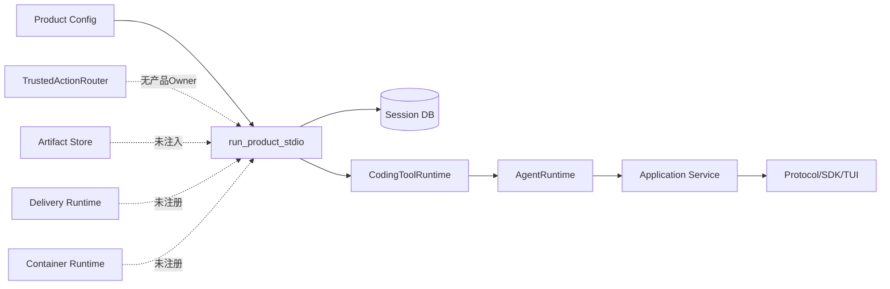

当前`CodingToolRuntime`只在显式传入Artifact Store时支持完整Artifact，产品Server未传。Agent Runtime虽能接收
`PatchRuntime/PatchBatchRuntime/ProcessRuntime`，但Server也未传这些端口。

### 4.2 当前高风险调用分支

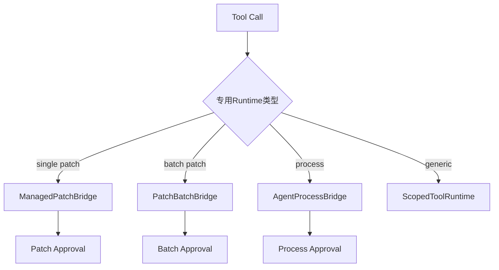

这种结构证明了各领域行为，却不适合作为未来高风险Tool扩展面。Agent核心必须只新增一个通用Trusted Action分支，现有专用分支
保留历史兼容，不再作为产品默认路径。

### 4.3 根因树

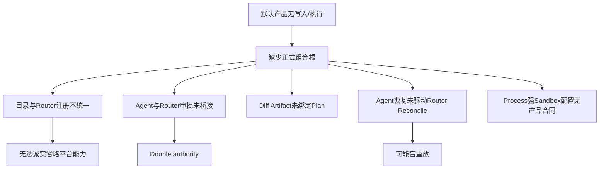

## 5. 方案与变更后架构

### 5.1 总体架构

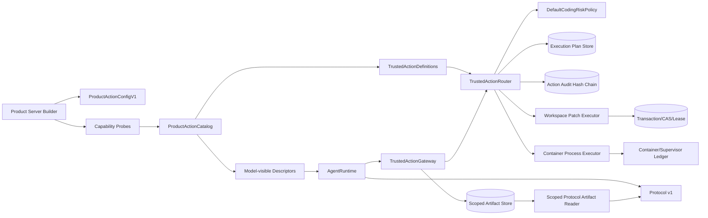

### 5.2 模块职责

| 计划模块/符号 | 职责 | 禁止职责 |
|---|---|---|
| `product_config/action_contracts.py` | Action Config、Profile、Capability Evidence/Report严格合同 | 读取环境、探测引擎、执行进程 |
| `product_config/action_config.py` | 安全读取与诊断独立Action配置 | 修改Product Config v2、保存Secret值 |
| `product_config/action_composition.py` | 构造并拥有Catalog、Router、Store、Executor生命周期 | Agent状态机、UI渲染 |
| `product_config/action_catalog.py` | 从已验证定义生成Descriptor并证明集合一致 | 动态加载任意Python插件 |
| `trusted_actions/planning.py` | 调用规范化、幂等Plan与跨Store规划恢复 | 审批、执行或具体产品能力探测 |
| `trusted_actions/agent_gateway.py` | Agent调用→确定性Plan→审批→执行/恢复适配 | 重新实现Policy、直接写文件、直接spawn |
| `trusted_actions/review.py` | 从精确Plan构造有界摘要和完整Artifact | 决定是否批准、执行写入 |
| `delivery/trusted_action.py` | Patch输入→事务计划→执行/对账 | 接受UI重构参数、绕过Lease |
| `sandbox/trusted_process_action.py` | Profile选择→Container Plan→执行/对账 | 任意Shell、Host Fallback |
| `agent/runtime.py` | 调用统一Gateway并持久化交互事实 | 读取Router私有Store或分支到具体Executor |
| `product_config/server.py` | 验证后进入Owner生命周期、注入Gateway/Artifact Reader | 内联实现Catalog与Executor细节 |

实际命名可在实施中根据现有包边界小幅调整，但职责和依赖方向不得改变。任何偏差必须回填第16节。

### 5.3 依赖方向

```text
product_config.action_composition
  -> artifacts / trusted_actions / delivery / sandbox
  -> agent TrustedActionGateway port implementation

agent.runtime
  -> agent ports/models
  -> no concrete delivery or sandbox executor

trusted_actions.agent_gateway
  -> trusted_actions.router/contracts
  -> agent models/ports

delivery.trusted_action / sandbox.trusted_process_action
  -> trusted_actions contracts
  -> their own domain runtime
```

禁止`delivery -> agent.runtime`、`sandbox -> product_ui`或`trusted_actions -> product_config`反向依赖。

### 5.4 替代方案

| 方案 | 优点 | 缺点 | 风险 | 结论 |
|---|---|---|---|---|
| 复用全部旧专用Bridge | 改动少 | 多审批/恢复权威，真实Delivery缺失 | 无法证明统一Action | 拒绝 |
| Agent直接依赖Router | 少一个接口 | 核心状态机知道计划Store与Executor细节 | 测试和扩展耦合 | 拒绝 |
| 通用Gateway + 同源Catalog | 权威清晰、可扩展、可探测 | 新合同和恢复Saga | 可通过分片测试控制 | 采用 |
| Product Config v3一次合并 | 单配置文件 | 迁移范围过大 | 0.9.1e失焦 | 延后 |
| Windows先用受管副本 | 快速广告Patch | 用户Workspace未提交 | 支持声明失真 | 拒绝 |

### 5.5 接口设计总览

产品组合只向Agent暴露`TrustedActionGateway`，Gateway只向具体适配器暴露冻结的`ActionRoutePlan`与已由宿主解码的严格参数。
Catalog Builder、Review Provider、Patch Executor和Process Executor均通过小型Protocol协作；接口不得传递数据库连接、普通文件句柄、
任意回调或未验证配置对象。具体方法、输入、输出和异常在第7.3节及第9～11节展开。

## 6. Product Action配置与能力目录

### 6.1 ProductActionConfigV1

```text
ProductActionConfigV1
  spec_version = harnessix.product-action-config/v1
  workspace_patch_enabled: bool = true
  process_profiles: tuple[ProductProcessProfile, ...] = ()
  config_sha256: sha256(canonical payload)

ProductProcessProfile
  profile_id: stable identifier
  version: non-blank version
  description: bounded non-secret text
  container_engine: absolute trusted executable OR approved discovered identity
  image: immutable digest reference only
  program: absolute path inside image
  arguments: fixed tuple
  selector_policy: none | bounded_path_or_test_id
  timeout_seconds: 1..3600
  max_output_bytes: bounded
  network_mode: none by default
  cpu/memory/process limits
  secret_refs: versioned references, never values
  profile_sha256: canonical digest
```

配置最大256 KiB，严格UTF-8 JSON，重复键、未知字段、相对宿主可执行文件、浮动镜像Tag、Shell元字符模式、未受支持网络或越界预算
失败关闭。文件使用与Product Config相同的安全读取原则，但具有独立Schema和摘要。

### 6.2 Capability Evidence

```text
ProductActionCapabilityEvidence
  capability_id
  status: verified | omitted
  reason_code
  binding_digest?
  executor_evidence_digest?
  platform
  probed_at
  expires_at
  evidence_sha256
```

`verified`必须同时具有Binding与Executor证据；`omitted`不得包含可执行Binding。报告稳定排序，面向Doctor的公开视图只暴露能力ID、
状态、原因和修复动作，不暴露绝对路径、镜像凭据、命令或环境。

### 6.3 Catalog集合不变量

```text
advertised = {descriptor identity from verified capabilities}
registered = {binding identity from router}
assert advertised == registered
assert every registered binding has executor + recovery mode
assert every write binding has idempotency requirement
assert every process binding has strong sandbox evidence
```

Artifact读取不是模型写副作用，可由`CodingToolRuntime`继续提供；其Store必须默认注入。Patch与Process由Gateway提供。

## 7. 数据结构与领域契约：Agent内部合同

### 7.1 TrustedActionApprovalRequestContent

```text
kind = trusted_action_approval_request
approval_id
call_id
presentation: tool | patch_batch | process
plan_id
plan_fingerprint
execution_fingerprint
request_fingerprint
policy_id
policy_version
route_state = pending_approval | ready | denied | unknown | ...
decision?
diff_artifact?
```

不变量：

- `call_id == persisted ToolCall.call_id`；
- `plan_id == route.plan.execution.plan_id == deterministic invocation_id`；
- `plan_fingerprint == route.plan.fingerprint`；
- `execution_fingerprint == route.plan.execution.fingerprint`；
- `request_fingerprint`绑定Thread、Turn、Workspace、完整Tool Call、Plan/Execution Fingerprint和Diff SHA；
- Patch批准前必须有`diff_artifact`且`presentation=patch_batch`；
- Process不得伪造Diff；
- decision的Session指纹绑定`request_fingerprint`，Router Checkpoint绑定`execution_fingerprint`，Gateway证明二者属于同一计划。

### 7.2 TrustedActionEffect

```text
plan_id
plan_fingerprint
state: succeeded | failed | unknown | manual_intervention
origin: execution | recovery
artifact_sha256?
```

`ToolResultContent.action_id`等于`plan_id`，`trusted_action`字段保存有界效果，完整结果和Diff只通过Artifact。内部Event Schema从v18追加
v19；v1～v18解码行为不变，新内容禁止使用旧schema_version。

### 7.3 Gateway端口

```text
definitions() -> tuple[ToolDescriptor, ...]
prepare(thread, turn, call, cancel) -> TrustedActionApprovalRequestContent | TrustedActionOutcome
decide(thread, turn, call, approval, decision) -> updated approval
execute(thread, turn, call, approval, cancel) -> TrustedActionOutcome
recover(thread, turn, call, approval, cancel) -> TrustedActionOutcome | None
close() -> None
```

`prepare`必须查询优先。确定性Plan已存在时验证后复用，不重新捕获Snapshot或创建Artifact；不存在时才调用Router规划。

### 7.4 公共协议兼容

公共Projection映射：

| 内部presentation | Public `approval_type` | `diff_artifact` |
|---|---|---|
| `patch_batch` | `patch_batch` | 必须 |
| `process` | `process` | 空 |
| `tool` | `tool` | 可选 |

不新增公共枚举，不投影Plan ID、执行参数、资源摘要或内部状态。现有SDK/TUI只需消费已有公共合同。

## 8. 持久化与事务：Router幂等规划及双账本Saga

### 8.1 确定性身份

```text
invocation_id = UUIDv5(
  namespace=HARNESSIX_PRODUCT_ACTION,
  name=thread_id + turn_id + call_id + tool_fingerprint
)
idempotency_key = sha256(thread_id, turn_id, call_id, request fingerprint)
```

同一个持久Tool Call在重启后得到相同Plan ID，不同Turn/Call不会碰撞。

### 8.2 `plan_or_load`

当前Router先写Execution Plan Store，再写Action Audit Store；两者不是同一事务。新增查询优先流程：

```text
try load action route by invocation id:
    verify invocation + binding + normalized args
    return snapshot
if execution plan exists but route plan absent:
    verify persisted intent/binding/plan identity
    deterministically resolve canonical resources
    rebuild ActionRoutePlan around persisted ExecutionPlan
    save initial audit snapshot
    return snapshot
else:
    decode and normalize input
    capture workspace snapshot
    build and save execution plan
    save route/audit initial state
    return snapshot
```

若残留Execution Plan与当前调用、Binding、Policy或资源不一致，返回`action_plan_conflict`，不能用新Snapshot覆盖。

### 8.3 决策传播

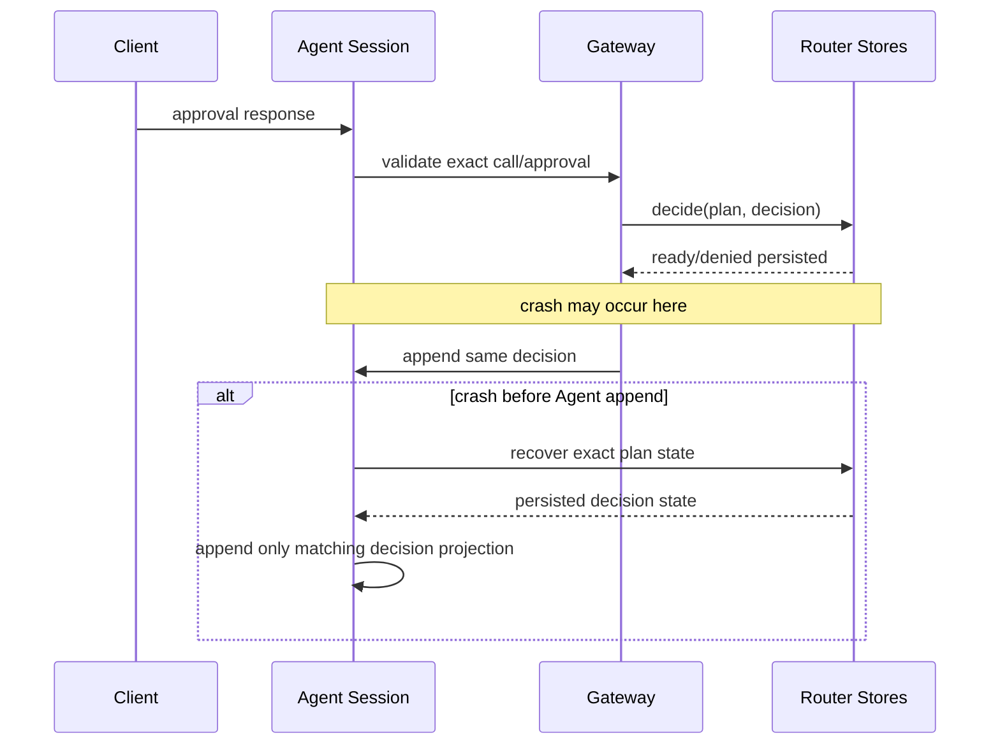

若Session已有决定而Router无Checkpoint，Gateway可补写同一决定；若内容不同则稳定`approval_conflict`并停止执行。

## 9. Patch、Diff与Delivery设计

### 9.1 公共输入

复用`PatchBatchProposal`语义：最多受现有合同限制的新增、修改和删除成员；路径是Workspace逻辑相对路径；正文有单文件及总字节
预算；不允许保护目录、链接、设备、目录目标或模式超集。模型不能指定事务ID、源摘要、租约、临时名或Artifact身份。

### 9.2 规划与审查

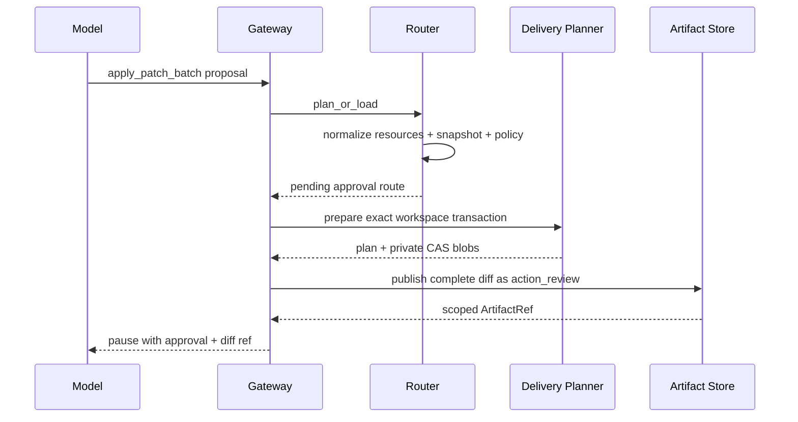

Delivery Planner必须使用与Router一致的Platform和逻辑路径集合。事务`transaction_id=plan_id`，`request_id`由Plan Fingerprint派生；
保存前校验Delivery Source Snapshot与Router Workspace Snapshot对相同资源的观察一致。事务计划和Artifact发布都采用查询优先，避免
崩溃后产生不同计划或重复Artifact。

### 9.3 执行

```text
reload route + approval + transaction
verify plan/transaction/diff fingerprints
router verifies current workspace snapshot and exact approval
acquire workspace fencing lease
publish(transaction_id, workspace, lease)
release lease
map published -> succeeded
map diverged -> failed(delivery_source_changed)
map interrupted/unknown -> unknown
return bounded summary + artifact sha
```

写入顺序由规范路径排序固定。任一成员提交前重新观察`before`版本；临时文件0600写入、fsync、模式设置、原子替换和父目录同步沿用
Delivery实现。成功后不自动Git Commit；0.9.1e验收用`git status/diff`只读工具证明效果，Commit/Push仍需独立Trusted Action。

### 9.4 Reconcile

- 全部成员为`after`：`succeeded`；
- 全部为`before`且事务从未进入发布：`failed`或保持可安全再提交的`ready`仅由原执行状态决定，Agent不得自行重跑；
- `after`前缀、`before`后缀且Cursor匹配：保留`unknown`或由Delivery继续受控发布的行为必须在本切片明确选择；默认只报告
  `manual_intervention`，不在Reconcile中继续写；
- 混合、第三状态或顺序不一致：`manual_intervention`；
- Reconcile只观察和读账本，不能创建新的事务或写文件。

## 10. Process与Sandbox设计

### 10.1 模型输入

```text
RunProfileInput
  profile: configured stable id
  selectors: tuple[str, ...] <= 32
```

Selector必须通过Profile声明的严格模式，不能包含NUL、控制字符、Shell操作符、绝对宿主路径或`..`逻辑路径。它作为独立argv元素
追加，永远不经Shell解释。

### 10.2 能力探测与广告

每个Profile启动前验证：

1. Action Config自身摘要和安全文件身份；
2. Container Engine绝对可执行文件身份、Owner和能力协议；
3. 镜像使用不可变Digest且本地/远端解析结果一致；
4. `network=none`或声明的受管网络能力存在；
5. Process Tree、取消、超时、输出捕获和清理能力通过；
6. Workspace挂载模式与Profile权限一致；测试Profile默认只读，确需写测试缓存时使用受控临时目录，不扩大Workspace写授权；
7. Secret引用能解析到声明版本，值不进入Plan。

任一失败，整个Profile不广告；其他独立Profile可继续进入目录。

### 10.3 执行与输出

Router Plan内部参数是由宿主Profile展开的完整`ContainerExecutionSpec`，公共Schema仍只含Profile/Selector。Executor使用
`ContainerCommandBuilder`复核Plan Intent等于持久Spec，再由`ContainerProcessRuntime`执行。stdout/stderr先经Secret Redactor，
有界摘要进入Tool Result，完整已清洗输出事务发布Artifact。

### 10.4 取消、超时和恢复

- 取消传播到Supervisor/Container Owner，完成终止树和回执核对后才可返回`cancelled`；
- 无法证明容器/进程已终止时返回`unknown`；
- Deadline使用原Turn持久墙钟剩余值与Profile上限的较小者；重启不刷新；
- 重启先查询Process Ledger和Container Owner，不重启命令；
- 已退出但返回丢失时从终止记录、输出摘要和Artifact收据恢复`succeeded/failed`；
- Owner丢失且无法证明外部进程状态时`manual_intervention`。

## 11. Artifact设计

### 11.1 默认Owner

`SQLiteArtifactStore`位于私有Product State Root的独立目录，生命周期包围Tools、Gateway、Agent和Protocol Service。Server向
`CodingToolRuntime`传入Store，向Agent传入Store，向`AgentApplicationService`传入`ScopedProtocolArtifactReader`。

### 11.2 新用途

新增严格purpose：

| purpose | 生产者 | 内容 | 读取作用域 |
|---|---|---|---|
| `action_review` | Trusted Action Review Provider | 规范多文件Diff JSONL | exact thread/turn/call |
| `action_output` | Trusted Action Executor | 清洗后的完整结构化输出 | exact thread/turn/call |

旧`batch_plan/batch_effect/process_output/tool_result`保持可读，不迁移。Artifact Store必须校验purpose枚举、记录数、字节、SHA、完整性、
到期时间和作用域。

### 11.3 数据流

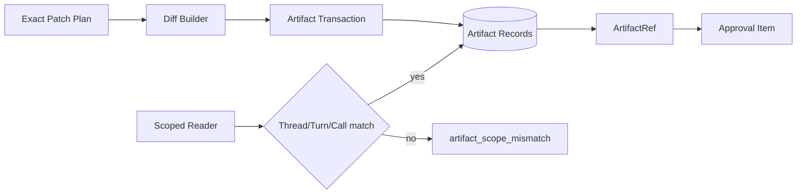

## 12. 正常产品纵向时序

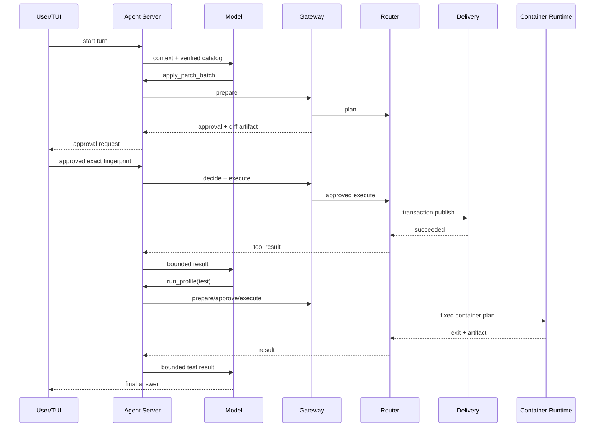

每个高风险调用都独立计划和审批。Patch批准不能授权Process，Process Profile批准不能授权其他Selector或后续调用。

## 13. 失败、恢复、并发与幂等

### 13.1 状态映射

| Router状态 | Agent Turn状态 | Tool Result | 是否可执行 |
|---|---|---|---|
| `denied` | `EXECUTING_TOOLS` | failed/approval_rejected | 否 |
| `pending_approval` | `WAITING_APPROVAL` | 无 | 否 |
| `ready` | `EXECUTING_TOOLS` | 无 | 仅Router claim一次 |
| `running` | `WAITING_ACTION`或执行中 | 无 | 不允许第二owner |
| `unknown` | `WAITING_ACTION` | unknown待Reconcile | 禁止execute |
| `reconciling` | `WAITING_ACTION` | 无 | 仅Reconcile owner |
| `succeeded` | `EXECUTING_TOOLS` | succeeded | 否 |
| `failed` | `EXECUTING_TOOLS` | failed | 否 |
| `manual_intervention` | `EXECUTING_TOOLS`后Turn失败/暂停 | unknown + action id | 否 |

### 13.2 崩溃窗口

| 窗口 | 权威事实 | 恢复动作 | 禁止动作 |
|---|---|---|---|
| Execution Plan已写、Route未写 | Execution Plan | `plan_or_load`重建精确Route | 用新Snapshot覆盖 |
| Route已写、审批Item未写 | Route pending | Gateway重建同一Review并追加审批Item | 新Plan |
| Diff已写、审批Item未写 | Artifact收据+Route | 查询同Scope/purpose/plan摘要后复用 | 重复发布不同Artifact |
| Router已记批准、Session未记 | Router Checkpoint | 追加同一Session决定投影 | 询问并允许相反决定 |
| Session已记决定、Router未记 | Session决定+精确Plan | 补写同一Router决定 | 内容不同仍执行 |
| ready→running后崩溃 | Router running | 启动恢复为unknown并Reconcile | execute重试 |
| Delivery部分写 | Delivery Ledger/Workspace事实 | 只观察并结算 | 无账本继续写 |
| Process结束回包丢失 | Process/Artifact Ledger | 读取终止事实并结算 | 重启Profile |
| Agent Tool Result未写 | Router终态 | 投影并追加一次Tool Result | 再执行副作用 |

### 13.3 并发

- 同一Turn仍由现有Agent调度保证非只读Tool串行；
- Router Audit Store CAS保证同Plan只有一个`ready -> running`；
- Workspace Lease保证同Workspace跨进程发布互斥并使用Fencing Token；
- Process Owner ID和Container Name由Plan ID确定，冲突时查询事实而不是覆盖；
- Artifact事务以作用域+purpose+source fingerprint幂等；
- Product启动恢复先于开放stdio，避免新调用与旧`running`计划竞争。

### 13.4 取消与Deadline

Gateway每个外部等待点检查Agent `CancelToken`。等待审批期间取消只取消Turn，不把未批准Plan变为执行；可在审计中保持
`pending_approval`并由恢复标记废弃，或显式拒绝，最终实现必须固定一种可查询终态。执行期间取消由Router处理，写入类返回未知后
仍必须Reconcile。所有恢复使用原Turn绝对截止时间，不因进程重启刷新预算。

## 14. 安全、隐私与可观测性

### 14.1 信任边界

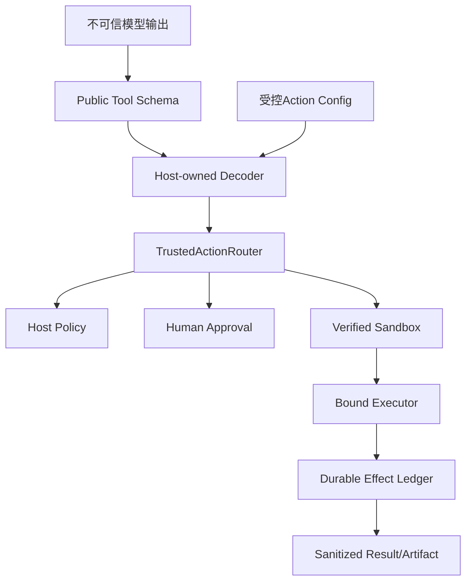

模型输入不能选择Executor、Sandbox、网络、Secret、宿主路径、事务ID或恢复策略。Hook/Skill/MCP即使能建议Action，也不能覆盖宿主
Policy或能力省略。

### 14.2 Secret和正文

- Action Config只保存Secret引用；
- Router继续拒绝敏感键路径；
- Secret值只在执行前由版本化Provider解析到可清零缓冲，不进入Plan；
- stdout/stderr、异常、Diff和Artifact写入前执行Canary扫描和Redaction；
- 审计只存摘要与稳定代码；
- 日志禁止绝对Workspace路径、文件正文、argv、环境值和Provider响应正文。

### 14.3 可观测信号

| 信号 | 类型 | 标签/字段 | 基数约束 |
|---|---|---|---|
| `product.action.capability` | startup event | capability_id/status/reason/platform | 固定目录 |
| `trusted_action.plan` | span/event | source/tool/effect/risk/policy decision | 不含plan id标签；ID仅trace字段 |
| `trusted_action.approval_wait` | histogram | presentation/outcome | 固定枚举 |
| `trusted_action.execute` | histogram/counter | executor_id/outcome | 固定注册表 |
| `trusted_action.reconcile` | counter | conclusion/error_code | 稳定白名单 |
| `workspace.transaction` | counter | terminal state/member bucket | 路径不作标签 |
| `process.profile` | histogram | profile_id/exit class | Profile数量受配置上限 |
| `artifact.publish` | counter/histogram | purpose/size bucket/outcome | 不含artifact id |

Observer失败不得改变Policy、执行或终态；审计Store失败必须失败关闭，因为它是权威事实而非可选Telemetry。

## 15. 核心业务伪代码

### 15.1 产品构造

```text
load and diagnose Product Config v2
load optional Product Action Config v1
open private state root
initialize session/protocol stores
open artifact, execution-plan, action-audit, delivery, lease, process stores
probe platform and executor capabilities
catalog = build verified definitions and descriptors from same evidence
assert catalog consistency
router.recover_interrupted()
reconcile all active product-owned plans before accepting protocol
enter tools(artifacts), gateway(catalog/router), agent(gateway), scoped artifact reader
activate exact config snapshot
open stdio protocol
close owners in reverse order
```

### 15.2 Agent调用

```text
if tool belongs to trusted_action_gateway:
    validate descriptor version/fingerprint/scope
    prepared = gateway.prepare(thread, turn, call, token)
    if prepared requires approval:
        append approval item + WAITING_APPROVAL atomically in Session
        stop turn driver
    outcome = gateway.execute_or_observe(prepared)
    append terminal Tool Result
else:
    keep existing read-only/legacy-compatible path
```

### 15.3 审批响应

```text
reload thread + active turn + approval + call
validate client fingerprint and exact ownership
gateway.verify_plan_binding(approval)
router.decide(plan_id, mapped decision)
append same decision to approval item
if rejected: append failed result and resume
if approved: execute only through gateway/router
```

### 15.4 恢复

```text
on product startup:
    changed = router.recover_interrupted()
    for plan in changed + product_active_unknown_plans:
        router.reconcile(plan)

on Agent turn resume:
    for unfinished trusted action call:
        route = gateway.status(plan_id)
        validate persisted approval binding
        if route pending: remain waiting
        if route ready: execute only if decision persisted and owner claimed by this resume
        if route unknown: reconcile, never execute
        if route terminal: append exactly one result from route/ledger
```

## 16. 实施切片

| 顺序 | 子切片 | 代码/数据改动 | 行为/契约 | 测试 | 可独立回滚 |
|---:|---|---|---|---|---|
| 1 | 0.9.1e1 Artifact与Catalog地基 | 默认Artifact Owner、Capability合同、同源Catalog、Router幂等规划 | 无高风险Tool默认执行；建立可证明目录 | 合同、Store、集合属性、产品只读回归 | [CI 34739842959](https://github.com/carrie1988/Harnessix/actions/runs/34739842959)验收关闭 |
| 2 | 0.9.1e2 Agent Gateway | Event v19、通用审批/效果、Gateway端口、Projection兼容、恢复映射 | Router成为批准权威 | Reducer、Session升级、重放、崩溃窗口、SDK | 是；关闭Gateway目录 |
| 3 | 0.9.1e3 Patch/Delivery | Patch定义、Review Artifact、事务Executor/Reconcile、POSIX广告 | 默认产品真实多文件写入 | 新增/改/删、Diff、漂移、Lease、部分效果、SDK/TUI | 是；停止新Patch目录 |
| 4 | 0.9.1e4 Process/Sandbox | Action Config、Profile Probe、Container Executor/Reconcile、输出Artifact | 有配置且能力通过才广告 | 配置攻击、固定镜像、非零/取消/超时/崩溃/输出 | 是；省略Profile |
| 5 | 0.9.1e5 产品关闭 | Server Builder/Owner、Preflight/Doctor、启动恢复、运维/威胁/CI | 完整产品纵向链与功能门 | 三平台、省略语义、真实Container、全量CI | 是；保留账本恢复 |

每个子切片必须遵循“源码研究→架构决策→领域契约→最小正式实现→失败与恢复测试→真实场景验证→文档同步”。不得在
e1/e2未关闭时直接向Server添加Patch或Process构造参数。

## 17. 源码与测试映射

### 17.1 当前可复用源码

| 设计点 | 当前源码 | 关键符号 | 当前测试 |
|---|---|---|---|
| 统一路由 | [`router.py`](../../src/harnessix/trusted_actions/router.py) | `TrustedActionRouter` | [`test_router.py`](../../tests/trusted_actions/test_router.py) |
| 路由持久化 | [`store.py`](../../src/harnessix/trusted_actions/store.py) | `SQLiteActionAuditStore` | [`test_router.py`](../../tests/trusted_actions/test_router.py) |
| Execution Plan | [`execution/store.py`](../../src/harnessix/execution/store.py) | `SQLiteExecutionPlanStore` | [`tests/execution`](../../tests/execution/) |
| Agent审批 | [`agent/approvals.py`](../../src/harnessix/agent/approvals.py) | `approval_matches` | [`tests/agent`](../../tests/agent/) |
| Artifact | [`artifacts/sqlite.py`](../../src/harnessix/artifacts/sqlite.py) | `SQLiteArtifactStore` | [`tests/artifacts`](../../tests/artifacts/) |
| 事务规划 | [`delivery/planner.py`](../../src/harnessix/delivery/planner.py) | `prepare_workspace_transaction` | [`test_planner.py`](../../tests/delivery/test_planner.py) |
| 事务执行/恢复 | [`delivery/filesystem.py`](../../src/harnessix/delivery/filesystem.py) | `WorkspaceTransactionRuntime` | [`test_filesystem.py`](../../tests/delivery/test_filesystem.py) |
| Container执行 | [`sandbox/process_runtime.py`](../../src/harnessix/sandbox/process_runtime.py) | `ContainerProcessRuntime` | [`test_container_sandbox.py`](../../tests/integration/test_container_sandbox.py) |
| 产品入口 | [`product_config/server.py`](../../src/harnessix/product_config/server.py) | `run_product_stdio` | [`test_server_and_cli.py`](../../tests/product_config/test_server_and_cli.py) |
| 公共投影 | [`protocol/projection.py`](../../src/harnessix/protocol/projection.py) | `_approval`、`project_item` | [`test_projection.py`](../../tests/protocol/test_projection.py) |

### 17.2 计划新增/修改路径

| 变更点 | 计划源码 | 关键符号 | 计划测试 |
|---|---|---|---|
| 能力合同 | `product_config/action_contracts.py` | `ProductActionConfigV1`、`ProductActionCapabilityReport` | `tests/product_config/test_action_contracts.py` |
| 能力组合 | `product_config/action_composition.py` | `ProductActionRuntimeOwner` | `tests/product_config/test_action_composition.py` |
| 同源目录 | `product_config/action_catalog.py` | `ProductActionCatalog` | `tests/product_config/test_action_catalog.py` |
| 路由规划 | `trusted_actions/planning.py`、`trusted_actions/router.py` | `plan_action`、`TrustedActionRouter.plan` | `tests/trusted_actions/test_router.py` |
| Agent Gateway | `trusted_actions/agent_gateway.py` | `RouterBackedAgentActionGateway` | `tests/trusted_actions/test_agent_gateway.py` |
| 内部事件 | `agent/models.py`、Reducers、`agent/approvals.py` | Trusted Action审批/效果与v19 | `tests/agent/test_trusted_action_runtime.py` |
| Patch执行 | `delivery/trusted_action.py` | `WorkspacePatchActionExecutor` | `tests/delivery/test_trusted_action_patch.py` |
| Process执行 | `sandbox/trusted_process_action.py` | `ContainerProfileActionExecutor` | `tests/processes/test_trusted_process_action.py` |
| 产品纵向 | Product Server、Protocol Service、Product UI | 组合与恢复 | `tests/product_config/test_product_actions.py`、`tests/product_ui/test_product_actions.py` |

关闭时必须把“计划路径”更新为实际可点击源码/测试链接和符号；未实现项不得留在已关闭文档中。

## 18. 测试设计

### 18.1 合同与兼容

- Action Config重复键、未知字段、摘要篡改、浮动镜像、无效Profile、重复ID和预算边界；
- Capability Report排序、唯一性、verified/omitted字段互斥和摘要；
- Agent Event v1～v18旧Fixture仍可读，v19新内容不能降版本；
- Protocol v1 Schema逐字不因内部新内容变化；
- SDK旧版本Fixture能解析Patch/Process公共审批；
- Catalog Descriptor与Binding Schema Digest、Version、Fingerprint逐项一致。

### 18.2 规划、审批与幂等

- 同一Call重复prepare返回同一Plan/Artifact；
- 不同Thread/Turn/Call身份不同；
- Execution Plan写后Audit写前崩溃；
- Route写后Session Approval写前崩溃；
- Router决定写后Session决定写前崩溃及反向窗口；
- 相反重放决定、错误Actor、错误Fingerprint、错误Call和跨Thread响应失败；
- Policy allow/deny/require approval三分支；
- Tool/Binding/Capability/Policy版本漂移在执行前失败关闭。

### 18.3 Patch/Delivery

- 新增、修改、删除、模式变化、多文件和Unicode路径；
- 二进制/非法UTF-8、保护路径、链接、目录、超限和无变化；
- 完整Diff与实际before/after一致，模型摘要有界；
- 计划后、Diff后、审批后及逐成员提交前漂移；
- 两实例Workspace Lease竞争、过期Fencing和丢失Owner；
- 写临时文件、fsync、replace、目录sync、Ledger终态前后故障；
- 全before、全after、前缀after、第三状态和顺序混合Reconcile；
- 重启后只产生一个Tool Result，不重复写入。

### 18.4 Process/Sandbox

- 无Action Config、无引擎、错误引擎、镜像不存在、Digest漂移和探测超时均省略；
- 固定Profile正常0、非零退出、信号、超时、用户取消和输出上限；
- Selector注入、Shell字符、绝对路径、`..`、控制字符和超限；
- 网络none、Secret引用、Redaction Canary和环境隔离；
- Container创建前、创建后、进程启动后、退出后和Artifact提交后崩溃；
- Supervisor/Owner丢失、引擎重启和无法证明状态进入manual intervention；
- Host Process Fallback永不触发。

### 18.5 Product/Protocol/TUI

- 默认无Action Config：POSIX广告Patch、不广告Process；Windows两者均不广告；
- 有有效Profile且Container能力通过：广告Process；
- Artifact跨Thread/Turn/Call、过期、SHA篡改和分页Revision越权；
- SDK完成模型→Patch→审批→写入→测试Profile→最终答案；
- TUI展示完整Diff、确认指纹、取消和恢复；
- Server在开放stdio前完成旧Plan恢复；
- 功能门关闭后旧在途Plan仍可Reconcile，新Turn目录不含该能力；
- 0.9.1d Windows只读真实Server/SDK回归保持通过。

## 19. 发布、迁移、回滚与停止条件

### 19.1 发布顺序

1. e1只发布Artifact和Catalog地基，不广告新高风险Tool；
2. e2在测试组合根启用Gateway，生产功能门保持关闭；
3. e3仅POSIX受控测试启用Patch，真实仓库验证后再默认开启；
4. e4只对显式有效Profile与强Container能力广告Process；
5. e5完成Preflight、恢复、SDK/TUI、文档和CI后关闭0.9.1。

### 19.2 数据迁移

- Agent Event Store追加v19，不重写旧事件；
- Execution Plan/Action Audit/Delivery/Artifact沿用现有Schema，若新增索引或purpose不需要迁移Payload；
- Action Config为新文件，无旧数据迁移；
- 旧专用Patch/Process在途Session仍由旧恢复路径结算，新目录不再生成旧计划；
- 同一State Root升级前必须备份，降级前必须排空新Trusted Action在途状态。

### 19.3 回滚

- 关闭Catalog功能门停止新Patch/Process广告；
- 保留Gateway恢复组件以结算旧Plan，不能只删除代码；
- Artifact Store回滚后旧Ref保留在磁盘，旧版本若不能读取则返回稳定不支持，不能删除；
- Action Config可忽略但不自动修改；
- Product Config v2和只读Tool链不受影响；
- Windows始终保持0.9.1d已验证只读路径。

### 19.4 停止条件

出现以下任一情况不得继续灰度或关闭0.9.1e：

- 广告Tool没有匹配Router定义/Executor/Reconcile；
- Agent决定可绕过Router Checkpoint或反向覆盖Router拒绝；
- Diff与最终事务Plan不一致；
- 写入`unknown`后能够再次`execute`；
- Windows普通目录使用字符串Path或POSIX API执行写入；
- Process接受任意Shell/程序/环境，或Container失败后回退Host；
- Secret Canary出现在Plan、Audit、Artifact、Tool Result、日志或协议；
- Artifact能跨Scope读取；
- 功能门回滚删除或遗弃在途事实；
- 0.9.1d只读链、旧Session或Protocol v1兼容回退；
- 全量、真实Container、三平台或文档门禁失败。

## 20. 风险登记

| 风险 | 控制 | 剩余归属 |
|---|---|---|
| Session与Router双Store传播窗口 | 确定性ID、Router权威、查询优先、故障注入 | 0.9.3长期Soak |
| Router与Delivery Store非原子 | plan/transaction同ID、查询优先、双向摘要、Reconcile | 保留Saga边界 |
| POSIX/Windows写能力不对称 | 能力省略、平台报告、Windows不降级 | 后续Windows Writer专项/0.9.5 |
| Container冷启动与镜像不可用 | 启动探测、Profile级省略、无Host Fallback | 0.9.3性能、0.9.5安装 |
| Artifact和账本增长 | 上限、TTL、状态指标 | 0.9.3容量治理 |
| 通用错误可能泄漏内部信息 | 0.9.1e只用稳定映射与Canary，完整异常净化专项 | 0.9.4 |
| Product Server Owner过多 | 单独Builder/Owner，逆序关闭和失败注入 | 本切片关闭 |
| 模型因Tool省略降低任务成功率 | 明确目录和系统能力摘要，不弱化执行 | 0.9.2 Eval |

## 21. 文档同步矩阵

实现关闭时必须更新：

- [总体架构](../architecture.md)与[路线图](../roadmap.md)；
- [Agent](../modules/agent.md)、[Trusted Actions](../modules/trusted-actions.md)、[Artifacts](../modules/artifacts.md)、
  [Patches](../modules/patches.md)、[Processes](../modules/processes.md)、[Delivery](../modules/delivery.md)、
  [Sandbox](../modules/sandbox.md)、[Product Config](../modules/product-config.md)、[Product UI](../modules/product-ui.md)、
  [Protocol](../modules/protocol.md)现行模块设计；
- [部署](../deployment.md)、[配置](../operations/configuration.md)、[诊断](../operations/diagnostics.md)、
  [平台](../operations/platforms.md)、[安装](../operations/installation.md)和[威胁模型](../threat-model.md)；
- [测试与Eval](../testing-and-evals.md)、[验证证据索引](../validation/README.md)和[文档追踪矩阵](../governance/documentation-traceability.md)；
- README、Schema产物、示例和CLI帮助。

## 22. 实现偏差与最终结论

### 22.1 0.9.1e1实际交付边界

0.9.1e1只建立Artifact与可信目录地基，不向默认产品注册Patch或Process。实际代码形成三条独立主链：

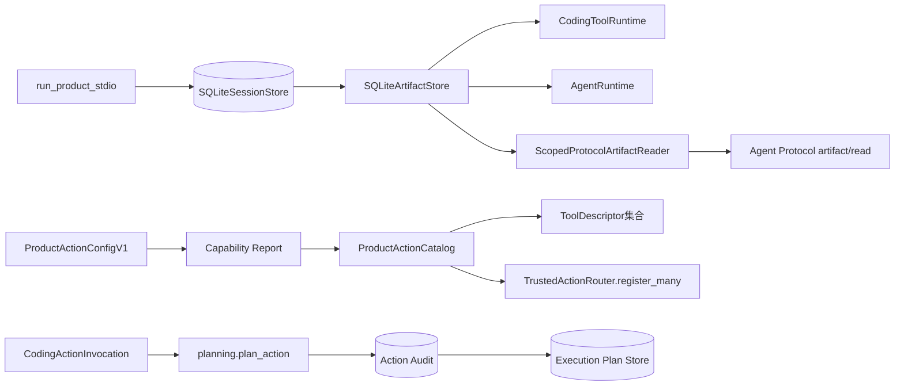

第一条主链使现有只读工具产生的大结果在正式产品中能够原子发布到Session数据库，并由公共协议按Thread、Turn、Call、
Workspace Scope和Artifact摘要重新授权读取。第二条主链冻结后续Patch/Process能力的配置、探测和目录集合合同。第三条主链
关闭同一Invocation在“Action Audit已提交、Execution Plan尚未提交”窗口中重复捕获Workspace的问题。

### 22.2 实际模块、类与接口

| 源码 | 关键符号 | 当前职责 | 失败边界 |
|---|---|---|---|
| [`action_contracts.py`](../../src/harnessix/product_config/action_contracts.py) | `ProductProcessProfile` | 固定Container Engine、不可变镜像、程序、argv、网络及资源预算 | 相对Engine、浮动Tag、非`none`网络、重复Secret和摘要漂移由严格合同拒绝 |
| 同上 | `ProductActionConfigV1` | 独立于Product Config v2保存Patch功能门和有序Profile | Profile乱序、重复或配置摘要漂移拒绝 |
| 同上 | `ProductActionCapabilityEvidence` | 表达一次`verified/omitted`能力探测及十分钟内时效 | `verified`缺证据、`omitted`携带绑定、非法TTL和证据摘要漂移拒绝 |
| 同上 | `ProductActionCapabilityReport` | 绑定Action Config摘要并稳定排序能力事实 | 能力乱序、重复和报告摘要漂移拒绝 |
| [`action_catalog.py`](../../src/harnessix/product_config/action_catalog.py) | `ProductActionCatalog` | 从同一个Binding、Schema、描述和Evidence生成Descriptor并批量安装Router | 报告/条目、Schema、Fingerprint、命名空间或过期证据不一致时安装前失败 |
| [`planning.py`](../../src/harnessix/trusted_actions/planning.py) | `plan_action` | 参数规范化、敏感字段拒绝、资源/Policy/Snapshot冻结、Route双Store持久化 | Invocation复用冲突、合同漂移、非法参数和Store故障使用稳定错误 |
| [`router.py`](../../src/harnessix/trusted_actions/router.py) | `register_many` | 全量验证定义与冲突后，以单次字典发布替换注册表 | 任一Schema或Key冲突不留下部分产品目录 |
| [`server.py`](../../src/harnessix/product_config/server.py) | `run_product_stdio` | 创建一个Session绑定Artifact Store并注入Tool、Agent与Scoped Reader | 仍在全部Runtime进入生命周期后才激活配置和开放stdio |

`ProductActionCatalog`位于`product_config`而不是原计划的`trusted_actions/catalog.py`。原因是目录同时依赖产品能力报告和
通用Router；若放入`trusted_actions`会形成`trusted_actions -> product_config`反向依赖，违反第5.3节。该调整不改变领域
职责：通用Router不知道产品配置，产品组合层单向消费通用Action能力。

### 22.3 关键字段与不变量

| 合同 | 字段 | 来源 | 不变量/用途 |
|---|---|---|---|
| `ProductProcessProfile` | `container_engine` | 宿主Action配置 | 必须是绝对路径；e4还要探测对象身份与可执行性 |
| 同上 | `image` | 宿主Action配置 | 仅接受`name@sha256:<64 hex>`，不接受Tag |
| 同上 | `arguments` | 宿主Action配置 | 有序固定tuple；单项不超过4096 UTF-8字节且禁止NUL/换行 |
| 同上 | `network_mode` | 宿主Action配置 | v1固定为`none`，无Host降级 |
| 同上 | `secret_refs` | 宿主Action配置 | 按`name/version`排序唯一，只保存引用不保存值 |
| `ProductActionCapabilityEvidence` | `status` | 启动探测 | 只有`verified`可以进入Catalog；`omitted`只形成诚实诊断 |
| 同上 | `binding_digest` | `TrustedToolBinding` | 必须与目录Entry的精确Binding相等 |
| 同上 | `executor_evidence_digest` | 能力探测器 | 证明Executor/Profile/Sandbox组合；Catalog不自行执行探测 |
| 同上 | `probed_at/expires_at` | 启动探测 | 时间必须递增且窗口不超过600秒；过期前才能安装 |
| `ProductActionCapabilityReport` | `config_sha256/created_at` | Action Config/探测时钟 | 把广告/省略结果绑定到精确配置版本；报告创建时间必须落在每项证据的有效区间内 |
| `ProductActionCatalogEntry` | `description/definition/evidence` | 产品组合Builder | Descriptor Fingerprint、Binding、Schema与Evidence必须形成一条摘要链 |
| `CodingActionInvocation` | `invocation_id` | Gateway确定性身份 | 同一ID只能绑定一份规范化Invocation和Binding |

四份新增JSON Schema由[`generate_specs.py`](../../scripts/generate_specs.py)确定性生成：

- [`product-action-config-v1.schema.json`](../../spec/product-action-config-v1.schema.json)；
- [`product-process-profile-v1.schema.json`](../../spec/product-process-profile-v1.schema.json)；
- [`product-action-capability-v1.schema.json`](../../spec/product-action-capability-v1.schema.json)；
- [`product-action-capability-report-v1.schema.json`](../../spec/product-action-capability-report-v1.schema.json)。

### 22.4 Catalog构造与安装流程

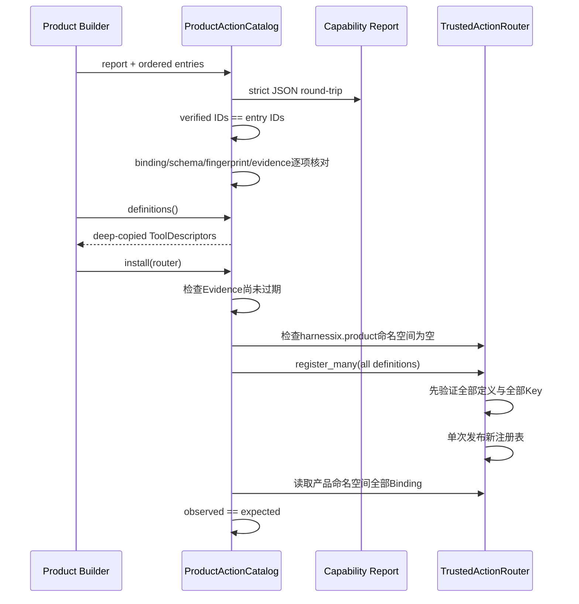

安装不是“先广告、调用时再发现不可执行”。Descriptor只有在Catalog构造成功后可得；产品命名空间已有任意定义时安装失败，
避免额外Binding被集合过滤掩盖。`register_many`先完成全部Schema摘要和重复Key检查，再替换内存注册表，因此第二个定义冲突不会
留下第一个定义的半安装状态。

### 22.5 幂等规划与跨Store恢复

规划使用Action Audit作为可恢复的首个持久事实，因为其Route正文已经完整包含`ExecutionPlanV2`。写入顺序与恢复如下：

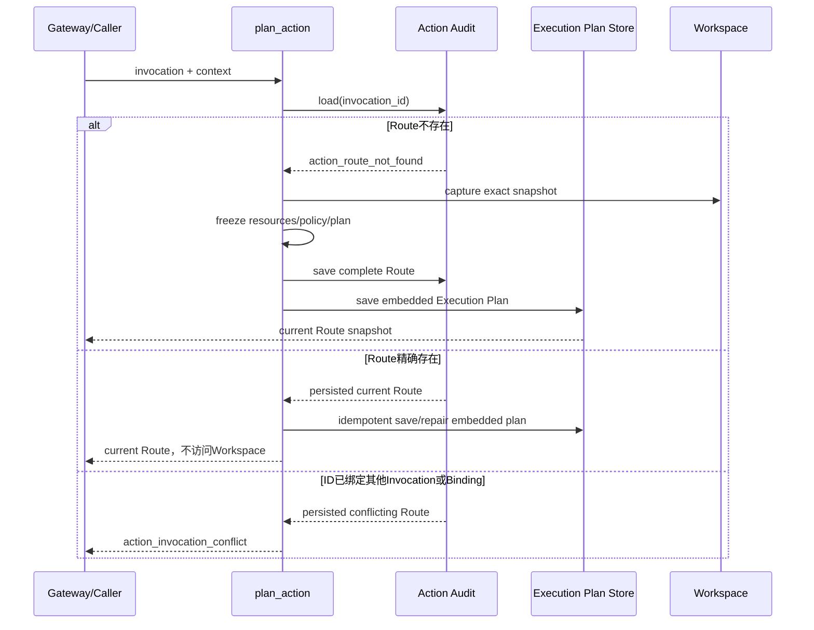

若进程在Audit提交后、Execution Store提交前退出，重试同一规范调用会从Audit读取原Route并补齐Execution Plan。它不会重新运行
Resolver、重新捕获Workspace、重新决策Policy或制造不同Snapshot。若调用已执行到终态，规划重试返回当前终态而不是旧的初始
状态。Execution Store仍以相同Plan ID、Fingerprint和正文提供自身冲突检查。

### 22.6 默认Artifact所有权与数据流

[`run_product_stdio`](../../src/harnessix/product_config/server.py)在Session初始化后创建唯一`SQLiteArtifactStore`，将同一个对象注入
`CodingToolRuntime`和`AgentRuntime`，并用它构造`ScopedProtocolArtifactReader`。因此Tool捕获、Session事务发布、模型历史验证和
协议分页读取共享同一Owner与同一SQLite事务边界：

```mermaid
flowchart TD
    Tool[只读Tool完整结果] --> Capture[ArtifactToolResult]
    Capture --> Store[(agent_artifacts + Session Events)]
    Store --> Ref[有界ArtifactRef进入Tool Result]
    Ref --> Model[模型只看预览与引用]
    Ref --> Client[SDK/TUI请求artifact/read]
    Client --> Reader[ScopedProtocolArtifactReader]
    Reader --> Scope{Thread/Turn/Call/Workspace/Hash有效?}
    Scope -->|是| Page[有界分页正文]
    Scope -->|否| Reject[稳定拒绝]
```

该变更不扩大Artifact权限，不增加新协议形状；它只让Server现有的条件能力在默认产品组合中真实满足。初始化响应现在将
`artifactPages=true`并包含`artifact/read`。EOF启动仍不产生模型请求，产品配置激活顺序保持不变。

### 22.7 失败语义与恢复矩阵

| 故障 | 稳定结果 | 是否产生部分可见能力 | 恢复/处置 |
|---|---|---:|---|
| Process Profile相对Engine或浮动镜像 | Pydantic严格校验失败 | 否 | 修复配置后重建 |
| Capability `verified`缺少任一摘要 | 能力证据不完整 | 否 | 探测器不得构造Verified |
| Capability `omitted`携带Binding | 能力证据不完整 | 否 | 保持省略且删除可执行摘要 |
| 任一Verified或Omitted Evidence过期、报告来自未来 | `product_action_capability_expired` | 否 | 重新探测并重建完整Report/Catalog |
| Report Verified集合与Entry集合不同 | `product_action_catalog_mismatch` | 否 | 修复组合Builder |
| Descriptor Fingerprint与Binding不同 | `product_action_catalog_mismatch` | 否 | 从同一Descriptor生成Binding |
| Router产品命名空间已被占用 | `product_action_catalog_mismatch` | 否 | 停止启动，禁止覆盖 |
| 批量注册任一Schema/Key冲突 | `trusted_tool_schema_mismatch`或`trusted_tool_duplicate` | 否 | 全集合修复后重试 |
| Invocation ID精确重试 | 返回当前Route | 不新增 | 以Audit内嵌Plan补齐Execution Store |
| Invocation ID绑定不同参数/Binding | `action_invocation_conflict` | 不新增 | 调用方必须使用新确定性身份 |
| Audit提交后Plan Store失败 | 原Route可查询，首次调用失败 | 不重抓Workspace | 精确重试补齐Plan Store |
| Artifact Reader未能构造 | Runtime进入失败，stdio不开放 | 否 | 修复State/Session依赖后重启 |

### 22.8 测试与验证证据

| 测试 | 证明内容 |
|---|---|
| [`test_action_contracts.py`](../../tests/product_config/test_action_contracts.py) | Profile/Config/Evidence/Report严格往返、排序唯一、TTL、Secret引用、固定网络、不可变镜像和摘要防篡改 |
| [`test_action_catalog.py`](../../tests/product_config/test_action_catalog.py) | Report与Entry集合、Descriptor/Binding/Schema/Fingerprint、诚实省略、过期拒绝、命名空间和原子安装 |
| [`test_router.py`](../../tests/trusted_actions/test_router.py) | 当前Route幂等返回、禁止重抓Workspace、跨Store故障修复和Invocation冲突 |
| [`test_server_and_cli.py`](../../tests/product_config/test_server_and_cli.py) | 默认产品真实stdio握手广告`artifact/read`且EOF不触发模型 |
| [`test_schemas.py`](../../tests/product_config/test_schemas.py) | 四份提交Schema与运行时合同逐字节等价 |

本地e1专项与相关回归为52项通过；全仓回归为3500项通过、19项跳过。Ruff、Mypy、合同生成、文档检查和可读性门禁均通过。
实现提交`82e247a8d083f3f8a7d68ee091a43d59096f298d`已由[CI 34739842959](https://github.com/carrie1988/Harnessix/actions/runs/34739842959)完成Linux Python 3.12/3.13、macOS、Windows、PostgreSQL、Container及Documentation全矩阵验收。

### 22.9 安全、兼容与回滚

- Action Config不并入Product Config v2，既有配置Schema、摘要、迁移和CLI保持兼容；
- e1未读取Action Config文件、未探测Container、未注册Patch/Process，不会提前开放高风险能力；
- 新增`product_config -> artifacts/trusted_actions`依赖由产品组合职责和ADR 0080批准，并进入可读性策略精确快照；未新增依赖环；
- Router的外部导入位置保持不变，规划实现下沉到`planning.py`后原有`TrustedActionRouter.plan`仍是稳定门面；
- 回退e1会使默认产品不再广告Artifact分页，但不会删除既有Session中的Artifact正文；旧Ref继续由兼容Reader规则决定可读性；
- 已持久Action Route仍由原Router合同读取；规划顺序回退前必须确认不存在只写入Audit、尚未补齐Execution Store的Route。

### 22.10 当前结论与后续前置

0.9.1e1实现、本地失败/恢复测试、Schema和现行资料同步已完成，并已通过全矩阵CI验收。该子切片不证明Patch、Process或Delivery已进入
默认产品，也不关闭0.9.1e。0.9.1e2开始后必须复用这里冻结的Catalog集合、确定性Invocation和Audit优先
恢复语义；不得重新建立Agent侧第二个执行批准权威。

0.9.1e2～e5完成后还需在本文记录实际事件版本、数据迁移、真实Patch/Container场景、平台证据与最终偏差。只有第3.3节全部
勾选后，本文才能转为`historical`并关闭0.9.1。
