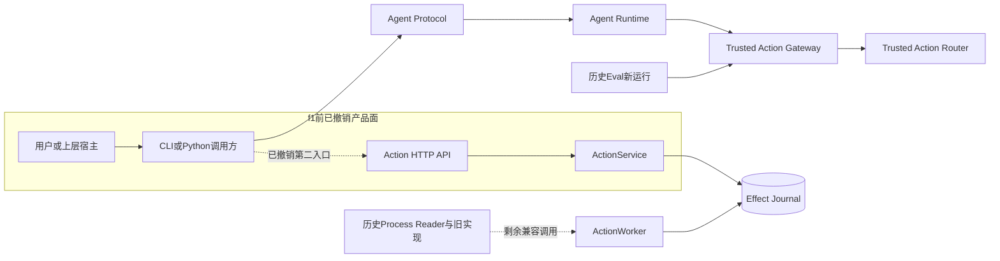
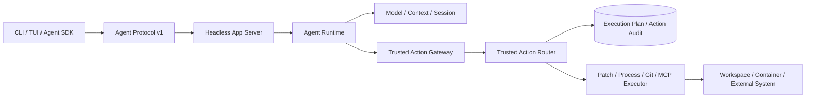
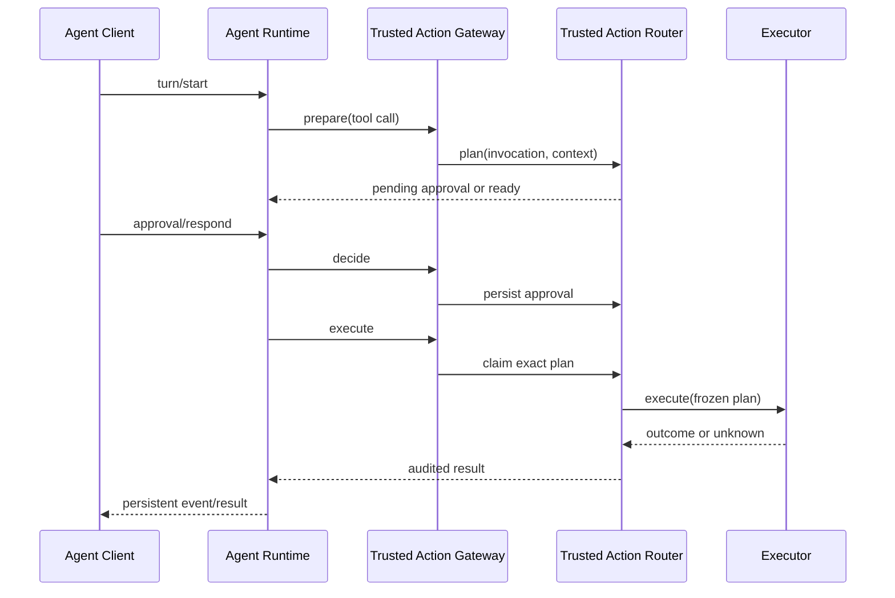
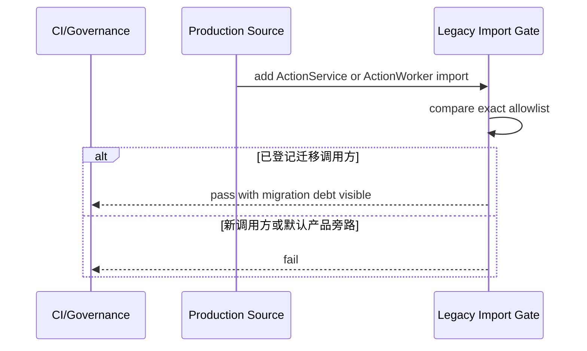
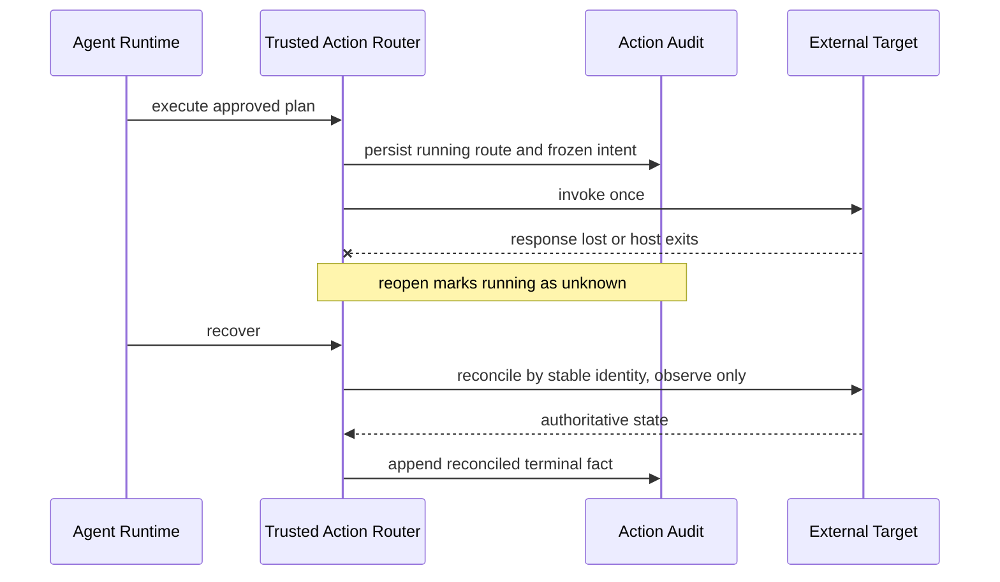

# 0.9.1f单一Coding Agent产品运行时收敛详细设计

## 1. 变更摘要

| 项目 | 内容 |
|---|---|
| 需求 | 删除独立Action HTTP/Worker产品面，把副作用治理收敛为Coding Agent内部Trusted Action Runtime |
| 当前问题 | 顶层CLI、SDK、部署和文档同时暴露Coding Agent与通用Action服务；旧调用方阻止直接删除兼容内核 |
| 目标结果 | 1.0只有Agent Protocol产品入口；高风险能力统一进入Trusted Action Router；旧内核有界迁移后删除 |
| 影响模块 | CLI、SDK、API、Worker、Action Runtime、Process、Delivery、Evals、产品装配和现行文档 |
| 兼容级别 | 0.9阶段有计划地撤销实验性HTTP命令和Client；Agent Protocol v1、Session和Product Config保持兼容 |
| 发布/回滚单元 | f1产品面退役、f2调用方迁移、f3物理删除与数据归档三个独立提交单元 |

## 2. 需求背景与证据

默认`run_product_stdio`直接装配`RouterBackedAgentActionGateway`，并不调用FastAPI、HTTP Client或
`ActionWorker`。f1已经撤销独立链的顶层CLI和公共SDK入口，但兼容源码仍保存自己的Action状态、审批、Lease和结果。
f2/f3必须继续消除生产调用与物理实现，不能把“不可从产品入口到达”误写成“已删除”。

源码核对得到以下迁移事实：

| 事实 | 当前源码 | 影响 |
|---|---|---|
| 默认产品使用Trusted Action | `product_config/server.py::run_product_stdio` | 可以先撤销HTTP入口而不影响默认产品 |
| CLI与公共SDK已经收敛 | `cli.py`、`harnessix/__init__.py`、`sdk/__init__.py` | f1关闭双产品入口，治理测试阻止回归 |
| 固定Container Process已进入产品链 | `product_config/process_action.py`与`product_config/action_runtime.py` | f2a已经由0.9.1e4/e5关闭；历史Process Reader留到f3处理 |
| Git Push已直接使用Trusted Action Route | `delivery/git_push.py::build_git_push_definition` | f2b已移除ActionService/Effect Journal桥，并由CI 35442924441关闭 |
| 历史Eval新运行已移除Worker | `evals/runner.py::run_historical_coding_eval`、`product_config/eval_action.py` | f2c候选使用产品同源Catalog/Gateway/Router、Plan/Audit与Supervisor；待全量与CI关闭 |

## 3. 设计目标、非目标与验收标准

### 3.1 目标

1. 顶层命令不再出现或接受`serve/worker`；
2. Python公共SDK只包含Agent Protocol Client和Transport；
3. 默认产品、README、总体架构、产品章程和现行运维资料只有一条产品主链；
4. 旧Action内核的生产调用方被精确白名单冻结，新增引用在CI失败；
5. Process、Git Push和Eval按顺序迁入Trusted Action，迁移不改变既有`UNKNOWN`和不重放语义；
6. 最终删除旧HTTP、Worker、PostgreSQL Queue、Demo Executor及不再使用的依赖。

### 3.2 非目标

- 不在本变更中增加网络版Agent Protocol；
- 不建设远程Sandbox、多租户调度、团队策略或云控制面；
- 不删除历史Agent Event或改写旧Session；
- 不把Process Owner、Container Runtime或Workspace Lease误当作独立Action Worker删除；
- 不因收敛入口而降低审批、Sandbox、审计、取消、超时和对账要求；
- f1不提前删除仍被既有生产模块使用的`ActionService`和`ActionWorker`。

### 3.3 验收标准

| 标准 | 验证 |
|---|---|
| 单一CLI产品面 | `tests/smoke/test_cli.py`及治理测试检查帮助、拒绝旧命令和导入边界 |
| 单一Python SDK产品面 | 治理测试检查`harnessix`与`harnessix.sdk`导出集合 |
| 旧调用方不扩散 | AST级或文本级依赖白名单测试只允许已登记迁移目标 |
| 默认链无旧服务依赖 | 产品Server测试和依赖测试禁止`product_config`导入旧API/Worker/Runtime |
| 迁移保持失败语义 | Process、Git Push、Eval现有正常与崩溃测试迁移后继续通过 |
| 文档与实现一致 | 文档检查、链接检查、Mermaid渲染及现行声明扫描通过 |

## 4. 收敛前根因与当前剩余链



根因不是单一架构图绘制错误，而是项目演进后没有退役原始产品面：

1. f1前HTTP API和Worker仍由CLI、Dockerfile和Makefile暴露；
2. f1前根包把HTTP Client命名为`HarnessixClient`，Agent Client反而位于子包；
3. 0.5时期的Process/Eval和0.7 Git Push复用了旧Journal，形成真实迁移依赖；
4. 总体文档同时把两个系统标记为当前能力，导致产品边界无法一眼识别；
5. 缺少禁止新增旧内核调用方的自动化门禁。

## 5. 总体架构与变更方案



图中没有面向用户的Action HTTP API和数据库队列。`TrustedActionRouter`是逻辑执行治理内核，可以在当前进程中调用
本地Executor。未来Remote Executor只能作为`Executors`后的受信适配器出现，仍使用相同Plan、Approval和Audit身份。

### 5.1 替代方案

| 方案 | 优点 | 缺点 | 风险 | 结论 |
|---|---|---|---|---|
| 一次删除全部旧代码 | 最快减少文件 | Process/Git/Eval立即失去运行和恢复实现 | 高 | 否决 |
| 永久保留但从图中隐藏 | 不改代码 | 文档失真、依赖继续扩散 | 高 | 否决 |
| 三阶段迁移 | 每阶段可验证、可回滚 | 过渡期存在兼容代码 | 可控 | 采用 |

## 6. 正常、失败与恢复时序

### 6.1 收敛后的正常执行



批准先进入Router，再投影回Session；执行只接受冻结Plan。Client断线不创造第二个入口，恢复仍从Session和Router事实开始。

### 6.2 迁移期旧调用方失败



治理门禁不执行运行时代码，也不把文件名模糊匹配为权限。白名单必须精确到生产文件；删除一个旧引用时同步缩小集合，
不能为了通过测试扩大集合。

### 6.3 非幂等效果迁移期间崩溃



迁移旧Git Push或Process时必须先建立等价持久效果Owner；不能把删除Worker解释为允许异常自动重试。

## 7. 接口设计、数据结构与领域契约

| 契约/结构 | 变更前 | 变更后 | 兼容策略 | 迁移/回滚 |
|---|---|---|---|---|
| CLI命令 | `serve/worker/code/agent/agent-server`并列 | 只公开Coding Agent命令 | 0.9直接撤销旧实验命令 | 回滚旧版本恢复命令，不改数据 |
| 根包导出 | Action合同和HTTP Client | 暂保共享领域类型，不再导出HTTP Client | 显式导入旧模块只用于迁移 | f3删除旧模块 |
| `harnessix.sdk` | Agent Client与Action HTTP Client并列 | 只导出Agent Client/Transport/Error | Agent Protocol v1不变 | 旧HTTP用户固定旧版本 |
| Action HTTP/OpenAPI | 当前可构造 | f1标记兼容，f3删除 | 不进入1.0稳定合同 | 历史Schema随Git版本保留 |
| Agent Session | Trusted与旧专用事件均可读 | 新执行只写Trusted Action事件 | 旧事件继续只读恢复 | 不重写数据库 |
| Effect事实 | 旧Journal或专用Ledger | Action Audit保存Route状态；外部系统或专用Owner保存权威效果事实 | 迁移前逐类证明等价恢复 | 禁止删除未归档旧库 |

## 8. 状态、事务、并发与幂等

- f1不修改旧Action状态机或数据库Schema，只撤销产品可达性并冻结调用方；
- Trusted Action继续使用不可变Plan、一次性Approval和Hash链Audit；
- Session与Router双账本仍按Router决定优先恢复，不增加第三套入口；
- Process和Workspace效果继续由各自Ledger持有真实运行状态，Action Audit只保存摘要和路由结论；
- 非幂等外部写必须保留稳定外部身份和只读Reconcile；
- 任何`running`恢复为`unknown`后不得再次调用`execute`；
- f3删除PostgreSQL Queue前，不迁移数据库内容到Session；归档与产品数据分离。

## 9. 安全、隐私与可观测性

删除HTTP监听后，以下攻击面从1.0产品中移除：请求体Principal伪造、未认证Action查询、开放OpenAPI、跨租户Event读取、
API Body资源消耗和Worker就绪误判。Agent Protocol仍是本地子进程边界，必须继续限制Frame、方法、Workspace和Artifact作用域。

保留的日志、Metric和Trace以Thread、Turn、Plan、Tool和低基数结果关联，不记录参数正文、绝对路径、环境值或Secret。
旧`harnessix.api.*`和`harnessix.worker.*`指标在f3后停止产生，不复用名称表示新Trusted Action信号。

## 10. 核心伪代码

```text
phase_f1_retire_product_surface():
    remove serve and worker from CLI
    remove HTTP clients from public exports
    remove standalone-service examples and deployment defaults
    freeze exact legacy production callers
    assert default product imports only Trusted Action Gateway

phase_f2_migrate_callers():
    for capability in [process, git_push, historical_eval]:
        build trusted definition from host-owned capability evidence
        preserve stable identity and durable effect ledger
        migrate normal, cancel, timeout, crash and reconcile tests
        remove capability from legacy caller allowlist

phase_f3_delete_compatibility_kernel():
    require legacy caller allowlist is empty
    provide old database inspection or archival procedure
    delete HTTP API, Action HTTP SDK, framework adapter and worker queue
    remove unused dependencies, schemas, tests and current documentation
    run full cross-platform, container, documentation and upgrade gates
```

## 11. 实施切片

| 顺序 | 代码/数据改动 | 行为保持或新契约 | 测试 | 可独立回滚 |
|---|---|---|---|---|
| f1 | 删除CLI双入口、公共HTTP SDK导出、旧示例和服务默认部署；旧服务依赖移入`legacy-action` Extra；增加旧引用白名单 | Agent产品行为不变，旧命令停止，基础Wheel不携带旧服务依赖 | CLI、导出、依赖治理、Wheel元数据、产品Server | 是 |
| f2a | 完成固定Container Process Trusted Action及Owner | Process批准/输出/取消/恢复等价 | Process、Gateway、Container、Artifact | 是，功能门关闭新目录 |
| f2b | Git Push Definition与Executor直接注册到Trusted Action Router；删除旧Action投影 | `running → unknown → reconcile`、exact lease与稳定External Action ID不变 | 未批准拒绝、真实bare remote、响应丢失、宿主硬崩溃重开 | 是 |
| f2c | Eval使用产品同源Catalog/Gateway/Router、Plan/Audit、Supervisor与Action Output Artifact | 评分、预算和历史任务证据不变；非零测试退出仍反馈模型；响应丢失不重放 | Evals、Campaign、Gateway、Agent恢复、Process、治理 | 是 |
| f3 | 删除旧API/Worker/SDK/Adapter/Queue和依赖 | Agent Protocol成为唯一公共协议 | 全量、升级、文档、发行物 | 代码可回滚，数据只归档 |

## 12. 源码与测试映射

| 变更点 | 源码文件 | 关键符号 | 测试文件 | 证据 |
|---|---|---|---|---|
| 顶层命令 | [`cli.py`](../../src/harnessix/cli.py) | `_parser`、`main` | [`test_cli.py`](../../tests/smoke/test_cli.py) | 产品命令可见、旧命令拒绝 |
| Agent SDK导出 | [`sdk/__init__.py`](../../src/harnessix/sdk/__init__.py) | `__all__` | [`test_product_runtime_convergence.py`](../../tests/governance/test_product_runtime_convergence.py) | 无HTTP Client公共导出 |
| 默认产品链 | [`server.py`](../../src/harnessix/product_config/server.py) | `run_product_stdio` | [`test_server_and_cli.py`](../../tests/product_config/test_server_and_cli.py) | Gateway装配且无旧服务依赖 |
| 统一Router | [`router.py`](../../src/harnessix/trusted_actions/router.py) | `TrustedActionRouter` | [`test_router.py`](../../tests/trusted_actions/test_router.py) | Plan/Approval/Execute/Reconcile |
| 旧调用方门禁 | 生产源码树 | 精确Import集合 | [`test_product_runtime_convergence.py`](../../tests/governance/test_product_runtime_convergence.py) | 新引用失败、集合缩小可见 |
| 基础依赖边界 | [`pyproject.toml`](../../pyproject.toml)、[`Dockerfile`](../../Dockerfile) | `legacy-action` Extra、Help默认命令 | [`test_product_runtime_convergence.py`](../../tests/governance/test_product_runtime_convergence.py) | FastAPI/Uvicorn/AsyncPG/LangChain Core不进入基础Wheel |
| 固定Process替代链 | [`process_action.py`](../../src/harnessix/product_config/process_action.py) | `ProductProcessActionExecutor` | Process专项测试 | f2a完成后登记具体测试 |
| Git Push迁移 | [`git_push.py`](../../src/harnessix/delivery/git_push.py) | `git_push_descriptor`、`git_push_binding`、`build_git_push_definition`、`GitPushActionExecutor` | [`test_git_push.py`](../../tests/delivery/test_git_push.py) | f2b不再导入旧Runtime；响应丢失和硬崩溃只对账 |
| Eval迁移 | [`runner.py`](../../src/harnessix/evals/runner.py)、[`eval_action.py`](../../src/harnessix/product_config/eval_action.py) | `run_historical_coding_eval`、`build_eval_trusted_action_composition`、`EvalRunTestsActionExecutor` | [`test_runner.py`](../../tests/evals/test_runner.py)、[`test_agent_gateway.py`](../../tests/trusted_actions/test_agent_gateway.py) | 不创建`effects.sqlite`；批准与Router终态响应丢失均不重放Process |

## 13. 风险、部署、兼容与回退

1. f1的最大风险是脚本仍依赖旧命令；0.9尚未承诺稳定CLI，发布说明必须列出撤销项；
2. f2不能同时重写历史事件和执行实现，必须保留旧Reader并只改变新调用；
3. f2任何真实副作用计数超过一次、无法归因的进程或自动重放均立即停止迁移；
4. f3只有在生产调用方白名单为空、旧数据库归档方案通过测试后执行；
5. Windows、POSIX和Container能力不对称时诚实省略Tool，禁止为了目录一致而回退Host Shell；
6. 回滚使用上一版本代码读取原数据；新版本不做不可逆旧库迁移。

## 14. 实现偏差与最终结论

f1的公共面整改已经完成：顶层CLI、根包/SDK导出、Makefile、Docker默认命令、`.env.example`、旧示例、基础依赖、
部署/架构/运维资料和旧调用方治理门禁已同步；专项CLI、SDK、API/Worker兼容、产品Server、仓库策略及Wheel元数据
验证通过。集成工作区中的0.9.1e4候选代码已通过职责拆分消除新增超大符号和既有热点增长；只批准产品组合层到
`processes`、`sandbox`的两条单向依赖，没有放宽复杂度或长度阈值。Ruff、可读性最终报告、文档、Schema、Mypy和
全量Pytest均在本地以退出码0完成。实现提交`142dfa836897f6c13f8168d44ea853b76365e53a`由
[CI 35418034976](https://github.com/carrie1988/Harnessix/actions/runs/35418034976)完成Python 3.12/3.13、macOS、
Windows、PostgreSQL、固定镜像Container和文档Mermaid全矩阵验收，f1据此正式关闭。

f2a依赖0.9.1e4/e5交付的固定Container Process和产品Owner，已经关闭。f2b实现将`git.push`改为直接
`TrustedActionDefinition`：Descriptor以`GitPushIntent`为输入，Binding固定为`external_reconcile`，Resolver冻结Remote URL摘要、
目标Ref和Expected OID，Router的Execution Plan与Action Audit保存批准及运行状态，远端Ref是效果对账权威。执行前仍重绑仓库、
Remote和Local OID；进入`running`后只允许一次`git push --force-with-lease`。响应丢失由Router转为`unknown`；宿主在命令后硬退出时，
重开先把遗留`running`转为`unknown`，随后只执行`ls-remote`对账。响应丢失测试断言Push调用计数为1；独立子进程
在远端更新后执行`os._exit(97)`，父进程重开Store/Router并只走Reconcile路径。

治理门禁已经从旧调用方精确集合中删除`delivery/git_push.py`，并由“子集”收紧为“完全相等”，防止删除引用后留下可被重新占用的
白名单额度。实现Revision `e2d8c24b8a09518dc05a4ce113887800cbe4c9fa`已通过Git Push专项26项、架构治理5项、全仓3565项通过/20项跳过，以及Ruff、Mypy、Schema、可读性、
文档静态门禁和87幅变化文档Mermaid真实渲染。[CI 35442924441](https://github.com/carrie1988/Harnessix/actions/runs/35442924441)随后一次通过Linux Python 3.12/3.13、macOS、Windows、PostgreSQL、固定镜像Container和Documentation七任务全矩阵，f2b据此关闭。本设计继续保持`reviewing`，因为f2c仍待全量与CI关闭且f3尚未开始。

### 14.1 f2c候选实现与本地证据

历史Eval不再装配`ActionService`、`ActionWorker`、`ToolRegistry`或`SQLiteEffectJournal`。`product_config/eval_action.py`为每个Run建立唯一固定`run_tests`定义：公开参数只有受信Profile；Resolver冻结Process、Workspace和Network资源；Execution Plan保存执行绑定与批准，Action Audit保存Route Hash链，`PosixProcessSupervisor`以Plan ID作为Process ID保存Lease和输出，`SQLiteArtifactStore`保存与Router摘要绑定的模型可见结果。

失败语义保持为：测试正常退出但返回码非零时Action成功并确定性投影`passed=false`，允许模型继续修复；启动、超时、取消、输出上限、清理和证据不完整保持失败、UNKNOWN或人工处置。Router已经形成确定终态但Session提交结果前宿主退出时，重开只从原Process输出重建`origin=execution`的Tool Result；实际`unknown → reconcile`才标记`origin=recovery`，避免把原执行结果误当恢复效果或再次启动Process。未完成旧Run存在`effects.sqlite`时返回`eval_runtime_upgrade_required`，不跨账本静默迁移。

本地专项回归覆盖Evals、Campaign、Grader、Process绑定/Supervisor/输出、Trusted Action Gateway、Agent审批/崩溃恢复和治理门禁；测试断言首次Router终态后重开Process Lease仍为1，完整修复流程最终为2，证明首个Process没有重放。治理白名单已删除`evals/runner.py`，从7个精确调用方缩为6个。Mypy、Ruff和专项Pytest均通过；全量、Mermaid真实渲染和CI结果将在关闭提交回填。

每个切片完成后必须回写实际删除范围、测试函数、数据兼容结论和对应提交；在旧生产调用方白名单清零前，不得宣称兼容内核已经删除。
