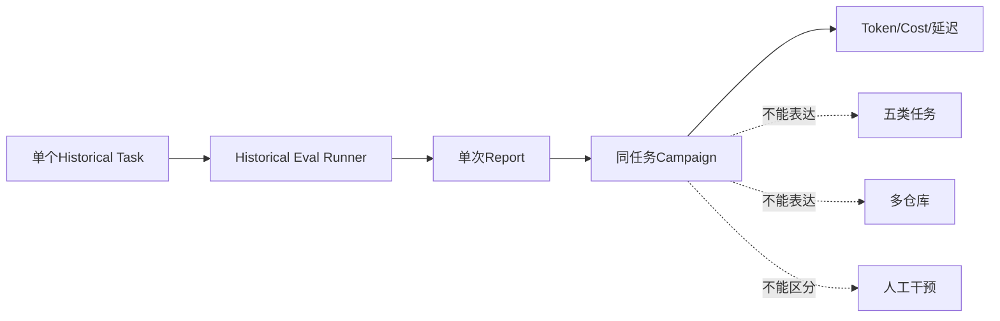
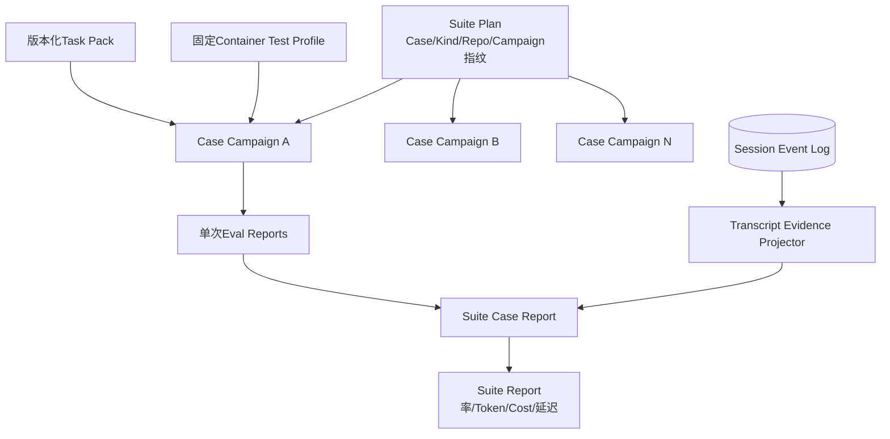
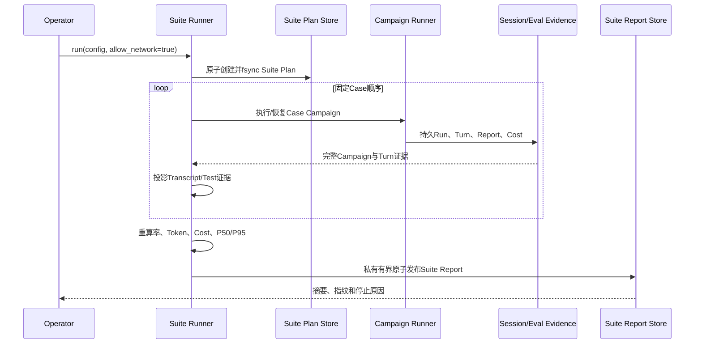
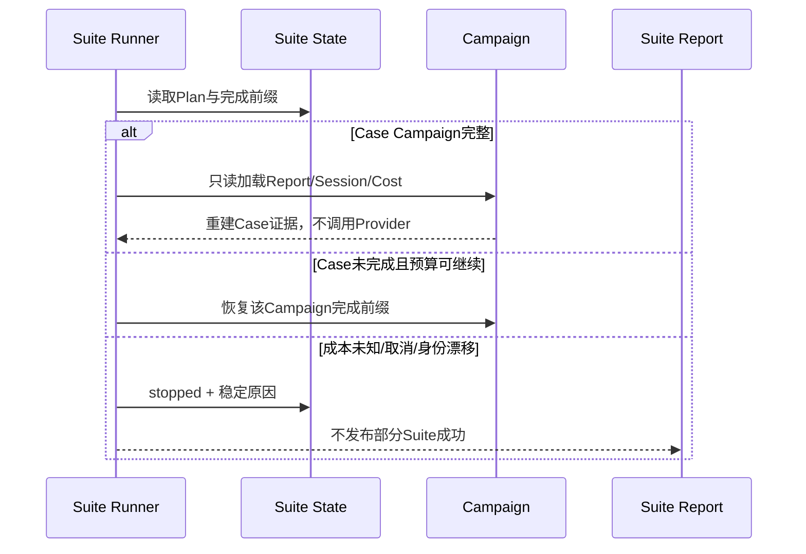
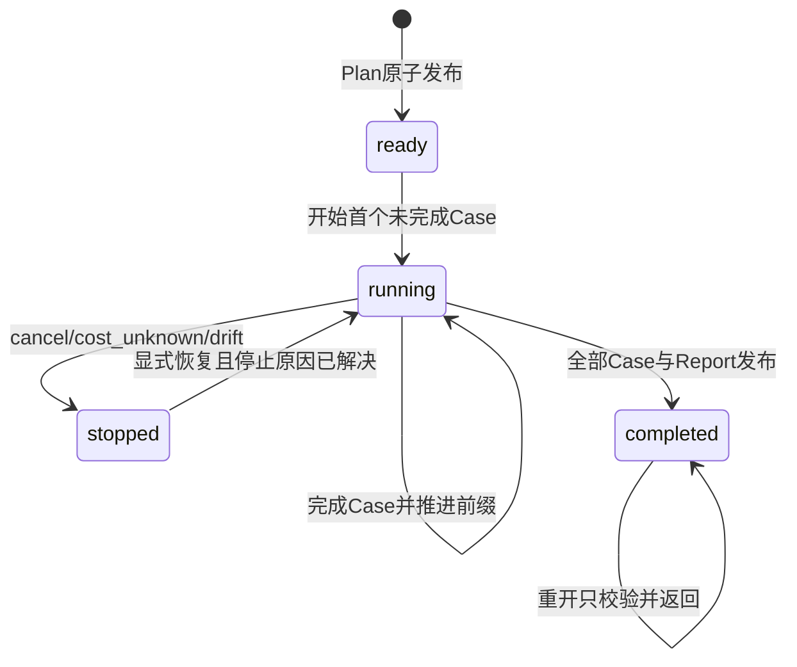

# 0.9.2 Eval Suite与Transcript基线详细设计

## 1. 变更摘要

| 项目 | 内容 |
|---|---|
| 需求 | 五类任务、多仓库质量基线及任务成功、测试、人工干预、Token、Cost、延迟指标 |
| 当前问题 | 仅有单个Harnessix Bug Fix任务；Campaign只能重复同一任务；无Suite/Transcript正式证据 |
| 目标结果 | 可恢复、可重算、低敏感度的多仓库Suite计划、执行状态和报告 |
| 影响模块 | `evals`、Session、Models、固定Process Profile、Sandbox、文档与CI |
| 兼容级别 | 保留现有单次Eval/Campaign v1；新增Suite、Transcript和Task Pack v1 |
| 发布/回滚单元 | 0.9.2a合同；b Task Pack；c Runner；d任务集；e真实基线 |

## 2. 需求背景与证据

现有Campaign已经验证同一任务的独立Run、固定价格、成本未知停止和崩溃恢复，但不能表达任务类型或仓库集合。
现有Grader内部读取Turn Transcript，却只把Tool Call与审批总数写入单次报告。源码证据、参考项目取舍和当前缺口见
[专项研究](../research/eval-suite-and-transcript-baseline.md)。

0.9.2完成不是“新增五个JSON样例”，而是以下事实同时成立：

1. 至少10个不可变Case、三个真实仓库、每类任务至少两个；
2. 每个Case至少两个隔离Trial并保存完整Campaign证据；
3. 任务正确性由固定隐藏检查、Git证据和回答合同判定；
4. Suite能从持久事实重算六类指标且不复制敏感正文；
5. 崩溃、取消、成本未知、证据损坏和部分完成均有稳定恢复/停止语义；
6. 真实执行经过固定Container Profile，不在宿主执行任意仓库脚本；
7. 结果经过本地全量回归、三平台合同CI、真实Container任务和受控Provider验证。

## 3. 设计目标、非目标与验收标准

### 3.1 目标

- 定义五类任务和多仓库Suite合同；
- 从持久Turn派生Transcript摘要及人工干预；
- 复用Campaign作为每个Case的重复试验单元；
- 建立版本化Task Pack、固定检查Profile和安全物化；
- 建立Suite状态、锁、完成前缀和报告发布恢复；
- 形成真实多仓库基线和版本化发布阈值输入。

### 3.2 非目标

- 不在0.9.2实现云端Benchmark服务或多租户调度；
- 不以模型裁判替代确定性检查；
- 不默认上传Transcript或代码；
- 不放开任意Shell、任意镜像或动态网络；
- 不在本切片关闭0.9.3 Soak、0.9.5发行物或0.9.6 Provider认证矩阵。

### 3.3 验收标准

| 领域 | 关闭证据 |
|---|---|
| 数据集 | ≥10 Case、≥3仓库、五类各≥2、固定Revision/Tree/Task Pack摘要 |
| 重复性 | 每Case ≥2 Trial，Run ID唯一，Campaign/Suite计划先行 |
| 正确性 | Baseline缺陷、Behavior、Regression、Git与Review Oracle全部可重算 |
| 指标 | 成功率、测试通过率、人工干预率、Token、完整Cost、P50/P95延迟 |
| 恢复 | Case边界崩溃、Report发布丢失、取消和成本停止不重跑已完成Trial |
| 安全 | 固定Digest Container、禁网默认、资源/输出限制、无正文Suite报告 |
| 平台 | Linux真实执行；macOS/Windows合同和读取链；平台限制明确 |
| 文档 | 研究、ADR、详细设计、模块设计、运维与验证证据同步 |

## 4. 当前实现与根因



根因不是缺少一张汇总表，而是聚合层级缺失：Campaign Plan绑定单个Task，直接允许多任务会让Task Fingerprint、
价格、Run恢复和报告顺序失去单一权威；完整Transcript又不适合作为发布报告。

## 5. 变更后总体架构



### 5.1 职责边界

| 组件 | 职责 | 非职责 |
|---|---|---|
| Suite Plan | 冻结Case、类别、仓库、Campaign和环境 | 不保存凭据或命令 |
| Task Pack | 固定Prompt、允许变更、检查和Profile身份 | 不接收模型动态命令 |
| Campaign | 同任务独立试验、成本和失败分类 | 不聚合跨任务指标 |
| Transcript Projector | 从Turn派生摘要和人工干预计数 | 不保存/上传正文 |
| Suite Runner | 顺序执行Case、恢复完成前缀、发布报告 | 不重跑完整Case，不并发烧钱 |
| Suite Report | 聚合可重算发布指标 | 不替代Session诊断 |

### 5.2 替代方案

| 方案 | 优点 | 缺点 | 结论 |
|---|---|---|---|
| Campaign直接支持多任务 | 文件少 | 单任务不变量被破坏 | 拒绝 |
| SQLite集中Benchmark库 | 查询强 | 在本地基线前过早引入新服务状态 | 暂缓 |
| Suite嵌套完整Campaign报告 | 自包含、可重算 | 报告体积增加 | 采用，8 MiB上限 |
| Suite只保存CSV摘要 | 小 | 无法重算、证据断链 | 拒绝 |

## 6. 正常流程



Suite Plan必须在任何Provider Factory调用前发布。Case按计划顺序执行，首版不并行，避免Provider限流、成本停止和
Workspace资源竞争产生不可比较结果。

## 7. 失败、恢复、取消与超时



| 场景 | 行为 | 恢复 |
|---|---|---|
| Plan写入前崩溃 | 无Provider调用、无状态 | 使用同一配置重试 |
| Plan后首Case前崩溃 | 保留Ready State | 重开后校验配置指纹 |
| Trial完成但Campaign响应丢失 | Campaign从Run State重建 | 不再调用Provider |
| Case完成但Suite State未推进 | 重验Campaign摘要后推进一次 | 不重跑Case |
| Suite Report发布后确认丢失 | 校验Report与Plan摘要后返回 | 不重聚合正文 |
| 成本未知 | stopped，禁止新收费Trial | 人工补齐证据或新Suite |
| Cancel | 当前Agent/Process协作取消；完成前缀保留 | 显式新命令恢复 |
| Task Pack/镜像漂移 | 失败关闭 | 新Suite版本，不覆盖旧证据 |

## 8. 数据结构与领域契约

### 8.1 0.9.2a新增合同

| 合同 | 关键字段 | 不变量 |
|---|---|---|
| `CodingEvalSuitePlan` | `suite_id/version/environment/cases` | 五类、≥2仓库、任务和Campaign唯一 |
| `CodingEvalSuiteCasePlan` | Kind、Task、Repository、Campaign Fingerprint | 固定任务与仓库身份 |
| `CodingEvalTranscriptEvidence` | Run/Turn、SHA、结构计数、干预计数 | 不含正文；计数上界一致 |
| `CodingEvalTrialTestEvidence` | Run、Outcome、检查计数 | 通过与计数一致 |
| `CodingEvalSuiteCaseReport` | 完整Campaign、Transcript、Test | Run顺序和Token交叉绑定 |
| `CodingEvalSuiteSummary` | 三种率、Token、Cost、延迟 | 全部由Case重算 |
| `CodingEvalSuiteReport` | Plan、Case、Summary、完成时间 | 不接受部分Case或摘要漂移 |

三种率均保存分子、分母和四舍五入到基点的整数值。Cost沿用18位定点字符串；不同币种不能合并。

### 8.2 Transcript人工干预定义

| 事件 | 是否计人工干预 |
|---|---|
| `harnessix-eval-runner`自动审批 | 否，单独计自动决定 |
| 其他Actor审批或终态仍未决定的审批 | 是 |
| Question Request | 是；Answer只用于一致性核对，不重复计数 |
| 首条User Message | 否，属于任务输入 |
| 后续User Message/Steering | 是 |
| Trusted Action `manual_intervention` | 是，按Call ID去重 |
| 普通Recovery成功 | 否 |

### 8.3 后续Task Pack v1

Task Pack将冻结仓库Archive、Task、检查Definition、Container Profile摘要和Oracle，不保存Secret。Review Case允许
`test_outcome=not_applicable`，但必须有版本化Review Oracle；其他四类必须有最终检查。

## 9. 状态、事务、并发与幂等



- Suite根目录使用单写者文件锁；
- Plan一经发布不可覆盖，配置漂移返回稳定错误；
- Case完成前缀只能连续增长；
- Report采用临时文件写入、文件`fsync`、原子替换和目录`fsync`；
- 不存在“部分Suite通过”终态；
- Provider、Agent和外部效果不自动重试，恢复只消费既有权威事实。

## 10. 安全、隐私与可观测性

Suite Report禁止Prompt、Assistant正文、Thinking、Tool参数/输出、Diff、绝对路径、环境变量和Provider原始错误。
Transcript SHA覆盖完整Turn的规范JSON，但只公开摘要。原始Session和Artifact按高敏感度存储。Task Pack签名、依赖/SBOM
进入0.9.4；本切片先固定内容摘要、来源Revision和镜像Digest。

低基数Telemetry：Suite ID哈希、版本、Case Kind、状态、失败分类、耗时、Token、Cost完整性和干预布尔值；不得以
Task ID、仓库URL或路径作为无限基数标签。

## 11. 核心伪代码

```text
validate_suite_plan_requires_all_kinds_and_multiple_repositories()
persist_plan_before_provider()
lock_suite_root()
for case in ordered_cases:
    campaign = run_or_recover_campaign(case)
    if campaign.cost_incomplete:
        persist_stopped("cost_unknown")
        stop_without_next_provider_call()
    transcripts = project_digests_and_intervention_counts(campaign.turns)
    tests = bind_final_checks(campaign.eval_reports)
    persist_completed_prefix(case, campaign_digest)
require_all_cases_complete()
summary = recompute_all_rates_tokens_cost_latency()
atomic_publish(report)
```

## 12. 实施切片

| 切片 | 改动 | 失败/恢复与测试 | 关闭条件 |
|---|---|---|---|
| 0.9.2a | Suite/Transcript/Test合同、聚合、Schema和原子I/O | 缺项、跨任务、篡改、权限、自动/人工审批 | 全仓与六实例CI |
| 0.9.2b | Task Pack v1、固定Archive/检查/Profile、Review Oracle | 摘要/来源/镜像漂移、恶意路径、禁动态命令 | ≥2语言离线真实检查 |
| 0.9.2c | Suite State/Runner/Lock/Cancel/Resume | Case边界崩溃、发布确认丢失、成本停止 | 不重跑完成Trial/Case |
| 0.9.2d | ≥10 Case、≥3仓库、五类各≥2 | Baseline失败、Oracle通过、固定镜像 | 本地/CI真实场景 |
| 0.9.2e | 受控真实Provider基线与版本化证据 | 请求预算、无重试、脱敏、完整Cost | 报告与验证资料发布 |

## 13. 接口设计与源码测试映射

| 变更点 | 源码 | 关键符号 | 测试 |
|---|---|---|---|
| Suite合同 | [`suite_contracts.py`](../../src/harnessix/evals/suite_contracts.py) | `CodingEvalSuitePlan/Report`、`summarize_suite_cases` | [`test_suite.py`](../../tests/evals/test_suite.py) |
| Transcript投影 | [`suite.py`](../../src/harnessix/evals/suite.py) | `build_transcript_evidence` | 自动/人工审批测试 |
| Suite聚合 | [`suite.py`](../../src/harnessix/evals/suite.py) | `build_coding_eval_suite_report` | 缺项、跨任务、摘要篡改测试 |
| 原子I/O | [`report.py`](../../src/harnessix/evals/report.py) | `write/read_eval_suite_*` | 权限、符号链接、Round Trip |
| 现有Campaign | [`campaign.py`](../../src/harnessix/evals/campaign.py) | `build_coding_eval_campaign_report` | [`test_campaign.py`](../../tests/evals/test_campaign.py) |
| 后续Runner | `suite_execution.py` | 待0.9.2c | 状态、锁、崩溃恢复 |

## 14. 部署、兼容、风险与回退

| 风险 | 控制 |
|---|---|
| 数据集只对Harnessix过拟合 | 三个以上外部固定仓库、五类均衡 |
| Review无法确定性评分 | 版本化Oracle和双人复核；不使用自由文本主观分 |
| Transcript摘要掩盖诊断 | 保留受限Session引用与Run/Turn身份，不公开正文 |
| 真实模型费用失控 | Suite/Campaign双计划、顺序执行、未知成本停止、总预算 |
| 外部仓库脚本攻击宿主 | 固定Digest Container、禁网、只读来源、资源限制 |
| Windows执行能力不足 | 诚实标记读取/合同支持；不把WSL证据冒充原生写支持 |

回滚0.9.2a只需停止生成新Suite文件；既有单次Eval和Campaign v1不受影响。Task Pack或数据集变更必须发布新版本，
不得改写旧计划、报告或验证证据。

## 15. 当前实现状态

0.9.2a已形成实现候选：新增Suite Plan/Report、Transcript Evidence、Test Evidence、聚合器、三个JSON Schema、
私有原子I/O和定向合同测试。本地`make check`已完成Ruff、可读性、209份文档/5668条链接/578幅Mermaid静态门禁、
Schema、294个源码文件Mypy及全仓`3483 passed, 18 skipped`；20条变化路径的Mermaid已用Chrome真实渲染。
[CI 35456635653](https://github.com/carrie1988/Harnessix/actions/runs/35456635653)随后通过Linux Python 3.12/3.13、macOS、Windows、固定镜像Container和Documentation六个Job；Linux双版本各`3483 passed, 18 skipped`，macOS为`2474 passed, 15 skipped`，Windows为`500 passed, 45 skipped`，Container为`3 passed`，Documentation真实渲染22条变化路径。0.9.2a据此关闭；0.9.2b～e尚未实现，因此0.9.2总项保持未关闭。
