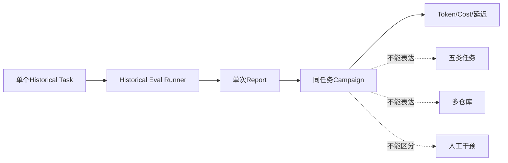
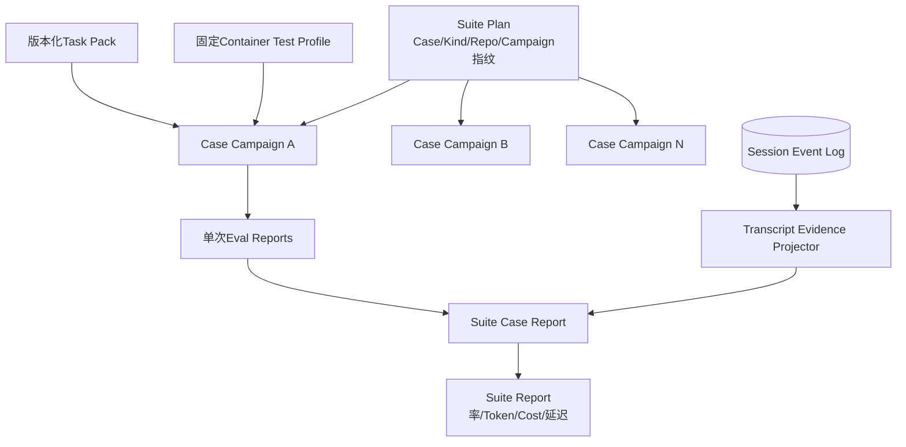
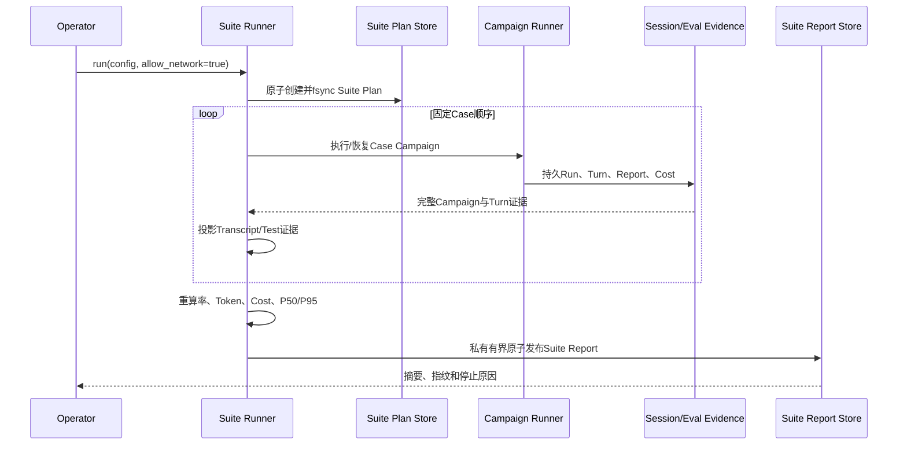
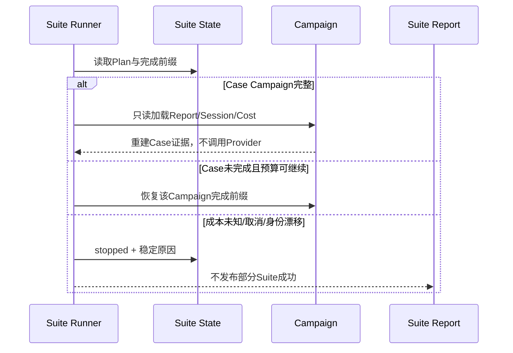
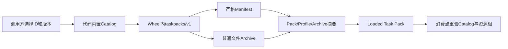
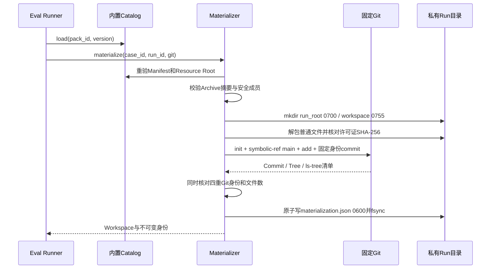
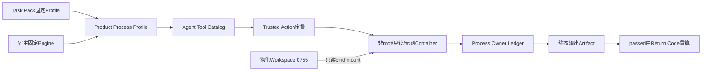
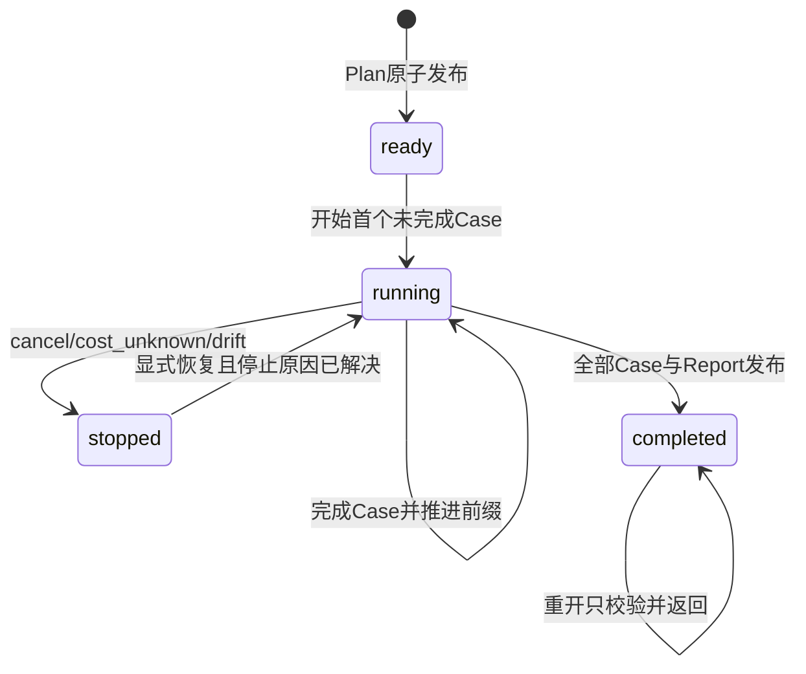

# 0.9.2 Eval Suite与Transcript基线详细设计

## 1. 变更摘要

| 项目 | 内容 |
|---|---|
| 需求 | 五类任务、多仓库质量基线及任务成功、测试、人工干预、Token、Cost、延迟指标 |
| 当前问题 | 仅有单个Harnessix Bug Fix任务；Campaign只能重复同一任务；无Suite/Transcript正式证据 |
| 目标结果 | 可恢复、可重算、低敏感度的多仓库Suite计划、执行状态和报告 |
| 影响模块 | `evals`、Session、Models、固定Process Profile、Sandbox、文档与CI |
| 兼容级别 | 保留现有单次Eval/Campaign v1；新增Suite、Transcript和Task Pack v1 |
| 发布/回滚单元 | 0.9.2a合同；b Task Pack；c Runner；d任务集；e真实基线 |

## 2. 需求背景与证据

现有Campaign已经验证同一任务的独立Run、固定价格、成本未知停止和崩溃恢复，但不能表达任务类型或仓库集合。
现有Grader内部读取Turn Transcript，却只把Tool Call与审批总数写入单次报告。源码证据、参考项目取舍和当前缺口见
[专项研究](../research/eval-suite-and-transcript-baseline.md)。

0.9.2完成不是“新增五个JSON样例”，而是以下事实同时成立：

1. 至少10个不可变Case、三个真实仓库、每类任务至少两个；
2. 每个Case至少两个隔离Trial并保存完整Campaign证据；
3. 任务正确性由固定隐藏检查、Git证据和回答合同判定；
4. Suite能从持久事实重算六类指标且不复制敏感正文；
5. 崩溃、取消、成本未知、证据损坏和部分完成均有稳定恢复/停止语义；
6. 真实执行经过固定Container Profile，不在宿主执行任意仓库脚本；
7. 结果经过本地全量回归、三平台合同CI、真实Container任务和受控Provider验证。

## 3. 设计目标、非目标与验收标准

### 3.1 目标

- 定义五类任务和多仓库Suite合同；
- 从持久Turn派生Transcript摘要及人工干预；
- 复用Campaign作为每个Case的重复试验单元；
- 建立版本化Task Pack、固定检查Profile和安全物化；
- 建立Suite状态、锁、完成前缀和报告发布恢复；
- 形成真实多仓库基线和版本化发布阈值输入。

### 3.2 非目标

- 不在0.9.2实现云端Benchmark服务或多租户调度；
- 不以模型裁判替代确定性检查；
- 不默认上传Transcript或代码；
- 不放开任意Shell、任意镜像或动态网络；
- 不在本切片关闭0.9.3 Soak、0.9.5发行物或0.9.6 Provider认证矩阵。

### 3.3 验收标准

| 领域 | 关闭证据 |
|---|---|
| 数据集 | ≥10 Case、≥3仓库、五类各≥2、固定Revision/Tree/Task Pack摘要 |
| 重复性 | 每Case ≥2 Trial，Run ID唯一，Campaign/Suite计划先行 |
| 正确性 | Baseline缺陷、Behavior、Regression、Git与Review Oracle全部可重算 |
| 指标 | 成功率、测试通过率、人工干预率、Token、完整Cost、P50/P95延迟 |
| 恢复 | Case边界崩溃、Report发布丢失、取消和成本停止不重跑已完成Trial |
| 安全 | 固定Digest Container、禁网默认、资源/输出限制、无正文Suite报告 |
| 平台 | Linux真实执行；macOS/Windows合同和读取链；平台限制明确 |
| 文档 | 研究、ADR、详细设计、模块设计、运维与验证证据同步 |

## 4. 当前实现与根因



根因不是缺少一张汇总表，而是聚合层级缺失：Campaign Plan绑定单个Task，直接允许多任务会让Task Fingerprint、
价格、Run恢复和报告顺序失去单一权威；完整Transcript又不适合作为发布报告。

## 5. 变更后总体架构



### 5.1 职责边界

| 组件 | 职责 | 非职责 |
|---|---|---|
| Suite Plan | 冻结Case、类别、仓库、Campaign和环境 | 不保存凭据或命令 |
| Task Pack | 固定Prompt、允许变更、检查和Profile身份 | 不接收模型动态命令 |
| Campaign | 同任务独立试验、成本和失败分类 | 不聚合跨任务指标 |
| Transcript Projector | 从Turn派生摘要和人工干预计数 | 不保存/上传正文 |
| Suite Runner | 顺序执行Case、恢复完成前缀、发布报告 | 不创建Provider、不审批、不重跑完整Case、不并发烧钱 |
| Suite Report | 聚合可重算发布指标 | 不替代Session诊断 |

### 5.2 替代方案

| 方案 | 优点 | 缺点 | 结论 |
|---|---|---|---|
| Campaign直接支持多任务 | 文件少 | 单任务不变量被破坏 | 拒绝 |
| SQLite集中Benchmark库 | 查询强 | 在本地基线前过早引入新服务状态 | 暂缓 |
| Suite嵌套完整Campaign报告 | 自包含、可重算 | 报告体积增加 | 采用，8 MiB上限 |
| Suite只保存CSV摘要 | 小 | 无法重算、证据断链 | 拒绝 |

## 6. 正常流程



Suite Plan必须在任何Provider Factory调用前发布。Case按计划顺序执行，首版不并行，避免Provider限流、成本停止和
Workspace资源竞争产生不可比较结果。

## 7. 失败、恢复、取消与超时



| 场景 | 行为 | 恢复 |
|---|---|---|
| Plan写入前崩溃 | 无Provider调用、无状态 | 使用同一配置重试 |
| Plan后首Case前崩溃 | 保留Ready State | 重开后校验配置指纹 |
| Trial完成但Campaign响应丢失 | Campaign从Run State重建 | 不再调用Provider |
| Case完成但Suite State未推进 | 重验Campaign摘要后推进一次 | 不重跑Case |
| Suite Report发布后确认丢失 | 校验Report与Plan摘要后返回 | 不重聚合正文 |
| 成本未知 | stopped，禁止新收费Trial | 人工补齐证据或新Suite |
| Cancel | 当前Agent/Process协作取消；完成前缀保留 | 显式新命令恢复 |
| Task Pack/镜像漂移 | 失败关闭 | 新Suite版本，不覆盖旧证据 |

## 8. 数据结构与领域契约

### 8.1 0.9.2a新增合同

| 合同 | 关键字段 | 不变量 |
|---|---|---|
| `CodingEvalSuitePlan` | `suite_id/version/environment/cases` | 五类、≥2仓库、任务和Campaign唯一 |
| `CodingEvalSuiteCasePlan` | Kind、Task、Repository、Campaign Fingerprint | 固定任务与仓库身份 |
| `CodingEvalTranscriptEvidence` | Run/Turn、SHA、结构计数、干预计数 | 不含正文；计数上界一致 |
| `CodingEvalTrialTestEvidence` | Run、Outcome、检查计数 | 通过与计数一致 |
| `CodingEvalSuiteCaseReport` | 完整Campaign、Transcript、Test | Run顺序和Token交叉绑定 |
| `CodingEvalSuiteSummary` | 三种率、Token、Cost、延迟 | 全部由Case重算 |
| `CodingEvalSuiteReport` | Plan、Case、Summary、完成时间 | 不接受部分Case或摘要漂移 |

三种率均保存分子、分母和四舍五入到基点的整数值。Cost沿用18位定点字符串；不同币种不能合并。

### 8.2 Transcript人工干预定义

| 事件 | 是否计人工干预 |
|---|---|
| `harnessix-eval-runner`自动审批 | 否，单独计自动决定 |
| 其他Actor审批或终态仍未决定的审批 | 是 |
| Question Request | 是；Answer只用于一致性核对，不重复计数 |
| 首条User Message | 否，属于任务输入 |
| 后续User Message/Steering | 是 |
| Trusted Action `manual_intervention` | 是，按Call ID去重 |
| 普通Recovery成功 | 否 |

### 8.3 Task Pack v1合同

0.9.2b已经实现独立的严格合同，源码位于
[`task_pack_contracts.py`](../../src/harnessix/evals/task_pack_contracts.py)。Task Pack不把运行时路径或命令当成数据，
只允许代码内置Catalog选择以下不可变对象：

| 合同 | 关键字段 | 主要不变量 |
|---|---|---|
| `CodingEvalTaskPack` | `pack_id/version`、Repositories、Profiles、Cases、`pack_sha256` | 三组对象按ID唯一排序；至少两种语言；整体摘要自校验 |
| `CodingEvalTaskPackRepository` | Repo ID、Language、`EvalRepository`、Tree OID、Archive、许可证 | Commit/Tree/Tree清单/Archive/许可证均固定 |
| `CodingEvalTaskPackProfile` | Digest Image、Program、Arguments、Timeout、Output、CPU/Memory/PID | 只能`network=none`；Profile摘要自校验 |
| `CodingEvalTaskPackCase` | Kind、Repo ID、Profile ID、`CodingEvalTask`、Review Oracle | Task仓库精确相等；唯一Profile且语言一致 |
| `CodingEvalReviewOracle` | Oracle版本、排序Finding、Oracle摘要 | Review必须携带，非Review禁止携带 |
| `CodingEvalTaskPackMaterialization` | Run/Pack/Case/Task/Repo/Git/Archive身份、Workspace、时间 | 重开时逐字段绑定，不接受调用方替换 |

`GitObjectId`与文件`Revision`分离：前者允许Git SHA-1的40位和SHA-256的64位，后者始终是64位SHA-256。
这避免把文件内容摘要类型误用于Commit/Tree并在macOS Apple Git 2.24上拒绝合法SHA-1仓库。

Case保留现有`CodingEvalTask`约束：`baseline_checks == behavior_checks`、Regression不重叠、允许路径排序唯一、
最大变更文件数不超过允许路径数、预算显式有界。Task Pack额外要求每个Case精确绑定一个固定Profile，调用方不能附加
第二条检查命令。

### 8.4 内置Catalog与资源身份

[`task_pack.py`](../../src/harnessix/evals/task_pack.py)只公开`pack_id + pack_version`选择，不接受URL或文件路径：



加载顺序固定为：先对未解析目录执行`lstat`拒绝Root Symlink，再解析真实路径；Manifest和Archive通过`O_NOFOLLOW`
有界读取；资源解析后必须仍位于Root内且路径对象不能是Link。Archive的实际字节数与SHA-256必须和Manifest一致。

`LoadedCodingEvalTaskPack`是公开数据类而不是能力令牌。Profile投影或物化前，`_verified_builtin_task_pack`重新按Manifest
身份定位Catalog、重载内置Pack，并要求调用方Resource Root与完整Manifest均精确相等。伪造相同Manifest加任意本地目录
不能越过这一边界。

### 8.5 Archive物化与Git身份

[`task_pack_materializer.py`](../../src/harnessix/evals/task_pack_materializer.py)按以下流程重建单提交仓库：



Archive成员只允许规范POSIX相对路径、普通文件和目录；绝对路径、空段、`.`、`..`、`.git`、反斜线、Symlink、
Hardlink、Device及其他特殊类型全部拒绝。普通文件仅允许`0644/0755`，目录仅允许`0755`；成员、总解包字节和
Git Tree输出均有硬上限。

Git调用关闭Global/System Config、Prompt、Pager、可选Lock和Commit签名，固定作者、邮箱、时间和消息，并始终传入
`core.autocrlf=false`。为兼容Apple Git 2.24，不使用较新的`git init --initial-branch`，而是`git init`后通过
`symbolic-ref HEAD refs/heads/main`冻结分支。物化后必须同时匹配：

1. `HEAD^{commit}`；
2. `HEAD^{tree}`；
3. 原始`git ls-tree -r -z --full-tree HEAD`字节的SHA-256；
4. 跟踪文件数。

同一Run ID存在时不重新解包，只读取`0600`清单并核对Run/Pack/Case/Task/Repository全部身份，再验证HEAD四重身份。
工作树中的未提交Agent修改不参与HEAD核对，因此能够原样恢复；如果Agent提交了新HEAD，则以
`eval_task_pack_materialization_changed`失败关闭。

### 8.6 固定检查Profile与产品运行链

Task Pack Profile不保存宿主Container Engine路径。`build_task_pack_product_profile`在当前宿主绑定一个已解析、普通且可执行
的Engine，并把镜像、程序、参数、资源、`selector_policy=none`、无Secret和`network=none`原样投影到现有
`ProductProcessProfile`。模型只可调用`run_profile.<profile_id>`并提交空Selector列表。



`run_root=0700`保持宿主隐私边界，直接挂载的`workspace=0755`允许Linux容器固定用户`65532:65532`读取`0644`文件；
容器只得到Workspace只读挂载，不能读取父目录或`materialization.json`。检查失败是确定性的`process_nonzero_exit`，
仍保存Return Code与完整有界Artifact；应用修复后以新的Action Plan和审批重新运行，绝不重放旧Process。

### 8.7 内置种子包

`harnessix-seed/v1`位于
[`src/harnessix/evals/taskpacks/v1`](../../src/harnessix/evals/taskpacks/v1)，包含两个由Harnessix项目自研、
AGPL-3.0-only且带完整LICENSE的离线仓库：

| Case | 类别/语言 | 唯一允许修改 | 固定检查 | Baseline |
|---|---|---|---|---|
| `javascript-slug-lowercase` | Feature / JavaScript | `src/slug.mjs` | Node 22.18.0 Alpine Digest、`node --test` | 缺少小写标准化，失败 |
| `python-mathbox-addition` | Bug Fix / Python | `src/mathbox.py` | Python 3.12.11 Alpine Digest、`unittest` | 把加法写成减法，失败 |

两个任务都不依赖第三方包、网络、Shell或仓库动态配置。它们用于证明Task Pack机制、真实Product Runtime和双语言检查，
不是0.9.2d最终质量数据集，也不得用于声称已覆盖全部五类任务。

### 8.8 Suite执行与恢复合同

0.9.2c新增四个严格v1合同，完整字段、状态和失败矩阵见
[可恢复Suite Runner详细设计](m09-2c-recoverable-suite-runner.md)：

| 合同 | 关键字段 | 主要不变量 |
|---|---|---|
| `CodingEvalSuiteRunConfig` | Plan、Campaign Plans、Work Root、总费用停止线 | Case与Campaign一一对应；Run ID跨Case唯一；同币种 |
| `CodingEvalSuiteCaseRunResult` | Case ID、Reason、可选Case Report | 只有`completed`携带完整报告 |
| `CodingEvalSuiteExecutionState` | Config/Plan指纹、状态、完成前缀、当前Case、Cost、停止原因、报告摘要 | 前缀连续；stopped/completed字段形状一致 |
| `CodingEvalSuiteRunReport` | 稳定原因、Case计数、当前Case、已知Cost | 不回显路径、配置、正文或第三方错误 |

Suite Runner先发布Plan，再持有单写者锁顺序调用可信Case执行端口。Case Report先于State前缀提交；重开扫描固定
`cases/case-NNN`槽位，只消费连续、身份一致且0600的报告。`stopped`必须显式`resume=True`，进程崩溃留下的
`running`状态则重入同一Case/同一Campaign，由下层固定Run ID恢复。Runner本身不创建Provider、审批或工具效果。

## 9. 状态、事务、并发与幂等



- Suite根目录使用单写者文件锁；
- Plan一经发布不可覆盖，配置漂移返回稳定错误；
- Case完成前缀只能连续增长；
- Report采用临时文件写入、文件`fsync`、原子替换和目录`fsync`；
- 不存在“部分Suite通过”终态；
- Provider、Agent和外部效果不自动重试，恢复只消费既有权威事实。

## 10. 安全、隐私与可观测性

Suite Report禁止Prompt、Assistant正文、Thinking、Tool参数/输出、Diff、绝对路径、环境变量和Provider原始错误。
Transcript SHA覆盖完整Turn的规范JSON，但只公开摘要。原始Session和Artifact按高敏感度存储。Task Pack签名、依赖/SBOM
进入0.9.4；本切片先固定内容摘要、来源Revision和镜像Digest。

低基数Telemetry：Suite ID哈希、版本、Case Kind、状态、失败分类、耗时、Token、Cost完整性和干预布尔值；不得以
Task ID、仓库URL或路径作为无限基数标签。

## 11. 核心伪代码

```text
validate_suite_plan_requires_all_kinds_and_multiple_repositories()
persist_plan_before_provider()
lock_suite_root()
for case in ordered_cases:
    campaign = run_or_recover_campaign(case)
    if campaign.cost_incomplete:
        persist_stopped("cost_unknown")
        stop_without_next_provider_call()
    transcripts = project_digests_and_intervention_counts(campaign.turns)
    tests = bind_final_checks(campaign.eval_reports)
    persist_completed_prefix(case, campaign_digest)
require_all_cases_complete()
summary = recompute_all_rates_tokens_cost_latency()
atomic_publish(report)
```

## 12. 实施切片

| 切片 | 改动 | 失败/恢复与测试 | 关闭条件 |
|---|---|---|---|
| 0.9.2a | Suite/Transcript/Test合同、聚合、Schema和原子I/O | 缺项、跨任务、篡改、权限、自动/人工审批 | 全仓与六实例CI |
| 0.9.2b | Task Pack v1、固定Archive/检查/Profile、Review Oracle | 摘要/来源/镜像漂移、恶意路径、禁动态命令 | ≥2语言离线真实检查 |
| 0.9.2c | Suite State/Runner/Lock/Cancel/Resume | Case边界崩溃、发布确认丢失、成本停止均已测试 | CI 35465458256六实例验收并关闭 |
| 0.9.2d1 | 3仓10 Case数据集、确定性生成、Review源码证据、外置Golden | Baseline失败、Golden通过、固定镜像 | 全量Profile与许可证门禁 |
| 0.9.2d2 | Task Pack Case Adapter接入正式Agent/Session/Campaign | 取消、超时、UNKNOWN和报告崩溃窗口 | Recorded Provider真实产品链 |
| 0.9.2d3 | 10 Case各2 Trial离线Suite | 前缀恢复、零重放、完整聚合 | 可复跑Suite报告与CI证据 |
| 0.9.2e | 受控真实Provider基线与版本化证据 | 请求预算、无重试、脱敏、完整Cost | 报告与验证资料发布 |

## 13. 接口设计与源码测试映射

| 变更点 | 源码 | 关键符号 | 测试 |
|---|---|---|---|
| Suite合同 | [`suite_contracts.py`](../../src/harnessix/evals/suite_contracts.py) | `CodingEvalSuitePlan/Report`、`summarize_suite_cases` | [`test_suite.py`](../../tests/evals/test_suite.py) |
| Transcript投影 | [`suite.py`](../../src/harnessix/evals/suite.py) | `build_transcript_evidence` | 自动/人工审批测试 |
| Suite聚合 | [`suite.py`](../../src/harnessix/evals/suite.py) | `build_coding_eval_suite_report` | 缺项、跨任务、摘要篡改测试 |
| 原子I/O | [`report.py`](../../src/harnessix/evals/report.py) | `write/read_eval_suite_*` | 权限、符号链接、Round Trip |
| 现有Campaign | [`campaign.py`](../../src/harnessix/evals/campaign.py) | `build_coding_eval_campaign_report` | [`test_campaign.py`](../../tests/evals/test_campaign.py) |
| Task Pack合同 | [`task_pack_contracts.py`](../../src/harnessix/evals/task_pack_contracts.py) | `CodingEvalTaskPack/Profile/Case/ReviewOracle` | [`test_task_pack.py`](../../tests/evals/test_task_pack.py) |
| 内置加载与Profile投影 | [`task_pack.py`](../../src/harnessix/evals/task_pack.py) | `builtin_coding_eval_task_pack`、`build_task_pack_product_profile` | 伪造Root、摘要、Engine正反测试 |
| Archive物化与恢复 | [`task_pack_materializer.py`](../../src/harnessix/evals/task_pack_materializer.py) | `materialize/load_materialized_task_pack_case` | 路径攻击、Git身份、脏树恢复测试 |
| 真实固定镜像检查 | [Container集成测试](../../tests/integration/test_task_pack_profiles.py) | Product Runtime、Approval、Process、Artifact | Baseline失败、最小修复后通过 |
| 工程数据集生成 | [`generate_engineering_task_pack.py`](../../scripts/generate_engineering_task_pack.py) | 规范Tar、固定Git、Oracle和Manifest | [`test_engineering_task_pack.py`](../../tests/evals/test_engineering_task_pack.py)生成与3仓10 Case测试 |
| Review源码证据 | [`task_pack_materializer.py`](../../src/harnessix/evals/task_pack_materializer.py) | `_verify_review_oracle` | 源码行篡改失败关闭测试 |
| 十Case固定检查 | [`engineering-v1`](../../src/harnessix/evals/taskpacks/engineering-v1) | 10个Case专用Profile | 宿主Golden闭环与Container Product Runtime参数化测试 |
| Suite执行合同 | [`suite_execution_contracts.py`](../../src/harnessix/evals/suite_execution_contracts.py) | Config、Case Result、State、Run Report | [`test_suite_execution.py`](../../tests/evals/test_suite_execution.py) Schema与身份漂移 |
| 可恢复Runner | [`suite_execution.py`](../../src/harnessix/evals/suite_execution.py) | `run_coding_eval_suite`、前缀重建、停止与发布恢复 | 顺序、锁、取消、崩溃、Cost与零重放测试 |
| 共用执行文件边界 | [`execution_fs.py`](../../src/harnessix/evals/execution_fs.py) | 0700目录、0600非阻塞独占锁 | Suite锁冲突及Campaign回归 |

## 14. 部署、兼容、风险与回退

| 风险 | 控制 |
|---|---|
| 数据集只对Harnessix过拟合 | 三个以上外部固定仓库、五类均衡 |
| Review无法确定性评分 | 版本化Oracle和双人复核；不使用自由文本主观分 |
| Transcript摘要掩盖诊断 | 保留受限Session引用与Run/Turn身份，不公开正文 |
| 真实模型费用失控 | Suite/Campaign双计划、顺序执行、未知成本停止、总预算 |
| 外部仓库脚本攻击宿主 | 固定Digest Container、禁网、只读来源、资源限制 |
| 调用方伪造已加载Pack | 消费点按Catalog重载并精确核对Manifest与Resource Root |
| 非root容器无法读取0700目录 | Run Root保持0700；直接挂载Workspace为0755且父目录不可穿越 |
| 旧版Git不支持`--initial-branch` | 使用`git init + symbolic-ref`并由macOS本地物化测试覆盖 |
| Windows执行能力不足 | 诚实标记读取/合同支持；不把WSL证据冒充原生写支持 |

回滚0.9.2a只需停止生成新Suite文件；既有单次Eval和Campaign v1不受影响。Task Pack或数据集变更必须发布新版本，
不得改写旧计划、报告或验证证据。

## 15. 当前实现状态

0.9.2a已由[CI 35456635653](https://github.com/carrie1988/Harnessix/actions/runs/35456635653)通过Linux
Python 3.12/3.13、macOS、Windows、固定镜像Container和Documentation六个Job并关闭。

0.9.2b已完成：新增Task Pack、Profile、Review Oracle和Materialization三个JSON Schema；内置
`harnessix-seed/v1`双语言Pack；安全Archive读取与Git四重身份物化；消费点Catalog重验；固定Profile到现有Product
Process的投影；15项定向单元测试；以及两个真实Digest镜像的Baseline失败/最小修复后通过集成测试。Wheel已验证包含
Manifest和两个Archive。实现Revision `608c07a54543f436651aa4e55141acb7f76021fc`本地全仓为3499项通过/20项跳过；
[CI 35461708961](https://github.com/carrie1988/Harnessix/actions/runs/35461708961)进一步通过Linux Python 3.12/3.13、macOS、Windows、固定镜像Container和Documentation六实例。首次Documentation执行只出现一次Mermaid冷启动超时；同一Revision的失败Job重跑渲染44幅变化图成功，其余全部Job在首次执行已通过，因此0.9.2b关闭。

0.9.2c已完成：计划先行、单写者锁、连续Case证据前缀、显式停止恢复、Case/最终报告崩溃窗口、成本未知和
聚合费用停止均已有严格合同、Schema和定向测试；实现细节见[0.9.2c详细设计](m09-2c-recoverable-suite-runner.md)
与[ADR 0084](../adr/0084-recoverable-sequential-eval-suite-runner.md)。实现Revision `ffd3db4e83a807ab3029c479fb4650216240b4f7`本地全仓为3514项通过/20项跳过，
[CI 35465458256](https://github.com/carrie1988/Harnessix/actions/runs/35465458256)进一步通过Linux Python 3.12/3.13、macOS、Windows、固定镜像Container和Documentation六实例，因此0.9.2c关闭；0.9.2d/e和0.9.2总项继续未关闭。

0.9.2d1已完成：`harnessix-engineering/v1`固定三个MIT派生Benchmark仓库、十个Case、五类各两个、
十个固定Profile、确定性Archive/Manifest生成器、Review源码行证据校验和Wheel外Golden Patch。实现Revision
`ee4d0db757d0371656934254aaaee0c1a56cfab0`本地全仓为3529项通过/30项跳过；[CI 35469387988](https://github.com/carrie1988/Harnessix/actions/runs/35469387988)完成Linux Python 3.12/3.13、macOS、Windows、固定镜像Container和Documentation六实例验收。d1只证明数据集和检查闭环；正式Task Pack Case Adapter与每Case两次Trial的完整离线Suite分别由d2/d3完成。专项需求、流程、接口、失败恢复、源码和验收矩阵见[0.9.2d详细设计](m09-2d-multi-repository-offline-baseline.md)。
