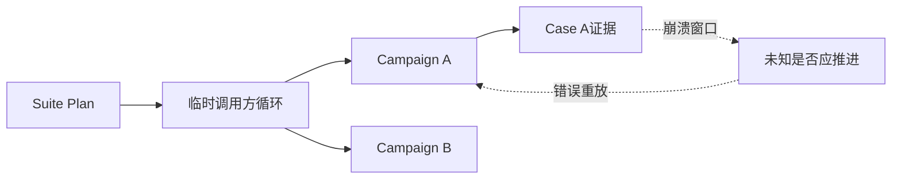
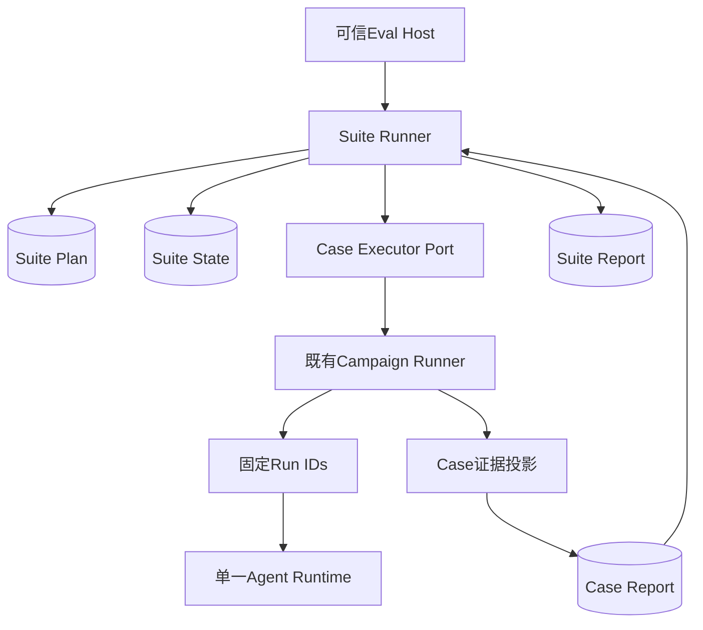
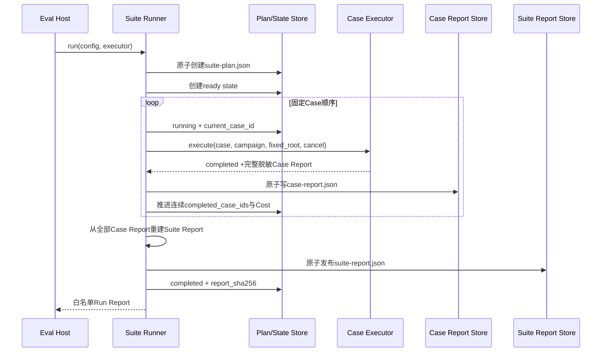
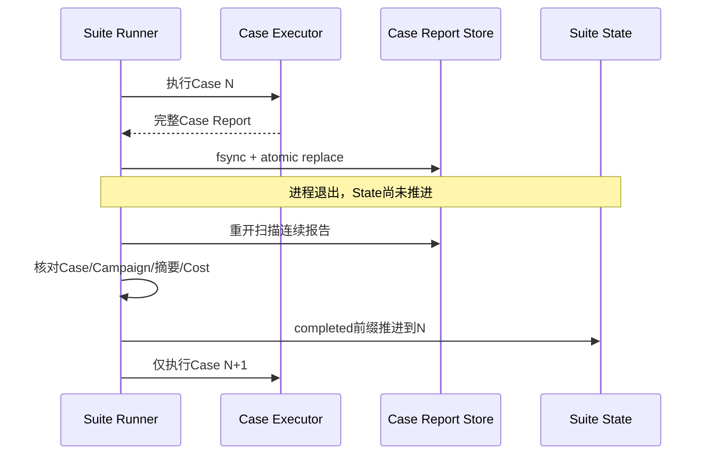
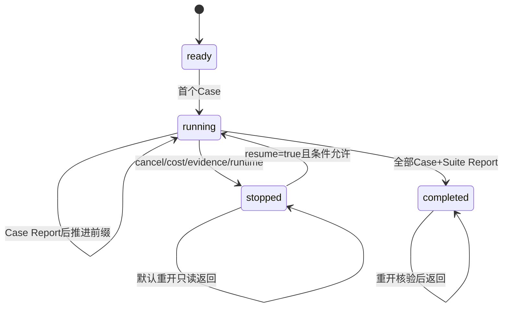
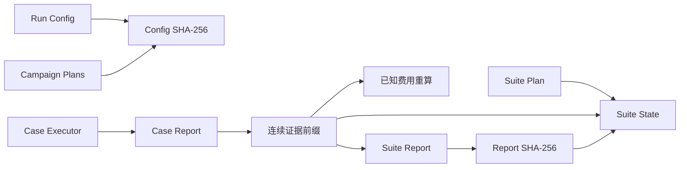

# 0.9.2c 可恢复Coding Eval Suite Runner详细设计

## 1. 变更摘要

| 项目 | 内容 |
|---|---|
| 需求 | 在多任务Suite中顺序执行固定Campaign，支持取消、崩溃、重开、费用停止和最终报告恢复 |
| 当前问题 | 0.9.2a只有聚合合同，调用方无法区分Case重放、证据恢复和状态补交 |
| 目标结果 | 单写者、计划先行、连续前缀、显式恢复且不重跑已完成Case的Suite状态机 |
| 影响模块 | `evals`合同、聚合、原子I/O、Campaign共用文件边界、Schema和文档 |
| 兼容级别 | 保持Run/Campaign/Suite Plan/Report v1；新增四个Suite执行v1合同和Runner API |
| 发布/回滚单元 | 0.9.2c独立提交；不包含最终Task Pack数据集或真实Provider基线 |

## 2. 需求背景与根因

Suite聚合器要求一次性传入全部`CompletedCodingEvalSuiteCase`。这一接口能证明报告可重算，却没有回答生产运行中的
四个问题：

1. 哪个计划已经在首个模型请求前固定；
2. 进程退出后哪个Case已经形成完整权威证据；
3. 取消或费用停止后重开是否允许继续；
4. Case或最终报告已经写入、调用方未收到响应时如何避免重放。

根因是“聚合证据”与“执行进度”属于两个领域。把执行进度塞入Suite Report会允许部分成功报告；把它放入Campaign
会破坏Campaign单任务边界；让CLI临时推断则无法审计。因此需要独立、最小的Suite Execution State。



## 3. 设计目标、非目标与验收标准

### 3.1 目标

- 任一Case执行适配器调用前，Plan已经0600原子持久化；
- Case严格按Plan顺序单写者执行；
- 只有连续Case Report前缀能进入State和最终报告；
- Case证据先于State提交，崩溃重开能只推进前缀；
- `stopped`默认不继续，只有显式`resume=True`才重入当前Case；
- 未捕获崩溃重开使用相同Case、Campaign Plan、Run IDs和Case Root；
- 成本未知或费用达到停止线后不调用下一个Case；
- 最终报告发布确认丢失只补State；
- 公开结果只包含固定枚举、身份、计数和已知金额；
- 合同、I/O、状态、锁、取消和恢复具有正反测试及冻结Schema。

### 3.2 非目标

- 不在Suite层创建Provider、Agent Runtime、审批、Process或Tool；
- 不实现并行Case、分布式队列、跨主机Lease或Fencing；
- 不把两个种子Task Pack Case扩写成十Case质量基线；
- 不执行真实付费Provider请求；
- 不自动修复损坏、缺失、越序或身份漂移证据；
- 不允许通过修改原配置提高停止线后继续同一Suite。

### 3.3 验收标准

| 验收项 | 可执行证据 |
|---|---|
| 计划先行 | 故障点` suite.after_plan`后Plan存在、State和Case调用不存在 |
| 不重放Case | Case Report写入后故障，重开调用序列从下一Case开始 |
| 显式恢复 | Cancel/Evidence Missing后普通重开调用数不增加；`resume=True`继续 |
| 费用停止 | 首个不完整Cost或达到总停止线后无下一Case调用 |
| 报告恢复 | `suite.after_report`故障后重开不调用Case，State转`completed` |
| 失败关闭 | 错Case、证据缺口、配置漂移、锁冲突产生稳定Error Code |
| 可维护性 | Ruff、Mypy、Evals定向回归、全仓测试和文档门禁通过 |

## 4. 总体架构与边界



Suite Runner只编排`Case Executor Port`。端口收到不可变Case Plan、对应Campaign Plan、固定Case Root和共享
`CancelToken`，返回`CodingEvalSuiteCaseRunResult`。0.9.2c测试使用确定性执行器验证Suite状态机；0.9.2d再装配
Task Pack物化、Campaign Runner和证据投影。端口不是第二套Runtime，也不能改变Case、Campaign或Run身份。

### 4.1 组件职责

| 组件 | 职责 | 禁止职责 |
|---|---|---|
| `suite_execution_contracts.py` | Config、Case Result、State、Run Report严格合同 | 文件系统和外部执行 |
| `suite_execution.py` | 锁、计划、前缀、停止、恢复、最终发布 | Provider、审批、Tool和评分 |
| `suite.py` | 从内部证据构建单Case/完整Suite报告 | 持久化和调度 |
| `report.py` | 有界、0600、no-follow、原子JSON I/O | 业务状态转换 |
| `execution_fs.py` | 0700目录和0600锁文件安全边界 | Suite/Campaign业务判断 |
| `domain/file_lock.py` | 跨平台文件描述符非阻塞独占锁原语 | Eval状态和业务合同 |
| Case Executor | 执行或恢复同一Campaign并返回脱敏Case结果 | 改变计划、并行调度或直接发布Suite |

## 5. 正常流程



对外成功点是`completed State`，但最终报告先写。这样报告已发布、状态响应丢失时，重开可以验证报告后只补State；
反向顺序会产生“状态成功但报告缺失”的不可恢复窗口。

## 6. 失败、取消与恢复时序

### 6.1 Case证据先于State的崩溃窗口



### 6.2 停止与显式恢复



停止不是异常重试提示。`resume=False`时，即使调用方再次传入执行器，也不会调用它。`resume=True`只允许重入计划中的
同一Case；若已持久Case Report仍为不完整Cost，或累计费用仍达到不可变停止线，会立即再次停止。

### 6.3 故障矩阵

| 故障点 | 持久事实 | 重开行为 | 禁止行为 |
|---|---|---|---|
| Plan写入前 | 无 | 同配置重新开始 | 声称已运行Case |
| Plan后、State前 | Plan | 创建Ready State | 改写Plan |
| Running State后、Case响应前 | 当前Case身份及下层事实 | 重入同Case/同Campaign | 调度下一Case |
| Case Report后、前缀前 | 完整Case报告 | 验证并推进一次 | 再调用该Case |
| 前缀后、下一Case前 | 完成前缀 | 从下一Case继续 | 重放前缀 |
| Cancel | stopped/cancelled | 默认只读；显式恢复 | 自动继续收费 |
| Cost Unknown | Case或Campaign证据、stopped | 不创建下一Case | 把未知当零 |
| Fee Limit | 已知累计金额、stopped | 不创建下一Case | 把停止线称为硬额度 |
| Case Evidence Missing | stopped或稳定KernelError | 修复权威证据后显式恢复 | 伪造报告 |
| Suite Report后、completed前 | 全部Case和Report | 重建、逐字段核对、补State | 重跑Case |
| State completed后 | State + Report + Case前缀 | 只读核对并返回 | 覆盖历史证据 |

## 7. 数据流与持久化布局



```text
<suite-work-root>/                         0700
├── .suite.lock                            0600
├── suite-plan.json                        0600
├── suite-state.json                       0600
├── suite-report.json                      0600，仅全部完成后存在
└── cases/                                 0700
    ├── case-000/                          0700，按计划序号而非外部ID命名
    │   └── case-report.json               0600，最多2 MiB
    └── case-NNN/
        └── case-report.json
```

Case目录按序号派生，避免允许`.`的业务Case ID参与路径计算。Suite Plan最大512 KiB，Execution State最大512 KiB，
单Case Report最大2 MiB，最终Suite Report最大8 MiB。全部JSON写入采用同目录临时文件、文件`fsync`、原子替换和目录
`fsync`；读取拒绝非普通文件、符号链接、权限放宽、超限和严格合同失败。

## 8. 数据结构、领域契约与重点字段

### 8.1 CodingEvalSuiteRunConfig

| 字段 | 含义 | 不变量 |
|---|---|---|
| `plan` | 跨任务Suite计划 | 严格v1，完整参与Fingerprint |
| `campaign_plans` | 与Case一一对应的完整Campaign计划 | 数量/顺序/任务/环境/指纹精确匹配 |
| `work_root` | 私有状态根 | 规范绝对路径，不进入公开Run Report |
| `fee_stop_currency` | Suite累计停止币种 | 等于全部Campaign Price币种 |
| `fee_stop_amount` | Case边界累计停止线 | 18位定点正数 |

所有Campaign的Run ID必须跨Case唯一。配置Fingerprint包含路径和停止线，只写入State，不发布完整配置；Provider配置和
Secret不属于Suite Config，由下层可信适配器持有。

### 8.2 CodingEvalSuiteCaseRunResult

| 字段 | 含义 | 不变量 |
|---|---|---|
| `case_id` | 本次Case身份 | 必须等于Runner当前Case |
| `reason` | 完成或稳定停止原因 | 固定枚举，无第三方正文 |
| `report` | 完整脱敏Case报告 | 仅`completed`必须且只能存在 |

### 8.3 CodingEvalSuiteExecutionState

| 字段 | 含义 | 恢复作用 |
|---|---|---|
| `suite_id` | Suite唯一身份 | 防止跨Suite接管目录 |
| `plan_fingerprint` | Plan摘要 | 防止计划改写 |
| `execution_config_fingerprint` | 完整执行配置摘要 | 防止Campaign、路径和预算漂移 |
| `status` | ready/running/stopped/completed | 控制自动重入与显式恢复 |
| `completed_case_ids` | 连续完成前缀 | 唯一可聚合进度 |
| `current_case_id` | 正在执行或阻塞的Case | 崩溃只重入同一Case |
| `known_cost_*` | 前缀可重算金额 | Case边界预算判断 |
| `stop_reason` | 五类稳定原因 | 仅stopped存在 |
| `report_sha256` | 最终Suite Report摘要 | 仅completed存在 |
| `started_at/updated_at` | 生命周期时间 | 更新时间不得早于开始时间 |

### 8.4 CodingEvalSuiteRunReport

只返回`reason/suite_id/scheduled_cases/completed_cases/current_case_id/report_published/known_cost_*`。不返回
Work Root、Task Prompt、Repository URL、模型正文、Diff、Tool参数/输出、Secret、环境变量或原始异常。

### 8.5 公共API与依赖评审

`harnessix.evals.__all__`新增四个合同、Runner、两个聚合入口和四个Case/State I/O入口；这些名称均对应冻结Schema或本文
定义的明确行为，不导出私有恢复辅助函数。`harnessix.file_lock`保持既有导入路径，由新的
[`domain/file_lock.py`](../../src/harnessix/domain/file_lock.py)承载唯一锁实现；因此新增的`file_lock → domain`依赖方向
指向基础层，不形成依赖环。该公共导出和依赖边作为本重大变更的一部分接受，并同步更新机器可读可维护性策略。

## 9. 核心算法与伪代码

```text
strict_validate(config)
ensure_private_0700(root)
with exclusive_nonblocking_lock(root/.suite.lock):
    create_or_require_equal(suite-plan.json)       # 先于Case调用
    create_or_read_state()
    require_state_matches_config_and_prefix()

    reports = scan_all_case_slots()
    reject_report_after_gap()
    require_claimed_prefix_has_reports()
    require_state_cost_equals_claimed_reports()
    if reports_ahead_of_state:
        advance_state_from_reports_once()

    if suite_report_exists:
        require_all_cases()
        rebuild_expected_report()
        require_exact_equal_and_digest()
        commit_completed_state_if_needed()
        return completed

    if state.completed_without_report:
        fail_closed()
    if state.stopped and not resume:
        return_whitelisted_stop()
    if any_persisted_case_cost_incomplete:
        persist_stopped(cost_unknown)
        return
    if known_cost_reaches_limit and cases_remain:
        persist_stopped(fee_limit_reached)
        return

    for next_case in fixed_order_after_prefix:
        persist_running(next_case)
        checkpoint_cancel()
        result = await executor(next_case, same_campaign, fixed_root, token)
        if result.stopped:
            persist_stopped(result.reason, next_case)
            return
        require_result_identity_and_complete_report()
        atomic_write(case-report.json)
        advance_prefix_and_recomputed_cost()
        stop_if_cost_unknown_or_limit_reached()

    report = rebuild_suite_report_from_persisted_cases()
    atomic_write(suite-report.json)
    persist_completed(report_sha256)
    return completed
```

## 10. 并发、幂等与事务边界

- 单Work Root通过文件描述符生命周期独占锁限制单写者；锁冲突返回`eval_suite_busy`，不等待；
- 锁不提供跨网络文件系统一致性、Lease、Owner心跳或Fencing；
- Plan、State、各Case Report和Suite Report分别原子，不构成跨文件ACID；
- 幂等来自不可变身份、连续前缀和“报告先于状态”提交顺序，而非重复执行外部效果；
- Runner不捕获`asyncio.CancelledError`伪装成领域取消；`TurnCancelled`转换为持久`stopped/cancelled`；
- 未捕获异常保留`running`，下一次调用只重入同一Case；
- 计划外Case目录和报告不参与聚合；计划槽位出现缺口后的报告直接失败关闭。

## 11. 安全、隐私与可观测性

### 11.1 文件边界

- Work Root、Cases和Case Root必须是0700真实目录；
- Lock、Plan、State、Case Report和Suite Report必须是0600普通文件；
- 写入前拒绝目标符号链接；读取使用no-follow并检查大小和模式；
- Case ID不参与文件名，防止业务标识成为路径能力；
- 既有损坏文件不删除、不覆盖为“修复后”状态。

### 11.2 数据最小化

State和Run Report只保存低敏感度枚举、ID、计数、金额和摘要。Case/Suite Report沿用0.9.2a脱敏边界。原始Session、
Artifact和Workspace仍在下层私有存储，不复制到Suite状态。

### 11.3 观测边界

本切片没有新增独立Telemetry后端。稳定Error Code、State、Case Report和Run Report构成当前诊断事实。后续接入指标时只允许
状态、停止原因、Case Kind、成本完整性和耗时分桶等低基数维度，不把Suite/Case ID、路径或Repository URL作为Metric Label。

## 12. 错误语义与运维处理

| 错误/结果 | 含义 | 处理 |
|---|---|---|
| `eval_suite_busy` | 同Root已有写宿主 | 等待其结束后原配置重开 |
| `eval_suite_plan_mismatch` | 既有Plan与配置不同 | 使用原配置或新Suite Root |
| `eval_suite_execution_mismatch` | State身份/前缀/当前Case漂移 | 保留现场，人工核对 |
| `eval_suite_evidence_order_invalid` | Case报告在缺口之后出现 | 不聚合，调查外部写入 |
| `eval_suite_evidence_missing` | State声称完成但报告缺失 | 从备份恢复证据，不重跑覆盖 |
| `eval_suite_case_mismatch` | 适配结果或报告不属于当前计划 | 修复适配器，不推进状态 |
| `eval_suite_cost_mismatch` | State金额不能由声明前缀重算 | 保留现场，禁止后续收费 |
| `eval_suite_report_mismatch` | 最终报告与Case证据不同 | 不补completed，不覆盖报告 |
| `cancelled` | 协作取消已持久化 | 明确需要继续后传`resume=True` |
| `cost_unknown` | 不能安全计算当前累计费用 | 补齐下层证据或创建新Suite |
| `fee_limit_reached` | Case边界达到停止线 | 创建新Suite和新预算，不改旧配置 |

## 13. 源码与接口设计

### 13.1 公共入口

```python
await run_coding_eval_suite(
    config: CodingEvalSuiteRunConfig,
    case_executor: SuiteCaseExecutor,
    *,
    cancel: CancelToken | None = None,
    resume: bool = False,
    fault: Fault | None = None,
) -> CodingEvalSuiteRunReport
```

`case_executor`是可信进程内端口，不是网络API。`fault`只用于确定性故障注入。`resume`仅改变已持久`stopped`状态的
继续许可，不绕过Plan、Config、Case、Cost或证据校验。

### 13.2 聚合入口拆分

[`suite.py`](../../src/harnessix/evals/suite.py)增加：

```python
build_coding_eval_suite_case_report(expected, completed) -> CodingEvalSuiteCaseReport
build_coding_eval_suite_report_from_cases(plan, cases) -> CodingEvalSuiteReport
```

原`build_coding_eval_suite_report(plan, completed)`保持兼容并委托上述入口。Runner可逐Case持久化脱敏报告，再从报告重建
最终Suite，而无需在内存中长期保留完整Turn、Task和Cost原始对象。

## 14. 测试设计

| 测试 | 证明 |
|---|---|
| 完整执行与重开 | 固定顺序、完整State/Report、完成后零重放 |
| Plan故障点 | Plan先于State和Case，重开可继续 |
| Case Evidence故障点 | 已完成Case不再次调用 |
| Suite Report故障点 | 报告确认丢失只补State |
| Cancel + Resume | 停止默认只读，显式恢复沿用前缀 |
| Evidence Missing Result | 稳定停止，不自动重入 |
| Unknown Cost | 当前Case证据可保存，但不执行下一Case |
| Fee Limit | Case边界停止，不超前调度 |
| Wrong Case | 结果身份漂移不推进 |
| Missing/Out-of-order Evidence | 不接受部分或越序前缀 |
| Lock Contention | 第二写宿主调用Case前失败 |
| Config Drift | Campaign、Run ID、币种和预算严格绑定 |
| Schema Freeze | 四个公共v1合同逐字节稳定 |
| Campaign Regression | 共用目录/锁提取不改变Campaign行为 |

## 15. 源码与测试映射

| 设计元素 | 源码 | 关键符号 | 测试 |
|---|---|---|---|
| 严格执行合同 | [`suite_execution_contracts.py`](../../src/harnessix/evals/suite_execution_contracts.py) | `CodingEvalSuiteRunConfig/CaseRunResult/ExecutionState/RunReport` | `test_suite_execution_config_rejects_campaign_and_run_identity_drift`、Schema参数化测试 |
| 顺序状态机 | [`suite_execution.py`](../../src/harnessix/evals/suite_execution.py) | `run_coding_eval_suite` | `test_suite_runs_fixed_order_persists_report_and_reopens_without_case_replay` |
| 前缀恢复 | 同上 | `_load_contiguous_reports`、`_reconcile_prefix` | `test_case_evidence_crash_advances_prefix_without_replaying_completed_case` |
| 最终报告恢复 | 同上 | `_recover_published_report` | `test_report_publication_crash_recovers_without_case_executor` |
| 取消/显式恢复 | 同上 | `_stop`、`resume`分支 | `test_cancel_requires_explicit_resume_and_preserves_completed_prefix` |
| Cost停止 | 同上 | `_case_cost`、`_prefix_cost` | `test_unknown_cost_and_aggregate_fee_limit_stop_before_next_case` |
| 文件锁与目录 | [`execution_fs.py`](../../src/harnessix/evals/execution_fs.py)、[`domain/file_lock.py`](../../src/harnessix/domain/file_lock.py) | `ensure_private_directory`、`exclusive_execution_lock`、`acquire_exclusive_file_lock` | 锁冲突组合测试及Campaign回归 |
| Case/State I/O | [`report.py`](../../src/harnessix/evals/report.py) | `write/read_eval_suite_case_report`、`write/read_eval_suite_execution_state` | Suite执行全流程与损坏证据测试 |
| 聚合兼容 | [`suite.py`](../../src/harnessix/evals/suite.py) | `build_coding_eval_suite_case_report`、`build_coding_eval_suite_report_from_cases` | [`test_suite.py`](../../tests/evals/test_suite.py)及Runner完整执行 |

## 16. 发布、兼容与回滚

### 16.1 发布

实现Revision `ffd3db4e83a807ab3029c479fb4650216240b4f7`已通过本地Ruff、Mypy、Schema Check、Evals定向测试、3514项全仓测试、静态文档检查、
589幅Mermaid中的32个变化文档真实渲染和Wheel全新环境导入冒烟；[CI 35465458256](https://github.com/carrie1988/Harnessix/actions/runs/35465458256)进一步完成Linux Python 3.12/3.13、macOS、Windows、固定Container和Documentation六实例验收，路线图0.9.2c据此关闭。

### 16.2 兼容

- 既有Suite Plan/Report v1不变；
- 既有Campaign API和持久文件名不变；
- Campaign私有目录与锁提取为共用函数，错误码和行为保持；
- 新文件只在调用Suite Runner时创建，不影响旧聚合调用方；
- 0.9.2d可通过Case Executor适配器接入Task Pack/Campaign，无需修改Suite状态合同。

### 16.3 回滚

停止调用`run_coding_eval_suite`即可回滚执行能力，既有Plan/State/Case Report/Suite Report均保留为审计事实。不得用旧版本
覆盖已创建Work Root；若新版本不识别合同，应只读归档并创建新Suite。代码回滚不删除公共Schema和历史ADR。

## 17. 风险与后续工作

| 风险 | 当前控制 | 后续 |
|---|---|---|
| Case适配器错误重放下层效果 | 固定Campaign/Run ID/Case Root；Suite不内部重试 | 0.9.2d正式适配器恢复测试 |
| 单机锁不覆盖共享文件系统 | 文档明确单主机边界 | 需要时引入Lease/Fencing而非扩展文件锁 |
| 当前Case费用超过总停止线 | 只在Case边界判断，公开已知金额 | 0.9.2e同时设置Campaign/Provider预算 |
| Case报告体积增长 | 单Case 2 MiB、Suite 8 MiB上限 | 数据集扩展时先测量再版本化调整 |
| Windows权限语义不同 | CI只验证合同/导入，不宣称原生执行 | 0.9.5平台验收 |
| 缺少真实Task Pack装配 | 本切片只验证状态机，不虚构生产数据 | 0.9.2d完成十Case/三仓库离线链 |

## 18. 实现偏差与最终结论

实现遵循总体设计中的“Suite State/Runner/Lock/Cancel/Resume”，并增加两个明确收敛点：

1. Case目录使用计划序号，不直接使用允许点号的Case ID；
2. Campaign和Suite复用同一私有目录/跨平台文件锁函数，避免复制安全边界。

0.9.2c已经覆盖状态机、失败恢复、严格合同、原子I/O、Schema和文档，并由[CI 35465458256](https://github.com/carrie1988/Harnessix/actions/runs/35465458256)验收关闭。
该结论只说明Suite调度机制成立，不能宣称0.9.2多仓库质量基线或1.0商用版本完成。
