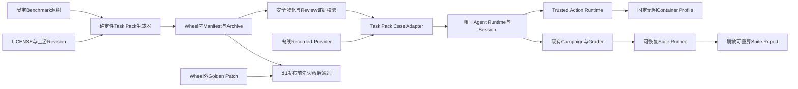
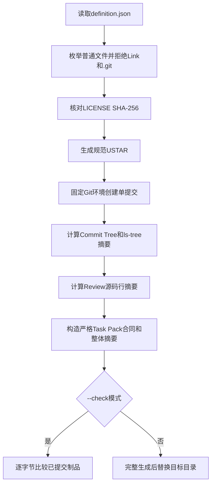
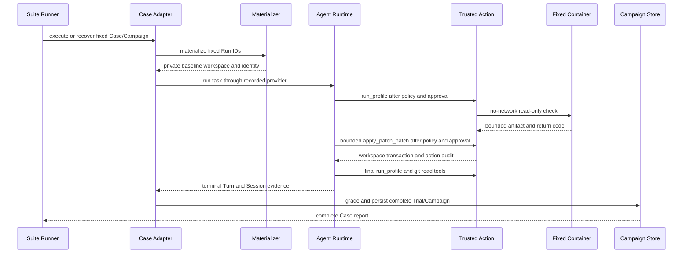
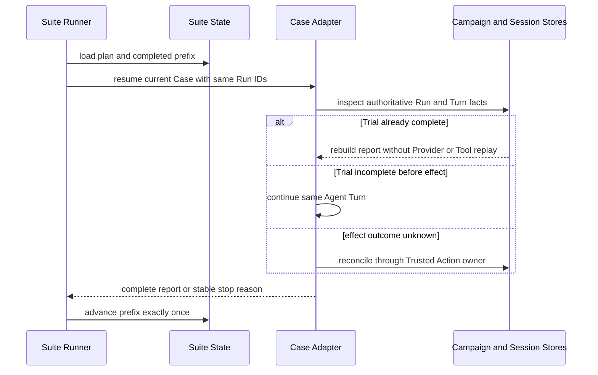
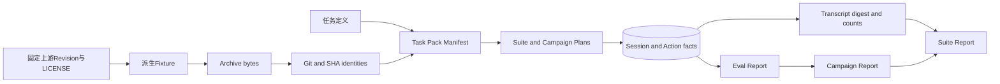
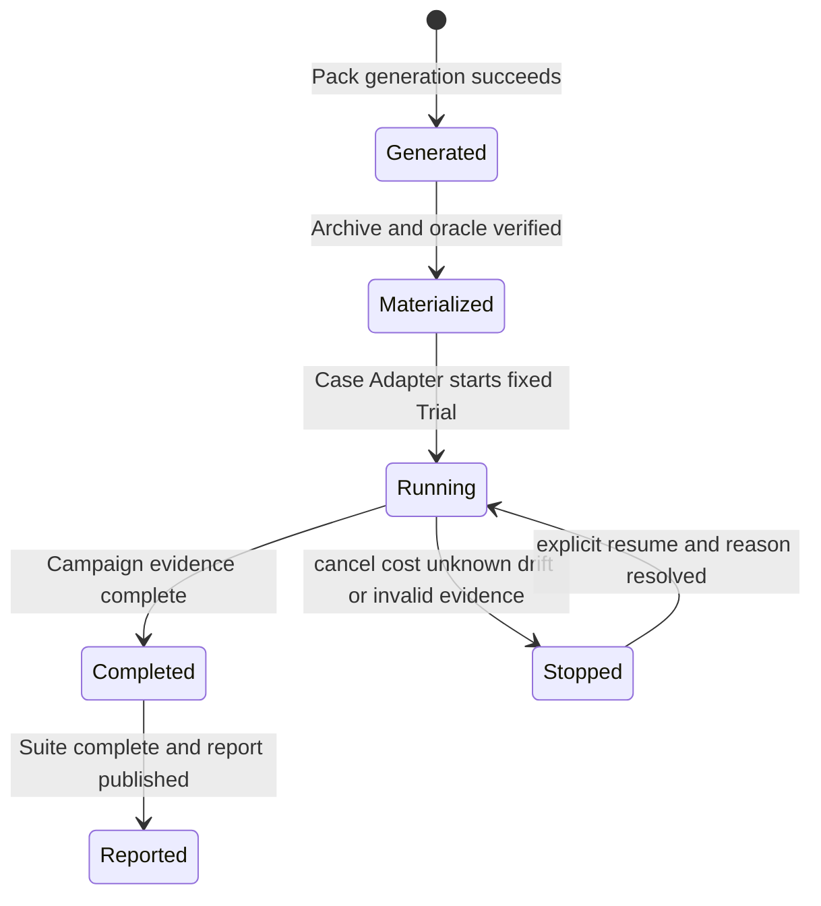
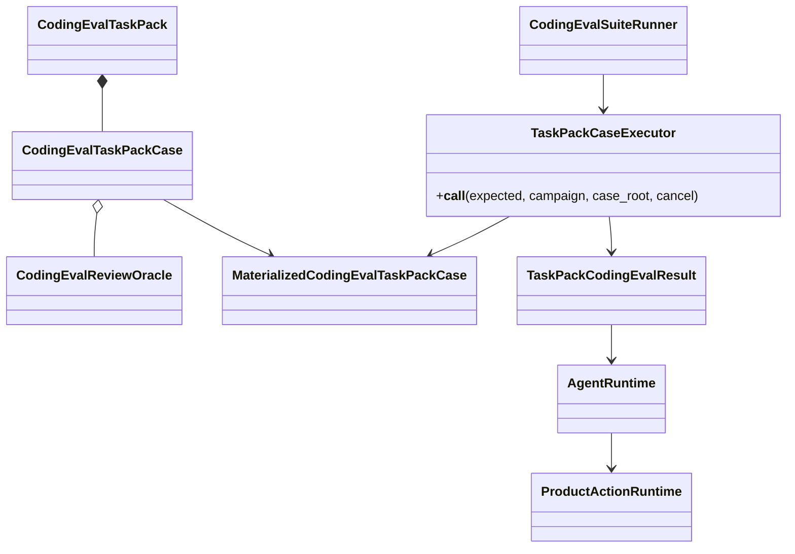

# 0.9.2d 多仓库离线基线详细设计

## 1. 文档摘要

| 项目 | 内容 |
|---|---|
| 当前能力 | d1数据集与检查闭环、d2正式Case Adapter及双报告窗口恢复均已验收；d3完整Suite待实施 |
| 本文设计状态 | d1/d2已验收；d3仍为目标设计 |
| 代码版本 | d1实现`ee4d0db757d0371656934254aaaee0c1a56cfab0`由[CI 35469387988](https://github.com/carrie1988/Harnessix/actions/runs/35469387988)验收；d2实现`a04606b829e6c4a32935b81c8ccc86ee5802d918`由[CI 35479723645](https://github.com/carrie1988/Harnessix/actions/runs/35479723645)完成固定Digest Container与六实例验收 |
| 影响模块 | Evals、Agent、Session、Trusted Actions、Process、Sandbox、CI和发行通知 |
| 关键ADR | [ADR 0082](../adr/0082-multi-repository-eval-suite-and-transcript-evidence.md)、[0083](../adr/0083-built-in-immutable-coding-eval-task-pack.md)、[0084](../adr/0084-recoverable-sequential-eval-suite-runner.md)、[0085](../adr/0085-versioned-third-party-eval-dataset-and-golden-boundary.md)、[0086](../adr/0086-formal-eval-case-adapter-and-recorded-provider-boundary.md) |
| 关键测试/证据 | `test_task_pack_execution.py`单元测试、同名固定Container集成测试、`test_grader.py`及d1数据集/Profile测试 |

## 2. 需求背景

0.9.2a建立了跨任务Suite与脱敏Transcript合同，0.9.2b建立了不可变Task Pack，0.9.2c建立了计划先行、顺序单写者、
可恢复的Suite Runner。现有`harnessix-seed/v1`只有两个小型自研仓库和两个Case，Campaign执行入口仍硬编码到历史Harnessix
缺陷，无法满足以下发布事实：

- 至少3个固定仓库和10个Case；
- Bug Fix、Feature、Refactor、Test、Review各至少2个；
- 每个Case至少2次独立Trial；
- 全部检查通过固定Digest Container和现有产品Trusted Action链执行；
- 生成可复跑、可恢复、可重算且不泄漏正文的离线Suite报告。

仅扩充Manifest不能关闭0.9.2d，因为它既不证明Task Pack能进入真实Agent/Campaign，也不证明Review Oracle、
Transcript、Git证据和两次Trial形成一致报告。

## 3. 设计目标与非目标

### 3.1 目标

1. 发布`harnessix-engineering/v1`，固定3仓、10 Case、五类各2个和10个Case专用Profile；
2. 从受审源树确定生成Archive、Git身份、Review证据和Manifest，生成漂移阻断门禁；
3. 每个Case证明原始基线失败、唯一允许路径的黄金修复后通过；
4. d2通过现有Agent Runtime、Session、Tool Catalog、Trusted Action、Process Artifact和Campaign执行Task Pack Case；
5. d3按固定顺序执行每Case两次Trial，发布完整Suite Report，并验证崩溃恢复不重复已完成效果；
6. 所有运行报告只保存身份、摘要、计数和低敏感度错误，不保存Prompt、回答、工具正文、代码或绝对路径。

### 3.2 非目标

1. 不新增独立Action HTTP/Worker、分布式Eval Worker或第二套Agent Runtime；
2. 不在运行时下载Git仓库、Container标签或依赖包；
3. 不把黄金补丁提供给模型或生产安装包；
4. 不使用LLM Judge评价Review或Refactor；
5. 不把十个小型离线Case宣称为大型仓库或真实Provider质量结论；
6. 不在d阶段调用收费Provider；真实模型基线属于0.9.2e。

## 4. 约束、假设与术语

| 项目 | 定义 | 影响 |
|---|---|---|
| Benchmark源树 | `benchmarks/taskpacks/harnessix-engineering-v1/repositories`中的受审输入 | 开发与审查可见，不由运行时直接加载 |
| 生成制品 | `src/harnessix/evals/taskpacks/engineering-v1`下Manifest和Archive | 进入Wheel，必须逐字节可复现 |
| Golden Patch | `benchmarks/.../solutions`下每Case补丁 | 仅测试使用，不进入Wheel资源根 |
| Offline Provider | d2通过Factory注入的固定Recorded模型事件源 | 不访问网络，只证明产品链，不证明模型能力 |
| Case Adapter | 把Task Pack Case投影到正式Run/Campaign端口 | 复用现有Agent/Session/Trusted Action链 |
| Review Evidence | 固定源码行原始字节的SHA-256 | 物化时验证，不能由自由文本替代 |
| Trial | 独立Run ID、Session、Workspace和效果账本 | 每Case固定2次，不复用工作树 |

## 5. 总体架构



### 5.1 图示说明

- Generator只在开发和CI阶段运行，读取固定源树，输出可分发Pack；
- Materializer只接受代码Catalog选中的Pack ID/版本，拒绝调用方路径；
- d2 Adapter创建或恢复固定Run；只经Agent和产品组合根间接使用Provider、Container与持久Store，不直接调用Executor；
- Agent经统一Tool Catalog和Trusted Action审批执行`run_profile.<profile_id>`；
- Campaign生成单Case两次Trial的完整报告，Suite只消费完整Case证据；
- Golden只连到发布前验证，不连到Adapter、Agent或Suite。

### 5.2 变更前后边界

| 边界 | 变更前 | d完成后 |
|---|---|---|
| Task Pack | 双语言2仓2 Case机制种子 | 新增3仓10 Case工程数据集；旧Pack不变 |
| Review Oracle | Schema存在但不核对源码 | 物化时绑定源码行字节摘要，d2评分绑定Finding ID |
| Campaign | 历史任务专用执行 | 新增Task Pack Case Adapter，底层Run/Campaign合同复用 |
| Suite Runner | 只有可信Case端口和恢复状态机 | 端口由Task Pack Adapter实现并生成20 Trial完整报告 |
| Action拓扑 | 单一Coding Agent内Trusted Action | 保持不变，不恢复独立服务 |

## 6. 模块职责与依赖

| 模块 | 职责 | 允许依赖 | 禁止依赖 | 生命周期 |
|---|---|---|---|---|
| Benchmark源树 | 保存最小派生夹具、许可证和来源说明 | Git审查 | Runtime配置、Secret | 开发期版本化 |
| 生成器 | 规范Tar、固定Git身份、合同构造、漂移检查 | Task Pack合同、Git | 网络、外部工作树 | 构建/CI一次性 |
| Task Pack Loader | 按ID/版本加载并重验Wheel资源 | Manifest、Archive | 任意URL/目录 | 进程内只读 |
| Materializer | 私有目录、解包、Oracle、Git身份、恢复 | 固定Git、Pack | Provider、Golden | 每Run一次/重开 |
| Case Adapter | d2装配Run、Agent、检查、评分和Campaign | 正式产品端口 | 直接Executor、旁路审批 | 每Case Campaign |
| Suite Runner | 顺序、停止、恢复和聚合 | Case端口、Suite Store | Provider SDK、Golden | 每Suite |
| Golden Verifier | 证明Case可解和变更边界 | 开发补丁、固定检查 | 生产包 | 测试进程 |

## 7. 核心流程

### 7.1 d1生成与验证流程



生成器不读取个人源码目录；`definition.json`已经冻结上游Revision、许可证摘要、任务和Profile。输出Tar只含排序普通文件，
uid/gid为0、用户名为空、时间固定、模式仅0644/0755。

### 7.2 d2单Case时序



`TaskPackCaseExecutor`先核对Pack Case、Suite Case和Campaign的Task身份及指纹，在第一次模型请求前写入
`campaign-plan.json`与`campaign-state.json`。每个Run ID映射到独立`runs/<run-id>`目录；
`run_task_pack_coding_eval`从固定物化Workspace装配`SQLiteSessionStore`、`SQLiteArtifactStore`、
`CodingToolRuntime`和`open_default_product_action_runtime`。后者只启用当前Case的固定Profile及产品Workspace Patch，
不装配Eval专用Executor或Secret Provider。

自动审批并不等于无条件批准。Adapter从已持久Tool Call恢复正式Patch合同：Profile必须精确匹配工具名、Profile ID和
空Selector；Patch必须不超过`max_changed_files`，全部路径属于`allowed_changed_paths`且不得删除。其他Action、
参数或展示类型统一返回`eval_approval_denied`。Profile完整输出只保存在受限Artifact和Session，Grader把终态、
停止原因、Return Code与内容摘要投影为Baseline/Final Observation。

Review Case不修改`coding-eval-final-answer/v1`。Oracle的Finding ID必须按排序去重后，分别作为最终回答
`summary`中的独立词元出现；缺失、子串碰撞或重复配置均失败关闭。Golden Patch只由集成测试侧Recorded Provider夹具
读取，以生成正式工具调用；Adapter、Wheel资源、Session和报告均没有Golden路径或正文。

### 7.3 d3失败与恢复时序



### 7.4 d3确定性组合与证据发布

d3不再实现新的Suite Runner。新增组合器只把已核验的`harnessix-engineering/v1` Manifest转换为现有
`CodingEvalSuiteRunConfig`：Case保持Manifest顺序，每个Campaign固定两个Run，Campaign ID与Run ID使用
调用方Suite UUID作为命名空间按UUIDv5派生。全部Campaign共享同一代码Revision、平台、`recorded`环境、零费用
价格快照和Billing Context。组合器不接受Provider、Golden目录、动态命令、外部URL或Secret。

测试/CI侧Recorded Provider读取仓库外部发布包之外的Golden Patch，只把解出的目标文件内容转换为正式
`apply_patch_batch`工具调用；Review任务的固定Finding ID进入最终回答摘要。Provider事件仍由Agent Runtime消费，
报告必须从Session、Action、Artifact、Grader和Campaign事实生成，禁止测试夹具直接构造通过报告。

完整场景按以下顺序验证两层提交窗口：

1. 第一个Case的`case-report.json`原子发布后、Suite完成前缀提交前注入宿主退出；
2. 重开吸收该报告，只执行剩余九个Case；
3. `suite-report.json`原子发布后、Suite completed状态提交前再次注入宿主退出；
4. 第三次重开只核对并吸收报告，Case Adapter与Provider均不得再次调用；
5. 最终断言十Case、二十Trial、五类任务、三仓、成本、Token、人工干预率和测试结论均可重算。

公开证据只复制严格重读后的Suite Plan、Suite Report及低敏摘要。证据发布器拒绝宿主绝对路径、Golden/Patch内容、
Prompt、模型正文、Tool参数/输出、Diff、环境变量和Secret标记。私有Suite状态、Session、Artifact、Workspace及
Container输出留在CI临时目录，不上传。

取消与显式恢复由Suite Runner专项测试证明；真实Turn时限由Agent Runtime测试证明；执行响应丢失及
`UNKNOWN → reconcile`由Trusted Action/Product Action测试证明。聚合层只传播稳定停止原因，不捕获并改写
身份漂移、证据损坏或未知副作用错误。完整映射见[ADR 0087](../adr/0087-deterministic-offline-eval-suite-composition.md)。

## 8. 数据流



| 数据 | 信任级别 | 持久位置 | 是否进入模型上下文 | 脱敏/保留 |
|---|---|---|---|---|
| Archive源码 | 受审不可信输入 | Wheel与私有Workspace | 是，按工具读取 | 固定版本 |
| LICENSE/Provenance | 受审元数据 | Archive和Manifest | 默认否 | 长期保留 |
| Golden Patch | 测试机密 | `benchmarks`开发目录 | 否 | 不进入Wheel/Report |
| Prompt/回答/工具正文 | 高敏感 | Session/Artifact | 运行需要 | Suite禁止复制 |
| Git/检查摘要 | 低敏感证据 | Eval/Campaign Report | 否 | SHA、计数、结果 |
| Suite Report | 可发布摘要 | Suite私有目录 | 否 | 无路径正文和Secret |

## 9. 状态机



| 当前状态 | 事件/条件 | 下一状态 | 写入者 | 持久事实 | 非法转换处理 |
|---|---|---|---|---|---|
| Generated | Materialize固定Case | Materialized | Materializer | 0600 materialization | 摘要/Oracle错则删除Run根 |
| Materialized | d2开始Trial | Running | Campaign/Run Store | 固定Run/Turn IDs | 配置漂移拒绝 |
| Running | Trial终态且证据完整 | Completed | Campaign | Eval Report | 缺证据不完成 |
| Running | 取消/未知成本/漂移 | Stopped | Suite Runner | 稳定原因和前缀 | 不执行下一Case |
| Stopped | 显式恢复 | Running | Suite Runner | 同一Plan/Run IDs | 原因未解除则保持停止 |
| Completed | 全Case聚合 | Reported | Suite Runner | 0600 Suite Report | 部分Case禁止发布 |

## 10. 类与组件设计



| 类/组件 | 职责 | 状态所有权 | 线程/进程安全 | 直接依赖 | 扩展点 |
|---|---|---|---|---|---|
| `CodingEvalTaskPack` | Pack整体身份和交叉引用 | 不可变合同 | 冻结可共享 | Pydantic合同 | 新Pack版本 |
| `CodingEvalReviewOracle` | Finding集合与摘要 | 不可变合同 | 冻结可共享 | Finding | Oracle新版本 |
| `MaterializedCodingEvalTaskPackCase` | 返回Run根、Workspace和清单 | 调用栈 | 单Run单写者 | Materializer | 无 |
| `TaskPackCaseExecutor` | Suite可信Case端口、Campaign计划/前缀/成本/报告恢复 | Campaign/Run Store | 每Case0600文件锁 | Trial执行、Campaign聚合 | Recorded Provider Factory |
| `CodingEvalSuiteRunner` | 顺序与恢复 | Suite State | 文件单写者锁 | Case执行端口 | 新Suite版本 |

## 11. 接口设计

| 接口/方法 | 调用者 | 输入/输出 | 前置/后置条件 | 错误与重试 | 取消/超时 | 幂等/顺序 | 权限 |
|---|---|---|---|---|---|---|---|
| `generate_engineering_task_pack --check` | Make/CI | 固定源树→退出码 | 制品逐字节相等 | 漂移非零，不自动修复 | Git命令30秒 | 同输入同字节 | 开发仓库读取 |
| `builtin_coding_eval_task_pack` | Eval装配 | ID/版本→Loaded Pack | 仅代码Catalog | 稳定KernelError | 不适用 | 只读幂等 | 无外部路径 |
| `materialize_task_pack_case` | Case Adapter | Pack/Case/Run/Git→Workspace | 摘要、许可证、Oracle和Git匹配 | 失败删除半成品 | Git命令30秒 | 同Run严格重开 | 私有0700根 |
| `_verify_review_oracle` | Materializer | Workspace/Case→None | 源码普通UTF-8文件且摘要匹配 | `eval_task_pack_review_oracle_invalid` | 有界读取 | 首次物化一次 | Workspace内路径 |
| `TaskPackCaseExecutor.__call__` | Suite Runner | Case Plan、Campaign、私有目录、CancelToken→Case Result | Pack/Case/Task/Campaign身份一致 | 稳定KernelError或`cost_unknown` | Trial边界和Agent层检查 | 固定Run IDs、连续证据前缀 | 不接受Golden |
| `run_task_pack_coding_eval` | Case Adapter | 固定Case/Run/Provider Factory→Trial证据 | Session请求身份唯一 | 从Session/Action账本恢复 | 分层CancelToken与Turn预算 | Report先于Run State | 无Secret、自动审批白名单 |
| `grade_coding_eval` | Trial执行器 | Turn/Profile观察/Git/Finding IDs→Run Report | 只读取已持久事实 | 缺证据失败关闭 | 不适用 | 纯确定性投影 | 不读取Golden |
| `run_coding_eval_suite` | CLI/测试 | Suite Config→Run Report | 计划先行、Case顺序固定 | 已有停止/恢复语义 | Case边界检查 | 连续完成前缀 | 0600状态根 |
| `build_task_pack_offline_suite_config` | CI/测试宿主 | 内置Pack、Suite身份、Revision、平台、目录→Run Config | Pack重新核验、每Case两个Run | 合同校验失败，不执行 | 不适用 | UUIDv5稳定派生 | 不读取Golden/Secret |

## 12. 数据结构与重点字段

| 结构/字段 | 类型 | 必填 | 来源 | 语义/约束 | 默认值 | 敏感级别 | 持久化 | 兼容规则 |
|---|---|---|---|---|---|---|---|---|
| Pack `pack_id/version` | string/int | 是 | definition | `harnessix-engineering/1` | 无 | 低 | Manifest | 不可改写 |
| Repository `provenance_uri` | HTTPS | 是 | definition | 固定上游Revision路径 | 无 | 低 | Manifest | 新来源发新版本 |
| Repository `archive_sha256` | SHA-256 | 是 | generator | Archive原始字节 | 无 | 低 | Manifest | 精确匹配 |
| Repository `source_revision` | Git OID | 是 | generator | 派生Fixture确定提交 | 无 | 低 | Manifest | 精确匹配 |
| Case `task_kind` | 五类枚举 | 是 | definition | 每类总数2 | 无 | 低 | Manifest/Plan | v1固定 |
| Profile `program/arguments` | 固定argv | 是 | definition | 不含Shell与调用方参数 | 无 | 低 | Manifest | 摘要绑定 |
| Finding `start/end_line` | int | Review是 | definition | 1-based闭区间 | 无 | 低 | Manifest | 摘要绑定 |
| Finding `evidence_sha256` | SHA-256 | Review是 | generator | 精确行字节摘要 | 无 | 中 | Manifest | 变更发新Pack |
| Golden Patch | unified diff | 测试是 | benchmark目录 | 每Case一个 | 无 | 测试机密 | Git开发树 | 不进入Wheel或sdist |

## 13. 持久化、事务与迁移

生成器先在临时目录生成完整制品，非`--check`模式才替换目标目录；已提交Manifest与Archive是构建输入，不在运行时
修改。Materializer沿用0700 Run根、0755只读Container Workspace、0600清单、临时文件、文件`fsync`、原子替换和目录
`fsync`。d2为每个Trial复用Session SQLite、Artifact Store、Action Audit、Process Lease与Workspace Transaction；发布顺序固定为
`Trial Report → Run State → Campaign Report → Campaign State`。d2/d3继续复用既有Campaign和Suite原子报告协议，不新增数据库Schema。

旧`harnessix-seed/v1`保持可读且仍是默认Pack。新增Pack只扩展代码Catalog；不存在就地迁移。未来修正任何Fixture、检查、
许可证、Profile或Finding均发布`harnessix-engineering/v2`，不得覆盖v1资源。

## 14. 并发、幂等与一致性

- 生成器只读固定源树；同输入、Git版本语义和时间产生相同Tar、Commit、Tree和Manifest；
- 一个Run ID只对应一个Pack/Case/Task身份；重开不覆盖未提交Agent修改；
- Review证据只验证固定基线，Agent修改后恢复通过固定HEAD和Pack摘要证明原始证据；
- d2每个Trial使用独立Workspace、Session和效果账本，禁止同Case两次Trial共用脏树；
- d3仍由Suite单写者锁保证Case顺序，Case报告先于完成前缀提交；
- 完成Trial或Case只能从权威持久事实重建，不能根据调用返回猜测。

## 15. 失败语义与恢复矩阵

| 故障点 | 可观测事实 | 对外错误 | 是否重试 | 恢复动作 | 最终状态 | 防重复证明 |
|---|---|---|---|---|---|---|
| LICENSE摘要漂移 | generator stderr文件身份 | 非零退出 | 修复源后重跑 | 不生成制品 | 未生成 | 无运行副作用 |
| 生成制品漂移 | `--check`列出文件 | 非零退出 | 显式重新生成 | 评审差异 | 未发布 | 字节比较 |
| Archive/Manifest篡改 | Loader摘要错误 | `eval_task_pack_archive_invalid` | 否 | 恢复受审制品 | 未物化 | Catalog重验 |
| Review路径/行/摘要错 | 半成品Run被删除 | `eval_task_pack_review_oracle_invalid` | 修复新Pack | 新Run | 未物化 | 提交前校验 |
| Baseline意外通过 | d1测试失败 | 测试断言 | 否 | 修正任务或检查 | 未发布 | 每Case独立基线 |
| Golden仍失败 | d1/Container测试失败 | 测试断言 | 否 | 修正Oracle或任务 | 未发布 | 单补丁单Profile |
| Agent取消/超时 | Session/Campaign状态 | 稳定分类 | 显式恢复 | 同Run ID与请求身份续跑 | stopped/running | Session权威事实 |
| Trial Report后崩溃 | 终态Session与0600 Report | 无部分成功 | 自动恢复 | 核对Report后只补Run State | completed | 不打开已完成Run的Provider |
| Run State后前缀前崩溃 | Run State/Report/Turn完整 | 无部分成功 | 自动恢复 | 重算Cost并推进一次前缀 | running | 固定Run IDs |
| Process结果未知 | Action Owner记录 | UNKNOWN | 不重放 | reconcile | 终态或停止 | Lease与审计 |
| Case报告后崩溃 | 报告存在、前缀未推进 | 无部分成功 | 自动重建 | 校验后推进一次 | running | 报告摘要绑定 |

## 16. 安全与隐私

1. 第三方Fixture是模型可读的不可信代码，只在固定无网、只读Workspace、非root、资源受限Container中执行检查；
2. 检查命令来自Manifest固定Profile，不从仓库配置、模型参数或用户输入拼接；
3. Archive拒绝绝对路径、路径穿越、`.git`、Link、Device、异常模式和超限内容；
4. Review路径重新解析并要求位于Workspace内普通文件；
5. Golden Patch不进入`src/harnessix`、Wheel、Workspace、Session或报告；
6. Suite报告禁止Prompt、回答、Tool参数/输出、Diff、源码、绝对路径、环境变量和Secret；
7. 第三方LICENSE和版权通知进入Archive及`THIRD_PARTY_NOTICES.md`；
8. Review Finding ID只能作为最终回答`summary`的独立词元通过，子串或缺失均失败；
9. `_NoSecrets`拒绝任何Secret解析，Recorded Provider Factory不得进入报告。

## 17. 可观测性

| 信号 | 名称 | 触发点 | 关键属性 | 基数限制 | 敏感数据处理 | 用途 |
|---|---|---|---|---|---|---|
| 测试退出 | taskpack_generation_drift | `--check`不一致 | 相对制品名 | 最大4文件 | 不输出内容 | 生成漂移 |
| Kernel错误 | eval_task_pack_review_oracle_invalid | 物化证据错 | 稳定错误码 | 单码 | 不输出路径/源码 | Pack诊断 |
| Kernel错误 | eval_approval_denied | Profile或Patch越权 | 稳定错误码 | 单码 | 不输出内容 | 自动审批诊断 |
| Suite状态 | completed/stopped | Case边界 | Kind、序号、原因 | 固定枚举 | 不含Task正文 | 恢复与告警 |
| Campaign指标 | outcome/tokens/cost/latency | Trial终态 | 固定模型与环境 | Case/Run有界 | 摘要化 | 质量基线 |
| Action审计 | run_profile terminal | Process终态 | Profile摘要、结果 | 10 Profile | 输出进入受限Artifact | 执行诊断 |

## 18. 兼容性与发布

Pack合同和三个公共JSON Schema不变；新增的是同Schema的新Catalog实例。Python和JavaScript Fixture在macOS/Linux宿主可
物化，真实检查由Linux固定Container CI执行。Windows本轮只验证Catalog、合同和文档，不把Container证据冒充Windows
原生执行支持；Windows产品完整门禁仍由0.9.6处理。

Wheel必须包含`engineering-v1/manifest.json`和三个Archive；Wheel不包含Benchmark源树，sdist构建规则显式排除
Solutions。回滚时可从Catalog移除新Pack
并停止新Suite，但已发布v1报告仍按原身份读取；若有报告引用Pack，不删除历史制品。

## 19. 核心业务逻辑伪代码

```text
generate_pack():
    definition = strict_read_versioned_definition()
    for repository in sorted(definition.repositories):
        files = require_regular_safe_source_tree(repository)
        require_license_digest(repository, files)
        archive = deterministic_ustar(files)
        git_identity = deterministic_single_commit(files)
    for case in sorted(definition.cases):
        if case.kind == review:
            evidence = sha256(exact_source_lines(case.finding))
            bind_review_oracle(case, evidence)
        bind_case_to_one_profile_and_repository(case)
    pack = build_strict_digest_bound_contract()
    write_manifest_and_archives()

materialize_review_case():
    pack = reload_and_verify_builtin_catalog_entry()
    verify_archive_and_license()
    extract_only_safe_members_to_private_workspace()
    verify_review_oracle_against_exact_utf8_line_bytes()
    create_deterministic_git_commit()
    verify_commit_tree_inventory_and_file_count()
    atomic_publish_materialization_manifest()

execute_case():
    require_pack_suite_campaign_identity()
    persist_or_verify_campaign_plan_before_first_trial()
    reconcile_contiguous_completed_run_prefix_and_cost()
    for fixed_run_id in remaining_run_ids:
        materialize_or_reopen_private_workspace()
        if session_contains_terminal_planned_turn:
            reuse_turn_without_opening_provider()
        else:
            resume_same_agent_turn_with_recorded_provider()
            approve_only_exact_profile_or_bounded_patch()
        project_profile_results_and_git_evidence()
        grade_answer_and_required_review_finding_ids()
        publish_trial_report_then_run_state()
        advance_campaign_prefix_once()
        stop_if_cost_is_incomplete()
    publish_campaign_report_then_completed_state()
    return_suite_case_report()

execute_complete_offline_suite():
    pack = reload_and_verify_builtin_engineering_pack()
    config = build_deterministic_suite_config(pack, suite_id, revision, platform)
    provider_factory = test_side_recorded_provider_from_golden()
    run_suite(config, TaskPackCaseExecutor(provider_factory), crash_after_first_case_report)
    resume_suite(config, same_executor, crash_after_final_report)
    result = reopen_suite(config, provider_forbidden)
    require_exactly_10_cases_20_trials_and_no_provider_replay(result)
    publish_allowlisted_plan_report_and_summary()
```

## 20. 源码与测试映射

| 设计元素 | 源码文件链接 | 关键符号 | 测试文件链接 | 测试函数/合同 | 说明 |
|---|---|---|---|---|---|
| 生成定义 | [`definition.json`](../../benchmarks/taskpacks/harnessix-engineering-v1/definition.json) | 3 Repository/10 Case | [`test_engineering_task_pack.py`](../../tests/evals/test_engineering_task_pack.py) | balanced scope | 唯一人工配置源 |
| 确定生成 | [`generate_engineering_task_pack.py`](../../scripts/generate_engineering_task_pack.py) | `_generate/_repository_identity/_review_evidence_sha256` | 同上 | generation reproducible | 不访问网络 |
| 内置Catalog | [`task_pack.py`](../../src/harnessix/evals/task_pack.py) | `_TASK_PACKS/_verified_builtin_task_pack` | [`test_task_pack.py`](../../tests/evals/test_task_pack.py) | IDs/resources | 默认Pack不变 |
| Review证据 | [`task_pack_materializer.py`](../../src/harnessix/evals/task_pack_materializer.py) | `_verify_review_oracle` | [`test_engineering_task_pack.py`](../../tests/evals/test_engineering_task_pack.py) | changed evidence rejected | 初次物化校验 |
| Archive/Git物化 | 同上 | `materialize_task_pack_case` | 同上 | every case materializes | 四重Git身份 |
| 黄金闭环 | [`solutions`](../../benchmarks/taskpacks/harnessix-engineering-v1/solutions) | 每Case patch | 同上 | baseline fail/final pass | Wheel外测试资产 |
| 产品Container | [`test_task_pack_profiles.py`](../../tests/integration/test_task_pack_profiles.py) | engineering parameter set | 同文件 | Trusted Action profile | 固定镜像、审批和Artifact |
| Trial正式产品链 | [`task_pack_trial.py`](../../src/harnessix/evals/task_pack_trial.py) | `run_task_pack_coding_eval`、`_drive_turn`、`_completed_session_turn` | [`test_task_pack_execution.py`](../../tests/integration/test_task_pack_execution.py) | 两Trial、Trial Report崩溃恢复 | Agent/Session/Action/Artifact/Grader |
| d2 Case Adapter | [`task_pack_execution.py`](../../src/harnessix/evals/task_pack_execution.py) | `TaskPackCaseExecutor`、`_load_prefix`、`_recover_campaign_report` | [`test_task_pack_execution.py`](../../tests/evals/test_task_pack_execution.py) | 计划先行取消、身份漂移 | 现有Suite Case端口 |
| Product Patch合同解码 | [`workspace_patch_review.py`](../../src/harnessix/product_config/workspace_patch_review.py) | `decode_workspace_patch_input` | 同上及产品配置测试 | 自动审批复用正式合同 | 不复制Delivery内部合同 |
| Grader产品投影 | [`grader.py`](../../src/harnessix/evals/grader.py) | `_test_result`、`_record_tool_result`、`grade_coding_eval` | [`test_grader.py`](../../tests/evals/test_grader.py) | Profile终端事实、Finding ID | v1 Schema不变 |
| d3完整报告 | [`suite_execution.py`](../../src/harnessix/evals/suite_execution.py) | `run_coding_eval_suite` | `test_suite_execution.py` | 20 Trial恢复 | 尚未形成最终基线 |
| d3确定性组合 | 目标：`task_pack_suite.py` | `build_task_pack_offline_suite_config` | 目标：`test_task_pack_suite.py` | 10 Case、20稳定Run身份 | 设计已冻结，待实现 |
| d3证据生成 | 目标：开发/CI脚本与测试支持 | Recorded Provider、发布白名单 | 目标：完整Container验收 | 双崩溃窗口、零重放、脱敏报告 | 不进入Wheel，待实现 |

## 21. 测试设计与验收标准

| 层级 | 验收标准 | 当前状态 |
|---|---|---|
| 合同 | Pack严格解析，3仓、10 Case、10 Profile、五类各2 | d1已验收 |
| 来源/许可 | 三份LICENSE摘要与固定上游Revision一致 | d1已验收 |
| 生成 | `--check`逐字节一致，手工改Manifest/Archive失败 | d1已验收 |
| 安全物化 | 所有Case四重Git身份一致，恶意Archive回归不退化 | d1已验收 |
| Review | 两个Finding绑定源码行；篡改后稳定失败 | d1已验收 |
| 可解性 | 10/10原始检查失败，10/10黄金补丁后通过 | 宿主与固定Container均已验收 |
| 产品执行 | 10/10经Product Runtime、Approval、Trusted Action和固定Container先失败后通过 | d1已验收 |
| d2执行 | 两个独立Trial经过真实Agent/Session/Product Action/Artifact/Grader/Campaign；Adapter不读Golden | CI 35479723645固定Digest Container验收通过 |
| d2恢复 | Trial Report与Campaign Report崩溃窗口不重复已完成Provider或Action | CI 35479723645故障注入验收通过 |
| d3规模 | 10 Case × 2 Trial，完整Suite报告 | 待实施 |
| d3复跑 | 同一计划恢复不增加已完成Provider/Action计数 | 待实施 |
| 全仓门禁 | Ruff、Mypy、Schema、Task Pack、文档、全量Pytest和六实例CI | d1由[CI 35469387988](https://github.com/carrie1988/Harnessix/actions/runs/35469387988)通过；d2由[CI 35479723645](https://github.com/carrie1988/Harnessix/actions/runs/35479723645)通过 |

0.9.2d只有d3完整20 Trial Suite通过并发布验证证据后才能关闭；d1或d2单独完成均不能勾选路线图总项。

## 22. 风险、限制与后续工作

| 项目 | 影响 | 缓解 | 所属里程碑 |
|---|---|---|---|
| 夹具规模较小 | 对大型仓库外推有限 | 版本化增加中型任务并分层报告 | 0.9.3+ |
| AST Refactor Oracle可被取巧 | 只证明固定结构要求 | 同时执行行为断言，不作为通用质量分 | 0.9.2d |
| Recorded Provider过于确定 | 不证明真实模型能力 | 0.9.2e受控真实Provider完整Suite | 0.9.2e |
| 第三方许可证更新 | 发行合规风险 | 固定Revision/LICENSE摘要，SBOM再审 | 0.9.4 |
| Container CI时长增长 | 发布反馈变慢 | Case专用小检查、顺序有界；记录耗时 | 0.9.2d |
| Review v1没有独立Finding字段 | `summary`表达能力有限 | d2已采用独立词元严格Finding ID投影；扩展时发布新Schema版本 | 0.9.2d2+ |
| Windows无本地Container证据 | 不能宣称三平台执行 | 诚实保留平台门禁，0.9.6关闭 | 0.9.6 |

## 23. 变更记录

| 文档版本 | 代码版本 | 日期 | 变更摘要 |
|---|---|---|---|
| 5 | `pending` | 2026-09-20 | 按ADR 0087冻结d3确定性Suite组合、测试侧Recorded Provider、双报告崩溃恢复与脱敏证据发布边界；尚未形成实现或验收结论 |
| 4 | `a04606b829e6c4a32935b81c8ccc86ee5802d918` | 2026-09-20 | d2由CI 35479723645完成Linux双版本、macOS、Windows、固定Digest Container与Documentation六实例验收并关闭；d3保持未完成 |
| 3 | 基于`205ee0c3d482d6adbc6cd5642b9d8f4ed9c3c74b`的候选实现 | 2026-09-20 | 实现d2正式Case Adapter、Agent/Product Action纵向Trial、自动审批白名单、Review Finding投影及Trial/Campaign双报告窗口恢复；本地门禁通过，固定Container CI待验收 |
| 2 | `ee4d0db757d0371656934254aaaee0c1a56cfab0` | 2026-09-20 | d1由CI 35469387988完成Linux双版本、macOS、Windows、固定Container与Documentation六实例验收并关闭；d2/d3保持未完成 |
| 1 | `0245d117adc7c385a4e42de4e023fd0d22bbb1cd` | 2026-09-20 | 冻结d1～d3架构、数据集、Oracle、恢复和验收边界 |
