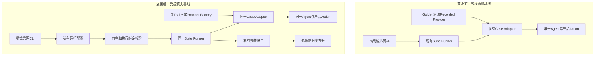
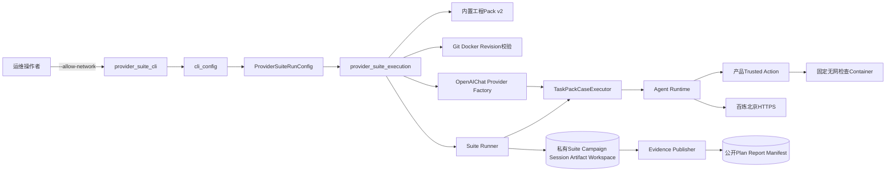
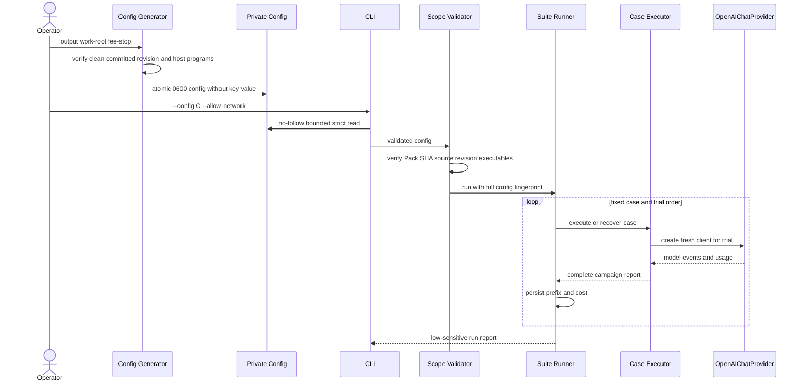
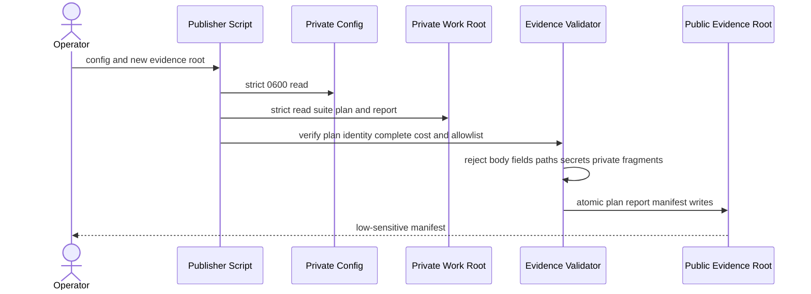
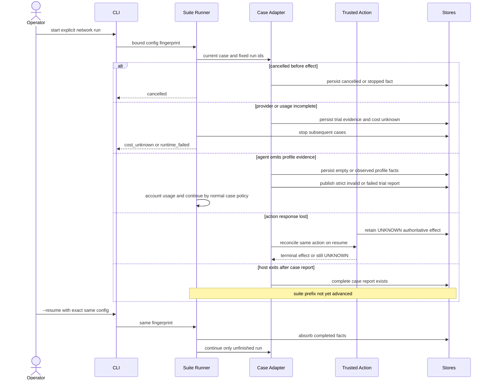
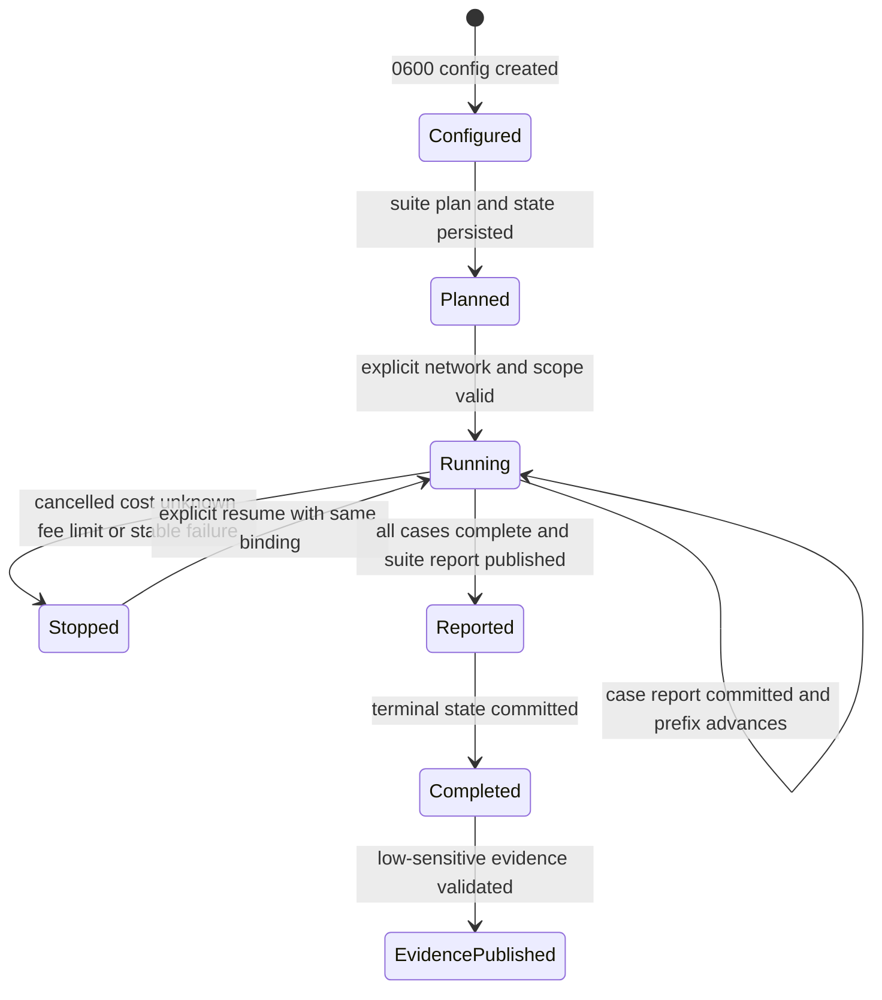
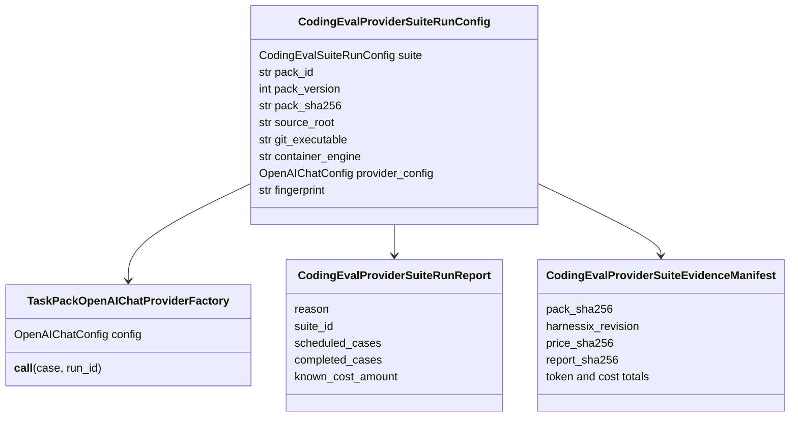
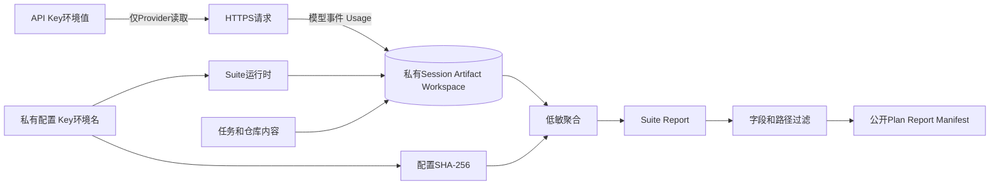

# 0.9.2e 受控真实Provider完整Suite详细设计

## 1. 文档摘要

| 项目 | 内容 |
|---|---|
| 变更目标 | 在不增加第二套Agent、Runner或Action Plane的前提下，通过真实OpenAI兼容Provider执行工程Pack v2完整10 Case × 2 Trial Suite |
| 当前能力 | 离线Recorded Provider完整Suite已验收；真实Provider私有配置、显式启网、恢复绑定和低敏证据为候选实现 |
| 完成边界 | 实现提交、全矩阵CI、固定模型真实运行、费用核对、公开证据冻结和文档同步全部完成后才关闭0.9.2e |
| 关键决策 | [ADR 0088](../adr/0088-controlled-real-provider-suite-baseline.md) |
| 源码研究 | [受控真实Provider完整Suite研究](../research/controlled-real-provider-suite.md) |
| 运维手册 | [真实Provider Suite运维](../operations/provider-suite-baseline.md) |

## 2. 需求背景

工程Pack v2已经用Recorded Provider在固定Container中完成20/20 Trial，并验证两个Suite报告提交窗口。然而Recorded事件由
Golden Patch驱动，只证明Harnessix的计划、Agent、Tool、Action、持久化、评分和恢复链正确，不证明真实模型能够：

- 根据任务描述自主读取仓库、定位问题并构造正确修改；
- 在正式Token预算、工具Schema和上下文历史下完成多步Agent Loop；
- 以真实Usage形成完整Token、成本和时延证据；
- 在模型失败、成本未知或费用达线时保持稳定停止语义。

同时，真实Provider会引入端点、凭据、地域、动态费用与网络。若简单把Recorded Factory替换为HTTP Client，恢复时可能在同一
Suite ID上更换Endpoint或模型限制，CLI也可能在操作者未显式授权网络时读取Secret。公开证据若直接复制私有运行目录，还会泄漏
Prompt、回答、工具参数、代码和宿主路径。

## 3. 设计目标与非目标

### 3.1 目标

1. 复用现有Suite Runner、Task Pack Case Adapter、Agent Runtime和产品Trusted Action主链；
2. 在首个Provider创建前冻结并校验Pack、源码Revision、宿主程序、模型、端点、凭据引用、价格和预算；
3. 默认禁网，只有显式CLI参数才允许读取私有配置和环境凭据；
4. 每Trial使用独立Provider生命周期，禁止自动重试和并行Tool Call；
5. 把完整私有配置摘要绑定Suite和Case恢复身份，拒绝重开漂移；
6. 沿用既有费用和成本完整性语义，在Trial边界停止后续请求；
7. 只发布严格白名单的低敏计划、报告和证据清单；
8. 对正常、取消、配置错误、身份漂移、成本未知、提交窗口和泄漏路径提供回归测试；
9. Agent未调用或少调用固定Profile时，不补造测试事实，也不把质量失败升级为Runner故障；已调用但缺少可信Process终态仍失败关闭；
10. 形成可由运维人员复跑、恢复、发布与清理的正式操作说明。

### 3.2 非目标

1. 不新增HTTP Action服务、Worker Queue、Eval专用Agent或第二套模型循环；
2. 不支持运行时任意Pack、动态URL、动态测试命令或自定义模型列表；
3. 不在默认CI中注入真实API Key或发起收费请求；
4. 不实现供应商账单拉取、账户硬预算或请求中的实时费用中断；
5. 不把单模型单地域结果外推为全Provider兼容性结论；
6. 不公开Session、Artifact、Workspace、Container输出、Prompt或模型回答；
7. 不把本切片升级为分布式并发评测平台。

## 4. 约束、假设与术语

| 术语 | 定义 | 设计影响 |
|---|---|---|
| 私有运行配置 | `CodingEvalProviderSuiteRunConfig`，含公共Suite配置和宿主/Provider绑定，但只含API Key环境变量名 | 必须0600保存，不进入公开证据 |
| 执行绑定 | 私有运行配置的SHA-256 | 同时进入Suite与Case状态指纹 |
| 显式启网 | CLI存在`--allow-network`且配置校验成功 | 缺少时不读配置、不读环境、不建Provider |
| 独立Trial | 唯一Run ID、Session、Workspace、Provider Client和效果事实 | 不跨Trial共享模型上下文或Client生命周期 |
| 费用停止线 | 完整Trial后核对累计已知费用，达线则不开始下一Trial | 不是供应商账户硬上限 |
| 价格区间 | 当前快照只覆盖单请求输入0～32,000 Token | 超区间成本未知并停止后续请求 |
| 公开证据 | Suite Plan、Suite Report和Evidence Manifest | 不含私有路径和正文 |

假设Docker固定镜像已可用、Git和Docker使用绝对可执行路径、源码树是干净已提交Revision、北京API Key由运行宿主通过环境变量临时注入。

## 5. 总体架构与变更前后对比

### 5.1 变更前后对比



图示说明：变更只在既有Runner外增加控制面和Provider Factory。`SR → CA → PA`与离线链完全相同；公开发布是运行完成后的独立只读步骤。

### 5.2 组件架构



依赖方向是单向的：Provider Suite层依赖既有Evals和Models；Suite Runner、Agent与Action不得反向依赖Provider Suite合同。

## 6. 模块职责与禁止边界

| 组件 | 职责 | 允许依赖 | 禁止行为 |
|---|---|---|---|
| `cli_config.py` | 读取0600、有界、严格JSON私有配置 | OS文件API、合同模型 | 解析Secret值、跟随链接、容错强转 |
| `provider_suite_contracts.py` | 约束Pack、Suite、模型、价格、隔离和公开输出 | Suite/Model/Pricing合同 | 发起网络、读取环境 |
| `provider_suite_cli.py` | 默认禁网、退出码和低敏CLI结果 | 私有Reader、执行入口 | 回显异常正文、配置、路径或Key |
| `provider_suite_execution.py` | 重验执行范围、创建每Trial Provider、调用现有Runner | Pack、Suite、Case Adapter、OpenAI Provider | 新建Agent Loop、直接执行Tool |
| `task_pack_suite.py` | Provider中立地确定性组合2 Trial/Case | Pack、Suite、Campaign合同 | 读取端点、Secret或Golden |
| `suite_execution.py` | 把可选宿主摘要绑定Suite状态 | 既有Suite状态 | 理解Provider字段 |
| `task_pack_execution.py` | 把可选Provider摘要绑定Case执行 | 既有Case Adapter | 直接创建HTTP Client |
| `provider_suite_evidence.py` | 严格重读、白名单构造和原子发布 | Suite Plan/Report | 复制私有目录或正文 |
| 运维脚本 | 生成固定配置、发布证据 | 正式合同/发布器 | 保存API Key、覆盖原配置 |

## 7. 正常流程

### 7.1 配置生成与执行时序



关键顺序：Suite Plan/State和Case Plan/State由既有Runner在模型请求前持久化；Provider Factory只在Trial实际进入Agent执行时调用，因此计划发布失败不会消费Key或网络。

### 7.2 证据发布时序



发布不读取Session和Artifact，也不遍历Workspace。Evidence Root与Work Root必须互不为父子，避免公开目录位于私有数据范围内。

## 8. 失败、取消与恢复流程

### 8.1 失败恢复时序



### 8.2 错误分类

| 条件 | 权威层 | 稳定行为 | 是否可恢复 |
|---|---|---|---|
| 缺少`--allow-network` | CLI | `network_not_enabled`，不读取配置 | 重新显式执行 |
| 配置权限/JSON/合同错误 | Config Reader | `configuration_invalid` | 修复前不得复用错误配置 |
| 缺少运行依赖 | CLI/Host Validator | `dependency_missing`或Runtime失败 | 安装依赖后同配置恢复 |
| Pack SHA漂移 | Scope Validator | `eval_provider_suite_pack_mismatch` | 不能用同Run偷换Pack |
| 源码Revision漂移 | Scope Validator | `eval_provider_suite_source_revision_mismatch` | 切回固定Revision |
| 程序无效 | Scope Validator | `eval_provider_suite_host_binding_invalid` | 修复绝对程序绑定 |
| 配置指纹漂移 | Suite/Case Store | 既有执行指纹不匹配 | 只能使用原配置 |
| Provider超时/协议错误 | Model/Agent | 当前Trial按既有终态和失败分类记录 | 按现有Run恢复，禁止隐式重试 |
| Agent未调用或调用次数不足 | Trial Adapter/Grader/Suite投影 | 空或部分观测进入严格Grader，Trial为`invalid/failed`；任务声明的必需检查仍记为适用且失败，不补造、不崩溃 | 终态Session可只读重算报告，不重开Provider |
| Profile调用存在但缺少可信Process终态 | Trusted Action/Trial Adapter | `eval_baseline_invalid`失败关闭，不伪装为质量分数 | 修复执行链后按固定Revision策略处理 |
| Usage缺失/超价阶 | Campaign/Suite | `cost_unknown`并停止下一Trial/Case | 需调查；不得直接继续收费 |
| 达费用停止线 | Suite | `fee_limit_reached`，不开始下一项 | 只能显式评审后处理 |
| 取消 | Agent/Suite | 稳定取消事实和完成前缀 | 显式`--resume` |
| Action未知结果 | Trusted Action | `UNKNOWN → reconcile` | 由效果权威层核对，Runner不猜 |
| 报告已写未提交状态 | Suite Runner | 重开严格核对并吸收报告 | 是，不重复Case |
| 公开证据含敏感字段/路径 | Publisher | 发布失败，不产生完成声明 | 清理新Evidence Root后复核 |

## 9. 状态、持久化与事务

### 9.1 状态图



### 9.2 持久化布局

```text
private-config.json                 0600，位于仓库外，只含API Key环境变量名
private-work-root/                  0700
  suite-plan.json                   0600，首个模型请求前
  suite-state.json                  0600，执行绑定、连续前缀、停止原因
  suite.lock                        0600，单写者
  cases/<case-id>/                  0700，Campaign/Run/Session/Artifact/Workspace
  suite-report.json                 0600，全部Case完整后

public-evidence-root/               与私有根相互独立
  suite-plan.json                   0600，低敏公开合同
  suite-report.json                 0600，低敏聚合与Case证据
  evidence-manifest.json            0600，白名单摘要
```

写入均使用临时文件、`fsync`、原子替换和目录`fsync`。私有配置创建时拒绝覆盖，确保恢复始终复用同一字节事实。

### 9.3 并发、幂等与恢复绑定

- 一个Suite只允许一个持锁写者；并发宿主不能消费同一Case前缀；
- Case和Run ID由Suite ID、Pack ID、Pack版本、Case ID与Trial序号使用UUIDv5稳定派生；
- `execution_binding_sha256`把公共Suite配置摘要与私有宿主摘要组合，旧离线调用省略时保留原摘要；
- `provider_binding_sha256`进入Case执行指纹，防止Case报告复用到另一端点/Key引用/限制；
- 已完成Case只严格重读报告，不重新创建Provider；
- 已完成Turn即使没有Profile调用，也以空Observation持久化并生成严格失败报告，不把Agent行为缺失误报为基础设施崩溃；
- Campaign发布终态必须基于执行循环返回的最新State，完整写入连续Run ID前缀和已知成本，禁止旧快照覆盖进度；
- Suite Report发布后进程退出，重开只吸收报告并提交终态。

## 10. 领域契约、数据结构、类与接口设计

### 10.1 类图



### 10.2 重点字段

| 字段 | 来源 | 约束 | 用途 |
|---|---|---|---|
| `suite.plan.environment` | 配置生成器 | Provider/model/revision/isolation固定 | 公共执行身份 |
| `pack_sha256` | 已核验内置Pack | 64位小写SHA-256 | 防Wheel资源漂移 |
| `source_root` | 当前源码树 | 规范绝对路径 | Revision校验，不公开 |
| `git_executable` | `shutil.which`后严格解析 | 可执行普通文件绝对路径 | 防PATH漂移 |
| `container_engine` | 同上 | 可执行普通文件绝对路径 | 固定检查宿主绑定 |
| `api_key_env` | 默认`DASHSCOPE_API_KEY` | 仅环境变量名 | 不保存Secret值 |
| `max_attempts` | 固定1 | 不允许自动重试 | 请求、费用和失败可解释 |
| `parallel_tool_calls` | 固定false | 串行Tool Call | 与当前Agent调度和费用基线一致 |
| `fee_stop_amount` | 操作参数，默认40 CNY | 与Price币种一致 | Trial边界停止 |
| `fingerprint` | 全配置内容摘要 | 64位SHA-256 | Suite和Case恢复绑定 |
| `cost_completeness` | 报告聚合 | 公开Manifest必须`complete` | 禁止未知成本发布完成证据 |

### 10.3 公共入口

```python
async def run_task_pack_provider_suite(
    config: CodingEvalProviderSuiteRunConfig,
    *,
    allow_network: bool = False,
    resume: bool = False,
    cancel: CancelToken | None = None,
    observability: Observability | None = None,
    fault: Fault | None = None,
) -> CodingEvalSuiteRunReport: ...


def publish_provider_suite_evidence(
    config: CodingEvalProviderSuiteRunConfig,
    evidence_root: Path,
) -> CodingEvalProviderSuiteEvidenceManifest: ...
```

`fault`仅供故障注入测试使用；生产CLI不暴露它。执行函数必须显式收到`allow_network=True`，不能从配置推导权限。

## 11. 数据流与隐私边界



| 数据 | 敏感级别 | 持久位置 | 公开策略 |
|---|---|---|---|
| API Key值 | Secret | 仅进程环境和Provider Client | 永不持久化/回显 |
| Endpoint、程序、源码根、Key环境名 | 私有运行元数据 | 0600配置 | 只以整体摘要绑定，不复制 |
| Prompt、模型回答、Tool参数/输出 | 高敏 | 私有Session/Artifact | 禁止公开 |
| 仓库源码与Diff | 高敏 | 私有Workspace/Artifact | 禁止公开 |
| Provider/模型/地域/价格来源 | 低敏 | Plan/Manifest | 可公开 |
| Token、成本、时延、成功计数 | 低敏聚合 | Suite Report/Manifest | 可公开 |
| 绝对路径 | 宿主隐私 | 私有配置与状态 | 发布器拒绝 |

## 12. 安全设计

1. **网络最小授权**：CLI缺少显式开关时在读取配置前退出；代码检查Container保持无网；
2. **Secret最小化**：配置只引用环境变量，Provider沿用Models模块的安全配置；
3. **文件安全**：私有配置0600、`O_NOFOLLOW`、普通文件、大小上限、严格UTF-8/JSON；
4. **宿主身份**：Git/Docker绝对路径、可执行普通文件、源码HEAD与计划Revision一致；
5. **Pack身份**：仅代码Catalog中的工程Pack v2，运行前复核Manifest SHA；
6. **请求可解释**：无自动重试、串行Tool、固定输出上限和超时；
7. **证据最小化**：白名单构造而不是目录复制，递归禁止正文型字段和路径；
8. **失败关闭**：未知成本、身份漂移、报告不完整或敏感字段命中都不发布完成证据。

## 13. 可观测性

沿用现有Observability、Session Event、Action Audit、Process Artifact、Campaign Report和Suite Report。新增CLI公开结果只包含：

- 稳定`reason`；
- Suite ID；
- 计划和完成Case数；
- 当前Case ID；
- 报告是否发布；
- 已知成本币种和金额。

禁止输出配置、绝对路径、响应ID、供应商错误正文、模型回答或Secret。深度诊断保留在受限私有运行目录，由既有诊断和权限边界处理。
当已识别的取消或Runtime失败发生时，CLI会尝试严格读取私有`suite-state.json`；只有Suite ID、Plan Fingerprint、
执行绑定、连续Case前缀、下一Case和成本币种全部与当前配置一致，才公开已完成Case数、当前Case及已知成本。状态缺失、损坏或身份不一致
均回退到零进度，读取错误和私有内容不得进入CLI输出。

## 14. 兼容与迁移

本切片不修改数据库Schema、Session协议或Suite Plan/Report公开Schema。新增三个独立JSON Schema：

- `harnessix.coding-eval-provider-suite-run-config/v1`；
- `harnessix.coding-eval-provider-suite-run-report/v1`；
- `harnessix.provider-suite-evidence/v1`。

Suite/Case执行绑定参数是可选值。省略时执行指纹完全沿用原算法，既有离线Plan、State、Report和冻结证据无需迁移。真实Provider Run必须始终传入绑定摘要，不能降级省略。

首个真实Trial证明模型可能在终态前完全不调用固定Profile。为避免把该行为事实升级为`runtime_failed`，
`CodingEvalRunState.baseline_observations`的v1 JSON Schema由“至少一项”放宽为“允许空集合、最多32项”。这是向后兼容的
读取放宽：既有非空状态原字节仍有效；新状态只在Session已终态且Grader已生成严格报告后写入。Adapter不得合成Return Code、
不得在模型结束后旁路执行Profile；空Baseline/Final分别使既有`baseline_checks_failed`、`final_check_set_matched`及行为检查失败，
报告保持可审计的`invalid/failed`结论。

第二次受控运行进一步证明：空Observation虽然已经可以完成20个Trial，但若Suite把空Final解释为
`not_applicable`，聚合会因“没有适用测试”失败。工程Pack中的每个Task都声明必需的Behavior/Regression Check，
因此“模型没有运行测试”必须投影为`outcome=failed`、`total_checks=任务声明检查数`、`passed_checks=0`，而不是不适用。
该修正不改变Grader、Task成功数或Process证据，也不合成任何测试结果；它只纠正Suite测试分母的业务语义。

## 15. 测试设计与验收矩阵

| 层级 | 场景 | 期望 |
|---|---|---|
| Contract | Provider/model/price/billing/隔离不一致 | 严格拒绝 |
| Contract | 并行Tool、自动重试、输出上限过大、Case数错误 | 严格拒绝 |
| Config IO | 非0600、链接、特殊文件、超限、重复键、NaN | 读取失败 |
| CLI | 缺少`--allow-network`且配置不存在 | 不读取文件，`network_not_enabled` |
| CLI | Kernel错误或内部异常 | 只输出白名单Reason，不泄漏异常正文 |
| CLI | Runtime失败且存在身份一致的Suite状态 | 保留连续完成Case数、当前Case和已知成本；损坏或异源状态回退为零 |
| Execution | Pack SHA、源码Revision、程序漂移 | Provider创建前失败 |
| Execution | 每Trial Provider Factory | 独立Context Manager，不共享状态 |
| Grading | 终态Agent未调用固定Profile | 空Baseline/Final进入Grader并发布严格失败报告，不抛Runner异常、不重开Provider |
| Suite投影 | Task声明必需检查但Final为空 | 该Trial计入适用分母并记失败，完整Suite仍可聚合发布 |
| Campaign提交 | 两个Trial正常完成 | Campaign状态保存精确Run前缀、成本和Report摘要，不被循环前旧State覆盖 |
| Recovery | Suite宿主绑定改变 | 同Run恢复失败 |
| Recovery | Case Provider绑定改变 | 同Case报告不可复用 |
| Compatibility | 离线调用不传绑定 | 原执行指纹保持不变 |
| Evidence | Plan/Report不匹配或成本未知 | 不发布 |
| Evidence | Prompt/Response/Arguments/Diff/路径/Secret | 递归拒绝 |
| Evidence | 私有根与公开根相同或父子关系 | 拒绝 |
| Evidence | 完整报告 | 只写Plan、Report、Manifest且可严格重读 |
| Integration | 固定模型完整10 Case × 2 Trial | 完成或按稳定停止原因保留可恢复事实 |
| Governance | Schema、文档、链接、Mermaid、可读性 | 门禁全部通过 |

0.9.2e完成阈值不是“CLI能够连接模型”，而是：实现和文档CI通过、真实完整Suite按合同终结、低敏证据可重算、费用在授权范围内，并且失败/恢复事实完整。

## 16. 源码与测试映射

| 设计元素 | 源码 | 关键符号 | 测试 |
|---|---|---|---|
| 私有配置/公开合同 | [`provider_suite_contracts.py`](../../src/harnessix/evals/provider_suite_contracts.py) | `CodingEvalProviderSuiteRunConfig`、`CodingEvalProviderSuiteRunReport`、`CodingEvalProviderSuiteEvidenceManifest` | [`test_provider_suite_contracts.py`](../../tests/evals/test_provider_suite_contracts.py) |
| 严格配置读取 | [`cli_config.py`](../../src/harnessix/evals/cli_config.py) | `read_private_eval_config` | [`test_provider_suite_cli.py`](../../tests/evals/test_provider_suite_cli.py) |
| CLI网络门禁与失败进度 | [`provider_suite_cli.py`](../../src/harnessix/evals/provider_suite_cli.py) | `main`、`_public_report`、`_trusted_progress` | [`test_provider_suite_cli.py`](../../tests/evals/test_provider_suite_cli.py) |
| 真实Provider执行 | [`provider_suite_execution.py`](../../src/harnessix/evals/provider_suite_execution.py) | `TaskPackOpenAIChatProviderFactory`、`run_task_pack_provider_suite` | [`test_provider_suite_execution.py`](../../tests/evals/test_provider_suite_execution.py) |
| 通用Suite组合 | [`task_pack_suite.py`](../../src/harnessix/evals/task_pack_suite.py) | `build_task_pack_suite_config` | [`test_task_pack_suite.py`](../../tests/evals/test_task_pack_suite.py) |
| Suite恢复绑定 | [`suite_execution.py`](../../src/harnessix/evals/suite_execution.py) | `_SuiteExecutionBinding`、`run_coding_eval_suite` | [`test_suite_execution.py`](../../tests/evals/test_suite_execution.py) |
| Case恢复绑定与Campaign提交 | [`task_pack_execution.py`](../../src/harnessix/evals/task_pack_execution.py) | `_execution_fingerprint`、`_execute_remaining`、`_publish_campaign`、`TaskPackCaseExecutor` | [`test_task_pack_execution.py`](../../tests/evals/test_task_pack_execution.py)、[`Container集成测试`](../../tests/integration/test_task_pack_execution.py) |
| 缺失Profile的可评分恢复 | [`task_pack_trial.py`](../../src/harnessix/evals/task_pack_trial.py)、[`contracts.py`](../../src/harnessix/evals/contracts.py) | `_profile_observations`、`CodingEvalRunState.baseline_observations` | [`test_task_pack_execution.py`](../../tests/evals/test_task_pack_execution.py)的空观测与状态合同回归 |
| 必需测试的Suite投影 | [`suite.py`](../../src/harnessix/evals/suite.py) | `build_coding_eval_suite_case_report` | [`test_suite.py`](../../tests/evals/test_suite.py)的缺失Profile分母与零通过回归 |
| 证据发布 | [`provider_suite_evidence.py`](../../src/harnessix/evals/provider_suite_evidence.py) | `validate_publishable_suite_evidence`、`publish_provider_suite_evidence` | [`test_provider_suite_evidence.py`](../../tests/evals/test_provider_suite_evidence.py) |
| 配置生成 | [`create_engineering_provider_suite_config.py`](../../scripts/create_engineering_provider_suite_config.py) | `main`、`_price`、`_write_private` | 由合同、CLI和真实操作验收共同覆盖 |
| 证据发布操作 | [`publish_provider_suite_evidence.py`](../../scripts/publish_provider_suite_evidence.py) | `main` | 证据发布测试及真实证据严格重读 |

## 17. 核心业务逻辑伪代码

### 17.1 执行

```text
if allow_network is not exactly true:
    fail network_disabled before reading secret

strictly revalidate run_config
load built-in pack and compare pack_sha256
resolve and validate absolute git/container executables
read source HEAD with hooks, pager, prompt and global config disabled
require HEAD == suite.environment.harnessix_revision

provider_factory = fresh OpenAIChatProvider(run_config.provider_config) per trial
case_executor = TaskPackCaseExecutor(
    pack,
    provider_factory,
    provider_binding_sha256=run_config.fingerprint,
)
return run_coding_eval_suite(
    suite_config,
    case_executor,
    execution_binding_sha256=run_config.fingerprint,
    resume=explicit_resume,
)
```

### 17.2 公开证据

```text
require private_work_root and evidence_root are distinct and non-nested
strictly read suite plan and complete suite report
require plan == config.plan == report.plan
require report.cost_completeness == complete
build manifest from explicit low-sensitive fields
for plan, report, manifest:
    recursively reject forbidden keys
    reject POSIX/Windows absolute paths
    reject source/work/executable private fragments
atomically write only plan, report, manifest
return manifest
```

### 17.3 必需测试、Campaign提交与失败进度

```text
expected_checks = sorted(task.behavior_checks + task.regression_checks)
observed_final = report.final_observations
test_outcome = passed only when observed ids exactly equal expected ids and all passed
otherwise test_outcome = failed
total_checks = len(expected_checks)
passed_checks = count passed observations whose id belongs to expected_checks

latest_state, stopped = execute_remaining_trials(state)
if stopped:
    return stopped
publish_campaign(report, latest_state)

on identified CLI failure:
    state = strictly_read_private_suite_state()
    if suite, plan, execution_binding, prefix, next_case and currency all match config:
        expose only completed_count, current_case and known_cost
    else:
        expose zero progress without read error details
```

## 18. 部署与操作

本能力不增加常驻服务、中间件、数据库或开放端口。运行宿主需要Python环境、固定Docker镜像、Git、Docker Engine和可访问北京百炼兼容端点的HTTPS网络。配置、执行、恢复、发布与销毁步骤见[运维手册](../operations/provider-suite-baseline.md)。

### 18.1 受控运行发现与修正边界

首轮候选运行在一个正常终态Trial中发现模型完全跳过固定Profile，原Adapter以`eval_baseline_missing`终止。
兼容修正确认空Profile事实应进入严格评分，并由Revision `dd8b997`及[CI 35488863702](https://github.com/carrie1988/Harnessix/actions/runs/35488863702)
完成六实例验收。

基于该Revision的第二轮运行完成10 Case × 2 Trial并形成CNY 1.44998完整已知成本，但最终Suite聚合失败：20个
Trial均没有Final Profile Observation，旧投影把它们标记为`not_applicable`，与Suite“至少一个适用测试”的合同冲突。
同一运行还暴露Campaign发布使用循环前State会覆盖已完成Run前缀，以及CLI在Runtime失败时固定回报零进度/零成本。
本版本分别修正测试分母、Campaign最新State提交和CLI可信进度投影。旧运行绑定旧Revision，只作为私有诊断事实，
不得跨Revision恢复、发布或拼接为最终基线；候选通过CI后必须创建新的Suite ID和私有运行根重新验收。

## 19. 风险、限制与后续工作

| 风险/限制 | 当前缓解 | 后续 |
|---|---|---|
| Trial中途费用可越过本地停止线 | 40元保守线、无重试、输出上限4096 | 0.9.6评估供应商账户硬预算/账单对账 |
| 单请求超过32K后成本未知 | 超区间停止，不低价估算 | 新建覆盖高价阶的审计快照后另行运行 |
| Provider网络不在Container内 | 显式宿主网络，工具检查无网，Secret最小化 | 0.9.4/0.9.6评估受管出口 |
| 单模型结果不可泛化 | Manifest固定Provider/模型/地域 | 0.9.6扩展能力矩阵 |
| 真实模型可能无法完成全部Case | 保存稳定失败和完整低敏指标，不修改评分标准 | 以失败分类驱动后续Agent改进 |
| 模型可能跳过固定Profile | 空观测进入严格Grader；不补造、不旁路执行、不误报Runner故障 | 用真实失败分布改进Prompt、工具可发现性和Agent策略 |
| 全部Trial缺失测试会造成零适用分母 | Task声明检查仍按适用失败计数；不改变严格评分 | 用新Revision完整Suite验证0/20等真实结果可以发布 |
| Runtime失败掩盖已消费费用 | CLI仅从身份一致状态公开连续进度与已知成本 | 继续以私有状态和供应商账单双向核对 |
| Evidence Report字段未来扩展 | 递归禁止字段和绝对路径，合同版本化 | 新字段必须先通过泄漏审查 |

在真实运行和证据冻结前，本变更保持`reviewing`，不得在README中宣称0.9.2e完成。
