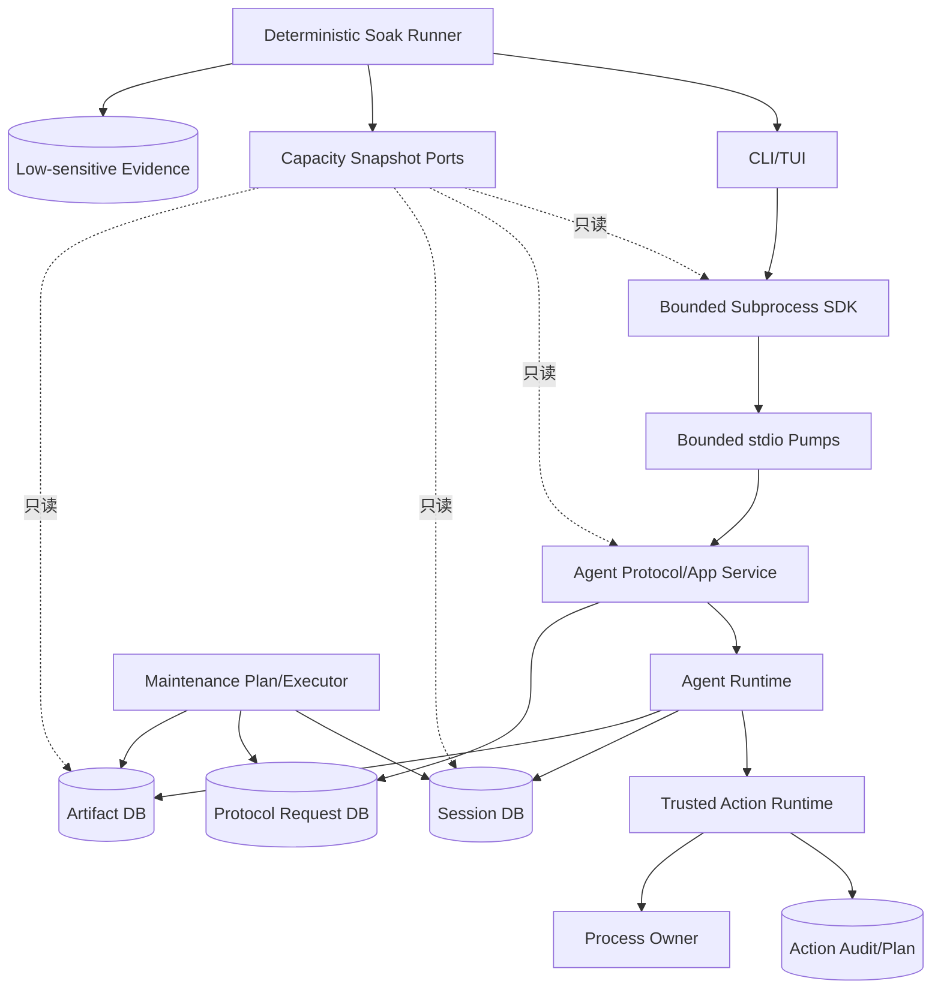
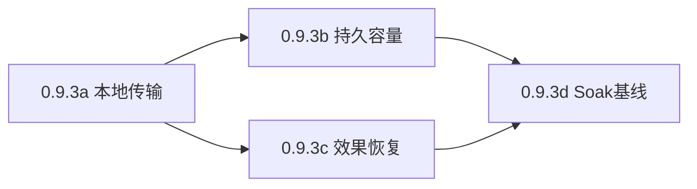
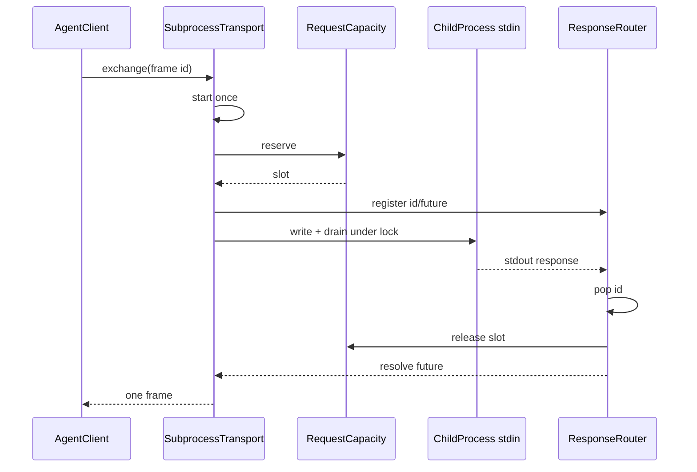
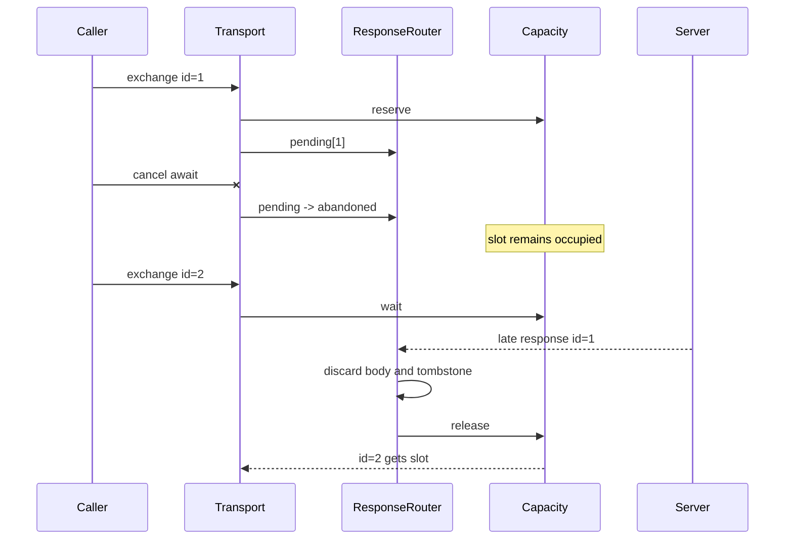
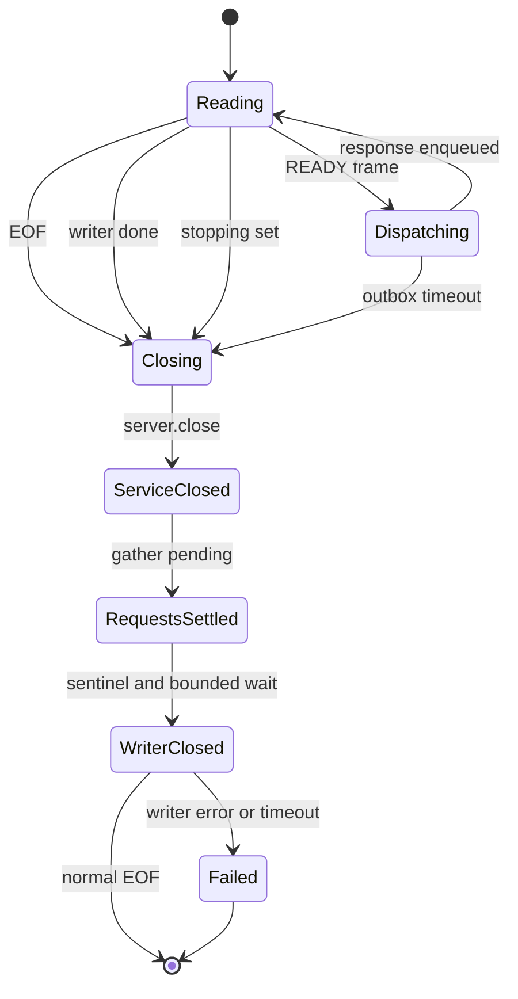
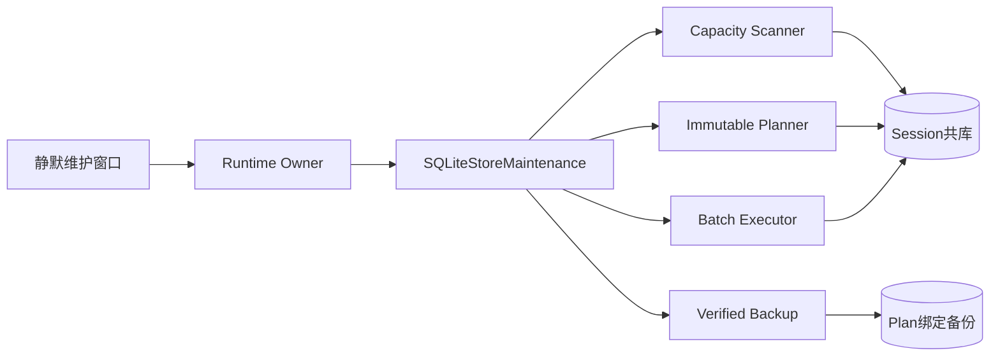

# 0.9.3 可靠性与性能详细设计

## 1. 变更摘要

| 项目 | 内容 |
|---|---|
| 需求 | 长会话Soak、进程/数据库/客户端故障注入、并发与锁、内存、启动时延、Artifact和数据库增长基准 |
| 产品边界 | 单一Coding Agent；不恢复独立Action HTTP/Worker，不新增性能控制面服务 |
| 当前状态 | 0.9.3a已由CI关闭；0.9.3b实现与本地全仓验证完成、全矩阵CI待完成；0.9.3c～d尚未完成，0.9.3总项保持进行中 |
| 主要模块 | App Server、SDK、Session、Protocol Request、Artifact、Trusted Action、Process、Observability |
| 兼容级别 | 0.9.3a不改协议/数据库；b/c如需Migration必须前向升级、备份恢复和故障回滚 |
| 发布单元 | a本地传输；b持久容量；c效果恢复；dSoak与发布基线 |
| 当前实现Revision | 0.9.3a `f11359447f3bc68ffb97a100bb8b4bbcc1a891e5`；0.9.3b `cb3f3ea834624d5a8f84396952eba212650065d1` |
| 当前验收 | 0.9.3a由[CI 35494960166](https://github.com/carrie1988/Harnessix/actions/runs/35494960166)六实例关闭；0.9.3b本地`make check`为3589 passed、32 skipped，CI待完成 |

## 2. 需求背景与完成定义

0.9.2已经证明唯一Agent主链能在固定任务集上执行和保存证据，但“20个Trial正常结束”不能证明一个本地产品在数日
会话、大量Thread、客户端断裂、数据库增长和效果恢复竞争中仍然可靠。0.9.3必须把运行时间和故障数量当作输入，给出
可重现、可比较、可失败关闭的产品证据。

源码证据和参考项目取舍见[专项研究](../research/reliability-and-performance.md)，首个传输决策见
[ADR 0089](../adr/0089-bounded-local-transport-lifecycle.md)。

0.9.3完成必须同时满足：

1. 本地stdio/SDK对慢写、断裂、取消和关闭具有有界语义；
2. 三类核心持久数据有容量快照、保留/清理计划、崩溃恢复和备份边界；
3. Trusted Action/Process在多宿主竞争和跨Store故障下不重复效果、不把未知当成功；
4. 固定长会话场景记录峰值内存、启动时延、操作延迟、数据库/Artifact增长与清理后水位；
5. 阈值在固定环境下可重跑，原始证据低敏、完整且不选择性删除失败；
6. Linux/macOS/Windows平台边界与真实执行差异明确；
7. 设计、源码、测试、运维和发布状态同步。

## 3. 设计目标、非目标与SLO边界

### 3.1 目标

- 所有无界或长寿命集合具有明确Owner、容量或清理策略；
- 取消、超时、进程退出和数据库异常有稳定失败分类；
- 清理操作不破坏活跃Thread、Pending Command、Artifact引用或UNKNOWN效果；
- Soak报告同时保存负载、机器、Revision、样本数、分位数和失败数；
- 性能退化以版本化阈值阻断，不依赖人工观察终端；
- 生产热路径不因采集指标保存Prompt、代码、路径或Tool正文。

### 3.2 非目标

- 不在0.9.3建设云端Benchmark平台、多租户调度或公网Agent Server；
- 不承诺任意硬件上的固定绝对延迟；
- 不以Microbenchmark替代真实产品纵向Soak；
- 不在清理时改写历史业务结果或压缩审计Hash链；
- 不把SQLite替换为远程数据库作为“性能优化”；
- 不在本阶段解决安装器、升级包签名或供应链扫描；
- 不把Provider质量0/20问题归因于传输性能。

### 3.3 指标分类

| 分类 | 指标 | 解释限制 |
|---|---|---|
| 启动 | 冷启动、已有数据库启动、恢复扫描时延 | 必须绑定数据库规模和是否恢复 |
| 交互 | 创建Thread、提交Turn、Replay、列表、Artifact分页P50/P95/P99 | 不把模型网络时延混入本地存储指标 |
| 容量 | RSS峰值、Pending/Abandoned、Delta、后台Task | RSS受Python和平台分配器影响，比较需同平台 |
| 增长 | Session DB、WAL、Protocol记录、Artifact正文/索引字节 | 同时记录逻辑记录数和文件字节 |
| 清理 | 扫描数、删除数、跳过活跃数、前后水位、耗时 | Vacuum与逻辑删除分开 |
| 恢复 | 故障注入点、恢复结果、重复效果数、UNKNOWN数 | 0重复效果优先于追求自动成功 |

## 4. 总体架构



设计约束：Snapshot、Maintenance和Soak是同一产品的诊断/验证能力，不是第二套Agent执行面；它们不能直接执行Tool，
不能绕过Policy，也不能成为Session或Action结果权威。

## 5. 分片与依赖顺序



| 切片 | 交付 | 前置 | 当前状态 |
|---|---|---|---|
| a | stdio/SDK协商背压、迟到Response、取消安全Close、资源快照 | 0.9.2 | 已由CI 35494960166验收关闭 |
| b | Session/Protocol/Artifact容量合同、保留计划、清理、崩溃恢复 | a | 实现与本地门禁完成；全矩阵CI待完成 |
| c | Action/Process Owner fencing、孤儿扫描、Route Deadline、恢复信号 | a | 未实施 |
| d | 固定Soak负载、三平台/Container证据、阈值与发布报告 | b、c | 未实施 |

## 6. 0.9.3a接口设计与本地传输可靠性

### 6.1 组件职责

| 组件 | 职责 | 禁止行为 |
|---|---|---|
| `_StdioReader` | 从同步stdin读取单行，投递容量1 Mailbox | 解码JSON、调用Runtime、缓存多行正文 |
| `_StdioWriter` | 顺序写帧、传播空间/终结、记录单一失败 | 重排Response、吞掉写失败、持久正文 |
| `run_stdio` | 握手串行、READY并发、统一停止与关闭 | 把断线当Turn取消、重试命令 |
| `_RequestCapacity` | 约束Pending+Abandoned共享槽位 | 理解JSON-RPC业务方法 |
| `_ResponseRouter` | ID归并、迟到丢弃、Future失败 | 启动或终止进程 |
| `_ChildProcess` | 子进程、stdin写锁、Reader/Stderr Task、关闭升级 | 解析业务Result |
| `SubprocessAgentTransport` | 公共Exchange/Notify/Close和快照编排 | 自动重连或业务重试 |

### 6.2 正常请求时序



### 6.3 取消与迟到Response时序



取消只改变客户端等待，不证明Server没有提交事实。若Server永不响应，连接容量最终饱和，操作者或上层恢复会关闭该连接，
而不是静默遗忘身份后继续无限接收。

### 6.4 stdio停止与Writer故障



Reader/Writer守护线程承担不可取消同步调用；Event Loop只等待Mailbox/Event。Writer阻塞不会让默认线程池在解释器退出时
继续持有非守护线程。底层Write是否最终返回不影响主协程按期限失败。

### 6.5 数据结构与字段

#### `SubprocessTransportSnapshot`

| 字段 | 含义 | 敏感性/约束 |
|---|---|---|
| `state` | `not_started/running/exited/failed/closing/closed` | 低基数，不含PID |
| `max_pending_requests` | Pending+Abandoned共享上限 | 1～1024 |
| `pending_requests` | 当前等待Response数 | 不含ID |
| `abandoned_requests` | 调用方已取消、等待迟到Response数 | 不含ID |
| `stderr_tail_bytes` | 当前尾部缓冲字节数 | 不含正文，最大65536 |
| `failure_code` | Sticky稳定失败Code | 不含异常原文 |

#### `ProtocolLimits`执行点

| 字段 | Server执行点 | SDK本地执行点 |
|---|---|---|
| `maxMessageBytes` | Reader上界+Codec | Subprocess stdout StreamReader+严格Response Decoder |
| `maxPendingRequests` | READY后Semaphore | 构造时`max_pending_requests`共享容量 |
| `maxOutboundMessages` | Writer入队逻辑门禁 | 不适用，SDK每Request只等一个Response |
| `maxReplayEvents` | Service/Client现有Replay门禁 | AgentClient协商后前置校验 |

### 6.6 核心伪代码

```text
run_stdio:
  start daemon reader and writer
  while first(reader line, writer done, stopping) is reader line:
    if handshake not ready:
      process inline and enqueue responses with deadline
    else:
      lazily create semaphore from negotiated maxPendingRequests
      acquire and spawn dispatch
  set stopping; stop reader
  close server; gather accepted dispatch tasks
  close writer with sentinel and deadline
  raise writer failure or outbound timeout after cleanup
```

```text
exchange(frame):
  parse request id; start process once
  reserve shared capacity
  register future before write
  write under one lock
  await shield(future)
  on caller cancellation: pending -> abandoned, keep capacity
  on other failure before response: remove pending, release capacity
```

```text
close():
  under close lock:
    if no close task:
      mark closed; fail/wake router
      create owned child shutdown task
  await shield(the same task)
```

### 6.7 失败矩阵

| 故障 | 检测点 | 结算 | 对持久事实的影响 |
|---|---|---|---|
| stdout write/flush异常 | Writer线程 | Writer Done，主循环关闭后重抛 | 无回滚 |
| Outbox满 | Enqueue Deadline | 设置Stopping，最终Timeout | 无回滚 |
| stdin读取异常 | Reader线程 | 主循环异常进入Finally | 无回滚 |
| SDK stdout非法 | Response Decoder | 全Pending失败，容量清空 | 业务结果未知，需查询 |
| SDK stdout EOF | Reader | `server_closed` | 同上 |
| Exchange取消 | Caller Task | Abandoned占槽 | 不推断业务取消 |
| Close取消 | Caller Task | 内部Close继续 | 无 |
| Graceful退出超时 | Child Owner | Terminate → Kill | 不推断Turn结果 |

## 7. 0.9.3b持久容量、保留与恢复实现

0.9.3b已形成独立的[详细设计](m09-3b-persistent-capacity-and-retention.md)和
[ADR 0090](../adr/0090-plan-first-store-maintenance-and-backup.md)。实现Revision
`cb3f3ea834624d5a8f84396952eba212650065d1`已通过本地全仓门禁；Linux、macOS、Windows、固定Container和
Documentation CI完成前，本切片仍保持未关闭。

### 7.1 共库维护边界

`SQLiteStoreMaintenance`是唯一Coding Agent宿主内的离线维护端口，不是独立服务。Session、Protocol Request和Artifact仍位于
同一Harnessix SQLite文件；维护能力只组合它们的容量与保留语义，不执行Tool、模型或外部效果，也不向Agent Protocol注册方法。



容量快照可以只读获取；Plan、Execute和Restore要求活跃Runtime Owner。Owner只排除第二进程，宿主还必须停止同进程业务
调用并排空活动操作，不能把SQLite偶然串行化描述为支持在线Maintenance。

### 7.2 容量合同

`StoreCapacityReport`在同一读事务中固定返回Session、Protocol Request、Artifact三类快照，包含Schema、数据库/WAL字节、
逻辑分类计数、时间水位、活动/终态/未知数量和Artifact正文总字节。扫描同时验证Thread投影与Event序号、Protocol结果摘要和
Artifact时间字段；损坏时失败关闭。公开合同不包含Thread/Request/Artifact ID、路径、Prompt或正文。

### 7.3 Plan-first与禁删集合

`RetentionPolicy`显式给出Cutoff、最多10000个候选和三类动作开关。Planner在`BEGIN IMMEDIATE`内写入不可变Plan、按序Item和
独立Progress；公开Plan只含候选/保护计数和候选集合SHA-256，内部Key留在Item表。

禁删集合包括：

- 未归档、活动Turn、保留期内或包含不确定效果的Thread；
- 作为其他Thread Fork来源的Thread；
- 活动或不确定Thread拥有的Artifact，以及保留期内正文；
- `accepted` Protocol Request本身；
- 任意`accepted`存在时的全部Session和Artifact，因为账本只保存参数摘要，不能恢复精确目标。

Thread候选与其Published Artifact Body组成不可拆分依赖组，Item顺序保证先把正文转为Tombstone，再删除Thread所属Manifest、Event和
Projection。终态Protocol Request按更新时间和Cutoff独立删除。

### 7.4 崩溃恢复和备份

执行前强制创建完整SQLite备份，验证`application_id`、`quick_check`和Plan Payload摘要，再以临时文件、`fsync`和原子替换
发布。Progress从`planned`CAS到带备份摘要的`running`后才执行第一批。

每批事务重新验证Plan、Item、当前事实和禁删集合；符合条件则Apply，候选变化或新增未决请求则Skip。业务变更与
`next_ordinal/applied/skipped`同事务提交，进程退出后使用同一Plan和同一Backup从精确Ordinal继续，不重新选择候选。

显式Restore先验证备份，Checkpoint当前WAL，把备份复制到同目录临时文件并复核摘要，再原子替换数据库、删除旧WAL/SHM并
重新初始化。Restore是完整回滚，不合并备份之后的新事实。

### 7.5 Migration 26与物理空间边界

Migration 26为Artifact增加`created_at`，旧行以`expires_at`保守回填，并新增Plan、Item、Progress三张`STRICT`表。所有当前
Artifact发布路径经显式列写入Helper保存发布时间。Migration不创建Plan、不删除数据、不修改Event/Thread JSON。

Artifact清理只清空Body并保留Expired Tombstone；Thread满足全部条件后才删除所属记录。SQLite释放页不代表文件立即缩小，
本切片不自动Checkpoint或Vacuum；锁时长、额外磁盘和三平台性能证据属于0.9.3d。

### 7.6 持久化、事务与数据流程

Plan、Item和Progress持久化在Session共库；规划事务只写候选事实，不修改业务行。首次执行先在事务外生成完整备份，再以短
事务把备份摘要和`running`状态提交；每个有界批次在同一`BEGIN IMMEDIATE`中完成业务Apply/Skip和Progress游标推进。
公开数据流只从业务行聚合到计数、时间、字节和摘要，内部Key不离开维护表。完整表结构、提交时序和崩溃窗口见
[0.9.3b专项详细设计](m09-3b-persistent-capacity-and-retention.md)。

## 8. 0.9.3c 效果恢复设计边界

本切片不扩大Tool能力，只补足已有Trusted Action/Process的Owner和恢复：

1. 产品Action Runtime启动前取得跨进程Owner Lease/Fence；
2. 旧Owner或Fence失效后不能继续提交终态；
3. 启动扫描同时检查Plan/Audit、Session、Process Lease和Artifact引用孤儿；
4. Route Deadline到期不直接判失败效果，证明不足进入UNKNOWN；
5. Reconcile每轮有界且不调用Execute；
6. 所有恢复信号使用低基数字段，原始异常经过0.9.4清洗前不得公开。

必须覆盖两个独立进程竞争、效果后崩溃、审计后Session前崩溃、Artifact发布窗口、Owner失效和数据库Busy。

## 9. 0.9.3d Soak与性能证据

### 9.1 固定场景

| 场景 | 最低负载 | 主要观测 |
|---|---|---|
| 长会话 | 单Thread连续≥1000本地确定性Turn或等价事件量 | RSS、Replay、Context/Compaction、DB增长 |
| 多Thread | ≥500 Thread，分页列表/恢复 | 启动、列表P95、对象总量 |
| SDK并发 | Pending上限附近持续请求与取消 | Pending/Abandoned、吞吐、错误数 |
| Artifact | 小件与接近单件上限的混合发布/分页/清理 | DB/正文增长、读取P95、孤儿数 |
| Action故障 | 固定故障矩阵循环 | UNKNOWN、重复效果、恢复时延 |
| 重启 | 增长前后多次冷/热启动 | 启动P50/P95、恢复扫描 |

真实Provider不是性能基线前提；默认使用确定性Provider，避免网络成本和模型抖动污染本地指标。

### 9.2 证据Manifest

必须包含Revision、平台、Python、CPU/内存摘要、场景版本、随机种子、开始/结束时间、成功/失败、样本数、分位数、
峰值RSS、前后文件水位、故障计数和各证据SHA。不得包含绝对路径、用户名、Prompt、代码、Tool正文、Secret或stderr。

### 9.3 阈值建立

首轮只冻结事实基线，不用同一数据反向挑选“刚好通过”的阈值。阈值采用基线加工程余量并在后续独立运行验证；
任何平台无数据必须标记不适用/未验证，不能填零。

## 10. 并发、锁、错误分类与可观测性

| 资源 | 现有/规划Owner | 线性化点 |
|---|---|---|
| stdio Response | `_StdioWriter` | 成功进入逻辑有界Outbox |
| SDK Request容量 | `_RequestCapacity` | Semaphore槽位取得/释放 |
| Session写 | SQLiteSessionStore | `BEGIN IMMEDIATE`事务提交+CAS |
| Protocol命令 | SQLiteProtocolRequestStore | Claim/Complete事务 |
| Artifact发布 | SQLiteArtifactStore | Body/Reference同事务 |
| Action Route | Audit Store + Router | Hash链追加和状态版本 |
| Process执行 | Process Owner Lease | Lease/Fence检查后提交 |
| Maintenance | 规划中的Store Plan | Plan先行、分页事务提交 |

获取顺序必须由各模块ADR固定；不得在持有SQLite写事务时等待模型、用户或进程退出。

## 11. 安全与隐私

- 性能和容量证据只保留计数、字节、时延和稳定分类；
- 故障注入不得对用户真实Workspace执行破坏性操作；
- Soak使用临时Workspace和独立状态根；
- Snapshot/Report禁止绝对路径、PID、Request/Thread/Action ID和正文；
- 诊断采集失败不改变Agent业务结果，但发布证据缺失必须失败关闭；
- 清理前必须备份或使用一次性夹具，生产Maintenance另行提供确认与Dry Run；
- 远程服务器不是本阶段默认依赖，本地SQLite基线先行。

## 12. 测试与验证矩阵

| 层次 | 0.9.3a现有证据 | b～d新增要求 |
|---|---|---|
| 单元 | Limit校验、容量、Snapshot、Close取消 | Capacity/Plan合同、统计重算 |
| 故障 | Writer阻塞/失败、Malformed/EOF、迟到Response | SQLite Busy/IO、崩溃点、Owner失效 |
| 纵向 | 真实stdio握手、长轮询、Product UI/Config回归 | 清理后Resume、Action/Process恢复 |
| 性能 | 当前无发布阈值 | 固定Soak和分位数证据 |
| 平台 | 本地macOS；CI包含Linux/macOS/Windows相关测试 | b/c三平台合同，d按能力运行真实场景 |
| 文档 | 研究、ADR、本文、模块设计 | 运维、验证证据、路线图关闭 |

## 13. 部署、升级与回滚

### 13.1 0.9.3a

无配置和数据库迁移。升级后SDK默认同时允许64个Pending+Abandoned；stdio按现有Protocol默认Limit运行。出现传输问题可
代码回滚，不需回滚状态数据。

### 13.2 0.9.3b/c

如增加Schema：

1. 先备份并验证Application ID、Migration连续性和Checksum；
2. Migration只做DDL/索引，不在启动事务内扫描全部正文；
3. 清理能力默认Dry Run，不因升级自动删除数据；
4. 新版本写入后不承诺旧二进制可降级打开；
5. 回滚通过恢复备份，不手写逆向Migration。

## 14. 风险与待决策

| 风险 | 当前控制 | 后续决策点 |
|---|---|---|
| 守护Writer仍阻塞 | 主协程和进程可退出 | 是否为真实OS Pipe增加平台原生Adapter |
| Abandoned占满容量 | 有界且可关闭重连 | 是否增加连接级超时/自动换代，不能静默淘汰 |
| 清理误删恢复证据 | b切片Plan先行和禁删集合 | 审计保留周期与用户导出策略 |
| Vacuum阻塞交互 | 不在热路径自动执行 | Maintenance窗口和进度/取消合同 |
| Action双Owner | c切片Fence | 锁文件、SQLite Lease或平台Mutex取舍 |
| 绝对性能波动 | 固定平台与相对阈值 | 发布硬件档位与容差 |

## 15. 源码、测试与文档映射

| 主题 | 源码 | 测试 | 当前事实源 |
|---|---|---|---|
| stdio I/O泵 | [`app_server/stdio.py`](../../src/harnessix/app_server/stdio.py) | [`test_server_sdk.py`](../../tests/app_server/test_server_sdk.py) | [App Server模块](../modules/app-server.md) |
| SDK子进程 | [`sdk/subprocess.py`](../../src/harnessix/sdk/subprocess.py) | 同上 | [SDK模块](../modules/sdk.md) |
| Agent Client | [`sdk/agent_client.py`](../../src/harnessix/sdk/agent_client.py) | App Server/Product UI测试 | [SDK模块](../modules/sdk.md) |
| 共库容量与维护 | [`session/maintenance.py`](../../src/harnessix/session/maintenance.py)、[`session/capacity.py`](../../src/harnessix/session/capacity.py) | [`test_store_maintenance.py`](../../tests/agent/test_store_maintenance.py) | [0.9.3b详细设计](m09-3b-persistent-capacity-and-retention.md)、[Session模块](../modules/session.md) |
| Protocol历史 | [`protocol/requests.py`](../../src/harnessix/protocol/requests.py)、[`session/maintenance_planning.py`](../../src/harnessix/session/maintenance_planning.py) | [`test_requests.py`](../../tests/protocol/test_requests.py)、[`test_store_maintenance.py`](../../tests/agent/test_store_maintenance.py) | [Protocol模块](../modules/protocol.md) |
| Artifact容量 | [`artifacts/sqlite.py`](../../src/harnessix/artifacts/sqlite.py)、[`artifacts/persistence.py`](../../src/harnessix/artifacts/persistence.py) | [`tests/artifacts`](../../tests/artifacts/)、[`test_store_maintenance.py`](../../tests/agent/test_store_maintenance.py) | [Artifacts模块](../modules/artifacts.md) |
| Action恢复 | [`trusted_actions`](../../src/harnessix/trusted_actions/) | [`tests/trusted_actions`](../../tests/trusted_actions/) | [Trusted Actions模块](../modules/trusted-actions.md) |

## 16. 当前完成清单

- [x] 固定Codex/OpenCode/Claude Code逆向样本和Harnessix源码证据；
- [x] 0.9.3a ADR、正式失败语义、并发上限和资源快照；
- [x] stdio Writer故障唤醒、慢输出失败和协商Pending回归；
- [x] SDK Pending+Abandoned共享容量、迟到Response和取消安全Close；
- [x] Subprocess职责拆分和可读性门禁；
- [x] App Server、SDK、路线图与索引同步；
- [x] Linux Python 3.12/3.13、macOS、Windows、Container和文档六实例CI验收；
- [x] 0.9.3b容量合同、Migration、清理与恢复实现及本地全仓门禁；
- [ ] 0.9.3b Linux、macOS、Windows、Container和Documentation全矩阵CI关闭；
- [ ] 0.9.3c Owner fencing、孤儿与Route Deadline；
- [ ] 0.9.3d完整Soak、性能阈值和冻结证据；
- [ ] 0.9.3总项关闭。
