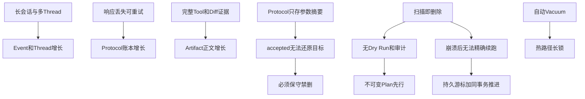
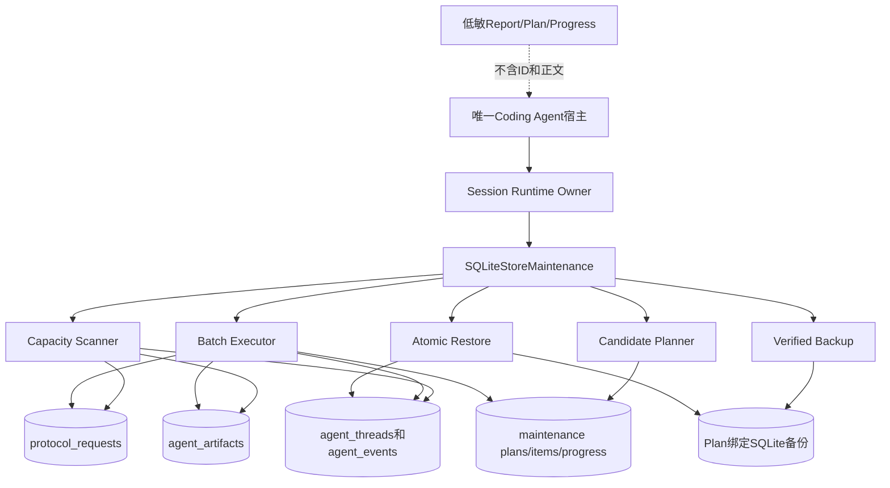
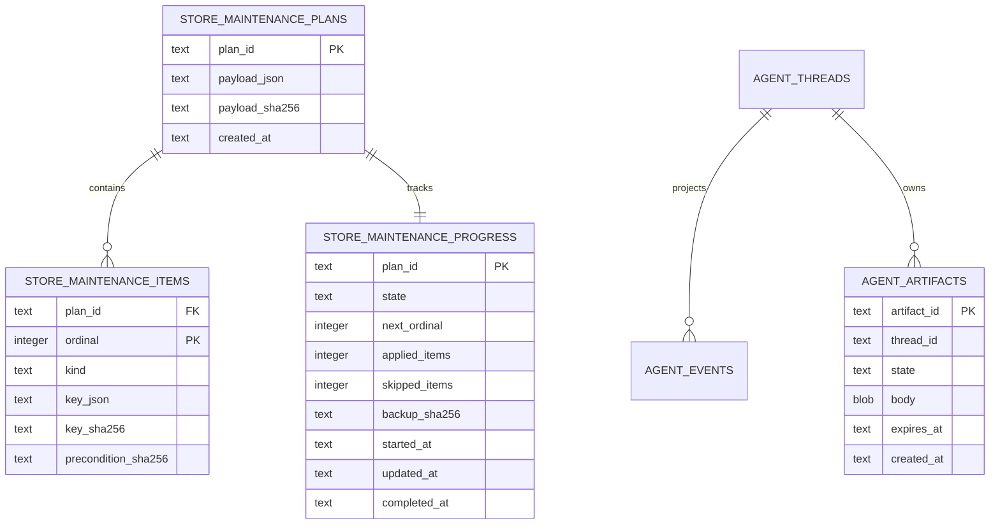
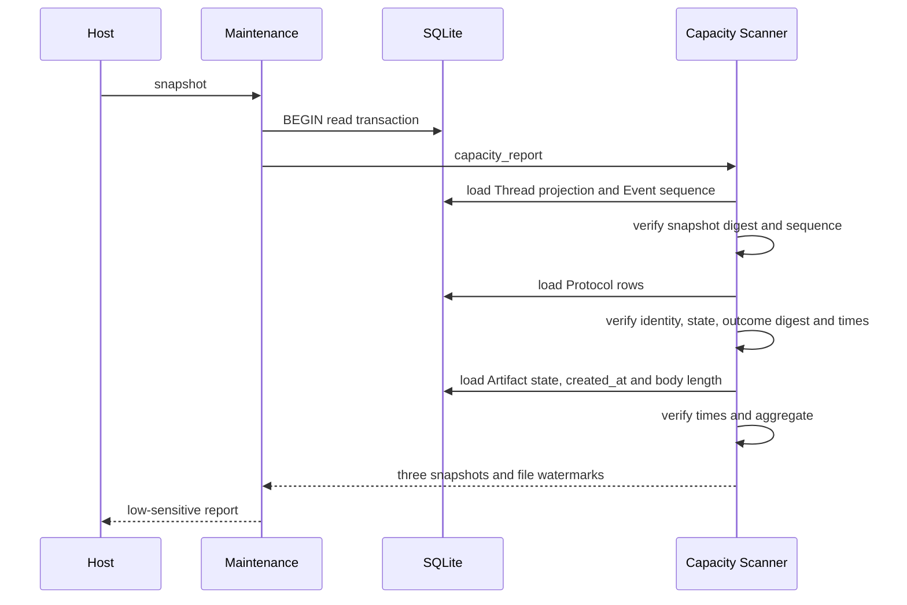
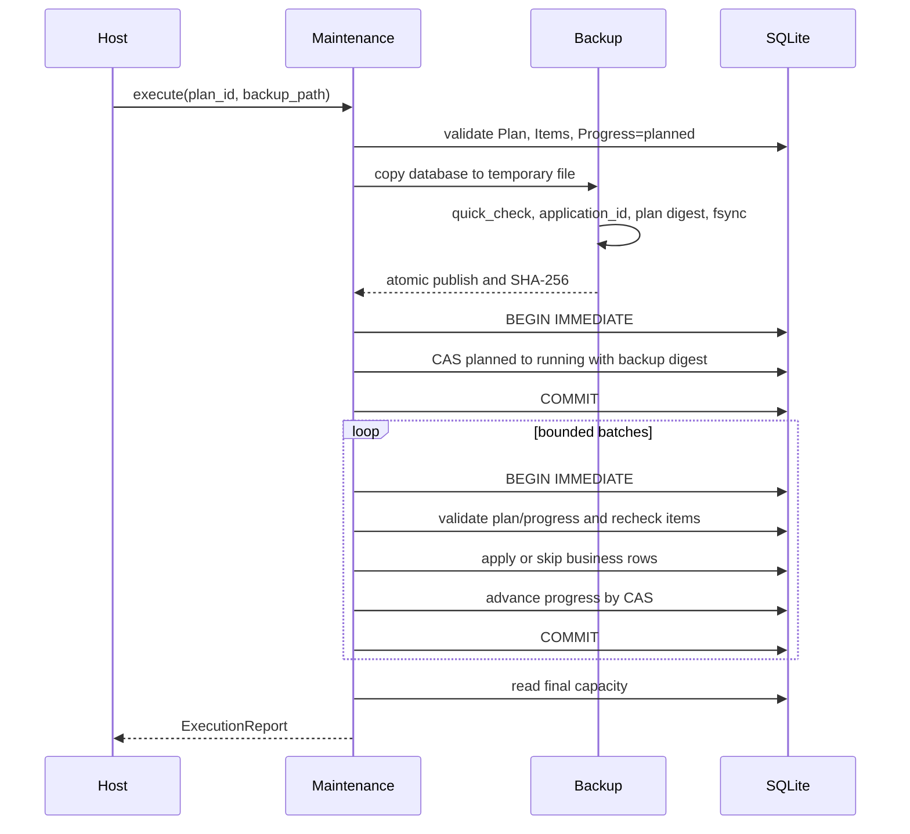
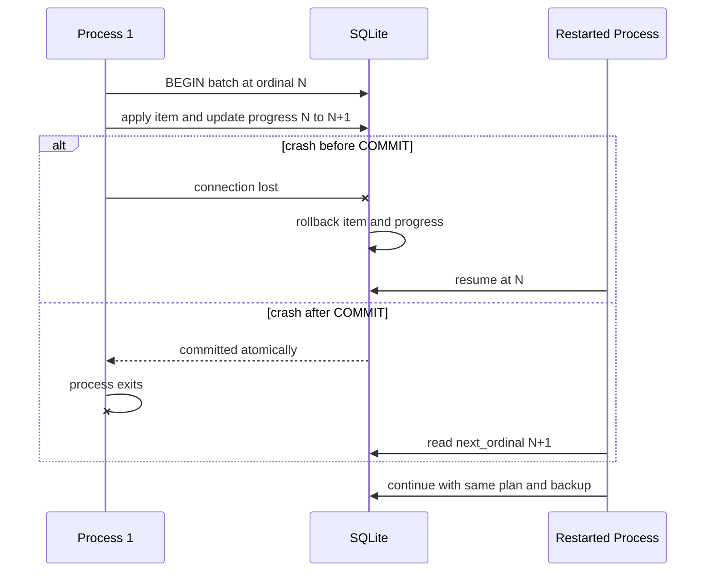
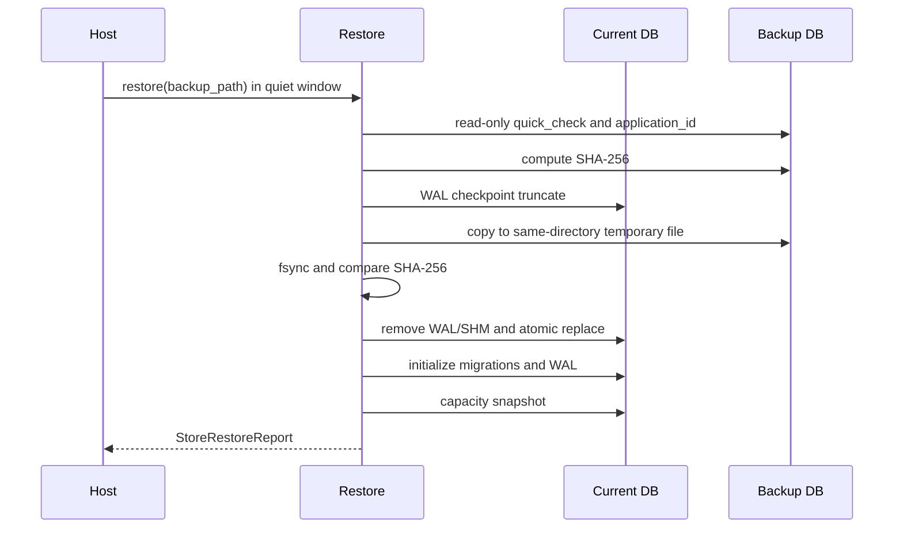
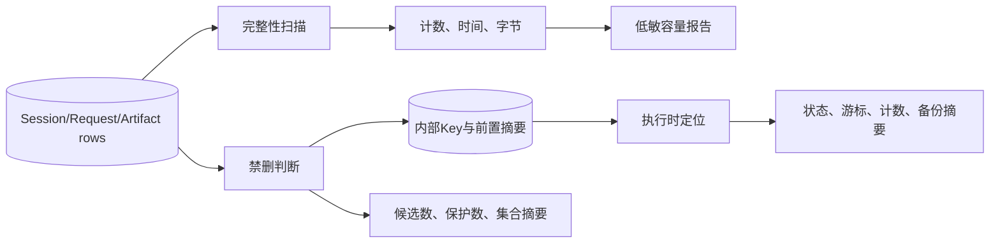

# 0.9.3b 持久容量、Plan-first保留与备份恢复详细设计

## 1. 变更摘要

| 项目 | 内容 |
|---|---|
| 需求 | 为Session、Protocol Request和Artifact建立可重算容量、保守保留、崩溃恢复和强制备份边界 |
| 产品拓扑 | 单一Coding Agent内部能力；不新增HTTP/Worker、Daemon、远程数据库或后台GC服务 |
| 实现Revision | `cb3f3ea834624d5a8f84396952eba212650065d1` |
| 数据版本 | Session Migration 26；Agent Event和Thread投影版本不变 |
| 当前验收 | 本地`make check`通过：3589 passed、32 skipped；全矩阵CI待完成 |
| 破坏性边界 | 只有显式Plan、显式Backup Path和活跃Runtime Owner才能执行；升级和启动均不自动删除 |
| 公开敏感度 | Report/Plan/Progress只含计数、字节、时间、状态和摘要，不含ID、路径或正文 |
| 关联决策 | [ADR 0090](../adr/0090-plan-first-store-maintenance-and-backup.md) |

## 2. 需求背景

### 2.1 问题定义

长期运行的Coding Agent不能把“数据库还能打开”当作容量治理。当前共库同时承载：

- Session事件和Thread聚合投影；
- Agent Protocol Command幂等账本；
- Tool Result、Batch Diff、Action Review和Action Output正文；
- 本次新增的Maintenance计划与进度。

三类业务事实存在不同终态、引用和恢复语义。按单表TTL删除无法回答跨表关系，按文件大小报警无法说明哪类事实增长，
在启动时自动清理则会把一次产品启动变成不可审阅的破坏性操作。

### 2.2 根因



### 2.3 生产完成定义

0.9.3b只有在以下条件全部成立时才可关闭：

1. 容量模型、保留Policy、Plan、Progress、Execution和Restore均为冻结严格合同；
2. Plan/Item/Progress持久化具有摘要、顺序和状态一致性校验；
3. 活跃、UNKNOWN、Fork来源、未决协议和保留期内记录具有执行前后二次保护；
4. 每批业务变更与游标同事务提交，真实故障后从精确位置恢复；
5. 备份强制、可验证、绑定Plan且恢复采用原子替换；
6. Migration 26旧库升级、Checksum、真进程退出和既有Artifact发布全部回归；
7. 低敏报告和Canary泄漏测试通过；
8. 总体设计、ADR、模块、部署、测试和路线图同步；
9. 本地全仓与六实例CI均通过。

## 3. 目标、非目标与约束

### 3.1 设计目标

1. 用同一读事务重算三类Store逻辑水位；
2. 同时报告数据库和WAL物理字节，但不以文件大小替代逻辑计数；
3. 维护前持久化不可变Dry Run Plan；
4. 用内部Item顺序和前置摘要表达精确恢复边界；
5. Plan候选总数有界，Thread与Artifact依赖组不可拆坏；
6. 执行前强制完整备份并验证归属；
7. Item执行时重新检查事实，变化即Skip；
8. 崩溃后使用同一Plan、同一Backup和下一Ordinal恢复；
9. 所有公开结果低敏且可序列化；
10. 保持唯一Coding Agent产品边界和本地SQLite部署。

### 3.2 明确非目标

- 不提供用户可见CLI/TUI维护命令；
- 不提供定时后台GC、网络Maintenance API或独立Worker；
- 不自动Checkpoint、Vacuum或压缩数据库；
- 不删除Action Audit、Process、Delivery或Workspace事务历史；
- 不解决`accepted` Protocol Request的业务目标重建；
- 不实现用户选择性导出、GDPR删除、安全擦除或数据库加密；
- 不允许在线业务流量与Restore并发；
- 不以单元测试替代三平台和Container验收；
- 不把逻辑行减少外推为物理文件立即缩小。

### 3.3 关键约束

| 约束 | 设计响应 |
|---|---|
| SQLite单写者 | Plan和每批使用短`BEGIN IMMEDIATE`，不在事务中等待网络、模型或用户 |
| Protocol只存参数摘要 | 任意`accepted`记录全局保护Session和Artifact |
| Artifact与Session共享库 | Body Tombstone和Session删除按依赖顺序规划 |
| 进程可能随时退出 | Plan、Backup摘要、Progress和业务变更均持久化 |
| 同进程可绕过文件锁 | 运维要求静默维护窗口，Owner不是同进程调度器 |
| Windows文件替换差异 | 只在无业务连接的恢复窗口替换，平台CI验证 |
| 诊断隐私 | 公开模型不含内部Key，Key只保存在数据库Item表 |

## 4. 总体架构



### 4.1 组件职责

| 组件 | 源码 | 单一职责 | 禁止行为 |
|---|---|---|---|
| `maintenance_contracts` | [`maintenance_contracts.py`](../../src/harnessix/session/maintenance_contracts.py) | 严格、冻结、低敏合同 | 打开数据库或执行清理 |
| Capacity Scanner | [`capacity.py`](../../src/harnessix/session/capacity.py) | 重算水位并验证读取完整性 | 选择或删除候选 |
| Record Codec | [`maintenance_records.py`](../../src/harnessix/session/maintenance_records.py) | 规范JSON、摘要、Plan/Item/Progress读写 | 推断业务保留规则 |
| Candidate Planner | [`maintenance_planning.py`](../../src/harnessix/session/maintenance_planning.py) | 构造禁删集合和有序候选 | 修改数据库业务行 |
| Backup | [`maintenance_backup.py`](../../src/harnessix/session/maintenance_backup.py) | 完整复制、归属验证、原子恢复 | 合并两个数据库 |
| Batch Executor | [`maintenance_execution.py`](../../src/harnessix/session/maintenance_execution.py) | 二次保护、Apply/Skip、游标同事务推进 | 重新规划或自动重试外部效果 |
| Orchestrator | [`maintenance.py`](../../src/harnessix/session/maintenance.py) | Owner、生命周期与公共调用编排 | 暴露HTTP或Agent Protocol方法 |
| Artifact Inserter | [`artifacts/persistence.py`](../../src/harnessix/artifacts/persistence.py) | 显式维护Artifact列与发布时间 | 承担配额、审批或事务Owner |

### 4.2 依赖方向

```text
session.maintenance
  -> session.capacity
  -> session.maintenance_planning
  -> session.maintenance_execution
  -> session.maintenance_backup
  -> session.maintenance_records
  -> session.maintenance_contracts
  -> session.sqlite

artifacts publish paths -> artifacts.persistence
```

`session`不反向导入`protocol`或`artifacts`包：共库扫描使用表合同，避免形成新的一级包依赖环。Protocol与Artifact现行模块
仍拥有各自业务语义；Maintenance只执行ADR 0090批准的保留动作。

## 5. 公共内部接口设计

### 5.1 `SQLiteStoreMaintenance`

| 方法 | 前置条件 | 输出 | 事务/文件效果 | 失败要点 |
|---|---|---|---|---|
| `snapshot()` | 数据库已初始化 | `StoreCapacityReport` | 只读事务 | 任一Store损坏即失败关闭 |
| `plan(policy)` | 活跃Runtime Owner | `MaintenancePlan` | `BEGIN IMMEDIATE`写Plan/Items/Progress | Owner丢失、候选损坏、写失败回滚 |
| `load_plan(plan_id)` | Plan存在 | `MaintenancePlan` | 只读并重验全部Item摘要 | 缺失或篡改失败 |
| `progress(plan_id)` | Plan存在 | `MaintenanceProgress` | 只读 | 状态/计数不一致失败 |
| `execute(plan_id, backup_path, batch_size)` | Owner、1≤batch≤1000 | `MaintenanceExecutionReport` | 强制备份；多个短写事务 | Schema/Backup/State冲突失败 |
| `restore(backup_path)` | Owner、静默窗口 | `StoreRestoreReport` | Checkpoint、临时复制、原子替换、initialize | 备份无效或替换失败 |

这些方法当前是宿主内部API，不在`harnessix.session.__all__`、Agent Protocol或CLI命令目录中发布。

### 5.2 低敏合同

#### `StoreCapacitySnapshot`

| 字段 | 类型/约束 | 解释 |
|---|---|---|
| `store_kind` | `session/protocol_request/artifact` | 固定分类 |
| `logical_rows_by_kind` | 非空`dict[str,int>=0]` | 表内业务分类计数 |
| `oldest_created_at/newest_created_at` | 有时区时间或None | 时间水位，不是逐行身份 |
| `active_rows` | 非负整数 | 活动或Published数量 |
| `terminal_rows` | 非负整数 | Archived/终态/Expired数量 |
| `unknown_rows` | 非负整数 | Session不确定效果数量 |
| `artifact_body_bytes` | 非负整数 | 仅Artifact正文总字节 |

#### `StoreCapacityReport`

固定包含`schema_version/database_bytes/wal_bytes/captured_at/stores`。`stores`必须严格按Session、Protocol、Artifact顺序，
避免调用方用缺失类别伪装零值。

#### `RetentionPolicy`

| 字段 | 默认 | 约束 |
|---|---|---|
| `cutoff` | 必填 | 有时区时间；三个清理域共同使用 |
| `max_items` | 1000 | 1～10000，严格整数 |
| `expire_artifact_bodies` | true | 只将Published正文转为Tombstone |
| `delete_terminal_protocol_requests` | true | 只删除completed/failed |
| `delete_archived_threads` | true | 只删除满足全套禁删校验的Thread |

#### `MaintenancePlan`

公开字段包括`plan_id/policy/schema_version/created_at/before/candidates_by_kind/protected_by_reason/candidate_set_sha256`。
内部候选Key不进入该合同。候选总数不能超过Policy上限。

#### `MaintenanceProgress`

```text
planned:   ordinal=0, applied=0, skipped=0, backup=null
running:   backup存在, applied+skipped=next_ordinal
completed: next_ordinal=total_items, completed_at存在
```

#### 执行与恢复结果

`MaintenanceExecutionReport`组合原Plan、最终Progress和After容量；`StoreRestoreReport`返回恢复时间、备份摘要和恢复后的容量。
二者均不返回Backup Path。

## 6. 数据结构、领域契约持久化与Migration 26

### 6.1 关系模型



### 6.2 表字段说明

| 表/字段 | 写入者 | 不变量 | 恢复用途 |
|---|---|---|---|
| `plans.payload_json` | Planner | 完整公开Plan规范JSON | 重建Policy与Before报告 |
| `plans.payload_sha256` | Planner | 等于Payload SHA-256 | 篡改检测与Backup归属 |
| `items.ordinal` | Planner | 从0连续无缺口 | 精确下一Item |
| `items.kind` | Planner | 三种固定枚举 | 分派执行器 |
| `items.key_json` | Planner | 仅内部ID，规范JSON | 定位候选 |
| `items.key_sha256` | Planner | 等于Key JSON摘要 | Key篡改检测 |
| `items.precondition_sha256` | Planner | 规划时可变事实摘要 | 执行时CAS式保护 |
| `progress.state` | Executor | 单向planned→running→completed | 生命周期恢复 |
| `progress.next_ordinal` | Executor | 与计数守恒 | 批次崩溃恢复 |
| `progress.backup_sha256` | Executor | running/completed必填 | 限定同一备份 |
| `artifacts.created_at` | Artifact Publisher | 新行必填有时区时间 | 容量时间水位 |

### 6.3 迁移策略

[`0026_store_maintenance.sql`](../../src/harnessix/session/migrations/0026_store_maintenance.sql)只执行普通DDL/DML，由既有Session
Migration事务管理：

1. `ALTER TABLE agent_artifacts ADD COLUMN created_at TEXT`；
2. 旧行`created_at=expires_at`；这是无法还原发布时间时的保守水位，不用于提前过期；
3. 创建`agent_artifacts_created_at`索引；
4. 创建三张`STRICT`维护表；
5. Migration SHA-256固定为`1ebdbb4cdc20d69c9ea4be5ce8073ae0d64776f36ae6f6ee5b197a743ffa4b35`。

Migration不自动建Plan，不清理行，不运行Vacuum，不改写Event/Thread JSON。既有发布点改用显式列插入，避免第12列加入后
位置式`INSERT INTO agent_artifacts VALUES (...)`失配。

## 7. 容量扫描流程



### 7.1 Session统计

- `threads/events`逻辑行数；
- `active_rows`为`active_turn_id`非空的Thread；
- `terminal_rows`为已Archive的Thread；
- `unknown_rows`为继承或当前Item含不确定效果状态的Thread；
- 时间范围来自Thread领域对象`created_at`。

扫描要求Projection JSON摘要正确、Event数量和最大序号均等于Thread Sequence、领域Thread ID和Sequence匹配。

### 7.2 Protocol统计

读取全部`protocol_requests`并验证：UUID Client、Request/Method长度、参数摘要长度、状态枚举、终态Result摘要和JSON、
`updated_at>=created_at`。输出总数及accepted/completed/failed分类；不解析或恢复原始参数。

### 7.3 Artifact统计

按`created_at`聚合Manifest、Published、Expired和`length(body)`总字节。时间空值、无时区或非法格式都视为数据损坏。
容量扫描不读取正文内容。

## 8. Plan-first候选算法

### 8.1 保护矩阵

| 数据 | 可成为候选 | 禁删条件 | 保护Reason |
|---|---|---|---|
| Artifact Body | Published且`expires_at<=cutoff` | 任意accepted；Owner活动；Owner有不确定效果；仍在保留期 | `accepted_protocol_global`、`active_artifact_owner`、`uncertain_artifact_owner`、`artifact_retention` |
| Session Thread | 已归档且`archived_at<=cutoff` | 未归档、活动、不确定、Fork来源、任意accepted、仍有保留正文 | `session_not_archived`、`active_session`、`uncertain_session`、`fork_source_session`、`accepted_protocol_global`、`session_artifact_retained` |
| Protocol Request | completed/failed且`updated_at<=cutoff` | accepted或保留期内 | `accepted_protocol_request`、`protocol_retention` |
| 任意Item | 满足上面条件 | Plan达到`max_items` | `plan_capacity` |

### 8.2 分组选择

Thread删除依赖其全部Published正文先转Tombstone。Planner先构造：

```text
(thread required artifact items..., thread item)
```

如果剩余容量不能容纳完整组，则整个Thread不入选。之后加入未被Thread组消费的独立Artifact Item，最后加入Protocol Item。
该顺序保证单线程`batch_size=1`也会先清正文再尝试删Thread。

### 8.3 核心伪代码

```text
build_candidates(policy, facts, artifacts, requests):
  accepted_count = count(request.state == accepted)
  for each published artifact:
    if disabled or protected: count reason
    else create artifact item with precondition digest

  fork_sources = all source_thread_id in fork snapshots
  for each thread:
    if disabled or protected: count reason
    else create group(required artifact items, thread item)

  for each protocol request:
    if accepted or retained: count reason
    else create terminal request item

  select complete thread groups up to max_items
  select remaining artifacts, then requests
  persist immutable plan, ordered items and planned progress in one transaction
```

## 9. 执行、崩溃恢复与并发

### 9.1 正常执行时序



### 9.2 批次崩溃时序



### 9.3 Item执行规则

- Artifact：行存在、仍Published、前置摘要相同、TTL满足、无accepted、Owner非活动且无不确定效果，才更新为Expired并清空Body；
- Protocol：行存在、非accepted、前置摘要相同、更新时间满足，才删除；
- Thread：投影仍完整、前置摘要相同、仍归档且过期、非活动/不确定/Fork来源、无accepted、无Published Artifact，才在同一事务删除Artifact Manifest、Event和Thread；
- 不满足任何条件返回0并累计Skip，不抛出“候选冲突”后重新选择。

### 9.4 并发与锁顺序

1. 宿主先获得旁路Runtime Owner；
2. 停止同进程新Turn/Protocol写入并排空活动业务操作；
3. Plan/批次取得SQLite `BEGIN IMMEDIATE`；
4. 事务内只做本地读取、摘要和有限DML；
5. 事务外创建文件备份；
6. Restore只在无业务SQLite连接的静默窗口执行。

Runtime Owner不等价于同进程读写锁。没有静默窗口的在线调用不属于当前支持合同，即使SQLite偶然串行化成功也不能宣称安全。

## 10. 备份与恢复设计

### 10.1 备份创建

```text
if destination exists:
  verify quick_check and application_id
  verify plan_id and payload_sha256
  reuse exact file
else:
  SQLite backup source -> unique temp file
  quick_check and application_id
  verify temp contains exact plan digest
  fsync temp
  atomic replace destination
  chmod 0600 on POSIX and fsync parent
return file SHA-256
```

Backup发生在Plan提交之后，因此备份内含Plan和`planned` Progress。它发生在任何业务清理之前，因此Restore回到可重新决定是否
执行的安全时点。

### 10.2 备份故障窗口

| 窗口 | 数据库 | 备份 | Progress | 恢复方式 |
|---|---|---|---|---|
| 临时复制前退出 | 不变 | 无 | planned | 重试创建 |
| 临时复制中退出 | 不变 | 仅临时文件 | planned | 清理临时文件后重试 |
| 原子发布后退出 | 不变 | 完整且Plan绑定 | planned | 复用备份 |
| running提交后退出 | 不变 | 完整 | running/ordinal0 | 继续批次 |
| 批次间退出 | 已有完整批次 | 完整 | running/ordinalN | 从N继续 |

### 10.3 显式恢复



Restore不是在线回滚或事件合并。备份之后的新Turn、Request或Artifact都会被完整回退，操作者必须把它当作灾难恢复动作。

## 11. 安全、权限与信任边界及数据流



| 数据 | 存储/输出 | 敏感性控制 |
|---|---|---|
| Thread/Artifact/Request ID | 仅内部Item表 | 不进入公开Plan/Report/Result |
| Prompt、源码、Tool正文 | 原业务表 | Scanner只计数/length，不加载到合同 |
| Backup Path | 仅调用参数和文件系统 | 不进入Result或日志合同 |
| Backup/Plan/Item SHA-256 | 数据库和公开结果 | 完整性摘要，不是认证签名 |
| 时间/计数/字节 | 公开内部合同 | 低敏；仍不得绑定用户标签 |
| Secret | 不应进入任一业务表 | Maintenance不读取环境或Provider配置 |

SHA-256只能发现非预期变化。能写同一数据库的恶意进程可同时改正文和摘要；操作系统账户隔离、文件权限和后续0.9.4安全
审查仍是信任边界。

## 12. 失败、错误分类与可观测性矩阵

| 场景 | 检测位置 | 稳定Code/结果 | 是否自动重试 | 数据结算 |
|---|---|---|---|---|
| 数据库未初始化/表缺失 | Scanner/SQLite | 存储错误 | 否 | 无写入 |
| Projection/Event不一致 | Capacity | `projection_corrupt` | 否 | 失败关闭 |
| Protocol行摘要/时间损坏 | Capacity | `request_corrupt` | 否 | 失败关闭 |
| Artifact时间/归属损坏 | Planner/Capacity | `artifact_corrupt` | 否 | 失败关闭 |
| 无Owner | Orchestrator | `maintenance_runtime_required` | 否 | 无写入 |
| Plan不存在 | Record Codec | `maintenance_plan_not_found` | 否 | 无写入 |
| Plan/Item/Progress篡改 | Record Codec | `maintenance_corrupt` | 否 | 不继续 |
| 批次大小非法 | Orchestrator | `maintenance_invalid` | 否 | 无写入 |
| Backup覆盖源库 | Orchestrator | `maintenance_invalid` | 否 | 无写入 |
| Backup缺失/损坏/不同Plan | Backup | `maintenance_backup_*` | 否 | 不启动/不继续 |
| Plan后Schema变化 | Start | `maintenance_schema_changed` | 否 | Plan保持planned |
| 另一执行者抢先启动 | Progress CAS | `maintenance_state_conflict` | 否 | 当前事务回滚 |
| 候选变化 | Item recheck | Skip | 不需要 | 新事实保留 |
| 新accepted出现 | Item recheck | Session/Artifact Skip | 不需要 | 未决事实保留 |
| SQLite Busy/I/O | storage errors | 既有稳定映射 | 不在内部循环重试 | 当前事务回滚 |
| Fault Point异常 | 注入点 | 原异常 | 测试显式重开 | 依据提交边界恢复 |
| Restore复制摘要不一致 | Restore | `maintenance_backup_invalid` | 否 | 当前库未替换 |

## 13. 故障注入点

| Fault Point | 位置 | 必须证明 |
|---|---|---|
| `maintenance.after_plan_commit` | Plan事务提交后 | Plan可加载、业务数据未变 |
| `maintenance.after_backup_created` | 备份原子发布后、Progress前 | 备份可复用、Progress仍planned |
| `maintenance.after_backup_commit` | Progress转running后 | 同一备份继续、Item尚未推进 |
| `maintenance.after_batch_commit` | 每批提交后 | 下一Ordinal精确、重复执行不重复删除 |

Fault Point只用于测试注入，不是Telemetry事件，也不应携带路径、ID或正文。

## 14. 测试设计与证据

### 14.1 新增纵向测试

[`test_store_maintenance.py`](../../tests/agent/test_store_maintenance.py)覆盖：

1. 三类容量报告完整且不泄漏Canary、路径和Thread ID；
2. Plan要求Owner并检测持久Payload摘要篡改；
3. accepted请求全局保护Session/Artifact，同时删除终态Request；
4. 备份发布后故障，重启复用同一Plan绑定备份；
5. 单Item批次提交后故障，重启从Ordinal 1继续并恢复备份；
6. 候选行前置事实变化后Skip；
7. Plan后新增accepted请求，Artifact和Thread均Skip。

### 14.2 Migration与既有回归

| 领域 | 测试 | 证明 |
|---|---|---|
| Migration Checksum/未来版本 | [`test_store.py`](../../tests/agent/test_store.py) | 26个连续Migration，未来27失败 |
| 真进程迁移退出 | [`test_process_session_upgrade.py`](../../tests/agent/test_process_session_upgrade.py) | 迁移提交前/后原子性与新Checksum |
| Batch Session旧库 | [`test_batch_session_upgrade.py`](../../tests/agent/test_batch_session_upgrade.py) | 旧事件/投影保持 |
| WAL竞争 | [`test_wal_initialization.py`](../../tests/agent/test_wal_initialization.py) | 只重试WAL，不重放26个Migration |
| Artifact Migration | [`test_batch_diff_upgrade.py`](../../tests/artifacts/test_batch_diff_upgrade.py)、[`test_process_output_upgrade.py`](../../tests/artifacts/test_process_output_upgrade.py) | 扩列后旧Artifact字节和用途约束保持 |
| 所有发布路径 | [`tests/artifacts`](../../tests/artifacts/) | Tool/Batch/Review/Action Output均写created_at |

### 14.3 本地门禁结果

```text
ruff format --check: 905 files formatted
ruff check: passed
readability report: 318 source files, 0 new debt
mypy: 318 source files passed
pytest: 3589 passed, 32 skipped
spec generation: passed
documentation check: 228 documents, 6235 links and 626 Mermaid blocks passed
changed-document Mermaid render: 17 changed paths passed with real Chrome rendering
```

代码门禁绑定实现Revision `cb3f3ea`；文档门禁绑定本设计的候选关闭工作树。最终六实例CI结果应在0.9.3b关闭提交后更新，
不得预先填写成功。

## 15. 部署、运维与使用边界

### 15.1 维护窗口

生产宿主必须按以下顺序调用内部能力：

1. 禁止新客户端命令并排空当前Turn、Action和Artifact发布；
2. 获取`runtime_owner()`，确认没有第二宿主；
3. 调用`snapshot()`记录Before水位；
4. 调用`plan(policy)`并审核候选/保护计数；
5. 为Backup选择独立、权限受控且有足够空间的路径；
6. 调用`execute()`；失败时用Plan ID和同一Backup恢复执行；
7. 校验After水位和应用日志外的稳定结果；
8. 需要完整回滚时，在静默窗口调用`restore()`；
9. 恢复正常业务入口。

当前仓库没有把这组调用发布成CLI命令。直接在生产脚本中接入前，0.9.5必须补确认UX、磁盘空间Preflight、诊断包和升级验收。

### 15.2 不自动Vacuum

逻辑清理后SQLite文件可能保持原大小。0.9.3d将单独测量WAL Checkpoint、Vacuum/Incremental Vacuum的锁时长、额外磁盘空间、
恢复边界和三平台差异。在证据完成前禁止在Agent启动、Turn执行或本维护执行器中隐式运行。

### 15.3 备份保管

备份包含完整Prompt、源码、Tool正文、协议结果和维护Plan，敏感度不低于当前Session数据库。必须使用私有目录、最小权限、
明确保留期和受控删除；不得把摘要正确误述为备份已加密。

## 16. 升级、兼容与回滚

| 场景 | 行为 |
|---|---|
| v25首次启动v26 | 单事务加列、回填、建索引和维护表；完成后启用WAL |
| 迁移中进程退出 | 提交前全部回滚；提交后26与Checksum完整存在 |
| v26正常启动 | 核对所有Migration摘要，不重复DDL |
| 数据库含27 | 当前二进制`schema_too_new`失败关闭 |
| v26代码回滚到旧程序 | 旧程序应拒绝未来Schema；使用升级前备份或兼容Reader |
| Maintenance中断 | 使用同Plan、同Backup和Progress继续 |
| Maintenance业务回滚 | 用Plan绑定备份完整Restore；不手工补行 |

## 17. 源码与测试双向映射

| 设计主题 | 源码符号 | 测试入口 |
|---|---|---|
| 严格合同 | [`maintenance_contracts.py`](../../src/harnessix/session/maintenance_contracts.py) `StoreCapacityReport`、`RetentionPolicy`、`MaintenanceProgress` | [`test_store_maintenance.py`](../../tests/agent/test_store_maintenance.py) |
| Thread/Request/Artifact扫描 | [`capacity.py`](../../src/harnessix/session/capacity.py) `capacity_report`、`load_thread_facts` | 容量低敏测试、既有损坏测试 |
| Plan摘要与游标 | [`maintenance_records.py`](../../src/harnessix/session/maintenance_records.py) `save_plan`、`load_plan_items`、`load_progress` | Plan篡改、崩溃续跑 |
| 禁删集合 | [`maintenance_planning.py`](../../src/harnessix/session/maintenance_planning.py) `build_candidates` | accepted保护、Plan后新增pending |
| Item二次保护 | [`maintenance_execution.py`](../../src/harnessix/session/maintenance_execution.py) `apply_item`、`run_batches` | Changed Candidate Skip、批次恢复 |
| Backup/Restore | [`maintenance_backup.py`](../../src/harnessix/session/maintenance_backup.py) `create_or_reuse_backup`、`restore_database` | 备份发布故障、原子恢复 |
| 生命周期编排 | [`maintenance.py`](../../src/harnessix/session/maintenance.py) `SQLiteStoreMaintenance` | Owner、完整纵向流程 |
| Artifact显式插入 | [`persistence.py`](../../src/harnessix/artifacts/persistence.py) `insert_artifact` | [`tests/artifacts`](../../tests/artifacts/) |
| Schema 26 | [`0026_store_maintenance.sql`](../../src/harnessix/session/migrations/0026_store_maintenance.sql) | Session/Artifact升级测试 |

## 18. 风险、限制与后续工作

| 风险/限制 | 当前控制 | 后续归属 |
|---|---|---|
| accepted全局保护导致长期不清理 | 保护计数可见，宁可不删 | 0.9.3c恢复扫描与Protocol目标语义 |
| Maintenance历史持续增长 | Plan不可变保证审计 | 0.9.3d增长基线后设计自身保留 |
| 同进程业务并发 | 运维静默窗口合同 | 0.9.5 CLI/宿主状态机 |
| 文件未物理缩小 | 不自动Vacuum | 0.9.3d性能与锁证据 |
| Restore丢弃备份后事实 | 显式完整回滚，不称为合并 | 0.9.5备份恢复UX |
| 旧Artifact created_at不精确 | 以expires_at保守回填，资格仍看expires_at | 长期迁移说明 |
| SHA不是防恶意篡改 | 文件权限和单Owner | 0.9.4安全审查 |
| 无用户级数据生命周期 | 不误称已满足合规删除 | 0.9.4/0.9.5 |
| 三平台文件语义未完成CI关闭 | 路线图保持未勾选 | 当前CI与0.9.5升级矩阵 |

## 19. 验收清单

- [x] 源码研究与现状缺口求证；
- [x] ADR 0090和正式合同；
- [x] Migration 26与旧库原子升级；
- [x] 三类低敏容量扫描；
- [x] 不可变Plan、Item摘要和独立Progress；
- [x] 活跃/UNKNOWN/Fork/accepted/保留期禁删集合；
- [x] Backup强制、Plan归属、摘要与原子Restore；
- [x] 每批业务变更和游标同事务；
- [x] 备份发布与批次提交故障恢复；
- [x] 本地Ruff、Mypy、可读性、规格和全仓测试；
- [x] 总体、模块、部署、测试和路线图文档同步；
- [ ] Linux Python 3.12/3.13、macOS、Windows、固定Container和Documentation CI；
- [ ] 0.9.3b关闭提交与路线图勾选。

0.9.3b关闭不等于0.9.3完成。Trusted Action/Process效果恢复属于0.9.3c，长会话Soak、物理空间回收和发布阈值属于0.9.3d。
