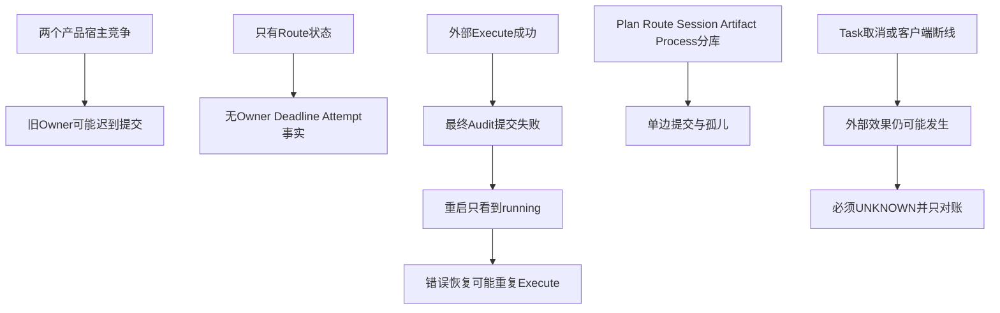
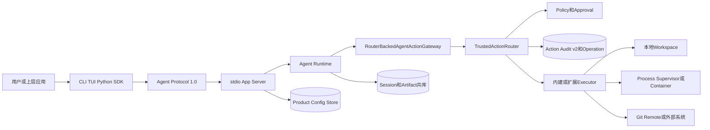
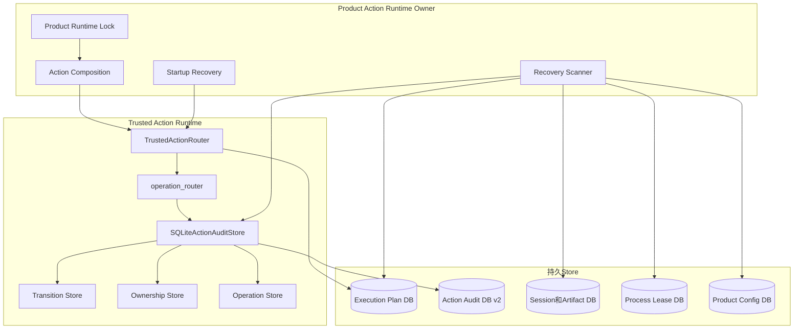
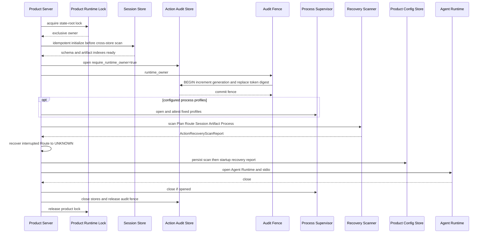
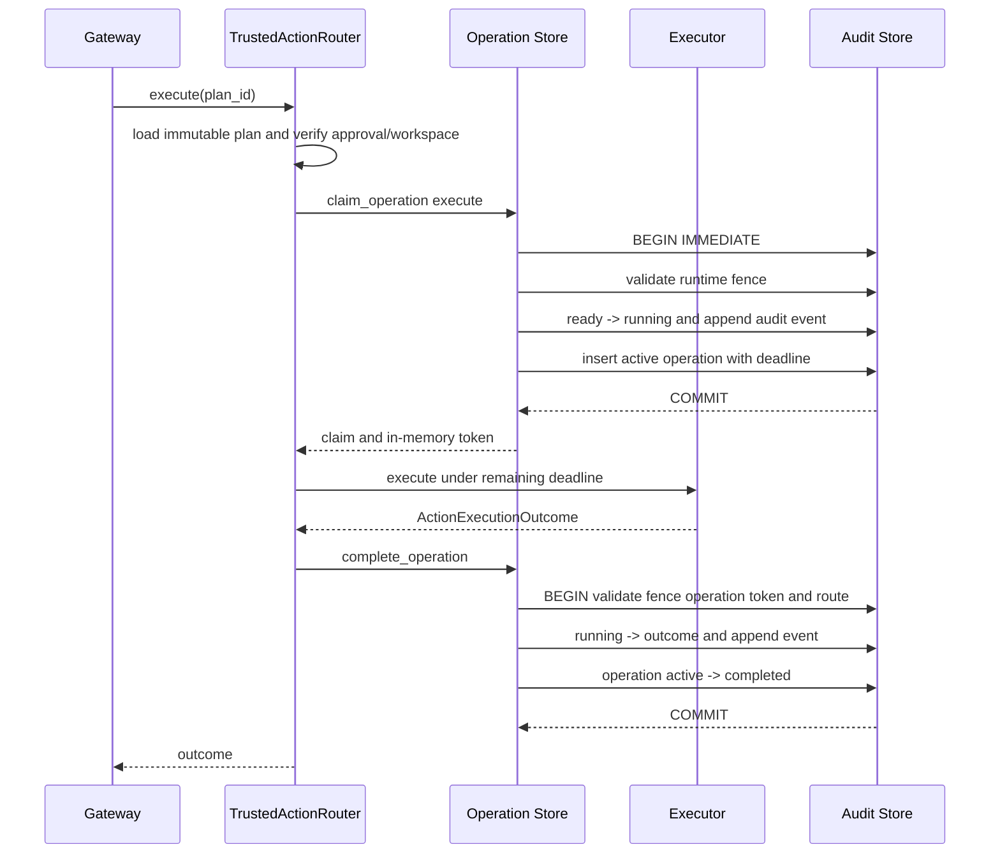
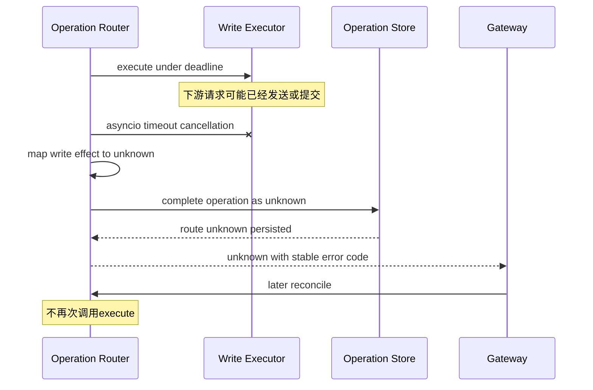
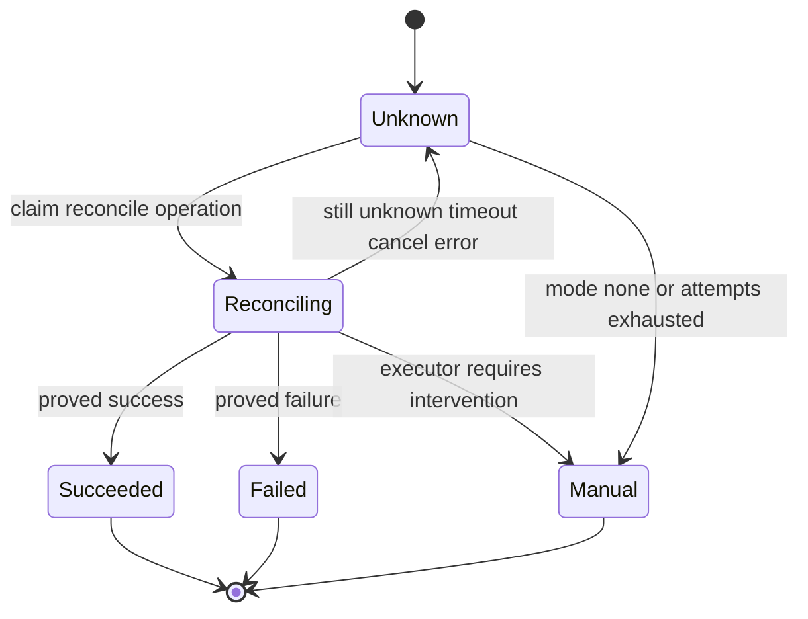
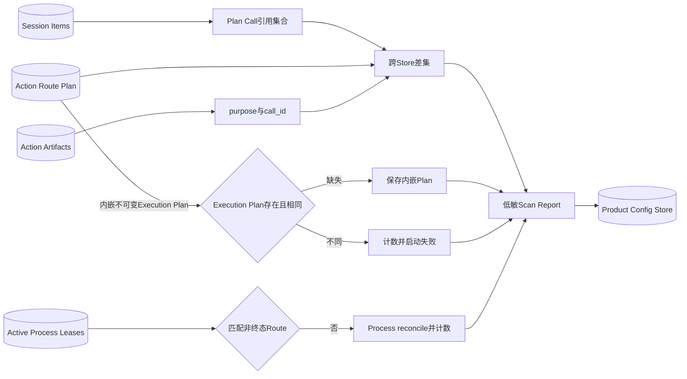
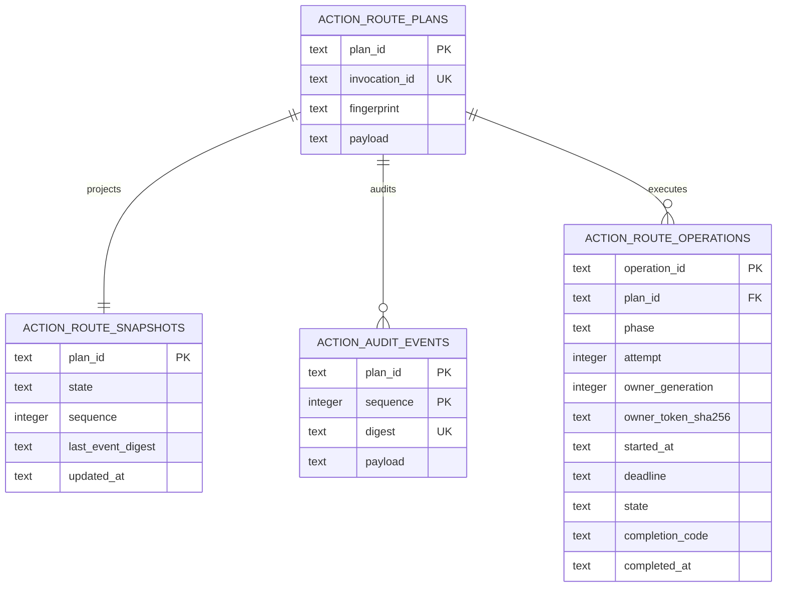

# 0.9.3c Action Runtime所有权、期限与效果恢复详细设计

## 1. 文档目的与变更摘要

本文是0.9.3c基础实现Revision `0bc942bce8aeb22747a06515732936d1a312cd02`及修复版
`33fcf02a5dc7b9a4fc6ca6afaa0956b47180b2d6`的总体及详细设计事实源，回答：

- 为什么Coding Agent内部仍需要Action Runtime，但不需要独立Action Plane HTTP/Worker；
- 产品宿主、Action Audit和单次Execute/Reconcile如何建立所有权；
- 超时、取消、数据库故障和宿主退出后如何避免重复外部效果；
- Execution Plan、Route、Session、Artifact与Process Lease跨Store崩溃窗口如何扫描；
- 哪些缺口能自动修复，哪些只能报告或失败关闭；
- 代码、合同、表、测试和运维边界如何一一对应。

| 项目 | 内容 |
|---|---|
| 产品定位 | 单一生产级Coding Agent内部Action执行内核 |
| 明确删除/不恢复 | Action HTTP API、Worker队列、独立Action服务、第二套认证和部署面 |
| 核心实现 | 双层Owner、持久Operation、Route Deadline、只对账恢复、跨Store扫描 |
| 代码Revision | 基础实现`0bc942bce8aeb22747a06515732936d1a312cd02`；修复验收`33fcf02a5dc7b9a4fc6ca6afaa0956b47180b2d6` |
| Action Audit Schema | v1前向升级到v2 |
| 新公开合同Schema | `harnessix.action-route-operation/v1`、`harnessix.action-recovery-scan/v1` |
| 本地验收 | 修复版`make check`通过：3597 passed、32 skipped |
| CI状态 | [首次35499848035](https://github.com/carrie1988/Harnessix/actions/runs/35499848035)发现缺陷；修复版[35691402329](https://github.com/carrie1988/Harnessix/actions/runs/35691402329)六实例全部通过 |
| 路线图状态 | 0.9.3c已关闭；0.9.3d及0.9.4～0.9.6仍未完成 |

## 2. 需求背景

### 2.1 产品边界问题

早期Harnessix曾把Action Plane作为可独立运行的HTTP/Worker服务。产品转向Coding Agent后，真正的用户主链是：

```text
用户 -> CLI/TUI/SDK -> Agent Protocol -> Agent Runtime -> Tool/Action -> Workspace/Process/Git
```

独立Action服务会形成另一条入口：它没有完整Agent Session上下文，却需要重复承担认证、Policy、Approval、Trace、部署、数据库、
Worker和升级。0.9.1f3已物理删除该服务。0.9.3c不是删除Action能力，而是把仍然必要的效果安全能力收敛在
`TrustedActionRouter`和产品组合根内。

### 2.2 可靠性问题

0.9.3c前的Router已经做到“先写running，再调用Executor”和“未知写效果进入UNKNOWN”，但仍有以下缺口：



### 2.3 根因

1. **外部效果不能参与本地SQLite事务**：Git Push、Container命令或未来SaaS API已提交后，本地Audit仍可能失败；
2. **文件锁没有历史身份**：新进程取得锁后，旧对象若仍运行，需要持久Generation拒绝其提交；
3. **Route状态粒度不足**：`running`不能说明哪一轮、哪个Owner、何时开始、何时到期；
4. **跨Store没有共享事务**：Execution Plan和Route是两个SQLite连接，Session/Artifact又在另一共库，Process Lease有自己的Store；
5. **取消是控制信号，不是效果证明**：协程被取消不代表下游未发送请求或子进程没有运行；
6. **自动重试和效果安全冲突**：非幂等写操作重放比保守UNKNOWN更危险。

### 2.4 生产完成定义

0.9.3c必须同时满足：

1. 产品组合根在打开任一Action Store/Process Owner前取得跨进程互斥；
2. Action Audit每次宿主接管递增持久Generation，旧Fence不能提交；
3. Execute/Reconcile Claim具有Operation ID、Attempt、Owner、Token摘要和Deadline；
4. Claim与Route执行态、Complete与Route终态分别同事务；
5. 写效果超时/取消/异常不被错误归类为确定失败；
6. Reconcile不调用Execute，次数和单轮时间均有上限；
7. Executor返回后Audit故障、宿主退出和重启不重复Execute；
8. 启动扫描覆盖Plan/Audit、Session、Artifact和Process Lease；
9. 扫描报告低敏、可校验、可持久化；
10. v1数据库前向迁移、全量回归、三平台/Container/文档CI和设计文档同步完成。

## 3. 设计目标、非目标与不变量

### 3.1 目标

- 用最少拓扑完成单机Coding Agent的Action单Owner和失效隔离；
- 把“正在执行”从瞬时内存状态提升为持久Operation事实；
- 将超时和取消转换为与Effect Class一致的稳定结果；
- 在任何无法证明外部效果的窗口保持UNKNOWN；
- 自动修复仅限能从权威不可变事实确定重建的数据；
- 让恢复路径、迁移、失败和安全边界可由测试直接定位；
- 保持Router为薄公共入口，复杂职责分散到明确模块；
- 不突破0.9.0可读性门禁。

### 3.2 非目标

- 不建设远程、多租户或横向扩展Action调度集群；
- 不提供Action独立HTTP、Worker、CLI或外部数据库；
- 不承诺外部效果Exactly Once；
- 不自动删除孤儿Route或Artifact；
- 不从摘要反推Session、Artifact或Protocol参数；
- 不强杀任意拒绝协作取消的Python Executor；
- 不替代Process Supervisor自身超时、资源限制和进程树回收；
- 不在本切片实现用户可见人工处置界面、Telemetry告警或自动GC；
- 不解决恶意同UID进程、数据库加密或审计不可抵赖。

### 3.3 核心不变量

| 编号 | 不变量 | 实现点 |
|---|---|---|
| INV-1 | 同一State Root最多一个产品Action组合根 | `product_action_runtime_lock` |
| INV-2 | 产品Action写入必须持有当前Audit Fence | `require_runtime_owner=True` + `_assert_runtime_owner` |
| INV-3 | 旧Generation或错误Token不能完成Operation | `complete_operation` |
| INV-4 | Executor只在Claim事务提交后调用 | `execute_action/reconcile_action` |
| INV-5 | Route执行态与Operation创建同事务 | `claim_operation` |
| INV-6 | Route终态与Operation完成同事务 | `complete_operation` |
| INV-7 | 写操作效果不明不得进入failed/succeeded | `execute_action`异常映射 |
| INV-8 | Reconcile永不调用Execute | 独立`reconcile_action`路径 |
| INV-9 | 重启恢复只中断Operation并进入UNKNOWN | `recover_interrupted_action` |
| INV-10 | 跨Store扫描不删除未知孤儿 | `scan_product_action_recovery` |
| INV-11 | 原始Fence/Operation Token不持久化 | 只保存SHA-256 |
| INV-12 | 扫描报告不含业务ID、路径或正文 | `ActionRecoveryScanReport` |

## 4. 总体架构与系统上下文

### 4.1 当前系统上下文



图中没有Action独立HTTP/Worker。`TrustedActionRouter`是Agent内部效果安全边界，`ProductActionRuntimeOwner`是产品组合根
Owner；它们不会形成第二个可直接面向用户的产品。

### 4.2 组件分解



### 4.3 源码目录与职责

| 源码位置 | 重点符号 | 职责 |
|---|---|---|
| [`trusted_actions/router.py`](../../src/harnessix/trusted_actions/router.py) | `TrustedActionRouter` | 对外薄入口、注册、计划、批准、状态；执行委托Operation Router |
| [`trusted_actions/operation_router.py`](../../src/harnessix/trusted_actions/operation_router.py) | `execute_action`、`reconcile_action` | Deadline、取消、异常映射、只对账恢复 |
| [`trusted_actions/store.py`](../../src/harnessix/trusted_actions/store.py) | `SQLiteActionAuditStore` | Schema装配、Plan、快照、事件读取、生命周期 |
| [`trusted_actions/transition_store.py`](../../src/harnessix/trusted_actions/transition_store.py) | `ActionTransitionStoreMixin` | Route CAS、Hash链事件与事务 |
| [`trusted_actions/ownership_store.py`](../../src/harnessix/trusted_actions/ownership_store.py) | `ActionOwnershipStoreMixin` | Audit文件锁、Generation、Fence校验 |
| [`trusted_actions/operation_store.py`](../../src/harnessix/trusted_actions/operation_store.py) | Claim/Complete/Recovery mixin | Operation表、Claim、Complete、中断和清单 |
| [`trusted_actions/recovery_contracts.py`](../../src/harnessix/trusted_actions/recovery_contracts.py) | Fence、Operation、Scan Report | 严格领域合同和报告摘要 |
| [`product_config/action_owner.py`](../../src/harnessix/product_config/action_owner.py) | `product_action_runtime_lock` | 组合根最外层跨进程锁 |
| [`product_config/action_runtime.py`](../../src/harnessix/product_config/action_runtime.py) | `open_default_product_action_runtime` | 生命周期、期限计算、扫描与Composition发布 |
| [`product_config/action_recovery.py`](../../src/harnessix/product_config/action_recovery.py) | `scan_product_action_recovery` | 跨Store保守完整性扫描 |
| [`product_config/action_runtime_types.py`](../../src/harnessix/product_config/action_runtime_types.py) | `ProductProcessSupervisor` | 扫描对Process的最小协议 |
| [`product_config/action_store.py`](../../src/harnessix/product_config/action_store.py) | Scan持久化方法 | 低敏扫描报告不可变保存 |
| [`processes/supervisor.py`](../../src/harnessix/processes/supervisor.py) | `active_leases` | 向恢复扫描暴露只读活跃Lease集合 |
| [`artifacts/action_output_store.py`](../../src/harnessix/artifacts/action_output_store.py) | `action_recovery_inventory` | 只返回Action Artifact purpose/call身份 |
| [`product_config/server.py`](../../src/harnessix/product_config/server.py) | `_serve_product_stdio` | 开放Agent Runtime前保存扫描和恢复报告 |

### 4.4 依赖方向

```text
product_config.server
  -> product_config.action_runtime
       -> product_config.action_owner
       -> product_config.action_recovery
       -> trusted_actions.router
            -> trusted_actions.operation_router
            -> trusted_actions.store
                 -> transition_store
                 -> ownership_store
                 -> operation_store
       -> processes.supervisor
       -> artifacts.sqlite

trusted_actions 不反向依赖 product_config、session、artifacts 或 processes。
```

这个方向保证核心Action合同可被产品组合根使用，但不会把Session或产品部署细节塞进Router。

## 5. 启动与所有权流程

### 5.1 启动时序



### 5.2 为什么产品锁必须最先取得

如果先分别打开Store和Process Supervisor，再取得Action锁，竞争宿主可能已经：

- 创建另一个Process Owner和Run目录；
- 对Execution Plan或Action Audit执行Migration；
- 开始Profile能力探测；
- 读取旧Route并准备恢复。

因此[`open_default_product_action_runtime`](../../src/harnessix/product_config/action_runtime.py)用同步Context Manager包住整个
异步依赖生命周期，产品锁在`_open_action_dependencies`前取得。恢复扫描依赖Session和Artifact表，因此组合根在锁内先对
`artifacts.session`执行幂等`initialize()`；这既兼容正式Server已初始化的路径，也消除Eval/Container组合必须猜测启动顺序的隐式
前置条件。Agent Runtime随后仍负责取得Session Runtime Owner并执行活动Turn恢复。

### 5.3 Fence字段与生命周期

| 字段 | 类型 | 来源 | 持久化 | 说明 |
|---|---|---|---|---|
| `generation` | 1以上整数 | Audit元数据原子递增 | 是 | 每次Owner接管单调增加 |
| `token` | 64位十六进制Revision | `os.urandom(32).hex()` | 否 | 当前宿主能力，`repr=False` |
| `acquired_at` | 有时区时间 | `utc_now()` | Fence对象内存 | 诊断当前接管时间 |
| `owner_token_sha256` | SHA-256 | Token摘要 | 是 | 只用于提交校验，不公开原值 |

`runtime_owner`退出后清空Store内存Fence并关闭文件描述符。进程异常退出时OS释放文件锁；新Owner递增Generation后，旧Fence即使
还在某个对象中也无法通过数据库校验。

## 6. Execute详细流程

### 6.1 正常Execute时序



### 6.2 Claim伪代码

```text
claim_operation(plan_id, phase, timeout, max_attempts):
  validate timeout and attempts
  token = secure_random
  now = utc_now
  deadline = now + timeout
  expected = ready if execute else unknown
  target = running if execute else reconciling

  BEGIN IMMEDIATE
    fence = assert_runtime_owner
    attempt = max(existing attempts for plan and phase) + 1
    if attempt > max_attempts: fail exhausted
    route = load and validate
    append route transition expected -> target
    insert active operation(owner generation, token hash, deadline)
  COMMIT
  return operation plus raw token
```

### 6.3 Complete伪代码

```text
complete_operation(claim, outcome):
  BEGIN IMMEDIATE
    fence = assert_runtime_owner
    require operation generation == fence generation
    row = load exact operation identity
    require row active and token hash matches claim token
    append route transition executing -> outcome
    CAS operation active -> completed with completion code and time
  COMMIT
  return route snapshot
```

### 6.4 事务线性化点

| 事实 | 线性化点 | 失败前状态 | 失败后允许动作 |
|---|---|---|---|
| Executor可以开始 | Claim事务COMMIT | Route仍ready/unknown | 可重试Claim，Executor未调用 |
| Route进入执行中 | 同一Claim COMMIT | 无Operation | Route和Operation均不可见或均可见 |
| 外部效果完成 | 外部系统自身提交点 | 本地Operation active | 本地未知，不能自动重Execute |
| Route终态可见 | Complete事务COMMIT | Route running/reconciling | 新Owner中断为UNKNOWN并Reconcile |
| Operation终结 | 同一Complete COMMIT | Operation active | 与Route终态同进同退 |

外部系统提交点不可能与SQLite原子合并，因此系统提供的是“重复执行防护与保守恢复”，不是Exactly Once。

## 7. Deadline、取消与失败语义

### 7.1 两类Deadline

1. **持久墙钟Deadline**：Operation表保存UTC时间，重启后仍可判断Active Operation是否已过期；
2. **当前Event Loop计时器**：`remaining_action_seconds`计算剩余秒数，`asyncio.timeout`向受信Executor发出协作取消。

Process Action还有第三层固定Profile Deadline，由Supervisor负责真正的子进程树终止、输出排空和Lease终态。Route Execute期限
必须至少覆盖最大Profile期限加30秒清理余量。

### 7.2 超时时序



### 7.3 失败矩阵

| 故障点 | Route/Operation结算 | 是否再次Execute | 恢复方式 |
|---|---|---|---|
| Claim前验证失败 | 原状态，无Operation | 可在修复输入后重试 | 重新Plan或调用 |
| Claim事务失败 | 原状态，无Operation | 可重试Claim | SQLite/Owner问题修复后重试 |
| Read-only Execute超时 | `failed`，Operation completed | 否 | 新Plan |
| Write Execute超时 | `unknown`，Operation completed | 否 | Reconcile |
| Read-only Execute取消 | 先`failed`再传播取消 | 否 | 上层读取持久状态 |
| Write Execute取消 | 先`unknown`再传播取消 | 否 | Reconcile |
| Executor抛`UncertainEffectError` | `unknown` | 否 | Reconcile |
| Write Executor普通异常 | `unknown` | 否 | Reconcile |
| Executor返回后Complete前退出 | `running` + active Operation | 否 | 新Owner interrupt -> UNKNOWN -> Reconcile |
| Complete事务中失败 | 事务回滚，仍执行中 | 否 | 同上 |
| Reconcile超时/取消/异常 | `unknown`，本轮Operation completed | 否 | 下一有界Reconcile |
| Reconcile次数耗尽 | `manual_intervention` | 否 | 人工调查/产品UX |
| 新Owner发现执行中 | Active Operation interrupted；Route UNKNOWN | 否 | Reconcile |
| 旧Owner迟到提交 | `action_runtime_fence_lost` | 否 | 丢弃旧结果，使用新Owner事实 |
| Operation Token错误或已完成 | `action_operation_stale` | 否 | 读取当前Route |

### 7.4 协作取消边界

`asyncio.timeout`不能强制终止吞掉`CancelledError`并永久阻塞的任意第三方Python协程。因此：

- 内建Executor必须传播取消并把资源清理放在有界Owner中；
- 不可信命令必须走Process Supervisor/Container，不直接以内存插件执行；
- 未来扩展进程化应使用版本化IPC和强制终止，不得扩大当前协程保证；
- 0.9.3d需测量实际超时清理延迟。

## 8. Reconcile与重启恢复

### 8.1 Reconcile状态机



### 8.2 中断恢复伪代码

```text
recover_interrupted_action(plan_id):
  route = load
  if route not running or reconciling:
    return route

  BEGIN IMMEDIATE
    assert current runtime owner
    mark latest active operation for matching phase interrupted
    transition route to unknown with host_interrupted
  COMMIT
  return unknown route
```

这一步只收敛本地事实，不调用Executor。随后既有Gateway恢复逻辑根据Session中的Trusted Action引用调用Reconcile，并将结论补入
Session Tool Result。即使原Executor实际上成功，也只由Reconcile的外部事实判断终态。

### 8.3 Attempt上限

- Execute每个Plan只能从`ready`进入一次；第二次Claim会因Route冲突失败；
- Reconcile Attempt从1递增，默认最多3次；
- Operation表对`(plan_id, phase, attempt)`建立唯一约束；
- 合法配置范围为1～128，与数据库CHECK一致；
- 达到上限后不再创建Operation，Route直接进入人工处置。

## 9. 跨Store恢复扫描

### 9.1 为什么不做分布式事务

| Store | 权威事实 | 为什么不能简单合并 |
|---|---|---|
| Execution Plan DB | 完整不可变ExecutionPlanV2 | 被Execution与Approval独立复用 |
| Action Audit DB | Route Plan、快照、事件、Operation | 效果安全热路径，独立Schema和Owner |
| Session/Artifact DB | 用户可见Thread、Call和正文引用 | 异步事件投影与Artifact同库 |
| Process Lease DB | 子进程Owner、输出和终态 | 由平台Supervisor独立持有 |
| Product Config DB | 配置版本、启动报告 | 配置激活与Action事实不同生命周期 |

外部效果也无法进入任何本地事务。把这些Store强行合并会扩大锁和迁移半径，却仍不能消除Git/SaaS/Process崩溃窗口。
因此采用“局部事务保证 + 启动完整性扫描 + 保守恢复”。

### 9.2 扫描数据流



### 9.3 扫描规则

| 检查 | 权威侧 | 自动动作 | 报告字段 | 启动策略 |
|---|---|---|---|---|
| Route存在、Execution Plan缺失 | Route内嵌Plan | `save_plan`修复 | `repaired_execution_plans` | 继续 |
| Route与Execution Plan内容不同 | 两侧冲突 | 不覆盖 | `invalid_execution_plans` | 失败关闭 |
| Session引用不存在Route | Session引用 | 不删除Session | `session_orphan_references` | 失败关闭 |
| 产品Route无Session引用 | Action Route | 不删除Route | `routes_without_session_reference` | 报告后继续 |
| Action Artifact无Call引用 | Artifact索引 | 不读/删正文 | `artifact_orphans` | 报告后继续 |
| Active Process Lease无匹配非终态Route | Process Lease | 调用既有Reconcile | `process_orphan_leases` | 失败关闭 |
| Active Operation | Action Audit | 不按时间伪造终态 | `active_operations` | 后续Route恢复 |
| Active Operation Deadline已过 | Action Audit | 只计数 | `expired_operations` | 后续Route恢复 |

`routes_without_session_reference`和`artifact_orphans`可能是“Route/Audit已提交、Session投影尚未提交”的崩溃窗口，也可能是历史
兼容数据。缺少足够身份关系时不自动删除。

### 9.4 Session引用提取

扫描遍历Thread全部Turn Item以及Fork Snapshot Item，只识别两类正式合同：

- `TrustedActionApprovalRequestContent`：收集`plan_id`和Review `call_id`；
- 带`trusted_action`字段的`ToolResultContent`：收集`plan_id`和Output `call_id`。

不解析Text、不从Prompt猜Plan ID、不读取Artifact正文。当前扫描是启动同步完整扫描；其规模阈值和分页/增量演进由0.9.3d性能
证据决定，不能在没有测量前伪称常数成本。

## 10. 领域合同与数据结构设计

### 10.1 `ActionRuntimeFence`

| 字段 | 约束 | 含义 |
|---|---|---|
| `spec_version` | 固定`harnessix.action-runtime-fence/v1` | 合同版本 |
| `generation` | `>=1` | 当前Audit Owner代次 |
| `token` | 64位Revision，`repr=False` | 只驻留当前进程的能力 |
| `acquired_at` | AwareDatetime | Owner取得时间 |

Fence不生成公开JSON Schema，因为原始Token不应成为跨边界数据。

### 10.2 `ActionRouteOperation`

Schema见[`action-route-operation-v1.schema.json`](../../spec/action-route-operation-v1.schema.json)。

| 字段 | 约束 | 说明 |
|---|---|---|
| `operation_id` | UUID | 单次Execute/Reconcile身份 |
| `plan_id` | UUID | 绑定不可变Action Route Plan |
| `phase` | `execute/reconcile` | 两种操作类型 |
| `attempt` | 1～128 | 同Plan同Phase单调轮次 |
| `owner_generation` | `>=1` | Claim时Owner代次 |
| `owner_token_sha256` | 64位Revision | 单次Operation Token摘要，不是Runtime Token摘要 |
| `started_at` | AwareDatetime | Claim时间 |
| `deadline` | 晚于开始时间 | 持久墙钟期限 |
| `state` | active/completed/interrupted | Operation状态 |
| `completion_code` | 稳定小写Code或None | 结果/中断分类 |
| `completed_at` | AwareDatetime或None | 非active时必填 |

模型验证保证Active没有完成时间、终态必须有完成时间、Interrupted必须有原因。

### 10.3 `ClaimedActionOperation`

组合持久`operation`与只驻留内存的原始`token`。它是完成Operation的能力对象，不进入数据库、Session或日志。

### 10.4 `ActionRecoveryScanReport`

Schema见[`action-recovery-scan-v1.schema.json`](../../spec/action-recovery-scan-v1.schema.json)。

| 字段 | 含义 |
|---|---|
| `owner_generation` | 扫描所属Runtime代次 |
| `scanned_routes` | 扫描Route总数 |
| `repaired_execution_plans` | 从Route内嵌Plan修复数 |
| `invalid_execution_plans` | 内容不一致数 |
| `active_operations` | 扫描时Active Operation数 |
| `expired_operations` | Active且Deadline已过数 |
| `process_orphan_leases` | 无合法Route归属的活跃Process Lease数 |
| `session_orphan_references` | Session引用不存在Route数 |
| `routes_without_session_reference` | 产品Route无Session引用数 |
| `artifact_orphans` | Action Artifact无对应Call引用数 |
| `created_at` | 扫描完成时间 |
| `report_sha256` | 排除自身后规范字段的SHA-256 |

报告模型校验修复数加无效数不超过扫描数、过期数不超过Active数、正文摘要一致。

## 11. 持久化设计与Migration

### 11.1 Action Audit Schema v2



`ACTION_ROUTE_OPERATIONS`对`(plan_id, phase, attempt)`唯一，并为`(state, deadline, plan_id)`建立Active扫描索引。

### 11.2 Metadata

| Key | 初始值 | 更新时机 |
|---|---|---|
| `schema_version` | `2` | v1表补齐成功后从1改为2 |
| `owner_generation` | `0` | 每次`runtime_owner`取得锁后加1 |
| `owner_token_sha256` | 64个`0` | 每次Owner接管替换为新Token摘要 |

### 11.3 Product Config持久化

```sql
CREATE TABLE product_action_recovery_scans (
    report_sha256 TEXT PRIMARY KEY,
    payload TEXT NOT NULL
) STRICT;
```

保存前重新用Pydantic解析，按摘要幂等插入；相同摘要不同Payload报`product_action_config_store_corrupt`。读取时重新计算摘要。

### 11.4 Migration顺序与回滚边界

```text
open Action Audit
  create metadata table if absent
  read schema version
  reject version not in {1,2}
  create existing route tables if absent
  insert owner metadata if absent
  create operation table/index if absent
  if previous version == 1:
    update schema_version = 2
```

DDL由SQLite自身提交语义执行。升级不改历史Plan/Event正文，不生成伪Operation，不把旧`running`直接改为终态。首次新Owner恢复时
才把遗留执行态收敛为UNKNOWN。

不支持自动降级。回滚到不理解v2的旧二进制会以`action_audit_store_version`失败，运维应恢复升级前完整State Root备份，而不是手改
版本号或删除Operation表。

## 12. 关键类与接口设计

### 12.1 `TrustedActionRouter`

| 方法 | 职责 | 依赖 | 禁止行为 |
|---|---|---|---|
| `plan` | 冻结Tool、Policy、资源、Workspace和Executor身份 | Planning、Plan Store、Audit | 调用Executor |
| `decide` | 保存批准并推进Route | Plan Store、Audit | 修改Plan内容 |
| `execute` | 薄委托`execute_action` | Operation Router | 内联复杂异常/期限逻辑 |
| `reconcile` | 薄委托`reconcile_action` | Operation Router | 调用Execute |
| `recover_interrupted` | 中断全部遗留执行态 | Operation Router | 触发外部效果 |
| `_prepare_execution` | 复核Plan、Workspace、Approval、参数 | Registry/Stores | 放宽漂移 |

### 12.2 Store职责拆分

| 类 | 单一职责 |
|---|---|
| `SQLiteActionAuditStore` | Schema装配、Plan/Event读取和连接生命周期 |
| `ActionTransitionStoreMixin` | 公共Route迁移事务 |
| `ActionTransitionCommitMixin` | 调用方事务内Route CAS和Hash链追加 |
| `ActionOwnershipStoreMixin` | Runtime文件锁和Generation接管 |
| `ActionOwnerFenceMixin` | 当前Fence数据库校验 |
| `ActionOperationClaimMixin` | Operation Claim与执行态同事务 |
| `ActionOperationCompleteMixin` | Operation能力校验与终态同事务 |
| `ActionOperationRecoveryMixin` | 中断遗留Operation及只读清单 |

拆分后没有新增超过100行的类或超过门限的高复杂度函数；最终可读性基线随实现Revision更新，但未放宽文件、符号或复杂度阈值。

### 12.3 `ProductActionRuntimeOwner`

| 字段/属性 | 类型 | 含义 |
|---|---|---|
| `composition` | `ProductActionComposition` | 当前候选配置构造的Catalog/Gateway/Report |
| `recovery` | `ProductActionStartupRecoveryReport` | 既有Route恢复结论 |
| `fence` | `ActionRuntimeFence` | 当前Action Audit Owner身份 |
| `recovery_scan` | `ActionRecoveryScanReport` | 跨Store完整性扫描结果 |
| `report/catalog/gateway` | 只读属性 | 向Agent Runtime暴露正式产品能力 |

### 12.4 `ProductProcessSupervisor`协议

扫描只依赖：

```python
class ProductProcessSupervisor(Protocol):
    def active_leases(self) -> tuple[ProcessLease, ...]: ...
    async def reconcile(self, process_id: UUID) -> ProcessLease: ...
```

这避免`action_recovery.py`依赖具体POSIX/Windows Supervisor实现或产品Action Runtime形成循环导入。

## 13. 安全设计

### 13.1 威胁与控制

| 威胁 | 控制 | 剩余风险 |
|---|---|---|
| 第二产品宿主并发启动 | Product锁 + Audit锁 | 同UID恶意进程可删除文件，属后续威胁模型 |
| 旧Owner迟到提交 | 持久Generation + Token摘要 | 外部效果本身不能撤销 |
| 伪造Operation完成 | Operation原始Token只驻留内存 | 进程内任意代码仍属受信边界 |
| Token从日志泄漏 | `repr=False`且不进入报告/数据库 | Core dump不在本切片治理 |
| 扫描泄漏用户代码/路径 | 报告只含计数、时间、摘要 | 内部数据库仍含业务数据 |
| 恶意Artifact正文触发解析 | 扫描不读取正文 | Artifact索引本身仍需完整性保护 |
| 超时后自动重复写 | UNKNOWN + Reconcile-only | 外部系统若无查询能力需人工处置 |
| 锁文件符号链接替换 | 支持时`O_NOFOLLOW`、私有目录/模式 | Windows ACL和恶意同用户需发行验证 |

### 13.2 Secret边界

- Fence/Operation Token不是用户Secret，但按能力Secret处理；
- Action参数可能包含结构化敏感数据，Operation表和Scan Report均不保存参数；
- `completion_code`只允许稳定低基数错误码，不能保存第三方异常字符串；
- Artifact扫描不读取正文、Manifest或路径；
- Process扫描只使用Lease合同，不公开命令、环境、输出或PID。

## 14. 可观测性与审计

### 14.1 当前可观测事实

- Action Audit连续Hash链记录每次Route迁移、Executor ID、输出/Artifact摘要和稳定错误码；
- Operation表记录Phase、Attempt、Owner Generation、Deadline和中断/完成；
- Scan Report记录跨Store计数、Generation、时间和摘要；
- Product Config Store持久化每次启动Scan与Recovery Report；
- Session仍保存用户可见Approval/Tool Result投影。

### 14.2 当前不会公开的事实

- 原始Owner/Operation Token；
- Plan/Session/Process/Artifact业务ID列表；
- Action参数、输出正文、路径、命令或环境；
- 异常消息、数据库错误正文和堆栈；
- Scan逐条修复或孤儿身份。

### 14.3 0.9.3d指标候选

| 指标 | 类型 | 建议维度 |
|---|---|---|
| 启动恢复扫描时延 | Histogram | 平台、Route规模桶 |
| Active/Expired Operation | Gauge | Phase，不含Plan ID |
| UNKNOWN积压 | Gauge | Effect Class、Executor类型 |
| Reconcile Attempt | Counter | 稳定结论、Attempt桶 |
| Fence接管 | Counter | 成功/忙/失效 |
| 跨Store缺口 | Counter | 缺口类别 |

当前实现没有新增Telemetry导出器；上述指标必须在0.9.3d/0.9.4经低敏评审后落地。

## 15. 性能与容量

### 15.1 热路径开销

每次Execute/Reconcile新增：

1. Claim写事务：一次Route Event、Snapshot CAS和Operation Insert；
2. Executor完成后Complete写事务：一次Route Event、Snapshot CAS和Operation Update；
3. 两次Fence元数据读取；
4. Operation Token SHA-256计算。

这是用两次本地SQLite事务换取崩溃边界。不得为了降低写次数把Claim延迟到Executor之后。

### 15.2 启动扫描复杂度

| 扫描 | 当前复杂度 | 数据敏感度 |
|---|---|---|
| Route/Plan | O(Route数)并逐项读取Plan | 不公开逐项身份 |
| Session引用 | O(Thread、Turn、Item总量) | 内部读取正式Item合同 |
| Action Artifact索引 | O(Action Artifact数) | 只读purpose/call_id |
| Process Lease | O(Active Lease数) | 只读Lease合同 |
| Operation | O(Active Operation数) | 只聚合计数 |

0.9.3c不声称大规模扫描已达SLO。0.9.3d必须在500 Thread、长Session和Action故障循环下测量启动P50/P95、数据库增长和
Operation清理需求，再决定增量索引、分页或归档，而不是提前增加后台服务。

## 16. 部署与运维

### 16.1 状态目录

```text
state-root/
├── product-action-runtime.lock
├── execution-plans.db
├── action-audit.db
├── action-audit.db.runtime.lock
├── sessions.db
├── product-config.db
├── workspace-leases.db
├── workspace-transactions/
└── process-owner/                 # 仅存在固定Process Profile时
    ├── process-leases.db
    └── runs/
```

### 16.2 启动失败处理

| 错误码 | 运维含义 | 动作 |
|---|---|---|
| `action_runtime_busy` | 同State Root已有产品或Audit Owner | 查明另一进程，不删除锁文件绕过 |
| `action_runtime_owner_unavailable` | 锁路径/权限/文件系统异常 | 修复目录权限与本地文件系统 |
| `action_runtime_fence_lost` | 当前对象已被新Owner取代 | 停止旧宿主，读取新Owner持久事实 |
| `product_action_recovery_integrity` | 跨Store发现不可自动修复缺口 | 保留完整State Root，离线审计/恢复 |
| `storage_unavailable` | Session Schema或索引无法初始化/读取 | 不开放Runtime；保留State Root并检查文件系统和数据库 |
| `action_audit_store_version` | 二进制不支持当前Schema | 使用兼容版本或恢复完整备份 |
| `action_audit_store_corrupt` | Route/Event/Operation索引不一致 | 停止写入，保存副本并调查 |

不得通过删除`.lock`文件、手改Generation、改Schema版本或把UNKNOWN改为Succeeded恢复服务。

### 16.3 升级步骤

1. 停止旧Harnessix进程并确认没有共享State Root的第二宿主；
2. 备份完整State Root，包括SQLite主文件、WAL/SHM、Workspace Transaction和Process目录；
3. 启动新Revision，新二进制取得Product锁；
4. 在锁内幂等初始化Session Schema，确认Artifact索引可读；
5. Action Audit执行v1→v2前向升级；
6. 取得新Fence并运行跨StoreScan；
7. 先保存Scan Report，再保存Startup Recovery Report；
8. 完整性错误为0后才激活配置并开放Agent Protocol；
9. 保留升级证据与备份，禁止旧版本直接打开v2库。

### 16.4 回滚

- 若尚未启动新版本，可直接使用原版本；
- 若v2升级已经完成，不能只回滚二进制；应停止服务并恢复升级前完整State Root备份；
- 外部效果已经发生的Action不能通过数据库回滚撤销，必须依赖目标系统事实和Reconcile；
- Product Config中Scan Report用于诊断，不应单独删除以伪装启动成功。

## 17. 测试设计与证据

### 17.1 合同、Migration与Owner

| 测试 | 验证 |
|---|---|
| [`test_audit_store_migrates_v1_and_requires_runtime_owner`](../../tests/trusted_actions/test_router.py) | v1→v2、Operation表、产品写Owner门禁 |
| [`test_runtime_fence_rejects_stale_owner_and_competing_process`](../../tests/trusted_actions/test_router.py) | 竞争Audit宿主与旧Generation失效 |
| [`test_product_action_runtime_lock_rejects_competing_process`](../../tests/product_config/test_action_recovery.py) | 最外层产品组合根竞争 |
| `generate_specs.py --check` | Operation与Scan JSON Schema和代码一致 |

### 17.2 Deadline与零重复效果

| 测试 | 验证 |
|---|---|
| [`test_write_route_timeout_enters_unknown_and_only_reconciles`](../../tests/trusted_actions/test_router.py) | 写超时UNKNOWN、Execute/Reconcile各一次、Operation完成 |
| [`test_reconcile_attempts_are_bounded_without_reexecute`](../../tests/trusted_actions/test_router.py) | Attempt上限与人工处置、不重Execute |
| [`test_result_then_audit_failure_recovers_without_duplicate_execute`](../../tests/trusted_actions/test_router.py) | 效果返回后Audit故障、中断Operation、只对账 |
| [`test_cancellation_after_router_claim_becomes_unknown_then_reconciles`](../../tests/trusted_actions/test_agent_gateway.py) | 取消持久UNKNOWN并由Gateway恢复 |

### 17.3 跨Store扫描与产品接线

| 测试 | 验证 |
|---|---|
| [`test_recovery_scan_repairs_plan_orphan_without_executing`](../../tests/product_config/test_action_recovery.py) | Plan修复、无Session引用Route、孤儿Artifact、零Executor调用 |
| [`test_product_action_runtime_initializes_session_before_recovery_scan`](../../tests/product_config/test_action_recovery.py) | 未预初始化Session时组合根先建Schema再扫描，避免Container/Eval启动顺序耦合 |
| [`test_product_server_starts_and_closes_on_eof_without_model_request`](../../tests/product_config/test_server_and_cli.py) | Server启动持久化Scan和Recovery Report |
| 全部Product Config、Process、Artifact回归 | 新扫描不破坏现有组合和平台Owner |

### 17.4 验证命令与结果

```bash
uv run pytest \
  tests/trusted_actions/test_router.py \
  tests/trusted_actions/test_agent_gateway.py \
  tests/product_config/test_action_recovery.py \
  tests/product_config/test_server_and_cli.py

make check
```

实现Revision本地`make check`结果：

- Ruff format/check：通过；
- 可读性最终报告：通过，无阈值放宽；
- 文档/Schema/工程Pack门禁：通过；
- mypy：326个源码文件通过；
- pytest：3595 passed、32 skipped；
- 总耗时：318.18秒。

六实例CI 35499848035已结束：Linux Python 3.12/3.13、macOS和Windows通过；Documentation因代码提交缺少同批设计资料失败，
Container因恢复扫描早于Session Schema初始化导致15例失败。修复版增加组合根内幂等Session初始化和无Docker回归，
本详细设计及相关模块文档与修复一同提交。修复版本地`make check`为3597 passed、32 skipped；变化文档的Mermaid已由
`documentation_check.py --changed-from c7fda9e --render-mermaid`真实渲染通过。[CI 35691402329](https://github.com/carrie1988/Harnessix/actions/runs/35691402329)
六实例全部通过，包含固定Container的20 Trial离线Suite，0.9.3c据此关闭。

## 18. 源码研究到设计决策映射

| 参考实现 | 固定Revision与源码事实 | Harnessix采纳 | 未照搬 |
|---|---|---|---|
| Codex | `a0dcfe2ada3f5bbd5059a34c0fc6fac244741a67`，`codex-rs/core/src/exec.rs:145-245`显式组合超时/取消结果；`:1000-1069` TERM grace、进程组Kill和有界Drain | Deadline与取消不是普通失败；Process清理余量覆盖Route期限 | 未把Rust进程层逻辑复制到Python Router，继续复用Supervisor |
| OpenCode | `69c172e8a7c0086887b1f93ed5a162f14b6aa0c5`，`packages/opencode/src/session/prompt.ts:323-374,813-827`传递AbortController并清理Tool执行 | 取消贯穿Tool/Action调用且必须有持久结算 | 不把取消当作外部效果撤销证明 |
| Claude Code逆向样本 | `2ca5ddabfed5f220812ea11f029eda03b21bc4c1`，`toolExecution.ts:1134-1157`把Tool参数视为敏感；`mcp/client.ts:3054-3102`使用进度与显式Timeout Race | Operation/Scan不保存参数正文，期限为正式合同 | 不依赖未公开产品行为，不复制实现代码 |

参考源码只用于求证设计模式；Harnessix合同、失败语义和测试由本项目独立实现。

## 19. 已知限制与风险

| 优先级 | 限制 | 影响 | 后续 |
|---|---|---|---|
| P1 | 启动Session完整扫描尚无规模阈值 | 大库启动时延未知 | 0.9.3d Soak |
| P1 | Operation无归档/清理 | 长期Action会持续增长 | 0.9.3d容量基线后设计 |
| P1 | Python Executor Deadline依赖协作取消 | 恶意/错误插件可延迟退出 | 0.9.4扩展进程边界 |
| P1 | Route无Session引用和Artifact孤儿只报告 | 可能长期积累 | 0.9.5维护UX与安全清理Plan |
| P1 | Process孤儿Reconcile后仍失败启动 | 可用性降低但避免误接管 | 0.9.3d故障矩阵与人工恢复 |
| P1 | 多Store无全局事务 | 仍需启动扫描和保守失败 | 保持当前真实边界 |
| P1 | Fence不抵抗恶意同UID主体 | 本地状态仍可被直接改写 | 0.9.4威胁模型/发行权限 |
| P1 | 原生Telemetry未实现 | 线上UNKNOWN积压需查库/报告 | 0.9.3d/0.9.4 |
| P2 | 墙钟跳变会影响过期统计 | 不影响“不得重Execute”，但影响告警时间 | 后续单调时钟证据与容差设计 |

## 20. 验收清单

- [x] 产品边界明确：不恢复独立Action HTTP/Worker；
- [x] 产品最外层Lock在任一Store/Process Owner前取得；
- [x] Audit Owner Generation/Token摘要持久化并强制校验；
- [x] Operation Claim/Complete与Route同事务；
- [x] Route Deadline、取消和Effect Class失败矩阵实现；
- [x] Reconcile只观察、不调用Execute、尝试有界；
- [x] 旧Owner、中断Operation和最终Audit故障不会导致重复Execute；
- [x] 跨Store扫描覆盖Plan、Route、Session、Artifact和Process；
- [x] Scan Report严格、低敏、摘要绑定且持久化；
- [x] Action Audit v1→v2迁移和未知版本拒绝；
- [x] JSON Schema、源码注释、测试和可读性基线同步；
- [x] 本地全仓3595 passed、32 skipped；
- [x] 修复版六实例CI 35691402329全部成功并形成关闭提交；
- [ ] 0.9.3d冻结规模、时延、增长和积压阈值。

## 21. 后续维护规则

以下变化必须在同一提交更新本文、ADR 0091、Schema、模块文档和测试：

1. Action Audit Schema、Owner元数据或Operation表字段；
2. Route状态、允许迁移、Deadline和Attempt上限；
3. 任何取消、超时、异常到Action Outcome的映射；
4. Execute/Reconcile调用顺序或恢复是否可能调用Execute；
5. Product Lock、Audit Fence和Process Owner取得顺序；
6. Scan自动修复、启动失败和报告字段；
7. Session/Artifact/Process引用识别规则；
8. Token持久化、日志、Trace或Telemetry策略；
9. 独立Action API、Worker或远程控制面提案；
10. 三平台文件锁、SQLite事务或回滚运维流程。
