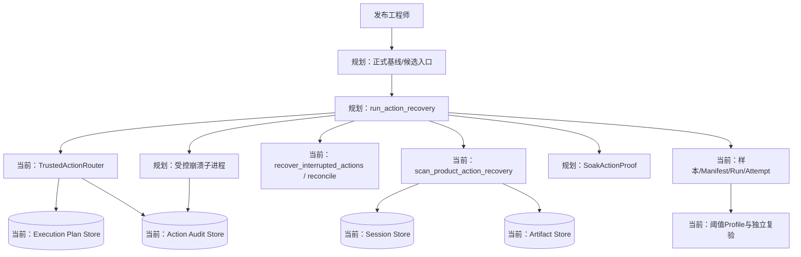
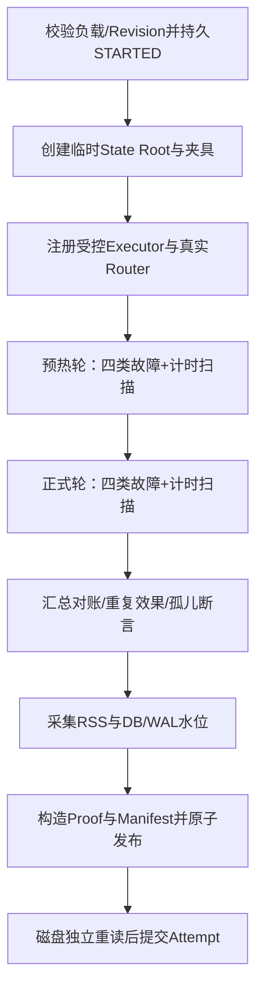
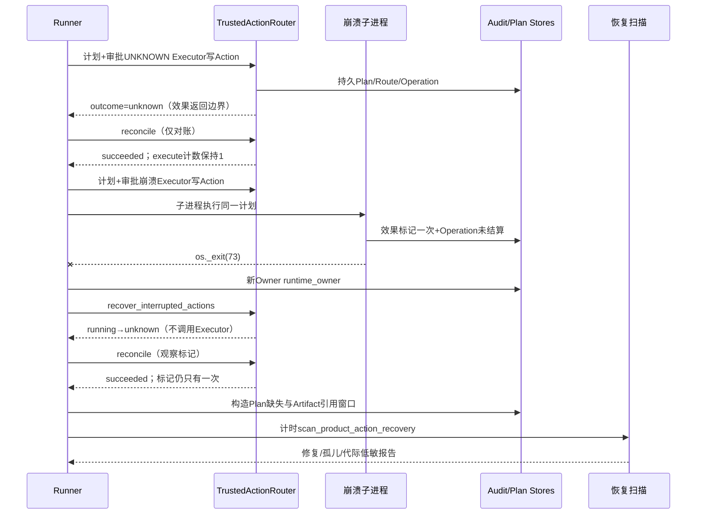
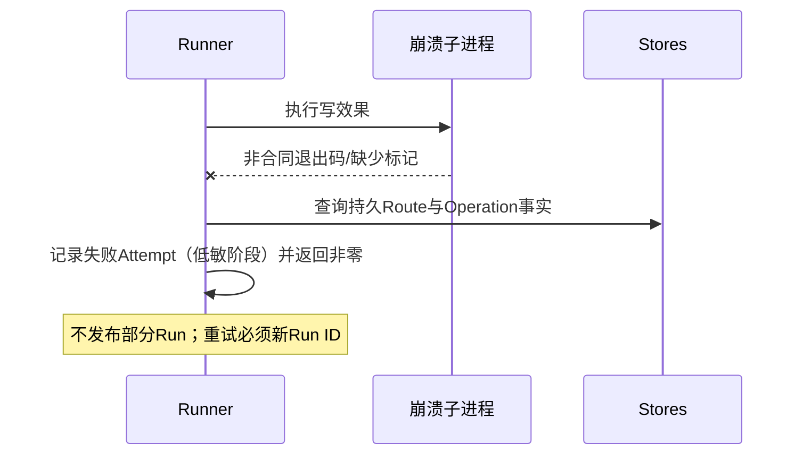
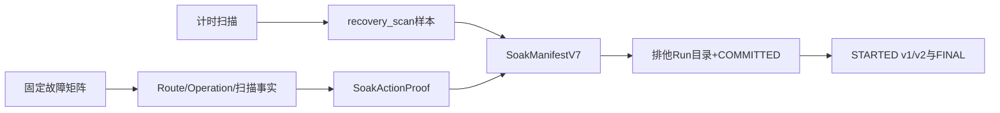
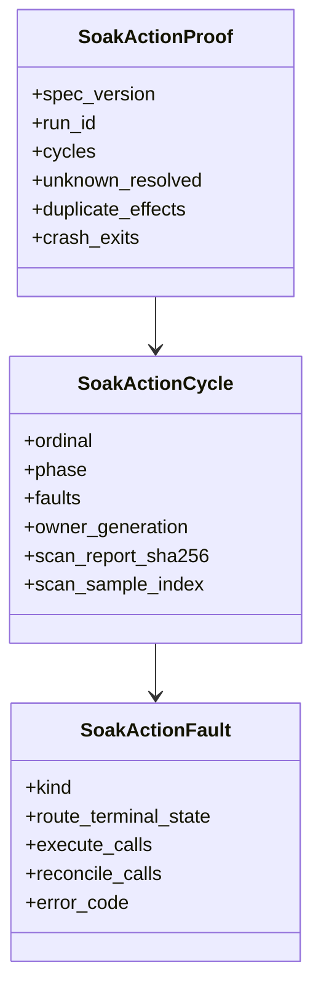

# 0.9.3d Action恢复固定故障矩阵Soak详细设计

## 1. 文档摘要

| 项目 | 内容 |
|---|---|
| 当前能力 | `TrustedActionRouter`已提供计划/审批/执行/对账统一入口；0.9.3c已提供双层Owner、持久Operation Deadline、`running/reconciling → unknown`只对账恢复和`scan_product_action_recovery`跨Store低敏扫描；样本、Manifest、Run/Attempt、阈值Profile与独立复验内核已实现；`long_session`、`many_threads`、`artifact_growth`、`sdk_capacity`、`restart`五个场景Runner已实现，其中SDK容量、重启与多Thread已完成三平台基线、冻结Profile与第二独立PASS。 |
| 本文设计状态 | `reviewing`；目标设计，不表示Action恢复Runner已实现、基线已运行或阈值已冻结。 |
| 代码版本 | `18ffe02426eb19ec0bc2f0e1ed12325333f8a435` |
| 影响模块 | Trusted Actions、Execution Plan、Session、Artifact、Product Config恢复扫描、Soak证据合同与发布工程；不改变任何生产协议、数据库Schema或公共CLI。 |
| 关键ADR | [ADR-0092](../adr/0092-reproducible-local-soak-and-release-thresholds.md)、[ADR-0091](../adr/0091-action-runtime-fencing-and-bounded-reconciliation.md)。 |
| 关键测试/证据 | 现有Router/恢复扫描测试；本文新增的Runner回归、Proof合同与发布入口测试。 |

本文设计0.9.3d第六个也是最后一个Soak场景`action_recovery`：以固定故障矩阵驱动真实Trusted Action主链，测量恢复扫描时延，核对UNKNOWN只对账、零重复效果、Owner栅栏与跨Store完整性。场景测量边界固定为`product_action`。

## 2. 需求背景

[0.9.3d总体详设](m09-3d-soak-and-performance-evidence.md)第11.1节把`action_recovery`定义为固定故障矩阵循环：Owner/Fence失效、效果写入/返回边界、Audit/Process边界与Artifact引用窗口，正式样本为`recovery_scan`与`rss_peak`。总体详设第6节把该Runner列为唯一未实现场景；ADR-0092第8条要求0.9.3d完成须包含全部场景的真实负载与故障回归。现有`tests/trusted_actions`与`tests/product_config`覆盖语义正确性，但不提供规模化的恢复扫描时延样本、可重算低敏Proof或阈值复验入口。

## 3. 设计目标与非目标

### 3.1 目标

1. 实现`run_action_recovery`真实模块Runner：真实`SQLiteExecutionPlanStore`、`SQLiteActionAuditStore`、`SQLiteSessionStore`、`SQLiteArtifactStore`、`TrustedActionRouter`、`recover_interrupted_actions`与`scan_product_action_recovery`；替身只允许出现在受控故障Executor与受控崩溃子进程。
2. 固定故障矩阵`action-recovery-v1`，逐轮覆盖四类故障：写效果返回边界UNKNOWN、宿主硬退出Owner失效、Audit已提交而Execution Plan缺失、Artifact引用窗口孤儿。
3. 每轮一次计时`scan_product_action_recovery`形成`recovery_scan`样本；进程级`rss_peak`样本沿用既有适配器。
4. 低敏Proof `harnessix.soak-action-proof/v1`记录逐轮故障、对账计数、扫描报告与Owner代际；Reader可从原始样本独立交叉核验。
5. 证据版本升级为`harnessix.soak-manifest/v7`与`harnessix.soak-scenario/v7`；历史v1～v6证据原字节与Reader保持兼容。
6. 提供正式基线入口、冻结Profile候选入口与三平台手动工作流；缩小负载只能产生`unverified`。

### 3.2 非目标

1. 不新增Action HTTP/Worker、远程数据库、性能控制面或公共CLI/SDK协议。
2. 不改变Trusted Action路由、审批、UNKNOWN、对账或恢复扫描的生产语义；不为取得样本跳过任何完整性断言。
3. 不由Runner直接执行Action效果进行“恢复”；恢复只允许`recover_interrupted_actions`、`reconcile`与现有扫描端口。
4. 不测量真实Process Supervisor孤儿回收（该路径由0.9.3c专项测试覆盖）；本场景故障矩阵以Route/Plan/Artifact/Owner四类边界为限。
5. 不公开Plan ID、Route ID、路径、参数正文、异常原文或任何业务身份。

## 4. 约束、假设与术语

| 项目 | 定义 | 影响 |
|---|---|---|
| 故障矩阵版本 | 固定字符串`action-recovery-v1` | 矩阵内容、顺序或故障点变化必须升版本并重建基线。 |
| 受控崩溃子进程 | 独立Python进程执行一次写效果后`os._exit`硬退出 | 效果标记只写一次；主进程不得重演Execute。 |
| 效果标记 | 崩溃Executor写入临时夹具目录的一次性标记文件 | 主进程Reconcile只观察标记；标记被写两次即重复效果，运行失败。 |
| 轮（cycle） | 依次执行四类故障并以一次计时扫描收尾的固定序列 | 正式基线要求2轮预热与至少20轮正式测量。 |
| 孤儿 | 扫描发现的跨Store引用缺口 | 夹具植入的Plan缺失由扫描修复、Artifact引用窗口由扫描计数；未预期孤儿使Manifest `orphan>0`并失败关闭。 |
| 当前/规划 | “当前”仅描述本Revision已存在源码；“规划”为本文目标 | 规划入口不得写成当前能力。 |

## 5. 总体架构



### 5.1 图示说明

- Runner只编排真实产品模块与受控故障目标；真实写效果只由崩溃子进程产生一次，主进程恢复路径只调用`recover_interrupted_actions`与`reconcile`。
- 扫描调用前由`audit.runtime_owner()`取得真实Owner栅栏；每次取得递增持久Generation，模拟产品重启后的新Owner。
- Proof、样本、Manifest、Attempt、Profile与报告复用既有证据合同，仅按版本规则新增`action-proof.json`与v7。

### 5.2 变更前后边界

| 边界 | 当前Revision事实 | 本设计规划变化 |
|---|---|---|
| Trusted Action语义 | 计划/审批/执行/UNKNOWN/对账/恢复扫描已实现 | 不变化；Runner只调用现有入口。 |
| Soak证据合同 | v1～v6 Manifest与五类Proof | 新增v7 Manifest与Action Proof；旧版本只读兼容。 |
| 阈值冻结 | `_verify_profile_baseline`拒绝`action_recovery` | 接受v7完整Proof的正式基线。 |
| 发布入口 | 五个场景各有release/candidate入口 | 新增Action恢复两个入口与两个手动工作流。 |

## 6. 模块职责与依赖

| 模块 | 职责 | 允许依赖 | 禁止依赖 | 生命周期 |
|---|---|---|---|---|
| `run_action_recovery`（规划） | 编排固定故障矩阵、计时扫描、完整性断言与证据发布 | 当前Trusted Action/Store/恢复端口、RSS适配器、证据Writer | 用户Workspace、外部系统、直接Execute恢复、绕过审批 | 一个Run独占；异常保留失败Attempt，硬退出保留STARTED。 |
| 受控Executor夹具（规划） | UNKNOWN返回Executor与崩溃标记Executor | 临时夹具目录标记文件 | 网络、真实外部系统、第二次效果写入 | 每Run独立创建销毁；调用计数进入Proof。 |
| 崩溃子进程入口（规划） | 加载同一计划并执行一次后硬退出 | 与主进程相同的真实Store与Router | 取得主进程Owner锁、重演其他Route | 每轮一个进程；退出码73为合同事实。 |
| `SoakActionProof`（规划） | 逐轮低敏故障/对账/扫描账本 | 扫描报告摘要、样本索引、Owner代际 | Plan/Route/Thread ID、路径、参数正文 | 与Run同生命周期；Reader独立核验。 |

## 7. 核心流程

### 7.1 正常流程图



### 7.2 正常时序图（单轮）



### 7.3 失败与恢复时序图



- 子进程退出码不是73、标记缺失或标记被写两次，运行失败；不解读为对账成功。
- 对账后Route不是`succeeded`、Executor execute计数不等于1或扫描报告计数与Proof不一致，运行失败。
- 取消/超时遵循既有Attempt合同：保留低敏失败终态；硬退出只保留STARTED。

## 8. 数据流



| 数据类别 | 来源 | 持久化位置 | 脱敏规则 |
|---|---|---|---|
| 故障与对账计数 | Runner观测Executor调用与Route终态 | Proof | 只有计数、阶段、稳定错误码与扫描报告摘要。 |
| 扫描报告 | 现有恢复端口 | Proof | 沿用`ActionRecoveryScanReport`低敏字段与摘要。 |
| 时延/RSS样本 | 单调时钟与平台RSS适配器 | samples.jsonl | 只有数值、单位、序号与来源。 |
| 夹具标记 | 崩溃子进程 | 临时目录，运行结束销毁 | 不进入任何证据文件。 |

## 9. 状态机

Runner级状态机与总体详设第9节一致（`prepared/warming/measuring/reconciling/finalizing/published/failed/unverified`）。Route级事实沿用Trusted Action既有状态机；本场景额外断言：

| 故障 | 执行后Route | 恢复动作 | 恢复后Route | 禁止行为 |
|---|---|---|---|---|
| 效果返回边界 | `unknown` | `reconcile`一次 | `succeeded` | 再次Execute。 |
| 宿主硬退出 | `running`（未结算） | 新Owner后`recover_interrupted`+`reconcile` | `unknown→succeeded` | 旧Owner继续提交；重放效果。 |
| Plan缺失 | 任意终态 | 扫描修复 | 不变 | 扫描调用Executor。 |
| Artifact引用窗口 | 无关 | 扫描计数 | 不变 | 删除或隐藏孤儿对象。 |

## 10. 类与组件设计



| 类/组件 | 职责 | 关键不变量 |
|---|---|---|
| `SoakActionFault`（规划） | 单故障的低敏结果 | `execute_calls==1`；UNKNOWN类`reconcile_calls==1`；`duplicate_effects==0`。 |
| `SoakActionCycle`（规划） | 一轮四故障与计时扫描索引 | 故障顺序固定；扫描样本索引全Run递增。 |
| `SoakActionProof`（规划） | 全Run账本 | 轮序号连续；`unknown_resolved`等于UNKNOWN故障数；`crash_exits`等于崩溃轮数。 |
| `verify_action_proof`（规划） | 与样本/Manifest交叉核验 | 索引唯一映射到`recovery_scan`样本且phase一致。 |

## 11. 接口设计

| 接口 | 调用者 | 输入/输出 | 前置/后置 | 错误与取消 |
|---|---|---|---|---|
| `run_action_recovery(evidence_root, *, code_revision, cycle_count, warmup_count, seed=0, scan_timeout_seconds=30, threshold_profile_ref=None)`（规划） | 发布入口/缩小回归 | 输入固定轮数与Revision；输出Run目录与`SoakManifestV7` | 正式基线要求`cycle_count>=20`、`warmup_count==2`、干净Revision；候选要求正式规模 | 任一断言失败抛稳定KernelError并保留失败Attempt；扫描超时先排空再失败 |
| `verify_action_proof(proof, *, run_id, cycle_count, warmup_count, samples, unknown_effect)`（规划） | 发布与Reader | Proof与原始样本 | 索引/计数/摘要全部一致 | ValueError由调用方转为稳定证据错误 |
| `run_action_recovery_soak_release`（规划） | 三平台基线Job | `--evidence-root` | 固定20+2轮；复核Run/Attempt一致 | 退出0/1；日志仅稳定码 |
| `run_action_recovery_soak_candidate`（规划） | 三平台候选Job | `--evidence-root`、`--report-root` | 本平台唯一Profile与完整基线先核验 | 退出0仅PASS，1前置错误，2非PASS |

## 12. 数据结构与重点字段

`SoakActionProof`（`harnessix.soak-action-proof/v1`，文件`action-proof.json`，上限256 KiB）：

| 字段 | 类型 | 语义 |
|---|---|---|
| `spec_version`/`run_id` | 固定字面量/32位十六进制 | 与Run身份一致。 |
| `cycles` | 有序数组 | 每轮含`ordinal`、`phase`、四项`SoakActionFault`、`owner_generation`、`scan_report_sha256`、`scan_sample_index`。 |
| `unknown_resolved` | 非负整数 | 等于全Run UNKNOWN故障且对账成功数。 |
| `duplicate_effects` | 固定0 | 任何重复效果写入使构造失败。 |
| `crash_exits` | 非负整数 | 合同退出码73的子进程数。 |

`SoakManifestV7`：`spec_version=harnessix.soak-manifest/v7`、`scenario_version=harnessix.soak-scenario/v7`、`scenario_id=action_recovery`、`action_proof_sha256`绑定证据索引；负载要求`turn_count==0`、`thread_count==0`、`artifact_count==0`、`pending_limit is None`、`fault_matrix_version=="action-recovery-v1"`；故障计数要求`unknown_effect==(warmup+cycle)×2`、`duplicate_effect==0`、`orphan==0`、`cancelled/timed_out/eof==0`；`sample_counts`为`recovery_scan`与`rss_peak`各精确计数；正式基线另要求`warmup_count==2`且正式轮不少于20。

## 13. 持久化、事务与迁移

业务事实全部位于临时State Root的既有四个Store，Schema不变化；证据发布沿用排他Run目录、最后`COMMITTED.json`与Attempt两阶段提交。v7只在Reader文件集合与Manifest判别中追加，v1～v6既有证据与Reader分支保持原字节兼容；`SoakManifest.validate_manifest`对`action_recovery`的既有`fault_matrix_version`必填检查保持不变。

## 14. 并发、幂等与一致性

- 一个Run单写；崩溃子进程与主进程按顺序先后写同一Audit库，不并发持有Owner锁。
- 每次`runtime_owner()`递增Generation；旧Generation提交被既有栅栏拒绝，Runner不依赖该拒绝路径产生样本。
- 计划/审批按既有幂等语义执行一次；Runner不复用计划ID或审批指纹。
- Proof、样本与Manifest的交叉引用全部由发布器与独立Reader双向核对。

## 15. 失败语义与恢复矩阵

| 故障点 | 可观测事实 | 对外状态 | 恢复动作 | 可否PASS |
|---|---|---|---|---|
| 崩溃子进程退出码非73或缺标记 | 子进程结果缺失 | `failed` Attempt | 查询持久事实后结束Run | 否 |
| 效果标记被写两次 | Proof构造失败 | `failed` Attempt | 不掩盖；保留计数 | 否 |
| UNKNOWN对账后非succeeded | Route终态不符 | `failed` Attempt | 不重放Execute | 否 |
| 扫描报告与Proof计数不一致 | 摘要/计数冲突 | `failed` Attempt | 发布失败事实 | 否 |
| 未预期孤儿（orphan>0） | Manifest故障计数 | `failed` Attempt | 先修复设计/夹具 | 否 |
| 扫描超时 | 计时边界溢出 | `failed` Attempt | 先排空在途任务再失败 | 否 |
| RSS单位未知 | 适配器稳定错误 | `unverified` | 不填0 | 否 |
| 候选缺STARTED v2或Profile错配 | Attempt/复验拒绝 | `unverified`报告 | 新Run ID重试 | 否 |

## 16. 安全与隐私

证据只含计数、阶段、稳定错误码、报告摘要、Owner代际、数值样本与随机Run ID；不保存Plan/Route/Thread/Artifact ID、路径、参数正文、标记内容、异常原文或子进程stderr。夹具标记只含固定字节且留在临时目录。崩溃子进程不接收凭据、不访问网络与用户Workspace。CLI入口捕获未分类异常仅输出`internal_error`。

## 17. 可观测性

复用总体详设第17节低敏信号；本场景新增Proof级诊断仅为稳定故障kind、轮序号与扫描报告摘要，不增加高基数标签。失败Attempt的`phase`字段沿用`prepared/warming/measuring/reconciling/publishing`。

## 18. 兼容性与发布

1. 三平台手动工作流`action-recovery-soak.yml`与`action-recovery-soak-candidate.yml`仅`workflow_dispatch`触发；快速CI只运行缩小负载（3轮正式+2轮预热），状态只能`unverified`。
2. 正式基线、Profile冻结与候选复验顺序沿用既有合同；候选入口按平台精确发现唯一Profile。
3. Windows字节级证据依赖`.gitattributes`对新增验证目录的`-text`规则；候选入口测试必须覆盖该属性。
4. 本场景关闭仅表示固定故障矩阵的工程护栏通过，不声明任意外部系统的恢复SLO。

## 19. 核心业务逻辑伪代码

```text
run_action_recovery(...):
    validate_load_and_revision()
    begin_attempt(STARTED)
    for cycle in 1..(warmup + cycle_count):
        fault_unknown = plan_and_approve(unknown_executor)
        outcome = router.execute(fault_unknown)              # → unknown
        assert router.reconcile(fault_unknown) == succeeded  # 只对账
        assert unknown_executor.calls == 1
        fault_crash = plan_and_approve(crash_executor_binding)
        run_crash_child(fault_crash)                         # 标记一次 + exit(73)
        with audit.runtime_owner() as fence:                 # 新Owner代际
            assert router.recover_interrupted() == (fault_crash,)
            assert crash_reconcile_observes_single_marker()
            create_plan_orphan_and_artifact_orphan()
            scan = timed(scan_product_action_recovery(..., fence))
            assert scan.repaired_execution_plans == cycle
            assert scan.artifact_orphans == cycle
        assert duplicate_effects == 0
        append_recovery_scan_sample(scan.elapsed_ns)
    append_rss_sample()
    proof = SoakActionProof(...)
    publish_measured_run(..., action_proof=proof)            # v7
    read_published_run(run_directory)
    finish_attempt(COMMITTED)
```

## 20. 源码与测试映射

| 设计元素 | 源码 | 测试 | 当前/规划 |
|---|---|---|---|
| 路由/对账/恢复 | [`trusted_actions/router.py`](../../src/harnessix/trusted_actions/router.py)、[`operation_router.py`](../../src/harnessix/trusted_actions/operation_router.py) | [`test_router.py`](../../tests/trusted_actions/test_router.py) | 当前实现；Runner只调用。 |
| 跨Store扫描 | [`product_config/action_recovery.py`](../../src/harnessix/product_config/action_recovery.py) | [`test_action_recovery.py`](../../tests/product_config/test_action_recovery.py) | 当前实现。 |
| Action Proof | `scripts/soak_action_proof.py` | `tests/benchmarks/test_soak_action_proof.py` | 规划。 |
| v7 Manifest与Reader | `scripts/soak_manifest.py`、`scripts/soak_evidence.py`、`scripts/soak_run_common.py` | `tests/benchmarks/test_soak_manifest.py`、`test_soak_evidence.py` | 规划扩展；旧版本兼容。 |
| 阈值场景门禁 | `scripts/soak_threshold.py` | `tests/benchmarks/test_soak_threshold.py` | 规划接受v7。 |
| Runner与入口 | `scripts/soak_action_recovery.py`、`scripts/run_action_recovery_soak_release.py`、`scripts/run_action_recovery_soak_candidate.py` | `tests/benchmarks/test_soak_action_recovery.py`、`test_run_action_recovery_soak_release.py`、`test_run_action_recovery_soak_candidate.py` | 规划。 |
| 三平台工作流 | `.github/workflows/action-recovery-soak.yml`、`action-recovery-soak-candidate.yml` | 手动触发后登记运行ID | 规划。 |

## 21. 测试设计与验收标准

1. Proof合同：缺字段、未知字段、序号缺口、索引重复、计数不一致与摘要篡改拒绝。
2. Runner缩小回归：3轮正式+2轮预热完成全故障矩阵；UNKNOWN只经对账收敛、重复效果为0、扫描计数与Proof一致；产物状态`unverified`。
3. 崩溃子进程：真实`os._exit`窗口后主进程恢复不重放效果；非73退出或双标记失败关闭。
4. 负载拒绝：正式参数不足、Revision不干净、候选引用小于正式规模均拒绝。
5. 取消/超时：扫描超时保留失败Attempt且不发布部分Run。
6. 发布门槛：三平台各完成正式基线、冻结Profile与第二独立PASS后才可登记本场景关闭；单平台或缩小负载不得关闭。

## 22. 风险、限制与后续工作

| 项目 | 影响 | 缓解 |
|---|---|---|
| 扫描随Route数量增长的遍历成本 | 大规模Route下扫描时延可能超阈值 | 本场景先实测；优化另立设计并复跑0.9.3c回归。 |
| 崩溃子进程平台差异 | Windows进程创建与文件锁语义不同 | 三平台真实Job验收；失败保留诊断。 |
| Process Supervisor孤儿回收未纳入矩阵 | 不覆盖该路径规模证据 | 0.9.3c语义测试已覆盖；如需规模证据另立场景版本。 |
| 固定四故障不穷尽外部系统类型 | 不能外推到任意Executor | 矩阵版本化；新增故障必须新版本与新基线。 |

## 23. 变更记录

| 文档版本 | 代码版本 | 日期 | 变更摘要 |
|---|---|---|---|
| 1 | `18ffe02426eb19ec0bc2f0e1ed12325333f8a435` | 2026-09-24 | 建立Action恢复固定故障矩阵Soak的场景合同、Proof、v7证据版本、Runner与发布入口设计；实现与三平台验收待完成。 |
