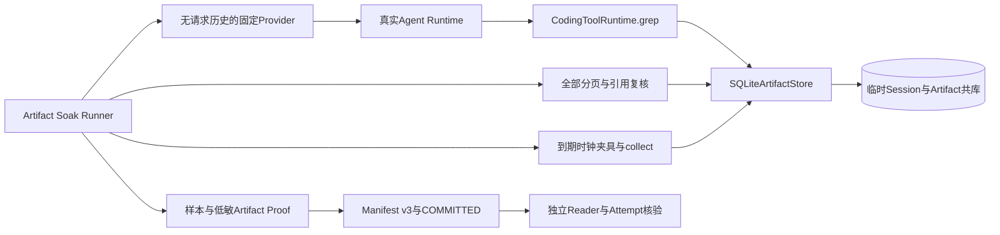
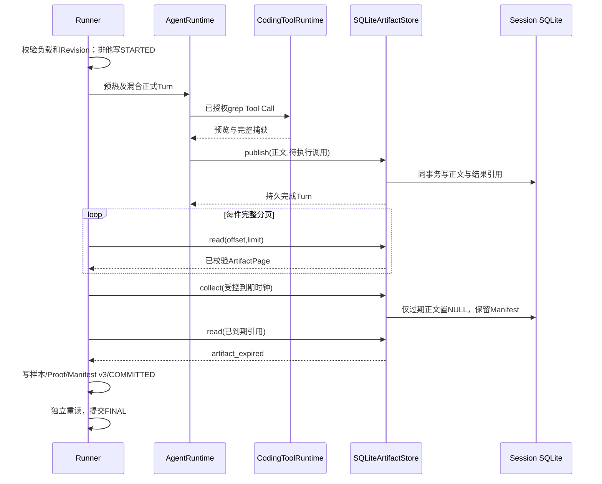

# 0.9.3d Artifact增长、分页与清理Soak详细设计

## 1. 需求背景与源码求证

0.9.3d要求混合小件和接近单件上限的Artifact，测量发布与分页读取分位数、RSS及持久增长，并证明到期清理不会把历史引用变成空成功。现有[总体设计](m09-3d-soak-and-performance-evidence.md)定义`artifact_growth → artifact_store`测量边界和指标白名单；当前[`run_artifact_growth`](../../scripts/soak_artifact_growth.py)已接入真实Agent/Tool/Artifact链。手工构造数值Manifest不能代替生产存储链；发布证据仍以干净Revision正式负载和独立复验为准。

| 已核对的源码事实 | 对设计的约束 |
|---|---|
| [`SQLiteArtifactStore.publish`](../../src/harnessix/artifacts/sqlite.py)在同一SQLite事务中写正文与Session结果，要求活动Runtime Owner、待执行Tool Call、Workspace Scope及配额 | 负载必须通过真实Agent Tool Call形成待执行事实，不直接向表写入“测试Artifact” |
| [`CodingToolRuntime.execute_scoped`](../../src/harnessix/tools/runtime.py)把`grep`完整捕获正文与预览分离；[`SearchCapture`](../../src/harnessix/tools/search.py)强制1 MiB/10000记录上限 | 近上限夹具必须预先定规模并在运行中验证实际正文大小；超限不是可接受的成功样本 |
| [`SQLiteArtifactStore.read`](../../src/harnessix/artifacts/sqlite.py)逐页核对归属、完整正文SHA、记录数和历史引用，每页最多200条/24 KiB | 每件必须读完所有页，页数、记录数、字节数和游标均要核对，不能只读首屏 |
| [`SQLiteArtifactStore.collect`](../../src/harnessix/artifacts/sqlite.py)仅将到期`published`正文改为`expired/NULL`，活动Turn受保护 | 清理应在Turn终态后执行，保留Manifest，验证过期读取稳定拒绝；不把逻辑清理等同于物理SQLite文件缩小 |
| [`ScriptedProvider.stream`](../../src/harnessix/models/scripted.py)保留完整请求副本 | 正式负载必须使用不保留请求历史的固定脚本Provider，避免RSS夹具污染 |
| [`soak_evidence.py`](../../scripts/soak_evidence.py)和[`soak_manifest.py`](../../scripts/soak_manifest.py)只识别v1样本及长会话v2 Proof | 增加Artifact专用、低敏、可重算的v3证据，不无版本改写历史v1/v2字节 |

[可靠性专项研究](../research/reliability-and-performance.md#53-持久化和trusted-action长期边界)已经把Artifact TTL Tombstone、物理空间回收和跨Store孤儿区分为不同事实；本场景只验证前者及当前Store的增长，不宣称完成在线Vacuum或全局用户数据删除。

## 2. 设计目标、非目标与验收口径

1. 以临时Workspace和临时Session运行真实`AgentRuntime → CodingToolRuntime.grep → SQLiteArtifactStore.publish/read/collect`；模型端仅为确定性Tool Call夹具。
2. 正式负载固定2件预热、至少20件正式样本；正式样本至少各含2件小件和近上限件，后者正文大小处于`[80%, 100%) × MAX_ARTIFACT_BYTES`；规模由版本化负载合同冻结，不由运行结果回填。
3. 发布时延只包围`SQLiteArtifactStore.publish`；读取时延只包围单次`read`页，二者不得冒充Agent整Turn或完整产品时延。
4. `ArtifactProof`记录每件的匿名序号、阶段、正文大小、记录数、完整分页计数与采样索引，以及清理前后逻辑字节和Tombstone计数；Reader从原始样本及Proof重算总量、索引和Manifest绑定。
5. 所有成功Run必须有完整Attempt、Replay一致性、正文/引用逐件核验、清理后`artifact_expired`及零孤儿。失败、取消、超时或硬退出不得发布PASS。

非目标：不新增用户可调用的Soak命令、网络服务、SQLite迁移、任意正文导出或自动Vacuum；不把固定Provider质量当成真实Provider质量。单平台数值仍须经独立冻结Profile及第二次同环境运行复验，且不替代其他五场景和三平台发布门禁。

## 3. 总体架构与数据流



Runner独占一个临时Workspace/State Root和证据Run ID。Provider仅按当前Turn和Step产生一次`grep`调用、一次固定文本完成，不保存`ModelRequest`。测量器仅记录单调时钟差值和数字，不拦截或修改Artifact内容。发布前在私有State Root中验证业务事实；证据文件不存Workspace路径、查询词、正文、Artifact ID、Thread/Turn/Call ID或异常原文。



## 4. 领域契约与关键字段

| 对象/字段 | 约束及来源 | 用途与失败语义 |
|---|---|---|
| `SoakLoad.artifact_count`、`turn_count`、`warmup_count` | 两个总数字段均为实际发布总数；每Turn一件、单Thread；正式基线2件预热及至少20件正式样本 | 与Proof条目及Store计数精确相等，规模不足不得标记`baseline` |
| `SoakSample.artifact_publish/artifact_read/rss_peak` | 时延ns、峰值bytes；正式指标均至少一个样本 | 从原始JSONL重算分位数和RSS，不信任Manifest自报统计 |
| `ArtifactProof.spec_version/run_id` | 固定`harnessix.soak-artifact-proof/v1`及Run ID | 只与本Run绑定，未知版本/字段拒绝 |
| `ArtifactProof.entries` | 连续匿名序号、阶段、大小类别、`size_bytes/record_count/page_count/read_record_count`及发布/每页样本索引 | Reader核对样本唯一性、时间顺序、测量阶段、发布和读取指标覆盖；不出现业务UUID或路径 |
| `ArtifactProof.cleanup` | 清理前正文逻辑字节、过期件数、保护件数、清理后正文逻辑字节、Tombstone件数 | 清理后应为零活正文，保留全部Manifest；物理DB/WAL不要求缩小 |
| `SoakManifestV3.artifact_proof_sha256` | 规范Proof文件原始SHA-256 | `evidence_sha256`精确包含样本与Proof；v1/v2 Reader原字节不变 |
| `SoakFileWatermarks.artifact_before/after_bytes` | 负载前与清理前正文逻辑字节 | 独立Profile比较增长峰值；清理后水位由Proof另记，避免以0掩盖增长 |
| `SoakFaultCounts.orphan` | 从引用、正文与清理复核产生 | 非零不得发布有效基线；不得把缺失引用记作已清理 |

`ArtifactProof`是低敏数值账本，能独立重算样本索引与数量；它不能在临时业务库删除后证明每一件正文的原始内容，也不提供恶意写入者的数字签名。正式来源仍需干净Revision、CI和发布工程审核。

### 4.1 接口设计

| 接口 | 输入与输出 | 前置条件及失败语义 |
|---|---|---|
| [`run_artifact_growth`](../../scripts/soak_artifact_growth.py) | `evidence_root`、Revision、正式Turn数、预热数、Seed、Turn/Page期限、可选Profile引用；返回Run目录和Manifest v3 | 至少20正式件时先核对干净Revision；失败保留Attempt且不输出PASS；最多50正式Turn |
| [`SoakArtifactProvider.stream`](../../scripts/soak_artifact_growth.py) | 真实ModelRequest；Step1输出固定`grep`，Step2输出固定文本 | 不保留Request/历史；未知Step、缺失受信Tool或取消失败关闭 |
| [`MeasuredArtifactStore.publish`](../../scripts/soak_artifact_growth.py) | 与现有Store完全相同的调用和返回 | 只包围`super().publish`记录ns；不改变事务、异常或授权 |
| [`read_published_run`](../../scripts/soak_evidence.py) v3分支 | 私有Run目录；返回严格Manifest | 限制大小、精确文件集、规范字节、摘要及Proof与原始样本交叉核对 |
| `publish_run/read_published_run`（扩展） | v1/v2保持原合同；v3额外Proof | 文件集合与版本精确匹配；缺Proof、摘要错或重算不符拒绝 |

## 5. 核心逻辑伪代码与事务边界

```text
validate_load_and_clean_revision_if_formal()
STARTED = begin_attempt()                 # 先于Workspace和负载
with temporary_workspace_and_session():
    provider = stateless_fixed_grep_provider()
    artifacts = measured_real_sqlite_artifact_store()
    for planned_case in warmup + measured_cases:
        turn = await agent.run_turn(planned_case)
        assert completed_and_exactly_one_artifact_reference(turn)
        assert size_class_and_store_count_match()
        for page in read_all_pages(reference):
            assert advancing_cursor_and_reference_and_record_coverage(page)
        record_numeric_publish_and_read_samples()
    assert replay(events) == projection
    record_before_cleanup_body_bytes()
    with controlled_future_clock_after_ttl():
        collect_until_done()
        assert every_reference_returns_artifact_expired()
    assert live_body_bytes == 0 and tombstones == published_count
    proof = build_numeric_artifact_proof()
run = publish_v3(samples, proof, manifest)
read_published_run(run)
finish_attempt(committed, manifest_digest)
```

正文与Session结果仍由产品原事务提交，Runner只读查询`agent_artifacts`的逻辑字节、墓碑和Manifest数量，不直接写表。到期时钟只在所有Turn终态后、单Runner隔离进程内替换`artifacts.sqlite.utc_now`，随后恢复；它不改变真实用户TTL、数据库到期字段或公共API。当前`collect(limit=100)`覆盖Runner最大52件，逐件读取必须返回`artifact_expired`。证据根与临时业务库分离；`COMMITTED`和`FINAL`仍是两个提交边界，缺一即不可PASS。

### 5.1 可观测性与错误分类

样本只包含固定`artifact_publish/artifact_read/rss_peak`指标、阶段、序号、单位和数值；Proof只包含计数、字节水位与样本索引。失败Attempt仅记录`prepared/warming/measuring/reconciling/publishing`阶段，CLI/测试只输出稳定`KernelError.code`，不记录异常字符串、文件路径或正文。至少区分`soak_load_invalid`、`soak_artifact_size_invalid`、`soak_artifact_page_invalid`、`soak_artifact_cleanup_invalid`、`soak_artifact_timeout`及既有`soak_run_invalid`；实际实现不得将SQLite异常正文透传至报告。业务Trace仍由现有Agent/Artifact端口负责，Soak样本不成为审计权威。

## 6. 失败、取消、恢复与安全边界

| 故障 | 必须保留的事实 | 处理 |
|---|---|---|
| 夹具生成超限或近上限正文不足 | `STARTED`及低敏失败阶段 | 不调整测试门槛来获得成功；修正有版本的夹具后用新Run |
| Provider/Tool/Artifact发布失败或配额不足 | 原事务结果与失败Attempt | 不伪造Artifact；不发布有效Run |
| 单件分页重复、缺页、引用或SHA不一致 | 失败Attempt | 不以首屏或条目数替代全页校验 |
| 单次发布/读取超过显式期限 | 失败Attempt；在途SQLite任务先自然收敛 | `SQLiteSessionStore._session_connection`在打开/关闭时屏蔽提前退出，确保句柄完成关闭再清理Windows临时目录；无法收敛需进程级隔离 |
| 清理仍受活动Turn保护或Tombstone/正文计数不符 | 失败Attempt | 不直接修改表或跳过引用校验 |
| Run已提交而Attempt未提交 | 原样保留`STARTED`和Run | Reader可读Run，但独立阈值复验不得PASS |
| 样本、Proof或Manifest缺失/篡改 | Reader拒绝 | 新Run，不覆盖或修补旧证据 |

正式Runner不得访问用户Workspace、真实Provider Key或公网；只在随机临时目录内创建固定文本夹具。样本、Proof和Manifest为白名单数字/枚举/摘要，不保存正文、路径、业务ID或异常。RSS仍是运行进程峰值，不是Artifact独占内存；DB/WAL文件端点水位不等于物理空间回收。Windows临时文件句柄、POSIX目录同步与RSS单位仍需各平台CI及正式负载实证。

### 6.1 部署、兼容与回退

Runner仅作为发布工程脚本运行，不加入`harnessix code`、Agent Protocol、用户SDK或默认启动链，也不要求数据库、中间件或模型Key。Manifest v3和Artifact Proof只增加证据Reader分支；v1/v2文件集合、规范字节、摘要与旧验证证据保持原样。回退到只识别v1/v2的版本时，v3 Run必须被明确拒绝而不是误读为v1；业务临时State Root随Runner退出清理，证据原件不可覆盖，回退不删除已发布失败事实。正式Runner只能在单Writer、私有证据根和独立发布机器/沙箱中运行。

### 6.2 风险与取舍

以真实`grep`捕获产生近上限正文可覆盖模型调用到事务发布的主链，但受搜索扫描成本影响；因此发布时延仅在Store方法内测量，整个Turn耗时另由后续端到端场景覆盖。受控时钟使离线清理测试不必等待TTL，却不能证明真实24小时长期漂移；正式Beta仍需观察真实时间清理。v3 Proof增加证据体积和Reader分支，但避免在现有v1/v2合同中塞入可空字段、破坏历史规范字节。逻辑正文归零不等于物理文件缩小，后者由Store维护和备份/Restore门禁单独验证。

## 7. 已实现证据合同与后续实施

证据层已实现[`SoakArtifactProof`](../../scripts/soak_artifact_proof.py)、[`SoakManifestV3`](../../scripts/soak_manifest.py)、[`publish_run/read_published_run`](../../scripts/soak_evidence.py)和[`publish_measured_run`](../../scripts/soak_run_common.py)的v3分支。Proof白名单包含每件序号、阶段、大小类别、正文与记录数量、页数、发布样本索引和逐页读取样本索引，以及清理前后逻辑正文、过期/保护/Tombstone/Manifest计数。Reader在任何PASS判断前核对规范文件字节、SHA-256、精确文件集合、完整样本索引覆盖、阶段和顺序、Manifest负载及请求数；v1/v2原有文件集合和序列化路径不变。[合同回归](../../tests/benchmarks/test_soak_artifact_proof.py)覆盖v3发布/重读、缺失和篡改Proof、重复或缺失样本、清理与页数不一致及正式规模拒绝。

真实负载层已实现[`run_artifact_growth`](../../scripts/soak_artifact_growth.py)：固定Workspace文件产生3行小件和2500行近上限件，`Seed`只改变正式Turn的大小件顺序，不影响预热；Step1固定调用`grep`，Step2结束Turn。每件从真实ToolResult提取引用，校验发布次数、完整性和大小类别，随后调用真实`SQLiteArtifactStore.read`读完所有页并测量每页时延。Session事件必须重放得到相同投影；到期前逻辑正文必须等于所有引用大小之和，到期后正文归零、墓碑与Manifest数量等于发布数，历史引用逐件返回`artifact_expired`。[Runner回归](../../tests/benchmarks/test_soak_artifact_growth.py)覆盖混合件/全页、Replay、清理、非法规模、取消、Turn/Page超时、分页污染、清理不符、负载前Revision拒绝和阈值复验合同；Page超时先排空在途SQLite任务，再清理Windows临时库。只读`sqlite3`水位查询使用`closing()`显式释放连接；Python连接上下文只管理事务而不关闭句柄，缺失关闭在[首次Windows CI](https://github.com/carrie1988/Harnessix/actions/runs/35821931723)触发`WinError 32`，对应回归现检查查询后连接已关闭。测试中的Revision检查替身只验证合同路径，不能成为正式基线来源。

[第二次macOS规模诊断](../validation/soak-macos-artifact-2026-09-23-v2/README.md)在只读句柄修复后完成同规模真实负载，
但[对应CI 35822751423](https://github.com/carrie1988/Harnessix/actions/runs/35822751423)的Windows Benchmark
仍在10毫秒Turn超时回归中出现`session.db`占用。此时旧同步只读连接已关闭；新增缺口位于
[`SQLiteSessionStore._session_connection`](../../src/harnessix/session/sqlite.py)原先直接使用的异步连接入口：
若取消发生在`aiosqlite.__aenter__`尚未返回时，驱动线程可能持有已打开的文件句柄，而调用方已离开
`TemporaryDirectory`作用域。现将打开、回滚、关闭各自作为可等待的资源任务，打开期取消先排空并关闭，
关闭期取消先完成关闭再传播；[Session连接回归](../../tests/agent/test_store.py)注入两个边界并断言可立即删除
数据库文件。这个修复不得追认旧诊断Run；修复Revision `5d48b97`已由[CI 35824543623](https://github.com/carrie1988/Harnessix/actions/runs/35824543623)六实例验收；[新macOS单平台规模Run](../validation/soak-macos-artifact-2026-09-23-v3/README.md)经独立重算后可作为Profile候选来源，但没有阈值复验或Linux/Windows正式负载。

剩余发布验证步骤：

1. 补齐配额失败、受保护清理、真实进程硬退出与Run/Attempt提交窗口等复合故障验证；确认近上限夹具在三平台产生相同字节区间。
2. 在干净Revision执行正式规模，保存低敏原始Run/Attempt和三平台证据；不能以工作区内禁用Revision检查的合同测试替代。
3. 由发布工程独立评审并冻结每平台数值Profile，使用新Run复验；其他Soak场景及0.9.4～0.9.6仍须各自通过。

Runner实现不表示0.9.3d或1.0已通过；当前文档保持`reviewing`，正式三平台负载和独立阈值仍待完成。
