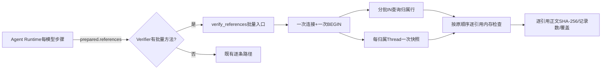

# 0.9.3d 模型历史Artifact批量验证详细设计

## 1. 文档摘要

| 项目 | 内容 |
|---|---|
| 当前能力 | 0.6.2c起每个模型步骤前由`_verify_history_artifacts`逐条调用`verify_reference`验证历史中全部Artifact引用；单条验证包含归属行查询、完整Thread快照加载、Session引用一致性、正文SHA-256与记录数、分页/省略覆盖核对，5秒总预算超时即`context_artifact_timeout`失败关闭。 |
| 实测缺陷 | 300件Artifact增长Soak在Linux/macOS/Windows一致于第278～291轮失败：逐条路径每步加载N份完整Thread快照并线性查Turn，单步成本O(N²)，约280个引用时超出5秒预算。三个平台失败Attempt与本地复现错误`context_artifact_timeout`一致。 |
| 本文设计状态 | `reviewing`；目标设计，不表示批量验证已实现。 |
| 影响模块 | `artifacts`（批量验证实现）、`agent`（历史验证调用点）、`context`（调用方语义不变）。 |
| 关键ADR | [ADR-0057](../adr/0057-tool-result-model-view-and-artifact-binding.md)（引用验证合同）、[ADR-0092](../adr/0092-reproducible-local-soak-and-release-thresholds.md)（实测来源）。 |

## 2. 需求背景与源码求证

| 源码 | 已求证事实 |
|---|---|
| [`agent/runtime.py:_verify_history_artifacts`](../../src/harnessix/agent/runtime.py) | 对`prepared.references`逐条`verify_reference`，整体只有5秒`HISTORY_ARTIFACT_TIMEOUT_SECONDS`预算；超时任一引用未验证即失败关闭，不调用下一步模型。 |
| [`artifacts/sqlite.py:verify_reference`](../../src/harnessix/artifacts/sqlite.py) | 每条引用独立打开连接、查询归属行、调用`session._snapshot`加载完整Thread、扫描`get_turn`线性查找、读取正文并做SHA-256与JSONL记录数校验。 |
| [`session/sqlite.py:_snapshot`](../../src/harnessix/session/sqlite.py) | 每次调用从`agent_threads`反序列化完整聚合快照；300个Turn时单次数十毫秒级，乘以引用数即突破预算。 |
| 300件Soak三次失败 | 工作流35969187237（配额默认128，已另行修复）与35973888376（第278～291轮`context_artifact_timeout`）证明该缺陷与平台无关。 |

验证语义（归属、用途、TTL、manifest一致性、正文摘要、分页/省略覆盖、首个失败引用的错误码与优先级）是ADR-0057合同，不允许因性能优化削弱；本设计只做共享读取，不删除任何检查、不缓存跨步结论（TTL到期必须能被后续步骤发现）。

## 3. 设计目标与非目标

### 3.1 目标

1. 同一模型步骤的全部历史引用验证只打开一次连接、只加载一次各归属Thread快照、行查询合并为分批`IN`查询；
2. 逐引用的检查顺序、错误码与首个失败优先级与逐条路径完全一致；
3. 正文SHA-256、记录数、分页与省略覆盖检查全部保留；
4. 未实现批量方法的Verifier自动回退逐条路径，端口兼容不破坏；
5. 300件Artifact历史单步验证回到5秒预算内，并有回归测试证明语义等价。

### 3.2 非目标

1. 不改变`verify_reference`单条路径的行为与签名；
2. 不引入跨步骤/跨Turn验证缓存（TTL与外部清理必须按现状被每次验证发现）；
3. 不扩大`HISTORY_ARTIFACT_TIMEOUT_SECONDS`；正文逐字节校验成本随历史正文总量线性增长，超出预算的历史规模仍失败关闭，本设计不承诺无限历史；
4. 不修改Session快照格式、Artifact Schema或公共协议。

## 4. 总体架构与数据流



数据流与逐条路径相同，只是把与引用数量无关的读取（连接、快照、行查询）提升为每步一次，与引用相关的检查（归属、manifest一致性、正文、覆盖）仍逐引用执行并保持原顺序。

## 5. 领域契约、数据结构、持久化与事务

| 对象/字段 | 类型与约束 | 业务含义 | 失败语义 |
|---|---|---|---|
| `HistoryReferenceCheck.owner_thread_id` | UUID | 引用归属Thread；Fork历史保留原归属 | 与归属行`thread_id`不符为`artifact_not_found` |
| `HistoryReferenceCheck.call_id` | UUID | 产生引用的Tool Call | 非分页用途与行不符为`artifact_not_found` |
| `HistoryReferenceCheck.reference` | `ArtifactRef` | 历史中冻结的引用副本 | 与存储manifest不一致为`artifact_corrupt` |
| `HistoryReferenceCheck.purpose` | `HistoryArtifactPurpose` | 引用用途 | 非白名单为`artifact_invalid` |
| `HistoryReferenceCheck.omitted_field` | 可选枚举 | 省略字段；存在时要求完整覆盖证明 | 缺完整证明为`artifact_corrupt` |

持久化与事务：批量入口只读取既有`agent_artifacts`行与Session快照，单连接单`BEGIN`只读事务，不写业务数据、不改Schema、不新增迁移；分批`IN`查询每批最多100个ID。错误分类与逐条路径完全一致（`artifact_invalid`/`artifact_not_found`/`artifact_corrupt`/`artifact_expired`），首个失败引用的优先级不变。

## 6. 接口设计

| 接口 | 输入/输出 | 语义与失败 |
|---|---|---|
| `HistoryReferenceCheck`（`artifacts/contracts.py`新增合同） | `owner_thread_id`、`call_id`、`reference`、`purpose`、`omitted_field` | 冻结合同；与运行时逐条实参一一对应。 |
| `SQLiteArtifactStore.verify_references(entries, *, workspace_scope)` | 有序检查条目序列；无返回 | 空序列直接返回；任一`purpose`非法先按顺序报`artifact_invalid`；逐条目复刻单条检查顺序与错误码；首个失败即抛出。 |
| `AgentRuntime._verify_history_artifacts` | 不变 | `getattr(verifier, "verify_references", None)`存在时走批量入口，否则回退逐条循环；超时与取消语义不变。 |

批量入口的检查顺序（与`verify_reference`逐条一致）：`purpose`白名单 → 归属行存在且`thread_id`匹配（否则`artifact_not_found`）→ 非分页用途的`call_id/purpose`匹配 → 归属Thread快照存在（否则`artifact_corrupt`）→ `validate_artifact_reference`（`artifact_unreferenced`映射为`artifact_not_found`）→ 存储引用与历史引用相等 → `_body`状态/TTL/SHA-256/记录数 → 分页调用核对 → 省略覆盖核对。

## 7. 核心逻辑伪代码

```text
verify_references(entries, workspace_scope):
    if not entries: return
    for entry in entries: require entry.purpose in HISTORY_PURPOSES
    with one_connection() as db:
        db.execute("BEGIN")
        rows = fetch_rows_chunked(artifact_ids(entries), workspace_scope)   # 分批IN查询
        snapshots = {owner: snapshot_once(owner) for owner in distinct_owners(entries)}
        for entry in entries:                                             # 原顺序，首个失败即抛出
            row = rows.get(entry.reference.artifact_id)
            require row and row.thread_id == entry.owner_thread_id        # artifact_not_found
            require purpose/call match unless artifact_page               # artifact_not_found
            thread = snapshots[entry.owner_thread_id]
            require thread is not None                                    # artifact_corrupt
            stored = validate_artifact_reference(row, thread)             # unreferenced→not_found
            require stored == entry.reference                             # artifact_corrupt
            lines = _body(row, thread, stored)                            # 状态/TTL/SHA/记录数
            if entry.purpose == "artifact_page": verify_page(thread, entry.call_id, stored, lines)
            if entry.omitted_field: require tool_result+complete; verify_coverage(...)
```

## 8. 失败、错误分类、兼容与观测

- 错误码、异常类型与首个失败优先级与逐条路径一致；Timeout/Cancel由Runtime现有边界处理。
- 旧版本Verifier无批量方法时行为完全不变；`tests/context`与`tests/artifacts`既有套件即是回归。
- 新增`tests/artifacts/test_batch_verify.py`：批量与逐条结果逐案例等价（合法、缺行、错用途、错归属、manifest漂移、正文篡改、过期、分页、省略覆盖、空序列、首个失败优先级）。
- 可观测性不新增信号；验证失败仍由`context_artifact_*`稳定错误码体现。

## 9. 安全与隐私

批量查询只读取既有`agent_artifacts`行与Session快照，不扩大数据访问面；不记录正文、路径或业务身份；与逐条路径同属进程内只读验证。

## 10. 测试与验收

1. 语义等价套件全部通过（第7节）；
2. `tests/context`既有Tool Result视图/历史验证回归全部通过；
3. 300件Artifact增长Soak在新Revision三平台完成正式基线，不再出现`context_artifact_timeout`；
4. `make check`全链通过。

## 11. 风险与后续工作

- 正文逐字节SHA-256与JSONL记录数校验是合同成本，随历史正文总量线性增长；约百MiB级历史正文仍可能超出5秒预算。该边界如实记录，不通过跳过正文校验消除；如需更大历史规模，另立分块校验或预算设计。
- `get_turn`线性查找在批量路径中仍存在（每引用一次），当前规模下不是热点；如需进一步优化，另立Turn索引设计。

## 12. 变更记录

| 文档版本 | 代码版本 | 日期 | 变更摘要 |
|---|---|---|---|
| 1 | `46ca9a2006b5f857ecb55924ba969cf2e331187e` | 2026-09-24 | 根据300件Artifact增长Soak三平台失败与本地复现，建立历史Artifact批量验证设计；实现与复验待完成。 |
