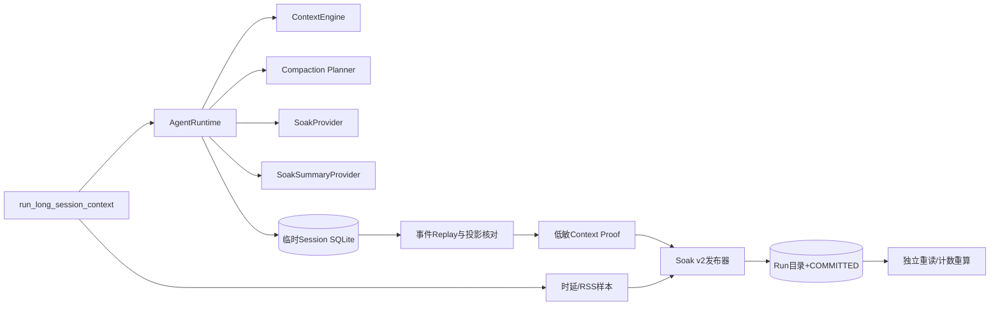
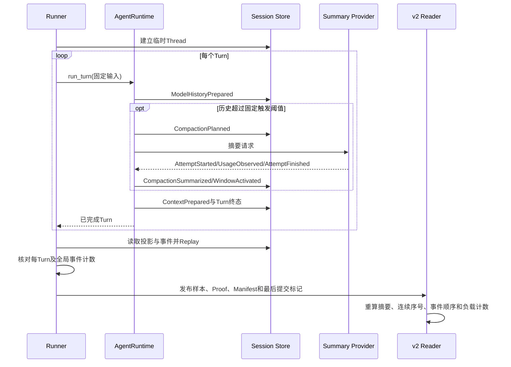

# 0.9.3d长会话Context与Compaction证据详细设计

## 1. 需求背景、设计目标与完成边界

[首轮macOS千Turn诊断](../validation/soak-macos-2026-09-23-v2/README.md)使用真实
`AgentRuntime`和Session，但未装配Context Planner或Compaction配置。其1000次完成和Replay一致只能证明
基本会话规模，不能证明Context检查、摘要尝试用量和活动窗口的长期行为。历史Run使用
`harnessix.soak-manifest/v1`规范字节及SHA-256提交标记；无版本地增加默认字段会导致历史原件重读失败。

本切片增加**独立的v2长会话入口与证据合同**。v1入口、历史Run和两种诊断原件保持原字节可读；v2调用
真实Context Engine、真实自动Compaction及持久Session。本文的实现完成不等于0.9.3d发布验收完成：
仍需Linux/Windows固定环境的1000 Turn正式运行、其余四场景、独立Threshold Profile及复验。
当前[macOS一次v2千Turn规模基线](../validation/soak-macos-2026-09-23-v3/README.md)已在干净Revision完成，
实现对应六实例CI通过；这里的“三平台”尚欠Linux和Windows，且第二次同平台阈值复验尚未执行。

### 1.1 目标

1. 一个正式Turn至少保存一次`ContextPrepared`和`ModelHistoryPrepared`；正式阶段至少完成一次
   `CompactionPlanned → Summary Attempt/Usage/Finish → CompactionSummarized → WindowActivated`；
2. 从完整持久事件和投影检查Replay、序号、压缩记录和活动窗口链，才允许发布Run；
3. 仅发布Turn序号、事件序号/类型、计数、性能数值和哈希，不发布Prompt、摘要、文件路径或业务UUID；
4. v1和v2原件由同一提交标记和独立Reader识别，未知版本、缺文件、篡改及计数不一致失败关闭；
5. 执行失败、取消或超时只保留低敏Attempt失败事实，不把部分Run判为PASS。

### 1.2 非目标

- 不新增产品API、远程Soak服务、模型计费请求或第二套Agent Runtime；
- v2证明不替代完整私有Session事件备份，也不从脱敏事件标记重建业务正文；
- `baseline`只表示负载规模、Revision和RSS单位校验，不是性能阈值PASS。

## 2. 总体架构、入口与信任边界



[`run_long_session`](../../scripts/soak_long_session.py)保留v1规模诊断入口；
[`run_long_session_context`](../../scripts/soak_long_session.py)选择固定Context窗口、压缩触发和摘要Provider。
两者共享同一临时Session、Turn采样、Attempt和提交路径；模式差异不改变Agent领域状态机。摘要
Provider只保存请求计数，首事件持久请求意图，然后提交完整用量及完成事实。它不保留`ModelRequest`
或原始历史；普通Provider仍只返回固定响应且不保存请求正文。



Context窗口固定为32768 UTF-8字节估计Token，预留输出1024；自动压缩触发为3000，目标2500，
摘要预留1024、最近闭合组保留1组、最小缩减256。它们是场景版本的一部分，不根据运行结果回填。
普通和摘要Provider的网络请求数分别记录，不能将摘要调用混算为普通Turn请求。

## 3. 领域契约、数据结构与接口设计

| 合同/字段 | 来源 | 校验与语义 | 持久位置 |
|---|---|---|---|
| `SoakManifestV2.spec_version/scenario_version` | Runner固定 | 分别为`harnessix.soak-manifest/v2`和`harnessix.soak-scenario/v2`；仅`long_session` | `manifest.json` |
| `provider.request_count` | 普通Provider | 等于Proof各Turn的`model_steps`之和 | Manifest |
| `summary_request_count` | 摘要Provider | 等于Proof成功摘要尝试之和，至少1 | Manifest |
| `evidence_sha256` | 发布器 | 精确包含`samples.jsonl`和`context-proof.json`；其他文件拒绝 | Manifest |
| `SoakContextTurn.ordinal/phase` | 持久Turn顺序 | 从1连续，预热段与Manifest负载数量严格一致 | Proof |
| `context_inspections/history_inspections` | Turn投影 | 每次模型步骤各一条；禁止以普通请求数冒充 | Proof |
| `compaction_plans/summary_attempts/completed_summaries/window_activations` | Turn投影+窗口链 | 成功Run中四者逐Turn相等；正式阶段至少一次 | Proof |
| `SoakEventMarker.sequence/kind/turn_ordinal` | 完整事件流 | 序号从1连续；只允许低敏事件类型字符串和Turn序号，不含事件载荷 | Proof |
| `final_window_count/final_event_sequence` | Thread投影 | 与事件标记、完成摘要和窗口发布数一致 | Proof |

[`SoakContextProof`](../../scripts/soak_context_proof.py)是额外文件，限制为4 MiB、至多11000 Turn和
100000事件标记。Reader按Turn复算Context/History次数及严格压缩事件顺序；不信任Manifest自报值。
[`SoakManifest`](../../scripts/soak_manifest.py)的v1定义、字段顺序与规范序列化不变。
[`read_published_run`](../../scripts/soak_evidence.py)先核对最后提交标记，再按版本选择v1或v2模型及
精确文件集合，最后重读样本与Proof。v2证明文件摘要由Manifest绑定，Manifest摘要由`COMMITTED.json`
绑定；文件缺失或提交窗口中断均不可读取为有效Run。

## 4. 核心流程、持久化事务与失败恢复

```text
validate_load_and_clean_revision_if_formal()
write_attempt_started_before_work()
run_real_turns_with_per_turn_timeout()
persisted = store.get_thread()
events = store.events()
require replay(events) == persisted
require provider_count == turn_count + warmup_count
derive_redacted_turn_counts_and_full_event_markers()
require exact_event_counts_and_window_chain()
publish samples -> proof -> manifest -> COMMITTED
independent_read_and_compare()
write_attempt_committed()
```

| 失败点 | 处理 | 恢复边界 |
|---|---|---|
| 参数、Revision或工作树不符 | 负载前拒绝，不建立Attempt | 修正输入后新Run；不可伪造正式来源 |
| Turn取消/超时/失败 | Attempt记`failed`及阶段；不发布Run | 临时Session清理；不把失败样本加入基线 |
| 摘要Provider缺首事件或完整用量 | Agent自身失败关闭；Attempt记失败 | 不补发摘要请求，不把未知结果记为成功 |
| Replay、Context、窗口或事件计数不一致 | `soak_context_coverage_invalid`，不提交Run | 保留失败Attempt，诊断私有临时状态由场景退出清理 |
| 样本、Proof或Manifest写入中断 | 缺少最后提交标记，Reader拒绝 | 新Run ID重新执行；不覆盖旧目录 |
| 已提交Run、Attempt终态前硬退出 | Run可读但Attempt未终结 | 发布验收必须联合读取Run与Attempt，不能判PASS |
| 历史v1 Run | 精确v1文件集合和规范字节继续接受 | 不补写v2证明，不回填旧诊断结论 |

## 5. 安全、可观测性、源码映射与测试门禁

证明文件只含白名单数值和事件`type`；模型请求、Context指令、摘要正文、Tool参数、路径和
Thread/Turn/Compaction UUID仅存在临时Session，不进入发布目录。文件排他创建、0600、fsync和摘要链复用
现有证据发布器。`SoakSummaryProvider`与普通夹具一样不保留请求对象，不让测试夹具污染RSS基线。

源码与测试映射：

| 源码 | 关键职责 | 测试 |
|---|---|---|
| [`soak_long_session.py`](../../scripts/soak_long_session.py) | v1/v2入口、固定配置、Replay与事件派生 | [`test_soak_long_session.py`](../../tests/benchmarks/test_soak_long_session.py) |
| [`soak_provider.py`](../../scripts/soak_provider.py) | 普通/摘要无请求历史Provider | [`test_soak_provider.py`](../../tests/benchmarks/test_soak_provider.py) |
| [`soak_context_proof.py`](../../scripts/soak_context_proof.py) | Turn与事件证明合同 | [`test_soak_context_proof.py`](../../tests/benchmarks/test_soak_context_proof.py) |
| [`soak_manifest.py`](../../scripts/soak_manifest.py)、[`soak_evidence.py`](../../scripts/soak_evidence.py) | v2 Manifest、精确文件集合、双版本Reader | [`test_soak_manifest.py`](../../tests/benchmarks/test_soak_manifest.py)、[`test_soak_context_proof.py`](../../tests/benchmarks/test_soak_context_proof.py) |

缩小负载测试必须覆盖成功、缺Compaction、缺摘要用量、事件/文件篡改、旧v1读取和低敏扫描；
正式发布还须Linux/Windows固定环境正式运行、独立Threshold Profile和
另外四个Soak场景。当前局部实现不得作为发布PASS。

## 6. 风险与取舍

| 风险 | 取舍与处置 |
|---|---|
| 低敏事件标记无法单独还原完整业务Session | Runner在临时Session删除前执行完整Replay与投影核对；公开Reader只验证标记序号、类型顺序和计数，不宣称可从Proof重放业务正文。 |
| 逐Turn事件标记增加证据体积 | 4 MiB硬上限与100000条事件上限；超限失败而非截断，必须另立场景版本。 |
| 固定摘要夹具可能比真实模型快 | 此场景只测本地Agent/Context/Store；模型网络时延属于独立真实Provider Eval，不混入本地性能阈值。 |
| v1与v2并存增加Reader分支 | 版本和精确文件集合只在证据边界分派，Agent主链无条件分支；历史Run不迁移、不覆盖。 |

可观测性以Attempt阶段、Manifest负载、每Turn单调时钟样本、RSS/DB/WAL水位及Context Proof事件计数为准；
异常正文、UUID和路径不进入公开日志或发布证据。`SoakContextProof`的事件标记证明脱敏后的结构一致性，
不构成源码签名、远程可信执行证明或模型质量分数。

## 7. 兼容、部署与回退

此实现只增加开发/发布脚本及证据版本，不修改产品命令、Agent Protocol、Session数据库Schema或
用户Workspace。旧v1 Run继续走原Reader分支；新v2 Run不允许降级解释为v1。回退旧代码时，
v2原件原样保存但旧Reader会因未知文件集合拒绝读取，不能删除Proof后伪装为v1。
发布环境需要Python 3.12+、可写的独立私有证据目录与足量临时磁盘；macOS、Linux、Windows分别
完成固定环境验收前，不对任一平台宣称性能阈值通过。
