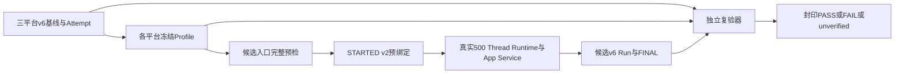
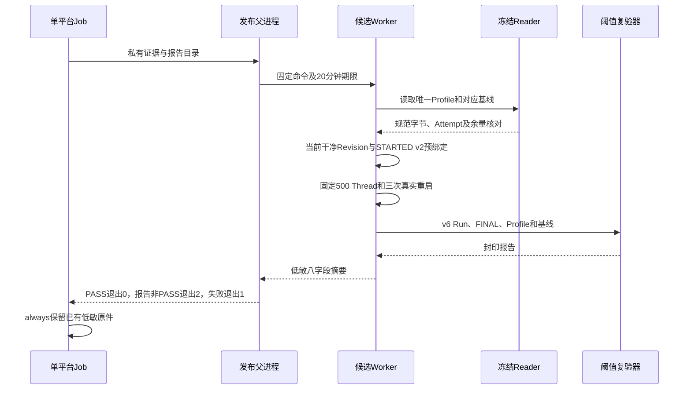

# 0.9.3d多Thread冻结Profile与第二独立Run详细设计

## 1. 需求背景、源码研究与设计目标

[三平台v6基线](../validation/soak-many-threads-three-platform-2026-09-23-v2/README.md)在相同固定场景下保存了逐轮500 Thread匿名集合、40个分页响应、45条样本以及Run/Attempt双层提交。每个平台只有一次基线，`baseline`不能等同性能PASS。候选必须在执行前绑定经评审核准的Profile，使用新Run ID，最后由独立Reader按固定阈值产生PASS、FAIL或unverified。不得用候选值调整工程余量。

| 源码 | 已求证事实与设计影响 |
|---|---|
| [`SoakManifestV6`](../../scripts/soak_manifest.py)、[`SoakThreadProof`](../../scripts/soak_thread_proof.py) | Reader验证每轮标签/页、样本索引、固定每页50条与零模型请求；历史v1虽可读但禁止冻结。 |
| [`publish_profile`、`verify_profile_baseline`、`verify_and_publish`](../../scripts/soak_threshold.py) | 完整基线Run/Attempt、工程余量、Profile封印、候选预绑定和报告重读沿用共用合同；候选前再次检查冻结Profile数学来源。 |
| [`run_many_threads`](../../scripts/soak_many_threads.py) | 正式负载进入Attempt前检查当前干净Revision；`threshold_profile_ref`先进入STARTED v2再进入候选Manifest。 |
| [`guarded_worker`](../../scripts/soak_worker_guard.py) | Runner内部SQLite超时自然排空可能无界，发布父进程以20分钟子进程硬期限保证CI上传窗口。 |
| [`.gitattributes`](../../.gitattributes) | 原始Run/Attempt及Profile规范字节SHA不能受Windows Checkout自动换行转换。 |

目标是封印**三份互不借用**的平台Profile，在基线通过来源CI与原件重算后执行各平台第二个独立500 Thread Run，并保存三份不可覆盖报告。非目标是多租户容量SLA、生产Agent任意SQLite I/O强制取消、Action效果安全、模型推理速度或三平台数值直接横向比较。

## 2. 总体架构、数据流程与持久化





仓库归档只读基线和Profile；候选Job在Runner临时目录生成新的Run、Attempt和Report。临时Session SQLite与Workspace不进入上传件。各平台的Profile ID、基线Run ID、硬件档位、Python版本范围与绝对阈值独立，不能复用另一平台的配置。候选Run的标签使用自身新Run ID加盐，不与基线标签逐字节比较；对比的是相同合同、样本数、负载及各自独立完整集合Proof。

## 3. 阈值决策、领域契约、数据结构与接口设计

工程阈值在第二Run**之前**从三平台各自的v6基线确定：

| 指标 | 余量 | 含义与取舍 |
|---|---:|---|
| `app_service_startup` P50/P95/P99 | 10000 bp（+100%） | 三次正式重启样本少，作为宽松回归护栏而非启动SLO。 |
| `thread_list_page` P50/P95/P99 | 10000 bp（+100%） | 每平台30个页样本，容忍托管机调度抖动，但不允许翻倍以上持续回退。 |
| `rss_peak` P50/P95/P99 | 5000 bp（+50%） | 当前证据只测Runner进程高水位；不代表产品多进程总内存。 |
| DB/WAL/Artifact正增长 | 5000 bp（+50%） | 采用文件首尾端点正增长；基线为0时上限保持0，不转化为任意非零预算。 |
| 故障分类 | 精确全0 | 超时、取消、EOF、UNKNOWN、重复效果或孤儿不得PASS。 |

所有上限均由[`_margin_upper`](../../scripts/soak_threshold.py)的`ceil(基线值 × (10000 + margin_bp) / 10000)`精确计算。Profile固定`many_threads`、场景v6、`app_service`边界、500 Thread、50条每页、一次预热、三次正式重启、11条预热样本、正式样本3/30/1、确定性Provider版本及零模型请求。Python允许同主版本`3.12.0`～`3.12.99`，硬件档位等于各自基线。若托管机档位变化，产生unverified而非自动放宽。

| 接口 | 输入/输出 | 前置条件与失败码 |
|---|---|---|
| [`verify_profile_baseline`](../../scripts/soak_threshold.py) | Profile及只读基线目录→完整Manifest/SHA | Run、Attempt或数学阈值错误，在负载前返回`soak_profile_baseline_invalid`或证据错误。 |
| [`_only_profile`](../../scripts/run_many_threads_soak_candidate.py) | 平台→唯一Profile目录 | 缺失、多个、符号链接或目录名无效，`soak_profile_invalid`。 |
| [`run_candidate`](../../scripts/run_many_threads_soak_candidate.py) | 私有Run/Report根→八字段摘要 | 固定500/50/3和120秒单操作期限；读回STARTED v2、v6 Run、FINAL及Report。 |
| [`guarded_worker`](../../scripts/soak_worker_guard.py) | 固定模块、参数、目录、20分钟期限→stdout或稳定错误码 | 硬超时杀完整Worker并保留已存在STARTED；不回显stderr正文。 |
| [`verify_and_publish`](../../scripts/soak_threshold.py) | Profile、基线、候选、报告根→封印Report | 全指标与水位都合格才PASS；完整可比越限为FAIL，证据缺口为unverified。 |

低敏CLI字段仅为`scenario_id/platform/code_revision/profile_id/baseline_run_id/candidate_run_id/status/reason`。父进程严格核对字段集合、类型、十六进制身份、状态与原因对应关系；非白名单输出均转为稳定错误码。Profile、Run和Report的SHA是完整性封印，不是签名；来源需由仓库权限、源码Revision、手动工作流与下载件记录共同审查。

## 4. 核心业务伪代码、失败恢复、错误分类与可观测性

```text
platform = read_environment().platform
profile = read_exactly_one_sealed_profile(platform)
baseline = verify_profile_baseline(profile, archive.raw[platform])
require baseline is v6 and fixed 500/50/3; require source CI accepted
revision = current_git_HEAD
ref = (profile.id, profile.canonical_sha256)
candidate = run_many_threads(fixed_load, threshold_profile_ref=ref)
require STARTED v2.ref == candidate.manifest.ref == ref
require FINAL.committed and FINAL.manifest_sha256 == independently_read_run_sha
report = verify_and_publish(profile, baseline, candidate)
require read_report(report.directory) == report
return success_only_when(report.status == PASS)
```

任何Profile缺失/歧义、旧v1基线、数学阈值漂移或来源摘要错在创建Candidate Attempt前失败；运行中空页、Thread集合漂移、单项超时或SQLite异常保留失败Attempt，禁止自动业务重试。父进程20分钟硬期限超限时杀Worker，已有STARTED可上传诊断，不能伪造FINAL或PASS。阈值越限发布FAIL报告并退出2；无效证据发布unverified并退出2；前置或执行失败退出1。新Run必须有不同Run ID，失败不得覆盖既有Profile、基线、候选或报告。受控错误仅记录Code、Run/平台和报告中的指标名，不记录Thread标签、路径、Secret、Prompt或子进程异常正文。

## 5. 测试、安全、部署兼容、回退与风险

[`test_run_many_threads_soak_candidate.py`](../../tests/benchmarks/test_run_many_threads_soak_candidate.py)以合成v6基线验证真实Profile封印和阈值报告，覆盖唯一Profile、旧v1拒绝、固定负载参数、STARTED v2绑定、父进程超时与成功/非PASS退出码；基线的真实三平台Reader和逐页Proof已由[归档原件](../validation/soak-many-threads-three-platform-2026-09-23-v2/README.md)复核。发布工作流是手动三平台Job，使用同源码Revision独立执行，不依赖远程数据库或真实模型，不新增Action HTTP/Worker体系。回退只停用手动工作流；保留历史封印Profile/Run/Report为只读证据。

限制包括托管机基线样本有限、20分钟进程硬停止不等于Agent业务取消语义、两次Run不能证明高并发C端SLA、匿名Proof无法重新读取已删除临时SQLite。Profile冻结之前必须检查基线Revision常规CI和18份原件；候选完成后还必须下载并独立核对三个平台的原始文件、报告、样本及同Revision常规CI。只有三份报告均为PASS，才能关闭**固定多Thread场景**的工程阈值门禁；这不关闭0.9.3d整体。

## 6. 当前证据状态

[三平台v6基线归档](../validation/soak-many-threads-three-platform-2026-09-23-v2/README.md)已包含三个从各自基线形成的封印Profile，规范字节SHA、数学余量、文件摘要及来源CI均已复核。[候选工作流35879251986](https://github.com/carrie1988/Harnessix/actions/runs/35879251986)三平台均生成`PASS/within_limits`原始报告；ZIP、Run、Attempt、Profile、逐页证明、样本分位数及独立重算报告均已核对。但是同Revision的常规CI在Linux Python 3.13和Windows失败，故该候选**不作为场景关闭证据**；冻结Profile保持原样，修复后须在新Revision重新执行第二独立候选。

失败定位到[`test_candidate_reuses_sealed_baseline_and_publishes_independent_pass`](../../tests/benchmarks/test_run_many_threads_soak_candidate.py)：测试辅助函数[`_run`](../../tests/benchmarks/test_soak_threshold.py)按实际宿主平台写入合成基线，原测试却把候选入口的平台强制设为`macos`。非macOS环境因此在负载前命中`soak_profile_baseline_invalid`，并非候选运行期性能越限。现行测试改为使用实际平台作为Profile与候选入口的共同身份，保留生产预检的严格平台匹配；新Revision仍需完整矩阵CI和真实三平台候选复验。[旧Revision的24份候选原件](../validation/soak-many-threads-three-platform-candidate-2026-09-23-v1/README.md)已归档为诊断，不可把测试修复追认成旧Revision的CI成功。

Revision `807e688988245fcbb269f0c04013ed9a9ca6ea9d`重新执行了同一封印Profile的[三平台候选](../validation/soak-many-threads-three-platform-candidate-2026-09-23-v2/README.md)：Linux/Windows报告PASS，macOS报告`FAIL/limit_exceeded`。越限项为启动P95/P99和分页P99；完整原始Run/Attempt/Report、逐轮页样本及独立复验均确认该结论。四轮中的第二轮正式重启与首个分页出现最大时延，但当前原件未记录足以排他归因的主机CPU/I/O数据；不将环境抖动或产品回归任一假说冒充根因。本轮FAIL保留为正式诊断，不能改写冻结阈值或只挑通过轮次。下一步需补充分段计时及宿主资源证据，再据根因决定修复、环境失配判定或采样/阈值设计重审。
