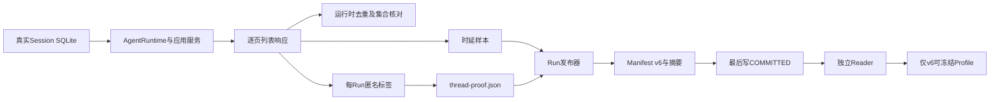
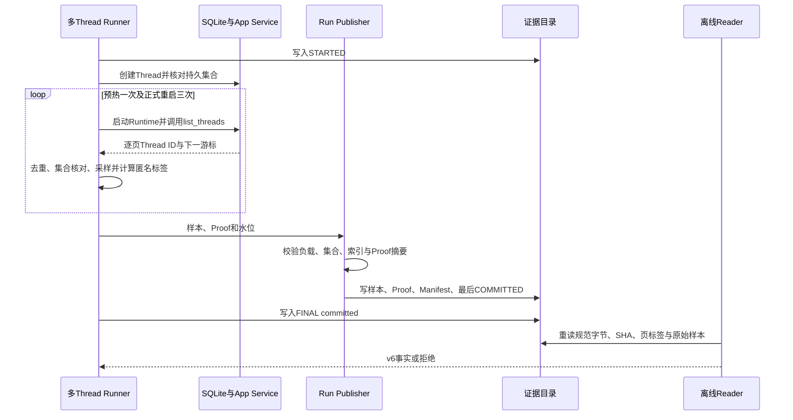

# 0.9.3d多Thread逐轮分页证明v6详细设计

## 1. 需求背景、设计目标与非目标

旧版[`run_many_threads`](../../scripts/soak_many_threads.py)在执行时确实逐页检查了重复、空页及最终Thread身份集合，但归档的v1 Run仅保存时延样本、Manifest和提交标记。离线[`read_published_run`](../../scripts/soak_evidence.py)可重算样本数与分位数，却不能检查每一轮是否覆盖同一Thread集合。因此历史[三平台一次500 Thread负载](../validation/soak-many-threads-three-platform-2026-09-23-v1/README.md)只能作为真实负载基线，不得冻结阈值或宣称场景PASS。

目标是在**不改变Agent协议、Session数据库和业务行为**的前提下，为多Thread场景增加可归档、可离线重算、低敏且有界的逐页证明：每次Runtime/App Service启动、分页样本、页内匿名Thread标签、游标终止和跨轮集合一致性均有严格关联；旧v1保持只读，阈值发布从此仅接受v6。非目标是证明发布程序从未被恶意替换，或把哈希标签当作数据库内容的密码学远程证明。来源可信性仍依赖干净源码Revision、工作流、Run/Attempt和评审包。

## 2. 源码研究与架构决策

| 源码位置 | 已求证事实 | 决策 |
|---|---|---|
| [`_list_all`](../../scripts/soak_many_threads.py) | 实际调用`AgentApplicationService.list_threads`，逐页去重并比较完整Thread ID集合。 | 在同一响应处生成匿名标签和页样本索引，不重写分页算法。 |
| [`publish_measured_run`](../../scripts/soak_run_common.py) | 根据样本构造Manifest、调用发布器，随后重读磁盘原件。 | 增加独占场景Proof参数和v6 Manifest；不覆盖旧版字节。 |
| [`publish_run/read_published_run`](../../scripts/soak_evidence.py) | 先写样本/Proof/Manifest，最后写`COMMITTED.json`；Reader拒绝未知文件集和非规范字节。 | v6精确四文件集；两侧均核对Proof摘要及原始样本，保留v1～v5分支。 |
| [`publish_profile`](../../scripts/soak_threshold.py) | Profile要从完整Run/Attempt独立重读后才能冻结。 | `many_threads`只准v6，不再把历史v1作为冻结输入。 |

**取舍**：只保存每Run域内的SHA-256标签，不保存明文Thread ID、Workspace路径、游标Token或SQLite文件。每轮各页保存标签而非单一集合摘要，使Reader可以验证唯一性、页数和跨轮集合；证据文件以8 MiB上限约束。标签由`SHA256(run_id原始16字节 || Thread ID的UTF-8字节)`导出；随机Run ID使不同Run无法用同一摘要直接关联。Thread ID是运行时随机身份，标签并不代替严格的文件权限、仓库隐私审核或源码审查。Reader只能证明**归档Proof内部一致且与样本相符**，不能在业务临时State被删除后重新读取数据库。因此发布入口仍应在执行期比较真实Store身份，并绑定源码Revision。

## 3. 总体架构、数据流程与持久化



数据分类：真实Thread ID只存在于Runner进程内存，采集结束后随临时业务State删除；页证明只记录64位十六进制哈希标签、页样本索引及是否还有下一页。`samples.jsonl`仍只记录单调时钟时延和RSS；Manifest记录Proof文件SHA-256并与`COMMITTED.json`绑定；Attempt另行记录执行开始及终态。三平台Job各自生成不同Run ID、State和证据，不跨平台共享集合或阈值。



## 4. 领域契约、接口设计和字段

| 类型/接口 | 关键字段与约束 | 失败语义 |
|---|---|---|
| [`SoakThreadPage`](../../scripts/soak_thread_proof.py) | `sample_index>0`；`thread_tags`为1～200个64位小写十六进制串；`has_next`为严格布尔。 | 空页、标签格式或页终止位置错误，拒绝Proof。 |
| [`SoakThreadCycle`](../../scripts/soak_thread_proof.py) | 顺序`ordinal`、`phase`、`startup_sample_index`及1～5000页；第1轮仅预热，其后为正式测量。 | 周期跳号或阶段混乱，拒绝Proof。 |
| [`SoakThreadProof`](../../scripts/soak_thread_proof.py) | 固定v1 Proof版本、Run ID、1～5000 Thread、1～200页容量、生成集合摘要及2～11周期；每页不超过容量、每轮标签数恰好等于Thread数且无重复、每轮集合摘要相同。 | 集合缺失、重复或跨轮漂移均拒绝。 |
| [`SoakManifestV6`](../../scripts/soak_manifest.py) | 固定`many_threads/app_service`、场景版本v6、`thread_proof_sha256`与文件索引一致；Provider请求数0、正式RSS恰好1、无故障；基线及Profile绑定候选固定每页50条。 | Manifest字段或场景不一致，拒绝发布或读取。 |
| [`verify_thread_proof`](../../scripts/soak_thread_proof.py) | 顺序核对全部启动/分页样本索引、阶段、正式启动与页数、预热样本数及Run身份。 | 证明与原始样本不匹配，拒绝。 |
| [`publish_run/read_published_run`](../../scripts/soak_evidence.py) | v6文件集固定`samples.jsonl`、`thread-proof.json`、`manifest.json`、`COMMITTED.json`；Proof最多8 MiB。 | 文件缺失、额外文件、非规范字节、摘要不符或重算失败，稳定错误码拒绝。 |

其中`thread_set_sha256`由全体标签排序后以换行分隔并以末尾换行结束的ASCII字节计算。每页的`thread_tags`保留响应顺序，Reader将所有页标签合并后检查数量、唯一性和摘要；`has_next`在每轮最后一页必须为`false`，之前必须为`true`。Proof中不存游标正文，只以是否继续表明分页结构；游标自身的有效性仍在运行期通过真实列表调用验证。

## 5. 核心逻辑伪代码

```text
created_ids = create_threads_and_read_back_from_sqlite()
expected_digest = SHA256(sort(tag(run_id, id) for id in created_ids))
for cycle in [warmup, measure_1, measure_2, measure_3]:
    startup = open_real_runtime_and_service(); append_startup_sample()
    seen = set()
    for page in list_all_with_cursor():
        reject empty, oversized or repeated raw Thread ID
        append_page_latency_sample()
        append_page_proof(sample_index, tag(each raw ID), next_cursor exists)
        seen.update(raw IDs)
    require seen == created_ids
    append_cycle(startup_index, page_proofs)
proof = validate(run_id, expected_digest, cycles)
publish samples + proof + manifest + final commit marker
reader = reopen all bytes; validate schema, canonical bytes, SHA and cross-check samples
```

## 6. 失败、取消、超时、恢复、可观测性与错误分类

Runner对空页、重复、缺失Thread或不收敛游标仍产生稳定`soak_list_invalid`；启动/单页超时分别为`soak_startup_timeout`与`soak_list_timeout`，先自然排空已启动的SQLite任务。外层正式入口另有20分钟子进程硬期限，超限为`soak_worker_timeout`，保留已写`STARTED`而不伪造已提交Run。Proof构造/验证失败不会写最终提交标记；Reader对发布中断、篡改、非规范字节或Proof不一致统一返回`soak_run_invalid`。失败Attempt、部分Run目录及本地工作流Artifact只供诊断，不得冻结Profile。硬期限属于发布工程，不声称产品Agent SQLite取消已具备同等语义。

对已经归档的v1原件**不回填**匿名标签：历史Reader仍读取其原字节，`publish_profile`对多Thread v1失败关闭。新证据只能在干净源码Revision重新运行，任何平台失败均重新形成独立Run/Attempt。发往GitHub的上传件仅含低敏证据，不含临时Session、原始Thread ID、工作区路径和API Key；无需模型请求、远程数据库或新增中间件。

## 7. 风险与取舍、安全边界、部署兼容及回退

进程监护和v6 Proof都是发布工程能力，不会修改用户侧部署、Agent协议、Session数据库或外部中间件；三平台仍使用已有手动工作流。风险是临时State删除后无法独立证明匿名标签确由SQLite返回，需依赖真实Runner、干净Revision、业务执行期原始集合核对和Job来源共同审查。历史v1保持可读但拒绝阈值冻结；若v6在某平台运行失败，应保留该平台Attempt和已存在原件，在修复后的新Revision重新采集，不对旧证据补字段。

## 8. 验证矩阵与发布门禁

| 场景 | 测试/证据 | 当前结论 |
|---|---|---|
| 真实Runtime缩小负载、v6四文件集及独立重读 | [`test_soak_many_threads.py`](../../tests/benchmarks/test_soak_many_threads.py) | 本地回归通过；状态仅`unverified`。 |
| 页重复、缺页、错误终止、集合漂移及重封印索引篡改 | [`test_soak_many_threads.py`](../../tests/benchmarks/test_soak_many_threads.py) | Proof模型与Reader均失败关闭。 |
| 旧v1可读但不可冻结；v6可冻结并复验 | [`test_soak_threshold.py`](../../tests/benchmarks/test_soak_threshold.py) | 本地合同回归通过；合成阈值不等于真实平台PASS。 |
| 固定500 Thread三平台正式新Revision Run | [正式采集工作流](../../.github/workflows/many-threads-soak.yml) | [三平台v6原件](../validation/soak-many-threads-three-platform-2026-09-23-v2/README.md)已归档并独立重读；同Revision常规CI待终态，历史v1不能复用。 |
| 各平台冻结Profile并在负载前绑定第二独立候选 | [`soak_threshold.py`](../../scripts/soak_threshold.py) | [冻结Profile与候选详设](m09-3d-many-threads-frozen-profile-candidate.md)及入口已实现，本地合同回归通过；[三平台Profile](../validation/soak-many-threads-three-platform-2026-09-23-v2/README.md#5-三平台预冻结profile与工程阈值)已封印并独立重读，第二Run待执行，单次基线不判PASS。 |

发布顺序固定为：完整本地回归与文档门禁 → 干净Revision三平台CI和正式v6基线 → 下载归档并独立重算文件SHA/Proof/样本/Attempt → 审查工程余量并分别封印三平台Profile → 新Revision或同一实现的独立Run在负载前绑定Profile → 三份独立报告及完整评审。0.9.3d还包含Action恢复、长会话和Artifact等场景，不能由多Thread单项完成代表整个阶段完成。
