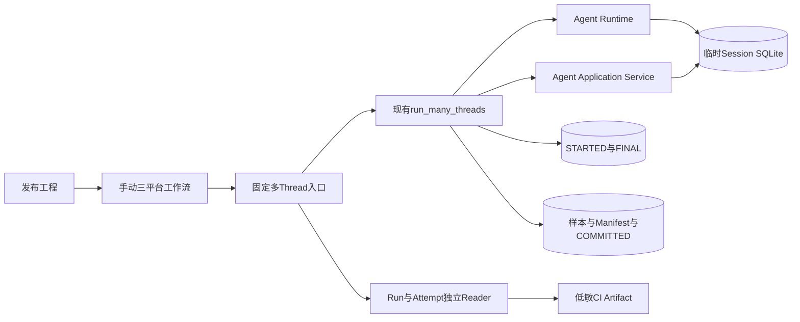
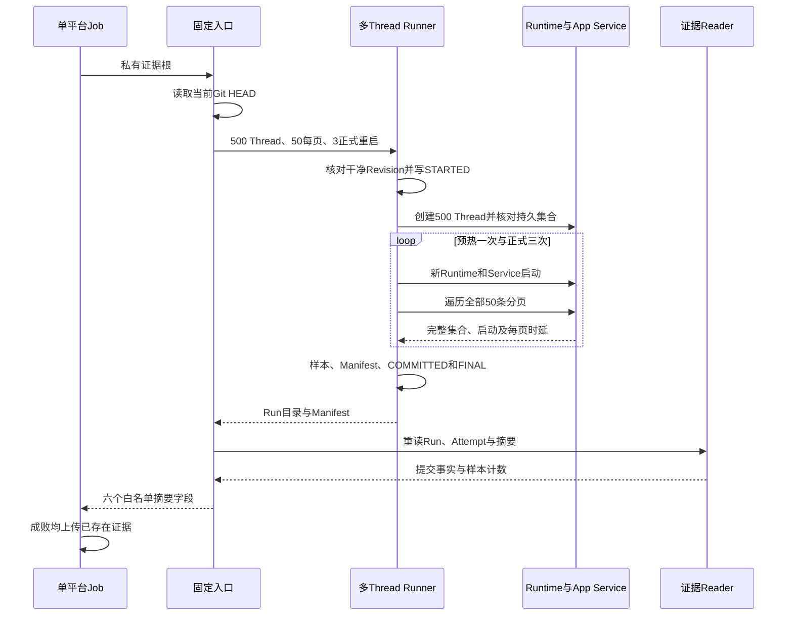
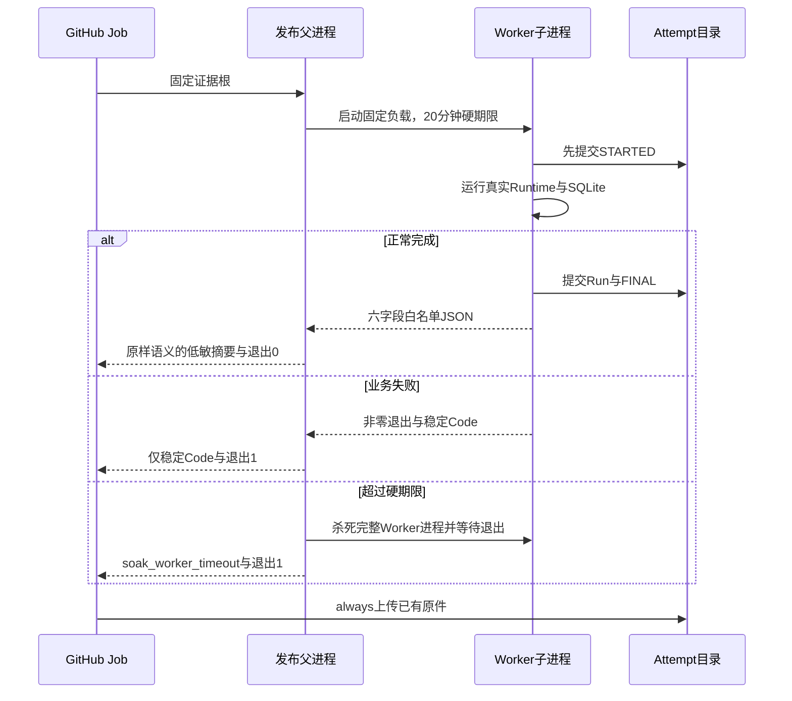

# 0.9.3d多Thread三平台正式基线采集详细设计

## 1. 需求背景、设计目标和当前状态

现有[`run_many_threads`](../../scripts/soak_many_threads.py)使用真实Agent Runtime、Session SQLite和`AgentApplicationService.list_threads`，已经能创建持久Thread、重启、遍历全部游标并发布Run/Attempt。历史[macOS 500 Thread诊断](../validation/soak-macos-2026-09-23-v4/README.md)的Windows Product UI首次超时未定位，不能充当可冻结三平台基线；此前固定三平台的[完整产品重启场景](../validation/soak-restart-three-platform-2026-09-23-v1/README.md)测量的是**`product_startup`**，不能拿其数值替代`app_service_startup`或`thread_list_page`。

本切片只补**不可降配的发布工程入口与三平台独立采集通道**。每个平台在干净源码Revision上运行500 Thread、一次预热和三次正式Runtime/App Service重启；每次全页核对身份集合，最终重读Run与Attempt，失败也保存已持久化的Attempt。[三平台各一次正式负载原件](../validation/soak-many-threads-three-platform-2026-09-23-v1/README.md)已取得；但尚未冻结Profile或执行第二独立候选，历史v1证据缺逐轮匿名集合Proof；现行[证明v6设计与实现](m09-3d-many-threads-proof-v6.md)已增加离线Reader及阈值门禁，发布入口也已增加20分钟进程级硬停止线，两者均尚需三平台新Run，不能标记0.9.3d完成。产品协议、Session Schema、Action边界和用户CLI均不改动，不增加HTTP/Worker独立服务，也不调用真实模型。

## 2. 源码研究与架构决策

| 当前源码 | 已求证事实 | 设计决定 |
|---|---|---|
| [`run_many_threads`](../../scripts/soak_many_threads.py) | 正式负载在写Attempt前执行`check_release_revision`；Thread身份来自实际`create_thread`与持久Store；启动和分页分别计时。 | 发布入口只固定入参，不复制Runtime或分页逻辑。 |
| [`_restart_and_list`、`_list_all`](../../scripts/soak_many_threads.py) | 每轮重新进入真实`AgentRuntime`并构造`AgentApplicationService`；游标去重、页数上界、完整集合核对；预热样本不计入正式分位数。 | 固定每页50、三次正式轮，正式样本应为3次启动、30页和1个RSS。 |
| [`SoakManifest`](../../scripts/soak_manifest.py)、[`publish_measured_run`](../../scripts/soak_run_common.py) | `many_threads/app_service`正式基线至少500 Thread及3次启动；样本、Manifest和提交标记有独立Reader；`status=baseline`不是PASS。 | 历史Run保留v1原始字节；现行Runner发布含匿名分页Proof的v6，详见[专项设计](m09-3d-many-threads-proof-v6.md)。 |
| [`attempt_scope`](../../scripts/soak_attempt.py) | `STARTED`在负载前持久化，正常提交后`FINAL`绑定Manifest摘要；失败记录阶段。 | 入口重读两层提交事实；工作流失败仍上传已存在的Attempt。 |
| [`run_restart_soak_release`](../../scripts/run_restart_soak_release.py)、[三平台工作流](../../.github/workflows/restart-soak.yml) | 固定入口、只读权限、三平台`fail-fast: false`、低敏日志和14日上传均有先例。 | 保持同一发布运维模式，但不复用其产品重启指标。 |

## 3. 总体架构、职责与数据流程

[`run_many_threads_soak_release.run_release`](../../scripts/run_many_threads_soak_release.py)只持有固定负载参数和提交复核。Runner在临时目录创建Session与Workspace；`SoakProvider`不保存正文，也不会收到模型请求。正式样本是`app_service_startup`、`thread_list_page`和`rss_peak`；DB/WAL数字是临时SQLite文件**首尾端点**，非瞬时峰值。工作流每平台各自Checkout、依赖安装和临时证据根，不跨平台复用State或绝对阈值。上传件只包含Run/Attempt，不包含业务临时数据库、Thread身份集合或Workspace路径。

## 4. 时序、接口设计与领域契约

| 边界 | 输入/输出与字段 | 不变量与错误 |
|---|---|---|
| [`run_release(evidence_root)`](../../scripts/run_many_threads_soak_release.py) | 私有`Path`输入；输出`scenario_id/platform/code_revision/run_id/manifest_sha256/status` | 固定`thread_count=500`、`list_limit=50`、`restart_count=3`、启动与分页各120秒；不暴露降配开关；Run与Attempt身份、摘要、Revision一致。 |
| [`run_many_threads`](../../scripts/soak_many_threads.py) | `SoakLoad`记录500 Thread、11条预热样本；正式样本3/30/1 | 10页每轮全部覆盖且游标不重复；Provider请求数0；正式Run只能是`baseline`。 |
| [`many-threads-soak.yml`](../../.github/workflows/many-threads-soak.yml) | `workflow_dispatch`，Linux/macOS/Windows独立Job | 只读源码权限、Python 3.12及锁定依赖、30分钟Job上限、`fail-fast: false`、失败也上传。 |
| [`main`](../../scripts/run_many_threads_soak_release.py) | `--evidence-root`，退出码0/1 | 成功日志只输出六字段；`KernelError`只输出Code，意外异常统一`internal_error`，不得输出异常正文或路径。 |

`Run`与`Attempt`不是一个数据库事务。写入顺序为`STARTED → 真实负载 → samples/manifest → COMMITTED → FINAL`；缺任一提交标记、摘要不符或样本不完整都不得判成功。负载失败保留`FINAL/failed`；进程被硬杀可能只保留`STARTED`，后续Reader必须视为未完成而非通过。发布失败不得覆盖旧目录，必须新Run ID重跑。

## 5. 失败、取消、超时、风险与取舍

`_restart_and_list`对启动和每页分别设置120秒正式期限；超时记录稳定错误码，先等待已启动SQLite异步任务自然结束，再退出临时目录，避免Windows残留只读句柄造成假失败。**Runner内部排空仍无独立期限**；历史Revision仅依赖外层30分钟Job，不能保证后续上传步骤。现行发布入口以20分钟进程硬停止线包住Runner，本地模拟超时已验证稳定错误码，超限时只留下未终结`STARTED`而不伪造`FINAL/failed`；新Revision三平台正式运行仍待验收。该硬停止线只属于发布工程，不证明产品Agent可强制取消任意SQLite I/O。

页为空、游标重复、集合缺失、启动失败、RSS单位未验证、Git污染、Run/Attempt不一致均为非零退出；没有自动业务重试。外部上传回执不代替下载后的逐文件SHA、Reader和数值重算。相比允许SQLite任务悬空就删除临时文件，选择自然排空可避免Windows句柄假失败，但牺牲了异常路径的本机有界性；正式发布门禁在该问题关闭前保持未完成。

### 5.1 安全、权限与可观测性

工作流只读仓库，发布入口只写Job私有临时证据根；它不读取用户Workspace或模型凭据，不开放网络Action能力。日志不保存错误正文、Thread ID、工作区路径、Provider请求内容或SQLite数据。运行时可观察的公开事实仅为场景/平台/Revision/Run ID/Manifest SHA/`baseline`及失败Code；详细指标只在低敏原始样本中。原始证据上传前后均须按白名单检查，不能把临时业务SQLite打包进Artifact。

## 6. 测试、三平台验收与发布门禁

| 检查 | 验证入口 | 当前结论 |
|---|---|---|
| 固定参数、两层提交、样本数和低敏日志 | [`test_run_many_threads_soak_release.py`](../../tests/benchmarks/test_run_many_threads_soak_release.py) | 本地合同测试；不等于正式规模。 |
| 真实Runtime/App Service小负载、空页/超时/失败Attempt | [`test_soak_many_threads.py`](../../tests/benchmarks/test_soak_many_threads.py) | 缩小回归状态只能是`unverified`。 |
| Git干净正式500 Thread三平台负载 | [`many-threads-soak.yml`](../../.github/workflows/many-threads-soak.yml) | [三平台各一次原件](../validation/soak-many-threads-three-platform-2026-09-23-v1/README.md)已归档，Runner成功；同Revision[CI 35870214455](https://github.com/carrie1988/Harnessix/actions/runs/35870214455)六Job成功。 |
| 冻结Profile、负载前绑定第二独立Run、三份报告 | [`soak_threshold.py`](../../scripts/soak_threshold.py) | **未执行**；单次基线不能判PASS。 |
| 无界排空风险与硬停止线 | 本文第5、8节 | 发布父进程20分钟硬期限及本地失败回归已实现；新Revision三平台Job尚未执行，生产Agent底层I/O取消不在此承诺范围。 |

正式工作流的三平台Artifact已下载，以Run/Attempt Reader和标准库重算15份文件摘要、样本数及最近秩分位数，并保存[Manifest和Review Packet](../validation/soak-many-threads-three-platform-2026-09-23-v1/README.md)。对应Revision[CI 35870214455](https://github.com/carrie1988/Harnessix/actions/runs/35870214455)六Job已成功；使用现行v6 Proof并在三平台验收进程硬停止线后，以新Revision建立可冻结基线，再冻结各平台Profile并执行第二次独立候选。任一平台失败保留原始Attempt、定位根因并在新提交重跑；不把失败平台以其他平台或缩小负载代替。

## 7. 部署、兼容与回退

发布工程师在已推送且干净的Revision手动触发三平台工作流。入口和工作流只供发布工程使用，不改变产品部署、Agent Protocol、Session数据库或发行物；无需远程数据库、中间件、真实Provider或用户环境配置。停用采集通道只需停用手动工作流；已归档Run/Attempt继续由现有Reader只读校验，不原地改写。失败时修复后以新Revision和Run ID重跑，不覆盖历史诊断。

## 8. 异步SQLite排空的进程级硬停止线设计

### 8.1 需求与源码事实

[`_restart_and_list`与`_list_all`](../../scripts/soak_many_threads.py)在单项120秒计时超时后会`await asyncio.gather`等待已开始的SQLite任务自然收敛，以防Windows临时目录仍被异步句柄占用；此排空没有第二期限。若将`asyncio.wait_for`直接施加于同一Task，取消仍可能留下未完成的底层线程/句柄，不能仅改成更短的`gather`就安全地删除临时State。[`attempt_scope`](../../scripts/soak_attempt.py)会在业务负载前落盘STARTED；因此进程被安全终止后，未终结Attempt仍可作为低敏诊断事实。当前30分钟GitHub Job上限位于最外层，触发时不能保证后续`always()`上传步骤有执行机会。

### 8.2 架构决策与时序

发布入口采用**父进程监护、子进程运行既有Runner**：外部命令仍为`python -m scripts.run_many_threads_soak_release --evidence-root ...`，父进程以20分钟硬期限启动同模块的内部Worker；Worker调用现有`run_release`，继续保留单项120秒超时及自然排空。正常时父进程仅验证并转发六字段低敏摘要；Worker非零、非法摘要或20分钟超限时父进程返回稳定错误码，不输出子进程stderr正文、SQLite路径或Thread身份。超时杀的是**整个拥有SQLite任务的Worker进程**，由OS关闭其句柄；父进程仍有时间进入CI上传步骤，保留`STARTED`或已有失败Attempt。此切片不改变Agent Runtime、SQLite驱动或用户产品协议。

### 8.3 接口、失败语义和验收

内部Worker开关只供父进程启动，不作为用户CLI或产品协议；正式工作流不得调用内部模式绕过硬期限。父进程把子进程输出当作不可信字节：成功时要求唯一JSON对象、精确六字段、固定场景与`baseline`状态、合法平台和十六进制Revision/Run/Manifest摘要；不直接回显任意stdout。失败时只接受`KernelError.code`格式，否则统一`soak_worker_failed`。`TimeoutExpired`归类`soak_worker_timeout`，没有`COMMITTED + FINAL`的Attempt不能补写为成功。即使进程级超时可保证发布脚本返回，本次运行也只能降级为诊断；它不是生产Agent对任意I/O强制取消的证明。

[`test_run_many_threads_soak_release.py`](../../tests/benchmarks/test_run_many_threads_soak_release.py)已覆盖固定父子命令、成功摘要白名单、恶意/过长stdout拒绝、业务错误码脱敏、模拟硬超时，以及真实卡住的测试子进程在期限后被杀且开始事实仍可读取；Worker原有Run/Attempt Reader路径继续回归。本地真实父子调用还验证了污染工作树在Attempt前以稳定Code拒绝。手动三平台工作流须在修复后新干净Revision重跑，旧Run继续保留，不能在旧Manifest上补贴新取消能力。逐轮Thread集合Proof现已实现；新Revision三平台基线、冻结Profile及第二独立Run仍待执行。
