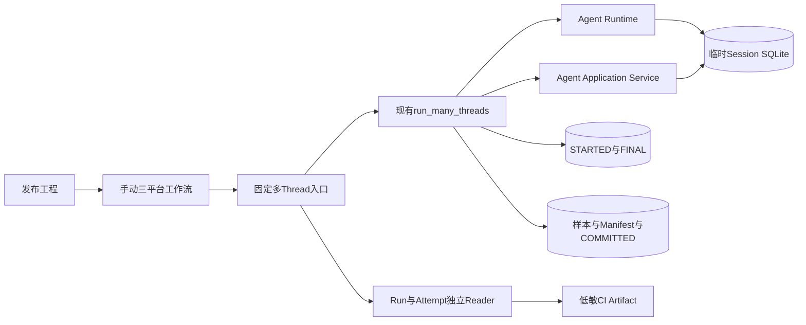
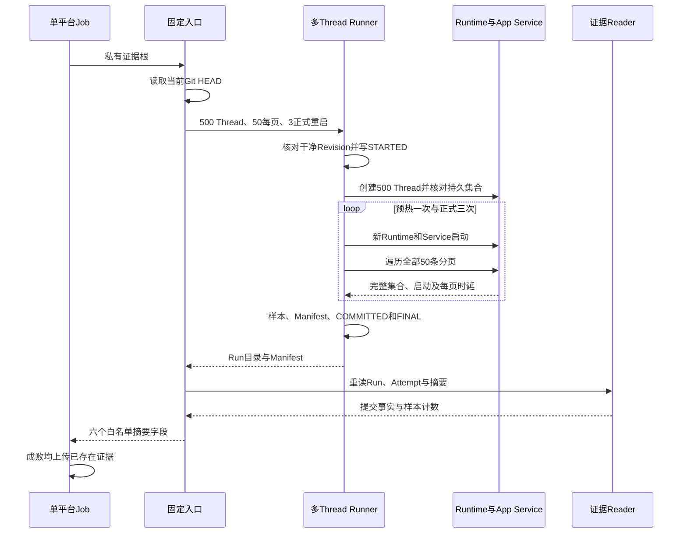

# 0.9.3d多Thread三平台正式基线采集详细设计

## 1. 需求背景、设计目标和当前状态

现有[`run_many_threads`](../../scripts/soak_many_threads.py)使用真实Agent Runtime、Session SQLite和`AgentApplicationService.list_threads`，已经能创建持久Thread、重启、遍历全部游标并发布Run/Attempt。历史[macOS 500 Thread诊断](../validation/soak-macos-2026-09-23-v4/README.md)的Windows Product UI首次超时未定位，不能充当可冻结三平台基线；此前固定三平台的[完整产品重启场景](../validation/soak-restart-three-platform-2026-09-23-v1/README.md)测量的是**`product_startup`**，不能拿其数值替代`app_service_startup`或`thread_list_page`。

本切片只补**不可降配的发布工程入口与三平台独立采集通道**。目标是让每个平台在干净源码Revision上运行500 Thread、一次预热和三次正式Runtime/App Service重启；每次全页核对身份集合，最终重读Run与Attempt，失败也保存已持久化的Attempt。此切片**尚未取得三平台新Run、冻结Profile或第二独立候选PASS**；工作流的存在不代表0.9.3d完成。产品协议、Session Schema、Action边界和用户CLI均不改动，不增加HTTP/Worker独立服务，也不调用真实模型。

## 2. 源码研究与架构决策

| 当前源码 | 已求证事实 | 设计决定 |
|---|---|---|
| [`run_many_threads`](../../scripts/soak_many_threads.py) | 正式负载在写Attempt前执行`check_release_revision`；Thread身份来自实际`create_thread`与持久Store；启动和分页分别计时。 | 发布入口只固定入参，不复制Runtime或分页逻辑。 |
| [`_restart_and_list`、`_list_all`](../../scripts/soak_many_threads.py) | 每轮重新进入真实`AgentRuntime`并构造`AgentApplicationService`；游标去重、页数上界、完整集合核对；预热样本不计入正式分位数。 | 固定每页50、三次正式轮，正式样本应为3次启动、30页和1个RSS。 |
| [`SoakManifest`](../../scripts/soak_manifest.py)、[`publish_measured_run`](../../scripts/soak_run_common.py) | `many_threads/app_service`正式基线至少500 Thread及3次启动；样本、Manifest和提交标记有独立Reader；`status=baseline`不是PASS。 | 不另建Manifest版本；沿用v1场景合同和既有规范字节。 |
| [`attempt_scope`](../../scripts/soak_attempt.py) | `STARTED`在负载前持久化，正常提交后`FINAL`绑定Manifest摘要；失败记录阶段。 | 入口重读两层提交事实；工作流失败仍上传已存在的Attempt。 |
| [`run_restart_soak_release`](../../scripts/run_restart_soak_release.py)、[三平台工作流](../../.github/workflows/restart-soak.yml) | 固定入口、只读权限、三平台`fail-fast: false`、低敏日志和14日上传均有先例。 | 保持同一发布运维模式，但不复用其产品重启指标。 |

## 3. 总体架构、职责与数据流程

[`run_many_threads_soak_release.run_release`](../../scripts/run_many_threads_soak_release.py)只持有固定负载参数和提交复核。Runner在临时目录创建Session与Workspace；`SoakProvider`不保存正文，也不会收到模型请求。正式样本是`app_service_startup`、`thread_list_page`和`rss_peak`；DB/WAL数字是临时SQLite文件**首尾端点**，非瞬时峰值。工作流每平台各自Checkout、依赖安装和临时证据根，不跨平台复用State或绝对阈值。上传件只包含Run/Attempt，不包含业务临时数据库、Thread身份集合或Workspace路径。

## 4. 时序、接口设计与领域契约

| 边界 | 输入/输出与字段 | 不变量与错误 |
|---|---|---|
| [`run_release(evidence_root)`](../../scripts/run_many_threads_soak_release.py) | 私有`Path`输入；输出`scenario_id/platform/code_revision/run_id/manifest_sha256/status` | 固定`thread_count=500`、`list_limit=50`、`restart_count=3`、启动与分页各120秒；不暴露降配开关；Run与Attempt身份、摘要、Revision一致。 |
| [`run_many_threads`](../../scripts/soak_many_threads.py) | `SoakLoad`记录500 Thread、11条预热样本；正式样本3/30/1 | 10页每轮全部覆盖且游标不重复；Provider请求数0；正式Run只能是`baseline`。 |
| [`many-threads-soak.yml`](../../.github/workflows/many-threads-soak.yml) | `workflow_dispatch`，Linux/macOS/Windows独立Job | 只读源码权限、Python 3.12及锁定依赖、30分钟Job上限、`fail-fast: false`、失败也上传。 |
| [`main`](../../scripts/run_many_threads_soak_release.py) | `--evidence-root`，退出码0/1 | 成功日志只输出六字段；`KernelError`只输出Code，意外异常统一`internal_error`，不得输出异常正文或路径。 |

`Run`与`Attempt`不是一个数据库事务。写入顺序为`STARTED → 真实负载 → samples/manifest → COMMITTED → FINAL`；缺任一提交标记、摘要不符或样本不完整都不得判成功。负载失败保留`FINAL/failed`；进程被硬杀可能只保留`STARTED`，后续Reader必须视为未完成而非通过。发布失败不得覆盖旧目录，必须新Run ID重跑。

## 5. 失败、取消、超时、风险与取舍

`_restart_and_list`对启动和每页分别设置120秒正式期限；超时记录稳定错误码，先等待已启动SQLite异步任务自然结束，再退出临时目录，避免Windows残留只读句柄造成假失败。**当前排空等待尚无独立全局期限**：如果底层任务永久不返回，外层30分钟Job会终止进程，但只保证`STARTED`可能保留，不能声称有界`FINAL/failed`。这属于本切片的明确未闭环风险；在阈值冻结或发布关闭前，需要以隔离子进程硬停止线和失败Attempt Reader测试，或经源码证明的可取消SQLite边界解决，不得把CI Job上限等同产品超时语义。

页为空、游标重复、集合缺失、启动失败、RSS单位未验证、Git污染、Run/Attempt不一致均为非零退出；没有自动业务重试。外部上传回执不代替下载后的逐文件SHA、Reader和数值重算。相比允许SQLite任务悬空就删除临时文件，选择自然排空可避免Windows句柄假失败，但牺牲了异常路径的本机有界性；正式发布门禁在该问题关闭前保持未完成。

### 5.1 安全、权限与可观测性

工作流只读仓库，发布入口只写Job私有临时证据根；它不读取用户Workspace或模型凭据，不开放网络Action能力。日志不保存错误正文、Thread ID、工作区路径、Provider请求内容或SQLite数据。运行时可观察的公开事实仅为场景/平台/Revision/Run ID/Manifest SHA/`baseline`及失败Code；详细指标只在低敏原始样本中。原始证据上传前后均须按白名单检查，不能把临时业务SQLite打包进Artifact。

## 6. 测试、三平台验收与发布门禁

| 检查 | 验证入口 | 当前结论 |
|---|---|---|
| 固定参数、两层提交、样本数和低敏日志 | [`test_run_many_threads_soak_release.py`](../../tests/benchmarks/test_run_many_threads_soak_release.py) | 本地合同测试；不等于正式规模。 |
| 真实Runtime/App Service小负载、空页/超时/失败Attempt | [`test_soak_many_threads.py`](../../tests/benchmarks/test_soak_many_threads.py) | 缩小回归状态只能是`unverified`。 |
| Git干净正式500 Thread三平台负载 | [`many-threads-soak.yml`](../../.github/workflows/many-threads-soak.yml) | **未执行**；需要三平台独立Run/Attempt原件。 |
| 冻结Profile、负载前绑定第二独立Run、三份报告 | [`soak_threshold.py`](../../scripts/soak_threshold.py) | **未执行**；单次基线不能判PASS。 |
| 无界排空风险与硬停止线 | 本文第5节 | **未关闭**；不得标记生产完成。 |

正式工作流成功后，先下载各平台Artifact，以Run/Attempt Reader和标准库重算文件摘要、样本数和最近秩分位数，保存独立Manifest/Review Packet及原始证据；再由对应Revision常规CI核对六实例终态，冻结各平台Profile并执行第二次独立候选。任一平台失败保留原始Attempt、定位根因并在新提交重跑；不把失败平台以其他平台或缩小负载代替。

## 7. 部署、兼容与回退

发布工程师在已推送且干净的Revision手动触发三平台工作流。入口和工作流只供发布工程使用，不改变产品部署、Agent Protocol、Session数据库或发行物；无需远程数据库、中间件、真实Provider或用户环境配置。停用采集通道只需停用手动工作流；已归档Run/Attempt继续由现有Reader只读校验，不原地改写。失败时修复后以新Revision和Run ID重跑，不覆盖历史诊断。
