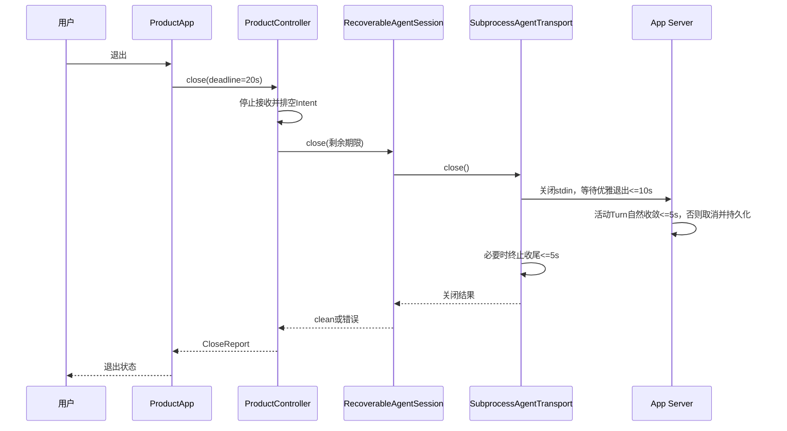

# 0.9.3d Product UI退出期限分层详细设计

## 1. 需求背景与故障事实

`harnessix code`的退出操作必须停止接收新Intent，排空已接纳命令，并有界关闭SDK连接；退出本身不能发送领域级`turn/cancel`。在Revision `823ceac0c7ec250bb36cd0009946949ad8f094d2`的[六实例CI首次尝试](https://github.com/carrie1988/Harnessix/actions/runs/35845010214/attempts/1)中，Windows的`test_product_quit_does_not_send_turn_cancel`得到`CloseReport(clean=False, error_code=controller_connection_close_failed)`，同一Job中511项通过、1项失败、45项跳过；[仅重跑Windows](https://github.com/carrie1988/Harnessix/actions/runs/35845010214/attempts/2)则512项通过、45项跳过。该测试使用每次模型事件等待10秒的离线`ScriptedProvider`，不是远端Provider故障。macOS本机连续五次单例运行均通过，首次用时约9.4秒，其余约5.6秒。**当前日志无法区分Controller等待超时与底层Close异常；重跑成功也不证明原因已关闭。**原始Job身份与低敏摘要见[Windows诊断归档](../validation/product-quit-windows-2026-09-23-v1/README.md)。

源码核查确认一个独立于操作系统的预算倒挂：[`ProductApp._close_and_exit`](../../src/harnessix/product_ui/app.py)和`on_unmount`只给[`ProductController.close`](../../src/harnessix/product_ui/controller.py)10秒；产品使用的[`SubprocessAgentTransport`](../../src/harnessix/sdk/subprocess.py)默认允许10秒优雅退出和5秒终止收尾，服务端[`AgentApplicationService.close`](../../src/harnessix/app_server/service.py)又给活动Turn 5秒自然收敛。外层10秒无法覆盖内部允许的15秒进程退出路径及Actor排空、SQLite收尾余量。与首次CI失败相关性尚需跨平台复验确认，但该预算不变量自身已违反。

## 2. 设计目标、非目标和方案选择

| 项目 | 决策 |
|---|---|
| 目标 | UI退出总期限覆盖默认Transport最多15秒的正常关闭窗口并留出少量Actor/Store余量；仍保留有界失败与低敏Code。 |
| 方案 | 两个Product App退出路径共用20秒期限，低于Controller合同的30秒上限。 |
| 不变 | 不发`turn/cancel`；不修改5秒Server自然收敛、10+5秒Transport关闭、领域Command身份、Session事实或`CloseReport`合同。 |
| 非目标 | 20秒不是“必定clean”的承诺；不会把真正卡死的连接伪装成成功，也不宣称已解释过去全部Windows超时。 |

将Server自然收敛改短会增加被取消的正常Turn；仅放宽测试断言会掩盖产品真实退出期限倒挂；取消外层期限又会失去有界失败。因此选择只调整产品壳拥有的预算，不触碰底层恢复语义。

## 3. 总体架构、时序与数据流



正常路径只传递`CloseReport(clean=True)`及处理/放弃Intent计数；失败路径保留`controller_close_timeout`或`controller_connection_close_failed`，不读取stderr正文、模型内容、Prompt、路径或Secret。`client-state.json`的`clean_shutdown`仅在连接安全关闭后标记为真，不能据此推断Turn是否已完成。产品状态恢复仍依赖Protocol与Session持久事实。

## 4. 接口设计与组件边界

| 组件/字段 | 源码 | 含义及边界 |
|---|---|---|
| `PRODUCT_QUIT_DEADLINE_SECONDS` | [`app.py`](../../src/harnessix/product_ui/app.py) | 产品壳唯一退出预算，20秒；Ctrl+Q和卸载共用。 |
| `ProductController.close(deadline_seconds)` | [`controller.py`](../../src/harnessix/product_ui/controller.py) | 先停新Intent，再结算Actor，随后在剩余期限内关闭连接；允许大于0且不超过30秒，不重试未知业务命令。 |
| `RecoverableAgentSession.close()` | [`session.py`](../../src/harnessix/product_ui/session.py) | 关闭SDK；成功才标记客户端干净关闭，失败保留BROKEN。 |
| `SubprocessAgentTransport.close()` | [`subprocess.py`](../../src/harnessix/sdk/subprocess.py) | 取消安全的唯一Close Task；默认10秒优雅退出、5秒终止收尾。 |
| `AgentApplicationService.close()` | [`service.py`](../../src/harnessix/app_server/service.py) | 活动Turn最多5秒自然收敛，再取消并等待Runtime收尾；不是领域`turn/cancel`命令。 |

### 4.1 数据结构与重点字段

`CloseReport`沿用`clean: bool`、`processed_intents: int`、`abandoned_intents: int`和可空的`error_code: str`，不新增持久Schema。`PRODUCT_QUIT_DEADLINE_SECONDS`是产品壳内部常量，不通过Agent Protocol传输，也不写入Session或Client State。底层Transport的两个期限仍各自独立；外层Controller使用单个绝对Deadline扣减Actor耗时，不能错误地把20秒分别重复授予每个阶段。

## 5. 失败、持久化、安全与可观测性

| 故障 | 对外结果 | 持久化/恢复要求 |
|---|---|---|
| Actor在期限内未排空 | `controller_close_timeout`、`clean=False` | 已持久分配的Command ID不得回退；不把未结算Intent报为成功。 |
| Transport超过剩余期限 | `controller_connection_close_failed`、`clean=False` | 底层Close Task仍应继续回收；`clean_shutdown`不置真，重启从服务端事实恢复。 |
| Provider/Turn尚在运行 | 不发`turn/cancel`；Server按自身5秒策略关闭 | Turn最终状态由Runtime持久化；不因退出而重放副作用。 |
| 子进程/Store真实异常 | 保留稳定错误Code、`clean=False` | 不吞掉失败、不保存正文；下一次启动按已有Protocol/Session恢复。 |

本变更不创建新数据库、网络服务或遥测正文。CI证据按Revision、平台、Job和尝试次数分开记录；重跑绿色不能把首次红色改写为从未发生。20秒只是预算一致性修复，仍须通过Windows完整Product UI回归和后续重复运行验证稳定性。

## 6. 核心逻辑、测试与验收

```text
quit:
    accepting = false
    drain admitted intents until deadline
    close SDK within remaining deadline
    if any stage fails or times out: emit unclean CloseReport
    else: persist clean_shutdown and emit clean CloseReport
    never issue turn/cancel solely because the user quits
```

1. [`test_app_interactions.py`](../../tests/product_ui/test_app_interactions.py)用真实Controller、InProcess Agent Protocol、慢速离线Provider证明退出未发送`turn/cancel`且正常收敛；失败时输出低敏`CloseReport`和耗时用于区分预算路径。
2. [`test_controller.py`](../../tests/product_ui/test_controller.py)保留显式极短期限的`UNKNOWN`回归；增大产品默认期限不能使真正超时被判成功。
3. [`test_recoverable_session.py`](../../tests/product_ui/test_recoverable_session.py)继续验证干净关闭标记只在安全Close后写入。
4. 本地运行Product UI定向测试、`make check`，随后检查Linux/macOS/Windows/Container/文档六实例CI；Windows首次尝试失败时不得仅凭重跑绿色关闭原因调查。

## 7. 部署、兼容与回退

三平台安装包均使用同一Python常量，无环境变量或配置迁移；Agent Protocol、数据库和公共SDK签名保持不变。回退只需恢复产品壳原10秒调用，但会重新引入已确认的预算倒挂，因此仅在20秒引发独立产品问题且有证据时考虑。部署验证须在Windows原生Job上完成，macOS单机通过不能代替。

## 8. 风险与取舍

20秒可能使真实卡住的退出等待比旧版更久；Controller仍强制上限、明确非Clean结果和未知命令语义。相反，继续10秒可能在底层合法关闭窗口内误报失败。Windows首次失败也可能是底层SQLite或连接异常，预算调整不能证明或修复该类问题；如果新CI复现，应保留失败并按阶段继续定位，不通过反复加长等待掩盖。

## 9. 源码映射与后续边界

这是0.9.3d的**可靠性阻断修复**，不是新增Soak场景，也不替代Action恢复/重启Runner、三平台阈值Profile及独立候选复验。若20秒预算仍出现相同失败，应先区分`asyncio.timeout`取消与底层`ProductUIError`，并核查SQLite/stdio具体收尾阶段；不能继续盲目加大期限。
