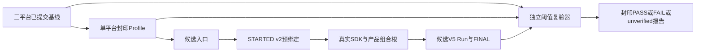
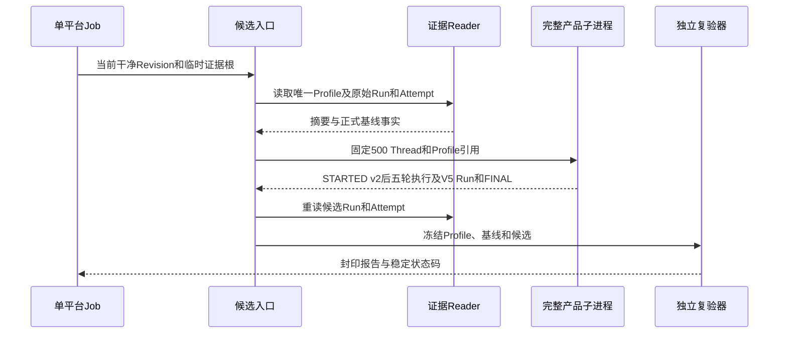

# 0.9.3d完整产品重启冻结阈值与第二独立Run详细设计

## 1. 需求背景、源码依据与设计目标

[三平台正式规模基线](../validation/soak-restart-three-platform-2026-09-23-v1/README.md)证明Revision `172b1ee`的固定产品组合根负载在三个托管Runner完成，但仅各有三条正式启动样本；它不能说明后续Revision的启动延迟、RSS或SQLite增长不退化。发布门禁必须依次完成“已提交基线 → 单平台冻结Profile → 候选负载前持久预绑定 → 第二独立Run → 独立报告”，不得用候选样本反推上限，也不能把`baseline`状态解释成`PASS`。

| 源码 | 已求证的事实与设计影响 |
|---|---|
| [`run_product_restart`](../../scripts/soak_restart.py) | 真实SDK、完整产品组合根、500 Thread、硬退出与恢复；正式Runner在第一负载前核对干净Revision，`threshold_profile_ref`进入Attempt和Run。 |
| [`SoakManifestV5`](../../scripts/soak_manifest.py)、[`SoakRestartProof`](../../scripts/soak_restart_proof.py) | 固定`restart/product_startup`、一次EOF、五轮集合/报告/Fence证明；低敏Reader可重算样本与Proof，但不凭文件自行证明外部效果。 |
| [`SoakAttemptStartV2`](../../scripts/soak_attempt.py) | 候选负载前记录Profile ID/SHA，FINAL绑定Manifest SHA；没有STARTED v2的候选不能获得PASS。 |
| [`publish_profile`、`verify_and_publish`](../../scripts/soak_threshold.py) | 已对其他场景实现封印Profile、逐分位/水位比较和不可覆盖报告；受限扩展后只接受v5完整重启证明及场景专属`product-no-turn`版本。 |
| [`.gitattributes`](../../.gitattributes) | 规范Profile、原始Run及Attempt依赖逐字节SHA；Windows的`core.autocrlf=true`必须对这些路径关闭文本换行转换。 |

目标是让Linux、macOS、Windows各自凭自身基线形成不可覆盖Profile，再以同固定负载和新Run ID完成独立候选；每个平台产生`PASS`、`FAIL`或`unverified`，并长期归档全部原始证据。此切片不新增Action HTTP/Worker、不改变生产Agent Protocol、数据库Schema或用户可见CLI，不请求真实模型，也不把三平台托管机结果宣称为C端容量SLA。

## 2. 总体架构、数据流程、持久化与时序





数据流只有两类持久物：仓库内只读的原始基线/Profile，以及GitHub Job私有临时目录中的新候选Run/Attempt/Report。业务State和假配置位于Runner的独立临时根，关闭后不进入上传件。每个平台独立Job、`fail-fast: false`；失败时也上传已产生的低敏Attempt、Run和Report，不覆盖既有原件。

## 3. 领域契约、字段解释和工程余量

冻结Profile必须绑定场景`restart`/v5、测量边界`product_startup`、本平台、硬件档位、Python 3.12小版本、精确负载`500/1/3`、样本数`product_startup=3`与`rss_peak=1`、`product_no_turn_v1`与`harnessix.product-no-turn/v1`、固定`product-restart-v1`故障矩阵及一次预期EOF。其他场景不得借用无Turn Provider版本；只接受完整V5基线Run、COMMITTED和FINAL，不从任意手写Manifest冻结。

| 约束 | 冻结规则 | 取舍 |
|---|---|---|
| 平台和硬件 | 各平台分别绑定实际`hardware_class`；Python范围为`3.12.0`～`3.12.99` | 托管机粗档位相同不保证具体CPU型号相同，资源漂移仍可造成噪声。 |
| `product_startup` P50/P95/P99 | 各自原基线上浮100%（10000bp），整数向上取整 | 每平台只有三次正式启动；宽松回归护栏而非用户端冷启动SLO。 |
| `rss_peak` P50/P95/P99 | 原基线上浮50%（5000bp） | 峰值是父子进程各自高水位的较大者，不是并发总RSS。 |
| `db/wal/artifact_growth` | 各自正向端点增长上浮50%；基线0的上限仍为0 | 端点不能替代运行期磁盘峰值，额外WAL/Artifact增长必须显式审查。 |
| 故障计数 | 精确等于基线：`eof=1`，其余全0 | 额外超时、UNKNOWN、重复效果、孤儿不得PASS；本无Turn场景的0副作用并不证明Action场景安全。 |
| Profile/Report | 各自`SEALED.json`绑定规范字节SHA-256；候选在STARTED v2中预绑定Profile引用 | 防止阈值赛后修改、部分Run和报告替换。 |

阈值采用[`_margin_upper`](../../scripts/soak_threshold.py)的`ceil(baseline × (10000 + margin_bp) / 10000)`，候选值不能参与计算。工程余量适用于三平台单次基线的**当前固定负载**；长期分位置信度、真实模型时延、多租户/海量用户容量、Action效果恢复需要另外的场景和发布评审。

## 4. 接口设计、数据结构与核心伪代码

| 接口 | 输入/输出 | 失败语义 |
|---|---|---|
| `SoakThresholdProfile` | 基线ID/SHA、环境/负载、Provider版本、样本数、量纲、分位与增长上限、预期故障 → 封印Profile | `restart`只允许产品无Turn Provider版本；旧场景仍只允许确定性Soak Provider。 |
| `publish_profile(root, profile, baseline_directory)` | 完整基线Run/Attempt → `profile.json`和`SEALED.json` | 不完整、错误v5、量纲/余量不一致失败；同ID不可覆盖。 |
| `run_candidate(evidence_root, report_root)` | 本平台唯一Profile、原始基线、当前干净Revision → 新候选与报告摘要 | Profile歧义/摘要错在负载前拒绝；运行故障保存失败Attempt，不发布虚假PASS。 |
| `run_product_restart(... threshold_profile_ref)` | 固定500/1/3与预绑定引用 → V5候选Run | `STARTED v2`先于子进程启动；每阶段超时和硬退出收敛沿用重启场景合同。 |
| `verify_and_publish` | 冻结Profile、完整基线、完整候选 → 封印Report | 无效证据/环境错为`unverified`，完整可比但越限为`FAIL`，全量满足才`PASS`。 |
| CLI主入口 | `--evidence-root`和`--report-root` | 退出0仅PASS、1为前置/执行错误、2为已发布非PASS；日志只输出稳定码和低敏摘要。 |

```text
platform = read_environment().platform
profile_dir = require_exactly_one_sealed_profile(platform)
profile, profile_sha = read_profile(profile_dir)
baseline, baseline_sha = read_published_run(profile.baseline_run_id)
assert baseline_final.committed and baseline_sha == profile.baseline_manifest_sha256
assert baseline.spec_version == v5 and baseline.load == fixed_500_1_3
revision = git_head_and_require_clean_checkout()
candidate = run_product_restart(fixed_500_1_3, profile_ref=(profile.id, profile_sha))
assert candidate_started_v2.profile_ref == candidate.manifest.profile_ref
assert candidate_final.committed and reader_recomputed_sha == candidate_final.manifest_sha256
report = verify_and_publish(profile, baseline, candidate)
assert read_report(report.path) == report
return success_only_if(report.status == PASS)
```

## 5. 失败、取消、恢复、安全与可观测性

基线或Profile缺失、提交不完整、V5 Proof无效、平台/硬件/Python不匹配、负载或Provider版本漂移都不能获得PASS；Reader拒绝半提交和摘要篡改。新候选每次使用新Run ID，超时、子进程硬退出门闩不成立、Thread缺页、恢复报告不可读时留下失败Attempt，不能原地重试掩盖故障。`verify_and_publish`对完整可比且指标超上限的Run发布`FAIL`及精确指标名，不能事后放宽Profile；证据不完整则`unverified`。取消/关闭由现有有界SDK Transport收敛，避免Windows SQLite句柄未关闭就清理临时根。

候选沿用固定假Secret、`.test`模型端点和无Turn操作；上传白名单只有低敏计数、摘要、原始样本和报告，不上传Workspace、私有配置、Thread ID列表、Prompt、Provider响应或stderr。Profile/Report使用SHA封印但不构成签名认证；Git历史与只读仓库权限提供评审可追溯性。观测标签只包含场景、平台、Run ID和稳定失败Phase，不增加高基数Thread标签。

## 6. 测试、部署、回退与风险

单测必须覆盖三份基线与Profile重读、Provider版本互斥、错误场景/v5拒绝、唯一Profile发现、基线摘要漂移时不启动负载、固定500/1/3和STARTED v2预绑定、CLI脱敏、非PASS退出码及证据路径的Git `text: unset`属性。三平台手动候选Job须真实运行新进程、下载原始件、复核Run/Attempt/Report、文件SHA及分位数，再与同Revision常规CI联合评审。仅本地缩小回归或只把工作流写入仓库均不关闭门禁。

此切片是离线发布工程，不进入产品CLI默认路径或用户部署，也不部署独立Action服务、中间件或远程Worker。回退可停止候选工作流；已冻结Profile和历史Run/Report保留，只读归档，不原地改写。托管机硬件档位、三样本噪声和0副作用矩阵是主要局限；出现环境漂移应记`unverified`并重新设计可比基线，不能删除校验或用更宽阈值追认失败Run。

## 7. 首次三平台候选的Windows字节失败与修复边界

[首次候选工作流 35867100728](https://github.com/carrie1988/Harnessix/actions/runs/35867100728)在Revision `64663f2`的Linux、macOS Job完成，Windows在负载前以`soak_profile_invalid`失败且未产生Attempt。排查确认新证据目录未列入[`.gitattributes`](../../.gitattributes)的`-text`白名单：对该提交执行`core.autocrlf=true`的隔离Checkout后，Windows Profile的`profile.json`出现一处CR，SHA-256由封印的`4b26a7f9...`变为`7cceecf4...`；Git属性为`text: auto`。这是Profile规范字节在Checkout被改写，不是完整产品恢复失败或阈值越限。

修复范围仅为重启基线的`raw/**`、`profiles/**`和后续候选`raw/**`设置Git `-text`，并由[`test_run_restart_soak_candidate.py`](../../tests/benchmarks/test_run_restart_soak_candidate.py)断言属性及三平台Reader。修复提交后须在新的三平台Job重新执行完整候选；首次两平台成功不补写为全平台PASS，也不改变冻结阈值。
