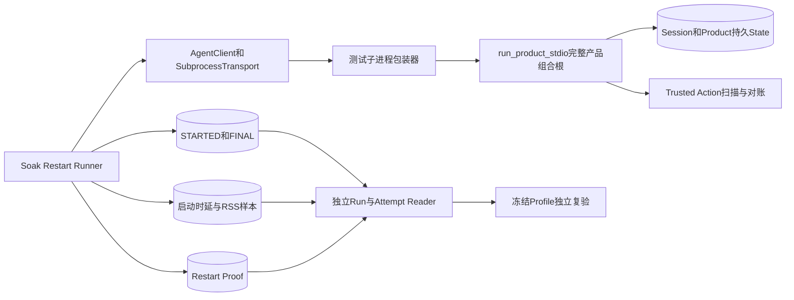
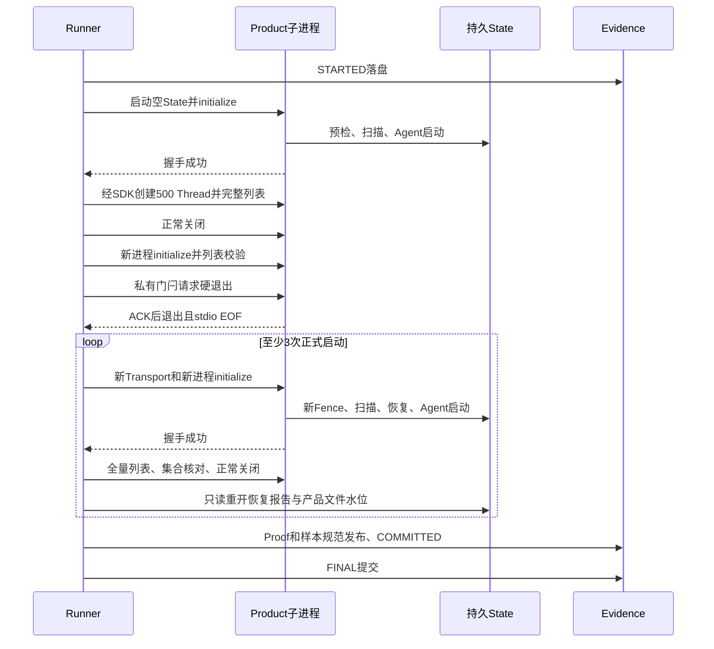

# 0.9.3d完整产品重启Soak详细设计

## 1. 文档摘要

| 项目 | 内容 |
|---|---|
| 需求 | 在真实`harnessix agent-server`产品组合根上，以相同持久State验证首次启动、500 Thread增长、受控硬退出后的恢复和多次新进程重启，并形成可独立读取的低敏发布证据。 |
| 当前差距 | [`run_many_threads`](../../scripts/soak_many_threads.py)只测Agent Runtime与App Service。新增的Restart Runner已覆盖完整产品组合根，但正式规模Run、三平台冻结阈值与独立候选尚未完成。 |
| 本设计状态 | 评审中；V5 Proof/Manifest/Reader、真实产品子进程包装器和小负载Runner已实现；正式规模与三平台发布证据尚未完成。 |
| 测量边界 | `product_startup`：新子进程首次`client.initialize()`开始至Agent Protocol完成握手，随后以全量列表、持久恢复报告和关闭结果证明可用。 |
| 发布边界 | 基线、单平台Profile、负载前预绑定的第二独立Run、报告及常规CI分别验收；单次运行永不自称PASS。 |

## 2. 需求背景与源码研究

[总体Soak设计](m09-3d-soak-and-performance-evidence.md)固定`restart → product_startup`，不能用`app_service_startup`替代。当前[`run_product_stdio`](../../src/harnessix/product_config/server.py)先执行离线预检、加载受控配置、初始化Session，再由[`open_default_product_action_runtime`](../../src/harnessix/product_config/action_runtime.py)取得进程锁及Fence、完成跨Store扫描与Route对账；只有Agent Runtime也已准备好，才进入[`run_stdio`](../../src/harnessix/app_server/stdio.py)响应握手。[`AgentClient.initialize`](../../src/harnessix/sdk/agent_client.py)因此可作为可观察的“协议就绪”边界；[`SubprocessAgentTransport`](../../src/harnessix/sdk/subprocess.py)管理新进程、请求匹配和有界关闭。

现有[`test_product_server_starts_and_closes_on_eof_without_model_request`](../../tests/product_config/test_server_and_cli.py)已证明空输入启动/关闭不会调用模型，[`test_controller_recovers_cold_transcript_through_restarted_stdio_process`](../../tests/product_ui/test_stdio_product.py)验证另一条测试Server的跨进程恢复；两者均不足以证明当前**完整产品组合根**在500 Thread和硬退出后的规模行为。当前[Restart Runner](../../scripts/soak_restart.py)以私有临时配置、假Secret及`.test`端点运行真实组合根，[子进程包装器](../../scripts/soak_restart_child.py)只负责故障门闩与正常退出RSS；小负载回归不作为正式Run证据。Runner不导入`tests`包，也不读取用户Workspace或真实API Key。

## 3. 设计目标、非目标与验收

1. 固定1次空State预热、1次已填充State的受控硬退出、至少3次500 Thread持久State上的正式新进程启动；每次使用新Transport和新`AgentClient`，不复用内存Runtime。
2. 测量完整产品进程启动至握手的P50/P95/P99、Runner/Server峰值RSS、Session及全部产品SQLite主文件/WAL端点增长；逐次证明500个Thread身份集合不变、恢复扫描和报告已持久化、Fence代际递增、传输关闭收敛。
3. 硬退出必须在Server已响应握手并完成列表校验后由**独立测试子进程**观察私有门闩触发，不向生产协议添加故障命令；下次启动必须恢复且不重复任何模型或Action效果。
4. 基线只能在源码Revision与干净工作树一致、三平台单位可靠、最低负载满足、完整Proof与Run/Attempt原件均可重读时发布；候选只能引用先前冻结Profile，不得从自身结果反推阈值。

非目标：本场景不执行真实Turn、Patch、Process或Git Push，因此`duplicate_effect=0`只证明该场景没有副作用，不代替独立`action_recovery`故障矩阵。它也不测TUI渲染、远程Provider时延、多租户并发或外部网络。缩小负载只供CI回归，状态`unverified`。

## 4. 总体架构与模块职责



Runner只编排负载、比较集合与发布证据；包装器只提供假Secret、无网络的受控进程启动、硬退出门闩和关闭后RSS夹具结果，不替代生产`run_product_stdio`。Proof定义阶段事实及低敏聚合；[`soak_evidence.py`](../../scripts/soak_evidence.py)沿用规范字节、文件摘要和最后`COMMITTED.json`；[`soak_attempt.py`](../../scripts/soak_attempt.py)必须在第一子进程启动前落盘`STARTED`。阈值引擎仍是独立Reader，不由Runner自己判PASS。

## 5. 正常与故障恢复时序



异常或超时不发布部分Run：先放开夹具门闩并按Transport合同关闭，等待子进程资源收敛后保存`FINAL(outcome=failed, phase=...)`。硬退出在`FINAL`前发生时，只有`STARTED`是未完成尝试；Reader绝不把它当PASS。包装器无条件写出的ACK必须先于`os._exit`，否则无法区分预期硬退出与环境崩溃。

## 6. 接口设计与领域契约

规划入口`run_product_restart(evidence_root, *, code_revision, thread_count, warmup_count, measured_restarts, timeout_seconds, threshold_profile_ref=None)`返回`(run_directory, SoakManifestV5)`。输入须严格整数与范围校验，正式负载固定`thread_count >= 500`、`warmup_count == 1`、`measured_restarts >= 3`；Profile引用只可用于正式候选。正式负载使用[`check_release_revision`](../../scripts/soak_run_common.py)，缩小CI负载不调用它且永远`unverified`。

### 6.1 数据结构与重点字段

| 对象/字段 | 规则 | 来源与复核 |
|---|---|---|
| `SoakManifestV5` | `scenario_id=restart`、`measurement_boundary=product_startup`、`scenario_version=v5`；`evidence_sha256`只能含`samples.jsonl`和`restart-proof.json` | 独立Reader重读规范字节与提交标记。 |
| `SoakProviderEvidence` | 新增严格的`product_no_turn_v1`模式，`request_count=0`；旧确定性Provider模式原字节保持不变 | Runner只允许initialize/create/list/get，不发送`turn/start`；Product配置用假Secret和`.test`端点，不把假凭据记录在证据中。 |
| `SoakRestartProof` | Run ID、固定场景版本、Thread数、匿名集合摘要、受控退出ACK、逐次启动/扫描/报告/Fence事实及Runner/Child RSS | 与Manifest、正式样本索引和`SoakFaultCounts(eof=1)`逐项交叉校验；不保存UUID列表、路径或模型正文。 |
| `SoakRestartCycle` | 序号、预热/正式阶段、启动样本索引、完整列表数量与摘要、恢复扫描/报告摘要、Fence代际、关闭状态 | 预热周期包含创建；正式周期必须各自新进程、列表覆盖完整且摘要恒定。 |
| `SoakFileWatermarks` | 本场景DB/WAL为固定白名单中所有产品SQLite文件端点字节的合计，Artifact独立件始终0 | Proof同时保存按逻辑文件名的非负字节水位，Reader重算合计；不保存绝对路径。 |
| `SoakRssEvidence` | Runner与各正常退出子进程峰值中的最大值及本平台原始单位；预期硬退出子进程无最终RSS，不拿缺值作0 | 复用三平台RSS单位探针，Proof与正式`rss_peak`样本一致。 |

正式Profile冻结必须要求相同平台、Python小版本范围、硬件档位和确切负载，不得跨平台共享绝对时延数值。当前[`soak_threshold.py`](../../scripts/soak_threshold.py)拒绝`restart`；只有V5 Proof/Reader和真实基线完成后才允许扩展白名单。

### 6.2 已实现的V5证据合同

[`SoakRestartProof`](../../scripts/soak_restart_proof.py)包含一段空State预热、一段受控硬退出和至少三段独立正式启动；每段保存完整Thread集合摘要、Owner代际、产品配置库中可重读的低敏恢复扫描/报告合同，以及正常关闭或硬退出状态。扫描/报告沿用生产合同自校验的摘要；Reader核对周期顺序、代际严格递增、集合摘要不漂移和ACK与EOF同时成立，不把普通子进程异常计为计划内故障。此证据只能证明Runner发布的低敏事实内部一致；实际进程、SQLite和Thread列表由Runner在采集时读取验证，Reader不能仅从Manifest自行推导其真实性。

`SoakManifestV5`强制`restart/product_startup`、无Turn Provider身份、模型请求零、一次预热、一次预期EOF、RSS正式样本一件、Artifact水位零和全部产品SQLite逻辑文件白名单。正式基线还要求500 Thread、至少三次新进程测量和已验证RSS单位。旧v1～v4模型、文件集合与规范序列化不改动；V5仅额外写入`restart-proof.json`，并在最后写入`COMMITTED.json`。发布器先交叉验证Proof、样本索引、RSS及逐文件DB/WAL水位总和；独立Reader从磁盘重新验证规范字节、摘要、场景不变量、样本统计和Proof。证据文件摘要不能证明子进程曾真实运行；该边界已由小负载跨进程回归提供局部证据，正式Run仍须单独取得。

### 6.3 已实现的真实Runner与可观测边界

[`run_product_restart`](../../scripts/soak_restart.py)在任何负载前发布`STARTED`，创建私有Workspace、State和固定离线配置，然后每个周期重新构造SDK Transport/Client。预热周期从空State握手后创建固定数量Thread；硬退出周期先全页比对持久集合，再触发包装器私有门闩，要求ACK和SDK观察到`server_closed`；正式周期分别测量新进程握手至协议就绪的单调时延。每次子进程关闭后，Runner重开[`SQLiteProductRuntimeConfigStore`](../../src/harnessix/product_config/action_store.py)核对恢复扫描、报告和Owner代际。六个产品SQLite主文件与WAL按固定逻辑名取端点水位；不存在的正式主文件或新增未知主文件均失败。正常退出子进程与Runner分别采集带单位证明的RSS，硬退出进程没有最终RSS，不伪填零。小负载回归只发布`unverified`；正式500 Thread必须先在干净Revision运行，并由三平台CI及独立候选补齐发布证据。

子进程包装器调用的是生产[`run_product_stdio`](../../src/harnessix/product_config/server.py)，不是另建的测试Server；门闩与RSS结果只进入私有临时目录，不是Agent Protocol方法。Wrapper强制覆盖专用假凭据，不配置任何真实Provider端点；Runner只调用Initialize/Create/List，不发送Turn。受控退出用ACK、stdio EOF和后续恢复验证界定，但Proof只能证明低敏摘要和现场采集相符，不能替代未来`action_recovery`对真实外部效果的独立验证。

## 7. 数据流、持久化、事务与幂等

私有临时根将配置、固定Workspace、持久产品State、受控退出门闩和子进程RSS夹具分离；配置不放进Workspace，State与Workspace互不包含。Session Thread由真实SDK在预热进程创建，后续启动只读核对，不重发创建命令。故障门闩只由包装器读，不进入Agent Protocol。Product State包含Session、Product Config、Execution Plan、Action Audit、Workspace Lease及Transaction等固定SQLite文件；主文件和WAL的总端点水位按白名单统计，新增未知文件拒绝或显式版本升级，不能静默忽略。

Run文件在所有子进程终态、状态重读、Proof校验后才发布；`COMMITTED.json`最后写入，Attempt FINAL再绑定Manifest SHA。若发布窗口崩溃，Reader必须根据提交标记和Attempt状态拒绝“半成功”。旧v1～v4 Run保持可读、原始字节不变；V5只新增`restart`场景专属证明。独立候选使用STARTED v2在任何负载前绑定冻结Profile ID/SHA。

## 8. 失败语义、取消、超时和恢复

| 故障 | 预期结果 | 不变量 |
|---|---|---|
| 预检/握手失败 | `soak_restart_startup_failed`，失败Attempt | 不发布Run；不把stderr正文写入证据。 |
| ACK缺失、子进程自然退出或未收到EOF | `soak_restart_crash_invalid` | 不把环境崩溃伪装成计划内故障。 |
| Thread缺页、重复或集合摘要变化 | `soak_restart_thread_invalid` | 不只核对数量；拒绝漏页或重复。 |
| 新Fence未递增、扫描/恢复报告缺失或不可重读 | `soak_restart_recovery_invalid` | 不把协议握手等同于恢复完整。 |
| 启动/分页/关闭超时 | 分阶段稳定Code与失败Attempt | 先按现有取消安全Transport收敛资源；不能重试同一Run ID掩盖故障。 |
| Proof/Manifest不一致、文件篡改 | Reader给`soak_run_invalid` | 不接受自报样本、错Profile或半提交。 |

进程退出不会调用任何Action Executor；本场景的`unknown_effect`、`duplicate_effect`、`orphan`应为0，但不对Action效果做虚假保证。真正的Owner/效果边界矩阵由`action_recovery`场景单独覆盖。

## 9. 安全、隐私与可观测性

夹具只用固定假Secret和保留`.test`域名，不接用户真实API Key；Run证据白名单只有计数、字节数、时间和摘要，不保存Prompt、Thread ID、Workspace路径、Provider响应、stderr或环境变量。实验性完整State仅在私有临时根保留至所有句柄与子进程关闭，Windows清理前必须确认SQLite连接关闭。观测按`run_id/scenario/platform/phase`低基数字段记录；硬退出和重试均不可产生模型请求或业务副作用。

## 10. 核心逻辑伪代码

```text
validate_load_and_revision()
persist_attempt_start_before_work()
create_private_config_state_workspace_with_dummy_provider()
warm = start_real_product_through_sdk()
create_exact_threads_and_capture_identity_digest(warm)
close_and_read_persisted_scan_report(warm)
crash = start_new_real_product_and_verify_thread_set()
request_private_child_hard_exit_and_wait_for_ack_then_eof(crash)
for ordinal in measured_restarts:
    cycle = start_new_real_product_through_sdk_and_time_handshake()
    verify_complete_thread_set_and_persisted_recovery(cycle)
    close_and_read_child_rss(cycle)
    append_measure_sample_and_proof_cycle(cycle)
verify_state_watermarks_and_zero_effect_counts()
publish_v5_run_then_commit_attempt()
on_failure: converge_child_and_record_failed_attempt_without_partial_pass()
```

## 11. 源码与测试映射、实施顺序

| 顺序 | 当前事实与将修改位置 | 验收 |
|---|---|---|
| 1 | [`product_config/server.py`](../../src/harnessix/product_config/server.py)真实组合根保持不变；[独立子进程包装器](../../scripts/soak_restart_child.py)只调用其公共入口 | [macOS真实子进程回归](../../tests/benchmarks/test_soak_restart_child.py)已通过；Linux/Windows需CI验证。 |
| 2 | [`soak_manifest.py`](../../scripts/soak_manifest.py)、[`soak_evidence.py`](../../scripts/soak_evidence.py)、[`soak_run_common.py`](../../scripts/soak_run_common.py)已新增V5字段、Proof白名单和Reader；历史v1～v4不变 | [V5证据回归](../../tests/benchmarks/test_soak_restart_proof.py)覆盖发布/重读、摘要篡改、负载门槛与Thread集合漂移；真实Runner验收待完成。 |
| 3 | [Restart Runner](../../scripts/soak_restart.py)及[小负载回归](../../tests/benchmarks/test_soak_restart.py)已接入[`soak_attempt.py`](../../scripts/soak_attempt.py)、[`soak_rss.py`](../../scripts/soak_rss.py) | macOS小负载正常Run/硬退出/失败Attempt已通过；500 Thread正式负载、三平台CI和阈值尚未验收。 |
| 4 | [`soak_threshold.py`](../../scripts/soak_threshold.py)只在V5可独立重算且正式基线归档后扩展 | 三平台各自冻结Profile，第二独立Run在负载前预绑定，独立报告PASS/FAIL且不可覆盖。 |

## 12. 部署、兼容、回退与风险取舍

Runner是离线开发/发行验收工具，不进入默认CLI或生产进程，不部署远程Worker、HTTP服务或数据库。生产协议和Session Schema不变；新增V5证据仅由新Reader分支读取，旧原件不可改写。若三平台Runner失败，保留失败Attempt和诊断日志、停止Profile冻结，不能回退为`many_threads`的较窄`app_service_startup`数字。风险包括硬退出门闩时序、Windows文件句柄、RSS缺失以及只凭摘要无法恢复原始Thread身份；分别用ACK→EOF握手、显式关闭、失败拒绝和运行时集合比对控制。正式阈值需在真实基线和工程评审后另行冻结，本设计不预填可随意放宽的数值。
