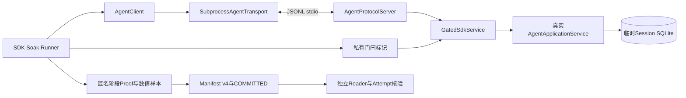
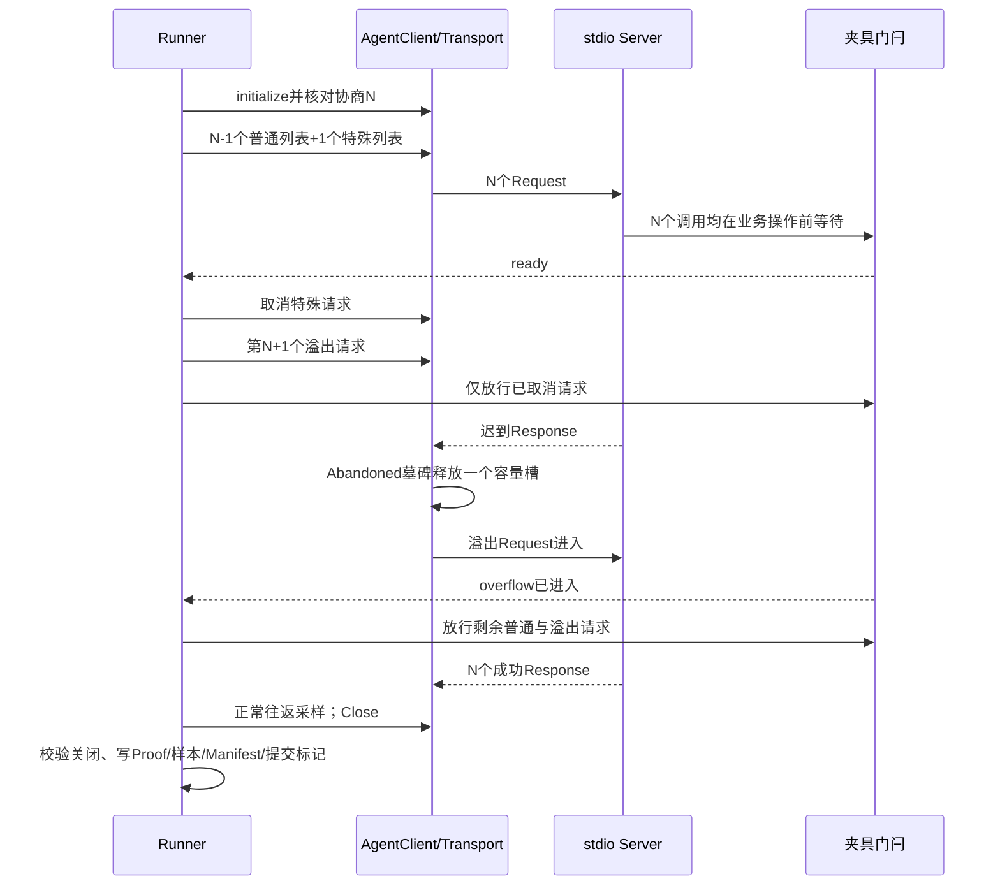

# 0.9.3d SDK容量与迟到响应Soak详细设计

## 1. 需求背景与源码依据

Agent SDK允许同一stdio连接上并发发送协议请求。取消请求只取消调用者等待，不等于服务端没有执行，也不等于迟到Response不再到达。若取消时立刻释放容量并丢弃请求身份，超过协商上限的请求可能涌入，迟到Response又可能被当成未知响应使整条连接失败。0.9.3a已在[`_RequestCapacity`与`_ResponseRouter`](../../src/harnessix/sdk/subprocess.py)把Pending和Abandoned共用容量；0.9.3d需要在真实子进程、真实协议握手、真实App Server列表方法上做规模验证，而非仅依赖内存替身单测。

源码求证：

| 当前实现 | 可验证事实与限制 |
|---|---|
| [`AgentClient.initialize`](../../src/harnessix/sdk/agent_client.py) | 使用Agent Protocol握手，SDK默认提议64个Pending；正式场景必须核对服务端返回的协商值与Transport实际构造值一致。Transport构造器不是握手协商器，任意自定义值不自动修改Client提议。 |
| [`SubprocessAgentTransport.exchange/snapshot/close`](../../src/harnessix/sdk/subprocess.py) | `exchange`在容量保留后登记请求；取消进入Abandoned且仍占槽；Reader收到迟到Response才释放；关闭由唯一Close Task收敛，快照不暴露请求ID或stderr正文。 |
| [`run_stdio`](../../src/harnessix/app_server/stdio.py) | 握手READY后按协商上限调度；同步stdio由有界Reader/Writer泵接入异步服务。 |
| [`AgentProtocolServer._initialize`](../../src/harnessix/app_server/server.py) | 有效Pending上限取服务端与客户端提议的较小值；请求进入[`AgentApplicationService.list_threads`](../../src/harnessix/app_server/service.py)。 |
| [`Soak Run/Attempt`](../../scripts/soak_evidence.py) | 原有v1～v3证据要求精确文件集合与规范字节；SDK专用证明使用v4，不改写旧Run。 |

## 2. 设计目标、非目标和完成标准

1. 通过真实`AgentClient → SubprocessAgentTransport → stdio → AgentProtocolServer → AgentApplicationService → SQLite`执行；固定模型Provider不发生请求。
2. 每轮先填满协商Pending容量，取消其中一个请求并确认`Pending=N−1、Abandoned=1`；仅放行已取消的服务端请求，等待迟到Response回收后，证明第`N+1`个请求才进入Server。其他`N−1`个请求在此期间仍被门闩阻塞，排除它们的正常Response释放容量这一替代解释。
3. 记录`SDK roundtrip`正式单调时钟样本、双进程各自峰值RSS、临时SQLite DB/WAL水位、预期取消次数和连接关闭零残留。
4. 正式基线固定协商64、1轮预热、至少3轮测量、至少20次正常往返；负载前核对干净Revision并写入`STARTED`，失败保留Attempt，不发布有效Run。
5. Proof、Manifest、样本、提交标记和Attempt可从磁盘独立读取；阈值Profile必须由另一个正式Run预绑定后复验。单次基线及测试夹具均不是发布PASS。

非目标：不新增Action HTTP/Worker、网络SDK、用户可调用的门闩协议、模型质量测试、真实用户流量压测或跨机分布式容量承诺。当前RSS是**客户端进程与服务端进程各自峰值的较大值**，不是两进程同时驻留内存之和；正式Runner应以新进程运行，避免调用进程已有RSS高水位污染。测试中绕过Revision清洁检查仅验证负载代码路径，不构成可冻结的外部基线。

## 3. 总体架构、数据流程和信任边界



[`GatedSdkService`](../../scripts/soak_sdk_child.py)只在调用`super().list_threads`之前等待私有标记，不重写协议解析、调度、SQLite读写或SDK Response归并。普通`limit=50`用于正常往返；门闩夹具用`limit=1/2/3`区分普通、被取消和溢出请求，均为合法`ThreadListParams`。门闩目录与业务SQLite位于`TemporaryDirectory`，不进入提交证据。子进程退出前写入低敏RSS和模型请求计数；Runner只把规范化数值写入Run。子进程若在关闭或采样阶段退出，只在临时目录写异常类型与稳定Kernel错误码，不保留异常正文；父进程缺少结果文件时以`soak_sdk_child_failed`失败关闭，并把该低敏分类用于诊断，不发布有效Run。

Linux子进程的`ru_maxrss`与`VmHWM`绝对值近似相等校验在真实CI上产生误拒绝。现行Linux采样改为读取`/proc/self/status`唯一、正值且带`kB`标签的`VmHWM`；父子进程必须报告相同来源和归一化公式。旧`getrusage`证据继续只读接受，新Run不使用其跨`execve`保留的高水位代替当前进程观测；平台来源与误差边界见[Soak总设计](m09-3d-soak-and-performance-evidence.md#171-rss来源原始单位与归一化)。



## 4. 领域契约、数据结构和可复核不变量

| 对象/字段 | 语义 | 校验与失败语义 |
|---|---|---|
| `SoakLoad.pending_limit` | 服务端、握手结果和Transport一致的实际容量 | v4要求`2..1024`；正式基线精确64；缺失或不一致拒绝。 |
| `SoakLoad.fault_matrix_version` | 固定负载身份`sdk-capacity-v1` | 版本不符拒绝；`turn_count/thread_count/artifact_count`均为0，不把SDK轮次伪装成Agent Turn。 |
| `SoakFaultCounts.cancelled` | 每轮恰好一个调用方取消，包括预热 | 与Proof轮数精确相等；其余故障计数为0。 |
| `SoakSdkRound` | 匿名轮次、阶段、满容量、取消后、迟到后、排空后的Pending/Abandoned计数及N个成功响应 | `N, (N−1,1), (N,0), (0,0)`且溢出只在迟到后进入，否则拒绝。 |
| `SoakSdkProof.roundtrip_sample_indices/roundtrip_window_ns` | 正式正常往返的连续样本引用与总单调时钟窗口 | 与原始`samples.jsonl`中的全部`sdk_roundtrip`正式样本按顺序精确一致；窗口必须覆盖全部单次时延，可据`样本数 × 10⁹ / 窗口ns`复算完成速率。当前阈值内核只对单次时延设上界，尚无吞吐下界门禁。 |
| `SoakSdkProof.client/server_rss_bytes` | 两进程各自高水位 | Manifest的`rss_peak`必须等于两者较大值，平台原始单位由RSS Adapter核对。 |
| `SoakManifestV4.sdk_proof_sha256` | 规范`sdk-proof.json`文件SHA-256 | 与`evidence_sha256`一致；Reader要求精确文件集合、规范字节、样本重算和提交标记。 |
| `SoakSdkChildResult.provider_request_count` | 子进程实际模型请求数 | 固定0；非零或缺失拒绝，不发生百炼或其他模型网络计费。 |

Proof是**Runner对真实传输快照的低敏数值见证**。磁盘Reader能重算计数、样本覆盖、摘要、负载和文件集合，但在临时进程退出后无法独立重演当时的调度时序；其来源强度依赖固定源码Revision、运行日志和跨平台CI。该边界不能被表述为密码学证明或真实用户高并发SLO。

## 5. 接口设计、核心伪代码和失败恢复

| 接口 | 输入/输出 | 失败和取消边界 |
|---|---|---|
| [`run_sdk_capacity`](../../scripts/soak_sdk_capacity.py) | 私有证据根、Revision、测量/预热轮数、正常往返数、容量、期限和可选Profile；返回Run目录及v4 Manifest | 先验证负载与正式Revision，再排他创建Attempt；任何握手、容量、期限、子进程或证据错误均不产生有效Run。 |
| [`GatedSdkService.list_threads`](../../scripts/soak_sdk_child.py) | 合法`ThreadListParams`，返回真实`ThreadListResult` | 固定门闩等待最多30秒；任何非法序列失败，不把夹具操作暴露到生产模块。 |
| [`verify_sdk_manifest`](../../scripts/soak_manifest.py) | v4 Manifest、Proof、原始样本 | 核对轮次、样本、取消、RSS和Provider计数；不接受手填统计替代原始文件。 |
| [`read_published_run`](../../scripts/soak_evidence.py) | Run目录，返回已核对Manifest及原始摘要 | 只接受精确v4文件集合及最终提交标记；损坏、篡改、缺失和未知字段稳定拒绝。 |

```text
validate_load_and_clean_revision()
begin_attempt_before_process_start()
client.initialize(); assert negotiated_limit == transport_limit
for each warmup or measured round:
    fill exactly N pending requests behind service gate
    assert snapshot == (pending=N, abandoned=0)
    cancel one; assert snapshot == (pending=N-1, abandoned=1)
    queue overflow; release only cancelled service call
    await child confirmation that overflow entered
    assert snapshot == (pending=N, abandoned=0)
    release remaining calls; assert N successes and (0,0)
measure normal SDK roundtrips; close transport once
assert child result exists, provider_request_count == 0, snapshot is closed and empty
publish samples + sdk-proof + manifest + COMMITTED; independently reread
commit Attempt FINAL only after valid Run exists
```

`_round`故障时先释放门闩，再取消在途Task；外层`finally`始终调用Transport Close。正常取消是**受控预期故障**，不属于业务重试；迟到Response必须由Reader吞掉并归还容量。请求超时、子进程EOF、未知Response、Writer故障、关闭不收敛或子进程结果文件缺失使Attempt失败。硬退出会留下`STARTED`且没有`FINAL`，独立Reader不能把它当作有效提交。

## 6. 部署、安全、可观测性、验证与剩余风险

- 运行于干净仓库Revision；业务State Root与门闩目录均为临时私有目录。证据根必须满足Run Writer的0700/POSIX所有权或Windows重解析点约束。正式Baseline、候选Profile绑定与报告均不可覆盖。
- 不保存JSON-RPC帧、请求ID、Workspace路径、stderr正文、Provider输入、凭据或Thread内容。失败只保存Attempt固定阶段和Outcome；测试检查证据无临时路径。
- 可观测性以`SDK snapshot`的状态、Pending/Abandoned计数、稳定失败Code和正式样本/Proof为界；不记录请求正文或错误堆栈。超时以`soak_sdk_timeout`、协商不符以`soak_sdk_limit_invalid`、容量阶段不符以`soak_sdk_capacity_invalid`、关闭残留以`soak_sdk_close_invalid`分类，Run Reader对篡改统一返回`soak_run_invalid`。这些错误分类只用于发布工程诊断，不改变Agent业务错误合同。
- [`test_soak_sdk_capacity.py`](../../tests/benchmarks/test_soak_sdk_capacity.py)覆盖真实子进程64容量、缩小负载、协商、取消/迟到、关闭、超时失败Attempt、非法负载及Proof篡改；旧v1～v3 Reader测试仍应通过。
- 基线需在macOS、Linux、Windows各自以正式负载运行，并对每个平台冻结经评审阈值、以第二独立Run预绑定Profile后复验；目前尚无三平台正式数值、工程阈值或发布PASS。SDK场景完成也不关闭其余`action_recovery`和`restart`场景。
- 进程峰值RSS取较大者，不代表同时总峰值；正常往返窗口可复算完成速率，但尚未冻结吞吐下界。门闩是固定白盒测试替身，不是生产流量分布。若需要用户端到端吞吐、远程Agent Protocol或聚合内存SLO，必须另立正式负载合同。
