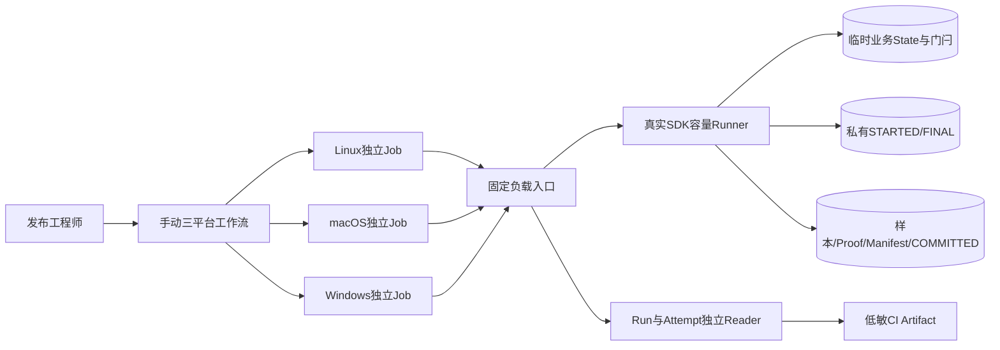
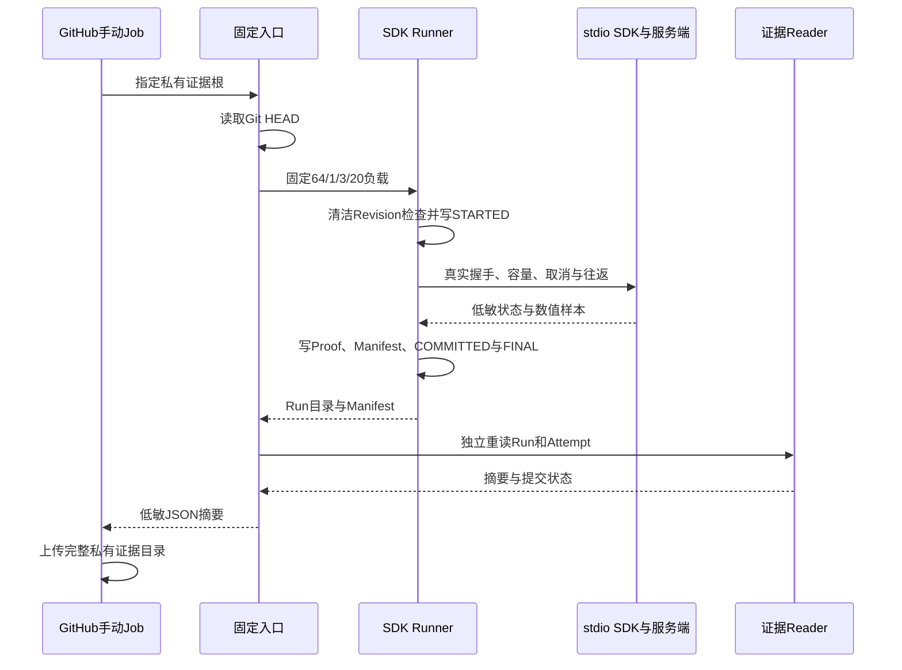

# 0.9.3d SDK容量三平台正式基线采集详细设计

## 1. 需求背景与设计目标

现有[SDK容量Soak](m09-3d-sdk-capacity-soak.md)能够在真实`AgentClient → stdio App Server → Session SQLite`链上验证64个并发请求、取消墓碑、迟到Response与关闭收敛。已有macOS正式规模Run，但Linux和Windows仅运行缩小负载测试；它们不能充当正式容量基线。各平台手工调用Python函数又容易传入不同规模、遗漏Attempt复核或只保存终端统计。

本切片增加**固定参数的发布专用入口**和手动三平台工作流。每个平台在干净提交上执行一次独立正式负载，输出完整Run、Attempt和低敏日志摘要。工作流不会自动选阈值，也不把单次`baseline`变为`PASS`。`action_recovery`、`restart`以及其他Soak场景不属于这个入口；它们仍按0.9.3d总设计单独验收。

完成定义：入口不能降配；正式Runner核验当前Git提交及干净工作树；发布后重读Run和Attempt；失败上传已持久化的Attempt；三平台任务彼此独立，某平台失败不取消另外两平台。下载、归档、工程阈值和第二次独立复验是后续发布门禁，不由一次工作流成功推定。

## 2. 总体架构与数据流程

[`run_sdk_soak_release.run_release`](../../scripts/run_sdk_soak_release.py)只负责编排固定负载和提交事实复核，不创建另一套Agent、SDK或统计内核。它读取Git HEAD，调用[`run_sdk_capacity`](../../scripts/soak_sdk_capacity.py)执行固定64容量、1轮预热、3轮正式轮次和20次正常往返；Runner在任何Attempt前调用`check_release_revision`核验HEAD相等且工作树干净。发布后入口调用[`read_published_run`](../../scripts/soak_evidence.py)重新核对原始样本、SDK Proof、Manifest、提交标记，再调用[`read_attempt`](../../scripts/soak_attempt.py)要求`FINAL/committed`绑定同一Manifest摘要。

业务临时State、门闩和子进程stderr不进入上传目录。上传目录只包含已提交Run或失败Attempt；其中随机Run ID是证据身份，不是用户业务ID。日志仅输出场景、平台、源码Revision、Run ID、Manifest SHA-256和`baseline`状态；错误日志仅输出稳定错误码，不输出异常正文。

## 3. 正常与失败时序

若工作树污染，正式Runner在写STARTED前以`soak_revision_invalid`拒绝；不能把未固定源码的数值标作基线。Runner内部握手、期限、RSS单位、样本或提交失败时返回非零，`attempt_scope`保留`FINAL/failed`；硬退出可能只留下`STARTED`。工作流最后一步使用`always()`上传已有目录，供失败归因，但没有`COMMITTED`与有效`FINAL`的目录不能由Reader判为已完成Run。某个平台失败时矩阵`fail-fast: false`，不会抹掉另外两平台事实。Job整体30分钟上限是外部停止线，不是业务取消或成功保证。

## 4. 接口设计、数据结构与领域契约

| 边界 | 输入/输出 | 不变量与失败语义 |
|---|---|---|
| [`run_release(evidence_root)`](../../scripts/run_sdk_soak_release.py) | `Path →`低敏六字段摘要 | 不接收可缩小负载参数；Run与Attempt身份、Revision、摘要和`baseline`必须一致。 |
| [`main`](../../scripts/run_sdk_soak_release.py) | `--evidence-root`；退出码0/1 | `KernelError`只输出稳定Code；其他异常只输出`internal_error`；不显示异常、路径或stderr正文。 |
| [`sdk-soak.yml`](../../.github/workflows/sdk-soak.yml) | 仅`workflow_dispatch` | 三平台独立Job、锁文件安装、固定Python 3.12、只读仓库权限、无模型凭据、失败仍上传已存在证据。 |
| 证据目录 | `attempts/<run_id>`及`<run_id>` | Attempt在负载前写入；Run最后写提交标记；Reader拒绝缺失、篡改、额外文件或未终结事实。 |

Manifest v4已有`scenario_id=sdk_capacity`、`scenario_version`、`measurement_boundary=sdk_stdio`、`load`、`fault_counts`、`rss`和文件水位；Proof已有四轮匿名容量阶段、双进程RSS和20条往返索引。本切片不修改这些Schema、Agent Protocol或数据库。每个Job使用独立GitHub临时目录，CI Artifact的14日保留期不是长期归档；下载后仍须重新核对规范字节和SHA-256，再决定是否进入版本化验证目录。

## 5. 持久化、事务、可观测性、安全与风险取舍

Run目录与Attempt目录各自排他创建，不共享数据库事务。提交顺序是`STARTED → 业务测量 → samples/sdk-proof/manifest → COMMITTED → FINAL`；`COMMITTED`只证明Run文件内一致，`FINAL`再证明该Run属于同一个已终结Attempt。外部Artifact上传不参与此事务序列，上传失败时本地Run仍可被Reader验证，但发布归档尚未完成。失败日志的稳定错误码是唯一公开诊断字段；私有异常正文、业务临时目录和子进程stderr不进入日志或上传包。上传文件来自私有0700证据根，下载后文件权限可能由归档工具重建，因此内容复核不能依赖ZIP保留POSIX权限。

- 工作流不注入模型API Key，不访问用户Workspace，也不启动独立Action HTTP/Worker。Job仅具有`contents: read`权限；Runner的临时State仅位于托管Runner本机。
- `uv sync --locked --all-extras --dev`使用已锁定依赖；Job不会修改源码Revision。证据上传前已经由本机Reader重算，下载后仍需独立重算，避免把上传回执误认为验证完成。
- 工作流与入口仅是发布工程设施，不是产品安装命令。失败回滚为保留原Run/Attempt并在**新**Git提交或独立新Run ID下重跑；不得覆盖、修补失败证据或降低规模。
- [`test_run_sdk_soak_release.py`](../../tests/benchmarks/test_run_sdk_soak_release.py)验证固定参数、错误与缺失Attempt拒绝、日志脱敏；[`test_soak_sdk_capacity.py`](../../tests/benchmarks/test_soak_sdk_capacity.py)验证真实stdio及64容量阶段，Reader与Attempt回归验证跨文件一致性。Linux/macOS/Windows正式Job运行结果和Artifact SHA在各自验证目录登记前，本切片只能称为**采集通道已实现**。
- 后续必须在三平台分别完成两次独立正式Run，冻结与基线绑定且有工程余量的单平台Profile，再以负载前预绑定的候选Run生成报告；三个单平台PASS也需单独聚合发布门禁。Action恢复、重启场景仍缺正式Runner，0.9.3d与0.9总体保持进行中。

## 6. 部署、兼容与回退

发布工程师在仓库默认分支手动触发[`sdk-soak.yml`](../../.github/workflows/sdk-soak.yml)，不需要新服务、数据库或用户配置。该工作流不参与普通`push` CI，也不改变产品安装包；已有Manifest v1～v4、Agent Protocol、Session Schema和CLI用户命令保持原样。任一平台失败时保留该次Attempt与工作流结果，修复源码后以新提交和新Run ID重新调度；不得覆盖失败上传件或把旧Run重标为通过。需要关闭这条采集通道时，删除手动工作流和发布专用入口即可，历史Run继续由原v4 Reader只读校验。

## 7. 源码与测试映射

| 可核验事实 | 源码入口 | 回归或外部证据 |
|---|---|---|
| 参数固定、日志白名单、两层提交复核 | [`run_sdk_soak_release.py`](../../scripts/run_sdk_soak_release.py) | [`test_run_sdk_soak_release.py`](../../tests/benchmarks/test_run_sdk_soak_release.py) |
| 真实SDK/stdio并发、取消及迟到Response | [`soak_sdk_capacity.py`](../../scripts/soak_sdk_capacity.py)、[`soak_sdk_child.py`](../../scripts/soak_sdk_child.py) | [`test_soak_sdk_capacity.py`](../../tests/benchmarks/test_soak_sdk_capacity.py) |
| 规范Run、Proof、Attempt读取与摘要 | [`soak_evidence.py`](../../scripts/soak_evidence.py)、[`soak_attempt.py`](../../scripts/soak_attempt.py) | [`test_soak_evidence.py`](../../tests/benchmarks/test_soak_evidence.py)、[`test_soak_attempt.py`](../../tests/benchmarks/test_soak_attempt.py) |
| 三平台正式负载及失败上传 | [`sdk-soak.yml`](../../.github/workflows/sdk-soak.yml) | 工作流实际Run ID、各Job结果和下载件SHA；尚待运行登记，不以源码存在替代验收 |
