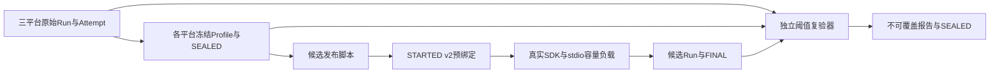
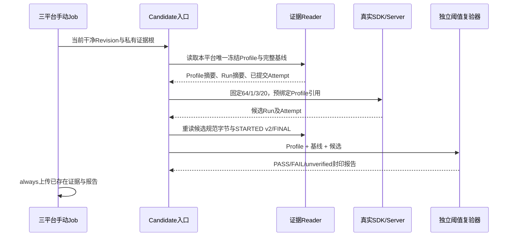

# 0.9.3d SDK容量冻结阈值与第二独立Run详细设计

## 1. 需求背景、源码依据与设计目标

[三平台一次正式规模基线](../validation/soak-sdk-three-platform-2026-09-23-v1/README.md)只能证明固定Revision、固定负载曾经完成，不能证明后续Revision的时延、内存和磁盘增长仍在工程上限内。0.9.3d的发布合同要求**基线 → 预冻结单平台Profile → 负载开始前持久绑定Profile → 第二独立Run → 独立重读和报告**。不得在看到候选结果后修改阈值，也不得把一次基线的`manifest.status=baseline`解释为性能PASS。

源码求证：

| 当前代码 | 已有事实与缺口 |
|---|---|
| [`run_sdk_capacity`](../../scripts/soak_sdk_capacity.py) | 传入`threshold_profile_ref`时强制正式规模，进入`attempt_scope`先写STARTED v2，再运行真实SDK/stdio负载；候选Manifest状态为`unverified`。 |
| [`SoakAttemptStartV2`](../../scripts/soak_attempt.py) | 负载前持久记录Profile ID和摘要；最终Attempt必须与Run的Profile引用相同。 |
| [`publish_profile`和`verify_and_publish`](../../scripts/soak_threshold.py) | Profile绑定完整基线、精确环境/负载/故障计数、分位数及工程余量；报告区分PASS、FAIL与unverified，并最后写不可覆盖封印。 |
| [`run_sdk_soak_release`](../../scripts/run_sdk_soak_release.py)与[`sdk-soak.yml`](../../.github/workflows/sdk-soak.yml) | 已生成三平台各一次正式基线，但尚无预冻结Profile、候选入口或第二Run。 |

设计目标是在Linux、macOS和Windows分别完成此链路，不引入用户可见命令、Action HTTP服务、模型请求或新业务数据库；候选失败也必须保留原始Attempt、Run和独立报告。不同平台的Profile不可互借。三平台每个平台得到一次PASS，仍仅关闭`SDK容量`场景的单平台阈值复验，不替代其余五个Soak场景、真实用户负载或1.0总发布判定。

## 2. 总体架构、数据流与顺序





工作流[`sdk-soak-candidate.yml`](../../.github/workflows/sdk-soak-candidate.yml)仅手动触发，三个Job独立运行、`fail-fast: false`，使用锁定Python 3.12依赖、只读仓库权限和GitHub临时目录；`always()`只上传已经生成的文件。候选入口[`run_sdk_soak_candidate.py`](../../scripts/run_sdk_soak_candidate.py)从运行平台精确找到**唯一**Profile，歧义或缺失立即失败，不按时间戳选择“最新”。基线原件、Profile和设计评审进入仓库后才允许触发候选，保证冻结事实在候选执行前可由Git历史证明。

## 3. 领域契约与工程阈值决策

三份Profile均由原始Run/Attempt通过`publish_profile`生成，并使用自身的`profile.json + SEALED.json`摘要封印；原始Manifest不能手工替换。详细数值、Profile ID和文件见[三平台证据目录](../validation/soak-sdk-three-platform-2026-09-23-v1/README.md)。

| 字段 | 固定规则 | 原因与局限 |
|---|---|---|
| `scenario_id/version` | `sdk_capacity`/v4 | 只比较同一固定容量阶段、取消语义和低敏Proof；场景变更必须新基线。 |
| `platform/hardware_class` | 逐平台绑定原始档位：Linux `c4-m16`、macOS `c3-m7`、Windows `c4-m16` | 托管机档位不同则只能`unverified`，不可跨平台比数值。档位是粗分类，不证明CPU型号完全相同。 |
| `python_min/max` | `3.12.0`～`3.12.99` | 允许同一Python次版本补丁更新，不允许跨minor；具体版本仍写入每次Run。 |
| `load/sample_counts` | 协商64、1预热、3正式轮、20条往返、1条RSS、4次预期取消 | 与第一次Run完全相同；缩小负载不能复验。 |
| `sdk_roundtrip` | 原基线P50/P95/P99逐项上浮100%（10000bp） | 单次20样本的托管机噪声显著；此上限是宽松回归护栏，不是终端用户端到端SLO。若仍超限，保留FAIL并调查，不事后扩阈值。 |
| `rss_peak` | 原基线三个分位数逐项上浮50%（5000bp） | 进程高水位对运行时与托管机变化敏感；同时检出显著保留内存回归。仍不代表父子同时驻留内存之和。 |
| `db/wal/artifact_growth` | 正向增长上浮50%；原基线为0者上限仍为0 | 不允许把无WAL/Artifact增长默许为正；SQLite文件端点不能代表运行期磁盘峰值。 |
| `expected_fault_counts` | 与原Run完全相同；`cancelled=4`，其余0 | 受控取消不是失败；额外EOF、UNKNOWN、孤儿或重复效果均不得PASS。 |

上限严格使用[`_margin_upper`](../../scripts/soak_threshold.py)的整数向上取整公式`ceil(baseline × (10000 + margin_bp) / 10000)`，不得将候选观测反向代入。三平台时延P99上限依次为Linux **3,702,274 ns**、macOS **18,844,334 ns**、Windows **7,655,000 ns**；RSS上限依次为**99,053,568**、**109,092,864**、**97,161,216 bytes**；DB增长上限各为**147,456 bytes**，WAL/Artifact增长上限为0。这些护栏只覆盖本地SDK往返与当前固定任务，不声明商业SLA或大量C端用户容量。

## 4. 接口设计、数据结构、核心伪代码与失败语义

| 接口 | 输入与输出 | 前置条件、失败与恢复 |
|---|---|---|
| `run_candidate(evidence_root, report_root)` | 当前平台唯一Profile和基线、当前Git Revision → 低敏结果摘要 | 基线Reader与Attempt、Profile摘要、固定64负载先核对；任何缺失/歧义在真实负载前拒绝。 |
| `run_sdk_capacity(... threshold_profile_ref)` | 固定64/1/3/20与Profile ID/SHA → v4候选Run | Runner再次检查干净Revision，先写STARTED v2；握手、取消、关闭或证据错误留下失败Attempt，不发布PASS。 |
| `verify_and_publish` | 冻结Profile、完整基线、完整候选 → 封印Report | 独立重读两次Run与Attempt，比较环境/负载/故障、样本分位数与水位；非PASS仍发布报告，Job返回非零。 |
| `main` | `--evidence-root`、`--report-root`；退出0/1/2 | 0仅报告PASS；1为前置或执行错误，仅输出稳定错误码；2为已发布但非PASS，标准输出仅低敏状态与原因。 |

```text
platform = read_environment().platform
profile_dir = require_exactly_one_profile(platform)
profile, profile_sha = read_profile(profile_dir)
baseline, baseline_sha = read_published_run(profile.baseline_run_id)
assert baseline_final.committed and baseline_sha == profile.baseline_manifest_sha256
revision = git_head()
candidate = run_sdk_capacity(fixed_load, threshold_profile_ref=(profile.id, profile_sha))
assert read_published_run(candidate) == candidate
assert candidate_started_v2.profile_ref == candidate.manifest.profile_ref
assert candidate_final.committed
report = verify_and_publish(profile, baseline, candidate)
assert read_report(report.directory) == report
return PASS_only_if_report_PASS
```

Report的`unverified`表示证据损坏、平台/硬件/Python或负载不匹配、Profile引用错配等，不能改记为性能FAIL或PASS。`FAIL`只表示完整可比较证据越过冻结上限。Job中断、Runner硬退出、上传失败、手动重试都不覆盖既有文件；新尝试必须用新Run ID，旧Attempt继续用于诊断。候选Profile在STARTED之前必须已经通过Git提交冻结；发生源码或场景合同不兼容时重新建立基线，而非修改旧Profile。

## 5. 持久化、安全、可观测性与验证

Profile和原始基线位于只读仓库验证目录；候选Run/Attempt、报告位于各Job独立临时根。业务Session/Workspace仅在Runner的`TemporaryDirectory`，不会进入上传件。Profile、样本、证明、报告只含低敏数值和随机Run ID，不包含Prompt、Tool正文、请求帧、路径、Secret或stderr；CLI捕获未分类异常仅输出`internal_error`。Run的`COMMITTED`、Attempt的`FINAL`、Profile/Report的`SEALED`分别代表不同提交边界，三者缺一不得判PASS。

回归测试[`test_run_sdk_soak_candidate.py`](../../tests/benchmarks/test_run_sdk_soak_candidate.py)重读三份冻结Profile并重新执行数学绑定校验，覆盖唯一目录、固定参数、负载前引用及日志脱敏；[`test_soak_threshold.py`](../../tests/benchmarks/test_soak_threshold.py)覆盖跨环境、错负载、阈值超限、缺Attempt和报告篡改；[`test_soak_sdk_capacity.py`](../../tests/benchmarks/test_soak_sdk_capacity.py)覆盖真实stdio容量/取消/迟到Response。发布验收还必须检查三平台手动工作流终态、下载原件SHA与Report Reader重读，不能仅用CI绿色代替真实候选运行。

## 6. 部署、回退、剩余风险与源码映射

本切片只增加发布工程入口和证据，不更改产品协议、数据库、默认CLI或用户部署。回退可停止手动工作流；历史Profile/Run/Report保持可只读复核，不原地删除或改写。GitHub托管机资源档位可能漂移，出现环境不匹配应记录`unverified`后在固定档位重新建基线；不得关闭环境检查。20个往返样本不足以给出终端用户尾延迟置信区间，发布门禁需要叠加其余Soak、Dogfooding与真实任务证据。

| 可核验行为 | 当前源码与测试 |
|---|---|
| 冻结阈值与摘要封印 | [`soak_threshold.py`](../../scripts/soak_threshold.py)、[`test_soak_threshold.py`](../../tests/benchmarks/test_soak_threshold.py) |
| 负载前绑定和真实SDK候选执行 | [`run_sdk_soak_candidate.py`](../../scripts/run_sdk_soak_candidate.py)、[`soak_sdk_capacity.py`](../../scripts/soak_sdk_capacity.py)、[`test_run_sdk_soak_candidate.py`](../../tests/benchmarks/test_run_sdk_soak_candidate.py) |
| 三平台独立Job与失败证据留存 | [`sdk-soak-candidate.yml`](../../.github/workflows/sdk-soak-candidate.yml)；实际运行ID须在验收后登记 |
| 原基线、三份Profile与评审事实 | [验证归档](../validation/soak-sdk-three-platform-2026-09-23-v1/README.md)；候选原件和报告尚待正式运行 |
