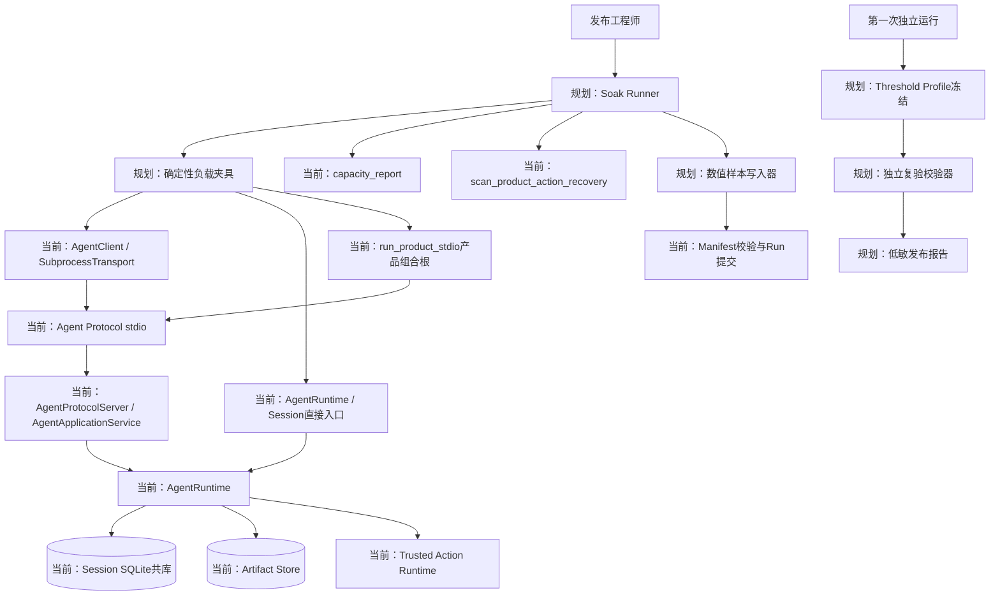
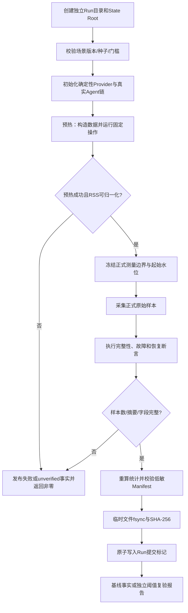
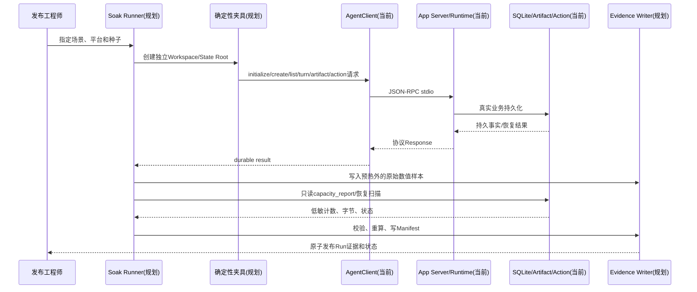
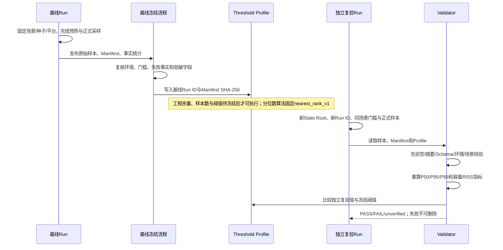
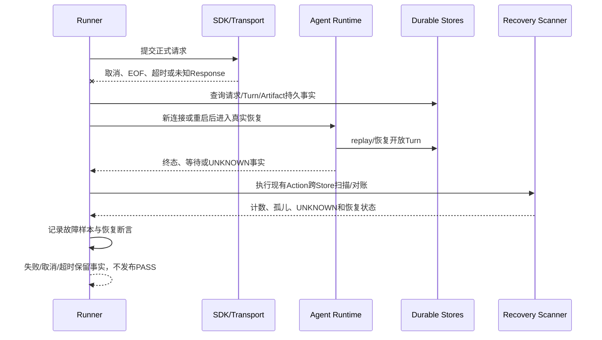
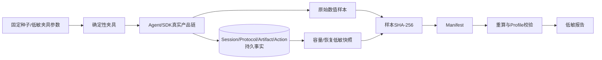
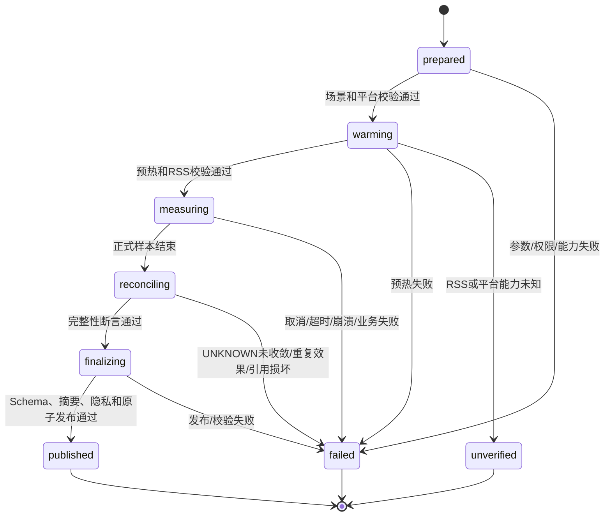
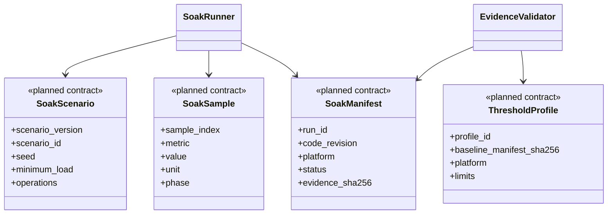

# 0.9.3d Soak与性能证据专项详细设计

## 1. 文档摘要

| 项目 | 内容 |
|---|---|
| 当前能力 | 0.9.3a～c已经提供有界本地传输、Session/Protocol/Artifact容量与维护合同，以及Trusted Action效果恢复；当前Revision已有Soak Provider夹具、严格样本与Manifest合同、二进制字节发布与独立重算、三平台RSS读取及低敏硬件环境采集。`long_session`真实Agent Runtime场景Runner已实现，缩小负载只发布`unverified`；其他五个场景、Threshold Profile、三平台正式负载和发布阈值证据仍未完成。 |
| 本文设计状态 | `reviewing`；目标设计，不表示Soak已经运行、阈值已经冻结或发布门禁已经通过。 |
| 代码版本 | `1f5df16cc3ccd29914d6496118acaeff94caa868` |
| 影响模块 | Agent Runtime、App Server、SDK、Session共库、Artifact、Trusted Action、Product Config、发布证据与文档治理。 |
| 关键ADR | [ADR-0092](../adr/0092-reproducible-local-soak-and-release-thresholds.md)；传输、容量维护和效果恢复分别见[ADR-0089](../adr/0089-bounded-local-transport-lifecycle.md)、[ADR-0090](../adr/0090-plan-first-store-maintenance-and-backup.md)、[ADR-0091](../adr/0091-action-runtime-fencing-and-bounded-reconciliation.md)。 |
| 关键测试/证据 | 现有运行时、SDK、维护、Action恢复和Artifact恢复测试；0.9.3d正式证据仍待三平台正式负载和独立复验生成。 |

本文只设计0.9.3d的真实产品链Soak、低敏数值证据和发布阈值复验，不重新决定0.9.3a～c的协议、持久化、恢复或Action语义。当前事实和研究依据见[0.9.3总体设计](m09-3-reliability-and-performance.md)第9节及[可靠性专项源码研究](../research/reliability-and-performance.md)第10节。

## 2. 需求背景

0.9.3a～c的局部故障和容量测试不能证明以下组合压力下仍具有可接受的启动、列表、读取、恢复和内存表现：

- 单个Thread持续至少1000个本地确定性Turn，包含Replay、Context检查和Compaction相关事件；
- 至少500个Thread的列表分页、启动恢复和全量一致性检查；
- SDK在协商Pending上限附近并行提交、取消以及迟到Response收敛；
- Artifact小件与接近单件上限数据的发布、分页读取、过期清理和引用完整性；
- Trusted Action的固定故障矩阵，包括效果未知、Owner失效、Audit或Process边界故障，以及重启后扫描/对账；
- 增长前后的冷启动、热启动和重复重启。

[ADR-0092](../adr/0092-reproducible-local-soak-and-release-thresholds.md)明确要求：负载必须调用当前Agent/SDK/Store/Trusted Action真实入口；第一次运行只冻结事实基线；阈值必须来自独立、带来源摘要的Profile，并由后续独立运行验证。因而本文不把单次P95、人工观察或从结果反推的门槛写成发布结论。

本Revision中的以下源码路径是被测的当前入口或当前容量事实：`AgentRuntime.__aenter__`启动时读取Thread并恢复活动Turn；`AgentApplicationService.list_threads`先枚举并读取Thread再分页；`capacity_report`重算三类Store水位；`scan_product_action_recovery`执行跨Store低敏完整性扫描。0.9.3d已实现Soak Provider、样本读写/统计、Manifest合同、Run提交标记、RSS适配器及`long_session`真实Runtime场景Runner；其余场景Runner、阈值Profile和发布阈值校验器仍待实现。macOS RSS单位已在本机子进程探针验证，Linux/Windows适配须由各自CI真实运行确认。

源码与预研还确认：[`ScriptedProvider.stream`](../../src/harnessix/models/scripted.py)每次接收完整`ModelRequest`时，会将深拷贝追加到`self.requests`。因此它适合失败/恢复测试，不适合作为正式长会话内存基线；`self.requests`会保留Prompt及请求历史，使RSS随请求数量增长而混入Provider夹具开销。一次临时200 Turn试跑的末次时延和RSS观测如下，仅用于识别污染源，不属于正式Soak、基线或阈值证据：

| Turn位置 | 末次时延 | RSS约值 | 证据属性 |
|---:|---:|---:|---|
| 50 | 0.076 s | 约60 MB | 预研观测；受`ScriptedProvider.requests`保留影响。 |
| 100 | 0.132 s | 约73 MB | 预研观测；不可用于产品内存基线。 |
| 150 | 0.221 s | 约91 MB | 预研观测；不可用于性能阈值。 |
| 200 | 0.287 s | 约116 MB | 预研观测；不得外推至1000 Turn。 |

0.9.3d正式长会话必须使用不保留`ModelRequest`/Prompt正文的确定性无状态Provider：仅保存固定脚本所需的状态和请求计数，不能保存请求对象、历史正文或`requests`列表；它只替换模型响应，不另造Agent Runtime，也不绕过现有Agent/SDK/Store/Action主链。上述200 Turn试跑不能填充正式Manifest的`baseline_run_id`、统计值或Threshold Profile。

## 3. 设计目标与非目标

### 3.1 目标

1. 建立版本固定为`harnessix.soak-scenario/v1`的独立手动/发布专用负载入口，复用当前Agent、SDK、Session、Artifact和Trusted Action真实产品主链。
2. 固定至少1000 Turn、至少500 Thread、SDK/Artifact/Action/重启场景，并明确每个场景的输入规模、测量边界、故障计数和完整性断言。
3. 将原始数值样本、运行Manifest和Threshold Profile分成三个可校验版本化对象；样本可重算，Manifest不携带敏感正文，Profile不能自证通过。
4. 将预热、正式采样、失败事实、原子发布和独立复验拆开；任何缺样本、未知字段、摘要不符、非有限数值、RSS无法归一化或运行中断均不得产生`PASS`。
5. 统一时延、RSS、数据库/WAL/Artifact字节、逻辑计数和故障计数的单位，并记录平台原始RSS来源、原始单位和归一化过程。
6. 在Linux、macOS、Windows上分别形成可比较但不跨平台套用的证据；平台缺测只能为`unverified`，不能填零。
7. 保留现有完整性扫描、审批、UNKNOWN不重放、Artifact原子发布和恢复语义，不因性能测量跳过检查或减少扫描对象。

### 3.2 非目标

1. 不在0.9.3d新增Action HTTP/Worker、远程数据库、云端Benchmark平台、性能控制面服务或公共CLI/SDK协议。
2. 不把确定性Provider替身的表现当作真实Provider质量、模型质量或网络服务SLO；真实Provider不是本地性能基线前提。
3. 不在没有实测证据前重构全量扫描、分页、增量恢复或SQLite后端；性能超阈值后的实现优化另立设计并复跑0.9.3c回归。
4. 不为取得通过结果扩大超时、降低1000 Turn/500 Thread门槛、减少Artifact/Action检查、删除失败运行或把未知状态改写为成功。
5. 不公开Prompt、代码、Workspace绝对路径、用户名、业务ID、Request/Thread/Action ID、Secret、Tool正文、stderr或原始异常。
6. 不把本机一次RSS读数或Apple旧版手册中的单位未经运行时验证直接套用于三平台。

## 4. 约束、假设与术语

| 项目 | 定义 | 影响 |
|---|---|---|
| `scenario_version` | 固定为`harnessix.soak-scenario/v1` | 场景字段、负载门槛、故障身份和校验规则变更必须升版本。 |
| 正式负载 | 进入正式采样前完成的场景构造和预热不计入正式数值样本 | 预热失败直接失败关闭；不能把预热样本混入P50/P95/P99。 |
| Turn门槛 | 长会话场景单一Thread连续不少于1000个本地确定性Turn或等价事件量 | `turn_count < 1000`不可判定场景完成。 |
| Thread门槛 | 多Thread场景不少于500个Thread | `thread_count < 500`不可判定场景完成；不得以较小数量代替。 |
| 确定性Provider | 不需要网络或模型API Key、输出序列由种子固定且不保留`ModelRequest`/Prompt正文的无状态测试替身 | 仅保存必要脚本状态和请求计数；替身只替换模型响应，不替换Agent/Store/SDK/Action产品链，也不另造Agent Runtime。 |
| 独立运行 | 独立State Root、临时Workspace、独立Run ID和未被阈值选择使用的运行 | 基线运行不能同时作为阈值验证运行。 |
| 正式样本 | 预热完成后、在固定测量边界内采集的原始数值 | 原始样本不可只保存分位数后丢弃。 |
| RSS | 进程最大常驻集或平台等价峰值工作集；源、raw单位和归一化必须记录 | 平台适配未知、读数失败或单位验证失败时状态为`unverified`，不得写0。 |
| 当前/规划 | “当前”只描述Revision中已存在的源码和测试；“规划”表示本文目标，不表示代码已实现 | 规划组件、命令和证据不能写成当前可用能力。 |
| 待基线冻结 | ADR未给出具体样本数、分位数插值规则、工程余量或平台硬件档位时的明确占位 | 在独立基线完成并评审前，校验器不得自行猜测默认值。 |

## 5. 总体架构



### 5.1 图示说明

- `Operator`只触发发布专用运行；Runner创建临时Workspace、独立State Root和不保留请求历史的确定性无状态Provider，不能接管用户Workspace或绕过Policy。
- SDK容量场景通过当前`AgentClient`和`SubprocessAgentTransport`发起真实协议请求，再经`AgentProtocolServer`和`AgentApplicationService`进入`AgentRuntime`；长会话场景则直接调用当前`AgentRuntime`和Session端口，以隔离SDK/stdio开销。两条路径都不模拟Agent状态机。
- 产品启动场景调用当前`run_product_stdio`组合根，并使用临时配置和测试凭据在**不发起模型请求**的条件下验证Preflight、Action恢复扫描和关闭；长会话的无状态Provider夹具不冒充默认产品Provider装配。若需测量完整产品Turn，必须另行建立受控本地Provider端点并标记与纯内核运行不同的场景版本，不能把直接Runtime结果命名为默认产品端到端指标。
- AgentRuntime按当前实现写入Session事件/投影、Artifact正文/引用和Trusted Action效果事实。Runner只调用只读容量/恢复诊断端口，不成为结果权威。
- `Samples`只接受测量边界内的低敏数值；`Manifest`引用样本文件摘要、环境摘要、场景身份、计数和状态；发布器排他创建唯一Run目录，最后原子写入提交标记，读者只接受标记与Manifest摘要一致的Run。
- 第一次运行只生成事实基线。经人工/评审冻结的Profile引用基线摘要；独立复验器重新读取原始样本并重算分位数后，才比较阈值并生成报告。

### 5.2 变更前后边界

| 边界 | 当前Revision事实 | 0.9.3d规划变化 |
|---|---|---|
| Agent/SDK/Protocol | SDK、stdio、App Server和Agent Runtime已有真实入口及有界传输 | 仅增加发布专用调用编排，不改公共Protocol/SDK方法。 |
| Session/Artifact容量 | `capacity_report`和维护合同输出低敏容量/时间/字节水位 | Runner在固定时点采集快照；不增加第二个数据库或改写业务事实。 |
| Action恢复 | `scan_product_action_recovery`核对Route、Session引用、Artifact引用和Process孤儿 | 故障场景调用现有扫描/对账，不能由Runner直接执行Action效果。 |
| 证据对象 | 样本、Manifest、Run提交标记和`long_session`缩小运行已实现；Threshold Profile及正式三平台证据未实现 | 其余场景和独立Profile/报告；字段见第12节。 |
| 发布门禁 | 当前没有0.9.3d阈值结论 | 独立复验后只产生`PASS`、`FAIL`或`unverified`，缺失时失败关闭。 |

## 6. 模块职责与依赖

| 模块 | 职责 | 允许依赖 | 禁止依赖 | 生命周期 |
|---|---|---|---|---|
| Soak Runner（长会话部分实现） | `long_session`已创建临时Session、预热与正式Turn、Replay核验和Run发布；其余场景及失败证据保留仍待实现 | 各场景对应的AgentRuntime、AgentClient或`run_product_stdio`现有入口；确定性Provider；只读容量/恢复端口、样本写入器 | 用户Workspace、外部Provider、业务结果重写、绕过Action审批直接执行外部效果 | 一个Run独占；现有长会话失败不发布Run，尚未满足失败事实留存要求。 |
| Deterministic Fixture（部分实现） | 已有不保留`ModelRequest`/Prompt正文、只记请求计数的`SoakProvider`；固定种子Workspace、Thread、Turn、Artifact和故障编排仍待实现 | 当前产品公开/内部测试入口、固定Policy | 任意用户数据、网络Git、公网凭据、真实模型、请求历史列表 | 每个Run独立创建和销毁；Provider只保留请求计数。 |
| AgentClient / SubprocessTransport（当前） | 传输初始化、请求并发、取消、迟到Response、关闭和快照 | Agent Protocol | 自动重连、业务重试、绕过服务 | 每次正式运行按既有SDK生命周期打开/关闭。 |
| AgentProtocolServer / AgentApplicationService（当前） | Protocol方法校验、请求幂等、Thread列表分页、Turn驱动 | Session Store、AgentRuntime、Artifact/Action端口 | 性能报告逻辑、阈值选择 | 由App Server进程拥有。 |
| AgentRuntime（当前） | Turn执行、事件持久化、Replay、Context/Compaction、Action恢复 | Session、Provider、Tool/Action、Artifact | Runner专用捷径、跳过持久事实 | 以`async with`打开/关闭；启动恢复现有开放Turn。 |
| Capacity/Recovery Adapter（当前） | 提供低敏容量报告和Action跨Store恢复扫描 | SQLite共库、Action/Artifact/Session端口 | 返回业务ID、正文、路径 | 只读诊断调用；恢复扫描保持现有语义。 |
| Evidence Writer/Validator（部分实现） | 当前已对样本与Manifest执行严格Schema、SHA-256、最后提交标记及独立重算；Profile与发布阈值验证仍待实现 | 私有文件目录、标准时钟；RSS平台探针待实现 | 自报PASS、未知字段、覆盖既有Run、读取敏感正文 | 一个Run单Writer；读取必须验证提交标记和原始样本。 |
| RSS Adapter（规划） | 读取平台峰值RSS/工作集，记录raw单位并归一化为bytes | Linux/macOS/Windows原生测量接口 | 以0替代未知、跨平台套用未验证单位 | 贯穿Run；至少在预热后和每个正式样本边界采集。 |

## 7. 核心流程

### 7.1 正常流程图



步骤约束如下：

1. Runner生成不含用户身份的Run ID，建立独立State Root和临时Workspace；目录名称只使用Run ID和固定场景标识，不把绝对路径写入证据。每个场景在Manifest中固定`measurement_boundary`，不同边界的时延不可互相比较。
2. Runner校验`scenario_version`、场景门槛、固定种子、平台能力和RSS适配状态。`turn_count`必须至少1000，`thread_count`必须至少500（对应场景才要求），不得以缺测或零值满足门槛。
3. 预热调用真实产品主链，完成数据库初始化、Thread/Artifact构造、SDK握手和固定操作。预热样本只用于发现环境/夹具故障，不能进入正式统计。
4. 正式采样记录原始数值和固定的测量边界；每个样本都带场景、阶段、指标、单位和序号。持久水位在规定前后点通过当前`capacity_report`采集。
5. 故障场景只注入已定义的受控点。发生超时、进程退出、连接断裂或效果未知时，按照当前恢复语义查询持久事实并执行扫描/对账，不把异常路径直接改写为成功。
6. 正式采样结束后先校验原始样本、样本数量、重复/缺失序号、有限性、证据摘要和隐私白名单，再计算统计量。计算出的P50/P95/P99只属于本次事实报告，不取代原始样本。
7. 使用排他`mkdir`创建唯一Run目录；样本和Manifest均先写同目录临时文件、校验摘要、`fsync`后原子替换到固定文件名。最后写包含Manifest SHA-256的提交标记并原子替换。Validator仅接受标记、Manifest和样本摘要全部一致的Run；标记之前的任意失败只能留下未提交目录，不得判PASS。既有Run目录拒绝覆盖。

### 7.2 正常时序图



请求链为同步调用；SQLite提交、Artifact引用和Action审计事实在业务端完成后才构成可采样的持久结果。容量/恢复诊断是只读或现有恢复调用，不得替代业务结果。证据写入在业务运行之外，不得让证据失败回滚已提交的Agent事实；但证据缺失时发布门禁必须失败关闭。

### 7.3 预热与正式采样边界

| 阶段 | 操作 | 计入样本 | 必须成功的条件 |
|---|---|---:|---|
| Prepare | 校验Revision、平台、场景、种子、独立目录和RSS能力 | 否 | 能力未知或目录非独立即失败。 |
| Warmup | 初始化SDK/App Server，创建夹具数据，执行固定操作和首轮恢复 | 否 | 真实产品链可用；故障注入仅在场景明确要求时发生。 |
| Stabilize | 等待所有预定任务结束，采集基线容量/RSS和后台任务计数 | 否 | 无未收敛的非预期任务；RSS源和raw单位已确认。 |
| Measure | 按固定顺序执行正式操作，按边界记录原始样本和水位 | 是 | 每个必需指标样本完整、数值有限、单位正确。 |
| Reconcile | 执行Replay、引用校验、UNKNOWN/重复效果、孤儿和重启后恢复断言 | 仅计故障计数 | 所有完整性断言通过；失败运行仍须保留失败事实。 |
| Finalize | 重算统计、写Manifest、校验摘要、原子发布 | 否 | 无未知字段、无摘要冲突、无隐私泄漏。 |

预热次数、正式样本次数和每个指标的样本数由独立Threshold Profile或首轮基线前的发布配置冻结；分位数算法固定为`nearest_rank_v1`，现有样本统计实现已求证。数量和工程余量仍标记为“待基线冻结”，禁止实现者臆造默认值。无论冻结为何值，正式样本必须大于0，且实际长度必须与Manifest/Profile合同一致。

### 7.4 独立基线与复验时序



基线Run只回答“本Revision、该平台和该固定环境的事实是什么”，不回答“是否达标”。Threshold Profile必须引用基线运行的Manifest摘要和场景/平台身份；不能从复验结果倒推阈值。复验使用不同Run ID、独立State Root和未参与阈值选择的样本。没有相同平台/硬件档位的Profile时，结果为`unverified`而不是跨平台套用。

### 7.5 失败与恢复时序图



- SDK取消只表示调用方停止等待；不能推断服务端未提交。Runner重新连接后查询持久事实；不得静默重发可能已经被接受的业务请求。
- `AgentRuntime.__aenter__`按现有逻辑初始化Store、遍历Thread并恢复开放Turn；接受但尚未驱动的deferred Turn、等待输入和UNKNOWN按现有状态处理，不由Runner强制成功或自动重放外部效果。
- Action效果未知、Owner失效、Audit/Process故障进入当前UNKNOWN/对账语义；恢复扫描不调用Execute。重复效果计数非零、未知状态未收敛或跨Store引用不一致时，运行不能PASS。
- Artifact发布按当前Body/Reference事务语义校验完整性；读取/清理失败不得删除正文或伪造水位。
- Runner自身取消、超时、崩溃或校验异常保留可得到的失败Manifest/运行记录并返回非零；若无法安全完成Manifest，保留不可判PASS的失败标记或临时目录，不覆盖任何既有运行。

## 8. 数据流



| 数据类别 | 来源 | 信任级别 | 持久化位置 | 保留/发布 | 脱敏规则 |
|---|---|---|---|---|---|
| 场景参数 | 固定Scenario/Profile | 配置输入 | Run Manifest | 与Run同生命周期 | 只保留版本、种子和数值负载；不保留Prompt/代码。 |
| Agent业务事实 | 当前Runtime/Store | 权威事实 | 临时State Root | 场景结束后按夹具策略销毁 | 业务事实不复制到公开证据。 |
| 性能样本 | Runner测量边界 | 原始观测 | `samples`文件 | 作为可重算证据保留 | 只保留指标、值、单位、序号和场景身份。 |
| 容量/恢复快照 | 当前诊断端口 | 业务只读观测 | Manifest/低敏报告 | 与Run同生命周期 | 只保留计数、字节、状态分类和摘要。 |
| Manifest | Writer根据白名单构造 | 可验证索引 | Run发布目录 | 不覆盖、不可变 | 禁止绝对路径、用户、ID、正文、Secret、stderr。 |
| Threshold Profile | 独立基线冻结 | 发布配置 | Profile目录/版本库 | 版本化保留 | 只保留基线摘要、阈值和平台档位；无自由文本。 |
| 错误事实 | Runner状态和计数 | 低敏运行事实 | 失败Manifest/报告 | 不选择性删除 | 仅使用稳定错误分类和计数，不写异常原文。 |

## 9. 状态机



| 当前状态 | 事件/条件 | 下一状态 | 写入者 | 持久事实 | 非法转换处理 |
|---|---|---|---|---|---|
| `prepared` | 参数、Revision、平台能力和独立目录通过 | `warming` | Runner | Run初始化事实 | 拒绝启动；不可补零。 |
| `warming` | 预热和RSS源/单位验证通过 | `measuring` | Runner | 预热计数和起始水位 | 预热失败为`failed`；RSS未知为`unverified`。 |
| `measuring` | 固定正式样本完成 | `reconciling` | Runner | 原始样本、故障计数和结束水位 | 缺样本、取消、超时或崩溃为`failed`。 |
| `reconciling` | Replay、容量、Artifact和Action断言通过 | `finalizing` | Runner/现有恢复端口 | 低敏恢复计数和断言结果 | UNKNOWN、重复效果或孤儿异常为`failed`。 |
| `finalizing` | Schema、摘要、隐私和Profile引用有效 | `published` | Writer/Validator | 不可变Run目录 | 任何未知字段/摘要不符/覆盖冲突为`failed`。 |
| `published` | 基线或复验报告已原子发布 | 终态 | Writer/Validator | 原始样本、Manifest、报告 | 不允许再次写入或覆盖；新运行使用新Run ID。 |
| `unverified` | RSS、平台或阈值证据不可验证 | 终态 | Runner/Validator | 失败关闭事实 | 不得转为`PASS`；需新Run或补充同平台证据。 |

`PASS`不是Runner业务状态，而是独立Validator针对已发布Run和冻结Profile产生的报告结果。状态值、字段和摘要均采用严格白名单；未知状态不能降级成`failed`后伪造可发布结果。

## 10. 类与组件设计



| 类/组件 | 职责 | 状态所有权 | 线程/进程安全 | 直接依赖 | 扩展点 |
|---|---|---|---|---|---|
| `SoakRunner`（长会话部分实现） | `run_long_session`编排Prepare/Warmup/Measure/Replay/Publish；其余场景待实现 | Runner拥有临时运行状态；业务状态仍由当前Runtime/Store拥有 | 一个Run单写；并发操作必须走SDK/Protocol既有容量 | `AgentRuntime`、`SoakProvider`、RSS适配器、Writer | 场景注册表；不扩展公共协议。 |
| `SoakSample`（合同与文件发布已实现） | 表达一条原始数值观测并校验指标、单位、时钟和RSS归一化 | 当前由测试/长会话Runner构造 | 合同不可变；Run内序号由`validate_sample_series`验证 | 测量时钟、RSS Adapter | 新指标必须增加白名单和Profile版本规则。 |
| `SoakManifest`（合同与文件发布已实现） | 索引环境、负载、状态、摘要和故障事实，并限制场景边界与基线门槛 | 目前由测试/长会话Runner构造；其余场景Finalizer待实现 | 严格模型、文件写入、最后提交标记和独立重读已实现 | 样本文件、平台适配器 | 新字段必须版本化；未知字段拒绝。 |
| `ThresholdProfile`（规划） | 引用独立基线并定义平台/场景阈值 | Profile发布流程拥有 | 只读不可变 | 基线Manifest摘要、统计规则 | 新平台/指标使用新Profile版本，不跨平台复用。 |
| `EvidenceValidator`（规划） | 校验Schema/摘要/环境/样本并重算统计 | Validator拥有报告状态 | 只读输入；无业务写权限 | 样本、Manifest、Profile | 增加统计指标必须保留旧字段兼容规则。 |
| `read_peak_rss`（已实现，平台验收进行中） | 读取raw峰值RSS并归一化为bytes | Adapter不拥有业务状态 | 只读进程指标；macOS首次读取前由受控子进程探针判单位 | Linux/macOS的`getrusage`与Windows的`GetProcessMemoryInfo` | 平台API、raw单位和归一化规则必须与样本及Manifest一致。 |

## 11. 接口设计

以下是0.9.3d内部/证据接口；已实现的样本与Run提交方法仅属于开发/发布脚本，不属于公共CLI/SDK产品协议。

| 接口/方法 | 调用者 | 输入/输出 | 前置/后置条件 | 错误与重试 | 取消/超时 | 幂等/顺序 | 权限 |
|---|---|---|---|---|---|---|---|
| `run_long_session(evidence_root, code_revision, turn_count, warmup_count, seed, turn_timeout_seconds)`（当前） | 发布专用脚本/缩小CI回归 | 输入固定负载和显式Revision；输出已发布Run目录及Manifest | 单次临时State Root、真实Agent Runtime和无状态Provider；`>=1000` Turn的基线运行须Git HEAD匹配且工作树干净 | 参数、Revision、Runtime、RSS、Replay或发布失败抛稳定错误；不发布PASS | 每Turn用`asyncio.timeout`；超时使运行失败且不发布部分Run；失败事实持久化待补 | Run ID新建、样本全局序号连续；失败重试必须新Run | 只访问临时Session与证据根；不接收用户Workspace/凭据。 |
| `SoakRunner.run(scenario, seed, environment)`（其余场景规划） | 发布运行器 | 输入固定Scenario/seed/平台档位；输出已发布Run状态 | 独立State Root、Revision和RSS能力通过；完成后只产生不可变Run | 参数/Schema/平台/业务失败均非零；重试必须新Run ID，不覆盖失败事实 | 取消/超时须保留失败事实；不得把已接受请求直接重发 | 一个Run只允许单一Writer；样本序号严格递增 | 发布工程角色；不得访问用户凭据/Workspace。 |
| `EvidenceWriter.append(sample)`（规划） | Runner | `SoakSample`；无业务正文 | `phase=measuring`且单位/值合法 | 非有限值、负数、未知指标立即失败 | 写入失败不回滚业务事实；Run不能PASS | `sample_index`不重复；文件追加后不可改 | 仅Run临时目录写权限。 |
| `publish_run(evidence_root, manifest, samples)`（当前） | 发布脚本/未来Runner | 严格Manifest与样本；输出Run目录和Manifest摘要 | 创建0700私有根与排他Run目录，重算样本摘要/统计/RSS后写Manifest和提交标记 | 目标冲突或写入失败均非零；失败目录保留，重试新Run ID | 提交标记前中断不能留下可读Run | 同一Run单Writer；最后写标记 | 只允许发布根目录。 |
| `read_published_run(run_directory)`（当前） | 发布校验器/未来Profile验证器 | 只读Run目录；输出严格Manifest和其SHA-256 | 文件集合、标记、Manifest、样本和统计全部校验 | 任一缺失/篡改为稳定`soak_run_invalid` | 读取失败不产生PASS | 同一字节输入结果确定 | 只读证据。 |
| `EvidenceValidator.validate(run, profile)`（规划） | 发布门禁 | 已发布Run和同平台Profile；输出`PASS`/`FAIL`/`unverified`报告 | 先校验原始样本和摘要，再重算，最后比较阈值 | 任一缺失/篡改/环境错配/未知字段失败关闭 | 取消不产生PASS | 同一输入摘要结果确定；报告不可覆盖 | 只读证据与Profile。 |
| `read_peak_rss()`（当前） | 长会话Runner/未来其他Runner | 无业务输入；输出`RssObservation` | 当前平台、RSS源和raw单位经过验证；macOS首次调用触发隔离子进程的单位探针 | API缺失、读数异常、单位未知抛稳定错误；不得返回0替代 | macOS探针有15秒上限；采样本身由调用方设置边界 | 同一采样边界最多一个平台读数 | 只读当前进程指标。 |
| `capacity_report(database, path)`（当前） | Runner/维护端口 | 当前SQLite连接和路径；输出三类低敏容量报告 | 同一读事务内校验投影、事件、请求和Artifact字段 | 数据损坏抛出稳定KernelError；不吞错 | 只读；不改变业务结果 | 由当前实现负责三类固定顺序 | Runtime Owner/维护权限。 |
| `scan_product_action_recovery(...)`（当前） | Action启动/Soak故障场景 | Plan、Audit、Session、Artifact、Supervisor、Fence；输出低敏扫描报告 | 不重放Action效果 | Store损坏或Fence错误失败关闭 | 扫描有界但当前实现的集合路径须完整核验 | 不执行Execute；重复扫描不新增效果 | Product Action Owner。 |

### 11.1 固定场景合同

| `scenario_id` | v1最低输入与固定操作 | 正式样本/断言 | 当前实现状态 |
|---|---|---|---|
| `long_session` | 一个Thread至少1000个本地确定性Turn；固定包含Replay、Context检查，并覆盖Compaction相关事件（若夹具满足现有配置）；Provider必须不保留请求历史，仅保留请求计数 | Turn本地边界、RSS、Replay一致性、Context/Compaction状态、DB/WAL水位；`replay(events) == projection`；报告Provider请求计数而不报告请求正文 | 已实现真实Runtime连续Turn、Replay、DB/WAL水位、RSS和Run发布；缩小负载标记`unverified`。尚未证明正式1000 Turn、Context/Compaction断言、启动时延及失败事实保留。 |
| `many_threads` | 至少500个Thread；按稳定游标请求列表直到遍历完成，随后冷/热启动恢复 | 启动P50/P95/P99、列表页时延、页数、Thread总量、RSS、恢复扫描计数；不能只测首屏 | `list_threads`和Runtime启动路径当前存在；低效路径是待实测风险。 |
| `sdk_capacity` | 以当前协商`max_pending_requests`为上限，在上限附近提交并取消请求；实际协商值写入Manifest | Pending/Abandoned峰值、迟到Response、吞吐、错误分类、连接关闭收敛；不得业务重试 | SubprocessTransport当前默认64、允许范围1～1024；Soak编排未实现。 |
| `artifact_growth` | 小Artifact与接近当前`MAX_ARTIFACT_BYTES = 1 MiB`单件限制的混合发布；使用当前分页上限和清理计划 | 发布/读取分页P50/P95/P99、正文/Manifest/DB/WAL字节、清理前后水位、孤儿数；不改变现有Artifact限制 | Artifact合同和容量/维护路径当前存在；正式混合负载未实现。 |
| `action_recovery` | 固定故障矩阵循环：Owner/Fence失效、效果写入/返回边界、Audit/Process边界、Artifact引用窗口 | UNKNOWN、重复效果、孤儿、恢复/对账耗时和终态；不调用Execute进行恢复 | Action路由、恢复扫描和测试当前存在；固定Soak矩阵未实现。 |
| `restart` | 增长前后执行多次冷启动和热启动；每次均使用独立Transport/Runtime生命周期 | 初始化、恢复扫描、Replay、未决Turn/Action状态、RSS；重启后不得重复外部效果 | Runtime和SDK关闭/启动路径当前存在；正式重启编排未实现。 |

以上最低输入是硬门槛；Threshold Profile可以在不改变场景最低输入的前提下要求更高负载，但不能降低1000 Turn或500 Thread。`5000 Thread`等更高规模若被纳入后续Profile，必须作为显式新负载值记录，不能把其结果冒充v1最低场景。

v1测量边界固定为：`long_session → core_runtime`、`many_threads → app_service`、`sdk_capacity → sdk_stdio`、
`artifact_growth → artifact_store`、`action_recovery → product_action`、`restart → product_startup`。其中
`product_startup`必须调用`run_product_stdio`；`core_runtime`只表示Agent与Session内核，不等价于完整产品启动。

### 11.2 `long_session`当前执行链与未闭环项

实现入口为[`run_long_session`](../../scripts/soak_long_session.py)，对应回归为[`test_soak_long_session.py`](../../tests/benchmarks/test_soak_long_session.py)。此函数仅是发布/测试脚本，不是用户产品命令。它先检查负载与Revision格式；当`turn_count >= 1000`时，额外核对当前Git HEAD和干净工作树。随后读取[`SoakEnvironment`](../../scripts/soak_environment.py)并创建一次性临时State Root；[`SQLiteSessionStore`](../../src/harnessix/session/sqlite.py)和[`AgentRuntime`](../../src/harnessix/agent/runtime.py)组成实际被测链，模型端仅替换成不保留请求的[`SoakProvider`](../../scripts/soak_provider.py)。

```text
校验负载/正式Revision → 采集平台档位 → 创建临时Session
→ 打开AgentRuntime → 创建Thread → 预热Turn → 正式Turn
→ 逐Turn monotonic_ns采样 → Store投影/事件Replay/Provider计数核验
→ 采集DB/WAL字节和进程峰值RSS → 构造严格Manifest
→ publish_run排他提交 → read_published_run从磁盘重算
```

每个Turn使用独立`request_id`和30秒默认操作期限；完成状态不是`COMPLETED`或发生超时，均抛出稳定`KernelError`，不会写出带提交标记的半成品Run。预热样本保留在JSONL但不进入正式分位数，正式样本计数必须等于输入`turn_count`。文件水位取Runtime打开之后、Thread创建之前，以及全部Turn完成且Runtime关闭之前的DB/WAL文件大小；这是同一进程的区间端点值，**不是**期间最大值。RSS是Runner进程高水位，非Thread独占内存。证据不存Prompt、响应正文、Workspace路径或业务身份；临时Session退出后删除。缩小测试用3个正式Turn、2个预热Turn验证整个提交/重读链，产物状态只能是`unverified`。

本实现并不等于正式0.9.3d验收：1000 Turn真实运行、Context/Compaction断言、失败运行的低敏持久事实、全局运行期限、独立阈值Profile/报告和另外五个场景仍待完成。当前失败会清理临时Session并抛错，但不会保留失败Manifest；此限制须在正式发布入口启用前补齐。`baseline`也仅表示输入达到规模且Revision已核对，不表示已通过发布阈值。

## 12. 数据结构与重点字段

### 12.1 `SoakScenario`（`harnessix.soak-scenario/v1`，规划）

| 字段 | 类型 | 必填 | 来源 | 语义/约束 | 默认值 | 敏感级别 | 持久化 | 兼容规则 |
|---|---|---:|---|---|---|---|---|---|
| `spec_version` | 固定字符串 | 是 | Runner | 必须为`harnessix.soak-scenario/v1` | 无 | 低 | Manifest | 变更升版本。 |
| `scenario_id` | 固定枚举 | 是 | 配置 | `long_session`/`many_threads`/`sdk_capacity`/`artifact_growth`/`action_recovery`/`restart` | 无 | 低 | Manifest | 新场景不得复用旧身份。 |
| `measurement_boundary` | 固定枚举 | 是 | 场景注册表 | `core_runtime`、`app_service`、`sdk_stdio`、`artifact_store`、`product_action`或`product_startup`；只比较相同边界 | 无 | 低 | Manifest | 边界改变须升场景版本并重建基线。 |
| `seed` | 非负整数 | 是 | 发布配置 | 决定确定性Provider和夹具顺序；不包含业务ID | 无 | 低 | Manifest | 复验必须记录相同seed。 |
| `provider_mode` | 固定字符串 | 是 | Runner配置 | 必须为不保留`ModelRequest`/Prompt正文、仅保留请求计数的确定性Provider模式 | 无 | 低 | Manifest | 不得使用`ScriptedProvider.requests`作为正式模式；模式变化升场景/证据版本。 |
| `turn_count` | 严格非负整数 | 条件 | Runner | 长会话场景必须`>=1000` | 无 | 低 | Manifest | 低于门槛不可完成。 |
| `thread_count` | 严格非负整数 | 条件 | Runner | 多Thread场景必须`>=500` | 无 | 低 | Manifest | 低于门槛不可完成。 |
| `artifact_count` | 严格非负整数 | 条件 | Runner | 实际发布Manifest数 | 无 | 低 | Manifest | 不能用正文替代。 |
| `pending_limit` | 严格正整数 | SDK场景必填 | 当前协商结果 | 记录实际`ProtocolLimits.max_pending_requests` | 无 | 低 | Manifest | 必须在1～1024；不得只记默认值。 |
| `fault_matrix_version` | 固定版本字符串 | Action场景条件必填 | 故障夹具 | 固定故障点身份和顺序 | 无 | 低 | Manifest | 故障矩阵变化升版本。 |
| `warmup_samples` | 严格正整数 | 是 | 冻结配置 | 预热操作数；具体值待基线冻结 | 待冻结 | 低 | Manifest | 不得从运行结果反推。 |
| `measured_samples` | 严格正整数 | 是 | 冻结配置 | 正式样本目标数；具体值待基线冻结 | 待冻结 | 低 | Manifest | 实际样本长度必须相等。 |
| `operations` | 固定有序枚举数组 | 是 | 场景配置 | 规定每种样本测量边界；未知操作拒绝 | 待冻结 | 低 | Manifest | 增加操作升场景/Profile版本。 |

### 12.2 `SoakSample`（`harnessix.soak-sample/v1`，单样本合同已实现）

[`scripts/soak_samples.py`](../../scripts/soak_samples.py)中的每条原始样本是`extra=forbid`且不可变的严格对象；[`scripts/soak_sample_file.py`](../../scripts/soak_sample_file.py)负责在调用方独占Run目录内写入有界`samples.jsonl`、落盘后返回SHA-256，以及在读取时核对调用方给出的预期摘要、规范序列化、全Run序号和统计。文件上限8 MiB、样本上限100000条；该文件写入本身不是Run提交，Manifest与最后提交标记现由[`publish_run`](../../scripts/soak_evidence.py)发布。`SCENARIO_METRICS`固定六个场景允许的指标：`long_session`为`turn_local`与`rss_peak`，`many_threads`为`thread_list_page`与`rss_peak`，`sdk_capacity`为`sdk_roundtrip`与`rss_peak`，`artifact_growth`为`artifact_publish`、`artifact_read`与`rss_peak`，`action_recovery`为`recovery_scan`与`rss_peak`，`restart`为`product_startup`与`rss_peak`。计数与文件水位属于Manifest，不作为分位数样本。

| 字段 | 类型 | 必填 | 来源 | 语义/约束 | 默认值 | 敏感级别 | 持久化 | 兼容规则 |
|---|---|---:|---|---|---|---|---|---|
| `spec_version` | 固定字符串 | 是 | Writer | 必须为`harnessix.soak-sample/v1` | 无 | 低 | 样本文件 | 变更升版本。 |
| `run_id` | 不透明Run标识 | 是 | Runner | 只关联本次Run，不得为业务Thread/Request/Action ID | 无 | 低 | 样本文件 | 不可跨Run复用。 |
| `scenario_id` | 固定枚举 | 是 | Scenario | 必须与Manifest一致 | 无 | 低 | 样本文件 | 不一致拒绝。 |
| `sample_index` | 严格正整数 | 是 | Writer | 整个Run内从1开始连续递增，无重复/缺口；包含预热样本 | 无 | 低 | 样本文件 | 乱序或重复失败关闭。 |
| `phase` | `warmup`/`measure` | 是 | Runner | 只有`measure`进入正式统计；预热样本可记录但不得混入 | 无 | 低 | 样本文件 | 未知阶段拒绝。 |
| `metric` | 固定指标枚举 | 是 | Scenario | `turn_local`、`thread_list_page`、`sdk_roundtrip`、`artifact_publish`、`artifact_read`、`recovery_scan`、`product_startup`、`rss_peak`；并受场景映射限制 | 无 | 低 | 样本文件 | 新指标必须更新Profile。 |
| `value` | 严格非负整数 | 是 | 采样器 | 不允许NaN、Infinity、负数；时延为ns，RSS为归一化bytes | 无 | 低 | 样本文件 | 缺测不能补0；RSS额外要求严格正值。 |
| `unit` | 固定枚举 | 是 | 采样器 | `ns`或`bytes`；时延固定`ns`，RSS固定`bytes` | 无 | 低 | 样本文件 | 单位变化升版本。 |
| `clock` | 固定枚举 | 条件 | 采样器 | 时延使用`monotonic_ns`；墙钟只用于Manifest时间 | 无 | 低 | 样本文件 | 不得用墙钟差值作性能样本。 |
| `rss_source` | 固定枚举 | RSS条件必填 | RSS Adapter | `getrusage`或Windows `GetProcessMemoryInfo`等实际源 | 无 | 低 | 样本文件 | 必须与平台/raw单位校验一致。 |
| `rss_raw_unit` | 固定枚举 | RSS条件必填 | RSS Adapter | `bytes`或`KiB`；未知即失败关闭 | 无 | 低 | 样本文件 | 不可按平台猜测。 |
| `rss_normalization` | 固定枚举 | RSS条件必填 | RSS Adapter | `identity`或`kib_times_1024` | 无 | 低 | 样本文件 | 归一化结果统一为bytes。 |
| `rss_raw_value` | 严格正整数 | RSS条件必填 | RSS Adapter | 平台API返回的原始测量值 | 无 | 低 | 样本文件 | 与raw unit、归一化规则和`rss_bytes`逐项核对。 |
| `rss_bytes` | 严格正整数 | RSS条件必填 | Adapter | 归一化后的峰值RSS/工作集；不可填0 | 无 | 低 | 样本文件 | 缺失/单位未知使Run`unverified`。 |
| `observed_at` | UTC时间 | 否 | Writer | 仅诊断顺序；不用于耗时计算 | 无 | 低 | 样本文件 | 不能替代monotonic边界。 |

`validate_sample_series`要求Run身份、场景、全Run连续序号和每个允许指标的正式样本计数精确匹配冻结输入，预热样本不参与统计。`nearest_rank`按非负整数升序，使用1基位置`ceil(p*n/100)`选取P50/P95/P99，不作浮点插值；空集、负数和布尔值均拒绝。该算法现已由[`test_soak_samples.py`](../../tests/benchmarks/test_soak_samples.py)覆盖；未来Profile必须记录`nearest_rank_v1`并据此独立重算，现阶段尚无可发布Profile。

### 12.3 `SoakManifest`（`harnessix.soak-manifest/v1`，内存合同已实现）

[`scripts/soak_manifest.py`](../../scripts/soak_manifest.py)已定义严格字段和跨字段校验：调用方构造的Manifest没有单独发布权，`verify_manifest_samples`必须从`samples.jsonl`核对SHA-256、重新计算P50/P95/P99与RSS峰值，拒绝自报统计不一致。[`scripts/soak_evidence.py`](../../scripts/soak_evidence.py)执行Run级排他目录、Manifest字节发布和最后提交标记；独立Profile验证仍未实现。

| 字段 | 类型 | 必填 | 来源 | 语义/约束 | 默认值 | 敏感级别 | 持久化 | 兼容规则 |
|---|---|---:|---|---|---|---|---|---|
| `spec_version` | 固定字符串 | 是 | Writer | `harnessix.soak-manifest/v1` | 无 | 低 | Manifest | 变更升版本。 |
| `run_id` | 不透明唯一标识 | 是 | Runner | 不含路径/用户名/业务身份 | 无 | 低 | Manifest | 不可覆盖已有Run。 |
| `code_revision` | 40位小写Git SHA-1 | 是 | Runner | 正式Run必须与目标Revision一致；本文固定为给定HEAD | 无 | 低 | Manifest | Revision变化须新Run。 |
| `scenario_version` | 固定字符串 | 是 | Scenario | `harnessix.soak-scenario/v1` | 无 | 低 | Manifest | 不一致拒绝。 |
| `scenario_id` | 固定枚举 | 是 | Scenario | 与样本一致 | 无 | 低 | Manifest | 不一致拒绝。 |
| `measurement_boundary` | 固定场景映射 | 是 | Scenario | 六个场景依次对应`core_runtime`、`app_service`、`sdk_stdio`、`artifact_store`、`product_action`、`product_startup` | 无 | 低 | Manifest | 错误边界拒绝。 |
| `seed` | 非负整数 | 是 | Scenario | 与夹具和复验配置一致 | 无 | 低 | Manifest | 不得隐式随机。 |
| `provider` | 严格结构化对象 | 是 | Runner/Provider | `mode=deterministic_stateless_v1`、`script_version=harnessix.soak-provider/v1`、非负`request_count`；不得含请求正文 | 无 | 低 | Manifest | Provider模式或脚本变化须升场景/证据版本。 |
| `platform` | `linux`/`macos`/`windows` | 是 | Runner | 运行平台身份 | 无 | 低 | Manifest | 不跨平台套Profile。 |
| `python_version` | 规范版本字符串 | 是 | Runner | Python主次/补丁版本 | 无 | 低 | Manifest | Profile必须匹配兼容范围。 |
| `cpu_count`、`physical_memory_bytes`、`hardware_class` | 严格正整数、严格正整数、受限档位标识 | 是 | [`read_environment`](../../scripts/soak_environment.py) | 记录核数、物理内存字节与`c{cpu}-m{ceil(memory/GiB)}`档位；不含主机名、用户名或路径 | 无 | 低 | Manifest | 当前为物理主机容量；容器/cgroup有效上限尚未纳入Profile，容器结果不可直接作正式阈值。 |
| `started_at`/`ended_at` | UTC时间 | 是 | Runner | 墙钟记录运行窗口；`ended_at >= started_at` | 无 | 低 | Manifest | 不参与耗时样本。 |
| `status` | `baseline`/`failed`/`unverified` | 是 | Runner | Manifest永不自报`verified`；独立复验报告才可给出结论 | 无 | 低 | Manifest | 未知状态拒绝。 |
| `load` | `SoakLoad`对象 | 是 | Runner | `turn_count`、`thread_count`、`artifact_count`、`pending_limit`、`warmup_count`、`fault_matrix_version`；正式长会话至少1000 Turn/1000正式时延样本，多Thread至少500个，SDK必须有Pending上限，Action必须有故障矩阵版本 | 无 | 低 | Manifest | 不足拒绝正式`baseline`；实际数量来源还需Runner/Store复核。 |
| `sample_counts` | 每Metric计数对象 | 是 | Writer | 实际正式样本数；与样本文件核对 | 无 | 低 | Manifest | 缺样本失败关闭。 |
| `quantile_method`、`statistics` | 固定`nearest_rank_v1`及每Metric整数分位数对象 | 是 | Writer/Validator | Manifest值只供核对；Validator从样本重算 | 无 | 低 | Manifest | 缺失或伪报拒绝。 |
| `rss` | 严格源/单位/归一化/峰值/单位验证对象 | 是 | RSS Adapter | Windows只允许`GetProcessMemoryInfo/bytes`；Linux只允许`getrusage/KiB`；基线要求单位已验证 | 无 | 低 | Manifest | 原始样本与Manifest逐项一致；macOS仍需探针。 |
| `file_watermarks` | 六个非负字节字段 | 是 | `capacity_report`/文件采样 | DB、WAL、Artifact正文的前后水位 | 无 | 低 | Manifest | 字段缺失拒绝；实际水位来源待Runner复核。 |
| `fault_counts` | 六个非负计数字段 | 是 | Runner/Recovery | 取消、超时、EOF、UNKNOWN、重复效果、孤儿 | 无 | 低 | Manifest | 未知分类拒绝；实际故障来源待Runner复核。 |
| `evidence_sha256` | 固定文件摘要映射 | 是 | Writer | 当前v1只接受`samples.jsonl`的64位SHA-256；报告和Profile另行发布 | 无 | 低 | Manifest | 摘要不符失败。 |
| `threshold_profile_ref` | Profile身份/摘要或空 | 条件 | Validator | 基线Run为空；复验Run必须同平台Profile | 无 | 低 | Manifest | 不得以自报阈值通过。 |

Manifest禁止字段：绝对路径、用户/主机名、Prompt、代码、Tool正文、Secret、stderr、PID、Request/Thread/Action ID以及原始异常文本。`statistics`中的值也不能成为唯一证据；Validator必须从`SoakSample`重算。

Run提交标记固定为`COMMITTED.json`，采用严格JSON对象`{"spec_version":"harnessix.soak-commit/v1","manifest_sha256":"<64位小写十六进制>"}`；拒绝缺失、未知字段和非法摘要。标记只引用Manifest字节摘要，不参与Manifest的`evidence_sha256`，避免循环摘要。当前`read_published_run`只接受目录内恰好有`samples.jsonl`、`manifest.json`和`COMMITTED.json`，并重算全部摘要、统计和RSS。存在标记但任何引用不符时，整个Run仍为无效证据，不能恢复性地判PASS；独立Profile/报告不是该Run目录内文件。

### 12.4 `ThresholdProfile`（`harnessix.soak-threshold/v1`，规划）

Profile是独立于Run的只读发布对象。分位数算法已固定为`nearest_rank_v1`；具体样本数量、工程余量数值、平台硬件档位范围或每项指标门槛仍须在基线冻结时明确填写，冻结前状态只能为`pending_baseline_freeze`。

| 字段 | 类型 | 必填 | 来源 | 语义/约束 | 默认值 | 敏感级别 | 持久化 | 兼容规则 |
|---|---|---:|---|---|---|---|---|---|
| `spec_version` | 固定字符串 | 是 | Profile Writer | `harnessix.soak-threshold/v1` | 无 | 低 | Profile | 结构变化升版本。 |
| `profile_id` | 不透明唯一标识 | 是 | 冻结流程 | 非业务标识，不可复用 | 无 | 低 | Profile | 新阈值新身份。 |
| `status` | `pending_baseline_freeze`/`frozen` | 是 | 冻结流程 | 未填写具体阈值或统计规则时必须为待冻结 | 无 | 低 | Profile | 待冻结Profile不可执行门禁。 |
| `scenario_version`/`scenario_id` | 固定字符串/枚举 | 是 | Scenario | 与基线和复验一致 | 无 | 低 | Profile | 不一致为`unverified`。 |
| `platform` | 平台枚举 | 是 | 基线环境 | 单平台绑定 | 无 | 低 | Profile | 不得跨平台套用。 |
| `hardware_class` | 已冻结档位标识 | 是 | 基线环境 | CPU/内存档位；具体分档待冻结 | 待冻结 | 低 | Profile | 档位变化需新Profile。 |
| `python_compatibility` | 版本范围对象 | 是 | 基线环境 | 解释器版本/兼容范围 | 待冻结 | 低 | Profile | 超范围不可PASS。 |
| `baseline_run_id` | Run标识 | 是 | 基线Manifest | 首次事实基线的身份 | 无 | 低 | Profile | 必须与摘要核对。 |
| `baseline_manifest_sha256` | 64位摘要 | 是 | Writer/冻结流程 | 绑定完整基线Manifest | 无 | 低 | Profile | 不符拒绝。 |
| `sample_count` | 严格正整数对象 | 是 | 基线/冻结配置 | 每Metric正式样本数；具体值待冻结且复验必须相等 | 待冻结 | 低 | Profile | 不得运行时改写。 |
| `quantile_method` | 固定算法枚举 | 是 | 样本合同 | 固定`nearest_rank_v1`：非负整数升序取1基`ceil(p*n/100)`位置，无插值 | 无 | 低 | Profile | 缺失或不同方法不得比较。 |
| `margin_policy` | 结构化对象 | 是 | 工程评审 | 基线加工程余量的方向、单位和数值；具体值待冻结 | 待冻结 | 低 | Profile | 禁止自由文本或运行时选择。 |
| `metric_thresholds` | 固定Metric到上/下限对象 | 是（`frozen`时） | 冻结流程 | 每Metric的单位、统计量、上限/下限和比较方向 | 空（仅待冻结） | 低 | Profile | `frozen`不得为空；缺项为`unverified`。 |
| `required_platform_validation` | 平台枚举数组 | 是 | 发布策略 | 明确本Profile要求的平台集合 | 待冻结 | 低 | Profile | 缺平台不可声称三平台完成。 |
| `created_at` | UTC时间 | 是 | 冻结流程 | Profile发布时间 | 无 | 低 | Profile | 发布后不可修改。 |

Profile不允许把“基线P95加百分比”写成未展开的自由文本；冻结时必须把具体的统计方法、工程余量和最终数值写入结构化字段。若这些值尚未由批准的基线文件给出，本文只记录待冻结，不臆造通过门槛。

## 13. 持久化、事务与迁移

0.9.3d不修改Agent Session/Protocol/Artifact数据库Schema，不新增远程存储。运行事实和证据使用发布专用文件目录；业务State Root为临时夹具，不能与用户状态根混用。

证据发布顺序：

1. `publish_run`在私有发布根下排他创建以Run ID命名的目录；POSIX要求发布根由当前用户所有且模式为0700，Windows拒绝目录符号链接/Junction，ACL配置仍须发行验证。目录已存在即拒绝；目录内只允许`samples.jsonl`、`manifest.json`和`COMMITTED.json`。
2. 样本按固定字段顺序写同目录临时文件，使用`os.O_BINARY`（Windows）与`os.write`完整写入并`fsync`，再`os.replace`到固定文件名；写入器返回实际发布字节的SHA-256、计数和重算统计。Manifest和提交标记走同一二进制写入路径。
3. 调用方构造的严格Manifest必须与刚写入的样本摘要和统计一致。`publish_run`再次从磁盘重读样本并核对RSS后，才写入并同步`manifest.json`。
4. 最后写入带Manifest字节SHA-256的`COMMITTED.json`并同步。标记是唯一提交点；`read_published_run`只有在目录文件集合、标记、Manifest规范字节和样本摘要/统计/RSS全都一致时接受Run。Run目录排他创建是身份冲突边界；同一Run只允许单Writer，不能把`os.replace`误当成跨进程排他创建。
5. 独立Profile和发布阈值报告的只读验证与单独发布仍待实现，不修改Run原件。

若进程在步骤2～4中退出，留下的对象只能被识别为未提交/失败事实，不能被扫描器误认为完整Run；故障注入已覆盖样本后、Manifest后和标记前中断。重试必须使用新Run ID，旧失败文件保留以便审计。POSIX写入后同步目录元数据；Windows目前同步文件并依靠重启后的完整标记校验拒绝缺失/损坏证据，目录元数据断电持久性仍须第18节平台验证。跨平台不假定目录整体重命名具有排他语义。

## 14. 并发、幂等与一致性

- 一个Run目录由一个Runner单写；同一Run的Sample索引、Manifest和最终目录不允许多Writer并发。
- 不同Run可以串行或在资源互斥明确时并行，但正式发布环境默认一平台一Run，避免CPU、内存、磁盘和SQLite锁竞争污染样本。
- SDK请求并发由当前`ProtocolLimits.max_pending_requests`和`SubprocessTransport`共享Pending+Abandoned容量控制；Runner不得在其上增加无记录的后台请求。
- Session、Protocol Request、Artifact和Action的业务线性化点保持当前0.9.3a～c定义；Runner不得持有SQLite写事务等待模型、用户、进程或证据写入。
- Run身份幂等范围为`run_id`；已存在的Run/Profile身份不可重写。相同seed的复验仍需新Run ID。
- Manifest中的样本数量、文件摘要、容量前后水位和故障计数必须与原始证据逐项一致；任一不一致为失败关闭。
- Validator的PASS只属于`(run_manifest_sha256, profile_sha256)`输入对；任何样本、Profile、平台或Revision变更都要求重新验证。

## 15. 失败语义与恢复矩阵

| 故障点 | 可观测事实 | 对外错误/状态 | 是否重试 | 恢复动作 | 最终状态 | 防重复证明 |
|---|---|---|---|---|---|---|
| 预热初始化失败 | Agent/SDK错误分类、无完整正式样本 | 非零、`failed` | 可新Run重试 | 关闭Runtime/Transport，保留失败Manifest | 不可PASS | 新Run ID；不复用半成品。 |
| SDK请求取消 | Pending/Abandoned计数、请求未决 | 取消；不推断业务未提交 | 不直接重发 | 新连接查询Protocol/Turn持久事实 | 事实由业务决定；Run按断言结果 | 复用当前requestId查询，非盲重试。 |
| stdout EOF/非法Response | Transport sticky failure和待处理数 | `server_closed`/`invalid_response` | 关闭后新Run或新连接 | 查询持久事实；完整性不明则失败 | `failed`或`unverified` | 不根据客户端等待结果产生成功。 |
| Runner超时/取消 | 已写样本数量、最后状态、水位 | 非零、`failed` | 新Run | 收敛业务进程，发布失败事实 | 不可PASS | 不覆盖旧Run。 |
| SQLite Busy/IO错误 | Store稳定错误、事务是否提交 | 失败关闭 | 仅按当前Store语义新Run | 检查事务/备份，不强制重放 | `failed` | 事务提交前后事实单独核验。 |
| Artifact发布边界故障 | Body/Reference摘要和孤儿计数 | 失败或`unverified` | 新Run | 依据现有Artifact恢复/清理合同核验 | 不可PASS | Body/Reference同事务，不重复发布。 |
| Action效果返回未知 | UNKNOWN/Owner/Fence/Audit状态 | `unknown`，不视为成功 | 不自动执行效果 | 现有Reconcile/扫描，不调用Execute | 未收敛则`failed` | UNKNOWN不重放、重复效果必须为0。 |
| Action恢复扫描发现孤儿 | 跨Store孤儿分类计数 | 失败关闭 | 新Run前先修复设计/夹具 | 由现有恢复端口收敛 | 断言失败 | 记录计数，不删除或隐藏对象。 |
| RSS API缺失/单位未知 | source/raw unit/normalization缺失 | `unverified`、非零 | 不能用0重试 | 使用已验证适配器或标记平台未验证 | 不可PASS | 不产生假内存结论。 |
| 样本NaN/Infinity/负数/单位错 | 原始样本Schema错误 | `failed` | 新Run | 丢弃当前不完整发布，保留失败事实 | 不可PASS | Validator拒绝非有限值。 |
| 文件摘要不符/未知字段 | SHA-256或Schema冲突 | `failed` | 新Run | 不发布或发布失败Run | 不可PASS | Manifest不信任自报摘要。 |
| Profile来源/平台错配 | baseline摘要、平台、Revision不匹配 | `unverified` | 生成正确Profile后新Run | 不比较阈值 | 不可PASS | 不跨平台套阈值。 |
| 原子发布目标已存在 | 目标Run/Profile身份冲突 | `failed` | 新身份重试 | 不覆盖既有目录 | 原件保持不变 | 唯一身份和不可变发布。 |

## 16. 安全与隐私

### 16.1 资产与信任边界

- 资产包括用户Workspace、Agent历史、Prompt、代码、Tool输入输出、Artifact正文、Secret、Action参数和业务身份；它们不是Soak证据资产，不能进入公开报告。
- Soak Runner、确定性夹具和故障注入器属于开发/发布信任域；被测Agent/SDK/Store/Action仍是产品运行域。Runner只能通过已定义入口和只读诊断端口观察，不取得业务结果写权限。
- State Root、临时Workspace和证据目录必须相互独立；故障注入只能操作夹具和受控替身，不触碰用户仓库、公网Git、外部凭据或真实Process。

### 16.2 权限与隐私规则

1. 运行凭据采用空配置；确定性Provider不得要求网络或模型API Key。没有必要的网络权限、文件权限和进程权限不得补授。
2. 夹具Workspace使用随机目录但绝对路径只存在于本机运行上下文，不写入Manifest、样本、日志或报告。
3. Runner对Protocol、Session、Artifact和Action调用只使用低敏测试身份；公开字段为版本、平台、计数、字节、时延、状态分类和SHA-256。
4. 样本和Manifest写入前执行白名单Schema校验；禁止正文、Prompt、代码、stderr、异常文本、PID、用户/主机名和业务ID。
5. 证据摘要是完整性校验，不是业务内容脱敏；任何发现敏感字段的运行都失败关闭并不得发布。
6. 采集失败不改变Agent业务结果；但RSS、样本、摘要、恢复断言或隐私校验缺失时，发布证据不得PASS。

## 17. 可观测性

| 信号 | 名称 | 触发点 | 关键属性 | 基数限制 | 敏感数据处理 | 告警/诊断用途 |
|---|---|---|---|---|---|---|
| Metric | `soak_sample_value` | 每条正式样本 | `scenario_id`、`metric`、`unit`、`phase` | 场景/指标固定枚举；不带Run/Thread/Request ID | 仅数值 | 重算分位数和回归比较。 |
| Metric | `soak_rss_bytes` | RSS采集边界 | `platform`、`rss_source`、`rss_raw_unit`、`normalization` | 平台/源固定枚举 | 不带路径/PID | 峰值内存和单位校验。 |
| Metric | `soak_store_watermark_bytes` | 采样前后 | `store_kind`、`watermark` | 三类Store固定枚举 | 不带数据库路径 | DB/WAL/Artifact增长。 |
| Metric | `soak_fault_count` | 故障注入/恢复 | 固定故障分类和结果 | 低基数 | 不写异常原文/ID | 失败归因和重复效果门禁。 |
| Event | `soak_run_state` | 状态转换 | `status`、`scenario_id`、`reason_code` | 状态/原因固定枚举 | 不含用户内容 | 运行状态和失败关闭。 |
| Log | `soak_validation_failure` | Schema/SHA/Profile校验失败 | `reason_code`、`field_group` | 固定枚举 | 不记录原始值、路径或正文 | 定位证据合同错误。 |
| Report | `baseline_statistics` | 基线Finalize | 统计值、样本计数、单位、方法 | 每Metric一项 | 低敏数值 | 供Profile评审，不直接通过。 |
| Report | `threshold_validation` | 独立复验 | `profile_id`、指标结果、状态 | Profile/Metric固定 | 不含业务身份 | 发布门禁。 |

当前`KernelTelemetry`已经使用有限标签并在导出失败时降级，不应把Soak证据写入业务Telemetry；0.9.3d Writer必须使用独立低敏文件合同。任何诊断采集故障都不能改变Agent业务结果，但会影响证据状态。

### 17.1 RSS来源、原始单位与归一化

RSS是三平台发布门禁的必需指标，不能因平台API差异而填零。每次Run的Manifest必须同时记录`rss_source`、`rss_raw_unit`、`rss_normalization`、归一化后的`rss_bytes`和单位验证结果。

| 平台 | 当前RSS source | raw unit与依据 | normalization | 三平台实测验证要求 |
|---|---|---|---|---|
| Linux | `getrusage(RUSAGE_SELF).ru_maxrss` | `KiB`；[Linux `getrusage(2)`](https://man7.org/linux/man-pages/man2/getrusage.2.html)明确`ru_maxrss`为KiB | `raw * 1024 -> bytes`；记录原始整数和换算规则 | 当前适配器与同进程`/proc/self/status`的`VmHWM`高水位交叉核对，差异超出容差失败关闭；正式Linux负载仍待运行。 |
| macOS | Python `resource.getrusage(RUSAGE_SELF).ru_maxrss`或批准的等价源 | 不能直接采用Apple旧版手册的`kilobytes`描述；已求证本机Python观测：`ru_maxrss = 18,890,752`，同期`ps rss = 18,496 KiB`，运行时行为按本机验证为`bytes`，且两者分别代表峰值与当前值，不要求数值相等。[Apple旧版getrusage手册](https://developer.apple.com/library/archive/documentation/System/Conceptual/ManPages_iPhoneOS/man2/getrusage.2.html)作为差异来源记录，不作为未经验证的归一化依据。 | 本机验证通过时`identity -> bytes`；若运行时/版本探针不能证明单位，必须为未知并失败关闭 | 在目标macOS/Python组合上重复单位探针，记录raw值、独立`ps`当前RSS和受控内存增长/峰值关系；确认本机实现后才能使用`identity`。不得把Apple旧手册单位直接套用。 |
| Windows | `GetProcessMemoryInfo`的`PROCESS_MEMORY_COUNTERS.PeakWorkingSetSize` | `bytes`；[Microsoft `GetProcessMemoryInfo`](https://learn.microsoft.com/en-us/windows/win32/api/psapi/nf-psapi-getprocessmemoryinfo)及`PROCESS_MEMORY_COUNTERS`字段以字节表示 | `identity -> bytes` | 在目标Windows版本/Python绑定上运行API探针，与独立进程工作集观测和受控增长核对；API缺失或绑定异常为未知。 |

验证规则：

1. 当前`RssObservation`记录API源、raw整数、raw unit、归一化公式、结果bytes和`unit_verified`；平台由Run Manifest记录。`rss_bytes = 0`不是“未知”编码。
2. Linux、macOS、Windows必须各自完成至少一次真实正式负载验证；单个平台通过不能证明其他平台。三平台采样缺一时，0.9.3d总体证据为`unverified`，不产生发布PASS。
3. macOS适配器在首次采样前启动隔离Python子进程，分配64 MiB内存并比较`ru_maxrss`与`ps rss`的KiB读数；只有可区分的倍率才确定单位，探针不在正式测量窗口内运行。两个值分别代表峰值与当前值，不要求完全相等。
4. RSS源、raw unit或归一化规则任一缺失、未知、不一致、API失败或读数非正时，适配器返回稳定错误；未来Runner必须把当前Run置为`unverified`并返回非零，不得用`0`、上次值或跨平台换算结果填补。

## 18. 兼容性与发布

### 18.1 Linux/macOS/Windows差异

| 维度 | Linux | macOS | Windows |
|---|---|---|---|
| RSS | `getrusage.ru_maxrss` raw按KiB归一化为bytes；必须以man7和运行时探针核对 | Python运行时实测单位可能与Apple旧手册不同；必须按目标运行时实测，当前已求证观测按bytes处理 | `GetProcessMemoryInfo/PeakWorkingSetSize` raw bytes，归一化为identity。 |
| 时钟 | Python `time.perf_counter_ns`单调时钟 | 同上 | 同上；不得用墙钟差值。 |
| 进程停止 | POSIX信号/子进程等待语义 | POSIX语义但系统实现不同 | 进程终止和进程树收敛使用Windows API/绑定；必须记录失败分类，不假定POSIX信号。 |
| 文件发布 | 排他创建Run目录、同目录临时文件、文件与目录`fsync`和最后提交标记 | 同上，不能假定APFS行为等于Linux | 文件`fsync`与最后提交标记已实现；目录元数据同步不可用时依靠重读校验失败关闭，断电持久性和ACL仍须发行测试。 |
| 路径身份 | POSIX默认区分大小写；证据不写路径 | 默认区分大小写规则由文件系统决定；证据不写路径 | 当前服务对Workspace身份按大小写不敏感规则比较；证据不写路径。 |
| 缺测处理 | API/权限异常为`unverified` | API/单位探针异常为`unverified` | API/绑定异常为`unverified` | `unverified` |

### 18.2 发布、升级与回滚

1. Soak Runner是手动/发布专用能力，不能默认加入每次普通快速CI；快速CI只能运行缩小负载的同一真实代码路径，结果不能冒充正式基线。
2. 正式发布前分别在Linux、macOS、Windows固定硬件/软件档位运行基线和独立复验。缺少某个平台的正式证据时总体状态保持`unverified`。
3. Runner和Evidence Validator升级时，先保留旧Schema/Scenario/Profile原件，使用新版本和新Run验证；不原地迁移或覆盖旧证据。
4. 业务代码或场景版本变化会使旧Profile失效；必须重新生成独立基线并经评审冻结，不能沿用旧阈值。
5. 证据发布失败不需要回滚Agent业务数据库；业务数据按当前Session/Artifact/Action备份和恢复合同处理。证据目录只删除临时未发布文件，既有Run和失败事实保留。
6. 发现阈值超限先定位场景和当前源码热路径，再另立优化设计；不能仅增大超时、减少扫描或跳过UNKNOWN检查。

## 19. 核心业务逻辑伪代码

```text
run_scenario(scenario, seed, environment):
    validate_revision_and_scenario(scenario, seed, environment)
    run = create_unique_run_in_temporary_directory()
    state_root, workspace = create_isolated_fixture(run)
    rss = rss_adapter.verify_source_unit_and_read()
    if rss is unknown:
        publish_failure_or_unverified(run, reason="rss_unverified")
        return non_zero

    async with build_existing_boundary(scenario, state_root, deterministic_provider(seed)) as client:
        warmup(client, scenario)                         # 不计正式样本
        stabilize_and_capture_watermarks()
        for operation in frozen_measurement_plan(scenario):
            start = monotonic_ns()
            result = execute_real_product_operation(client, operation)
            end = monotonic_ns()
            append_sample(duration_ns=end - start, unit="ns")
            append_rss_observation(rss_adapter.read())
            append_low_sensitive_capacity_snapshot()
        reconcile_restarts_action_faults_and_artifacts()

    validate_sample_counts_units_and_privacy()
    statistics = recompute_from_raw_samples()
    manifest = build_manifest_without_self_reported_pass(statistics)
    verify_all_hashes_and_schema(manifest)
    atomically_publish_unique_run(run)
    return baseline_fact_or_independent_validation(manifest)
```

实现映射：当前[`run_long_session`](../../scripts/soak_long_session.py)只选择[`AgentRuntime`](../../src/harnessix/agent/runtime.py)与Session共库；其余场景未来才选择[`AgentClient`](../../src/harnessix/sdk/agent_client.py)/[`SubprocessAgentTransport`](../../src/harnessix/sdk/subprocess.py)或[`run_product_stdio`](../../src/harnessix/product_config/server.py)，并在Manifest标记真实测量边界。业务恢复调用当前`AgentRuntime.__aenter__`和`_recover`；Thread列表调用当前[`AgentApplicationService.list_threads`](../../src/harnessix/app_server/service.py)；容量调用当前[`capacity_report`](../../src/harnessix/session/capacity.py)；Action恢复调用当前[`scan_product_action_recovery`](../../src/harnessix/product_config/action_recovery.py)。样本/Manifest合同、RSS适配、文件摘要、提交标记和独立重算已实现；其余五个Runner、冻结测量计划、失败事实持久化和阈值复验仍待实现。

## 20. 源码与测试映射

| 设计元素 | 源码文件链接 | 关键符号 | 测试文件链接 | 测试函数/合同 | 当前/规划说明 |
|---|---|---|---|---|---|
| Agent启动与恢复 | [`agent/runtime.py`](../../src/harnessix/agent/runtime.py) | `AgentRuntime.__aenter__`, `AgentRuntime._recover` | [`test_runtime.py`](../../tests/agent/test_runtime.py) | `test_shutdown_cancels_managed_turn`、运行时Replay断言 | 当前实现；长会话Soak已调用，其他场景待实现。 |
| 长会话真实负载 | [`soak_long_session.py`](../../scripts/soak_long_session.py) | `run_long_session`、`_check_release_revision` | [`test_soak_long_session.py`](../../tests/benchmarks/test_soak_long_session.py) | 缩小负载Run提交与重读、负载/Revision拒绝、超时不发布 | 真实Agent Runtime路径已覆盖；正式1000 Turn与失败事实持久化未完成。 |
| SDK并发与取消 | [`sdk/subprocess.py`](../../src/harnessix/sdk/subprocess.py) | `SubprocessAgentTransport.exchange`, `_ResponseRouter`, `_RequestCapacity` | [`test_server_sdk.py`](../../tests/app_server/test_server_sdk.py) | `test_subprocess_transport_bounds_cancelled_and_pending_requests`、`test_subprocess_transport_close_continues_after_caller_cancel` | 当前实现；固定压力编排规划。 |
| SDK公共入口 | [`sdk/agent_client.py`](../../src/harnessix/sdk/agent_client.py) | `AgentClient.initialize`, `list_threads`, `replay_events`, `read_artifact` | [`test_server_sdk.py`](../../tests/app_server/test_server_sdk.py) | `test_agent_sdk_drives_turn_replay_and_duplicate_command`、`test_events_next_delivers_live_delta_then_durable_replay` | 当前实现；Runner只复用，不扩展公共API。 |
| stdio协议服务 | [`app_server/stdio.py`](../../src/harnessix/app_server/stdio.py) | `run_stdio`, `_StdioWriter`, `_StdioReader` | [`test_server_sdk.py`](../../tests/app_server/test_server_sdk.py) | `test_subprocess_transport_bounds_cancelled_and_pending_requests` | 当前实现。 |
| Thread列表全量路径 | [`app_server/service.py`](../../src/harnessix/app_server/service.py) | `AgentApplicationService.list_threads` | [`test_server_sdk.py`](../../tests/app_server/test_server_sdk.py) | Thread列表、Replay和Server SDK合同 | 当前待实测风险；不在本文预先优化。 |
| 确定性Provider内存边界 | [`models/scripted.py`](../../src/harnessix/models/scripted.py)、[`scripts/soak_provider.py`](../../scripts/soak_provider.py) | `ScriptedProvider.stream`、`SoakProvider.stream` | [`test_soak_provider.py`](../../tests/benchmarks/test_soak_provider.py) | `ScriptedProvider.requests`深拷贝仅用于测试；Soak夹具用`__slots__`仅保留请求计数 | Soak Provider和10 Turn回归已实现；长会话Runner缩小负载已实现，正式内存阈值未实现。 |
| Session容量 | [`session/capacity.py`](../../src/harnessix/session/capacity.py) | `capacity_report`, `load_thread_facts` | [`test_store_maintenance.py`](../../tests/agent/test_store_maintenance.py) | 容量/维护合同与计划执行测试 | 当前实现；Soak采集复用。 |
| Store维护与恢复 | [`session/maintenance.py`](../../src/harnessix/session/maintenance.py) | `SQLiteStoreMaintenance`, `plan`, `execute`, `restore` | [`test_store_maintenance.py`](../../tests/agent/test_store_maintenance.py) | 备份、Plan、Progress、崩溃恢复合同 | 当前实现；Soak不改变删除策略。 |
| Artifact发布/分页 | [`artifacts/sqlite.py`](../../src/harnessix/artifacts/sqlite.py)、[`artifacts/action_output_store.py`](../../src/harnessix/artifacts/action_output_store.py) | `SQLiteArtifactStore`, `ActionOutputArtifactMixin.publish_action_output`, `action_recovery_inventory` | [`test_recovery.py`](../../tests/artifacts/test_recovery.py) | `test_cancel_linearizes_with_artifact_transaction` | 当前实现；混合增长/清理场景规划。 |
| Action跨Store恢复 | [`product_config/action_recovery.py`](../../src/harnessix/product_config/action_recovery.py) | `scan_product_action_recovery` | [`test_action_recovery.py`](../../tests/product_config/test_action_recovery.py) | Action恢复扫描合同 | 当前实现；固定故障矩阵规划。 |
| Action路由/UNKNOWN | [`trusted_actions/operation_store.py`](../../src/harnessix/trusted_actions/operation_store.py)、[`trusted_actions/operation_router.py`](../../src/harnessix/trusted_actions/operation_router.py) | `routes`, `operations`, `reconcile`相关入口 | [`test_router.py`](../../tests/trusted_actions/test_router.py) | `test_cancellation_after_router_claim_becomes_unknown_then_reconciles`、`test_real_host_exit_recovers_to_unknown_without_replaying_effect` | 当前实现；Soak只测不重放和重复效果。 |
| 低基数Telemetry | [`agent/telemetry.py`](../../src/harnessix/agent/telemetry.py) | `KernelTelemetry.operation` | [`test_telemetry.py`](../../tests/agent/test_telemetry.py) | `test_cancellation_closes_spans_and_provider_failure_retains_category` | 当前实现；证据Writer独立规划。 |
| 样本/Manifest/Profile | [`scripts/soak_samples.py`](../../scripts/soak_samples.py)、[`scripts/soak_sample_file.py`](../../scripts/soak_sample_file.py)、[`scripts/soak_manifest.py`](../../scripts/soak_manifest.py)、[`scripts/soak_evidence.py`](../../scripts/soak_evidence.py) | `SoakSample`、`SoakManifest`、`publish_run`、`read_published_run`已实现；`ThresholdProfile`规划中 | [`test_soak_samples.py`](../../tests/benchmarks/test_soak_samples.py)、[`test_soak_sample_file.py`](../../tests/benchmarks/test_soak_sample_file.py)、[`test_soak_manifest.py`](../../tests/benchmarks/test_soak_manifest.py)、[`test_soak_evidence.py`](../../tests/benchmarks/test_soak_evidence.py) | 严格字段、Run目录冲突、样本/Manifest/标记篡改、中断不提交、独立重算已测；Windows字节发布由CI复验 | Run证据发布完成局部实现；正式负载与阈值复验未完成。 |
| 低敏环境档位 | [`scripts/soak_environment.py`](../../scripts/soak_environment.py) | `read_environment` | [`test_soak_environment.py`](../../tests/benchmarks/test_soak_environment.py) | Linux `sysconf`、macOS `sysctl hw.memsize`、Windows [`GlobalMemoryStatusEx`](https://learn.microsoft.com/en-us/windows/win32/api/sysinfoapi/nf-sysinfoapi-globalmemorystatusex)的[`ullTotalPhys`字节字段](https://learn.microsoft.com/en-us/windows/win32/api/sysinfoapi/ns-sysinfoapi-memorystatusex)；CPU/内存正值与无主机身份 | 已实现；Windows CI和容器有效上限仍待验收。 |
| RSS适配与三平台探针 | [`scripts/soak_rss.py`](../../scripts/soak_rss.py) | `read_peak_rss`、`_macos_unit` | [`test_soak_rss.py`](../../tests/benchmarks/test_soak_rss.py) | raw unit、normalization、读数正值、未知单位失败关闭；macOS本机通过 | 实现已提交；Linux/Windows真实CI与正式Soak证据仍待验收。 |
| 原子证据发布 | [`scripts/soak_evidence.py`](../../scripts/soak_evidence.py) | `publish_run`、`read_published_run` | [`test_soak_evidence.py`](../../tests/benchmarks/test_soak_evidence.py) | 排他Run目录、文件`fsync`、SHA-256、最后提交标记、不可覆盖及三故障点 | 局部实现；跨平台CI加入`tests/benchmarks`，正式Run/Profile仍待验收。 |

## 21. 测试设计与验收标准

### 21.1 测试矩阵

| 层次 | 测试内容 | 固定输入/门槛 | 通过条件 | 当前/规划 |
|---|---|---|---|---|
| Schema合同 | Sample/Manifest/Profile字段、类型、extra-forbid、状态和摘要 | Sample/Manifest v1对象已实现；Profile待实现 | 现有样本和Manifest的缺字段、未知字段、NaN/Infinity、负数、错误单位、错误场景/平台和序号缺口拒绝；Profile待测 | 部分已实现。 |
| 统计合同 | 原始样本排序、P50/P95/P99重算、单位和样本数 | `nearest_rank_v1`已固定；`sample_count`待Profile冻结 | 内存重算、预热排除、计数严格匹配、JSONL摘要、规范序列化及Manifest自报统计冲突已测 | 发布级规划中。 |
| RSS合同 | Linux KiB、macOS运行时单位差异、Windows bytes和unknown | 三平台RSS入口和macOS受控探针 | source/raw unit/normalization完整；未知或零读数直接失败关闭、不填0；发布判`unverified`由未来Runner处理 | 本地macOS已测；Linux/Windows CI及正式Runner待验收。 |
| 原子发布 | 临时文件、fsync、摘要、目标冲突、发布中断 | 独立Run目录 | 只接受最后标记、Manifest及样本全校验的Run；失败不产生PASS、不覆盖既有Run | 局部实现与故障注入已测；Windows目录持久性和真实进程崩溃仍待验证。 |
| 长会话集成 | 真实Agent/SDK/Store链、Replay、Context/Compaction | 单Thread >=1000 Turn | Replay/投影一致、无隐藏失败、样本完整 | 场景规划；现有Runtime测试作为回归。 |
| Provider内存隔离 | 对比`ScriptedProvider`请求历史保留与`SoakProvider`计数夹具 | 200 Turn预研数据仅作污染识别；正式场景使用`deterministic_stateless_v1` | 当前10 Turn回归验证Provider只留请求计数；样本/Manifest无Prompt和ModelRequest正文、预研时延/RSS不进入基线仍待正式Runner验证 | 夹具与局部测试已实现；正式证据规划中。 |
| 多Thread集成 | 创建、分页、冷/热启动 | >=500 Thread | 全部游标分页可达、列表/启动结果一致、P95可重算 | 场景规划。 |
| SDK故障 | Pending上限附近并发、取消、迟到Response、EOF | 当前协商上限，实际值入Manifest | Abandoned占槽、迟到释放、无业务盲重试、关闭有界 | 当前合同测试+规划Soak。 |
| Artifact集成 | 1 MiB上限附近混合发布、读取、分页、清理 | 当前`MAX_ARTIFACT_BYTES=1 MiB`和既有Policy | Body/Reference一致、分页完整、孤儿为0、前后水位可解释 | 当前Artifact测试+规划Soak。 |
| Action故障 | Owner/Fence/Audit/Process/Artifact边界 | 固定故障矩阵版本 | UNKNOWN不重放、重复效果为0、扫描/对账结果稳定 | 当前Router/Recovery测试+规划Soak。 |
| 重启集成 | 增长前后多次冷/热启动 | 每次新Runtime/Transport | 恢复状态与持久事实一致，无重复效果 | 当前Runtime/SDK测试+规划Soak。 |
| 隐私回归 | 扫描样本、Manifest、报告、日志 | 敏感字段黑名单 | 无路径、Prompt、代码、Tool正文、Secret、stderr、ID、异常原文 | 规划新增。 |
| 独立复验 | 新State Root、新Run ID、同平台Profile | 基线/复验分离 | 先摘要和环境校验，再重算，再比阈值；不满足为FAIL/`unverified` | 规划新增。 |
| 平台矩阵 | Linux、macOS、Windows真实运行 | 固定软件/硬件档位 | 每个平台均有正式基线和独立复验；缺一总体不PASS | 规划发布验收。 |
| 回归 | 0.9.3a～c已有单元/集成/恢复/文档门禁 | 当前全仓合同 | 原有测试通过；无公共接口/Schema/恢复语义回归 | 当前测试+发布门禁。 |

### 21.2 可执行验收标准

1. 场景版本、种子、代码Revision、平台、Python、硬件摘要和负载数值能在Manifest中重现；长会话实际Turn数不少于1000，多Thread实际Thread数不少于500。
2. 每个正式指标的原始样本可读取、可校验、可按Profile规定算法重算；Manifest自报分位数不被信任，缺失或非有限样本不能PASS。
3. 正式长会话使用不保留`ModelRequest`/Prompt正文的无状态确定性Provider，仅报告请求计数；`ScriptedProvider.requests`保留深拷贝的行为已被明确排除。
4. 200 Turn试跑（50/100/150/200 Turn的0.076/0.132/0.221/0.287秒和约60/73/91/116 MB）仅记录为Provider污染预研，不进入正式Manifest、基线统计或Threshold Profile。
5. RSS证据包含source、raw unit、normalization和归一化bytes。Linux使用KiB乘1024；macOS按目标Python运行时探针验证，不能套Apple旧手册；Windows使用PeakWorkingSetSize字节。任何未知均为`unverified`，绝不填0。
6. 基线Run不包含阈值通过结论；Threshold Profile引用基线Manifest SHA-256；独立复验使用新Run和独立State Root。
7. 三个平台均完成正式负载和独立复验，且没有跨平台阈值套用；缺平台证据时总体状态为`unverified`。
8. SDK取消/EOF、Artifact故障、Action UNKNOWN/Owner失效、冷/热重启均有故障计数和恢复断言；UNKNOWN不重放，重复效果为0，孤儿和引用损坏不得隐藏。
9. 证据文件经过Schema、隐私白名单、SHA-256和原子发布校验；发布中断、目标冲突、摘要冲突和未知字段均失败关闭且不覆盖既有Run。
10. 0.9.3d未实现项必须保持未完成状态；仅合同测试、缩小CI负载或单平台运行不得关闭0.9.3d。

## 22. 风险、限制与后续工作

| 项目 | 影响 | 缓解 | 所属里程碑 |
|---|---|---|---|
| 当前启动/列表/Action扫描存在全量遍历路径 | 大规模负载可能触发延迟或RSS增长 | 先按本设计实测并定位；优化另立兼容设计，不预先跳过完整性检查 | 0.9.3d；必要时后续版本 |
| `ScriptedProvider.requests`保留完整请求历史 | 200 Turn预研中的RSS/时延会混入Provider夹具开销，不能代表产品内存基线 | 正式长会话使用仅保留请求计数的无状态确定性Provider；200 Turn数据只作预研，不能进入Manifest/Profile | 0.9.3d |
| 样本数、工程余量和门槛尚未冻结 | 无法合法生成可执行阈值 | `nearest_rank_v1`已固定；其余基线前冻结结构化Profile，待冻结不产生PASS | 0.9.3d发布前 |
| 平台RSS API单位不一致 | RSS比较可能错误 | 记录source/raw unit/normalization；Linux、macOS、Windows分别真实探针；未知失败关闭 | 0.9.3d |
| macOS旧手册与Python实测单位存在差异 | 直接按文档乘1024会放大/缩小结论 | 使用目标运行时探针；当前已求证观测按bytes处理，峰值与当前RSS分开解释 | 0.9.3d |
| RSS API或文件系统能力缺失 | 平台证据不完整 | `unverified`而非0；发布门禁不PASS；补充平台适配或重新运行 | 0.9.3d |
| 长Soak资源占用影响开发机 | 普通CI反馈变慢 | 手动/发布专用、固定Runner和独立环境；快速CI只跑缩小同一路径 | 0.9.3d |
| 故障注入与业务事实耦合 | 可能误判未知效果或重复执行 | 只使用受控替身和现有恢复端口；保留UNKNOWN不重放回归 | 0.9.3d |
| 证据包含敏感内容 | 造成Workspace/Agent数据泄漏 | Schema白名单、隐私扫描、失败关闭；禁止正文/路径/ID/Secret | 0.9.3d |
| 三平台冷/热启动语义不同 | 结果难以直接比较 | 平台绑定Profile、统一单调时钟和单位；不跨平台套阈值 | 0.9.3d |
| 0.9.3d仅定义证据，不保证优化 | 阈值失败后仍需工程工作 | 先发布失败事实和热路径定位，再立优化设计和回归门禁 | 0.9.4或后续 |

## 23. 变更记录

| 文档版本 | 代码版本 | 日期 | 变更摘要 |
|---|---|---|---|
| 1 | `acc68561b3a0b1388b76383e4831d7c5d63fd4cf` | 2026-09-22 | 根据ADR-0092、0.9.3总体设计第9节、专项源码研究第10节和详细设计模板，建立0.9.3d固定Soak、证据合同、独立阈值复验、三平台RSS边界及当前/规划源码映射。 |
| 2 | `acc68561b3a0b1388b76383e4831d7c5d63fd4cf` | 2026-09-22 | 补充`ScriptedProvider.requests`深拷贝造成的Provider内存污染预研、200 Turn非正式观测及无状态确定性Provider约束。 |
| 3 | `5bcc178de04a01dc90474685b2d1abc7019142b3` | 2026-09-22 | 明确排他Run目录、末尾`COMMITTED.json`及Manifest摘要无循环引用的提交协议；同步`SoakProvider`夹具与10 Turn回归的部分实现状态。 |
| 4 | `ff1976f1db8fecae9b419bb85ba9407cb8c4ac11` | 2026-09-23 | 落实单样本严格合同、六场景指标映射、RSS原始值复算、Run内序号与计数校验，以及`nearest_rank_v1`整数分位数算法；Manifest和Profile发布仍待实现。 |
| 5 | `5ecdd83d1c9d317674a194816853653eacae7d90` | 2026-09-23 | 增加8 MiB/100000条上限的`samples.jsonl`写入、SHA-256核对、规范序列化和篡改/截断/覆盖回归；此时仍无Run提交协议或正式Soak证据。 |
| 6 | `e5378212a22b627d7f3f73087c21ca74c0b0aba4` | 2026-09-23 | 建立严格Manifest内存合同、场景/平台/负载边界和从样本文件独立复核统计/RSS；文件发布、Profile及正式运行证据仍待实现。 |
| 7 | `9620b37697f9d926128f07837ca1198db5a787ac` | 2026-09-23 | 落地排他Run目录、样本/Manifest/最后提交标记的发布与独立读取；增加发布中断/篡改/冲突回归，并把`tests/benchmarks`纳入macOS和Windows CI。 |
| 8 | `cb8d144da1b921424fd3ce661aec6d25051c3849` | 2026-09-23 | 移除Soak发布脚本对Eval包的导入依赖以修复Windows测试收集失败；增加Linux/macOS/Windows峰值RSS读取、macOS受控子进程探针、Linux `/proc`高水位核对和目录权限回归。 |
| 9 | `7fa787b0f6bd2d2ba19caf960d9f265e62e38a89` | 2026-09-23 | 修复Windows文本模式导致样本字节/摘要不一致，统一二进制证据写入；新增三平台物理内存与CPU档位采集，明确容器有效资源上限尚未建模。 |
| 10 | `1f5df16cc3ccd29914d6496118acaeff94caa868` | 2026-09-23 | 实现真实Agent Runtime长会话场景的预热、正式采样、Replay、RSS/DB/WAL水位及Run发布/重读；缩小负载仅`unverified`，正式Revision须干净，失败事实持久化及其他场景仍未完成。 |
