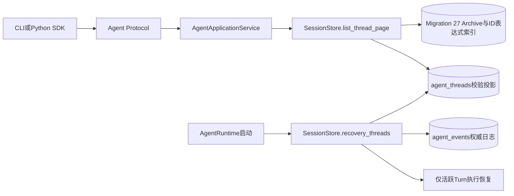
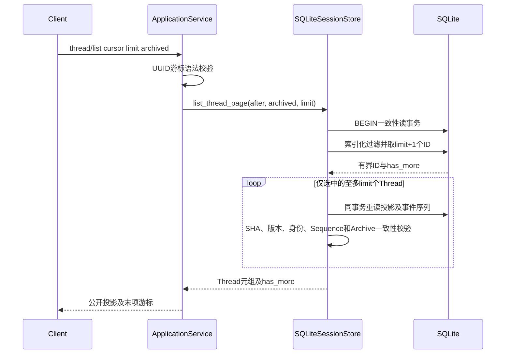
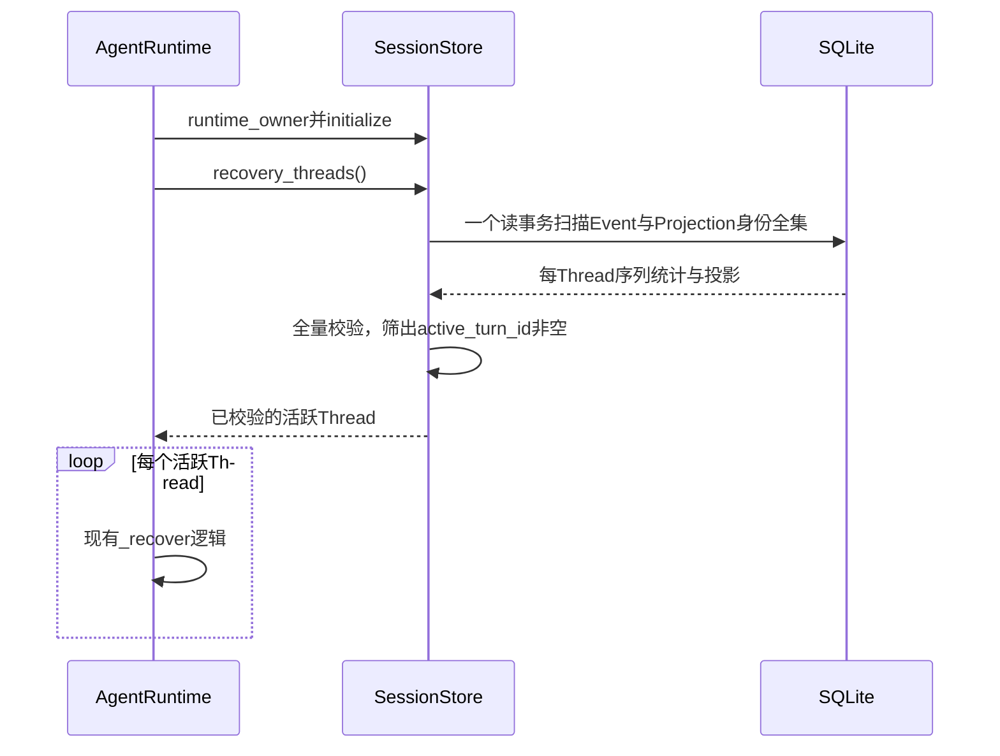

# 0.9.3d Thread列表与启动恢复读路径收敛详细设计

## 1. 需求背景、目标与非目标

[多Thread三平台第二候选](../validation/soak-many-threads-three-platform-candidate-2026-09-23-v2/README.md)在macOS出现启动P95/P99与分页P99越限，完整Run及独立报告给出`FAIL`。四轮样本中，第二次正式重启及其第一页异常慢；现有原件没有主机CPU/I/O剖面，不能排他证明根因。源码分析已经确认两个**结构性放大路径**：

1. [`AgentRuntime.__aenter__`](../../src/harnessix/agent/runtime.py)先取所有Thread ID，再对每个ID单独调用[`SQLiteSessionStore.get_thread`](../../src/harnessix/session/sqlite.py)。每次调用都新开连接并各做投影与事件序列查询。500 Thread即约500个连接及至少1,000条读取查询，尽管无活跃Turn仍重读全部快照。
2. [`AgentApplicationService.list_threads`](../../src/harnessix/app_server/service.py)每页先取全部Thread ID，再对游标后的**全部**Thread逐个重读，最后按Archive过滤并截断。500 Thread、每页50条遍历10页，约执行`500+450+…+50=2,750`次`get_thread`；第一页必然最重，与失败原件中的递减页时延一致，但一致性不等于排他归因。

目标是在不放宽冻结Profile、不改变Agent Protocol对外字段、不跳过历史Session完整性校验的前提下，将列表查询限制为**至多一页快照**，并将启动恢复扫描合并到一个一致性读事务。新Revision须验证迁移、分页语义、损坏失败关闭、取消清理、跨平台回归及真实500 Thread候选；旧FAIL永久保留。非目标是多租户远端数据库、动态调高阈值、把GitHub托管机数值解释为商业SLA，或改变Action效果恢复策略。

### 1.1 设计目标

验收以选中页快照读取数不超过`limit`、归档过滤与UUID游标结果不变、启动时非活跃损坏仍失败、三平台迁移可读以及新Run复验为准；单纯缩短本机耗时不构成发布证据。

## 2. 源码求证与架构决策

| 源码/原件 | 已求证事实 | 决策及取舍 |
|---|---|---|
| [`SQLiteSessionStore._snapshot`](../../src/harnessix/session/sqlite.py) | 校验事件最大序号与数量、投影版本、原始JSON摘要、Thread身份及Sequence；缺投影或事件缺口会失败。 | 启动批量扫描复用同一校验逻辑；不能直接按JSON中的`active_turn_id`跳过其余Thread，否则会削弱启动时对非活跃损坏的发现。 |
| [`SQLiteSessionStore.thread_ids`](../../src/harnessix/session/sqlite.py) | `agent_events UNION agent_threads`发现孤儿事件和缺失投影。 | 批量扫描仍以两表Union为身份全集，左连接投影及分组事件序列，保持孤儿/缺投影失败语义。 |
| [`SQLiteSessionStore._save`](../../src/harnessix/session/sqlite.py) | Thread状态及Archive写入同一`agent_threads.snapshot_json`，与Event批次原子提交；不维护额外Archive列。 | 以SQLite确定性JSON表达式索引提取Archive存在性，不新增可漂移的冗余状态列。 |
| [`ThreadListParams`](../../src/harnessix/protocol/contracts.py) | `limit`为1～200、cursor为UUID文本、`archived`可为空；现行语义先过滤后分页，按Thread ID字典序输出。 | Session端口增加`list_thread_page(after, archived, limit)`，SQL以绑定参数实现游标、Archive条件和`LIMIT limit+1`，仅校验选中页。 |
| [第二候选原件](../validation/soak-many-threads-three-platform-candidate-2026-09-23-v2/README.md) | 三平台负载固定500/50/3，macOS第二正式重启4.406秒、第一页4.499秒。 | 新实现与旧冻结Profile比较，不用旧Run阈值倒推；重测须保存新Revision和完整原件。 |

采用新的**单一Session端口实现**而非Service内为SQLite单独分支。列表热路径由Store拥有SQL、读事务和投影校验，Service只解析游标并投影公开视图；Runtime只接收已核验的活跃Thread。表达式索引依赖目标Python环境所携SQLite提供`json_type`，须在Linux/macOS/Windows CI实测；迁移不引入第三方中间件。

## 3. 总体架构、数据流与持久化



Migration 27在已有`agent_threads`上创建`(COALESCE(json_type(snapshot_json, '$.archive') NOT IN ('null'), 0), thread_id)`表达式索引。`archive`缺失或JSON `null`均视为未归档，非null对象视为归档；实际Thread模型及摘要仍由[`_snapshot`](../../src/harnessix/session/sqlite.py)验证。迁移沿用现有连续版本、原SQL SHA及初始化事务，**不修改历史Migration**。只按当前投影建索引，不复制正文到新表或上传件。查询Archive过滤时使用同一固定表达式，游标、归档标志和上限全部绑定为SQL参数，禁止拼接用户游标。





## 4. 领域契约、接口、字段与伪代码

### 4.1 接口设计

| 接口/字段 | 输入与输出 | 不变量与失败语义 |
|---|---|---|
| `SessionStore.list_thread_page` | `after: UUID\|None`、`archived: bool\|None`、`limit: int(1..200)`→`(tuple[Thread,...], has_more: bool)` | 按规范UUID字典序，先Archive过滤后游标和分页；一次一致性读事务；只加载至多`limit`个投影。非法上限或索引内容错误失败关闭，不返回半页。 |
| `SessionStore.recovery_threads` | 无入参→`tuple[Thread,...]` | 一次一致性读事务扫描Event/Projection并逐项校验；只返回活跃Turn；孤儿Event、缺投影、序号缺口、投影摘要/版本/身份错误仍失败，Runtime Owner随异常释放。 |
| Migration 27 | `agent_threads` Archive表达式与`thread_id`索引 | 只添加索引，不增加新的权威字段；旧Archive缺字段按未归档；未来/已篡改Migration失败关闭。 |
| `ThreadListResult.next_cursor` | 选中最后一个Thread ID或`null` | 只在同一过滤条件下仍有后续时非空；空页不能携带游标；跨请求插入/归档不会保证全局快照，原有游标一致性语义不扩大。 |

```text
list_thread_page(after, archived, limit):
    require 1 <= limit <= 200
    BEGIN read transaction
    ids = SELECT thread_id FROM agent_threads
          WHERE thread_id > :after (when present)
            AND archive_expression = :archived (when present)
          ORDER BY thread_id LIMIT :limit_plus_one
    has_more = len(ids) > limit
    threads = [checked_snapshot(id, same_transaction) for id in ids[:limit]]
    require each returned archive flag matches requested filter
    return threads, has_more

recovery_threads():
    BEGIN read transaction
    rows = Union(agent_events.thread_id, agent_threads.thread_id)
           LEFT JOIN per-thread event MAX(sequence), COUNT(*)
           LEFT JOIN agent_threads projection
    for row in rows:
        thread = checked_snapshot(row)  # 同现行get_thread校验
        if thread.active_turn_id is not None: collect(thread)
    return active_threads
```

查询每页仍需验证选中Thread的事件序列与投影；全量分页遍历的工作量为每个Thread约一次投影校验，而不是旧实现的重复后缀读取。启动扫描仍为O(N)数据量以保留全库校验，但从N次连接/多次语句改为单事务与单批查询。索引创建和Snapshot更新有轻微额外写开销，作为降低读路径延迟的明确取舍。

## 5. 失败恢复、安全、部署与回滚

### 5.1 错误分类与可观测性

非法页大小、游标或归档筛选分别拒绝为稳定`invalid_limit`、`invalid_cursor`、`invalid_filter`；Event缺口为`event_corrupt`，缺投影为`projection_missing`，投影摘要/身份/序号不符为`projection_corrupt`，未来投影版本为`projection_too_new`。SQLite驱动错误经`storage_errors`归一，不把私有SQL或路径带入Protocol。可观测信号限制为公开错误码、单页读取数、启动扫描的活跃Thread数量和低敏耗时；不记录Snapshot JSON、Prompt或Thread明文集合。当前实现未新增产品Telemetry指标，验证期通过Soak样本、归档Manifest和Reader复算观察延迟。

### 5.2 风险与取舍

表达式索引在Snapshot更新时增加少量写成本，并依赖发行环境SQLite的JSON表达式支持；跨平台迁移测试是发布前门禁。启动批量扫描保持对所有Thread的O(N)完整性验证，虽然减少连接开销，但不能承诺无限量历史的常数时间恢复。列表页只校验该页投影；因Runtime打开时仍扫描全库，当前单宿主生命周期可以发现历史非活跃损坏，但运行中外部篡改不由列表跨页重新全库审计。若后续引入多宿主或外部写者，必须重新评审这一边界。

### 5.3 安全与部署

`list_thread_page`和`recovery_threads`只读，不产生Agent Event或外部效果；调用取消时复用[`_session_connection`](../../src/harnessix/session/sqlite.py)的连接完成/关闭语义，不能泄漏Windows文件句柄。驱动错误仍经[`storage_errors`](../../src/harnessix/session/errors.py)映射为稳定`KernelError`，不暴露SQL、路径或Snapshot正文；无效公开游标仍由Service给出`invalid_cursor`。Migration中若旧Snapshot非合法JSON，建索引失败并回滚整个初始化事务，不创建半个索引；应通过现有备份/投影重建程序修复原数据，不跳过损坏。空库和老Schema升级应幂等；Downgrade不自动删除索引或覆盖已应用迁移记录。

表达式索引不会授权读取其它Workspace；`thread/list`当前无按Workspace隔离的服务端过滤，仍依赖本地单用户State与既有产品边界。本切片不扩展多租户安全模型。原始Thread、Workspace、Prompt或SQLite文件不进入Soak上传证据；归档只保存匿名页Proof和数值。

## 6. 测试与验收标准

1. 单元/集成：混合归档、游标边界、空页、`limit=1/200`、按过滤后分页与确定性顺序；`_snapshot`调用计数必须不超过页大小，`EXPLAIN QUERY PLAN`确认Archive表达式索引。非法游标、篡改投影与缺失/跳号事件继续失败关闭。
2. 恢复：无活跃Thread时返回空但全量验证；有活跃Thread仍走原`_recover`；异常释放Runtime Owner；连接取消仍可删除临时SQLite。
3. 迁移：旧版本Archive为空/非空、新库、重复初始化、Checksum变更、未来版本与非法旧JSON；Linux/macOS/Windows真实SQLite驱动都须通过。
4. 性能：同一封印Profile的500 Thread三平台新Revision重跑，采集Run/Attempt/Report原件和同Revision常规CI；首轮FAIL不得覆盖或从统计中剔除。若新候选仍失败，继续调查宿主资源与数据库阶段时延；单次PASS也不能抹去旧FAIL或证明商业SLA。
5. 文档：同步本详设、Session模块设计、Protocol模块接口、路线图和证据归档。新特性未取得上述取消、失败恢复、跨平台回归及真实负载证据前，不标记生产完成。
