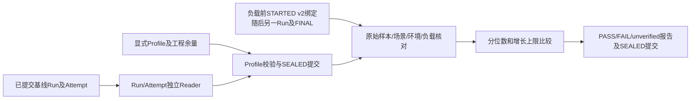
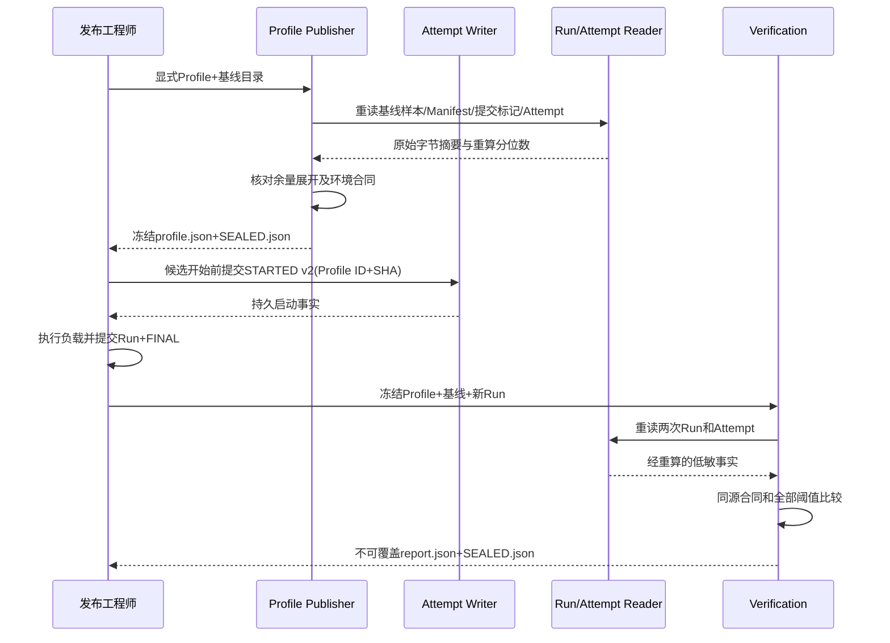

# 0.9.3d单平台Soak阈值独立复验详细设计

## 1. 需求背景、设计目标与边界

已有Soak Runner能发布数值样本、Manifest、`COMMITTED.json`以及独立的`STARTED/FINAL` Attempt。单次Run的
`baseline`只表示规模和证据完整，不证明延迟、RSS或持久增长处于可发布范围。若用同一次运行的分位数同时选择阈值并
验收，会让阈值随结果漂移；只看Manifest自报分位数又无法发现原始样本丢失或篡改。因此增加独立的冻结Profile及
复验报告，执行顺序固定为**基线Run → 显式工程余量及数值阈值 → 冻结Profile → 新Run → 校验报告**。

本切片只提供离线、单平台阈值复验内核，不自动选择工程余量，不为历史诊断运行补写Profile，也不把单次`PASS`解释
为三平台发布门禁。0.9.3d的长会话、Artifact增长与Action恢复三平台正式负载和总体发布评审仍未完成。当前
`long_session`仅接受含真实Context/Compaction证明的v2 Run；`many_threads`仅接受[逐轮分页证明v6](m09-3d-many-threads-proof-v6.md)，历史v1只读但不可冻结；`artifact_growth`接受v3完整
Proof，`sdk_capacity`接受[v4完整Proof](m09-3d-sdk-capacity-soak.md)；`restart`在[三平台正式基线](../validation/soak-restart-three-platform-2026-09-23-v1/README.md)取得后才接受v5完整Proof和场景专属无Turn Provider版本，并已冻结三份Profile；`action_recovery`接受[v7完整Proof](m09-3d-action-recovery-soak.md)的正式基线。重启的[第二独立候选及三平台PASS报告](../validation/soak-restart-three-platform-candidate-2026-09-23-v1/README.md)已按先冻结后测量顺序取得，不能仅凭手工Manifest给出`PASS`。

设计目标是：冻结前验证基线及阈值来源；复验时严格检查独立Run、环境和全部样本；以低敏不可覆盖文件保留
`PASS/FAIL/unverified`；任何证据缺口不能被解释为性能通过。非目标是验证签名来源、替代CI评审或决定工程余量。

## 2. 总体架构、流程与源码位置



入口[`publish_profile`](../../scripts/soak_threshold.py)先调用
[`read_published_run`](../../scripts/soak_evidence.py)和[`read_attempt`](../../scripts/soak_attempt.py)，
要求基线两层提交事实齐全，再校验Profile与基线场景、平台、硬件、Python范围、负载、Provider脚本、正式样本数和
故障计数一致。每项`p50/p95/p99`以及DB/WAL/Artifact正增长上限均必须精确等于
`ceil(基线值 × (10000 + margin_basis_points) / 10000)`；不接受自由文本余量、运行时缺省值或复验后回填。

[`verify_and_publish`](../../scripts/soak_threshold.py)重新读取Profile、基线和候选Run，不信任调用方传入的统计值。
[`run_long_session_context`](../../scripts/soak_long_session.py)和
[`run_many_threads`](../../scripts/soak_many_threads.py)接收可选`SoakProfileReference`，先由
[`attempt_scope`](../../scripts/soak_attempt.py)排他写入`harnessix.soak-attempt-start/v2`的`STARTED.json`，再采集环境并执行负载；最后经
[`publish_measured_run`](../../scripts/soak_run_common.py)写入候选Manifest。`finish_attempt/read_attempt`核对启动绑定与Manifest引用、启动时间顺序，绑定后的Run状态固定为`unverified`，
不再作为新基线。小于正式1000 Turn或500 Thread的运行不能接受Profile引用，v1无Context证明长会话也不能接受。
候选Run须有不同Run ID、完整Attempt、相同场景版本/测量边界/种子/负载/样本数/Provider脚本及匹配的单平台环境。
候选`STARTED v2`与Manifest的`threshold_profile_ref`都必须精确匹配冻结Profile ID及其规范字节SHA-256，状态为`unverified`且RSS单位已验证；缺少启动绑定、事后只给Manifest补引用或把候选伪装为基线均不可PASS。候选正式样本由Run Reader重算；复验比较所有指标的三个分位数、三类文件正增长及固定故障计数。结论写入单独报告，
与Agent Session、Workspace和业务数据库无写依赖。



## 3. 领域契约、数据结构与重点字段

| 对象/字段 | 类型与约束 | 业务含义 | 失败语义 |
|---|---|---|---|
| `SoakThresholdProfile.profile_id/status` | 32位十六进制；固定`frozen` | 一次不可变阈值版本；未评审时不发布Profile | 重复ID拒绝覆盖；无Profile不得判PASS |
| `baseline_run_id/baseline_manifest_sha256` | Run身份及64位摘要 | Profile只绑定一份已提交基线原始字节 | 摘要或Attempt不符拒绝冻结 |
| `scenario_id/version/measurement_boundary` | 固定场景及测量边界 | 阻止不同测量对象互比 | 不匹配为`unverified` |
| `platform/hardware_class/python_min/max` | 单平台、硬件档位与闭区间 | 避免跨平台或解释器范围套用 | 不匹配为`unverified` |
| `seed/load/provider_script_version/sample_counts` | 与基线精确一致 | 复验不得缩小负载、替换脚本或少取样 | 不匹配为`unverified` |
| 候选`STARTED v2.threshold_profile_ref`与Manifest同名字段 | Profile ID及SHA-256 | Attempt排他创建时先于负载持久化；最终Run必须与之逐字段相等 | 未预绑定、版本/时间顺序或跨文件错配为无效证据，不可PASS |
| `metric_limits` | 每指标`unit/direction/margin_basis_points/p50/p95/p99_upper` | 时延用ns、RSS用bytes，现行比较方向仅上限 | 阈值不等于基线余量展开则拒绝冻结；超限为FAIL |
| `growth_limits` | DB、WAL、Artifact各一项bytes上限 | `max(0, after-before)`；不以数据库收缩抵消增长 | 超限为FAIL |
| `expected_fault_counts` | 六类低敏计数 | 与场景预期故障事实精确一致 | 不符为`unverified`，不掩盖为性能PASS |
| `required_platform_validation` | 精确包含Linux、macOS、Windows且无重复 | 声明发布仍需覆盖的平台；单个平台报告不聚合 | 缺平台的Profile直接拒绝 |
| `SoakVerificationReport` | `PASS/FAIL/unverified`、Profile/基线/候选摘要、固定原因及违规指标名 | 绑定本次复验的三份原始证据；候选无效时摘要可为空 | 原始证据损坏/Attempt缺失为`unverified`，不替换为FAIL |

对象由[`SoakThresholdProfile`](../../scripts/soak_threshold.py)、
[`SoakMetricLimit`](../../scripts/soak_threshold.py)、
[`SoakGrowthLimit`](../../scripts/soak_threshold.py)和
[`SoakVerificationReport`](../../scripts/soak_threshold.py)定义，均采用冻结、拒绝未知字段的领域模型。
不存在自动选取阈值或`pending_baseline_freeze`可运行对象；未冻结状态以**没有Profile**表达。规范JSON、SHA-256及
`SEALED.json`形成最后提交边界。Profile、报告目录均排他创建，不覆盖旧结果；Reader要求精确文件集与规范字节。

### 3.1 接口设计

| 接口 | 输入 | 输出 | 调用前提与错误 |
|---|---|---|---|
| `publish_profile(root, profile, baseline_directory)` | 私有证据根、显式冻结合同、基线目录 | Profile目录及SHA-256 | 完整Run/Attempt、阈值公式与基线匹配；重复身份、证据不符失败关闭 |
| `read_profile(directory)` | Profile目录 | 规范Profile及原始字节SHA-256 | 精确文件集、SEALED、非符号链接与规范字节 |
| `verify_and_publish(profile_directory, baseline_directory, candidate_directory, report_root)` | 三份只读证据与报告根 | 报告目录和结论 | Profile损坏直接拒绝；候选缺绑定或损坏记录`unverified` |
| `read_report(directory)` | 报告目录 | 低敏报告 | 精确文件集、SEALED与规范字节；不替代重新复验 |

## 4. 核心逻辑、数据流程与持久化事务

```text
publish_profile(profile, baseline):
    baseline = read_run_and_committed_attempt(baseline)
    assert baseline.status == baseline
    assert supported_scenario_and_version(baseline)
    assert profile.identity, load, environment and fault facts match baseline
    for each metric and percentile: assert upper == ceil(baseline * (10000 + margin) / 10000)
    for each file-growth kind: assert upper == ceil(positive_growth * (10000 + margin) / 10000)
    exclusively_write(profile.json)
    write_last_seal(sha256(profile.json))

verify_and_publish(profile, baseline, candidate):
    read_sealed_profile()
    independently_read_both_runs_and_committed_attempts()
    assert candidate.STARTED_v2.profile_ref == candidate.manifest.profile_ref
    assert candidate.STARTED_v2.started_at <= candidate.manifest.started_at
    if evidence invalid or profile reference/identity/environment/load differs: unverified
    elif any recomputed quantile or positive growth exceeds frozen upper: FAIL
    else: PASS
    exclusively_write(report.json, SEALED.json)
```

源数据流仅包含固定场景数值、低敏环境档位和摘要；不发布Prompt、模型回答、工具参数/输出、用户路径、主机名、
业务UUID或Secret。报告`violations`只包含固定指标名和分位数/增长类别，不包含异常原文。业务State Root由Runner临时
创建，校验器只读证据目录，失败不会回滚已提交的Agent事实。

Profile和报告分别以排他目录为事务范围：先写正文文件并`fsync`，最后写包含正文SHA-256的`SEALED.json`。
两文件间异常留下不完整目录，Reader拒绝；不得原地补写为成功或覆盖已有身份。Profile冻结和报告发布没有跨目录
原子事务，故复验必须在使用时重新核对基线而非信任先前Profile写入动作。

## 5. 失败恢复、错误分类、可观测性、安全与部署

| 故障或中断 | 当前处理 | 可否PASS |
|---|---|---:|
| 基线或候选`COMMITTED`、样本、Manifest摘要不一致 | Run Reader拒绝；候选复验保存`evidence_invalid`报告 | 否 |
| Run提交而Attempt仅有`STARTED` | 保留原样；报告`unverified`，不自动补写FINAL | 否 |
| Profile基线摘要、阈值余量公式不符 | 冻结前拒绝写目录；已有Profile复验保存`baseline_mismatch` | 否 |
| 平台、硬件、Python、场景或负载不符 | 保存`environment_mismatch`或`load_mismatch` | 否 |
| 候选仅在Manifest绑定Profile、STARTED v1/v2与Run错绑或时间倒置 | Attempt提交拒绝；复验保存`evidence_invalid` | 否 |
| 候选完整Attempt与Manifest绑定了不同Profile或RSS单位未验证 | 保存`profile_mismatch`或`status_unverified` | 否 |
| 分位数或文件正增长超限 | 保存`FAIL`及固定违规指标名 | 否 |
| Profile或报告写入中断 | 无最后`SEALED`标记；Reader拒绝，旧目录不覆盖 | 否 |
| 报告被附加文件、篡改或软链接替换 | Reader拒绝，不能作为发布依据 | 否 |

Profile文件损坏时不存在可信阈值身份，校验器直接拒绝，不能伪造`unverified`报告；恢复需使用已备份的原始Profile
或重新冻结新Profile ID。已经发布的失败报告不得删除或覆盖以美化结果。目录按当前证据Writer的私有根和文件权限
创建，Windows拒绝重解析目录，POSIX同步文件及目录。离线复验无需网络、模型API Key、远程数据库或独立服务。

稳定原因码是报告的主要可观测信号：`limit_exceeded`定位超限类别，`environment_mismatch`和`load_mismatch`定位
不可比负载，`evidence_invalid`定位提交或摘要缺口。KernelError仅公开稳定Code与低敏消息；不记录绝对路径、
原始异常正文、样本行或业务ID。报告不包含计时器自报PASS，实际指标仍由原始样本独立重算。

`STARTED v2`提供先于负载的持久阈值选择事实，但不含数字签名；有写权限的恶意发布者仍可重写尚未外部锚定的
Attempt文件。`SEALED.json`和SHA-256证明原始字节与最后提交标记一致，不提供对有写权限攻击者的数字签名或执行来源证明。
正式发布仍须人工核对Runner来源Revision、CI全矩阵及基线工程评审；合成测试证据和单个平台PASS不能替代三平台
真实负载或完整0.9.3d发布门禁。

### 5.1 风险与取舍

- 只支持明确的上限与非负工程余量，暂不把增长减少量抵消其他文件增长；便于审计，但可能对零基线较严格。
- 单平台Profile可用于性能比较，但无法证明全平台可靠性；跨平台发布聚合须另建门禁，不能从单份报告推导。
- SHA-256及提交标记防止偶发破损和部分提交，不替代受信发布流水线、签名或防恶意管理员篡改。

## 6. 验证与维护

[`test_soak_threshold.py`](../../tests/benchmarks/test_soak_threshold.py)覆盖独立Run PASS、超限FAIL、同Run复用、
Attempt提交窗口、候选启动绑定与篡改、样本篡改、Profile/报告篡改、错误余量和不可覆盖目录。
[`test_soak_attempt.py`](../../tests/benchmarks/test_soak_attempt.py)负责v1历史字节、v2负载前绑定、事后补引用拒绝和Attempt提交/恢复窗口，
[`test_soak_evidence.py`](../../tests/benchmarks/test_soak_evidence.py)负责Run原始样本、哈希和提交标记。
本切片只关闭阈值**实现**的一部分，不关闭0.9.3d：Action恢复Runner已实现并有本地回归，长会话、Artifact增长与Action恢复的三平台正式负载与冻结复验，以及总体发布评审仍是阻断项；重启第二独立Run已取得三平台PASS；对应Revision常规CI首次文档Job超时，失败Job重跑后六Job成功。重启Profile的场景受限扩展与候选计划见[专项设计](m09-3d-product-restart-frozen-profile-candidate.md)。
