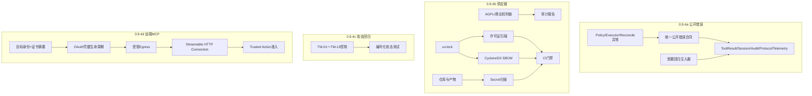
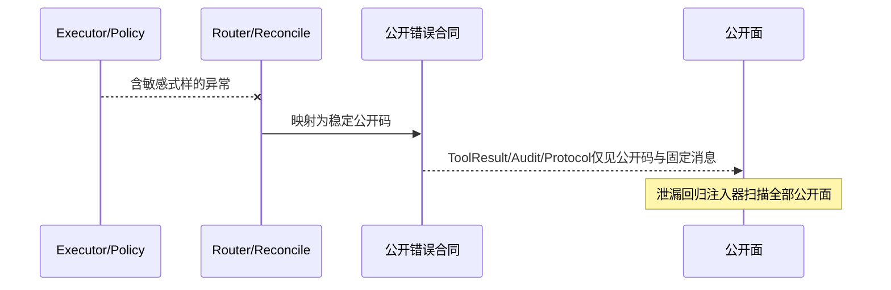
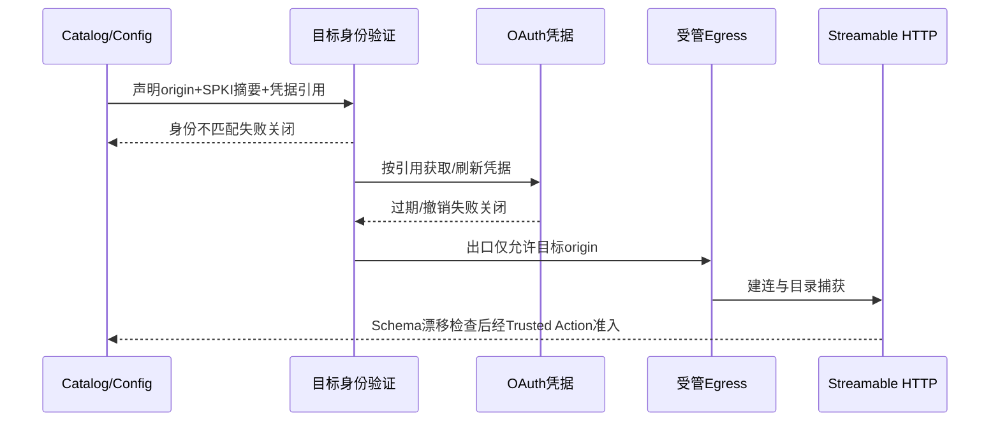

# 0.9.4 安全、许可证与供应链详细设计

## 1. 文档摘要

| 项目 | 内容 |
|---|---|
| 当前能力 | 威胁模型v2（TM-01～TM-13）、Trusted Action统一路由与审批、公开错误经KernelError稳定码传播、Gateway输出已脱敏、MCP本地stdio/in_process、Secret引用-解析-脱敏、AGPL+商业双许可治理文件、0.9.3六场景Soak证据链。 |
| 本文设计状态 | `reviewing`；目标设计，不表示任何子切片已实现。 |
| 影响模块 | Trusted Actions、MCP、Secrets、Sandbox、Product Config、构建/发布工程与文档治理。 |
| 关键ADR | [ADR-0066](../adr/0066-sandbox-network-and-secret-boundaries.md)、[ADR-0069](../adr/0069-unified-coding-action-risk-route.md)、[ADR-0073](../adr/0073-mcp-catalog-binding-and-sandbox.md)、[ADR-0064](../adr/0064-agpl-and-commercial-dual-licensing.md)。 |

0.9.4把"功能完整"收口为"攻击面有回归、供应链可审计、公开错误不泄漏"。路线图固定范围为：攻击测试、AGPL/商业双许可权利链、依赖和许可证扫描、SBOM、Secret扫描、安装脚本与扩展来源审查、Trusted Action Runtime公开错误清洗与泄漏回归、远端MCP Streamable HTTP/OAuth（独立目标身份、凭据生命周期、受管出口）。本切片按a～d四个连续纵向子切片实施，任何子切片不得绕过前置项。

## 2. 需求背景

0.9.1～0.9.3证明功能与可靠性，但发布级安全证据仍是点状的：公开错误清洗分散在Gateway输出与通用异常兜底中，缺乏统一合同与逐边界泄漏回归；依赖、许可证、SBOM与Secret扫描没有版本化证据；威胁模型的控制多数只有单元级测试，没有按TM编号的攻击回归套件；远端MCP只留了合同枚举。供应链与安全边界见[威胁模型](../threat-model.md)与[MCP模块设计](../modules/mcp.md)第0.9.4目标行。

## 3. 设计目标与非目标

### 3.1 目标

1. **0.9.4a 公开错误清洗统一化**：Policy/Executor/Reconcile异常在全部公开边界（模型ToolResult、Session失败、Action Audit结果、Agent Protocol错误、遥测标签）只产生稳定公开码；注入含路径/argv/Secret式样/内部异常正文的故障，逐边界断言不泄漏。
2. **0.9.4b 依赖、许可证与SBOM**：版本化依赖清单与许可证审计、CycloneDX SBOM、仓库与产物Secret扫描、安装脚本与扩展来源审查、AGPL/商业双许可权利链复核，全部产物进入CI门禁。
3. **0.9.4c 攻击测试套件**：按TM-01～TM-13建立编号化攻击回归，覆盖威胁模型第6节每组威胁的当前控制；失败关闭语义可复现。
4. **0.9.4d 远端MCP Streamable HTTP/OAuth**：独立目标身份（固定origin/证书摘要/不允许隐式宿主凭据）、OAuth凭据生命周期（获取、存储引用、刷新、撤销、失败关闭）、受管出口（复用Sandbox Egress合同），离线契约与故障注入测试，默认产品不装配。

### 3.2 非目标

1. 不恢复任何已删除的Action HTTP/Worker面；远端MCP不成为第二公共控制面。
2. 不把扫描工具输出当作形式化安全证明；所有扫描结论限定于固定工具版本与规则集。
3. 不在本切片实现远端Skill市场、任意Header注入、公网监听MCP Server或自动更新通道。
4. 不为通过扫描而降低既有Policy、Approval、Sandbox或Secret边界。

## 4. 约束、假设与术语

| 项目 | 定义 | 影响 |
|---|---|---|
| 公开错误 | 可跨模型ToolResult、Session、Audit、Protocol与遥测传播的错误码与消息 | 仅白名单稳定码与固定消息；任何原始异常文本、参数值、路径、Secret不得进入。 |
| 泄漏回归 | 注入含敏感式样（伪Secret、绝对路径、argv、内部异常正文）的故障并扫描全部公开面 | 任一公开面出现式样字节即失败。 |
| 编号化攻击回归 | 测试名绑定TM编号（如TM-02、TM-07） | 新增威胁控制必须补对应编号测试。 |
| SBOM | CycloneDX JSON，固定工具与输入（uv.lock） | 版本化产物；依赖变更即漂移失败。 |
| 目标身份 | 远端MCP的规范origin（scheme/host/port/path）+ TLS证书SPKI摘要 | 与凭据作用域绑定；身份漂移失败关闭。 |
| 受管出口 | 远端MCP流量只经Sandbox Egress合同允许的目标 | 不走隐式代理/环境凭据；无Egress证据不装配。 |

## 5. 总体架构与数据流

## 6. 领域契约、数据结构、持久化与事务

| 契约 | 位置（规划） | 要点 | 失败语义 |
|---|---|---|---|
| 公开错误合同 | `trusted_actions/public_errors.py`（规划） | 固定公开码集合与消息模板；Executor/Policy/Reconcile异常一律收敛为`policy_denied`/`executor_failed`/`executor_unknown`/`reconcile_failed`等稳定码 | 未映射异常为`internal_error`，不携带任何原文。 |
| 泄漏式样集 | 测试夹具 | 伪Secret（`hxak-`前缀式样）、绝对路径、argv、内部异常正文 | 出现在公开面即测试失败。 |
| 许可证/SBOM报告 | `governance/`与`dist/sbom`（规划） | 版本化JSON；与uv.lock摘要绑定 | 漂移即CI失败。 |
| 远端MCP目标身份 | `mcp/contracts.py`扩展（规划） | origin规范形式+SPKI SHA-256+凭据引用 | 身份/凭据不匹配不建连。 |
| OAuth凭据事实 | `mcp/store.py`扩展（规划） | 仅持久化引用、到期、撤销与审计摘要，不存明文 | 过期/撤销/泄漏信号失败关闭。 |

持久化与事务：本切片不修改Session/Artifact/Action数据库Schema；远端MCP的凭据引用与目标身份沿用MCP SQLite Store的既有迁移纪律；扫描产物只写版本化文件，不写业务库。错误分类沿用`FailureCategory`与KernelError稳定码，不新增异常类型。

## 7. 核心流程

### 7.1 0.9.4a 公开错误流程

### 7.2 0.9.4d 远端MCP时序

## 8. 接口设计

| 接口（规划） | 调用者 | 输入/输出 | 失败语义 |
|---|---|---|---|
| `public_error(exc, *, stage)`（0.9.4a） | Router/Policy/Reconcile | 任意异常 → 稳定公开码与固定消息 | 未映射异常为`internal_error`；绝不返回原文。 |
| `leak_fixtures`（0.9.4a测试） | 泄漏回归 | 四类敏感式样注入点 | 公开面命中即测试失败。 |
| `license_scan`/`sbom_generate`/`secret_scan`（0.9.4b脚本） | CI门禁 | uv.lock/仓库 → 版本化报告 | 漂移、命中或工具版本不符失败。 |
| `McpRemoteTarget(origin, spki_sha256, credential_ref)`（0.9.4d） | MCP Catalog | 目标身份与凭据引用 → 受管连接 | 身份/凭据/Egress不匹配不建连。 |
| `OAuthCredentialLifecycle`（0.9.4d） | MCP连接 | 获取/刷新/撤销/审计摘要 | 过期、撤销或泄漏信号失败关闭。 |

## 9. 源码与测试映射（规划）

| 设计元素 | 源码 | 测试 |
|---|---|---|
| 公开错误合同 | `src/harnessix/trusted_actions/public_errors.py`（规划） | `tests/trusted_actions/test_public_errors.py`（规划） |
| 泄漏回归注入 | `tests/trusted_actions/leak_fixtures.py`（规划） | 五公开面×四式样矩阵 |
| 供应链扫描 | `scripts/license_scan.py`、`scripts/sbom_generate.py`、`scripts/secret_scan.py`（规划） | `tests/governance/`对应正反例（规划） |
| 编号攻击回归 | 既有`tests/`下按TM编号聚合 | `tests/security/test_tm_*.py`（规划） |
| 远端MCP | `src/harnessix/mcp/`目标身份、OAuth、Egress扩展（规划） | `tests/mcp/test_remote_*.py`（规划） |

## 10. 失败、错误分类、兼容与观测

- 0.9.4a：公开错误只含稳定码；泄漏回归注入失败不改动业务事实，只证明公开面不含式样。
- 0.9.4b：扫描器自身版本与规则集版本化；工具更新产生的新结论经评审更新基线，不静默放行。
- 0.9.4c：攻击回归只操作临时夹具与离线替身；不触碰真实网络、真实凭据或用户Workspace。
- 0.9.4d：远端故障（DNS、TLS、令牌过期、服务器漂移、Egress拒绝）一律失败关闭并保留稳定错误码；UNKNOWN调用只经既有MCP/Trusted Action对账语义处理。
- 可观测信号沿用低基数标签；公开错误码进入既有错误分类，不记录式样。

## 11. 安全与隐私

扫描产物与攻击夹具不含真实Secret；伪Secret式样仅存在于测试夹具。SBOM与许可证报告不含私有路径。远端MCP凭据明文只存在于Secrets最小作用域，Audit只存摘要。

## 12. 测试与验收

1. 0.9.4a：泄漏回归覆盖五类公开面 × 四类敏感式样；既有Trusted Action/网关测试全部通过。
2. 0.9.4b：许可证白名单复核通过、SBOM可重生成且逐字节稳定、Secret扫描零命中且包含正例自检。
3. 0.9.4c：TM-01～TM-13每组至少一个编号攻击回归在CI三平台通过。
4. 0.9.4d：离线契约（目标身份、凭据生命周期、Egress、Schema漂移、UNKNOWN对账）与故障注入全部通过；默认产品不装配的证明测试。
5. 每个子切片完成须同步现行模块设计与威胁模型链接，`make check`全链通过。

## 13. 风险、限制与后续工作

- 扫描与攻击回归覆盖的是已知模式，不证明无未知漏洞；1.0发布仍需0.9.5安装证据与0.9.6 Provider证据。
- 远端MCP的公网真实联调需要受控目标与凭据，属0.9.5 Dogfooding候选，不阻塞本切片离线合同。
- 0.9.5受控Beta与0.9.6真实Provider凭据是外部依赖，届时逐项登记。

## 14. 变更记录

| 文档版本 | 代码版本 | 日期 | 变更摘要 |
|---|---|---|---|
| 1 | `668598220aa0cf328cb2e678bf16661550423804` | 2026-09-25 | 建立0.9.4总体设计与a～d子切片分解；实现与验收待完成。 |
| 2 | `668598220aa0cf328cb2e678bf16661550423804` | 2026-09-25 | 0.9.4a实现：新增`trusted_actions/public_errors.py`统一公开错误合同；计划阶段Resolver/Policy异常收敛为`action_plan_failed`，执行/对账异常映射统一收口；新增五公开面×四式样泄漏回归；Trusted Actions模块设计同步。 |
| 3 | x | 2026-09-25 | 0.9.4b实现：许可证白名单扫描（74包全过，平台条件包登记overrides）、CycloneDX SBOM漂移门禁、Secret扫描（零命中+正例自检）、CI动作全部SHA固定、httpx2/httpx2-jsfetch补登记、许可证权利链与安装/扩展来源两份审查文档；make supply-chain纳入check链与CI。 |
| 3 | `7a39f28bfb0d82e75a9e7a8b677c642d7733f845` | 2026-09-25 | 0.9.4b实现：许可证白名单扫描（74包全过，平台条件包登记overrides）、CycloneDX SBOM漂移门禁、Secret扫描（零命中+正例自检）、CI动作全部SHA固定、httpx2/httpx2-jsfetch补登记、许可证权利链与安装/扩展来源两份审查文档；make supply-chain纳入check链与CI。 |
