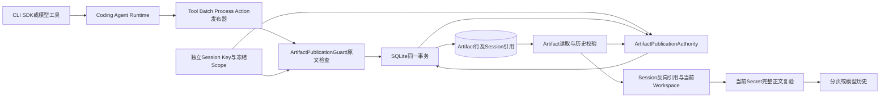
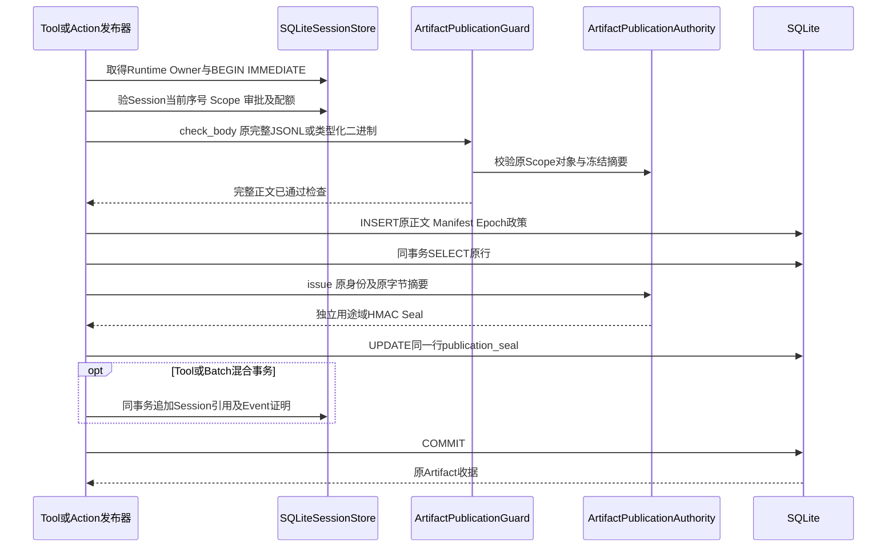
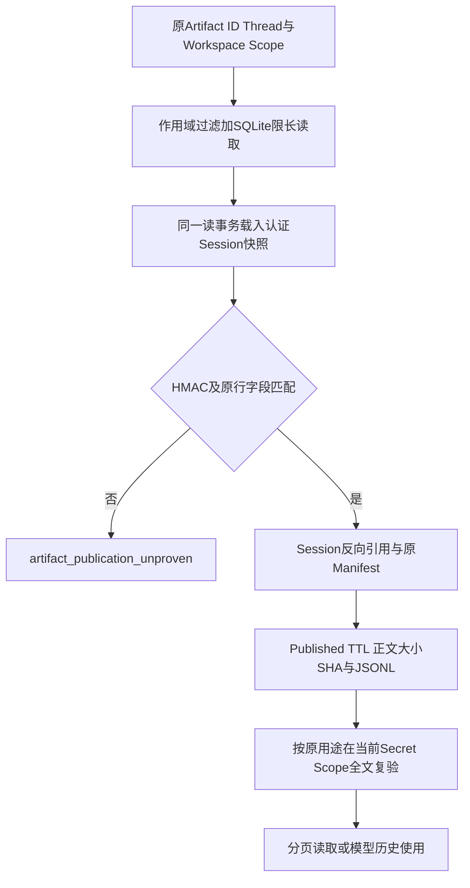
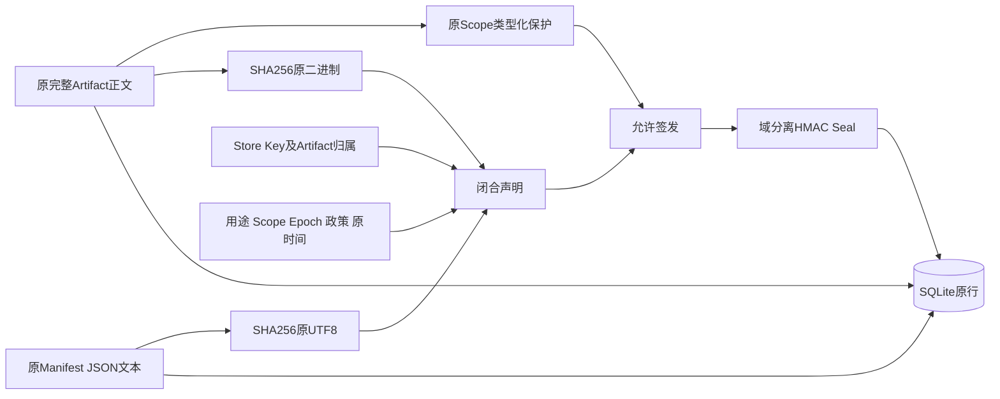

# 0.9.4a Artifact原正文持久来源认证总体与详细设计

## 1. 需求背景与设计目标

默认Coding Agent的只读Tool、Patch、Process与可信Action可在SQLite保存完整Artifact正文，并把引用写入Session。
原Migration 0028使用本次进程的随机Epoch作为公开保护证明：可拒绝旧来源，却使同一独立Key和同一Session
在合法重启后也无法读取原完整结果。直接跳过Epoch或用当前Secret无命中重新签发，会把未知旧事实错误授权。

目标是使**新发布且原文已保护**的Artifact在相同逻辑Store/Key恢复后可验证来源；保持旧原字节及旧行拒绝；
所有读取继续核对Session权威引用、当前Workspace Scope、TTL、原正文完整性和当前Secret材料。
实现只扩展现有Coding Agent组合根和Artifact存储，不建立独立HTTP/Worker服务。

| 范围 | 当前实现事实 | 未据此推导 |
|---|---|---|
| Migration 0030、签名与读取 | 新行同事务Seal；有Key分支跨Epoch读，旧NULL拒绝 | 旧行来源已安全、全库历史已迁移 |
| Tool/Batch/Review/Action共用发布 | 集中插入前检查、插入后原行签名；Action查询优先重试验签 | 所有真实Action三平台故障场景均已验收 |
| 分页、单条/批量历史 | 来源认证先于Manifest解析；Session反向授权与当前保护仍执行 | Seal就是模型或UI授权 |
| 默认产品 | 复用Session托管Binding和冻结Scope | Key备份/轮换、维护CLI、Windows原生发行已完成 |
| 资源上限 | 读取BLOB、Manifest、Seal在SQLite返回前限长+1 | 任意损坏数据库及全进程资源限制已关闭 |

不防同UID任意代码或管理员获取独立Key、物理库有效整组回滚、整Thread及证明共同删除。
正文不加密，不能把HMAC描述为机密性保障。参考源码事实见[研究](../research/authenticated-artifact-body.md)。

## 2. 总体架构、系统上下文与信任边界



`SecretPublicationScope`只提供材料快照及保护；原Scope对象须与Session Event Authority捕获者相同。
`SessionPublicationBinding`拥有自有Key副本和逻辑身份；`ArtifactPublicationAuthority`共享生命周期，不复制第二份Key。
Artifact Store拥有事务，发行证据不能绕过真实Session所有权或创建旧Artifact的新信任。
SQLite文件可由不持Key的攻击者改写；原行SHA、Manifest或Epoch不被视为独立来源凭据。

## 3. 新发布流程与持久化事务时序



四种正式生产者的调用位置：[`SQLiteArtifactStore.publish`](../../src/harnessix/artifacts/sqlite.py)、
[`batch_diff`](../../src/harnessix/artifacts/batch_diff.py)、
[`publish_action_review`](../../src/harnessix/artifacts/action_review_store.py)与
[`publish_action_output`](../../src/harnessix/artifacts/action_output_store.py)。
新签发只在[`insert_artifact`](../../src/harnessix/artifacts/persistence.py)集中实现。
Tool/Batch的正文、Seal和Session引用同事务；Review/Output先以正文及Seal事务暂存孤儿，
后续仅在Session批准/结果建立唯一反向引用后可读。保护失败、CAS冲突、异常、取消或COMMIT前进程退出
回滚当前事务中所有新行、Seal和已有的Session引用写入，不能把孤儿证明当作公开授权。
COMMIT后确认丢失只查询原Review/Output行并验签，再严格比对身份、正文、记录数与原TTL；不得重签或新建收据。
普通Tool/Batch沿既有调用身份和事务语义，不因签名增加自动重试。

## 4. 读取、历史与数据流程



`read`与`verify_reference`见[`artifacts/sqlite.py`](../../src/harnessix/artifacts/sqlite.py)，批量历史见
[`batch_verify.py`](../../src/harnessix/artifacts/batch_verify.py)。首先按调用方Workspace/Thread过滤并建立SQLite读快照；
然后在**解析未认证Manifest前**验原证明，继续校验Session中同一Turn/Call、用途与引用、当前TTL、正文SHA/记录数，
最后按原用途解码并检查当前材料。批量路径共享同一个读快照，不以旧Epoch重新生成证明。
过期Tombstone只允许`artifact_expired`，不公开正文；旧无Key库仍保留原运行Epoch兼容分支。

读取投影由[`ARTIFACT_READ_SELECT`](../../src/harnessix/artifacts/persistence.py)集中定义：
SQLite先返回最多1 MiB+1正文、8192+1 Manifest字符和4096+1 Seal字节；上限加一保留超限检测，
空BLOB通过显式`CASE`保持`b''`而不变成SQL NULL。超限、错类型、字段不规范均失败，绝不把截断内容签成新证明。

## 5. 正式数据结构与字段说明



原字节用于摘要，不先规范化JSON；Secret原值只进入内存保护器，不进入声明或数据表。
正文、Manifest和Seal在一个数据库事务中发布，读侧使用同一快照取回三者；
Review/Output的Session反向引用属于后续事务，未建立之前正文不可公开。

### 5.1 Migration与原行

[`0030_authenticated_artifact_body.sql`](../../src/harnessix/session/migrations/0030_authenticated_artifact_body.sql)
只新增`publication_seal BLOB NULL`，非空须在1～4096字节；旧行NULL，Migration 1～29校验和不变。
原`publication_epoch`和`publication_policy`保留：无Key库依旧按旧Epoch判断；认证库把原Epoch/政策
也绑定进HMAC，但**不要求原Epoch等于当前进程Epoch**。`state`和`body`原CHECK约束及到期清理行为不变。

### 5.2 ArtifactPublicationSeal v1

定义见[`store_publication.py`](../../src/harnessix/session/store_publication.py)。
规范JSON以键排序、无额外字段、UTF-8编码；HMAC-SHA256消息前缀为
`harnessix.artifact-publication/v1\0`，不与Event/Projection共用用途域。

| 字段 | 类型/限制 | 作用 |
|---|---|---|
| `purpose` | 固定`artifact_body`，版本1 | 防止把其他对象Seal作为Artifact使用 |
| `store_id`,`key_id` | UUID | 逻辑Store及独立Key身份；不代表物理路径或Tenant |
| `artifact_id`,`thread_id`,`turn_id`,`call_id` | UUID | 完整归属与调用身份，不接受无界字符串 |
| `workspace_scope` | 64位小写Hex | 原Workspace能力摘要，不替代读取时当前作用域验证 |
| `artifact_purpose` | 六种闭合用途 | 区分Tool、Batch、Process、Review、Action正文解释 |
| `publication_epoch`,`publication_policy` | UUID与固定政策v1 | 绑定原存储证明元数据，不作为跨重启准入条件 |
| `scope_sha256` | 64位小写Hex | 原冻结Secret Scope声明摘要；在签发时从Session原Scope取得 |
| `manifest_sha256`,`body_sha256` | SHA-256 | 分别绑定原Manifest UTF-8与原完整二进制正文；普通Hash本身不是信任根 |
| `size_bytes`,`expires_at`,`created_at` | 0～1 MiB及有界原文本 | 防止元数据替换与期限漂移，不规范化重签 |
| `tag` | 64位小写Hex | 独立Key HMAC，比较使用`hmac.compare_digest` |

`scope_sha256`只存在于签名后的Seal；读取校验其MAC，但不要求它等于新Scope。
新Scope是否可公开由当前完整正文复验决定；Secret值不入Seal、DB公开元数据或模型视图。

## 6. 类与接口设计、核心逻辑及源码映射

| 组件 | 职责 | 关键入口与源码 |
|---|---|---|
| `EventPublicationAuthority` | 保持Session原Scope冻结身份；Artifact签发借用原对象检查 | [`original_artifact_scope_digest`](../../src/harnessix/session/publication_seal.py) |
| `SessionPublicationBinding` | 逻辑Store/Key生命周期、Session事实证明 | [`store_publication.py`](../../src/harnessix/session/store_publication.py) |
| `ArtifactPublicationAuthority` | Artifact独立用途域签发/验证，无第二份Key | 同上`issue`/`verify` |
| `ArtifactPublicationGuard` | 原文检查、旧Epoch兼容、有Key来源验证 | [`publication.py`](../../src/harnessix/artifacts/publication.py) |
| `artifact_claims` | 有界原行字段与原Manifest/正文摘要构造 | 同上 |
| `insert_artifact` | 集中新增原行、同事务原行Seal写回 | [`persistence.py`](../../src/harnessix/artifacts/persistence.py) |
| `SQLiteArtifactStore` | 原Session反向授权、分页、历史单条及清理 | [`sqlite.py`](../../src/harnessix/artifacts/sqlite.py) |

核心签发伪代码：

```text
require Runtime Owner and frozen Session Scope
BEGIN IMMEDIATE
validate pending call, CAS, approval and quota
validate same original Scope; protect complete original body by purpose
INSERT original Artifact row
read exact inserted row
claims := strict identities + raw row metadata + SHA256(raw manifest/body)
seal := HMAC(independent key, artifact domain || canonical claims with frozen Scope digest)
UPDATE same row seal
for Tool/Batch only: append Session reference and authenticated events
COMMIT; return original reference
```

校验伪代码：

```text
BEGIN read snapshot; WHERE thread/workspace/artifact matches
load authenticated Session snapshot
if keyed and published: parse bounded raw row; verify Store/Key, domain, MAC and all claims
else if unkeyed: retain original current-Epoch check
verify Session inverse reference and raw Manifest
verify state, TTL, body size/SHA/records and purpose-specific structure
check complete original body against current Secret Scope
return bounded page or allow model-history reference
```

## 7. 失败、取消、超时与恢复语义

| 条件 | 对外结果 | 持久化/恢复不变量 |
|---|---|---|
| 旧NULL、错Key、错Store、MAC/原行篡改 | `artifact_publication_unproven` | 不修改原行，不补签；Session原事实仍可审计 |
| 当前材料命中原正文或Scope失效 | 原保护有限错误 | 不把来源HMAC当成公开许可；不泄露Secret值 |
| 错Thread/Workspace或未被Session引用 | `artifact_not_found`/原引用错误 | 不从原行推导新访问权 |
| TTL到期或清理Tombstone | `artifact_expired` | 正文清空；Manifest与原Seal可保留供审计，不恢复正文 |
| COMMIT前异常、取消或进程退出 | 原事务回滚 | 不出现只提交正文/Seal/Session引用任意一部分 |
| COMMIT后响应确认丢失 | 原Review/Output收据精确匹配并验签 | 不生成新ID、不刷新TTL、不重新扫描旧行后补签 |
| 未知二进制编码、超限或无法验签 | 拒绝 | 不降级为弱JSON、截断成功或未保护读取 |

原`CancelToken`和SQLite连接清理保持不变；本切片未宣称能硬抢占同步OS调用，
也未新增自动重试。异常日志/遥测只发布有限码与固定消息，不包含正文或Key。

## 8. 测试、部署与剩余工作

[`test_authenticated_body.py`](../../tests/artifacts/test_authenticated_body.py)使用真实Runtime、SQLite、只读工具、
同一独立Key的重启、原Epoch变化、Secret轮换当前正文拒绝、错Scope替身、旧Migration 29行、
Seal/正文/Manifest/时间/Scope篡改及超限BLOB检查；
[`test_authenticated_store.py`](../../tests/agent/test_authenticated_store.py)验证Artifact与Session事件同事务回滚；
[`test_publication_upgrade.py`](../../tests/artifacts/test_publication_upgrade.py)验证独立旧程序产物升级保留原字节。
完整回归、平台/发行物结论只以固定源码[验证目录](../validation/authenticated-artifact-2026-09-28-v1/README.md)为准，
不得把Mac本机检查推断为Windows原生通过。

部署需先具备[默认托管Key与Root](m09-4a-managed-session-key-and-root.md)，
备份必须把独立Key、数据库及WAL一致快照作为同一恢复单元；当前正式Key导出/轮换/跨机迁移未实现。
旧库不可仅升级Migration就继续公开旧Artifact正文。密钥保护备份、维护CLI、Owner内部同步阻塞、
全部Provider/SDK/MCP出口、编号攻击及三平台安装/Beta仍是0.9后续门禁；12件Archive权利阻断发布。

## 9. 可观测性与错误分类

新来源错误只发布`artifact_publication_unproven`固定码和固定消息；原Secret保护器继续发布既有有限码，
Session验签、存储不可用、TTL与当前Workspace失败分别保留既有分类。Telemetry和Protocol不能包含原正文、
Seal密钥、Secret值或数据库异常原文；可记录低敏错误码、阶段和Trace关联，不把HMAC成功记作已授权公开。
异常码、计数和持久库状态分开观察，不能仅凭日志零泄漏推断历史安全。

## 10. 风险与取舍

HMAC为来源完整性，不是正文加密或可回滚证明；Key丢失使已签Artifact与认证Session同时不可读。
旧无Seal行保持不可读会影响跨版本长会话，但比用当前材料补签未知历史更符合失败关闭要求。
本切片用小幅额外读写换取同事务原行认证，未知宿主/备份环境不自动降级。实际三平台性能、
Key保护恢复、全部Action进程退出矩阵和旧行迁移策略需在后续独立验证。
