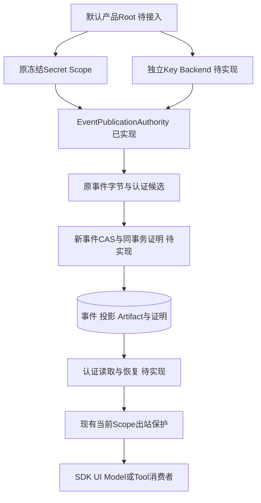
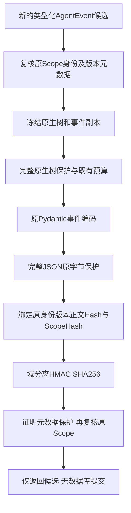
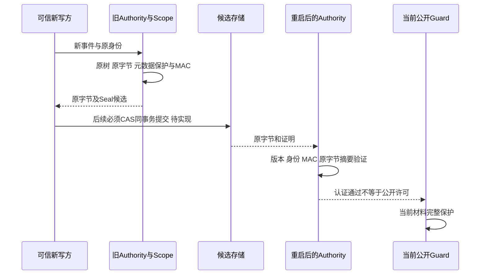
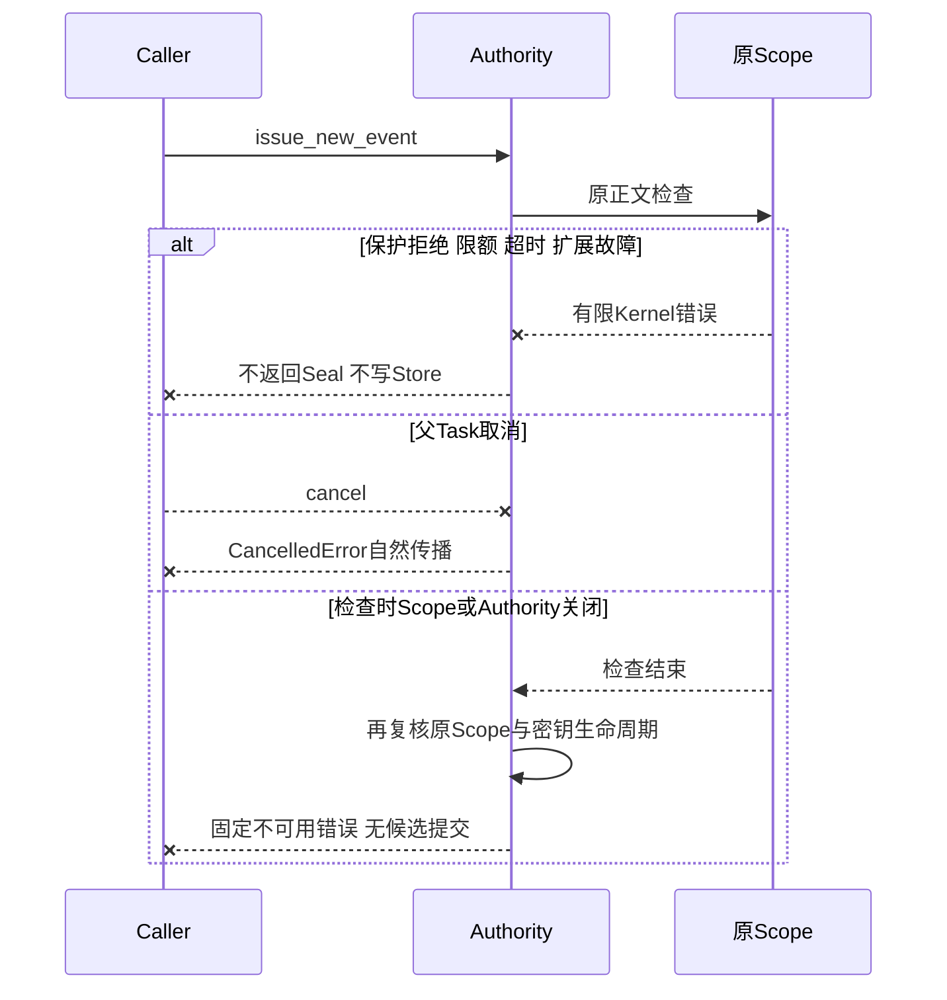
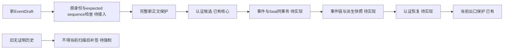

# 0.9.4a 认证历史与跨重启保护总体及详细设计

## 1. 需求背景

Coding Agent长期会话、断线重连、升级、备份和模型凭据轮换都要求恢复正文，但恢复不得向新调用方泄漏旧材料。
现有入站/出站保护已覆盖当前材料，缺少当时保护完成事实和持久认证。独立默认Root探针确认旧未知值仍可读，
普通投影SHA可被随正文同时替换。详见[源码研究](../research/authenticated-history-and-seal.md)。

## 2. 设计目标、非目标与交付状态

总体目标：新写事实有原保护完成证明；认证事件及派生投影先于消费；旧未证明历史失败关闭；安全正文跨重启恢复；
独立密钥生命周期、同事务证明、备份/迁移和三平台失效语义均可验证。

| 部分 | 状态 |
|---|---|
| Event Seal闭合合同、可信Scope绑定、HMAC签发/验证、原字节与取消/超时/关闭 | 已实现核心组件；尚未默认装配 |
| 独立Key Backend及逻辑Store认证头 | 待实施，密钥托管策略待决策 |
| 新事件CAS同事务证明、事件链成员身份及派生投影认证 | 待实施 |
| 所有恢复/Fork/内部Store/Runtime消费入口 | 待实施 |
| Artifact JSONL/二进制来源证明与历史页重开 | 待实施 |
| 默认Root、升级、密钥备份/跨机器迁移和三平台真实验收 | 待实施 |

非目标：任意DLP、同用户恶意进程/宿主内存保护、多租户认证、独立数据库密钥服务、密码学防整库回滚或静默追认旧行。
0.9.4a不关闭，0.9.5安装/Beta和0.9.6真实Provider验收不被本组件替代。

## 3. 总体架构与信任边界



密钥由可信产品宿主持有，不注入模型、普通工具或目标进程。数据库保存逻辑身份与证明，不保存认证密钥。
当前核心不持有Store、不调度Task、不连接Provider、不改变数据库；核心认证成立不代表默认产品已启用它。
核心的可信边界是同一冻结Scope对象与独立密钥。新事件候选是否真正属于新写事务，必须由后续CAS入口证明。

## 4. 新事件候选签发流程



先检查原生树预算再编码，避免先生成不受预算约束的大字节串。候选正文使用冻结事件自身的既有Pydantic编码，
返回字节是后续应提交的字节，禁止签名之后重新编码。核心只接受v20新事件与原生UUID，Key恰为32字节。
历史v1～v19只能沿原兼容读取；核心拒绝直接签发旧Schema，不代表v20旧行可自动追认。

## 5. 认证验证时序与跨重启语义



相同独立密钥与Key ID可以跨Authority/Scope实例验证，原scope_sha256不需等于当前Scope。
原证明验证不调用当前正文公开检查，因此仅供私有事实认证；公开、模型请求和工具/Artifact响应仍独立检查当前材料。
旧安全文本可能等于新凭据，核心认证可通过但当前出站必须拒绝，该反例已有专项测试。

## 6. 原保护失败、取消与关闭时序



密钥close清零本对象持有的可变副本，调用者的原不可变副本不在擦除承诺内。
原Scope关闭或元数据身份变更不得继续签发；认证验证只要求密钥开放，不据其成功反向授权任何公开正文。
Python同步恶意扩展不能被硬抢占，沿既有10秒检查点保护语义，不宣称整个多阶段操作具有单一10秒总期限。

## 7. 数据流程与持久化总体方案



计划采用独立sidecar证明表和逻辑Store认证头，不把新列塞入现有INSERT VALUES语义，不修改旧事件原字节。
迁移只能建立空证明结构和版本头，不为任何既有正文生成证明。重试必须重用已提交原事实，不能拿当前新Scope覆盖原证明。
投影证明由已认证事件前缀与可信Reducer派生，不能重复把巨大历史整体扫描当作唯一证明；必须绑定链头和投影Schema/Hash。
Fork要同时验证原来源前缀与目标身份，Rebuild验证事件后重新派生，不从原普通SHA推导信任。
Artifact计划覆盖purpose、Manifest、完整正文与二进制正式解码依据，不能放宽现有Epoch后直接接受旧正文。
现有SQLite备份需连同逻辑身份与证明保留；密钥单独托管及授权恢复，丢失后失败关闭，禁止自动生成替代密钥继续解密/认证旧数据。
整个有效旧库回滚无法仅靠HMAC发现；备份恢复的副作用对账和单写者租约仍独立负责。

## 8. 类与接口设计：已实现核心

| 符号 | 合同及职责 | 不承担的职责 |
|---|---|---|
| EventPublicationSeal | strict/frozen/extra forbid闭合DTO；版本1和既有公开保护策略v1 | 不含正文、材料或恢复Task授权 |
| PublicationScope | 既有纯保护端口＋publication_context | 不解析任意环境或提供远端认证 |
| EventPublicationAuthority | 拥有独立Key副本、原Scope及其元数据摘要 | 不拥有DB、不证明事务成员身份、不调度任务 |
| issue_new_event | UUID/AgentEvent/CancelToken → 原冻结字节及候选Seal | 不是迁移接口，不可补签既有行 |
| verify_event | 证明bytes/原body及可信预期行身份 → None或固定错误 | 不是公共DTO读取或当前材料授权 |
| SecretPublicationScope.publication_context | 原捕获实例UUID及name/version副本，无材料值 | 元数据Hash不是独立正文认证 |

保持秘密快照Immutable；每次返回独立元数据容器。Key ID与模型Credential version无关，禁止用API Key作为HMAC密钥。

## 9. 数据结构与重点字段

| 字段 | 类型及约束 | 业务解释 |
|---|---|---|
| seal_version | strict int，恰为1 | 不接受未知Codec版本或True冒充1 |
| policy | 固定public-output-protection/v1 | 固定签发谓词，未来策略需版本化变更 |
| key_id | UUID | 独立认证密钥的稳定身份 |
| store_id | UUID | 逻辑Store身份，尚待认证头装配；不是物理文件身份 |
| thread_id/event_id | UUID | 原数据拥有者与事件资源身份 |
| sequence | strict int ≥1 | 原行序号，不接受bool/字符串强制转换 |
| event_schema_version | strict int，恰为20 | 当前新事件编码合同，不授予旧Schema升级许可 |
| scope_sha256 | 64位小写Hex | 原捕获UUID与版本元数据摘要，由MAC认证；不持久化材料值 |
| body_sha256 | 64位小写Hex | 完整原事件字节，换空白也导致不同原字节 |
| tag | 64位小写Hex | 对域分离规范声明做HMAC，tag自身不参与输入 |

Seal编码最大4096字节，Scope元数据32KiB/最多32名称，事件单体1MiB与现有保护预算一致。
声明使用固定域前缀及规范JSON；完整正文使用原事件编码，而不是声明的规范JSON编码。
MAC和正文Hash使用compare_digest；它们不检测成员删减或整库回滚，后续链头/投影合同必须补齐。

## 10. 核心业务伪代码

```text
issue_new_event(store, typed_event, cancel):
  require open key and original immutable Scope
  freeze original native tree and event
  guard entire native tree under original budget
  encode frozen event with original codec; guard full original bytes
  recheck original Scope; bind original IDs/schema/sequence/bodyHash/scopeHash
  tag = HMAC(independentKey, fixedDomain + canonicalClaims)
  guard seal metadata; recheck key and original Scope
  return candidate bytes and seal; do not commit

verify_event(receipt, body, trusted_expected_row):
  require open key; bound receipt/body and strict expected types
  decode closed receipt; require fixed version/policy
  require exact key/store/thread/event/sequence
  constant-time verify MAC and full body Hash
  return authentication result only; not public permission

planned_SQL_write:
  BEGIN IMMEDIATE; require genuinely new event ID and expected_sequence CAS
  verify authenticated prefix; issue candidate for the new typed event only
  insert exact returned bytes and sidecar; derive authenticated projection; COMMIT
  on cancel/error: rollback; after_commit response loss: re-read original committed fact
```

## 11. 失败、恢复、安全与可观测性

| 分类 | 已实现语义 | 后续强制点 |
|---|---|---|
| missing/invalid Seal、错MAC/Hash/身份 | publication_history_unproven，固定消息 | 原历史读取入口尚待接入 |
| 错密钥长度/关闭 | publication_key_unavailable | 密钥丢失/托管错误/权限漂移由Key Backend统一 |
| 原Scope失效/换身份 | publication_scope_unavailable/changed | 全链不得降级无保护 |
| 错事件类型/Schema/正文限额 | publication_event_invalid | 原新写CAS入口不得吞掉拒绝 |
| 原保护失败/取消/超时 | 复用原有限公开错误及自然取消 | 不写事件/证明，不新增恢复Task |
| 空间/IO失败、commit响应丢失 | 核心不执行IO | SQLite同事务与原事实恢复待实现 |

观测只能记录稳定码、版本、布尔不变事实、Hash和资源计数；不记录密钥、原历史、Prompt或外部诊断。
不对任意同用户进程、恶意宿主内存、Tenant授权或数据库完整回滚作安全承诺。
必须保留入站、当前公开和模型请求保护；验证核心签名不替代它们。

## 12. Key Backend、部署、升级与回退

默认密钥策略待决策。推荐独立本机托管，POSIX需owner/权限/no-follow/原子创建与父目录fsync；
Windows应采用用户作用域保护并配套原生文件身份/权限/失效验证，不能用chmod返回成功冒充ACL保障。
[Microsoft DPAPI合同](https://learn.microsoft.com/en-us/windows/win32/api/dpapi/nf-dpapi-cryptprotectdata)
描述用户作用域与机器限制；不能据此承诺任意机器可迁移，禁止使用允许本机其他用户解密的机器作用域替代用户作用域。
跨机器恢复须独立授权Key Export/Import与备份绑定，当前未实现；本核心没有写任何正式Key文件。

默认Root尚未接入，不改变当前产品安装与旧库读取行为。将来启用必须有正式升级流程：隔离保留旧未证明数据，
不能静默签发旧正文或删除历史。回退无证明旧程序会重开风险，不能作为安全恢复方案。
HMAC与compare_digest使用[Python标准库合同](https://docs.python.org/3.12/library/hmac.html)，不增加Crypto第三方依赖或许可证豁免。

## 13. 验证矩阵、实际范围及风险

核心46项验证包括原正文拒绝、签名/Hash/身份篡改、错密钥/版本/附加字段、原字节变化、跨Authority重开、
取消/超时/限额/扩展故障、Scope关闭/变更、密钥清零与原认证不等于新材料公开。
原Pydantic浮点编码、检查树改写和调用者并发改写均保留冻结原字节，不能转成通用JSON或改写后正文。
独立消费者以两个OS进程重开真实SQLite事件，并单独保存fixture证明和fixture密钥，
只证明核心跨进程原字节认证；两次独立事务不代表生产Seal原子写入，也不代表正式Key Backend。
独立默认Root观察和无密钥SHA替换已复现，均保持开放状态，不当成安全通过。

后续必须补：真正新事件CAS和同事务故障/进程硬退出、全部历史读取与Runtime模型前拒绝、投影/Fork/Artifact来源链、
新Scope安全重开、未知旧历史拒绝、Key文件真实三平台/损坏/权限/备份/迁移、实际默认CLI OS管道、三平台安装和发布门禁。
12项Archive权利、全部Provider材料、Scope失效SDK相关ID、Owner资源/归属、编号威胁及远端MCP仍开放。

## 14. 源码映射与阅读顺序

1. [publication_seal.py](../../src/harnessix/session/publication_seal.py)：闭合声明、Context摘要、域分离、签发和验证分离。
2. [secrets/publication.py](../../src/harnessix/secrets/publication.py)：独立捕获身份、metadata副本与原材料生命周期。
3. [核心测试](../../tests/session/test_publication_seal.py)：失败语义及“认证通过但仍拒绝新材料公开”。
4. [session/sqlite.py](../../src/harnessix/session/sqlite.py)与[Artifact写入](../../src/harnessix/artifacts/persistence.py)：后续同事务挂接点，当前尚未挂接。
5. [研究](../research/authenticated-history-and-seal.md)、[ADR](../adr/0102-authenticated-history-and-event-seal-core.md)与[证据](../validation/event-seal-core-2026-09-28-v1/README.md)。
