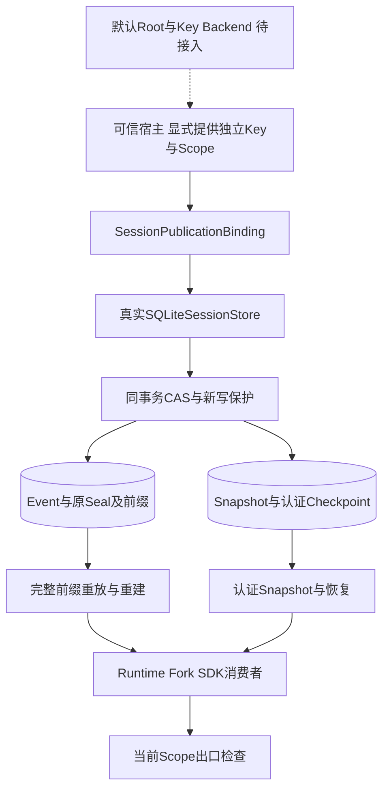
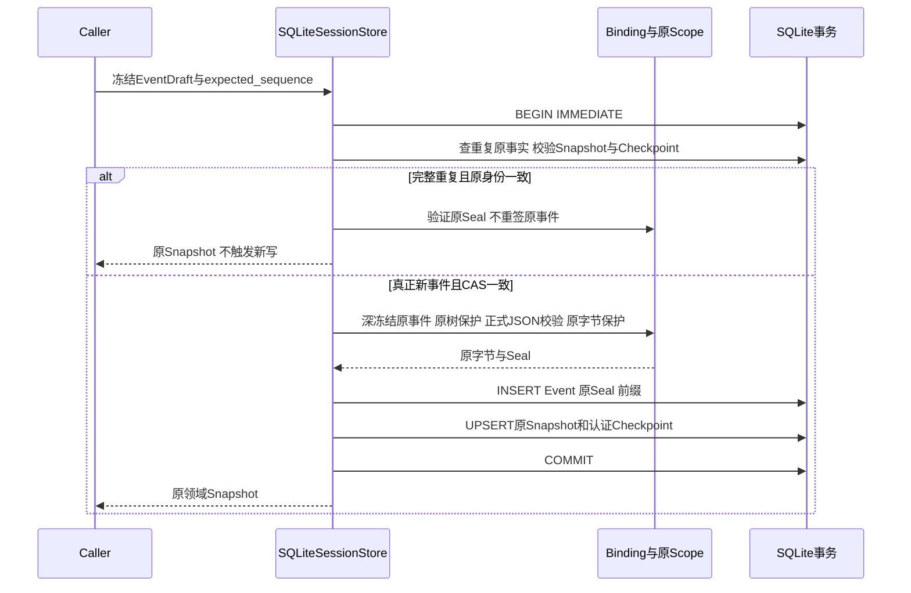
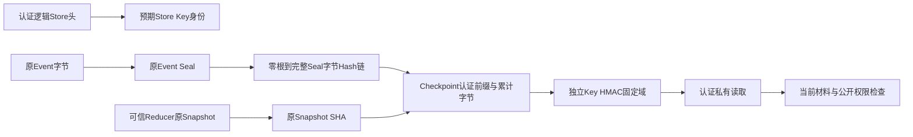
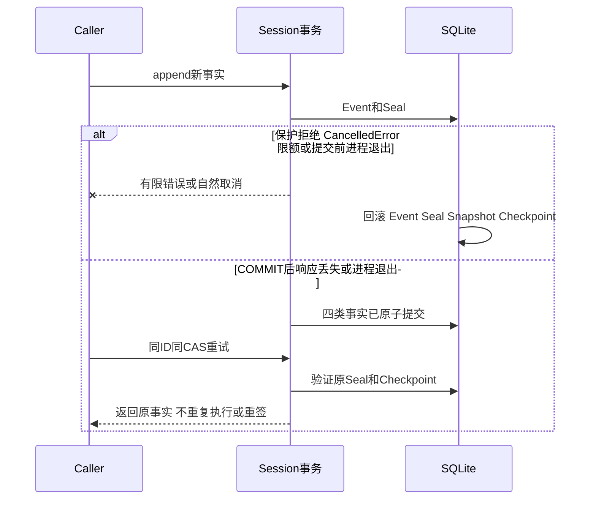

# 0.9.4a 认证SQLite Session总体与详细设计

## 1. 需求背景与设计目标

长期会话需要在凭据轮换、进程重启、响应丢失与投影重建后消费原事实。普通SHA只能检查偶发损坏，
Event Seal候选不能证明同事务提交。当前Scope未命中也不能追认过去未保护的正文。
本设计把真实SQLite新事件CAS、原保护证明、认证事件前缀与派生投影接入同一事务，
拒绝对旧未证明事实补签，并保留全部旧原字节。源码求证见[研究](../research/authenticated-sqlite-session.md)。

目标：每个真正新事件先完整保护，原正文/Seal/前缀/投影/Checkpoint原子提交；
重开绑定同一逻辑Store和独立Key；认证先于反序列化与消费；重建只从原认证事件派生。

## 2. 交付范围与非目标

| 部分 | 当前状态 |
|---|---|
| 显式SessionPublicationBinding与真实SQLite CAS/写读/重放/恢复/Fork/重建 | 已实现并测试，属于正式库装配合同 |
| Migration 0029、逻辑Store认证头、事件证明侧表与投影Checkpoint | 已实现，迁移不补签历史 |
| Artifact混合事务中的Session事实 | 已接入；真实Runtime归档发布和故障回滚测试 |
| Artifact正文/二进制持久来源证明与跨Epoch重开 | 未完成，不放宽原Epoch |
| 默认产品Root、独立Key Backend、密钥备份迁移与三平台正式安装 | 未完成 |

显式装配需要独立32字节密钥、稳定Key ID/逻辑Store ID和冻结Scope，不生成临时产品密钥。
当前默认Root仍使用兼容无认证装配；不能从库测试推导产品历史授权已关闭。
认证库正常重开不允许省略Binding。它不保护故意绕过私有API的宿主、不认证Tenant/物理路径，
不检测整Thread及证明一起删除或整库有效回滚，不提供正文加密和任意DLP。
0.9.4a、0.9.5/Beta和0.9.6均不因本合同关闭；12件Archive来源权利继续阻塞发布。

## 3. 总体架构与信任边界



Store持有事务，不持有模型Credential；Binding拥有独立MAC密钥副本与原Scope。
Event Authority只返回安全新事件候选；SQLite负责新身份/CAS与提交事实。
派生投影由已认证Checkpoint和可信Reducer扩展，不对巨大聚合再次扫描后声明原历史安全。
来源认证与当前出口保护是不同权限，MAC通过不授予模型或UI公开许可。

## 4. 新写流程与提交时序



CAS之前冻结调用方Draft，重复Event必须先验证原正文/Seal，再比较原载荷与序号。
新事件只支持既有v20；不允许用签发器升级v1～v19，也不追认既有v20旧行。
UUID与时间等严格嵌套合同在JSON模式校验；Python模式验证原生JSON会错误拒绝Artifact引用。
先深冻结、完整原生树预算，再正式编码/有界JSON验证与完整JSONL检查；检查扩展不能改写提交字节。
同一事务也覆盖Artifact发布器调用的私有追加入口。任何中途拒绝都回滚已写入的新事实和证明。

## 5. 数据流程与认证结构



Event Seal绑定Store/Thread/Event/Sequence/Schema/原Scope和完整正文摘要。
`prefix[n] = SHA256(bytes(prefix[n-1]) + SHA256(original_event_seal_bytes))`，零根为64个零。
无密钥prefix侧表值单独没有信任；Checkpoint用独立MAC绑定最终prefix、完整原Snapshot摘要、
Thread、序号、累计事件正文及Seal字节数和Projection v20。认证事件重放从零根重算并核对最终Checkpoint。
MAC声明使用固定域`harnessix.session-store-publication/v1`，用途区分store_identity/derived_projection，
规范JSON不含tag。原Event和Snapshot保持现有Pydantic编码，不对正文重排、清理或替换。

## 6. 数据结构与数据库字段设计

Migration 0029只增加三张空表，现有表列顺序、Event Schema与公开DTO不变：

| 表 | 字段 | 解释与约束 |
|---|---|---|
| agent_publication_store | singleton/Seal BLOB | 单一逻辑身份认证头；证明1～4096字节 |
| agent_event_publications | event_id/prefix_sha256/Seal BLOB | Event外键；Hash64位；新事件同事务侧表 |
| agent_projection_publications | thread_id/Seal BLOB | Snapshot外键；认证Checkpoint随投影同事务更新 |

| 声明字段 | 类型 | 业务解释 |
|---|---|---|
| version/purpose | strict int 1/固定Literal | Codec和用途不允许无版本降级或混用 |
| store_id/key_id | UUID | 逻辑身份与稳定独立Key，不是路径/租户/API Key版本 |
| thread_id/sequence | UUID/strict int 1～100000 | 原Thread和完整已提交前缀长度 |
| history_bytes | strict int 1～64MiB | 累计原Event字节＋原Seal字节；写读同一预算 |
| projection_version | strict int 20 | 当前可信Reducer投影合同 |
| prefix_sha256/snapshot_sha256/tag | 小写Hex64 | 完整前缀、原投影和MAC |

Key不入库；Scope的原材料也不入证明。当前Scope身份可与旧Scope不同，只要独立Key和逻辑身份正确。
Enrollment只在Session、Artifact及证明侧表均为空时进行；未知旧数据不扫描、不补签、不删除。
省略Binding打开含认证头的库失败关闭；故意剥离所有认证状态并用无保护独立宿主读取不在本合同承诺内，
因此默认产品最终必须强制Binding，不能永久保留产品级静默兼容。

## 7. 类与接口设计、源码职责

| 类/接口/方法 | 输入与输出 | 职责 |
|---|---|---|
| SessionPublicationBinding | Store ID、Key ID、32字节Key、PublicationScope | 持有认证生命周期，不拥有事务/自动托管 |
| StoreIdentitySeal | 闭合strict/frozen DTO | 逻辑Store身份MAC |
| ProjectionPublicationSeal | 原Thread、prefix、history_bytes、原SnapshotHash | 已认证前缀的派生事实，不直接授予公开许可 |
| SQLiteSessionStore(publication=...) | 可选库装配；SessionStore端口不变 | 单写者宿主、事务与现有公共行为 |
| append_in_transaction | 内部AppendStore端口、DB、FrozenBatch、CAS | 原事实幂等、新事件保护、共同提交 |
| verify_snapshot/checkpoint | 原行及预期Thread | MAC和身份先于Pydantic消费 |
| authenticated_events | 原Thread及after → 原事件列表 | 有界完整前缀认证，返回所需后缀 |
| save_projection | 原Thread、prefix/history_bytes | 普通投影与认证Checkpoint共用事务 |

原SQLite类的重复/追加和投影保存逻辑按单一职责移入sqlite_append/sqlite_publication，
不增加旧超长类额度、结构阈值或包依赖循环。没有复制另一套Store、没有HTTP/Worker服务。
Binding.close清零两份自己拥有的可变Key副本；不承诺擦除调用方不可变Key副本。

## 8. 各读取、恢复与Fork入口

| 入口 | 校验及行为 |
|---|---|
| get_thread/list_thread_page | 同事务认证Snapshot原字节、Checkpoint身份、证明数量与链尾，再原Schema/数量/普通SHA检查 |
| recovery_threads/thread_ids | 验证全部Snapshot后筛选Active/身份，不能只信未认证JSON状态 |
| events(after) | 完整原前缀MAC/字节/连续序号/累计字节和链头校验，原事件解析后只返回after后缀 |
| fork | 来源Snapshot及原完整前缀、来源CAS、Fork合同，然后目标新事件正常签发 |
| rebuild及递归Fork恢复 | 原Checkpoint身份/链头仍须有效；原事件逐个认证后可信Reducer派生新投影 |
| 重复追加/响应丢失重试 | 验证原事实后直接返回，不用新Scope替换旧Seal |

Snapshot认证证明可信写入时的派生来源，不逐次重扫所有历史Event正文；事件正文被改而投影原字节不变时，
可信原Snapshot仍可独立消费，events/rebuild/重复追加则拒绝篡改正文。
损坏Snapshot正文与普通SHA可从独立认证的原Checkpoint/事件恢复；Checkpoint/MAC本身缺失或损坏不可补签。
没有声称完整目录防删除、物理DB防替换、多租户授权或有效整库回滚检测。

## 9. 错误分类、可观测性、取消与恢复时序



| 错误 | 语义 |
|---|---|
| publication_history_unproven | 缺失/错误身份/MAC/正文/原前缀/旧数据，固定消息，无补签 |
| publication_key_unavailable | 关闭/无Key打开认证库，不能静默生成替代Key |
| public_output_secret_leak等既有有限保护码 | 新原正文未通过保护，不持久提交 |
| publication_history_limit/timeout | 私有认证资源超限，读不改库，写同事务回滚 |
| sequence_conflict/event_conflict | 原CAS/幂等语义，不新增事实 |
| storage_unavailable | 原SQLite异常边界；IO诊断不作为业务正文输出 |

读重放最多100000事件、64MiB累计正文＋证明，循环10秒检查点；写侧同时限制，避免提交永久不可重放事实。
原单事件保持1MiB/Seal4KiB，投影认证64MiB；SQLite读取证明/事件/投影使用有限substr，
不声称能硬抢占恶意同步扩展、SQLite busy handler或整个多阶段操作具有同一10秒总期限。
观测只记录稳定码、版本、摘要、计数与布尔不变事实，不记录Key、原Prompt、完整历史或外部诊断。

## 10. 核心伪代码

```text
initialize_with_binding:
  BEGIN IMMEDIATE; 验证原迁移1～28摘要；只增加空29证明表
  如果无认证头且任何Session/Artifact/证明非空：拒绝并回滚
  否则只为空库建立独立Key认证头，或验证原头；COMMIT

append_new:
  冻结Draft；BEGIN IMMEDIATE；校验原Store身份
  若全部重复：认证原事件、比对原载荷/序号、认证原Snapshot；返回原事实
  认证原Snapshot与Checkpoint；CAS；取原prefix/history_bytes
  对每个真正新v20事件：原树/JSON/字节保护；更新原prefix和累计预算
  同事务写原Event及Seal；可信Reducer生成原Snapshot；同事务更新Checkpoint；COMMIT

replay_and_rebuild:
  验证原Checkpoint；从零根逐个认证原Event，禁止先解析未经认证正文
  校验完整前缀/序号/累计字节；必要时验证Fork来源前缀
  可信Reducer只派生投影；保留全部原Event/Seal，不用新Scope追认旧材料
```

## 11. 部署、迁移、回退与兼容

显式库调用方持有Binding完整生命周期，并保证Key/Store ID/Key ID跨重启稳定。
默认产品的自动托管、POSIX owner/no-follow、Windows原生保护/ACL、密钥备份/跨机器迁移尚未接入。
兼容无认证库迁移只产生空证明结构，原旧Event/Artifact/Projection字节保持不变。
不为已有无证明历史自动激活认证；需要后续正式隔离/恢复流程，不静默丢弃。
旧28版程序不能打开29版Schema，不提供清除迁移标记、删除证明或退回无保护程序的安全回退方案。
认证SQL备份会复制证明，但仅DB复制不等于密钥可恢复；当前维护密钥绑定与安装/Beta验收仍开放。

## 12. 测试、证据与剩余风险

42项真实SQLite测试覆盖原字节重开、幂等、错Key/ID、无保护重开、旧历史拒绝、投影/事件/证明篡改、
普通SHA同时替换、原事件重建、原前缀截断、Scope失效、父取消、资源拒绝、写读预算一致、
两个真实连接CAS、三类真实OS进程退出、响应丢失及真实Runtime/Fork/Artifact混合事务。
旧迁移退出、已固定1～28摘要、Legacy Transcript和Artifact不回写验证同步追加29摘要，不能减少原断言。
Linux全量运行；macOS/Windows新增实际执行tests/session与认证Store测试的CI入口，状态需按相应Revision记录，
仅本机通过不代表三平台验收。固定源码与候选Wheel、完整回归和六文件证据另行冻结。

仍须完成：默认Root强制Key Backend、全部Provider材料、Artifact正文/二进制持久证明、
Owner归属/阻塞、SDK Scope-loss相关ID、编号TM攻击、远端MCP、12件Archive权利、三平台真实安装与真实Provider成本。

## 13. 源码阅读顺序

1. [store_publication.py](../../src/harnessix/session/store_publication.py)：身份、派生Checkpoint、用途域与Key生命周期。
2. [publication_seal.py](../../src/harnessix/session/publication_seal.py)：深冻结与严格JSON模式、原事件保护候选。
3. [sqlite_append.py](../../src/harnessix/session/sqlite_append.py)：原事实幂等、真正新CAS、认证预算和同事务追加。
4. [sqlite_publication.py](../../src/harnessix/session/sqlite_publication.py)：Enrollment、Snapshot/前缀认证与有界恢复。
5. [sqlite.py](../../src/harnessix/session/sqlite.py)：真实公共Store入口、原事务与Fork生命周期。
6. [Migration 0029](../../src/harnessix/session/migrations/0029_authenticated_session_history.sql)、[测试](../../tests/agent/test_authenticated_store.py)。
