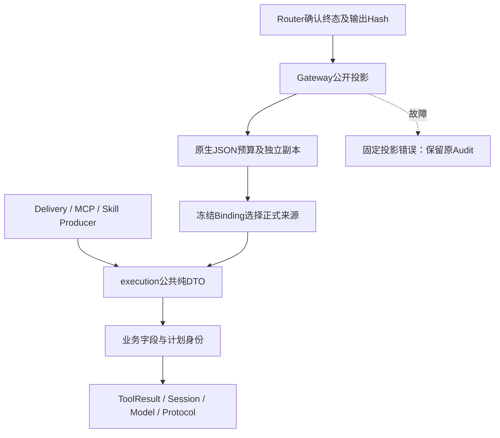
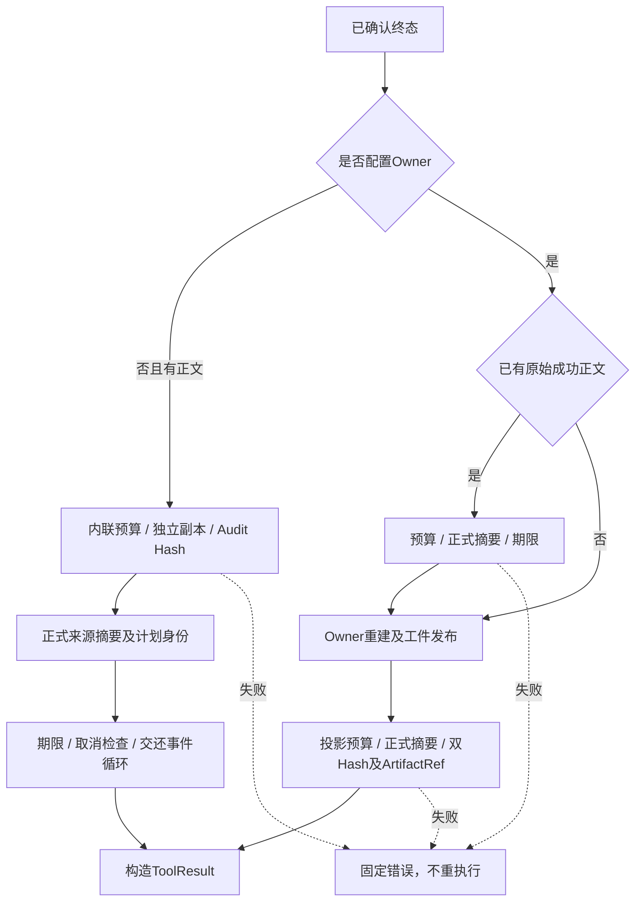
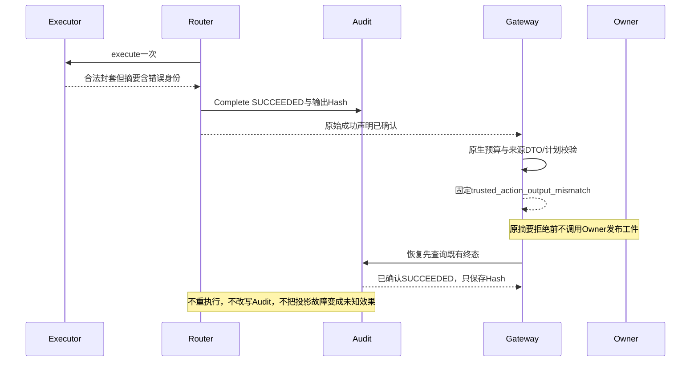
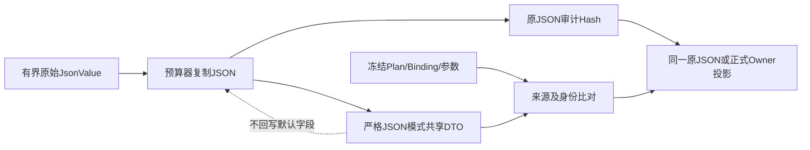

# 0.9.4a 正式来源成功正文合同与内联投影详细设计

## 1. 需求背景与源码研究

[原始返回预算](m09-4a-executor-output-budget.md)证明合法、有界的v1封套可以进入Router终态；
[Owner双摘要投影](m09-4a-success-output-projection-boundary.md)证明正文及正式ArtifactRef与审计一致。
两者都不证明正文的业务字段、计划身份和成功语义正确。原实现无Owner时直接build_result；
有Owner时仅Process/Eval验证正式摘要，Patch、Git、MCP和Skill在Hash相同时仍接受额外诊断字段。

独立旧版`9ffbb846e63f10cb8c22dbea8ec2abe3a877c3cf`归档运行50项矩阵，验证实际模块从归档导入后，
得到35 failed、15 passed；失败是未拒绝错误正文，不是导入、审批或夹具故障。矩阵覆盖Patch、Git、
Skill加载、Skill资源及MCP，分别走内联和Owner投影；Owner标量原本已经被拒绝，不能计成新修复。

| 源码入口 | 已确认事实及约束 |
|---|---|
| [terminal_result](../../src/harnessix/trusted_actions/agent_gateway_output.py) | 无Owner的成功正文缺少与Owner路径等价的公开合同与独立预算。 |
| [validate_public_projection](../../src/harnessix/trusted_actions/public_outcomes.py) | Hash相等只证明内容一致；Process/Eval以外缺少来源专属字段/计划校验。 |
| [failure_family](../../src/harnessix/trusted_actions/public_outcomes.py) | 来源由冻结Binding决定，不从正文中的version或错误码选择权限。 |
| [WorkspacePatchActionExecutor](../../src/harnessix/delivery/trusted_action.py) | 成功摘要固定五字段，transaction_id为执行计划UUID，files为事务成员数。 |
| [GitPushReceipt](../../src/harnessix/delivery/git_contracts.py) | 正式收据包含自身摘要，成功远端OID必须等于批准的local_oid，身份来自Push意图。 |
| [MCP结果规范化](../../src/harnessix/mcp/runtime.py) | 生产接入点仍负责实际SDK结果、捕获outputSchema及已解析Secret脱敏，本层验证公共封套。 |
| [SkillRegistry](../../src/harnessix/skills/runtime.py) | 正文及资源已有正式DTO、内容摘要、目录和清单身份；不另造一套宽松合同。 |
| [共享纯合同](../../src/harnessix/execution/public_tool_contracts.py) | 同一DTO供Producer和公开边界复用，避免trusted_actions反向导入MCP/Skill装配入口。 |

## 2. 设计目标、非目标与取舍

### 2.1 设计目标

1. 正式来源的内联与Owner成功摘要均使用同一字段白名单、严格DTO及计划身份检查。
2. 内联也有1MiB、64层、10256节点、128-bit、10秒预算，并绑定当前Audit输出Hash。
3. 已有原始正文时，在调用Owner发布工件之前验证正式摘要；恢复只有摘要Hash时验证Owner重建值。
4. 投影失败只阻断公开，保留已确认Audit SUCCEEDED、Operation完成和实际Owner事实，不再次执行。
5. 复用现有DTO、固定错误码、CancelToken及预算器；不新增服务、数据库表、授权注册表或依赖豁免。
6. 旧公开导入路径仍导出同一类，已有JSON Schema逐字节不变；新增Patch成功摘要Schema。

### 2.2 非目标与开放边界

- **custom成功JSON仍无字段级正式合同，本设计不授予或追认其公开权限，也不声称关闭该缺口。**
- DTO限制已登记字段，不判断全部自然语言内容的敏感性；MCP内容、Skill正文仍为外部不可信数据。
- 不替代实际Producer Secret版本解析/脱敏、工件所属域与正文校验、Owner/Store内部资源预算。
- 不硬中断无await同步代码或吞取消扩展，不把控制时钟测试当作RSS或恶意代码隔离证据。
- 不回写历史Audit链，不追溯清理旧Session正文，不关闭0.9.4整体或跨平台安装/Beta/真实Provider验收。

### 2.3 方案取舍

| 方案 | 结论 |
|---|---|
| 合法JSON加Hash即授权 | 否决：合法且与Audit一致的错误事务、额外字段仍会公开。 |
| 为每个入口复制DTO/过滤字段 | 否决：规则漂移且丢弃字段会使原Hash失去意义。 |
| trusted_actions直接导入扩展Owner合同包 | 否决：包级eager导出形成真实导入环及新增反向依赖。 |
| 懒导入并登记新依赖豁免 | 否决：仍保留静态逆向依赖，不解决合同层级。 |
| 纯合同下沉到execution，原路径显式重导出 | 采用：消费者和Producer共用同一个类，公开序列化不变。 |
| 新增可配置输出Schema并立即放行custom | 本设计不采用；通用扩展授权须单独建立正式合同和迁移证明。 |

## 3. 总体架构与模块边界



`public_tool_contracts`只依赖execution基础合同、tools的Revision和Pydantic，不导入Router或装配。
`builtin_success`只做来源专属字段/身份检查；`public_outcomes`共用来源选择及Process/Eval语义；
Gateway负责期限、取消、Audit Hash、Owner调用及结果发布。执行及恢复状态机不归上述DTO所有。

## 4. 核心流程及完整文字说明



内联正文先复制为有界原生JSON，核对最后Audit事件终态和output_sha256，再验证正式来源。验证后
仍检查单调时限及取消，交还事件循环一次，才构造ToolResult。没有正文时仅返回效果元数据，
不能编造缺失正文；此路径不表示曾经公开的正文获得新授权。

Owner路径已有原始正文时先验证，错误摘要不能触发Owner发布；只有Hash的恢复不伪造正文，Owner
返回后重新检查正式摘要、ArtifactRef及双Hash。原JSON用于Hash，不把DTO默认字段重写进去。

## 5. 时序图与效果语义



内联公开故障后，实际Runtime查询已有SUCCEEDED；无Owner时可以补齐无正文的成功效果元数据，
Turn仍以固定投影错误FAILED终结。批准写调用不因“正文不可公开”而标记动作UNKNOWN；这与Owner
重建也持续失败的既有补偿路径不同。测试必须断言Audit、Session效果和Turn状态各自语义。

## 6. 数据流程及领域契约



| 来源 / 类 | 重点字段与权限 | 与计划绑定 |
|---|---|---|
| PublicWorkspacePatchOutput | transaction_id、files 1～16、state=published、origin执行/恢复、diff_sha256；extra禁止 | UUID等于plan_id，files等于批准参数的files数量。 |
| GitPushReceipt | push_id、remote_name/ref/OID、URL摘要、观察时间及自身digest | 五个身份/结果字段等于批准意图；成功OID等于local_oid；原收据digest校验。 |
| PublicProcessOutputSummary | 固定流观察摘要、profile、process_id、终态及退出码，不含stdout正文 | profile和UUID绑定计划，Process成功为exited/零退出。 |
| PublicEvalOutputSummary | Process摘要加passed，禁止任意诊断字段 | Eval非零测试退出仍是基础设施成功；passed由终态和退出码派生。 |
| McpToolCallOutput | 固定version、content、structured_content、is_error | 成功不能is_error=true；实际Tool Schema和Secret由MCP捕获接入点负责。 |
| SkillContent / SkillResourceContent | 目录/清单/名称、正文及摘要、资源相对路径 | 目录和manifest摘要等于调用；名称匹配限定名或basename；资源path等于批准参数；正文Hash由DTO验证。 |

原公开路径的Git/MCP/Skill类是共享类的显式别名，不是子类或复制模型。四个既有输出Schema必须
保持完全相同；Patch新增[正式Schema](../../spec/workspace-patch-output-v1.schema.json)。JSON持久
合同不变，Python类定义位置变更不承诺支持外部pickle；产品存储使用JSON而不是pickle。

## 7. 接口设计、类职责与源码映射

| 接口 | 输入 → 输出 | 职责与失败 |
|---|---|---|
| validate_builtin_success | plan、有限来源、JsonValue → None | Patch/Git/MCP/Skill正式DTO及计划检查，内部验证详情不公开。 |
| validate_success_summary | plan、原JSON → None | 来源选择及统一成功语义；验证失败重建固定KernelError。 |
| _inline_success | state、route、outcome、cancel → 独立Outcome副本 | 预算、Audit Hash、正式摘要、期限/取消；无Owner也不绕过公开边界。 |
| _project_output | Owner及审计双Hash → 有界正式投影 | 已有摘要先验证，再调用Owner，恢复重建后同一合同检查。 |

- [共享DTO及相对路径函数](../../src/harnessix/execution/public_tool_contracts.py)。
- [来源专属校验](../../src/harnessix/trusted_actions/builtin_success.py)。
- [公开来源选择及Process/Eval成功语义](../../src/harnessix/trusted_actions/public_outcomes.py)。
- [内联、预验证与Owner投影](../../src/harnessix/trusted_actions/agent_gateway_output.py)。
- [Git原导出](../../src/harnessix/delivery/git_contracts.py)、[MCP原导出](../../src/harnessix/mcp/contracts.py)、
  [Skill原导出](../../src/harnessix/skills/contracts.py)、[Patch原导出](../../src/harnessix/delivery/trusted_action_contracts.py)。

## 8. 核心逻辑伪代码

```text
inline_success(outcome, current_audit, cancel):
    deadline = monotonic_now + fixed_budget.timeout
    projected = bounded_native_json_copy(outcome.output, deadline, cancel)
    require last_audit.state == route.state
    require hash(projected) == last_audit.output_hash
    validate_registered_builtin_summary(plan, projected)
    checkpoint(deadline, cancel)
    yield_to_event_loop()
    checkpoint(deadline, cancel)
    return outcome with independent projected JSON

owner_projection(outcome):
    if succeeded and raw_summary exists:
        validate bounded raw_summary before calling Owner
    projected = await managed_owner(deadline, cancel)
    require bounded JSON, formal summary and ArtifactRef
    require original summary_hash and artifact_hash match Audit
    publish result without changing effect ledger
```

## 9. 持久化、事务、异常、取消与恢复

- 不新增表、Schema版本或状态机；原Operation Complete已经在投影前持久化。
- 公开校验失败固定trusted_action_output_mismatch，无ValidationError、原值或内部路径。
- 复制/摘要/DTO/同步校验前后使用单调检查点，真实asyncio期限覆盖异步协作点。
- Token取消原样传播TurnCancelled；父Task取消在yield处到达，不伪装成合法成功结果。
- Store重开继续按原Plan/Binding及Audit查询；确定成功不Execute/Reconcile，未知效果走既有Owner核对。
- DTO不是新的事实权威；Artifact Store、Secret Producer和外部实际效果仍各有所属Owner。

## 10. 安全边界、部署及兼容

不允许正文自报来源来选择合同，不使用错误码前缀授权，不截断或删除未知字段后重新Hash。
保留已有__all__和JSON Schema，不增加反向包依赖/环、不放宽可读性阈值或公共API检查。
无需新中间件，随现有Python应用部署；macOS/Linux/Windows的纯DTO与JSON检查相同，实际POSIX
Patch写入和Container Owner的运行能力仍按各自已验证平台边界装配，不把合同测试当作Windows写入证明。

## 11. 可观测性与错误分类

复用既有Runtime Span/Metric和有限KernelError分类；不新增正文、Schema、绝对路径或原始异常标签。
字段、计划或Hash不符统一trusted_action_output_mismatch；预算和期限分别为既有output_limit与
output_timeout。Token/父Task取消保持既有取消信号。Session、Protocol及下一次模型历史均不保存
校验详情；完整审计继续记录已确认终态和原摘要，不用遥测错误覆盖效果账本。非空Span/Metric
与实际Protocol回放分别核对，零命中扫描不能代替这些公开面断言。

## 12. 完整测试矩阵与验收

| 测试 | 范围及事实 |
|---|---|
| builtin_success_contracts | 5来源×5正文形状×2交付，正式正例保留原JSON，额外字段/身份/缺字段/标量拒绝；同Hash不放宽；Audit不变。 |
| process_success_projection | 原48项Owner/恢复矩阵增加48项内联；Profile/UUID/终态/退出码/passed均严格校验。 |
| builtin_success_runtime | 只读和批准写×3错误正文，实际Runtime/Session/Audit/Scripted请求/Protocol SDK/非空OTel；无第二次模型请求。 |
| inline_success_lifecycle | 控制时钟超时、Token/父Task取消、当前事件Hash/状态/缺Hash和独立副本；确认效果不被重执行。 |
| public_tool_contracts | 原导出为同一类、四个既有Schema完全一致、六种入口顺序分别在新Python进程导入。 |

专项、相关回归和完整回归不得相加；完整回归须在固定测试树运行，文档/证据门禁在冻结后重放。
基线、生成合同、Mypy、Ruff、包依赖及Secret检查不得放宽，未跟踪攻击草稿不提交、不计为TM验收。

## 13. 限制、风险及后续收口

custom字段授权与迁移、Secret值/版本的端到端公开证明、Owner/Store内部资源和工件所有权仍开放；
公共MCP封套不替代动态Tool outputSchema捕获或远端OAuth/Egress。许可证12件、TM编号攻击、
远端MCP、真实三平台安装/Beta与Provider发布证据仍是整体0.9完成条件。
