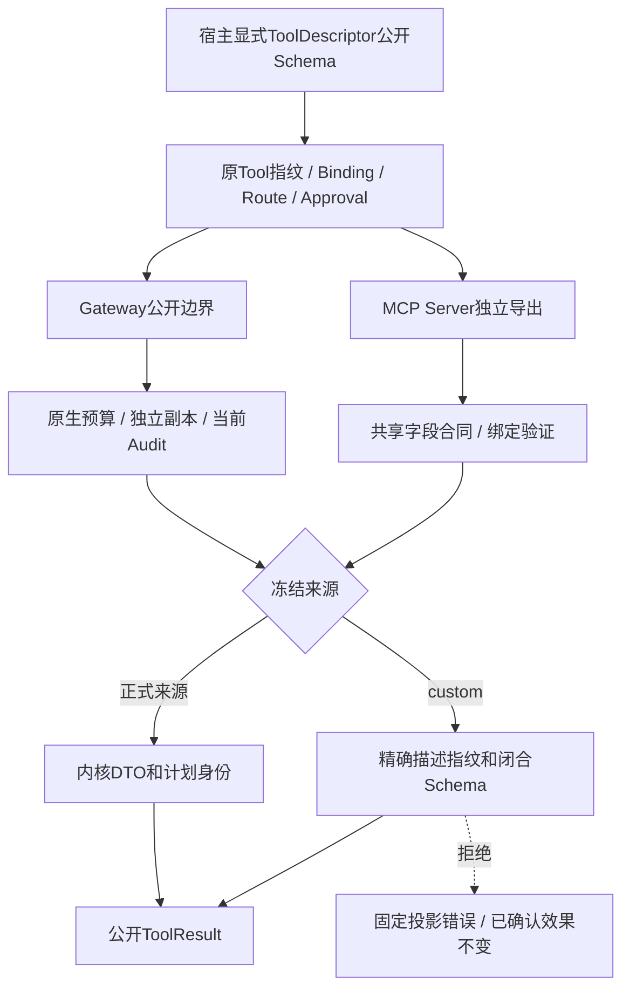
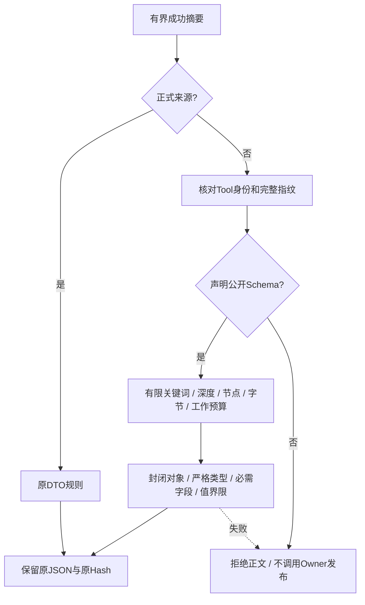
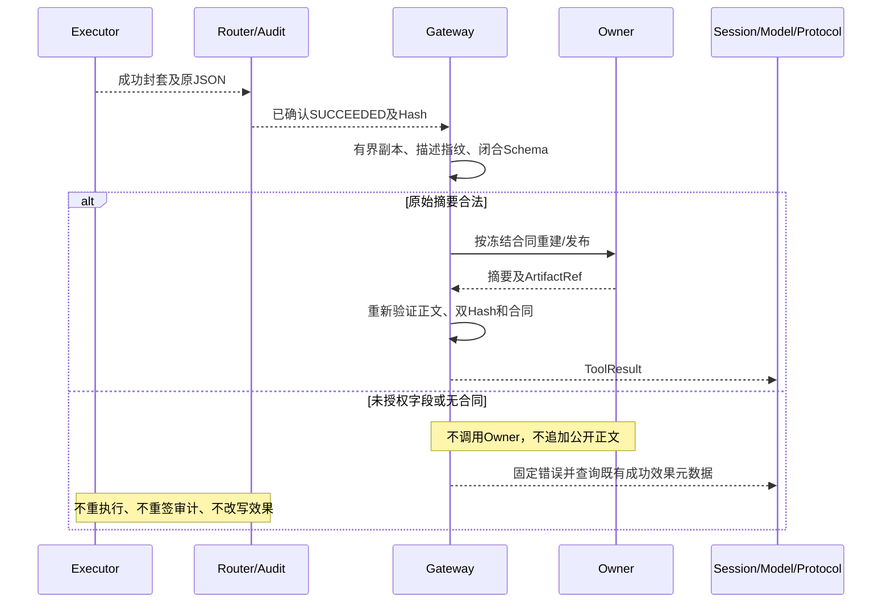
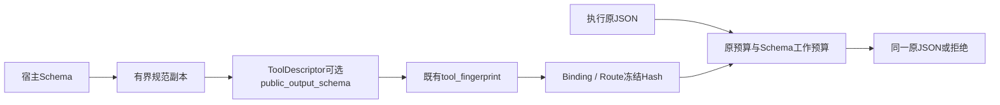

# 0.9.4a 自定义Action成功正文公开合同详细设计

## 1. 需求背景与源码研究

整改前[Gateway](../../src/harnessix/trusted_actions/agent_gateway_output.py)已对正式来源实行DTO和
计划身份检查，但[validate_success_summary](../../src/harnessix/trusted_actions/public_outcomes.py)
的custom分支放行任意合法JSON。实际SQLite Runtime的只读与批准写观察证明未登记诊断进入
Session、下一次模型请求及Protocol；审计只记录Hash。因此“受信执行器”和“Hash一致”不是
正文公开授权。MCP Server独立导出同样存在任意正文入口；本实现给McpExportedTool增加精确绑定的完整描述，
在实际MCP Client链独立验证，不借用Gateway验收。

## 2. 设计目标、范围与取舍

为ToolDescriptor增加显式public_output_schema，冻结进现有Tool指纹、Binding、Route及审批链。
未声明custom合同默认拒绝非空正文；正式来源继续使用内核DTO，外部Schema不能放宽。正常内联、
Owner发布前检查和恢复重建后检查共用合同。原生有界副本、Hash、Artifact、期限与取消不变。

不另建权限表、服务或配置豁免。不在Binding或Plan里增加默认字段，不重写历史指纹。Schema属于
已经由Tool指纹冻结的描述；恢复必须有精确匹配的当前描述，否则只允许查询经过验证的历史终态
效果元数据，不能公开正文或调用新执行器。无合同旧描述序列化时省略新增字段，维持既有指纹。

Schema使用有限闭合JSON Schema子集而非无限制Draft解释器；不得用正则、本地或外部引用、否定
和未限定组合造成递归或指数验证。字段授权不等于Secret值安全，后者保留独立发布阻断。

## 3. 总体架构与模块边界



领域层只处理纯Schema与JSON，不依赖Runtime、扩展或Owner。Gateway负责计划身份、期限、取消
与交付。MCP Server先由Router执行原始返回预算，再在独立公开出口检查完整描述及同一字段合同，
不经过Gateway的Owner回调或内联期限实现。Router继续负责效果事实；不把公开失败反向改写成执行失败。

## 4. 核心流程及完整文字说明



新增字段只描述可公开正文，不允许返回值自报权限。Owner原摘要在发布前校验；恢复没有原正文时，
先验证可用的精确描述，再核对重建摘要。Schema验证不插入default、不删除额外字段、不强制转换。

## 5. 时序图及效果语义



## 6. 数据流程、数据结构与领域契约



拟定合同字段为public_output_schema，可缺省；缺省序列化不新增null。新声明包含在完整描述Hash内。
对象必须properties及additionalProperties=false；required必须唯一且为已声明属性。数组须有items和
有界maxItems；字符串须有有界maxLength；数字禁止bool冒充，浮点必须有限。支持有界nullable/anyOf
和有限标量enum/const，不支持引用、正则及任意关键词。根为封闭object；顶层artifact保留给内核。

Schema及正文验证共享显式工作计数，任何分支消耗计数而非重置预算。Schema为32KiB、16层、512节点；对象最多128属性，数组maxItems最多256，字符串maxLength
最多4096个Unicode字符，anyOf最多8分支；验证工作最多32768次节点访问，各分支不重置。所有错误只返回固定分类，不回显属性名、Schema、输入或第三方异常。

### 6.1 契约重点字段

| 字段 | 来源、约束与含义 |
|---|---|
| public_output_schema | 宿主ToolDescriptor声明，None省略且不授权custom正文；严格原生JSON捕获独立副本。 |
| tool_fingerprint | 既有完整描述规范SHA-256；有Schema时包含其全部原语义，不独立配置授权Hash。 |
| binding.tool_fingerprint | 规划前必须与当前目录一致；Route/审批继续冻结它，不增加默认Plan字段。 |
| properties/required | 递归显式列出可公开字段和必需字段，不过滤原正文，不填默认值。 |
| additionalProperties | 每层object都必须false；顶层artifact只属于内核正式引用。 |
| maxItems/maxLength | 数组及字符串必须声明上限；min界限不得超过max。 |
| enum/const/anyOf | 有限标量和最多8个分支；所有正文分支共享工作预算。 |
| remaining | 单次验证剩余节点工作量；小于0失败关闭，不把控制预算的测试当作硬终止。 |
| McpExportedTool.descriptor | 完整宿主描述独立复制；构造/目录/调用检查绑定Hash，公开同一标准outputSchema。 |

## 7. 类职责、接口设计与源码映射

| 接口 | 职责 |
|---|---|
| [ToolDescriptor](../../src/harnessix/domain/models.py) | 可选公开Schema及旧描述序列化保持；完整Hash包含新声明。 |
| [纯Schema捕获/验证](../../src/harnessix/domain/public_output_schema.py) | 不执行回调，不联网，不查外部引用；闭合字段和有界工作。 |
| [public_success_schema / validate_success_summary](../../src/harnessix/trusted_actions/public_outcomes.py) | 正式来源规则优先；custom要求精确描述与已声明Schema。 |
| [terminal_result/_project_output](../../src/harnessix/trusted_actions/agent_gateway_output.py) | Schema与Hash、取消、期限、Owner发布时机结合。 |
| [recover_action及旧终态观察](../../src/harnessix/trusted_actions/legacy_projection.py) | 描述漂移只读历史终态效果；非终态保持拒绝，不执行或对账。 |

### 7.1 接口入参、出参与失败

`capture_public_output_schema(value: object) -> dict[str, JsonValue]`只接受原生有限树，拒绝引用、
正则、组合膨胀及非法关键词；返回独立合同副本。`validate_public_output(schema, value,
checkpoint=None) -> None`不返回变换正文，只以ValueError拒绝，调用方包装固定内核错误。

`public_success_schema(plan, descriptor)`验证来源、完整身份及Hash，返回有界合同；正式来源
返回None以继续使用内核DTO。`validate_success_summary`接收可选描述及检查点，未声明custom
合同拒绝。`terminal_result`描述只由宿主状态提供，不从工具输出解析。MCP Server调用
同一摘要函数，不生成第二套权限。`project_legacy_terminal`只返回无正文的确定效果元数据或None。

## 8. 核心逻辑伪代码

```text
检查取消及公开预算
按冻结Binding选择来源
若正式来源：验证内核DTO
否则：要求描述身份和完整指纹等于冻结Binding
      要求显式公开Schema；验证有限闭合合同及原JSON
      任一错误：固定投影错误，Audit效果不变
若有Owner：原摘要通过后才调用；重建值再次核对合同和双Hash
提交同一原JSON；不插入默认值，不删字段
```

## 9. 持久化、异常、超时、取消与恢复

不新增表或修改旧Audit。未声明的旧Tool描述、Binding和Route必须在独立旧版归档中比对原JSON
和全部摘要。旧custom非空正文不再获公开权限；已确认效果仍可用只读元数据补齐。新Schema使工具、
计划和审批指纹变化，旧批准不授权新合同。历史终态查询必须核对原调用、来源、Plan身份和原审批请求身份；只接受succeeded/failed，
不读取或重新授权旧正文、ArtifactRef或原Artifact权限；
ready/pending/running/unknown不利用兼容路径执行或对账。

校验和Owner共用既有10秒后置期限；工作预算限制同步验证。Token/父Task取消传播，不能承诺硬
终止任意恶意同步回调或已发布工件回滚。改变合同需重新注册并重新批准，不以历史Hash重签升级。

## 10. 安全边界与部署

无新增网络/依赖/服务。Schema不赋予代码执行或Secret权限；字段内的自然语言仍不可信。
ToolDescriptor增加可选Python/JSON字段；未声明字段的旧描述保持原序列化和Hash，
显式新字段不能由旧版ToolDescriptor解析。既有生成Schema、Binding/Route/Audit和Agent Protocol
不变；这不承诺持久化过的旧Session正文已经追溯清理。Secret值/版本
端到端证明、Owner内部预算/工件所有权和TM编号攻击仍开放；不标记整个0.9.4a或0.9完成。

## 11. 可观测性

公开固定trusted_action_output_mismatch及既有预算/超时代码，不携带原Schema或正文。实际Runtime
验证Session、Scripted请求历史、Protocol、非空OTel和Audit；禁止把空Trace当作通过证据。

## 12. 完整测试与验收

先独立旧版负例，再执行缺合同/额外字段/错误类型/缺字段/嵌套扩展/伪造指纹矩阵，覆盖内联、Owner
原发布及恢复。验证有界Schema关键词、引用/循环/组合、工作预算和取消；正常嵌套/nullable正例需
保持原JSON。验证旧指纹、旧Audit重开、合同漂移终态与非终态、审批不可复用、实际Runtime各公开
表面和写效果不重复。冻结实施Revision、稳定测试树、完整回归、文档渲染及完整Manifest。


### 12.1 验收矩阵与适用边界

| 用例 | 源码及事实范围 |
|---|---|
| 45项纯合同 | [有限Schema](../../tests/domain/test_public_output_schema.py)：嵌套/nullable、严格整数/布尔、闭合、引用/循环/字节/节点、共享工作量；控制预算不代替硬隔离。 |
| 8项无合同 | [公开拒绝](../../tests/trusted_actions/test_custom_success_authorization.py)：只读/批准写×内联/Owner×诊断/标量；已有错误摘要不调用Owner。 |
| 25项声明/迁移/生命周期 | [来源矩阵](../../tests/trusted_actions/test_custom_success_schema.py)：正常/Owner/恢复×6形状、重开目录变化的确定终态与非终态、Token/父Task取消及两模块时钟超时。 |
| 6项Runtime | [真实公开表面](../../tests/trusted_actions/test_custom_success_runtime.py)：只读/批准写×无合同/额外字段/合法；SQLite、实际SDK Protocol、非空OTel与Scripted历史。 |
| 1项旧二进制 | [独立归档重开](../../tests/trusted_actions/test_custom_success_legacy_binary.py)：f7566bf创建SQLite计划/审批/Audit，当前版本读原JSON和全部Hash，无再执行。效果Producer为合成Executor，不声称真实外部写。 |
| 4项MCP增量 | [实际MCP Client](../../tests/mcp/test_server.py)：无描述/额外字段/合法正文和错误描述Hash；低风险只读实际Client链，不是远端HTTP/OAuth。 |

独立旧版f7566bf在归档中运行8项无合同矩阵，核实实际Gateway模块路径后8 failed，0.23秒；
失败为未拒绝公开或Owner已被调用，不是构造或导入错误。专项和完整回归均在最终冻结报告登记，
不得相加。真实模型请求0，未跟踪攻击草稿不提交、不计TM。

## 13. 剩余边界与发布阻断

字段合同不是Secret值安全证明，也不赋予执行任意Python的隔离保证。已持久化旧Session/历史
Artifact的公开视图、Secret轮换/缺版本、Owner/Store同步阻塞与工件所属域、其他扩展公开错误
和TM编号攻击仍需关闭。许可证12件、远端MCP身份/OAuth/受管出口、三平台真实安装/Beta及
Provider发布证据保持阻断；本设计不将整个0.9.4a或0.9认定完成。

## 13. 版本绑定验收结果

实现`7adfa3ea86b3b3961e67df9140895e48f2aab8fc`，稳定测试树`99247d85c0b6fd1ff748022d01c77a0ad35d0d23`；
完整回归4641 passed/32 skipped，391.79秒；专项91（89新增）、相关631均与完整回归重叠。
四幅设计图及验收报告一图已实际渲染和目视检查，
[统一验收目录](../validation/custom-success-2026-09-27-v1/README.md)冻结输入、产物Hash、独立负例、
旧SQLite兼容及完整回归。合法字段含正式Secret绑定值的实际Runtime观察仍为开放缺口；
许可门禁12件未通过，当前实现CI未验收，整个0.9.4a/0.9未完成。
