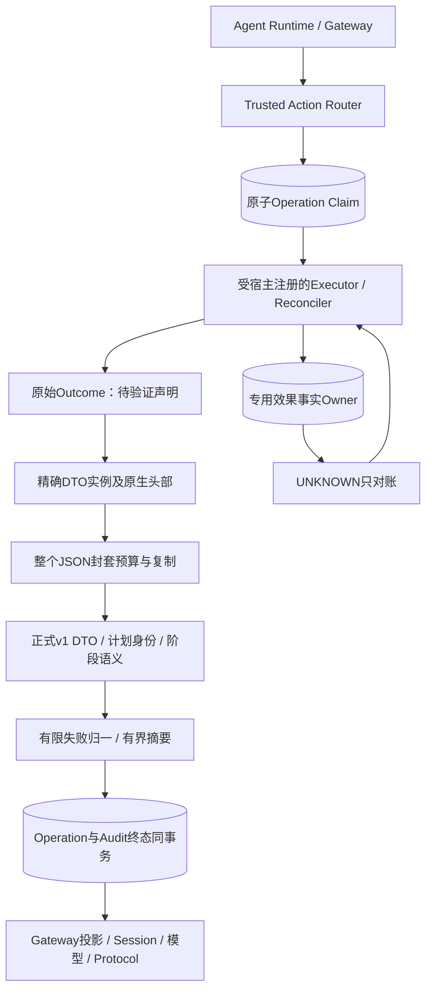
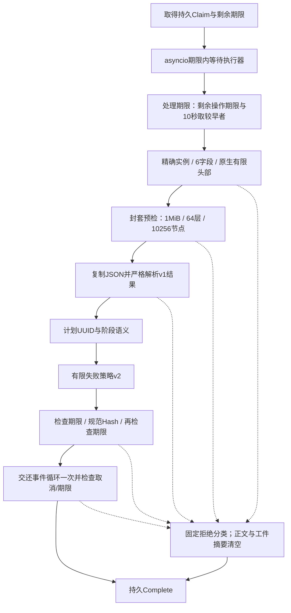
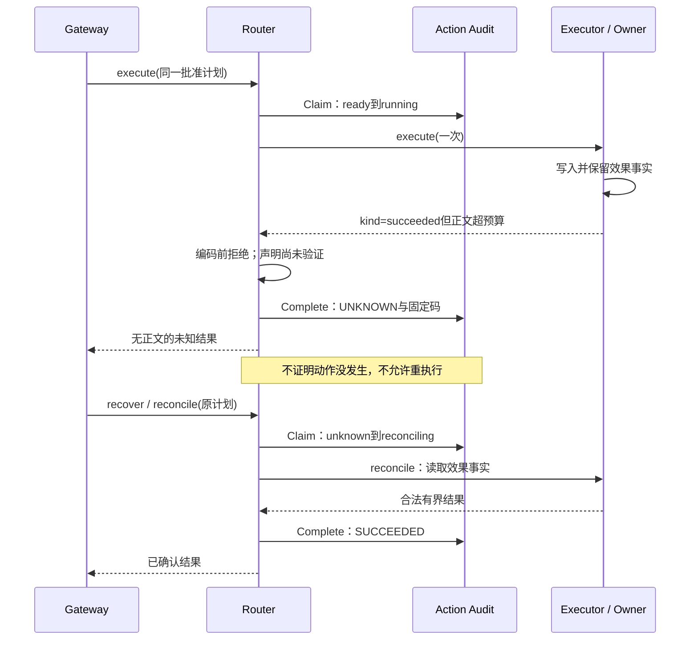
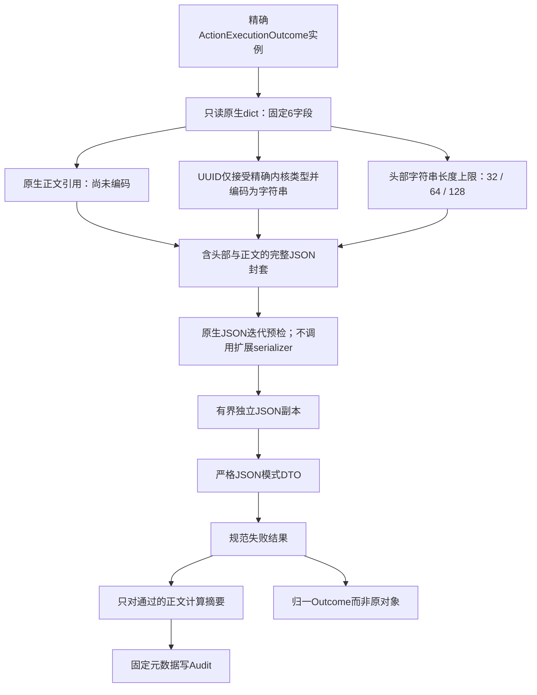

# 0.9.4a 执行器原始返回合同与处理预算详细设计

## 1. 需求背景与源码研究

[Owner投影预算](m09-4a-success-output-projection-boundary.md)在Router已经完成Audit之后运行。
前序`070efdc34c5ca6c13adc435ef8d1891482a2ecaf`的`execute_action/reconcile_action`仍先调用
执行器返回实例的`model_dump_json()`，再进入Pydantic往返；大文本、宽树、深树及自定义DTO
serializer因此在预算前被处理。执行器await之后的归一和`canonical_digest`也不在操作期限内。

格式合同为JsonValue并不提供资源合同；构造出ActionExecutionOutcome实例也不是校验通过凭证，
`model_construct/model_copy`可绕过字段验证，冻结Pydantic对象内部的JSON仍可被改动。
本切片从24项Execute只读/写入、Reconcile写入负例开始：字节、节点、深度、整数、原生类型、
循环、DTO子类与非法头部。不得把异常sanitizer已存在当作原始返回边界已关闭。

| 源码及入口 | 可确认事实与本设计约束 |
|---|---|
| [`operation_router`](../../src/harnessix/trusted_actions/operation_router.py) | Claim先持久化，返回后才完成终态；无效结果既有语义为只读FAILED、写UNKNOWN、Reconcile UNKNOWN。 |
| [`ActionExecutionOutcome`](../../src/harnessix/trusted_actions/contracts.py) | v1封套6字段；SUCCEEDED与error_code互斥；external_action_id必须匹配计划。 |
| [`outcome_validation`](../../src/harnessix/trusted_actions/outcome_validation.py) | 新增精确类型/原生头部预检、整个封套预算、正式DTO及同步期限检查。 |
| [`output_budget`](../../src/harnessix/trusted_actions/output_budget.py) | 复用已经验证的原生JSON迭代预检和复制，不新增重复遍历器。 |
| [`public_errors / public_outcomes`](../../src/harnessix/trusted_actions/public_errors.py) | 使用有限错误原因和来源阶段分类；公开失败策略增至v2，计划/Binding/v1审计合同不变。 |
| [`_validate_outcome_identity`](../../src/harnessix/trusted_actions/router.py) | UUID必须与冻结计划一致，不能用扩展返回身份代替计划身份。 |
| [`operation_store`](../../src/harnessix/trusted_actions/operation_store.py) | Operation Complete与Route终态同事务；取消/错误也必须完成持久记录。 |
| [`恢复入口`](../../src/harnessix/trusted_actions/agent_gateway_support.py) | UNKNOWN只能走Reconcile；已保存Session未知结果不自动开始新执行。 |
| [`trusted_action_session`](../../src/harnessix/agent/trusted_action_session.py) | Router/Session记账间隙按查询优先修复，Tool Result公开固定错误。 |

## 2. 设计目标、非目标与决策

### 2.1 设计目标

1. 原始返回实例的通用serializer不能成为内核输入边界，编码前拒绝无界及扩展类型。
2. 头部、正文、正式DTO、身份、阶段语义、失败归一和摘要均在返回处理期限中完成。
3. 拒绝原因仅为invalid/limit/timeout，不保存原值、原始ValidationError或内部消息。
4. 超时/取消后不存在“Route仍RUNNING但调用已返回”的正常成功路径；终态和Operation一致。
5. 写入返回无效时只标记效果未确认，通过Owner事实对账恢复，绝不重复Execute。
6. 保持v1计划、审批、Audit Hash链和存储Schema不变；不增加服务或中间件。

### 2.2 非目标与信任边界

- 不限制Executor构造返回对象之前的分配，不硬中断无await同步代码或吞取消的扩展。
- 不把有效、有界的成功JSON视为公开授权；Secret、成功正文合同及其他Store边界仍须治理。
- 不将SQLite终态事务放进可随时取消的I/O操作段；Audit提交仍沿用Store自身锁/错误和恢复语义。
- 不把资源拒绝裁剪为伪造成功输出，不用不完整Artifact替代被拒绝正文。
- 不拆出新的Effect Receipt权威表。当前v1协议中，原始结果只有完整验证后才成为Action Audit
  事实，未通过结果的kind是待验证声明，不是已经确认的效果。已有Owner事实保留用于Reconcile。
- 已经写入Audit的SUCCEEDED与本切片不同：后续Owner投影失败必须保留该事实，沿用ADR0094。

### 2.3 方案取舍

| 方案 | 取舍 |
|---|---|
| 对原始实例先model_dump_json，再检查大小 | 否决：已经无界编码，且会调用扩展serializer。 |
| 只验证kind头部，截断正文后写SUCCEEDED | 否决：预算并非通过，摘要失真；把未通过v1结果误当完整事实。 |
| 仅给await timeout | 否决：返回后的同步归一/编码/摘要可绕过期限。 |
| 新增独立Effect Receipt/反馈错误表 | 当前不采用：改变v1效果权威与恢复迁移语义，已有Operation/Audit和Owner对账足以保守收敛。 |
| 原生封套预检+正式DTO+共享期限 | 采用：复用已验收预算器，失败不伪称写入未发生，不重执行，不新增持久权威。 |

## 3. 总体架构、模块职责与源码位置



Router仍是动作计划和Audit入口，`outcome_validation`只提供无I/O的返回合同边界；预算器不依赖
Owner或SQLite。实际效果事实由既有专用Owner保留，UNKNOWN恢复只调用Reconcile，图中的返回
循环不是重执行。公开Tool Result继续从已归一Outcome形成，不直接引用原始实例。

## 4. 核心流程、时序与数据流

### 4.1 返回处理流程



只读拒绝进入FAILED，写入拒绝进入UNKNOWN，Reconcile拒绝仍UNKNOWN。未校验正文的sha256和
Artifact SHA均不写入终态；不会把上一个正常摘要误带入后置超时或取消的记录。

### 4.2 写效果发生、返回拒绝与恢复时序



真实硬退出发生在大返回拒绝之后、Complete之前时，Operation仍ACTIVE/Route RUNNING；重开
Store后先Interrupt到UNKNOWN，再读取Owner事实完成对账。缺少终态不会成为再Execute的依据。

### 4.3 数据流与预算边界



预算计整个封套，含固定头部的键名、值、标点和正文；不是仅正文1MiB。根深度为1，字典键也
计节点和深度。因封套占容量，靠近旧正文1MiB上限的返回值可能被拒绝，不通过提高门槛掩盖问题。

## 5. 类、接口、数据结构与重点字段

### 5.1 v1封套与头部预检

[`_outcome_payload`](../../src/harnessix/trusted_actions/outcome_validation.py)只接受精确
`ActionExecutionOutcome`类，拒绝DTO子类，不调用实例的model_dump/model_dump_json。
`vars(raw)`必须为精确原生dict，字段集合必须恰为6个；先验证键为原生str，再做集合比较。

| 字段 | 编码前约束 | 正式DTO与业务含义 |
|---|---|---|
| spec_version | 原生str，≤128字符 | 必须为harnessix.action-execution-outcome/v1。 |
| kind | 原生str，≤32字符 | succeeded/failed/unknown/manual_intervention；首次Execute禁止直接manual。 |
| output | 允许暂为object，整个封套预算负责拒绝 | 通过后只为独立有界JsonValue或None；有效成功JSON仍不自动证明公开权限。 |
| artifact_sha256 | None或原生str，≤64字符 | 正式DTO要求64位小写十六进制；拒绝结果不采用此摘要。 |
| external_action_id | None或精确UUID | 编码为字符串后在严格JSON模式还原UUID，再与计划精确匹配。 |
| error_code | None或原生str，≤128字符 | 正式码格式、与kind互斥和有限公开策略三层检查。 |

### 5.2 类与接口设计

| 入口 | 输入/输出 | 职责、不变量 |
|---|---|---|
| `OutcomeValidationError` | reason=invalid/limit/timeout | 内核拒绝信号，固定消息；不引用原始ValidationError或数据。 |
| `validate_executor_outcome` | raw object、单调deadline → ActionExecutionOutcome | 原生头部、复用预算器、严格JSON DTO和前后期限核对。 |
| `outcome_checkpoint` | deadline → None或有限超时信号 | 同步校验、归一和摘要后都检查，不依赖loop timer及时运行。 |
| `_validated_output` | Router、Plan、raw、phase、deadline → Outcome和SHA | 身份、阶段、失败归一及摘要的单一流水线，Execute/Reconcile共用。 |
| `_rejection_reason` | 内核异常 → 有限reason | 只读原生异常dict；字段缺失、扩展类型或未知值退回invalid，不使用消息。 |
| `ActionOutputBudget` | 宿主不可变合同 | 复用1MiB/64层/10256节点/10秒/128-bit整数；不增加模型可配置入口。 |

### 5.3 公开失败策略v2

新增9个稳定码，`PUBLIC_FAILURE_POLICY_VERSION=harnessix.public-action-failure/v2`。只扩充
源码持有的内核码表，不动态注册前缀，不修改Plan/Binding/Audit v1合同或Fingerprint。

| 原因 | 只读Execute | 写入Execute | Reconcile |
|---|---|---|---|
| invalid | executor_output_invalid | write_output_invalid_unknown | reconciliation_output_invalid |
| limit | executor_output_limit | write_output_limit_unknown | reconciliation_output_limit |
| timeout | executor_output_timeout | write_output_timeout_unknown | reconciliation_output_timeout |

公开Tool Result沿用固定“未成功/请查询审计”消息，retryable=false。Executor I/O阶段超时/取消仍
使用原有executor_timeout/write_effect_timeout_unknown/reconciliation_timeout等分类；父Task
取消在持久固定码之后原样传播，不能假装正常返回。

## 6. 核心逻辑伪代码

```text
run_operation(plan, phase):
  claim = 原子持久Claim，保存Owner、attempt及UTC期限
  seconds = claim剩余时间
  operation_deadline = monotonic + seconds
  在asyncio.timeout(seconds)内:
    raw = await executor.execute或reconcile
    deadline = min(operation_deadline, monotonic + 10秒)
    拒绝非精确DTO、缺失/额外字段、非法原生头部
    payload = 固定6字段，仅精确UUID转字符串
    copied = 对整个payload编码前预检及有界复制
    outcome = 严格JSON模式解析v1 DTO
    校验计划身份及Execute不能直接manual
    outcome = 有限失败策略v2归一
    检查deadline
    digest = 对已通过且保留的正文计算规范SHA
    再检查deadline
    await sleep(0)，让父Task取消到达
    再检查deadline
  拒绝或异常:
    只读failed / 写unknown / 对账unknown
    固定码，正文及Artifact摘要为空，丢弃任何已计算正文SHA
  在Store原子Complete事务中持久结果
  若收到父Task取消，事务后原样传播
  返回归一结果，而非raw实例
```

异常结果不继承原Artifact SHA；即使错误在计算出digest之后发生，output=None也强制清空局部
digest。Audit Complete不随I/O期限取消，失败则保留ACTIVE操作供既有宿主中断恢复；不伪称提交成功。

## 7. 持久化、异常、安全、取消、恢复与可观测性

1. 大文本/宽树在继续编码和扩栈前拒绝；原生预算在DTO及Hash之前，没有先编码再裁剪。
2. 大整数先bit_length，头部先字符长度，UUID仅精确类型转换；不调用扩展对象格式化或serializer。
3. 10秒涵盖正式DTO、身份、失败归一和摘要；操作剩余期限更短时取较短者。无法硬中断单个同步
   内核调用，但数据量已有限，前后检查可拒绝逾期结果；不声称RSS恒等于1MiB。
4. 返回后的协作点保证父Task取消能在终态提交前处理；持久完成后再传播取消，不遗留正常活动租约。
5. 原始kind无效或预算拒绝是“结果未确认”，不是“实际写入没有发生”。Owner持久事实不被删除。
6. Store重开和实际子进程exit=73验证UNKNOWN只对账、文件效果只追加一次；已保存Session未知
   结果不自动重执行，与显式Router对账/崩溃窗口恢复区分。
7. 使用现有Audit、Session、Protocol、OTel；不新增公开原始错误消息、异常栈或高基数正文属性。
8. 旧Audit链只读取，不重写。新有限码在恢复时保留；公开输出策略v2不修改已有审批指纹。

## 8. 测试、部署与兼容验证

| 测试 | 责任域与证据边界 |
|---|---|
| [executor_output_boundaries](../../tests/trusted_actions/test_executor_output_boundaries.py) | 24项原始返回拒绝，三阶段读写矩阵；真实Router/SQLite配合成返回实例。 |
| [outcome_validation](../../tests/trusted_actions/test_outcome_validation.py) | 精确原生字段、UUID/128-bit整数、独立副本、非法头部/JSON、无serializer、拒绝原因缺失/伪造。 |
| [executor_output_lifecycle](../../tests/trusted_actions/test_executor_output_lifecycle.py) | 确定性单调时钟跨越归一/Hash期限、父Task取消、真实文件追加/Store重开、独立子进程Complete前硬退出。 |
| [executor_output_runtime](../../tests/trusted_actions/test_executor_output_runtime.py) | 实际AgentRuntime、Scripted模型历史、SQLite Session/Audit、Protocol SDK与非空Span/Metric；写未知不发下一次模型请求。 |
| [Router既有回归](../../tests/trusted_actions/test_router.py)、[既有Provider投影](../../tests/trusted_actions/test_projection_lifecycle.py) | Operation原子语义、Owner边界、有限失败策略和合法Product Process/Eval不退化。 |
| [Schema](../../tests/trusted_actions/test_schemas.py) | 预算Schema仅描述扩展用途，字段与v1结构不变。 |

无新部署单元，三平台使用相同Python/SQLite合同；物理子进程用sys.executable和固定模块入口，
不依赖POSIX fork或Shell命令。父Task取消及单调时钟逻辑不依赖墙钟推进；固定版依赖保持锁定。
旧DTO子类和不合法model_construct返回现在拒绝；合法v1 JSON含任意UUID及最大128-bit整数仍
保留数值精度。不同Scope的全量、专项、真实文件和模型脚本证据不能混为真实Provider/Beta验收。

## 9. 验收与剩余范围

完整验收必须有当前代码Revision、稳定测试树、独立前序24负例、完整回归、图形渲染、干净归档
Wheel/sdist、Secret扫描、Manifest和Review Packet。未跟踪tests/security草稿不修改、不提交、不计
TM攻击验收；CI在批次推送后后台进行，不重复手动触发，不以前序作业代替当前矩阵。

本切片关闭正常返回值的编码前预算和返回后处理期限缺口，不关闭整个0.9.4a。有效小型成功JSON
的公开授权/脱敏、Owner/Store内部边界、不协作扩展隔离、许可12件、编号攻击、远端MCP、真实
三平台安装/Beta及实际Provider发布验证仍须独立完成。不得以当前单测通过标记整体0.9或商用完成。
