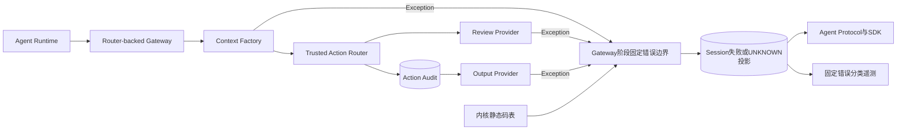
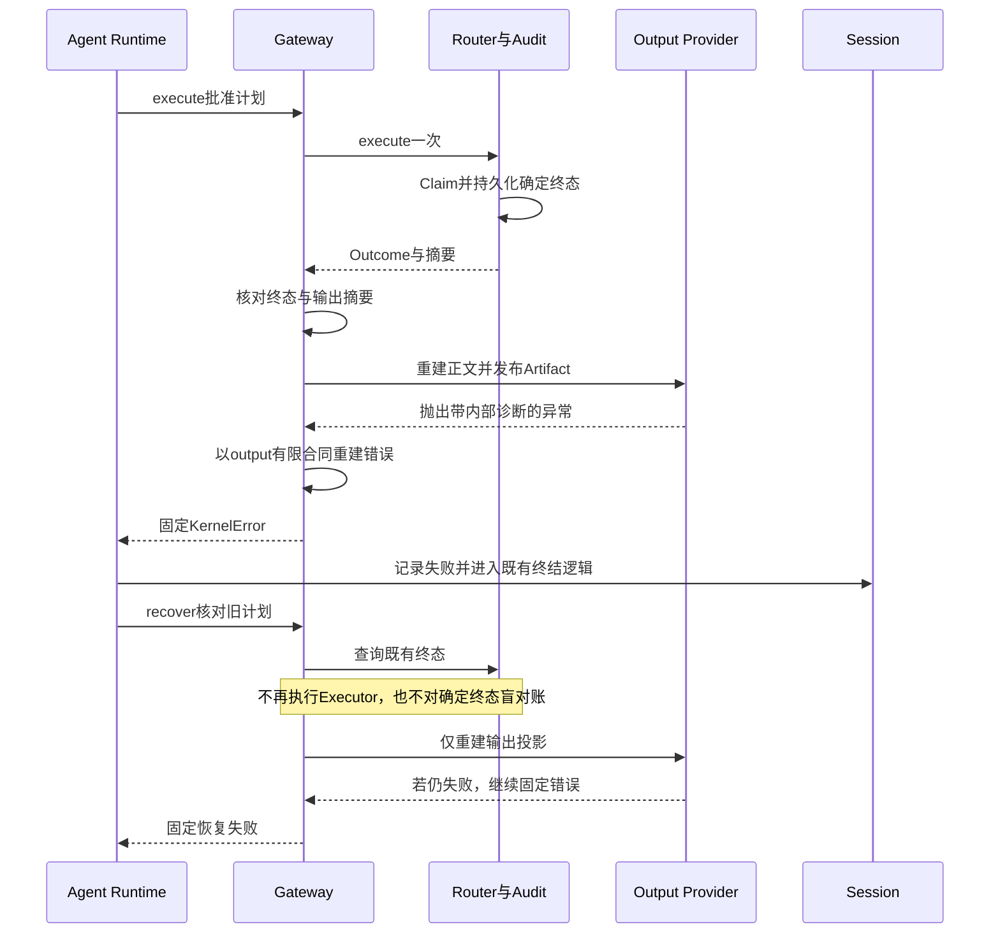
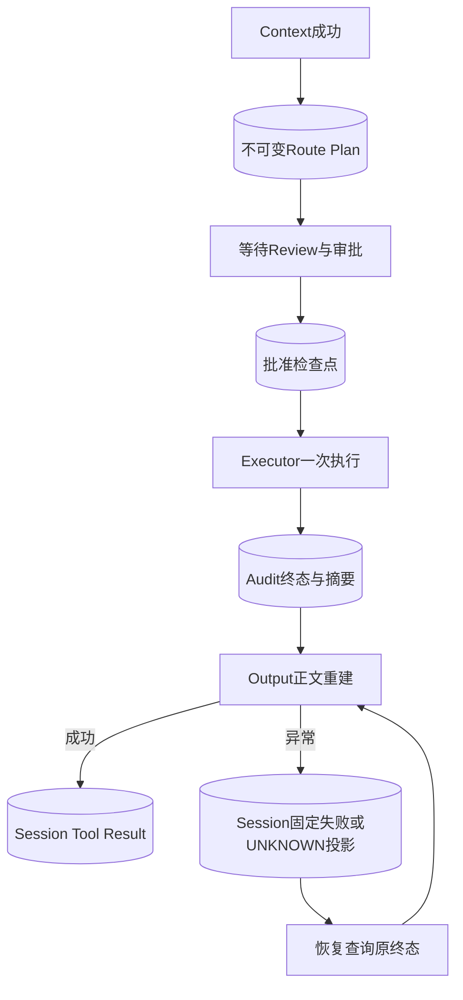

# 0.9.4a Gateway回调公开错误边界详细设计

## 1. 需求背景与缺陷证据

Coding Agent的主调用链为Agent Protocol → Agent Runtime → Trusted Action Gateway → Router。
[计划回调整改](m09-4a-plan-error-trust-boundary.md)已经覆盖Decoder、Resolver和Policy，
但Gateway还调用三个宿主提供的能力：规划上下文Factory、审批Review Provider、终态Output Provider。
这些实现身份由宿主绑定，异常内容却可能来自文件系统、数据库或第三方代码。`KernelError`类型
不约束码、消息和重试提示；在回调边界直接透传，会把内部诊断传播至Session与协议。

源码核对发现：

- [`prepare_action`](../../src/harnessix/trusted_actions/agent_gateway_support.py)
  在进入Router计划前直接求值`state.context(...)`；Router的Resolver异常边界不能保护它。
- 同一函数在Route已保存、尚未批准时直接调用`provider.review(...)`。
- [`terminal_result`](../../src/harnessix/trusted_actions/agent_gateway_output.py)
  在Router成功记账后直接调用`provider.output(...)`，执行期和恢复期共用此路径。
- [`Session恢复桥`](../../src/harnessix/agent/trusted_action_session.py)把捕获的`KernelError`
  转成`AgentFailure`，因此未经清洗的Provider异常并不会因恢复兜底自动安全。

整改前，四条调用路径（context、review、output-execution、output-recovery）分别注入未知
KernelError、跨阶段KernelError、RuntimeError和TimeoutError：**16个负例失败**；
原有Task取消与领域取消语义的**8个对照用例通过**。注入数据仅为合成式样，不使用真实凭据。

## 2. 设计目标、非目标与约束

### 2.1 目标

1. 三类回调异常均在最接近回调的位置重建固定公开错误；不公开原消息、参数、retry提示或异常链。
2. 只允许当前阶段有限码表选择固定消息；Resolver码不能因格式合法就作为Gateway回调错误公开。
3. Task取消与`TurnCancelled`继续传播，不被转换成普通故障或虚假的已完成Tool Result。
4. 投影失败与执行失败严格区分：Output回调失败不得改写已经形成的Router终态、重执行或盲对账。
5. 验证实际Runtime、SQLite双账本、Model历史、Protocol Server/SDK和OTel，不以空导出证明安全。
6. 不迁移Store Schema、不修改Action计划Fingerprint，也不增加独立HTTP/Worker服务。

### 2.2 非目标

本设计只治理**抛出的异常**。Provider成功返回的正文、Executor返回的结构化Outcome、Store自身
故障以及自定义Gateway实现是独立边界；不能把本专项的通过作为这些边界全量安全的证明。
stdout/stderr、测试诊断、Diff和MCP业务正文可能合法包含代码与路径，不能为清洗异常而整体删除。

不实现通用动态错误注册器，不修改全部KernelError构造器，不自动重试失败的回调；也不增加
新的回调超时配置。TimeoutError注入证明错误归一，不证明回调获得了新的执行时间上限。

## 3. 源码研究与架构决策

| 来源 | 事实 | 决策与取舍 |
|---|---|---|
| [`Gateway核心`](../../src/harnessix/trusted_actions/agent_gateway_support.py) | Context在保存Route前运行；Review在保存Route后、批准前运行。 | 两个回调分别捕获，Router调用留在Context捕获范围之外，避免误改已有计划阶段分类。 |
| [`输出投影`](../../src/harnessix/trusted_actions/agent_gateway_output.py) | 摘要核对完成后调用Output；执行和恢复共享该函数。 | 在同一位置清洗两条路径，不在Session建立第二份Provider异常分类。 |
| [`CancelToken`](../../src/harnessix/agent/cancellation.py) | Task取消是BaseException；领域取消是Exception。 | 不捕获BaseException；显式先重抛TurnCancelled，后捕获Exception。 |
| [`Process Owner`](../../src/harnessix/product_config/process_action.py)、[`Eval Owner`](../../src/harnessix/product_config/eval_action.py) | 输出从持久Lease与正文重建，再核对Audit摘要；已知损坏码具有业务价值。 | 保留Output阶段的process_not_terminal、process_output_corrupt和trusted_action_output_mismatch固定分类。 |
| [`Patch Review`](../../src/harnessix/product_config/workspace_patch_review.py) | 非法Review和完整Diff超限产生确定错误码；发布Artifact可能配额不足或状态冲突。 | 保留Review阶段的确定码及两阶段共享的Artifact发布错误，不保留任意内部消息。 |
| [`Artifact发布`](../../src/harnessix/artifacts/sqlite.py) | 发布受到所属Session、配额、序号和审批绑定约束。 | 固定消息保持原分类；所有重试提示默认false，避免诱导重新执行副作用。 |

实现身份可信与错误内容可公开是两件事。静态码表由内核源码持有，不接受Provider或模型在运行时
注册消息。未知码默认失败关闭；新增合法分类须同步来源求证、码表、测试和文档。

## 4. 总体架构与模块边界



Gateway负责回调边界与交互投影，Router仍独占动作状态、批准和执行/对账。`public_errors.py`
只负责公开错误合同，不读取或修改数据库、不检查正文、不持有Provider。Session消费已归一错误，
保留原有终结、恢复和成功守卫；本设计不把动作效果事实转交给UI投影决定。

Gateway核心原来接近600行治理上限。新增异常边界后不放宽阈值，将原纯审批投影函数移到
`agent_gateway_output.build_approval`，只把呈现类型作为显式入参；审批Fingerprint、UUID派生、
Patch/Process互斥检查和持久化顺序均不变。该文件统一持有审批与结果的**数据投影**，核心文件
继续持有编排；没有新增空壳服务或重复实现。源码可读性最终报告据实际代码重新生成。

## 5. 核心流程、时序与伪代码



第一次Output故障不意味着动作未执行。恢复路径可以再次请求**输出投影**，但Executor调用数必须
保持为1；如果投影持续失败，Session可记录UNKNOWN投影，写动作Turn由既有成功守卫保守终结为
INTERRUPTED/uncertain_effect，Audit仍保留原动作确定终态。
两账本表达不同事实，不以修改Audit来制造表面一致。

同样，写动作的Context/Review故障可由原终结守卫形成INTERRUPTED/UNKNOWN，即使测试证明
Executor调用数为0；本设计不修改该既有保守语义。只读Context/Output故障形成FAILED。
测试分别校验回调原始公开分类与最终Turn守卫分类，禁止为使断言通过而改动成功守卫。

```text
prepare:
  校验Call与冻结Binding
  try: context = host_context(thread, turn, call)
  except TurnCancelled: propagate
  except Exception: raise fixed_gateway_error(context) without original chain
  route = router.plan(invocation, context)  # 不纳入context错误捕获
  if route requires approval:
    try: review = await cancel.run(review_provider.review(...))
    except TurnCancelled: propagate
    except Exception: raise fixed_gateway_error(review) without original chain
    return approval_projection(route, review)

terminal_result:
  先核对Route与Audit的输出/Artifact摘要
  try: projected = await cancel.run(output_provider.output(...))
  except TurnCancelled: propagate
  except Exception: raise fixed_gateway_error(output) without original chain
  return original_outcome_with_projected_output
```

## 6. 接口设计与阶段错误合同

`sanitize_gateway_exception(error, *, stage)`位于
[`public_errors.py`](../../src/harnessix/trusted_actions/public_errors.py)。`stage`仅由调用位置决定，
取context、review或output，不从Tool参数、Provider异常或持久正文读取。

| 阶段 | 未知异常固定码 | 固定消息 |
|---|---|---|
| context | trusted_action_context_failed | Action规划上下文构造失败；内部原因不公开 |
| review | trusted_action_review_failed | Action审批预览生成失败；内部原因不公开 |
| output | trusted_action_output_failed | Action终态输出投影失败；内部原因不公开 |

context不开放已知码例外。Review保留`trusted_action_review_invalid`与`action_review_limit`；
Output保留`trusted_action_output_mismatch`、`process_not_terminal`与`process_output_corrupt`。
Review/Output共同保留`artifact_invalid`、`artifact_corrupt`、`artifact_quota_exceeded`、
`artifact_runtime_required`、`artifact_store_mismatch`、`sequence_conflict`、`approval_mismatch`、
`tool_output_too_large`。每个码只选择静态固定消息；允许的码也不继承原消息、retryable或其他字段。

Provider正常返回值和Router摘要校验合同不变。固定错误在Runtime外直接调用Gateway时同样生效，
不能只依赖某个上层Session catch才能获得安全语义。

## 7. 数据结构与重点字段

| 结构/字段 | 所有者 | 含义与边界 |
|---|---|---|
| PublicGatewayStage | 内核 | Literal阶段，不是可扩展的运行时权限。 |
| 阶段码表 | 内核 | code到固定message的有限映射；只公开完全相等的字符串，不按前缀放行。 |
| KernelError.code | 公开错误合同 | 未知时改为阶段默认码；已登记时保留分类但重建对象。 |
| KernelError.message | 公开错误合同 | 只来自源码固定消息，不插入异常文本或参数。 |
| KernelError.retryable | 公开错误合同 | 恒为false，不提供自动重复副作用的提示。 |
| ActionRouteSnapshot.state | Router | context无Route；review仍待批准；output保持原终态。 |
| ActionAuditEvent.output_sha256/artifact_sha256 | Router/Audit | 继续绑定原终态摘要；投影失败不抹去事实。 |
| ToolResultContent.trusted_action | Session | 恢复失败时可为UNKNOWN投影，不倒写动作效果。 |

没有新增持久数据字段、Secret引用或配置项；错误消息没有国际化插值入口。

## 8. 失败、取消、超时与恢复语义

| 故障点 | 公开结果 | 动作不变量 |
|---|---|---|
| Context异常 | 固定context错误 | 不保存Route、不批准、不执行。 |
| Review异常 | 固定review错误 | 已计划但未批准；不得把预览失败当成拒绝或成功执行。 |
| Output执行期异常 | 固定output错误 | 原终态和摘要不变；不重新执行。 |
| Output恢复期异常 | 同一固定output错误 | 只失败输出重建；确定终态不进入Reconcile。 |
| TimeoutError | 当前阶段有限合同 | 不携带超时原文；不自动重试。 |
| asyncio.CancelledError | 原取消传播 | 不被Exception catch转换。 |
| TurnCancelled | 原领域取消传播 | 明确在通用Exception catch之前重抛。 |

## 9. 持久化与数据流程



Context失败在Plan之前，Review失败在批准之前，Output失败在Terminal之后。没有新的跨账本事务；
现有查询优先恢复和摘要校验仍适用。回调异常原文不写入Session/Audit，已形成的Artifact及事务
账本由各Owner按现有合同处理，不能假设一个异常代表回调毫无部分持久化效果。

## 10. 安全与信任边界

只判断错误码字符串的完全匹配，不读取`str(error)`、`repr(error)`、args、路径、argv、Secret或
异常类型名称作为公开数据。重新构造错误并`raise ... from None`禁止下游公开Traceback带原异常链；
Python进程内的原异常对象并未被销毁，本设计不证明内存转储或调试器保密。

已登记码不赋予正文公开资格。正常Provider/Executor正文仍需要原有输出合同、Secret Guard和
Artifact预算；对结构化Outcome未知码及失败正文的完整审查继续作为0.9.4a开放项。

## 11. 可观测性与错误分类

复用现有Runtime Span和低基数Metrics，阶段默认码归入固定分类。没有新增原始异常日志、Provider
标签或动态code标签；测试必须证明存在实际Turn Span与Metric输出后才检查合成式样不出现。
不因移除内部诊断而提供不真实的“业务执行成功”声明，仍使用Audit权威状态排查动作结果。

## 12. 测试与验收设计

[`test_gateway_error_boundaries.py`](../../tests/trusted_actions/test_gateway_error_boundaries.py)
覆盖四条调用路径×未知/跨阶段/普通/超时异常，以及Task与领域取消对照。断言新错误对象、
固定码/消息、无retry提示、抑制异常链、Workspace内容不变、批准边界、Executor/对账调用数与
SQLite原字节不包含注入式样。已有[Gateway测试](../../tests/trusted_actions/test_agent_gateway.py)
继续验证正常输出Artifact、终态恢复、摘要不符和取消后的UNKNOWN。

完整验收另需真实Runtime和五公开面回归、既有相关测试、静态质量与完整受控回归。
本专项通过不关闭整体0.9.4a，不替代受限许可证、三平台安装、编号攻击套件和真实Provider门禁。

新增专项共**57个用例**：33个直接边界/码表/取消用例、15个真实Runtime回调用例和9个
执行/对账异常集成用例。后三类覆盖读写效果差异，不将正常测试输出作为内部异常删除。

| 测试文件 | 验证关系与不变量 |
|---|---|
| [`test_gateway_error_boundaries.py`](../../tests/trusted_actions/test_gateway_error_boundaries.py) | 16项异常负例、8项取消信号对照、3项全部阶段码表检查、6项显式进入/退出握手的异步Task/Token取消；直接调用Gateway执行与恢复，两条Output路径均不重执行。 |
| [`test_gateway_error_runtime.py`](../../tests/trusted_actions/test_gateway_error_runtime.py) | 只读Context/Output及写Context/Review/Output×未知/已登记/普通异常，15个用例；Model请求非空、Session完整重放、Audit状态/原字节、SDK快照/回放、非空Span/Metric。 |
| [`test_operation_error_runtime.py`](../../tests/trusted_actions/test_operation_error_runtime.py) | 只读Execute、写Execute、写Reconcile×Kernel/Runtime/Timeout，9个用例。只读故障真实进入下一次ModelRequest历史；写UNKNOWN不继续模型。Reconcile使用Router已写UNKNOWN、Session未记Result的显式故障点，只对账一次。 |

第一次集成断言曾把所有写故障预期为FAILED、把写UNKNOWN预期为自动对账；实际源码与测试
分别证明INTERRUPTED守卫和“已结算UNKNOWN不自动对账”的语义。修正的是测试前提，而不是
放宽生产控制；写Reconcile场景随后用真实记账间隙注入覆盖，不能把未调用Reconcile的通过当成其证明。

## 13. 源码映射与阅读顺序

1. [`public_errors.py`](../../src/harnessix/trusted_actions/public_errors.py)：阶段有限码表与固定消息。
2. [`agent_gateway_support.py`](../../src/harnessix/trusted_actions/agent_gateway_support.py)：Context、Review位置及Router先后关系。
3. [`agent_gateway_output.py`](../../src/harnessix/trusted_actions/agent_gateway_output.py)：先摘要验证，再调用Output与清洗异常。
4. [`operation_router.py`](../../src/harnessix/trusted_actions/operation_router.py)：异常效果分类与Audit终态，不受投影失败反向修改。
5. [`trusted_action_session.py`](../../src/harnessix/agent/trusted_action_session.py)：公开错误进入Session及UNKNOWN恢复结果。
6. [`test_gateway_error_boundaries.py`](../../tests/trusted_actions/test_gateway_error_boundaries.py)：负例、取消和不变事实。
7. [`test_gateway_error_runtime.py`](../../tests/trusted_actions/test_gateway_error_runtime.py)与
   [`test_operation_error_runtime.py`](../../tests/trusted_actions/test_operation_error_runtime.py)：实际公开面、历史转发及读写差异。

## 14. 部署、兼容与回退

没有环境变量、额外服务或数据库迁移。macOS/Linux/Windows共用Python异常边界，夹具不依赖
宿主路径、进程或网络服务。旧持久计划继续由既有合同读取；本变更不重算Fingerprint。
未知Provider错误码将变为阶段默认码，是明确的公开安全收敛；已登记码保留分类但消息/重试提示固定。
若旧扩展依赖异常原文，应修正扩展的公开合同，不以回退泄漏行为恢复兼容。

## 15. 风险、取舍与开放项

- 结构化Outcome与Provider成功返回正文不在本专项范围；0.9.4a不能据此标记整体完成。
- Review/Output内可能有部分持久化效果；必须保留各Owner的查询优先恢复，不假设异常意味着回滚。
- 未知异常的内部诊断不公开，错误分类精度下降是有意取舍；按固定动作身份查验权威账本。
- Callback没有新增专属deadline；已有外层取消与任务预算继续生效，不能把TimeoutError测试说成新超时功能。
- 三平台远端CI与本地验证分别记录；其他供应链门禁失败仍阻止发布。

### 15.1 已复现的结构化失败结果开放项

离线只读Action由Executor直接返回合法格式但未登记的error_code，以及合成诊断对象，
真实Runtime确实将结果传入第二次Scripted Model请求。未登记码出现在Model历史、Session、
Audit和Protocol事件回放；诊断对象出现在Model历史、Session与Protocol事件回放，Audit
仅保存其摘要。非空Span/Metrics未出现该合成码或正文。使用的是合成故障，无真实模型或凭据请求。

该路径没有抛出异常，不经过本设计的sanitizer。其整改必须明确结构化失败码和正文的宿主合同、
既有Process/Eval合法诊断保留规则、摘要和恢复兼容，不能靠把全部输出删除或把格式校验当成公开授权
完成。此问题已确认为0.9.4a开放缺口，本专项的57项通过不构成关闭依据。
