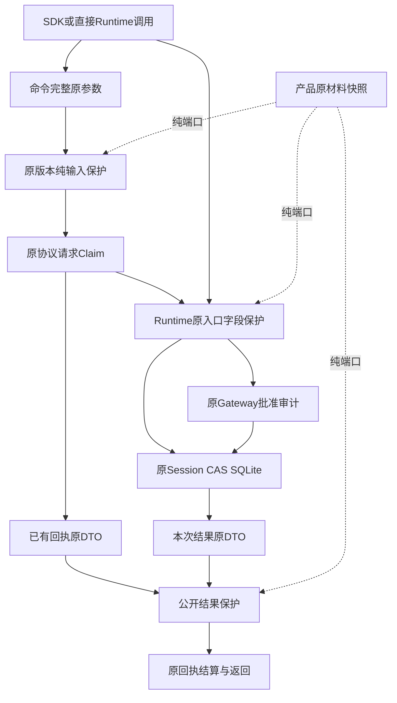
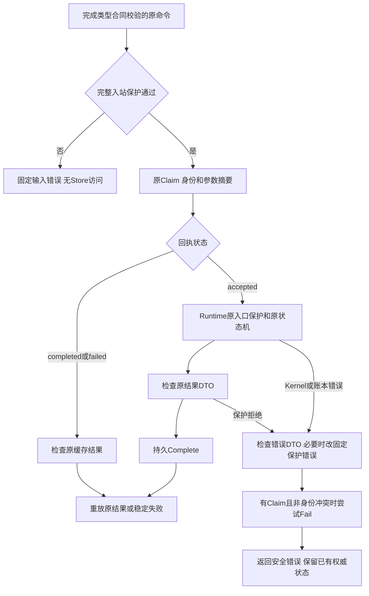
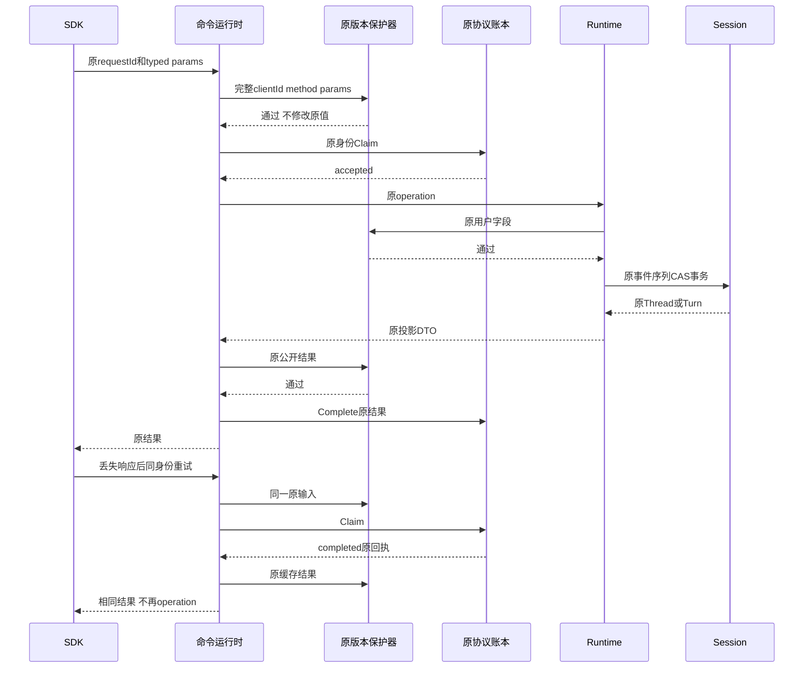
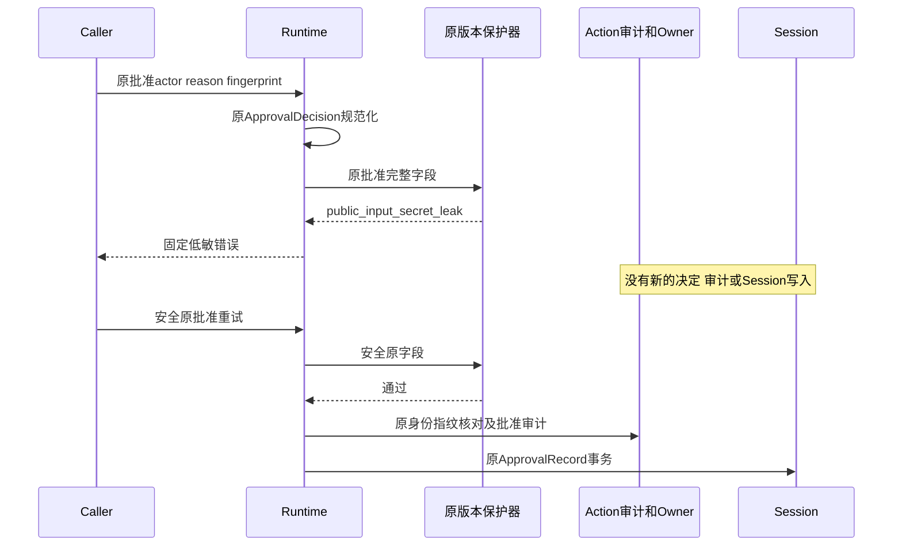
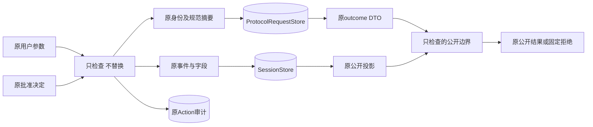

# 0.9.4a 用户输入持久前与协议命令回执保护详细设计

> 本文记录固定`246b353`输入与命令切片。原id/path及查询出口的后续实现见[原帧详设](m09-4a-protocol-frame-publication.md)；冻结证据仍保持原字节和原范围。

## 1. 变更摘要、需求背景与证据

| 项目 | 正式边界 |
|---|---|
| 缺陷 | 出站检查能阻止模型消费已登记值，却晚于用户输入的Session持久化；命令request_id可先进入协议请求账本。 |
| 目标 | 使用产品原版本材料快照，在用户可控正文、身份及决定进入持久事实或审批副作用前拒绝。 |
| 影响 | Agent Runtime输入入口、问答事件构造、App Server命令结算；不增加服务、数据库或执行权限。 |
| 兼容 | 原正文、身份、Hash、事件顺序、CAS和Schema不变；新增稳定拒绝语义。纯嵌入未配置保护器仍兼容。 |
| 发布单元 | 同一Python发行物，无数据库迁移；不能以回滚该保护实现为安全回滚方案。 |

独立干净源码`45b801a0db99764b4ddcefa5da83a6ec9a12387e`观察使用实际Runtime、SQLite、
AgentClient和InProcessAgentTransport，Provider是确定性替身：

- 直接prompt路径：0次Provider消费，但原输入已进入Session、SDK Replay及SQLite；序列增加9。
- SDK request_id路径：命令回执、Session与Replay都保存原值；Provider替身消费1次，序列增加11。
- 这些观察不代表真实网络模型、完整产品Root、其他操作系统或任意凭据泄漏检测。

[版本绑定证据](../validation/input-persistence-2026-09-28-v1/contract-facts.json)保存事实和脚本摘要，
不保存凭据、原请求正文或本地业务目录。前序[模型文本证据](../validation/model-text-publication-2026-09-28-v1/README.md)
保留原字节，不以新结果覆写历史缺口。

源码研究定位本产品三个边界：`AgentRuntime._accept`直接追加原输入，`reply_question`直接结算问答，
`_reply_approval`可先写Trusted Action审计再写Session；`AgentApplicationService._command`原先在保护前Claim。
既有[原版本公开保护决策](../adr/0095-versioned-secret-publication-scope.md)和
[模型原文保护](../adr/0098-model-stream-publication-boundary.md)是复用依据，不复制上游Agent Loop。
固定本地Codex `a0dcfe2ada3f5bbd5059a34c0fc6fac244741a67`的
[`secrets/src/sanitizer.rs` L4–25](https://github.com/openai/codex/blob/a0dcfe2ada3f5bbd5059a34c0fc6fac244741a67/codex-rs/secrets/src/sanitizer.rs#L4-L25)
使用有限正则做best-effort正文替换，不构成本产品原输入、批准或持久身份授权。
本设计保持原值并拒绝命中，不将替换后的正文绑定到原审批指纹，也不复制上游代码。
上游输出保护不蕴含本产品用户输入安全；本次结论来自以上真实本地调用链。

## 2. 设计目标、非目标、方案与架构取舍

验收目标：

1. `_accept`覆盖立即/延后Turn及Retry；检查原prompt、request_id、预算与有效Trace后才进入锁、幂等读取和接受事务。
2. create/fork/archive/steer/question/approval原用户字段进入持久化或批准副作用前检查；调用方原Trace在观测操作前检查。
3. 命令整体参数在ProtocolRequestStore任何访问前检查；原结果与已有completed/failed结果在发布前检查。
4. 所有拒绝保留已有Thread、等待状态、Session序列和Action审计；固定低敏错误、期限和取消可验证。
5. 以职责提取减少Runtime/Service热点，不放宽原可读性阈值。

| 方案 | 取舍 |
|---|---|
| 一律替换为`_commit` | 否决：锁内再次加锁会死锁，而且无法覆盖先发生的Owner/Action审计副作用。 |
| 只在Provider请求处过滤 | 否决：用户输入与request_id已经落库，Replay和回执可以提前公开。 |
| 将正文替换为掩码、继续批准 | 否决：改变原输入、批准身份、指纹和审计，不再是原任务。 |
| 检查参数摘要而不是原字段 | 否决：摘要不能证明request_id或缓存结果安全。 |
| 入口原字段检查＋回执原DTO检查 | 采用：共享原版本Scope、既有失败/取消和Store合同；副作用边界明确。 |
| 每次检查重新读环境 | 否决：环境轮换不代表当前运行中的原值；继续复用产品Scope快照。 |

非目标：历史Session授权或清洗、跨重启Seal、任意编码DLP、未登记材料、Scope物理安全擦除、
同步恶意宿主硬抢占、全部Protocol原始帧出口、全部Provider凭据、三平台真实安装或整个0.9发布验收。
JSON-RPC id及非法参数键的错误路径回显已由独立测试确认开放，必须单独治理。

## 3. 总体架构与模块边界



`agent.input_publication`仅将既有检查错误映射为输入命名空间，不再维护一份Secret扫描规则。
`agent.question_events`只构造五条确定性事件，不读Store、不验证业务状态、不执行Tool。
`app_server.command_runtime`负责Claim、缓存重放、结果保护和Complete/Fail；
`service`仍是协议到Runtime的薄命令装配，`AgentServiceError`由原service导入路径显式重导出。
没有新增一级包依赖边或依赖环；Runtime不导入Secrets实现，Scope由产品宿主反向装配。

## 4. 核心流程图与完整文字描述



先类型验证，再保护完整命令，所以类型验证之前的原始帧不能据此获得安全声明。
入站失败发生在Claim之前，既不创建accepted请求，也不调用Fail。Claim成功后，completed/failed旧回执原DTO
先检查；若拒绝，已完成回执不改写成失败，账本状态冲突按原规则保留。
accepted请求不检查空outcome，不把结构上的JSON null当作业务结果。
新结果检查先于Complete和after_result回调；拒绝不调用回调。Runtime副作用可能已完成，因此不能据此自动重做操作。

## 5. 正常、失败与恢复时序图



重放只省略业务operation，不省略当前已登记值检查。重启后恢复需要产品重建Scope；
这不是旧正文历史版本授权证明。同一身份不同原参数仍为idempotency_conflict，不覆盖原回执。



保护在读取历史Turn并创建approval Span前完成。身份、过期、状态和指纹核验仍由原方法完成；
保护通过不代表批准通过，更不授权自动执行。原Router先决定、Session后提交的崩溃恢复协议保持不变。

## 6. 数据流程图与数据所有权



原参数全体只在内存检查，不作为一份新数据库存档；账本仍只保存原params摘要、request_id和原结果。
纯保护器不能写Store、变更参数或增加工具权限。已登记命中只产生固定错误，不保存命中字段和值。
旧库中已经存在的材料不会由本设计清洗；拒绝重放不等于删除磁盘副本。

## 7. 类设计、接口设计、数据结构与关键字段

| 类/接口 | 责任与生命周期 |
|---|---|
| `AgentRuntime.validate_public_input(value)` | Runtime打开状态下，以独立CancelToken检查操作原JSON；不借用其他活跃Turn的Token。 |
| `AgentRuntime.validate_public_output(value)` | 命令结果/缓存及Fork原快照检查；不是跨重启历史授权接口。 |
| `protect_input(protection,value,cancel)` | 复用`protect_json`；仅翻译有限错误码，不吞Token/父Task取消。 |
| `PublicOutputProtection.assert_public_json` | 原同步纯端口；checkpoint必须检查期限和取消，原材料集合由Scope固定。 |
| `execute_command` | 有界Claim/缓存/执行/结算控制；result_model按原Schema还原，after_result只在安全结果后调用。 |
| `question_answer_events` | 确定性UUID5与固定五事件顺序；原子事务仍由Runtime和Session拥有。 |
| `AgentServiceError` | 原稳定code/message/retryable；原service公开导入路径保留，不增加Schema字段。 |

| 结构/字段 | 来源、意义、约束与保护点 |
|---|---|
| prompt / text / answer | 原用户文字；TextContent上限1000000字符，answer为1..4000；保护按实际UTF8字节和扫描工作预算拒绝。 |
| request_id | 原幂等身份，不能用掩码替代；命令1..256，检查先于Claim及Runtime事务。 |
| client_instance_id | 原UUID；命令整体检查，仍作为账本复合身份，不转作Secret版本身份。 |
| request_fingerprint | 原规范输入摘要；保留原prompt、预算、执行模式与retry_of；不替代原文保护。 |
| budget | 原Turn限额，步骤/Token/秒数/输出字符/每步Tool Call；检查实际TurnStarted JSON，不放宽或改单位。 |
| trace_context | 原W3C carrier；traceparent与tracestate检查先于新run/retry观测Span，实际有效carrier也经接受检查。旧历史Trace读取不是此次授权。 |
| actor / reason / fingerprint | 原批准决定和身份；规范化后先检查，再进入Gateway审计和Session；不补造安全决定。 |
| workspace / archive.reason | 原生命周期用户字段；create/archive持久前检查，不把路径保护当作Workspace权限校验。 |
| ThreadForked.snapshot | 原继承快照整体DTO；当前登记值命中则拒绝Fork，不复制出新Thread；原历史保留。 |
| outcome | 原ProtocolRequestRecord公开结果；completed/failed检查，accepted null不产生公开结果授权。 |
| sequence / expected_sequence | 原Session CAS事实，拒绝前不增长；问答安全成功仍恰好增加5条事件。 |

## 8. 核心业务伪代码

```text
accept(prompt, request_id, budget, trace):
    content = original_text_content(prompt)
    start = original_turn_started(original_fingerprint, budget, effective_trace)
    protect_input({start, content})
    with original_thread_lock:
        check_archive_identity_and_retry_safety()
        original_CAS_append(start, item_started, item_finished)

command(original_params):
    protect_input(original_client_id_method_and_full_params)
    claim = original_ledger_claim()
    if claim.completed_or_failed:
        protect_output(claim.original_outcome)
        replay_original_result_without_operation()
    result = original_operation()
    protect_output(result.original_DTO)
    original_ledger_complete(result)
    original_after_result(result)

approval(original_decision):
    decision = original_contract_canonicalize(original_decision)
    protect_input(decision_and_fingerprint)
    with original_thread_lock:
        check_identity_state_expiry_and_current_call()
        original_gateway_decide_then_session_record()
```

## 9. 状态、事务、并发、失败与恢复

- 接受前拒绝：抛KernelError，不创建一个虚构FAILED Turn；原Thread和序列不变，Provider为0。
- 等待中拒绝：保持WAITING_INPUT/WAITING_APPROVAL及原审计。安全后续回答可继续，不改变已绑定身份。
- Safe question：原QuestionAnswer、ToolResult和EXECUTING_TOOLS在同一CAS事务中提交，五事件顺序与UUID5不变。
- Fork：先构造原快照、检查原payload，再在原源序列约束下fork；不取消原CAS竞争防护。
- Claim后失败：只在确实Claim且非身份冲突时尝试Fail；失败缓存不覆盖completed权威事实。原错误DTO命中或能力关闭时返回固定保护错误。
- 取消：入站检查继承父Task取消，不转为普通失败；接受前无部分写入。接受成功后的取消与恢复仍由原Runtime处理。
- Scope关闭：协议命令在Claim前拒绝，包括SDK cancel。直接Runtime.cancel及宿主排空继续结算；
  此分离是已验证故障边界，不宣称SDK在保护器丢失后仍可取消。产品应保持Scope到Runtime排空完成。
- UNKNOWN：本设计不新增重试/执行机制，不把公开失败视为外部副作用未发生；继续保留原确认或未知效果事实。

## 10. 安全、错误分类、资源预算与可观测性

| 输入错误码 | 类别 | 对外语义 |
|---|---|---|
| public_input_secret_leak | input | 当前原版本材料命中，固定低敏文字，无新增接受或批准。 |
| public_input_limit | budget | 复用检查实际字节/模式工作/树深度节点预算，不能靠切换入口重新授权大对象。 |
| public_input_timeout | budget | 单次检查10秒期限，检查checkpoint及同步完成后期限，不承诺同步硬抢占。 |
| public_input_secret_unavailable | internal | Scope关闭或材料不可用，不读取或保存原命中内容。 |
| public_input_protection_failed | internal | 未知宿主错误固定化，无第三方诊断正文。 |

公开回执/Fork拒绝保留`public_output_*`原命名空间。输入限额使用既有1MiB扫描字节与64MiB模式工作预算，
请求、Runtime原字段和结果检查各自是独立调用，不宣称完整命令累计预算或整个Turn限额已统一。
不添加正文日志、材料Hash、命中字段日志或高基数指标。新用户Trace命中不得到达Span；
旧Trace、查询投影及raw Protocol path等仍需独立治理。取消不持久化原异常上下文。

## 11. 测试、验收与运行部署

- 新专项覆盖直接/延后接受与Retry、Trace、create/archive/fork、Steering、Question、普通及Trusted批准；
  以完整Thread、事件序列、真实Action审计、Owner调用数和原工作文件核验拒绝前无副作用。
- 输入Scope关闭、预算、宿主诊断、同步期限、父Task/Token取消，安全原文、原幂等冲突、丢失结果和跨Runtime重启。
- 实际SDK/SQLite拒绝后无请求回执、无Turn、无Replay命中、SQLite文件无登记值；缓存拒绝不改写旧回执。
- 两项独立已知缺口测试观察JSON-RPC id和非法键path回显；它们是开放风险证据，不是安全成功数。
- 本地全量固定源码、源文件无运行中漂移、合同生成、格式、类型、可读性、文档、SBOM、包扫描和干净发行物消费分开记录。
- 未执行真实Provider、远程中间件、Windows/Linux机器安装或Beta；12项Archive权利审查保持发布阻塞。

安装、配置和数据库形态不变；产品Root必须继续传入选定Profile原版本Scope。
纯Runtime不配置保护器意味着没有该保证，不能以兼容运行宣称安全。
重启可读取原库，无数据迁移；旧结果会被当前有限材料检查拒绝，但未知历史材料无授权证明。
操作员应保留原库备份，不能重写历史Hash以绕过拒绝。Schema、迁移和保护策略版本保持原值。

## 12. 源码阅读导航与重点调用链

| 顺序 | 源码位置与关键符号 | 阅读重点 |
|---|---|---|
| 1 | [input_publication](../../src/harnessix/agent/input_publication.py)：protect_input | 固定映射和取消不变量。 |
| 2 | [publication](../../src/harnessix/agent/publication.py)：_protect/protect_json | 独立期限、双checkpoint、固定第三方错误。 |
| 3 | [runtime](../../src/harnessix/agent/runtime.py)：validate_public_input/_accept | 原start/content、原摘要、保护先于锁与CAS。 |
| 4 | [runtime](../../src/harnessix/agent/runtime.py)：run_turn/retry_turn/reply_approval | Trace和Approval原决定检查先于观测或Gateway。 |
| 5 | [question_events](../../src/harnessix/agent/question_events.py) | 与旧版五事件逐项比较；状态守卫仍在Runtime。 |
| 6 | [command_runtime](../../src/harnessix/app_server/command_runtime.py)：execute_command | Preclaim、缓存、结果、错误与Claimed标志。 |
| 7 | [service](../../src/harnessix/app_server/service.py)：_command | 薄装配与原错误导入路径；不复制状态机。 |
| 8 | [requests](../../src/harnessix/protocol/requests.py)：claim/complete/fail | 原身份冲突、原结果摘要、状态不可覆盖。 |
| 9 | [server](../../src/harnessix/app_server/server.py)：process_frame/_validation_path | 类型校验前的原始出口仍开放。 |
| 10 | [输入测试](../../tests/agent/test_input_publication_runtime.py)与[命令测试](../../tests/app_server/test_command_publication.py) | 与实际SQLite、审计和SDK结果结合阅读。 |

### 12.1 固定源码符号逐项导航

- [`src/harnessix/agent/input_publication.py`：`protect_input`，L20–L28](https://github.com/carrie1988/Harnessix/blob/246b353337fbf9c9a625a2a310159fa8d4e04f51/src/harnessix/agent/input_publication.py#L20-L28)。
- [`src/harnessix/agent/question_events.py`：`question_answer_events`，L17–L43](https://github.com/carrie1988/Harnessix/blob/246b353337fbf9c9a625a2a310159fa8d4e04f51/src/harnessix/agent/question_events.py#L17-L43)。
- [`src/harnessix/agent/runtime.py`：`validate_public_input`，L474–L477](https://github.com/carrie1988/Harnessix/blob/246b353337fbf9c9a625a2a310159fa8d4e04f51/src/harnessix/agent/runtime.py#L474-L477)。
- [`src/harnessix/agent/runtime.py`：`validate_public_output`，L479–L482](https://github.com/carrie1988/Harnessix/blob/246b353337fbf9c9a625a2a310159fa8d4e04f51/src/harnessix/agent/runtime.py#L479-L482)。
- [`src/harnessix/agent/runtime.py`：`create_thread`，L484–L502](https://github.com/carrie1988/Harnessix/blob/246b353337fbf9c9a625a2a310159fa8d4e04f51/src/harnessix/agent/runtime.py#L484-L502)。
- [`src/harnessix/agent/runtime.py`：`fork_thread`，L519–L567](https://github.com/carrie1988/Harnessix/blob/246b353337fbf9c9a625a2a310159fa8d4e04f51/src/harnessix/agent/runtime.py#L519-L567)。
- [`src/harnessix/agent/runtime.py`：`archive_thread`，L569–L593](https://github.com/carrie1988/Harnessix/blob/246b353337fbf9c9a625a2a310159fa8d4e04f51/src/harnessix/agent/runtime.py#L569-L593)。
- [`src/harnessix/agent/runtime.py`：`_accept`，L628–L710](https://github.com/carrie1988/Harnessix/blob/246b353337fbf9c9a625a2a310159fa8d4e04f51/src/harnessix/agent/runtime.py#L628-L710)。
- [`src/harnessix/agent/runtime.py`：`run_turn`，L712–L754](https://github.com/carrie1988/Harnessix/blob/246b353337fbf9c9a625a2a310159fa8d4e04f51/src/harnessix/agent/runtime.py#L712-L754)。
- [`src/harnessix/agent/runtime.py`：`retry_turn`，L780–L823](https://github.com/carrie1988/Harnessix/blob/246b353337fbf9c9a625a2a310159fa8d4e04f51/src/harnessix/agent/runtime.py#L780-L823)。
- [`src/harnessix/agent/runtime.py`：`steer_turn`，L1020–L1074](https://github.com/carrie1988/Harnessix/blob/246b353337fbf9c9a625a2a310159fa8d4e04f51/src/harnessix/agent/runtime.py#L1020-L1074)。
- [`src/harnessix/agent/runtime.py`：`reply_question`，L1076–L1137](https://github.com/carrie1988/Harnessix/blob/246b353337fbf9c9a625a2a310159fa8d4e04f51/src/harnessix/agent/runtime.py#L1076-L1137)。
- [`src/harnessix/agent/runtime.py`：`reply_approval`，L1154–L1183](https://github.com/carrie1988/Harnessix/blob/246b353337fbf9c9a625a2a310159fa8d4e04f51/src/harnessix/agent/runtime.py#L1154-L1183)。
- [`src/harnessix/agent/runtime.py`：`_reply_approval`，L1185–L1286](https://github.com/carrie1988/Harnessix/blob/246b353337fbf9c9a625a2a310159fa8d4e04f51/src/harnessix/agent/runtime.py#L1185-L1286)。
- [`src/harnessix/app_server/command_runtime.py`：`execute_command`，L31–L110](https://github.com/carrie1988/Harnessix/blob/246b353337fbf9c9a625a2a310159fa8d4e04f51/src/harnessix/app_server/command_runtime.py#L31-L110)。
- [`src/harnessix/app_server/service.py`：`_command`，L127–L146](https://github.com/carrie1988/Harnessix/blob/246b353337fbf9c9a625a2a310159fa8d4e04f51/src/harnessix/app_server/service.py#L127-L146)。
- [`src/harnessix/app_server/service.py`：`create_thread`，L148–L175](https://github.com/carrie1988/Harnessix/blob/246b353337fbf9c9a625a2a310159fa8d4e04f51/src/harnessix/app_server/service.py#L148-L175)。
- [`src/harnessix/app_server/service.py`：`fork_thread`，L209–L220](https://github.com/carrie1988/Harnessix/blob/246b353337fbf9c9a625a2a310159fa8d4e04f51/src/harnessix/app_server/service.py#L209-L220)。
- [`src/harnessix/app_server/service.py`：`archive_thread`，L222–L231](https://github.com/carrie1988/Harnessix/blob/246b353337fbf9c9a625a2a310159fa8d4e04f51/src/harnessix/app_server/service.py#L222-L231)。
- [`src/harnessix/app_server/service.py`：`retry_turn`，L256–L277](https://github.com/carrie1988/Harnessix/blob/246b353337fbf9c9a625a2a310159fa8d4e04f51/src/harnessix/app_server/service.py#L256-L277)。
- [`src/harnessix/app_server/service.py`：`steer_turn`，L295–L311](https://github.com/carrie1988/Harnessix/blob/246b353337fbf9c9a625a2a310159fa8d4e04f51/src/harnessix/app_server/service.py#L295-L311)。


## 13. 风险、取舍和剩余工作

当前材料集合有限且仅包含已登记版本；输入保护不是全局DLP，也不能授予历史对象可信性。
Scope丢失后SDK cancel被安全拒绝的可用性边界已用测试公开，宿主直接cancel/shutdown仍可排空。
原始Protocol id/path出口、历史Replay/查询、跨重启正文证明、所有Provider凭据和Owner同步阻塞边界仍开放。
0.9.4b权利证据、TM攻击场景、远程MCP身份、三平台真实发布与受控Beta仍是独立任务。
本切片不得关闭0.9.4a、0.9.4整体或整个0.9。

## 14. 固定验收结果

[正式验收](../validation/input-persistence-2026-09-28-v1/README.md)冻结156专项（57新增功能合同＋99既有）、
2项新增证据治理、4969 passed/32 skipped完整回归、2378个文件运行中不漂移、1306个源码测试输入版本等价、
683个历史验证文件保持原字节（索引独立更新）、五幅实际渲染图和干净Wheel/sdist及隔离导入消费链。
相关1358回归早于最后UTF8用例，不与最终全量相加。原RPC id/path从同一Wheel独立复现，继续作为明确开放边界。
许可证12项未关闭，make check及正式发布仍不通过；没有真实Provider调用或三平台安装验收声明。
