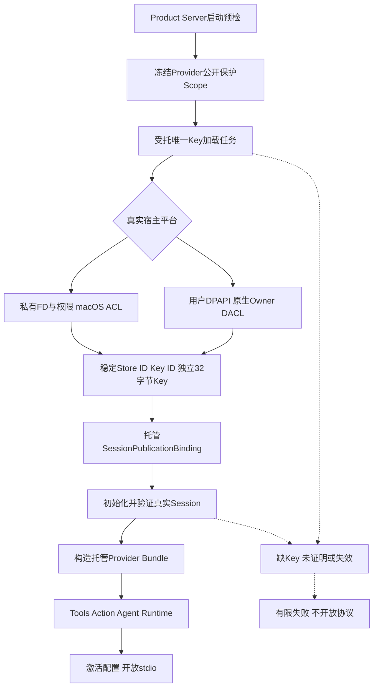
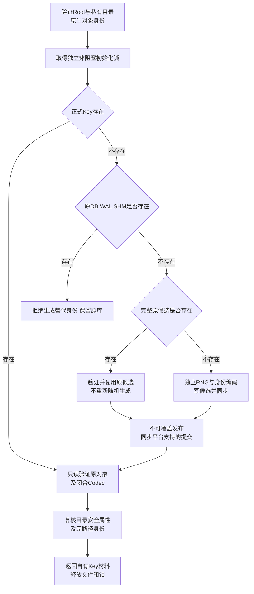
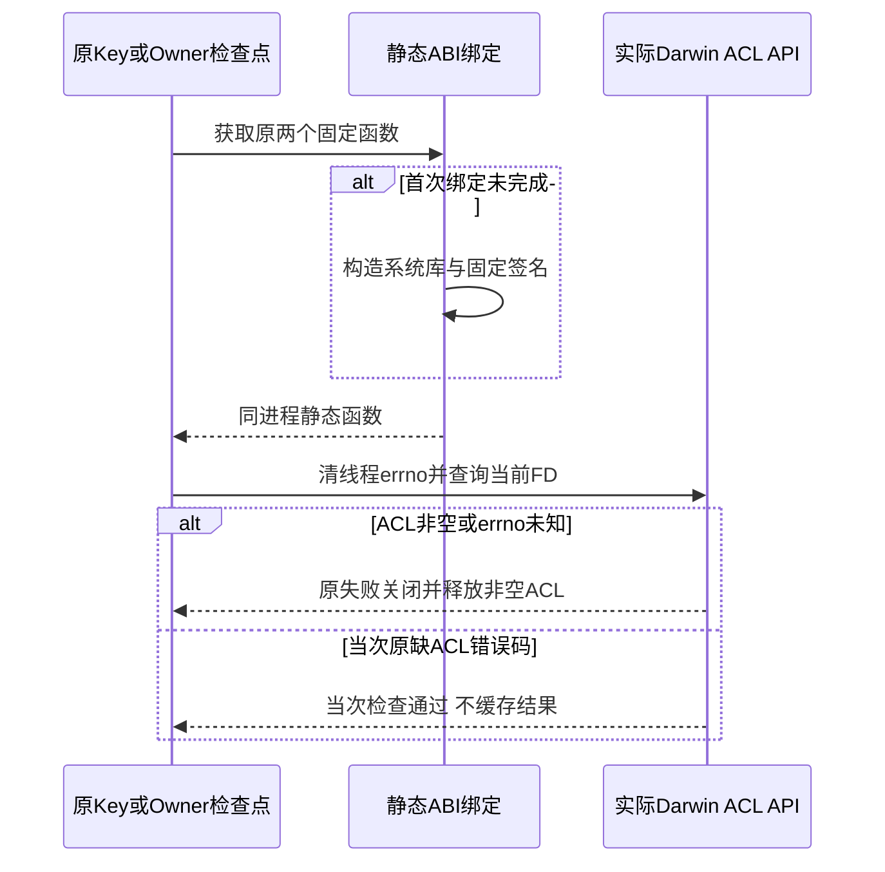
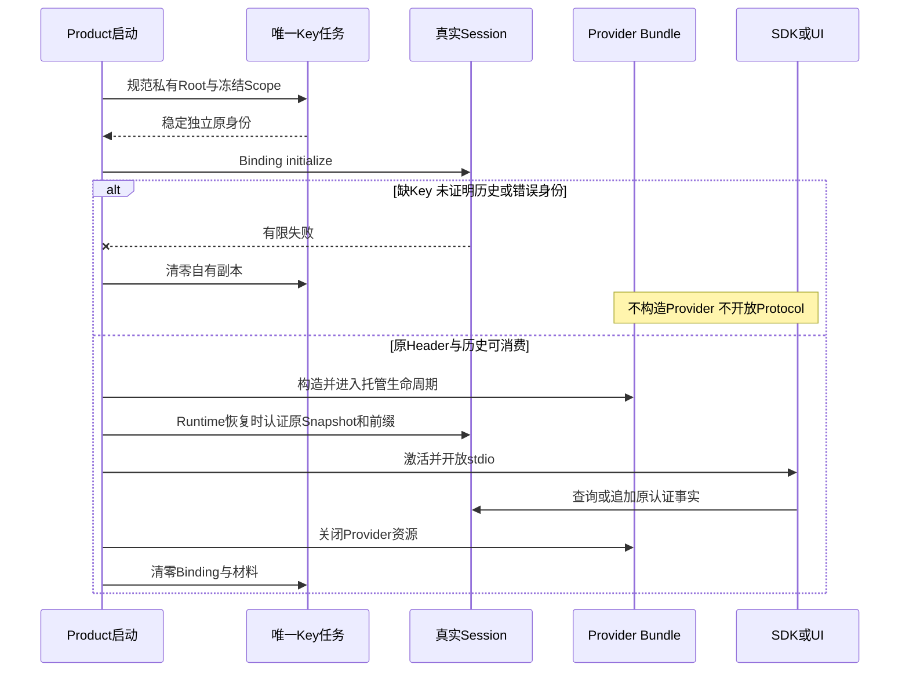
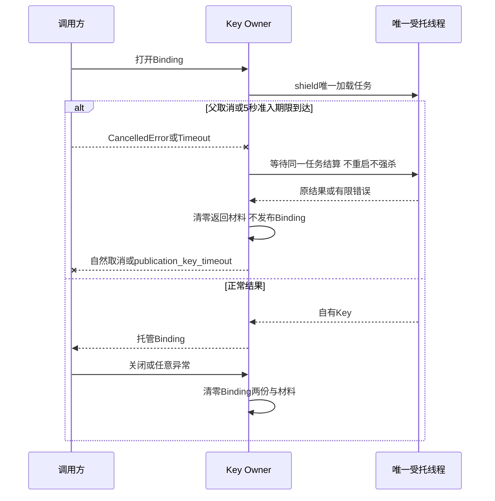

# 0.9.4a 默认产品持久Session密钥总体与详细设计

## 1. 需求背景、设计目标与状态

真实SQLite同事务认证仍需要可信宿主提供稳定独立密钥。仅有库级Binding，不能关闭默认产品
原未知历史在当前Scope下被当作安全事实消费的缺口；重启生成临时Key会破坏合法恢复。
本设计在正式Product Server强制装配独立本机Key Backend，并在Provider构造和开放协议之前验证Session。

目标：Key/逻辑Store身份跨重启稳定；不使用模型凭据；新密钥先持久化再初始化认证库；
原Key缺失/失效或历史未证明时失败关闭；不删除、改写或补签原历史；取消后结算唯一IO任务。

| 部分 | 实现与验收状态 |
|---|---|
| POSIX私有FD、owner/mode/单硬链接与原子发布 | 已实现；实际本机文件、锁、进程退出和恢复测试 |
| POSIX目录身份与返回前复核 | 已实现；普通条目变化不误拒绝，权限、ACL或原对象替换仍拒绝 |
| macOS扩展ACL | 已实现；实际Native API与三个对象ACL篡改测试；不是只检查mode bits |
| Windows用户DPAPI、原生Owner/受保护DACL/句柄链 | 已实现并提供真实Windows测试入口；本机跳过，不声明Windows通过 |
| 默认Root强制Binding、先验原库再构造Provider | 已实现；实际配置/Scope/Store/Runtime和SDK测试 |
| 完整产品同机同用户备份恢复 | 未完成；不把仅Session库级备份当作完整产品备份 |
| Key轮换、跨机器迁移及通用维护CLI | 延期1.1+；未安全装配的产品入口固定拒绝 |
| 新Artifact正文/二进制持久来源证明与跨Epoch重开 | 已由[Artifact详设](m09-4a-authenticated-artifact-body.md)实现；旧无证明正文不追认 |
| 全部Provider/Owner/SDK相关ID、0.9.4～0.9.6与发布 | 未完成；12件Archive来源权利继续阻断 |

## 2. 信任边界与非目标

攻击者拥有SQLite文件写权限但不能读取或替换独立Key时，不能伪造新原事实、投影或来源证明。
Key不进入Session DB、Product Config快照、Workspace、模型请求、Protocol、Artifact或诊断包。
POSIX采用规范私有本机文件，不声称Key正文加密；Windows采用当前用户DPAPI，不使用机器作用域。

不防同UID任意代码、拥有Key权限的插件、系统管理员、完整有效库回滚、整Thread及证明共同删除；
不认证Tenant/物理数据库身份，不提供Session正文加密、任意DLP或硬抢占OS文件系统调用。
独立生成不是Keyring不可导出保护；当前托管策略不得被描述为密钥备份、轮换或三平台正式安装完成。

## 3. 总体架构与系统上下文



平台由实际`os.name`决定，不接受配置声明把Windows伪装成POSIX或失败后降级明文。
原`SQLiteSessionStore`和`SessionPublicationBinding`复用，不复制Store、增加HTTP/Worker或新模型凭据系统。
原配置审计可记录公开配置加载事实；拒绝历史发生在模型工厂和Protocol入口之前。

## 4. 私有目录、持久化与Key发布流程



布局为产品私有状态中的`session-auth/key.v1`、`.lock`和短期`key.v1.pending`，均不在Workspace。
首次生成之前在同一初始化锁内检查` sessions.db / -wal / -shm `存在性；即使旧库看起来为空，
也不把缺Key解释为首次运行。旧版升级需要后续正式隔离/迁移流程或独立新状态，不能清空旧库。

### 4.1 POSIX

以Root目录FD打开私有子目录；`O_NOFOLLOW/O_CLOEXEC`、owner、目录700、文件600和单硬链接全部验证。
不自动chmod危险既有Key。Darwin另使用SDK核对的`acl_get_fd_np(ACL_TYPE_EXTENDED)`，
拒绝任何既有扩展ACL，不能把mode 600/700当作macOS ACL保障。
Linux权限模型下group/other为零，扩展访问ACL的有效mask受该模式约束；未声明所有网络文件系统支持。

候选`O_EXCL`创建、完整写入、文件fsync与目录fsync后，通过`link`不可覆盖发布。
若进程在正式名字建立但候选尚未移除时退出，两名字必须是同一安全inode且恰为双硬链接，
才允许在锁内结算候选；陌生硬链接、损坏Codec或不同对象不修复。原Key字节不重新生成。

### 4.1.1 目录安全身份与普通文件完整观察

Root内的数据库、WAL、SHM及其他合法条目可在Key加载期间变化。目录的大小、链接计数、mtime和ctime
因此不是稳定安全身份。原实现把目录和普通Key文件都交给同一个完整`stat`元组比较，会把合法条目变化
误判为`publication_key_unavailable`。当前[`load_posix_key`](../../src/harnessix/product_config/session_key_posix.py)
使用独立目录身份，不增加重试、不忽略Key错误，也不降低私有权限。

| 对象 | 比较或验证 | 不变量与取舍 |
|---|---|---|
| Root及`session-auth`目录 | `dev/ino/mode/uid`；实际FD与原路径复核 | 允许条目及时间变化，但必须仍是同一私有目录；不跟随新链接 |
| 目录安全属性 | 进入时及读取Key后重新检查owner、700及Darwin扩展ACL | 仅mode不够；读取期间增加ACL或放宽权限仍失败关闭 |
| Key与锁普通文件 | 既有完整`stat`身份、600、单链接及ACL | 不删除大小、mtime、ctime等文件稳定性检查；不把目录规则泛化到文件 |

返回前先在已拥有Root/私有子目录FD上重验安全属性，再把FD初始身份与当前原路径比对。
即使新对象仍为700，也不能用路径替换后的目录接受先前Key。检查不防同UID任意代码或管理员，
也不是所有目录条目的原子快照；同机状态一致备份仍需停机、全部Store/Artifact及独立Key共同验证。

### 4.1.2 Darwin静态FFI绑定与持续ACL复核

**需求背景。** 完整Git候选的真实材料登记关联测试触发原60秒维护期限，保留该失败。
同一流程的cProfile记录约5.10亿函数调用；`_private_acl`调用3563323次，独占约11秒、
累计约49.7秒，其中每次均重新构造CDLL、函数指针及动态ctypes包装类。
这些是仪器化单例热点，不是未仪器化性能SLA，也不认定为全部超时的唯一原因。

**目标与边界。** 只复用同进程固定系统库及两个函数的静态ABI绑定，不缓存ACL、FD、路径、
Key、Owner、Scope、权限结果或执行授权。保留每一原检查点、原60秒期限、完整stat/身份及物理ACL查询。
非Darwin入口不加载本API；首次绑定失败不能缓存为成功。首次并发构造允许重复的相同静态绑定，
不得把函数缓存误称全局单次初始化锁或新的Owner。

| 接口/字段 | 职责及当前约束 |
| --- | --- |
| [`_darwin_acl_library`](../../src/harnessix/product_config/session_key_posix.py) | 私有惰性静态绑定，固定`CDLL(None,use_errno=True)`；无caller文件或动态程序 |
| `acl_get_fd_np` | 固定`int,int -> void*`；每次查询当前实际FD和原`ACL_TYPE_EXTENDED=0x100` |
| `acl_free` | 固定`void* -> int`；非空ACL按原finally释放，无缓存原指针 |
| `_private_acl` | 原每次清errno、查询、拒绝非空ACL及未知errno；原ENOENT/ENOATTR仅表示当次无ACL |



核心伪代码：

```text
Darwin ACL 检查(fd):
    取惰性静态ABI绑定，不读或缓存Key/Root
    清线程局部errno
    调用原acl_get_fd_np(fd, 原类型)
    非空ACL -> 原失败关闭，finally释放本次指针
    空ACL且errno不属于原两个错误码 -> 原失败关闭
    其他 -> 仅本次通过；下次必须重新查询
```

**持久化、失败与恢复。** 无数据库、文件格式、Key身份、MAC域或持久状态变化；重启重新绑定。
ACL在上次成功后新增仍拒绝，同FD权限改变不沿用结果。静态绑定异常保持原异常路径，失败不进入缓存。
所有Owner/Scope重新读取及取消/超时检查不变，不因优化扩大期限或少检查一次。

**验证。** 新精确反例在原实现上实际8通过、1失败：三次物理查询重复构造三份库绑定。
后继四件文件84项通过，含静态复用、ACL/errno/不同FD/绑定失败/非Darwin及原真实macOS ACL、Owner、Key重开。
未合入完整Git候选只借该单文件后，原超时案例实际通过；整体测试93.965秒，含多段各自原60秒维护操作，
没有扩大单段deadline或少检查一次。该单例不代表全部228项、完整Git效果或三平台已经通过。
独立审查未发现生产语义回退；指出替身总写errno会掩盖漏清零，两个静默查询反例在独立进程撤去清零后实际全部失败。
原生产清零保持，新84项完整通过，旧82阶段不覆盖、不累计。
原件、源锁及局部5000次真实FD循环见[验证资料](../validation/session-acl-static-binding-2026-10-03-v1/README.md)。

### 4.2 Windows

复用`WindowsWorkspaceRoot`逐段句柄链，拒绝Reparse Point/Junction，并在加载期间固定私有路径。
新目录/文件显式建立当前Owner及仅当前用户/SYSTEM全权限的protected DACL；
既有对象用`GetSecurityInfo`、DACL control和实际ACE类型/flags/mask/SID核对，不使用chmod证明ACL。
文件必须单硬链接、不是目录或reparse；读取有8192字节上限，前后实际File Index/Revision一致。

DPAPI使用用户作用域与`CRYPTPROTECT_UI_FORBIDDEN`，不给Prompt、不设置LOCAL_MACHINE，
固定应用用途熵不是第二密钥。解密/权限失败不能改用明文、其他用户或另一Store Key。
候选由原生`WriteFile/FlushFileBuffers`保存，`MoveFileExW`不允许覆盖或跨卷复制。
不声称Windows目录fsync或断电证明；明确拒绝UNC状态，NTFS实际API验收另行记录。

## 5. Key数据结构与用途

| 编码 | 字段 | 长度与语义 |
|---|---|---|
| 内部payload | HXSK＋版本1、Store UUID、Key UUID、原Key | 5＋16＋16＋32＝69字节，闭合无尾随数据 |
| POSIX封套 | HXKP＋版本1、payload | 5＋69＝74字节，私有文件不是加密 |
| Windows封套 | HXKW＋版本1、Cipher长度LE32、用户DPAPI Cipher | 9＋Cipher，长度字段等于剩余字节；总上限8192 |
| OwnedSessionKey | store_id/key_id/key bytearray | 稳定逻辑身份；Key `repr=False`，close尽力清零自有副本 |
| SessionPublicationBinding | 原Key及Scope的自有副本 | 既有Header/Event/Projection用途域和MAC不变 |

UUID与Key由独立OS随机源生成，不用Provider API Key派生；不依赖Profile/凭据版本或目录路径。
Key不旋转于每次重启、凭据轮换或新Scope。Windows用户/机器迁移可能无法解密，不能宣称直接复制文件即可恢复。

## 6. 类与接口设计、源码职责

| 源码/接口 | 输入与输出 | 单一职责 |
|---|---|---|
| session_key_codec.py | 原69字节→OwnedSessionKey；生成新payload | 闭合二进制、独立身份、自有材料生命周期 |
| session_key_store.py::load_session_key | 私有Root/fault→OwnedSessionKey | 真实平台选择、统一有限失败，不降级 |
| session_key_posix.py::load_posix_key | Root及内部fault→原payload | FD锚定、权限/ACL、锁、不可覆盖提交/恢复 |
| session_key_dpapi.py::transform | 有界bytes/unprotect→bytes | 原生用户DPAPI ABI、结果释放和清零 |
| session_key_windows_security.py::PrivateKeySecurity | Native APIs/handle | 原Owner与protected DACL验证/新对象描述符 |
| session_key_windows_files.py::WindowsKeyFiles | 既有WindowsRoot/原路径 | 句柄与权限端口；有限IO拆为模块函数，不提高结构阈值 |
| session_key_windows.py::load_windows_key | 原Root/fault→payload | 原生文件/用户DPAPI组合、候选生命周期 |
| session_key.py::open_product_session_binding | 原Root/PublicationScope→托管Binding | 唯一线程任务、取消/超时结算和全部自有Key清理 |
| server.py::_serve_product_stdio | 已预检Startup | Key/Session先验真，然后Provider/Runtime/Protocol的生命周期 |

私有结构不是公共Secret Provider，现有配置Schema、Session Schema29、Event Codec、公共DTO和导出不变。
`fault`仅用于可信测试注入，不来自配置、Protocol或模型。既有平台安全路径端口被复用，不复制通用路径实现。

## 7. 产品启动、读取与失败时序



Session初始化先验证Store头；Runtime启动恢复再认证全部Snapshot。损坏投影及普通SHA同时替换也会拒绝，
可能已经构造的Bundle仍完整关闭，模型请求为零。未知旧历史在更早阶段被拒绝，无Provider/Protocol消费。
原认证历史在新Scope下可私有重开，但当前材料与公开权限检查仍不可省略。

### 7.1 并发追加与认证读版本

产品启用认证后，审批等待中的SDK事件重放与Runtime追加可以同时发生。
原独立`events`入口没有显式读事务，多条SELECT可能分别取得旧Checkpoint和新Event/Seal，
使合法原历史在完整前缀检查中被误判为`publication_history_unproven`。
`get/list/recovery`已有读事务，`append/rebuild/Fork`已有写事务；不增加另一套锁或降级证明。

当前`SQLiteSessionStore.events`在任何认证读取前执行`BEGIN`，所有Checkpoint、Event与Seal
来自同一SQLite快照。读者可返回其固定旧版本，后续新读才观察完整新CAS，不自动重试或重签。
两个确定性测试在读者取得Checkpoint后，让另一真实连接先提交，再继续读原事件；
分别覆盖`after=0`和`after=1`，并检查新事实及Seal完整提交。旧实现两项均失败，修改后通过。
这不是消除篡改检查：Snapshot/Event/Seal损坏与缺失依然必须拒绝。

## 8. 取消、超时、进程退出与恢复语义



5秒是准入期限，不是硬抢占阻塞OS调用；清理可以延后完成，以避免遗留线程或丢弃返回Key。
父取消优先传播，不用重试掩盖未知线程。非阻塞锁占用是busy，不自动生成替代Key。
进程退出前候选与正式提交后Key分别有实际OS测试；不当作断电、Windows平台通过或Key迁移验收。

| 错误 | 语义/副作用 |
|---|---|
| publication_key_unavailable | 缺失、权限/ACL/格式/身份不可用；不覆盖Key、不补签旧库 |
| publication_key_busy | 独立初始化锁正在占用；无另一密钥、无Protocol开放 |
| publication_key_timeout | 准入超时并结算唯一任务；可能已安全持久Key但不发布Binding |
| publication_history_unproven | 原Store/历史缺证明或MAC不匹配；原事件/证明不改写 |
| 原Scope失效有限码 | 无Binding/新签发；已返回材料清零 |
| 父CancelledError | 自然取消，线程与文件资源结算，自有Key清零 |

## 9. 核心代码业务伪代码

```text
load_key:
  真实平台端口验证私有原对象；取得独立锁
  若正式Key存在：只读原封套、验证身份与闭合格式
  否则若任何原DB/WAL/SHM存在：拒绝，不生成、不删除
  否则复用完整原候选，或独立随机生成；不可覆盖发布
  返回前复核Root及私有子目录的owner/mode/ACL和dev/ino路径身份
  普通目录条目变化不等于对象替换；Key及锁仍保持完整文件观察
  返回自有材料；释放文件、目录、锁、ACL与Native缓冲

open_binding:
  唯一受托线程在shield下加载
  若父取消或准入超时：等待同一线程，清零其结果，传播有限语义
  正常以原Key/Store身份和Scope建立既有Binding
  任意退出finally清零Binding与材料

product_start:
  预检Workspace/状态/配置；冻结选定Provider材料
  打开稳定Binding；初始化并验证Session
  构造托管Provider；Tools/Action/Runtime恢复验真
  仅全部成功才激活配置并开放Protocol
```

## 10. 部署、升级、备份、回退与兼容

新安装需本机私有状态：macOS/Linux目录700、无Darwin扩展ACL；Windows当前用户NTFS及原生私有DACL。
状态与Workspace不重叠。Key丢失不能重新随机生成并追认旧库，应保留原数据、使用后续正式恢复流程。
存在旧DB但无Key会拒绝；现阶段不提供清空、补签或把旧文件复制进新认证库的自动升级捷径。

仅复制Session DB不等于可恢复；现有维护CLI尚未装配托管Key，不能用未绑定Store读取/修改认证库。
Key导出、保护恢复包、轮换、跨用户/机器迁移、卸载与诊断包敏感输入规则必须在后续切片完成。
回退到无保护旧程序不是安全回退；库级无认证模式只用于显式宿主/旧数据隔离，不是默认产品降级选项。

## 11. 可观测性、验证测试与剩余风险

公开观测只记录有限码、版本、计数、摘要、布尔不变事实和精确Revision，不保存原Key、原Prompt或供应商正文。
测试分开记录实际文件/ACL/锁/OS退出、真实Root/SDK、DPAPI ABI替身与Windows原生测试；替身不证明Windows。
真实模型请求0次。当前六类Windows测试必须在实际Windows运行；真实三平台安装、Beta与来源权利仍开放。

测试：原Key重开、错封套/版本/长度、缺Key/DB sidecar、原候选与正式发布退出、锁占用、硬链接/符号链接/ACL、
父取消、超时单任务回收、失效Scope、Root双重启新Turn、旧未证明历史拒绝、投影+SHA篡改及直接Service新材料拒绝。
候选发行物与完整回归在固定源码上单独冻结，不能从测试文件存在推导生产或三平台通过。

固定源码`812ae7c`的Python 3.12独立相关回归保留一项FAIL：原未知历史预期
`publication_history_unproven`，实际先收到`publication_key_unavailable`；同源码孤立运行通过不能覆盖原FAIL。
另有三个确定性红用例证明Root普通条目/时间变化会导致误拒绝，两个红用例证明返回前权限变化原先未拒绝。
这确认一类目录观察缺口，但不足以宣称原批次失败的排他根因。修复另以`8340ff1`独立回归，
并补真实目录替换和Darwin返回前ACL篡改反例；[本次完整验证报告](../validation/trusted-file-snapshot-2026-09-28-v1/README.md)
分开记录旧FAIL、确定性复现和后继源码结果。全产品恢复、Windows原生安装及Beta仍未关闭。

## 12. 源码阅读顺序

1. [Codec](../../src/harnessix/product_config/session_key_codec.py)与[平台Facade](../../src/harnessix/product_config/session_key_store.py)。
2. [POSIX](../../src/harnessix/product_config/session_key_posix.py)：目录FD、原文件、锁、候选与不可覆盖发布。
3. [DPAPI](../../src/harnessix/product_config/session_key_dpapi.py)、[ACL](../../src/harnessix/product_config/session_key_windows_security.py)、
   [原生文件](../../src/harnessix/product_config/session_key_windows_files.py)、[Windows组合](../../src/harnessix/product_config/session_key_windows.py)。
4. [Owner](../../src/harnessix/product_config/session_key.py)与[默认Root](../../src/harnessix/product_config/server.py)。
5. [既有SQLite认证设计](m09-4a-authenticated-sqlite-session.md)与[来源研究](../research/managed-session-key-and-root.md)。

### 12.1 原始实现固定版本符号导航

- [`src/harnessix/product_config/session_key.py`：`_load_owned`，L19–L34](https://github.com/carrie1988/Harnessix/blob/cef1b17cf63a5bed7d7740d5cbea5bc67728deb2/src/harnessix/product_config/session_key.py#L19-L34)。
- [`src/harnessix/product_config/session_key.py`：`open_product_session_binding`，L38–L55](https://github.com/carrie1988/Harnessix/blob/cef1b17cf63a5bed7d7740d5cbea5bc67728deb2/src/harnessix/product_config/session_key.py#L38-L55)。
- [`src/harnessix/product_config/session_key_codec.py`：`OwnedSessionKey`，L22–L30](https://github.com/carrie1988/Harnessix/blob/cef1b17cf63a5bed7d7740d5cbea5bc67728deb2/src/harnessix/product_config/session_key_codec.py#L22-L30)。
- [`src/harnessix/product_config/session_key_codec.py`：`create_payload`，L33–L34](https://github.com/carrie1988/Harnessix/blob/cef1b17cf63a5bed7d7740d5cbea5bc67728deb2/src/harnessix/product_config/session_key_codec.py#L33-L34)。
- [`src/harnessix/product_config/session_key_codec.py`：`decode_payload`，L37–L40](https://github.com/carrie1988/Harnessix/blob/cef1b17cf63a5bed7d7740d5cbea5bc67728deb2/src/harnessix/product_config/session_key_codec.py#L37-L40)。
- [`src/harnessix/product_config/session_key_store.py`：`load_session_key`，L12–L27](https://github.com/carrie1988/Harnessix/blob/cef1b17cf63a5bed7d7740d5cbea5bc67728deb2/src/harnessix/product_config/session_key_store.py#L12-L27)。
- [`src/harnessix/product_config/session_key_posix.py`：`_private_acl`，L49–L66](https://github.com/carrie1988/Harnessix/blob/cef1b17cf63a5bed7d7740d5cbea5bc67728deb2/src/harnessix/product_config/session_key_posix.py#L49-L66)。
- [`src/harnessix/product_config/session_key_posix.py`：`_read`，L84–L101](https://github.com/carrie1988/Harnessix/blob/cef1b17cf63a5bed7d7740d5cbea5bc67728deb2/src/harnessix/product_config/session_key_posix.py#L84-L101)。
- [`src/harnessix/product_config/session_key_posix.py`：`_publish`，L125–L153](https://github.com/carrie1988/Harnessix/blob/cef1b17cf63a5bed7d7740d5cbea5bc67728deb2/src/harnessix/product_config/session_key_posix.py#L125-L153)。
- [`src/harnessix/product_config/session_key_posix.py`：`_load_locked`，L156–L168](https://github.com/carrie1988/Harnessix/blob/cef1b17cf63a5bed7d7740d5cbea5bc67728deb2/src/harnessix/product_config/session_key_posix.py#L156-L168)。
- [`src/harnessix/product_config/session_key_posix.py`：`load_posix_key`，L171–L203](https://github.com/carrie1988/Harnessix/blob/cef1b17cf63a5bed7d7740d5cbea5bc67728deb2/src/harnessix/product_config/session_key_posix.py#L171-L203)。
- [`src/harnessix/product_config/session_key_dpapi.py`：`transform`，L39–L64](https://github.com/carrie1988/Harnessix/blob/cef1b17cf63a5bed7d7740d5cbea5bc67728deb2/src/harnessix/product_config/session_key_dpapi.py#L39-L64)。
- [`src/harnessix/product_config/session_key_windows_security.py`：`PrivateKeySecurity`，L62–L156](https://github.com/carrie1988/Harnessix/blob/cef1b17cf63a5bed7d7740d5cbea5bc67728deb2/src/harnessix/product_config/session_key_windows_security.py#L62-L156)。
- [`src/harnessix/product_config/session_key_windows_security.py`：`verify`，L107–L133](https://github.com/carrie1988/Harnessix/blob/cef1b17cf63a5bed7d7740d5cbea5bc67728deb2/src/harnessix/product_config/session_key_windows_security.py#L107-L133)。
- [`src/harnessix/product_config/session_key_windows_security.py`：`_verify_aces`，L135–L151](https://github.com/carrie1988/Harnessix/blob/cef1b17cf63a5bed7d7740d5cbea5bc67728deb2/src/harnessix/product_config/session_key_windows_security.py#L135-L151)。
- [`src/harnessix/product_config/session_key_windows_files.py`：`WindowsKeyFiles`，L16–L100](https://github.com/carrie1988/Harnessix/blob/cef1b17cf63a5bed7d7740d5cbea5bc67728deb2/src/harnessix/product_config/session_key_windows_files.py#L16-L100)。
- [`src/harnessix/product_config/session_key_windows_files.py`：`_read_key_file`，L103–L121](https://github.com/carrie1988/Harnessix/blob/cef1b17cf63a5bed7d7740d5cbea5bc67728deb2/src/harnessix/product_config/session_key_windows_files.py#L103-L121)。
- [`src/harnessix/product_config/session_key_windows_files.py`：`_write_new_key_file`，L124–L147](https://github.com/carrie1988/Harnessix/blob/cef1b17cf63a5bed7d7740d5cbea5bc67728deb2/src/harnessix/product_config/session_key_windows_files.py#L124-L147)。
- [`src/harnessix/product_config/session_key_windows_files.py`：`_lock_key_file`，L150–L160](https://github.com/carrie1988/Harnessix/blob/cef1b17cf63a5bed7d7740d5cbea5bc67728deb2/src/harnessix/product_config/session_key_windows_files.py#L150-L160)。
- [`src/harnessix/product_config/session_key_windows.py`：`_decode`，L30–L39](https://github.com/carrie1988/Harnessix/blob/cef1b17cf63a5bed7d7740d5cbea5bc67728deb2/src/harnessix/product_config/session_key_windows.py#L30-L39)。
- [`src/harnessix/product_config/session_key_windows.py`：`load_windows_key`，L72–L104](https://github.com/carrie1988/Harnessix/blob/cef1b17cf63a5bed7d7740d5cbea5bc67728deb2/src/harnessix/product_config/session_key_windows.py#L72-L104)。
- [`src/harnessix/product_config/server.py`：`_serve_product_stdio`，L201–L279](https://github.com/carrie1988/Harnessix/blob/cef1b17cf63a5bed7d7740d5cbea5bc67728deb2/src/harnessix/product_config/server.py#L201-L279)。
- [`src/harnessix/session/sqlite.py`：`events`，L536–L542](https://github.com/carrie1988/Harnessix/blob/cef1b17cf63a5bed7d7740d5cbea5bc67728deb2/src/harnessix/session/sqlite.py#L536-L542)。

### 12.2 当前目录观察修复源码

- [`_directory_identity`：目录安全身份，L39–L43](https://github.com/carrie1988/Harnessix/blob/8340ff1cbc6375ad4064b8be6bd4c7bd708c559d/src/harnessix/product_config/session_key_posix.py#L39-L43)。
- [`load_posix_key`：进入、读取后安全复核及路径身份，L177–L220](https://github.com/carrie1988/Harnessix/blob/8340ff1cbc6375ad4064b8be6bd4c7bd708c559d/src/harnessix/product_config/session_key_posix.py#L177-L220)。
