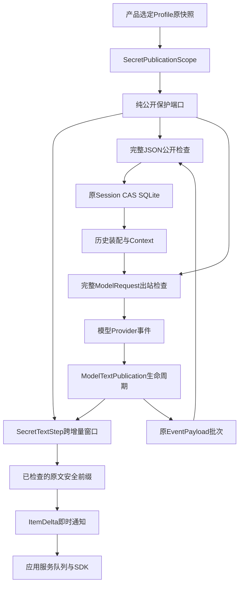
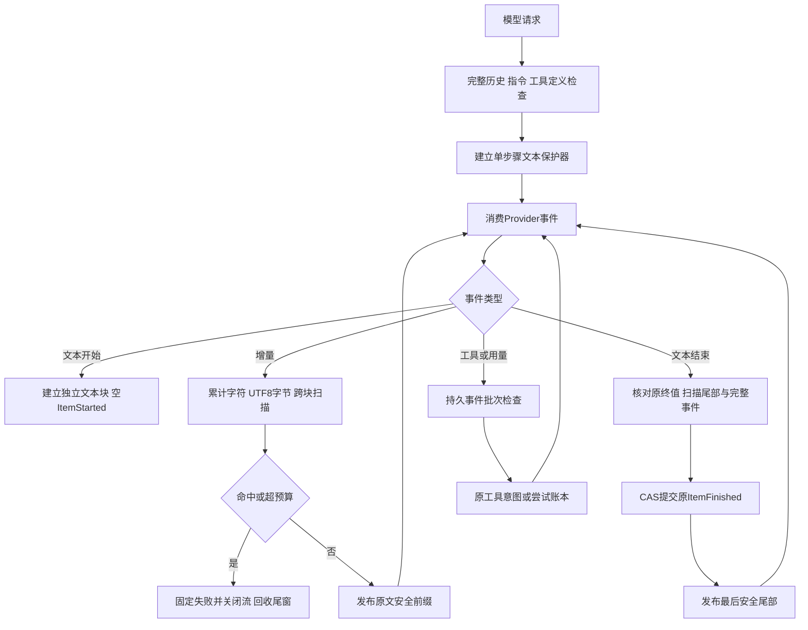
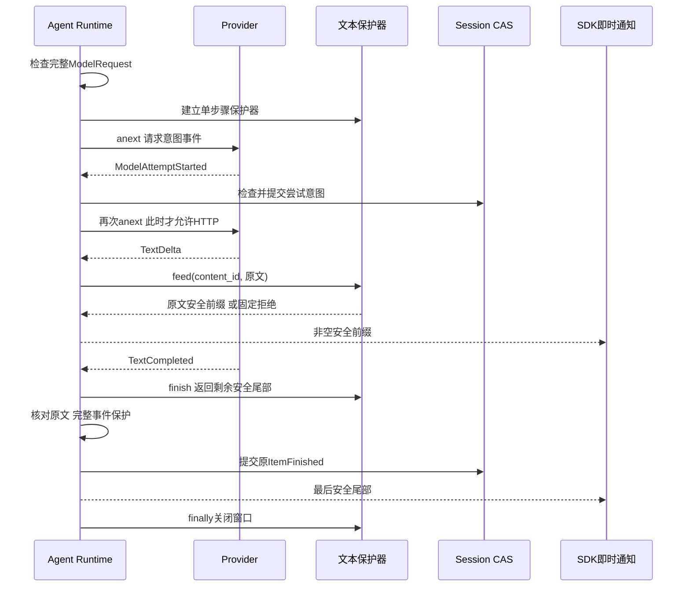
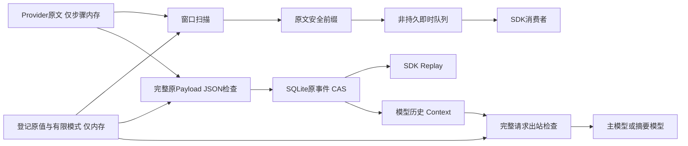

# 0.9.4a 模型流式文本与事件持久前保护详细设计

## 1. 需求背景与源码研究

[前序固定源码观察](../validation/typed-binary-publication-2026-09-28-v1/contract-facts.json)
确认已登记模型凭据可以通过模型直接回答进入Session、SDK重放、下一次模型历史及SQLite。
工具和Artifact安全不蕴含模型直接文本安全，Thread摘要未命中也不代表Replay没有明文。
该观察使用实际Agent Runtime、SQLite和SDK服务，Provider为确定性替身，不代表真实网络模型调用。

旧实现[`AgentRuntime._sample_events`](../../src/harnessix/agent/runtime.py)收到`TextDelta`后立即
调用`_emit_delta`，收到`TextCompleted`后提交原文。应用服务订阅回调，缓存在公开即时通知队列。
仅检查最终文本仍可能在第二个增量到达前泄漏第一个增量；只过滤界面仍会先写入SQLite和历史。

源码研究核验Codex `a0dcfe2ada3f5bbd5059a34c0fc6fac244741a67`的
`codex-rs/secrets/src/sanitizer.rs`：有限材料与指定出口是边界，不是对所有出口的自动授权。
OpenCode `69c172e8a7c0086887b1f93ed5a162f14b6aa0c5`的输出保护亦不能作为本产品模型流安全证明。
本设计复用本项目[`secret_patterns`](../../src/harnessix/secrets/redaction.py)与公开检查期限，
不复制上游实现，不新增Agent Loop、服务或中间件。

## 2. 设计目标、非目标与架构决策取舍

目标为已登记原版本凭据建立三道明确边界：

1. 增量发布前检查跨块值，同时让安全前缀在模型完成前继续流式输出。
2. `_commit`事件批次在SQLite CAS前检查，覆盖文本终值、工具参数、模型尝试元数据、Context检查记录及摘要。
3. 主模型与摘要模型请求在`Provider.stream`消费前检查完整历史、指令和工具定义，避免当前已知值向模型传播。
4. 保持原正文、工具批准身份、原Hash、原Schema和既有账本顺序；固定失败、取消、超时及回收必须可验证。
5. 通过单一职责提取Provider文本生命周期，降低既有Runtime热点，不放宽治理阈值。

| 备选方案 | 取舍 |
|---|---|
| 收集整个回答再输出 | 否决：改变正常流式体验，不能作为唯一出口控制。 |
| 每个Delta独立扫描 | 否决：遗漏跨块值；按块重新开始预算也可旁路资源上限。 |
| 给UI增加替换规则 | 否决：晚于通知队列和数据库写入，不能保护模型历史。 |
| 修改完成正文并保留旧Hash | 否决：破坏字节绑定和审计语义。 |
| 所有文本块拼成一个流 | 否决：独立content_id没有连续字节语义。 |
| 将整个模型等待时间计入10秒保护期限 | 否决：网络等待不是同步检查工作，长响应会被错误拒绝。 |
| 原文安全前缀＋批次检查＋请求检查 | 采用：逐出口治理，使用同一产品快照，保留原合同。 |

非目标：任意编码/变换的DLP、未登记Secret、不同文本块的拼接推断、用户主动输入的所有持久入口、
旧Session授权/清洗、跨重启Seal、任意宿主恶意实现的可信执行证明、Python不可变副本安全擦除、同步硬抢占。
这不是0.9.4a或完整生产发布完成声明。

## 3. 总体架构与模块边界



| 模块 | 职责、调用者和禁止承担的职责 |
|---|---|
| `agent.publication` | 可选纯端口、统一失败、单次10秒同步期限、取消与关闭。不得导入Secrets实现。 |
| `agent.model_text` | content_id生命周期、原终值一致性、公开序号和安全前缀原文校验；不执行HTTP、工具或尝试结算。 |
| `secrets.text_publication` | 原模式扫描、跨增量尾窗、步骤累计预算；不写Session或通知SDK，不替换正文。 |
| `secrets.publication` | 原版本Scope生命周期及工厂；不新增执行环境注入权限。 |
| `agent.runtime` | 在既有采样、提交和摘要调用点接线；继续负责账本、Turn状态、失败恢复和资源排空。 |
| `app_server` / `sdk` | 消费已检查的ItemDelta和持久事件，公开DTO不变，不在界面事后掩盖问题。 |
| `product_config` | 继续将选定Provider原材料快照传给Runtime；环境轮换不替代运行中的原值。 |

依赖保持Agent纯端口→Secrets实现的反向装配，没有新增一级包边或环，没有第二份数据库。

## 4. 核心流程及完整文字描述



步骤开始前先检查出站请求，再建立可选保护器；保护已启用但工厂或方法缺失默认拒绝，不降级为立即输出。
没有配置保护的独立宿主保留兼容路径，不新增请求序列化工作。

`TextStarted`保留原128块上限和重复ID拒绝。`TextDelta`先累计原输出字符预算，再向对应块尾窗追加UTF8。
窗口扫描通过后，仅发布不可能成为未来完整模式前缀的字节；切入UTF8码点时多保留最多三字节。
模型终值必须与已接收增量原文一致；仅终值响应先进入同一检查，再完成事件批次保护和CAS提交。
最后尾部只有在完整原文和原事件可提交后发布，不允许宿主保护器改写、丢失或重复原文。

工具调用仍按原call_id、定义、风险和指纹构建内容，但事件批次在持久前检查；被拒参数没有工具执行或批准意图。
响应元数据不直接向SDK公开，进入尝试账本时必须经过相同批次检查。
摘要流不发送即时Delta；完整摘要在`CompactionSummarized`提交前检查，拒绝后不激活Compaction Window。

## 5. 时序图与账本一致性



模型尝试意图继续在下一次`anext`和HTTP前持久化，不改成先请求后补账本。
已提交用量不会因为后续文本拒绝而清零；开放尝试按原失败/取消恢复结算，未知用量仍保持未知。
错误正文不能进入Ledger，仅固定码和固定消息；工具效果与文本公开失败仍按原恢复规则分离。

## 6. 类设计与接口设计

| 接口或类 | 合同及重点校验 |
|---|---|
| `PublicTextOutputProtection.begin_public_text_step` | `(checkpoint) -> PublicTextStep`；单个模型步骤的独立生命周期；可选能力缺失默认拒绝。 |
| `PublicTextStep.feed` | `(content_id, text, checkpoint) -> str`；返回且仅返回可安全发布的原文前缀。 |
| `PublicTextStep.finish` | `(content_id, checkpoint) -> str`；同一块仅一次结束，不重新开始累计预算。 |
| `PublicTextStep.close` | 无正文返回；正常、异常和取消均幂等清理，清理异常不覆盖原失败。 |
| `SecretTextStep` | 独立块尾窗、完成身份集合、共享`_ScanBudget`、原Scope存活检查；不保存原Secret值的新持久副本。 |
| `ModelTextPublication` | 收集原文及已发布偏移，检查保护器返回的前缀；原输出字符预算包含工具参数。 |
| `_protect[T]` | 通用受限同步返回值包装，固定异常归一；未配置端口仍按原路径兼容。 |
| `protect_request` | 主模型与摘要模型共用完整请求检查；不以摘要预览替代全文。 |
| `AgentRuntime._commit` | 检查原Payload JSON批次后获取Thread锁并以expected_sequence追加；不改CAS或原存储结构。 |

保护器由受信宿主装配，不允许模型选择实现或注册自定义扫描器。动态方法获取、工厂创建及方法调用均在固定诊断边界内。
同类二进制能力描述符获取也移入原诊断边界，避免属性getter异常携带原诊断退出保护器。

## 7. 数据结构、重点字段与资源上限

| 字段/数据 | 解释、限制及持久性 |
|---|---|
| `_TextItem.item_id` | 原Session Item身份，与Provider content_id区分；沿用UUID生成。 |
| `_TextItem.text` | 接收到的原终值候选，仅在当前步骤内存中；终值一致性失败不得提交它。 |
| `_TextItem.released` | 已发布原文字符偏移，返回前缀必须与其后的原文严格相同。 |
| `sequence` | 同一步骤实际发布的非空安全通知序号，不要求等于Provider Delta数量。 |
| `SecretTextStep._pending` | content_id→未发布UTF8尾部；块之间不拼接。所有尾部总量不超过步骤接受字节总量。 |
| `_finished` | 已结束文本块身份；防止结束后再次feed；未完成和已完成总计最多128。 |
| `_maximum` | 最长有限字节模式长度；正常尾部保留至多`maximum-1`字节，加最多3字节UTF8边界余量。 |
| `_budget.size` | 全步骤累计接受UTF8输入≤1MiB；每块/每Delta/finish不能重置。 |
| `_budget.work` | 全步骤累计模式工作≤64MiB；每次扫描每模式增加`窗口字节数+模式字节数`，包括重复检查尾窗。 |
| 单次检查期限 | 10秒，含端口查找/调用和校验；同步checkpoint协作，不包含两个增量之间网络等待。 |
| 整体Turn期限 | 沿用原Budget与取消；本实现不新增无限模型等待权限。 |
| 事件批次/请求 | 沿用原原生JSON节点10256、深度64、字节1MiB、工作64MiB和单次10秒上限。 |
| 模式与材料 | 原Scope32名/64KiB材料、有限模式≤256、模式池≤2MiB；不增加新编码推断能力。 |

模型原字符预算与UTF8保护字节预算分别有意义，不能把一个中文字符当作一个字节。
输入/工作预算先拒绝超限，再允许前缀输出；每Delta重复尾窗检查会累计成本，极端碎片输入允许被明确限额拒绝。

## 8. 持久化、数据流与恢复



没有新增迁移、Schema、持久明文材料、密钥哈希授权或后台服务。
新模型回答的公开前缀与已提交原终值一致；取消时未发布尾窗丢弃，未完成空Item按原终态收口。
已经发布的安全前缀不是完整回答的成功保证，SDK仍以持久终态为准。

当前Scope能拒绝当前登记值出现在旧历史后被再次送向模型，但不会重写旧字节，不能授权旧版本凭据正文。
`_accept`等直接`store.append`路径、旧Replay与历史迁移不经过本切片新增的`_commit`边界；
不得据此声称所有Session入口均已保护。下一切片必须统一用户输入、治理元数据及历史公开授权。

## 9. 核心业务逻辑伪代码

```text
处理增量(content_id, text):
    检查Scope存活、文本块身份、单次取消和期限
    编码UTF8，累计全步骤输入字节
    window = 本块未发布尾部 + 新字节
    用同一步骤工作预算扫描全部原模式
    若命中、字节或工作超限：固定拒绝，禁止输出新前缀
    boundary = max(0, window长度 - 最长模式长度 + 1)
    boundary退至完整UTF8边界
    原文前缀 = window[:boundary]
    保存window[boundary:]，仅发布原文前缀

处理文本结束:
    核对Provider终值与完整原增量
    扫描剩余尾窗，校验保护器返回和原文完全一致
    对完整原ItemFinished做JSON公开检查
    原Session CAS提交成功后，发布最后安全尾部

采样失败或取消:
    finally关闭Provider和文本保护器
    保持原已提交尝试/用量与效果事实
    原状态机结算未完成项，不提交拒绝原文
```

## 10. 异常、错误分类、取消、超时与安全边界

| 情形 | 固定结果及不变式 |
|---|---|
| 原值或有限编码命中 | `public_output_secret_leak`；命中块不进入Delta、完成事件和后续请求。 |
| Scope关闭/不可用 | `public_output_secret_unavailable`；不使用轮换后新值替代原Scope。 |
| 步骤字节/工作/块数超限 | `public_output_limit`或原Provider块数码；不按块清零资源。 |
| 单次检查超时 | `public_output_timeout`；整体模型等待仍用原Turn期限。 |
| 缺失流式能力 | `public_output_stream_capability_missing`；有保护配置不得静默降级。 |
| 描述符/工厂/回调异常、返回类型或原文错误 | `public_output_protection_failed`；原异常正文不进入公开结果。 |
| Token取消/新父Task取消 | 沿用原取消语义，Provider关闭，窗口回收，开放尝试按原状态机收口。 |
| 之前已消费父取消 | 不误判为新的取消；与原公开保护checkpointer一致。 |
| 清理回调异常 | 正常路径固定失败；已有失败/取消优先，不以清理诊断覆盖。 |
| 已提交部分用量后拒绝 | 保持已知计数，开放尝试失败；未知事实不填零冒充完整。 |
| 摘要正文命中 | 不提交`CompactionSummarized`，不激活Window；账本保留已确认尝试/用量。 |

保护实现是有限精确模式，不保证恶意Provider任意变换、未登记值或短片段推断安全。
同步checkpoint不是硬抢占；闭合固定错误不等于任意宿主插件是安全沙箱。

## 11. 测试验证与部署方案

- 原值、Base64含/不含填充、URL、大小写Hex跨首/中/末分割，含提前命中较短模式。
- UTF8码点边界、中文凭据、空增量、仅终值、独立文本块及全步骤字节/工作预算。
- 端口描述符、工厂、方法、类型、正文改写/缺失/重复、关闭失败归一。
- Token、父Task、已消费取消、模拟检查时钟超时、网络等待不计入检查期限及工厂中途取消回收。
- 实际Runtime＋SQLite＋SDK即时通知/Replay＋后续请求＋非空OTel；Gated Provider证明模型未完成时前缀已输出。
- 工具参数/调用身份/工具名持久前拒绝且零执行；意图先于模拟传输、用量和元数据拒绝保持账本语义。
- 实际Compaction流程：正常激活、拒绝摘要不激活；旧历史拒绝出站并保持旧正文Hash。
- 实际产品启动/快照轮换/逆序清零，Provider工厂与传输驱动为替身；不声称真实stdio字节或网络模型验收。
- 干净旧版Git归档独立复现，固定源码干净Wheel/sdist与Secret扫描，稳定测试树完整回归。

安装和启动命令不变，无新环境变量、配置或数据库依赖。纯Python实现可用于三平台，
本机测试不是Windows/Linux实际安装发布证明。许可证12件、历史授权、跨重启证明等发布门仍独立阻断。

## 12. 源码阅读路径与维护规则

| 阅读顺序 | 源码及重点 |
|---|---|
| 1 | [`publication.py`](../../src/harnessix/agent/publication.py)：纯可选能力、工厂回收、泛型保护、固定码。 |
| 2 | [`text_publication.py`](../../src/harnessix/secrets/text_publication.py)：累计预算、尾窗、UTF8、finish/close。 |
| 3 | [`secrets/publication.py`](../../src/harnessix/secrets/publication.py)：原Scope工厂与存活检查。 |
| 4 | [`model_text.py`](../../src/harnessix/agent/model_text.py)：原文、已发布偏移、生命周期、终值CAS。 |
| 5 | [`runtime.py`](../../src/harnessix/agent/runtime.py)：`_sample`、`_sample_events`、`_commit`、`_summary_text`、`_finish`。 |
| 6 | [`service.py`](../../src/harnessix/app_server/service.py)：`_receive_delta`、`_take_deltas`、`next_events`，确认未加UI事后过滤。 |
| 7 | [专项测试](../../tests/agent/test_text_publication.py)与[实际消费链测试](../../tests/agent/test_model_publication_runtime.py)：分别对照预算和公开面。 |
| 8 | [产品装配测试](../../tests/product_config/test_publication_scope.py)：原版本快照、环境轮换及清零。 |

新增出口、保护器签名、预算、模式、取消/账本行为必须同步本详设、ADR和模块文档。
固定验收报告单独追加新目录，不改历史报告，把当前源代码和完整测试树分开绑定；专项与相关回归不得加总。
