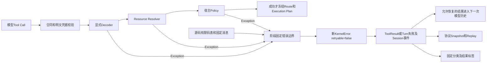
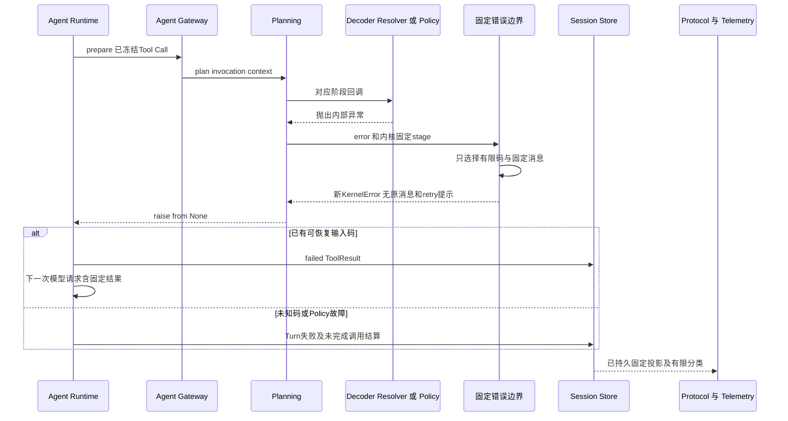

# 0.9.4a 计划回调公开错误信任边界详细设计

## 1. 需求背景与缺陷证据

Trusted Action使用宿主注册的Decoder、Resource Resolver和Policy把模型调用转为正式执行计划。
这些回调的实现身份可信，并不等价于异常内容可公开：文件系统、第三方库或未来实现可能把路径、
argv、凭据式样和内部异常拼入`KernelError`。其构造器没有固定码表或消息校验。

原[`sanitize_plan_exception`](../../src/harnessix/trusted_actions/public_errors.py)直接返回任意
`KernelError`，使原码、消息、重试提示进入[`AgentFailure`](../../src/harnessix/agent/errors.py)、
Session和协议投影。显式Decoder的`RuntimeError`/`KernelError`还不在原参数校验异常捕获范围。
原回归测试断言`sanitize(original) is original`，把未经证明的类型信任误当成合同。

整改前新增三个负例：未知码不得公开、已登记码必须重建固定消息、Policy不得伪装Resolver错误。
三个负例均失败，修复后通过；证据只使用合成式样，不包含真实凭据。

## 2. 设计目标、非目标与约束

### 2.1 目标

1. 原异常永不作为公开返回值；允许的码也只能选择源码中的固定消息。
2. Decoder、Resolver和Policy分别持有有限合同，不能跨阶段扩大码的公开资格。
3. 保留实际内置Resolver的已知失败分类，不把所有路径拒绝一律改成内部错误以简化测试。
4. 未知码、内部异常和计划回调超时固定为`action_plan_failed`，不继承原`retryable`。
5. 保留取消传播及未提交计划的边界；不重试回调，不执行、批准或对账任何副作用。
6. 以真实Runtime、SQLite Session、Protocol Server/SDK、OTel内存导出和Audit数据库验证五个公开面。

### 2.2 非目标

不建立全项目动态错误注册器，不修改全部`KernelError`构造器，不把Python回调变为进程沙箱。
本切片只关闭计划回调的类型信任缺口；不宣称所有异常、Store故障、Executor结构化Outcome和扩展
输出已完成全量安全审计。0.9.4a总体验收仍须结合Execute/Reconcile及后续攻击套件。

不改变写操作在效果无法证明时进入UNKNOWN/人工介入的规则。端到端计划故障测试使用真正的
只读Binding，写操作审批、效果不确定和对账语义由现有Router/Runtime回归继续约束。

## 3. 源码研究与架构决策

| 源码与调用关系 | 已求证事实 | 决策 |
|---|---|---|
| [`KernelError`](../../src/harnessix/agent/errors.py) → `to_failure` | 构造器接受任意字符串与retryable，类的说明文字不是内容校验。 | 类型只用于读取候选码，绝不赋予原消息公开资格。 |
| [`planning.plan_action`](../../src/harnessix/trusted_actions/planning.py) | Resolver和Policy均在Route保存前执行；原来只有非KernelError被清洗。 | 两处显式传阶段，失败立即返回固定错误，保存顺序不变。 |
| `planning._normalize_invocation` → 显式Decoder | 原来只捕获ValidationError/ValueError/TypeError；其他回调异常越过边界。 | 保留原参数校验分支，随后捕获Exception并按decode阶段重建。 |
| [`Workspace Patch Resolver`](../../src/harnessix/delivery/trusted_action.py) → [`路径规范化`](../../src/harnessix/workspace/paths.py) | 根级cwd、输入类型、保留/越界路径、重复/受保护文件具有确定错误码。 | 登记固定码，多个内部路径原因合并为固定公开消息。 |
| [`Git Push Resolver`](../../src/harnessix/delivery/git_push.py) | Resolve只验证输入和Workspace/仓库身份，不执行Push。 | 只登记该阶段实际可达的三个错误码，不把执行/远端异常加入表。 |
| [`Process Profile`](../../src/harnessix/product_config/process_action.py)、[`Eval Profile`](../../src/harnessix/product_config/eval_process.py) | 参数及固定Owner上下文不匹配具有固定码。 | 保留四个真实分类及固定消息。 |
| [`DefaultCodingRiskPolicy`](../../src/harnessix/trusted_actions/policy.py) | 正常拒绝通过Decision表达，不通过任意KernelError。 | Policy异常统一内部失败，不允许异常伪造正常策略拒绝或可恢复参数失败。 |
| [`Session准备桥`](../../src/harnessix/agent/trusted_action_session.py) | 仅少量固定输入错误成为ToolResult，其余错误结束Turn。 | 不扩大可恢复集合；测试同时覆盖可恢复和失败关闭两条链。 |
| [`协议投影`](../../src/harnessix/protocol/projection.py)、[`Telemetry`](../../src/harnessix/agent/telemetry.py) | 协议复制AgentFailure，遥测只持有固定分类，不自动采集原异常。 | 在污染源处清洗，再验证真实下游输出；不只检查sanitizer对象。 |

码表保持源码静态有限集合，而不是可由扩展提交消息的注册表。新增内置Resolver错误时，必须同时
更新阶段码表、设计和回归；未登记的新码默认内部失败。阶段选择由规划内核传入，不来自模型参数。

## 4. 总体架构与数据流程



原异常消息、args、附加字段和原重试提示不进入任何数据边。只有精确匹配的有限码可以选择固定消息。
计划回调抛出普通Exception时，控制流立即退出，后续Workspace Snapshot、Route和批准检查点不生成。
Audit此时不存在完整业务计划，不能为了记录原异常而保存未经校验的半计划或参数。

## 5. 核心流程与时序



流程图中普通回调超时与其他Exception同样进入固定失败；这不是新增回调执行时间上限。
`asyncio.CancelledError`是BaseException，不被Exception捕获，仍交给既有取消状态机处理。
进程终止和其他BaseException也不伪装成普通参数错误。取消、执行期限和写效果未知的正式Owner机制
保持既有实现；本边界不重放、不恢复或重新调用出错回调。

## 6. 接口设计、类与数据结构设计

| 接口/字段 | 类型和职责 | 约束/失败语义 |
|---|---|---|
| `sanitize_plan_exception(error, *, stage)` | 输入BaseException，返回新KernelError；唯一计划回调错误投影。 | 默认policy即最窄集合；只有decode/resolve显式选择对应表。 |
| `PublicPlanningStage` | `Literal[decode, resolve, policy]`。 | 只由内核调用点传入，不作为用户配置或模型字段。 |
| `_DECODER_ERRORS` | 两个码到固定消息的源码映射。 | `tool_invalid_arguments`、`trusted_tool_schema_invalid`；校验器原生ValueError类仍走已有输入失败分支。 |
| `_RESOLVER_ERRORS` | 十三个实际可达码到固定消息的源码映射。 | 工作区/交付六码、Git三码、Process两码、Eval两码；不登记远端执行异常。 |
| `KernelError.code` | 仅作为候选选择键。 | 必须为真正str且精确命中当前阶段表；任意合法正则字符串并不足以获得公开资格。 |
| `KernelError.message` | 输出为静态固定消息。 | 不读原消息，不调用str/repr，不拼接原路径或参数。 |
| `retryable` | 新错误默认为false。 | 不继承回调提供的重试标记，避免将内部错误提升为自动重试建议。 |
| `raise ... from None` | 在回调捕获处抑制原异常链展示。 | 仅公开稳定错误；不记录或持久化原异常正文。 |

### 6.1 Resolver码与源码索引

| 固定码组 | 源码入口 | 保留的业务语义 |
|---|---|---|
| `action_resource_invalid` | [`canonical_action_resource`](../../src/harnessix/trusted_actions/router.py) | 规范资源不符合正式合同。 |
| `workspace_path_denied`、`workspace_platform_unsupported` | [`normalize_workspace_path`](../../src/harnessix/workspace/paths.py) | 路径访问不允许或平台不受支持；不公开具体路径。 |
| `workspace_patch_arguments_invalid`、`workspace_patch_cwd_unsupported`、`delivery_path_denied` | [`Workspace Patch定义及_normalized_files`](../../src/harnessix/delivery/trusted_action.py) | 类型、根目录规则或写入目标拒绝。 |
| `git_workspace_mismatch`、`git_repository_changed`、`git_push_input_invalid` | [`build_git_push_definition及输入/根目录校验`](../../src/harnessix/delivery/git_push.py) | 规划环境、仓库身份或输入无效；不执行远端操作。 |
| `process_profile_arguments_invalid`、`process_profile_context_mismatch` | [`resolve_run_profile`](../../src/harnessix/product_config/process_action.py) | 固定Profile输入或Owner上下文不匹配。 |
| `eval_test_profile_arguments_invalid`、`eval_test_profile_context_mismatch` | [`_checked_arguments及_resolved_action`](../../src/harnessix/product_config/eval_process.py) | 固定Eval Profile输入或规划上下文不匹配。 |

这是错误展示合同，不是授权合同。选择某个码不能生成ALLOW、批准检查点或成功效果，也不能替代
Binding、Workspace、Sandbox、Secret及Owner校验。

## 7. 核心业务逻辑伪代码

```text
sanitize(error, stage):
    allowed = decode表 / resolve表 / 空表
    if error是KernelError and code是真正str:
        message = allowed精确查找(code)
        if 已登记:
            return 新KernelError(code, 固定message, retryable=false)
    return 新KernelError(action_plan_failed, 固定内部失败消息, retryable=false)

prepare(invocation):
    检查版本、参数明文凭据、正式输入合同
    执行Decoder；原生输入错误保持原码，其余Exception按decode清洗
    执行Resolver；Exception按resolve清洗后立即退出
    执行Policy；Exception按policy清洗后立即退出
    只有所有阶段成功才冻结Workspace、保存Route和Execution Plan
```

固定查表不使用凭据模式替换原文：脱敏黑名单无法覆盖未来异常消息，且错误码自身也可能携带敏感值。
原文不进入公开链路比先复制再尝试逐字段擦除更易证明。

## 8. 持久化、恢复、安全与兼容

### 8.1 错误分类与可观测性

| 分类 | 公开行为 | 可观测及持久化边界 |
|---|---|---|
| 已登记Decoder/Resolver拒绝 | 保留固定码，使用固定消息；retryable=false。 | 现有少量输入码进入ToolResult，其余结束Turn；分类由AgentFailure现有规则派生。 |
| 未知码、内部异常、Policy故障 | action_plan_failed及固定内部失败消息。 | Session/Protocol只有新错误；Telemetry记录有限结果和分类，不记录原异常。 |
| 回调TimeoutError | 固定内部失败，不重试。 | 无计划、批准、Route或效果；不冒称已有同步回调强制期限。 |
| CancelledError/BaseException | 保持原控制流，不由本函数捕获。 | 取消与中断由既有Runtime状态机处理，不伪装为参数拒绝。 |

### 8.2 持久化、兼容与部署

无数据库Schema变更，不删除或重写历史Session/Audit。新边界只约束之后的回调失败；历史记录不因
本修复自动获得无泄漏证明。成功规划、重复Invocation、批准、Execution/UNKNOWN/Reconcile的恢复合同
均不变，相关既有测试仍须通过。

计划回调失败时Execution Plan、Approval、Route Plan、Route Snapshot、Audit Event五类业务表均无记录；
Store的Schema元数据和独立Runtime Owner记录不要求为空。端到端测试验证已落盘Session可重放，
终态resume不触发执行，协议SDK的Snapshot/Replay读取相同事实。

兼容变化：未知回调码不再对外透传；已登记Resolver码的消息固定化，重试提示收敛为false；Policy异常
统一内部失败。不能恢复以前的不安全透传行为来维持扩展消息兼容，扩展应使用正常PolicyDecision和正式合同。
没有新增网络依赖、凭据获取、配置开关或部署服务；Linux/macOS/Windows使用同一纯Python控制流。

## 9. 验证方案与证据边界

| 测试 | 真实覆盖和断言 |
|---|---|
| [`test_public_error_leakage.py`](../../tests/trusted_actions/test_public_error_leakage.py) | 原Resolver/Policy/Execute/Reconcile故障回归；三个旧行为负例；未知码、固定消息、retry提示不透传。敏感式样同时检查原字节及JSON转义表示。 |
| [`test_plan_error_boundaries.py`](../../tests/trusted_actions/test_plan_error_boundaries.py) | 三阶段×三候选码九条真实Runtime链路；可恢复错误确实进入下一次ModelRequest.history；未知/跨阶段码失败关闭；不执行、不对账，不写五类业务表。 |
| 同文件固定码表测试 | 两阶段逐码验证全部十五个登记码；原消息和retry提示均被丢弃，不靠只抽查一个码。 |
| 同文件取消/超时测试 | 每个阶段取消保持CancelledError；每个阶段TimeoutError固定失败、异常链抑制、无计划/效果、不建议重试。 |
| 同文件不可渲染异常 | 原异常str/repr一旦调用即抛错，验证清洗不渲染原异常。 |
| Protocol Server/SDK | 正式initialize、thread/get、events/replay；不是手工构造一个脱敏JSON作为协议证据。 |
| OpenTelemetry | 真实SpanExporter与MetricReader必须产生数据，再检查不含式样；空导出不能使测试通过。 |
| 既有Agent/Trusted Action/Delivery/Profile测试 | 确保路径拒绝、审批、UNKNOWN、恢复、幂等及Owner语义未被固定消息整改破坏。 |

本切片相关新增/调整测试与治理CLI编码测试合计38条本地通过；完整本地回归和提交后CI结果独立登记，
未完成的跨平台结果不写为通过。现有未提交攻击草稿不是本修复验收证据。

## 10. 风险、发布门禁与变更记录

1. 固定阶段码表只解决这里的回调异常，不替代完整威胁模型/Outcome/扩展输出审查。
2. 稳定消息收敛会减少公开诊断细节；可以依据阶段与固定码定位，但不得重新记录原异常或增加用户可见路径。
3. 本切片没有创建同步回调的强制抢占机制；错误类型是TimeoutError不意味着已建立超时Owner。
4. 完整本地回归、文档/结构/类型门禁及三平台相关CI通过后，才能将SEC-094-A1专项整改登记关闭。
   0.9.4总体和0.9发布状态仍由总体设计及路线图控制。

| 文档版本 | 代码基线 | 日期 | 变更 |
|---|---|---|---|
| 1 | `b06396a` | 2026-09-27 | 建立计划回调阶段信任边界、有限固定消息、显式Decoder收口及真实五公开面回归；专项处于验收中。 |
