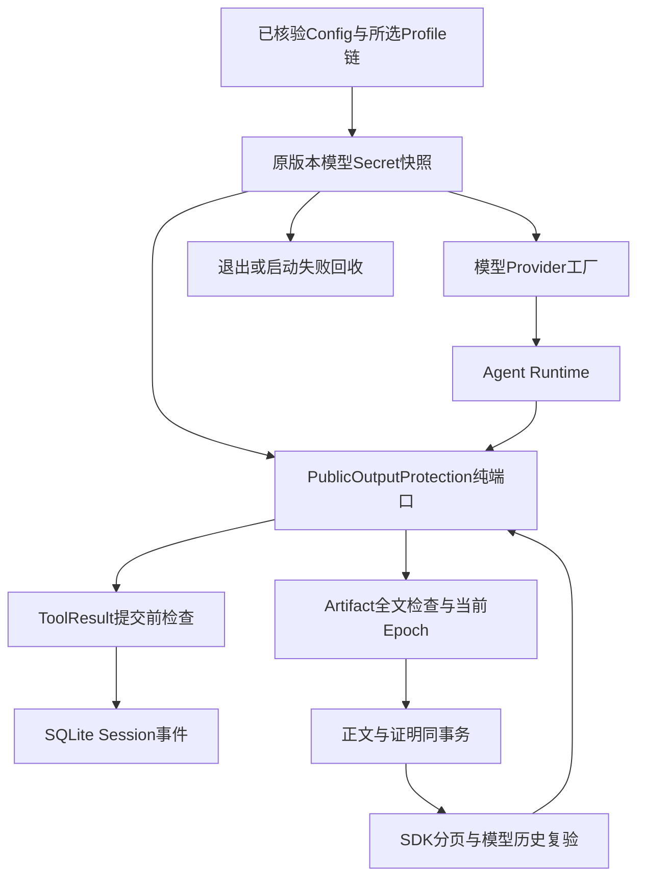
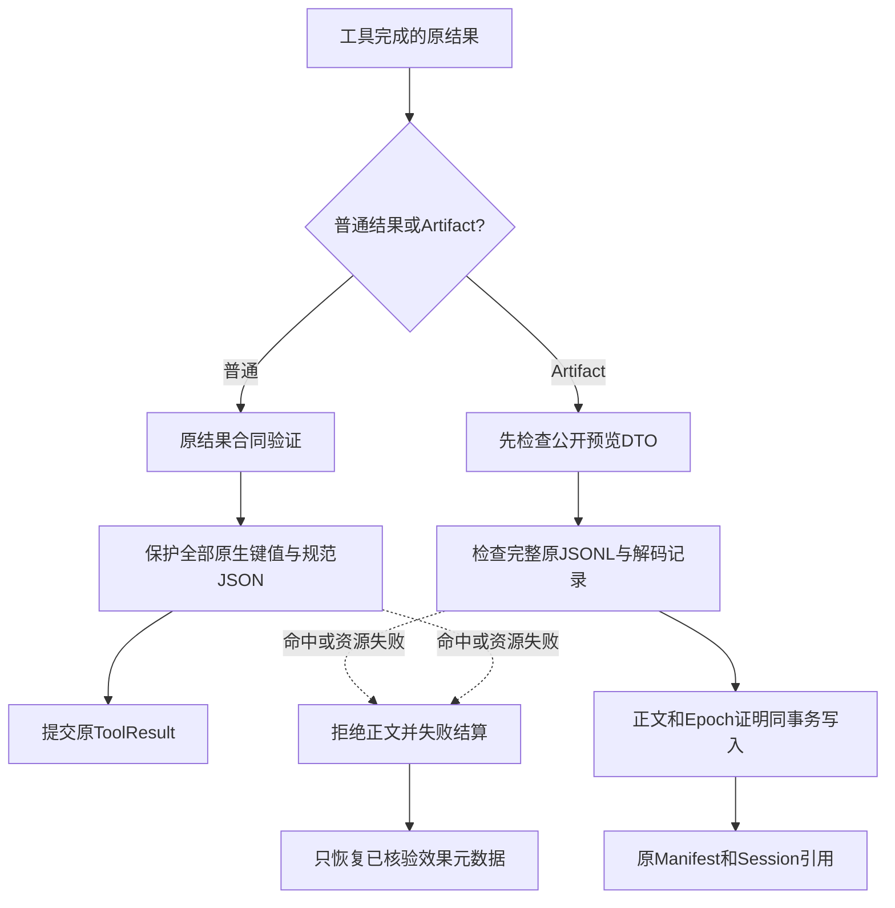
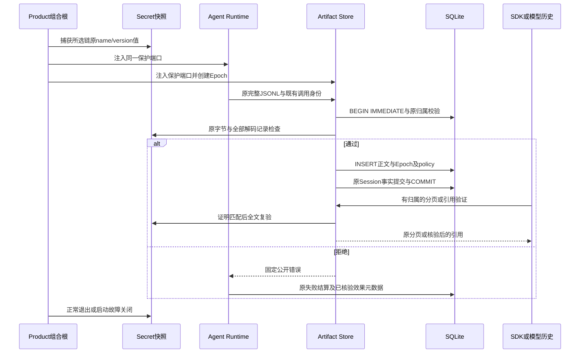
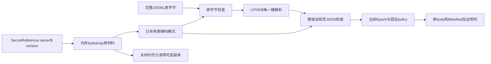

# 0.9.4a 产品模型凭据与Artifact公开边界详细设计

## 1. 需求背景与源码研究

[前序冻结报告](../validation/secret-publication-2026-09-27-v1/README.md)的独立观察表明：
`e730f4858c76dbbb614a81b1b3e12184c433266c`正式模型Provider工厂收到原凭据，
真实grep捕获300条记录；两条预览不包含值，但SDK在offset=149、limit=1读取完整Artifact时包含该值。
随后`read_artifact`的结果进入Session、下一次Scripted模型请求历史和协议回放。
非空OTel未发现该值，只能说明已检查的遥测出口；不能推导全部出口安全。
该观察使用组件组合与四次Scripted请求，不是完整产品stdio启动或真实模型网络验收。

原有[模型装配](../../src/harnessix/product_config/runtime.py)在构造各Provider时读取当前环境；
原有[Agent Runtime](../../src/harnessix/agent/runtime.py)只检查结果合同、归属和输出长度；
[Artifact存储](../../src/harnessix/artifacts/sqlite.py)验证Hash和Session引用，未证明正文经过同一模型凭据材料检查。
Process绑定的Secret Scope不含模型Provider凭据，不能代替产品公开保护。

本地上游源码研究沿用已核验版本：Codex `a0dcfe2ada3f5bbd5059a34c0fc6fac244741a67`，
`codex-rs/utils/redacted-string/src/lib.rs`的Debug隐藏不改变透明Serialize；
`codex-rs/secrets/src/sanitizer.rs`使用有限模式。OpenCode
`69c172e8a7c0086887b1f93ed5a162f14b6aa0c5`的
`packages/http-recorder/src/redactor.ts`治理请求、响应与头部，不证明本产品的Session/Artifact值安全。
本设计复用现有有限模式扫描，不复制上游实现，也不引入独立Action Plane服务。

## 2. 设计目标、非目标与取舍

1. 在任何已选模型Provider工厂调用前，捕获所选Profile链的原name/version材料；同一快照用于构造Provider和保护公开结果。
2. Agent结果在Session提交前检查；Artifact必须检查完整原JSONL，不能以预览或单页通过授权全文。
3. 原始字节、解码后的键/值和规范JSON共用有限预算；拒绝重复键、无效UTF-8与非有限数值。
4. 写入正文与当前运行Epoch证明在同一事务内；分页、单件引用验证与批量模型历史验证均要求证明并重新检查全文。
5. 旧正文不重写；不能用当前环境新值或同名同版本声明追认旧正文安全。
6. 失败使用固定公开错误；取消继续传播；已确认写入的Audit事实不变，不因结果拒绝再次Execute。

| 方案 | 决策及理由 |
|---|---|
| 把模型key转换成Process环境注入目标 | 否决：模型材料身份不是工作负载注入权限。 |
| 每次发布重新读取当前环境 | 否决：工厂构造后旋转会丢失原值。 |
| 只检查工具预览或正在读取的页 | 否决：其他记录及后续历史仍可泄漏。 |
| 修改正文为脱敏值并复用旧Hash | 否决：破坏既有Manifest/Audit绑定。 |
| 保存全部原凭据或原凭据Hash作为恢复依据 | 否决：扩大持久敏感材料面，且Hash不能扫描旧明文。 |
| 当前Store随机Epoch、同事务证明、全文复验 | 采用：保守约束当前运行，内存O(1)，不建立无限缓存。 |
| 相同版本即可跨重启恢复正文 | 否决：版本声明不是原值证明；跨重启安全恢复仍需独立设计。 |

本切片不治理历史Session已保存正文、用户输入、模型直接输出、Context来源或Compaction摘要的全部出口；
不治理未登记凭据、任意变换、结构化分片推断或系统日志；不声明跨重启Artifact可恢复性已完成。
同一Epoch不是密码学签名，也不是对恶意数据库管理员的防篡改证明。

## 3. 总体架构与模块边界



`agent.publication`只定义纯结构端口与取消/期限，不导入Secrets、Router或Gateway。
`secrets.publication`实现材料生命周期与有限扫描，结构化`SecretVersionReference`只有name/version；
现有`SecretVersionBinding`仍兼容，新增模型引用不携带target。
`artifacts.publication`持有当前Store唯一Epoch并集中检查证明。
`product_config.server`持有生命周期，Process Action仍由原Action Composition单独持有Process凭据Scope。
没有新增Python包依赖边或依赖环；新增模块均位于既有包内。

## 4. 核心流程与完整文字说明



1. 启动先核验ProfileSelection与ConfigSnapshot；仅遍历`profile_chain`绑定引用，既不扫描所有环境变量，也不向Process授予模型key注入权限。
2. Scope在任何Provider工厂前完成捕获，工厂通过Scope.resolve取得独立副本；运行中环境旋转不改变快照。
3. 普通结果先通过既有`_validate_result`，再检查原DTO；Artifact预览先检查，完整正文由Store集中写入边界检查。
4. JSONL先检查原始文本，然后逐行唯一键解析、原生树与规范JSON检查；所有记录共享同一工作量与大小预算。
5. 仅检查成功后执行INSERT；Store在原Session事务中写正文、Manifest、Epoch和policy，不改变正文、Hash、TTL或Tool指纹。
6. 分页和历史引用仍先遵守现有归属/Manifest/Hash约束；当前证明不匹配时在返回正文前拒绝；匹配后再次检查全文。
7. 结果拒绝进入原Runtime失败结算。已确认写入的Router恢复只返回核验后的效果元数据，原Audit不改写、不重复执行或对账。

## 5. 时序图与事务边界



不同生产者保留原事务合同：通用Tool Artifact与Session结果同事务；Action Review/Output保留原查询优先收据和确认丢失恢复；
Batch报告保留原事实批次附加事务。集中检查发生于首次INSERT前。
已有收据查询不会刷新Epoch或TTL，不能重签旧行；公开正文仍经过分页/历史消费边界。
当前Epoch仅标记由当前Store保护过的正文，不是持久安全Seal。

## 6. 数据流程、字段与领域契约



| 字段/结构 | 来源、约束和解释 | 持久化 |
|---|---|---|
| SecretVersionReference.name/version | 宿主已核验引用；结构端口，不含target；Scope要求实际材料身份一致 | 只有原配置引用 |
| Scope._materials | 每名唯一材料；最多32名、1024绑定、总材料64 KiB；重复名称不同版本拒绝 | 否 |
| Scope._patterns | 原文与已有有限编码，合计最多2 MiB；不持久化，不保证不可变副本抹除 | 否 |
| _ScanBudget.nodes/size/work | 全部记录共享；扫描量含所有模式，不能逐记录重置 | 否 |
| publication_epoch | 当前Store随机UUID文本；无保护时NULL，不能使用旧Store Epoch | Artifact内部列 |
| publication_policy | 有证明时固定`harnessix.public-output-protection/v1`；与epoch同时为空或有效 | Artifact内部列 |
| ArtifactRef | 原artifact_id、Hash、字节、记录数、complete、expires_at；公开合同不新增Epoch | 原Manifest |

### 6.1 扫描预算

- 原生单DTO：1 MiB累计标量字节、10256节点、深度64、64 MiB模式工作量。
- JSONL：原body最多1 MiB；全部解码标量累计1 MiB；深度64；全部记录节点上限1 MiB数量级；全部原字节、原生键值与规范JSON共用64 MiB工作量。
- JSONL节点限额不同于单DTO限额，避免5000条合法小记录被当作一个小DTO误拒绝；预算仍跨全部记录共享。
- `_protect`同步扫描期限10秒，使用monotonic及调用前后协作检查点；宿主不协作的同步代码不能被硬抢占。
- 有限模式沿用[redaction.py](../../src/harnessix/secrets/redaction.py)；完整大小或工作量超限即拒绝，不返回部分被检查正文。

### 6.2 调度等待与同步扫描期限的整改设计

整改前实现将两次 `sleep(0)` 调度交接包含在扫描的 10 秒期限内。
固定安装诊断中，Git 完整材料与 Core 同步段造成约 19.31 秒的事件循环心跳间隔，
小型 SDK 输入因此可能在执行扫描前或完成扫描后因其他任务占用事件循环而被拒绝。
该结果是插桩单例的调度证据，不是生产延迟、唯一根因或性能验收。

现行候选只修订纯保护端口的计时边界，不提高 10 秒扫描上限：

1. 入口先异步交付既有父 Task 取消，再启动同步扫描的原期限。
2. 原保护端口、前后同步检查点及结果检查全部在原 10 秒窗口内完成；
   此窗口不主动让出事件循环，也不调用新的线程、进程或异步保护端口。
   没有 `await` 的同步窗口不设置无效的异步 timeout；完成后仍强制核对 monotonic，
   端口不协作也不能将超限结果作为成功返回。端口自行抛出的 `TimeoutError` 保留原保护失败分类。
3. 退出扫描窗口后保留末次调度交接，交付扫描期间排队的领域取消或父 Task 取消；
   返回前使用同次操作的取消检查点，不能将已排队取消作为成功发布。
4. 两次调度等待不计为纯扫描工作；外层请求、Turn、Git 准备及效果结算的期限保持原规则。

这是明确的计时语义修订，不声称原整个异步调用的总耗时仍最多 10 秒。
字节、节点、深度、模式工作量、完整正文扫描、慢扫描的同步完成后拒绝及公开错误归一不变。
新增[调度回归](../../tests/agent/test_publication_scheduling.py)覆盖输入／JSON／JSONL的
前后调度等待、真正慢扫描及扫描中排队的两类取消；原实现 6 失败／9 通过，
现行候选与两个原公开保护集合合计 43 通过。该结果不是源码外安装或完整产品验收。
Git 大同步段本身的响应性与最大阻塞间隔仍需后续整改，不能由纯保护通过推导已经解决。
独立窄审查未发现本次时钟及取消差异的具体回归，但不构成全系统证明。
后继[取消交叉回归](../../tests/agent/test_publication_scheduling_cancellation.py)补充
尾部调度超预算与排队取消并发、外层期限在尾部触发，以及工厂／feed／finish 的父取消和清理异常。
该集合与原 33 项调度回归共同在同一固定安装源码下通过 48 项；不与其他重叠集合相加。

## 7. 类设计、接口设计与核心伪代码

| 接口/类 | 源码 | 入参、返回与责任 |
|---|---|---|
| PublicOutputProtection | [agent/publication.py](../../src/harnessix/agent/publication.py) | `assert_public_json(value,checkpoint)`、`assert_public_jsonl(body,checkpoint)`；纯检查，不改写正文 |
| protect_json / protect_jsonl | 同上 | 可选端口、原数据与CancelToken；异步检查，固定归一错误 |
| SecretPublicationScope | [secrets/publication.py](../../src/harnessix/secrets/publication.py) | name/version引用与SecretProvider；捕获原材料并实现纯保护端口 |
| provider_secret_references | [product_config/runtime.py](../../src/harnessix/product_config/runtime.py) | 原Snapshot与Selection；核验后返回所选链引用 |
| ArtifactPublicationGuard | [artifacts/publication.py](../../src/harnessix/artifacts/publication.py) | 保护端口；当前epoch、policy、check_body与require_proof |
| insert_artifact | [artifacts/persistence.py](../../src/harnessix/artifacts/persistence.py) | 原数据库事务、Ref与正文；检查成功后正文和证明同INSERT |
| SQLiteArtifactStore | [artifacts/sqlite.py](../../src/harnessix/artifacts/sqlite.py) | 新增可选保护注入；原公开contract保持不变 |
| verify_references | [artifacts/batch_verify.py](../../src/harnessix/artifacts/batch_verify.py) | 原批量引用身份；原归属/Hash基础上逐件证明和全文检查 |
| parent_cancel_checkpointer | [agent/cancellation.py](../../src/harnessix/agent/cancellation.py) | 本次操作的同步预算检查；传播新父Task取消，不误判已消费计数 |

```text
product_start(config, selection):
    require selection belongs to config
    with capture_original_values(selected_profile_chain) as scope:
        provider_bundle = build_providers(scope)
        artifact_store = create_store(scope, fresh_epoch)
        run_agent(scope, artifact_store, provider_bundle)

insert_artifact(transaction, body, reference):
    retain original owner / identity / quota validation
    scan original JSONL and every decoded record using one bounded budget
    INSERT original body, original manifest, current epoch, fixed policy
    commit under original producer contract

read_or_verify_reference(row):
    require original scope, ownership, reference and content integrity
    require row proof equals current store epoch and policy
    scan complete original body again
    only then return authorized page or reference
```

`AgentRuntime.__init__`的所有Verifier同Session校验提取到既有`runtime_configuration.select_artifact_verifier`，
仍校验所有候选后选首个，不跳过未选候选。
原Store能力字典移到`contracts.artifact_store_contract`，字段和Schema不变；
Batch候选过滤提取为`_report_candidates`，原顺序和条件不变。
这些单职责提取抵消新增检查造成的热点增长，不提高可读性政策阈值或新增豁免。

## 8. 持久化、兼容、升级与回退

[Migration 0028](../../src/harnessix/session/migrations/0028_artifact_publication_proof.sql)仅新增两个可空列；
SQL CHECK明确检查policy非NULL，避免SQLite三值逻辑允许半份证明。旧行均为NULL；
历史body、Manifest、Session Snapshot/事件、Audit和原Migration checksum不改写。
升级事务前退出保持27版，提交后退出为28版；重开完成升级且原字节一致。
独立旧版程序必须来自`3c5f6e36d9c9ce98709c5c37ae2316709c443001`归档，核验实际模块路径及MAX(version)=27，
不能通过新版本手工建表冒充旧程序验收。

默认Product组合根启用保护；重建Store产生新Epoch，即使旧正文安全、版本声明相同，也拒绝旧正文。
这是显式可用性限制，影响原Artifact参与的长会话、Fork与重启续写，不宣称可恢复产品发布完成。
无保护参数的独立宿主保留历史兼容行为，但不能宣称享有默认产品的安全边界。
数据库升级后不得使用不支持28版的旧程序强行读写；回退使用升级前完整备份或新版本，禁止删列、改历史checksum或后台重签旧行。

## 9. 失败、恢复、取消、超时与安全

| 失败 | 固定公开码与行为 |
|---|---|
| 原值或有限编码命中 | `public_output_secret_leak`；不提交正文 |
| Scope已关闭或材料不可用 | `public_output_secret_unavailable` |
| 字节、节点、深度或工作量超限 | `public_output_limit` |
| 检查期限耗尽 | `public_output_timeout` |
| 无效JSONL、重复键、任意宿主异常 | `public_output_protection_failed`；不公开原异常诊断 |
| NULL、其他Store或被改动的证明 | `artifact_publication_unproven`；不公开正文 |
| CancelToken或新增父Task取消 | 原TurnCancelled/CancelledError继续传播，原Runtime结算和回收 |

所有归一错误消息固定为“公开结果未通过保护校验”，期限前置固定消息只供内部分类；
不得以异常正文或Secret值构造日志、模型反馈或遥测属性。
扫描不修改原Hash；结果拒绝后已确认写入的Audit仍succeeded，原Runtime恢复路径只补效果元数据。
效果元数据与模型公开正文是不同事实，不能把工具反馈失败改写为写入未发生。

证明不是跨进程租户ACL、加密或签名。数据库可被宿主管理员改写，原有Hash/引用与归属校验仍不可省略。
本设计不承诺清除SQLite空闲页或历史泄漏正文，不承诺Python不可变字符串和SDK内部副本抹除。

## 10. 可观测性、错误分类与验证方案

沿用Runtime、协议、SQLite与OTel公开面，无新增Secret值日志或持久指标标签。
实际只读链检查非空Session、SDK Snapshot/Replay、下一Scripted模型历史、非空OTel及SQLite文件字节；
安全grep允许offset=149单页读取，泄漏grep在INSERT前拒绝，不能生成可读Artifact。
真实产品启动装配测试仅替换模型工厂和stdio驱动，模型工厂收到原key；它不是字节级stdio、真实Provider网络、容器或三平台安装验收。

| 测试文件 | 重点覆盖 |
|---|---|
| [test_publication.py](../../tests/agent/test_publication.py) | 原文/编码/Unicode转义/键、全记录共享预算、合法大记录集、无效结构、深度、取消与期限、固定诊断 |
| [test_publication_runtime.py](../../tests/agent/test_publication_runtime.py) | 真实只读工具、SQLite、SDK页和历史、OTel、旧/重建/改动Epoch、确认写入后只恢复元数据且不再执行 |
| [test_publication_scope.py](../../tests/product_config/test_publication_scope.py) | 原Profile链快照、环境旋转、启动失败及正常退出回收、仅选后备Profile |
| [test_publication_persistence.py](../../tests/artifacts/test_publication_persistence.py) | 四类purpose集中INSERT保护/证明同事务，半份/未知/无效证明约束；不是四类业务完整集成验收 |
| [test_publication_upgrade.py](../../tests/artifacts/test_publication_upgrade.py) | 独立27版程序创建Artifact、28版退出点原子性、不改原字节、不追认旧正文 |

相关回归覆盖现有Artifact、Product Config及Session升级；完整回归必须绑定稳定测试树，运行期间不修改跟踪输入。
验收统计、源码Hash、完整回归树、发行物与发布阻断分别保存于专用验证目录，不能把上一版本结果当作本版本结果。

## 11. 源码阅读顺序、部署与开放风险

阅读顺序：`provider_secret_references` → `_serve_product_stdio` → `SecretPublicationScope` →
`agent.publication._protect` → `AgentRuntime._record_tool_result` → `insert_artifact` →
`SQLiteArtifactStore.read/verify_reference` → `batch_verify._check_entry` → 对应实际Runtime测试。

部署仍是一个Coding Agent产品进程与本地SQLite，不增加HTTP/Worker或外部中间件；
新增两个内部模块和一条Migration，安装流程与原CLI不变。
独立SDK宿主必须为Runtime和Artifact Store注入同一保护作用域并管理生命周期；不能只注入其中一个后声称完整保护。

开放工作：历史Session全文治理、用户/模型/Context/Compaction出口、跨重启旧正文安全恢复、
Owner/Store内部阻塞和资源归属、TM攻击编号及平台验收、远端MCP身份/OAuth/出口、12件许可阻断、
三平台实际安装/升级/卸载与Beta以及真实Provider验证。当前切片不关闭整体0.9.4a或整体0.9。

### 11.1 正式Process二进制输出的已确认限制

[固定版本观察](../validation/product-publication-2026-09-27-v1/README.md)确认：
正式Process的`data_base64`记录在原值前增加1或2字节后，可通过当前有限模式检查，而解码正文包含已登记值。
进一步通过正式Owner合同替身、审批、Runtime、Router、SQLite与Artifact读取复现；不是实际容器或完整产品启动。
这是已知二进制合同缺少类型化解码桥的公开保护缺口，不应仅归为未知任意变换。
当前原生JSONL检查只扫描原字节和JSON解码后的字符串，并不解码正式Process分片或拼接跨Chunk原值。
后续必须研究`processes.trusted_output`、Process持久前保护与Artifact消费桥，明确同一总预算、原Hash保持、取消和恢复语义。
这一限制阻断整体公开安全发布；当前46项专项通过不关闭该缺口。
