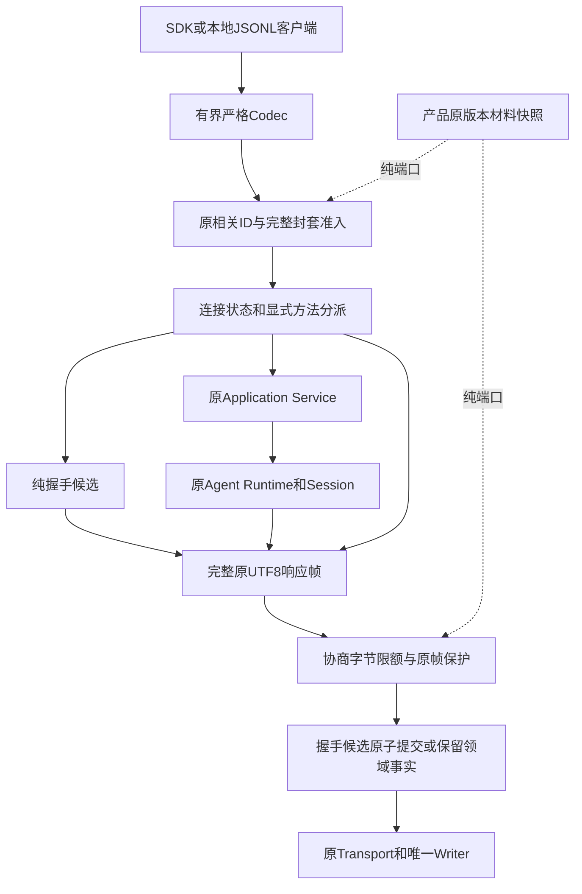
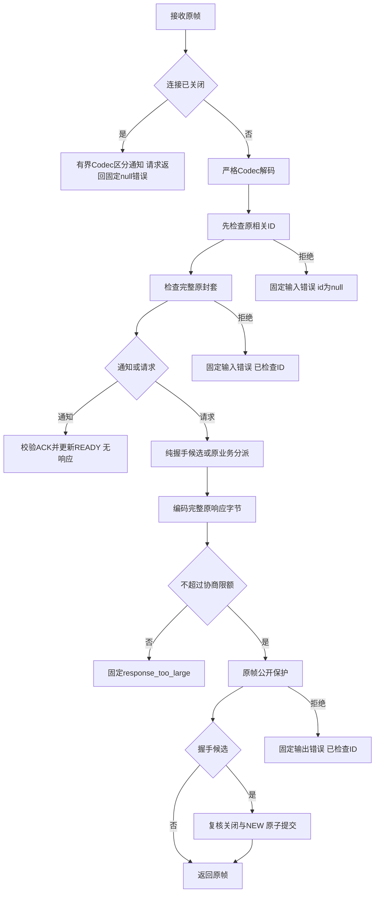
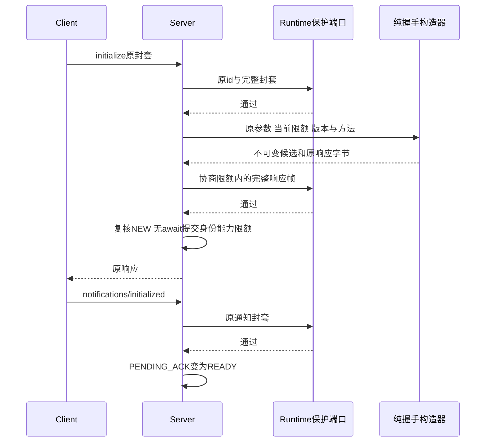
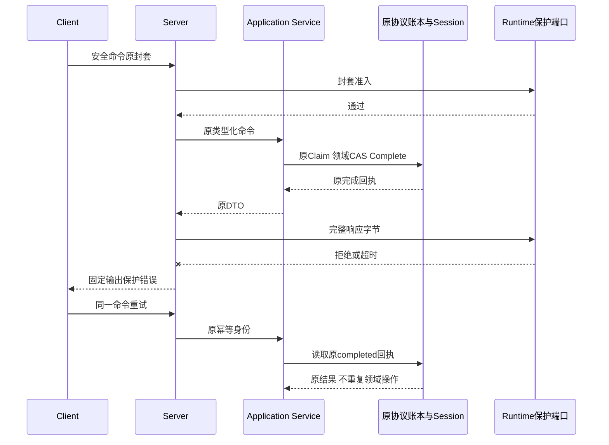
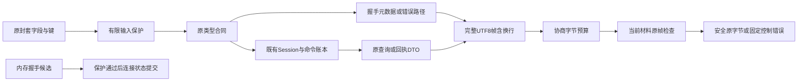

# 0.9.4a 原协议封套、完整响应字节与握手提交详细设计

## 1. 需求背景与源码研究

前序输入持久前保护保证类型化命令在协议账本Claim之前检查，但原始JSON-RPC `id`、未知参数键、
初始化元数据和只读查询不经过该命令边界。即使未知参数被Pydantic拒绝，其`loc`仍可能将原键作为错误路径公开。
查询、历史Replay、Live Delta以及稳定错误也不能仅凭领域命令检查获得公开授权。

固定基线`735f2e9dcafbe863e36a2890fac1364c4283bca8`的独立探针使用真实Runtime、SQLite和Protocol Server，
确认三个出口：原相关ID、未知参数键的错误path、当前材料命中的旧Replay。相同脚本在修复版上验证拒绝；
材料版本变化后未登记的旧历史仍可被返回，明确列为开放风险。探针只用合成材料，真实模型请求为0。
[版本绑定观察](../validation/protocol-frame-publication-2026-09-28-v1/contract-facts.json)保存布尔事实和脚本摘要，不保存原请求或材料。

本地Codex固定版本`a0dcfe2ada3f5bbd5059a34c0fc6fac244741a67`的
[`SessionScopedOutgoingSender::send_response/send_error`](https://github.com/openai/codex/blob/a0dcfe2ada3f5bbd5059a34c0fc6fac244741a67/codex-rs/app-server/src/outgoing_message.rs#L202-L214)
将响应送往带连接身份的Outgoing Message Sender。这说明领域操作、连接身份和传输发布是不同职责；
不能从该调用链推导上游具备本产品的全部Secret授权。Harnessix独立设计原封套准入与原字节发布门禁，不复制上游代码。

## 2. 设计目标、非目标与架构决策

1. Codec完成有界结构解码后，原相关ID和完整原封套先检查，再进入握手、Notification、Params、Service或Store。
2. 所有业务响应、查询、回放、增量和动态错误的完整原UTF-8帧，在返回Transport/Writer之前检查；不改正文、Hash、ID或Schema。
3. 响应超过协商`maxMessageBytes`时返回稳定小错误；以实际编码字节含换行计数，不用字符数或DTO估算替代。
4. initialize只准备不可变候选，原响应保护通过后再无await提交连接身份、能力、限额和PENDING_ACK。
5. 取消、关闭、并发初始化和保护失败均不留下半握手状态；关闭后合法Notification不响应。
6. 复用既有纯保护端口和产品材料快照，不新增网络服务、数据库、扫描规则或执行权限。

| 方案 | 结论与理由 |
|---|---|
| 各个Params、查询和错误分别加扫描 | 否决：遗漏id、method、动态path和未来方法；重复实现难审计。 |
| 只检查response.result | 否决：错误code/message/path与初始化元数据仍能公开。 |
| 清洗或替换原id后继续执行 | 否决：改变相关身份，造成错误归并；未授权id仅在拒绝时使用null。 |
| initialize先修改状态再扫描 | 否决：失败或取消会留下不可重试的半握手。 |
| 原封套准入＋纯握手候选＋完整字节检查 | 采用：入口无副作用，出口统一；原合同与原领域事实保持。 |
| 持久历史授权只靠当前材料扫描 | 否决：版本轮换后的旧值不可识别，不构成历史Seal或跨重启授权。 |

非目标：完整历史Session授权、任意编码DLP、全部Provider凭据、直接Application Service查询出口、
恶意同步扩展硬抢占、全局Delta/Task内存、远程身份/网络权限、真正三平台安装验收及整个0.9发布完成。
纯嵌入未装保护器兼容，但仍执行协商字节门禁；默认产品装配原版本Scope。

## 3. 总体架构与模块边界



`frame_publication.py`负责线上编码、有限控制错误、封套准入和完整响应字节检查。
`handshake.py`只校验initialize合同、协商限额、构造候选与提取既有错误path，不保存连接状态。
`server.py`拥有状态、显式分派和候选CAS；`AgentRuntime.validate_public_frame`提供纯端口，复用`protect_jsonl`。
Runtime不导入Secrets实现；产品Scope由组合根注入。没有新增一级依赖边或依赖环，未扩大公共API/Schema。

## 4. 核心流程图与完整描述



解码失败不回显原id、键、正文或第三方诊断。请求先单独检查id，只有该步成功才允许拒绝响应继续使用原id。
通知准入失败只丢弃，不产生错误响应、不更新ACK。准入中发生关闭时再次检查状态，业务不进入分派。
正常请求的类型错误、未知方法、初始化元数据、稳定领域错误和结果均编码后通过同一发布门禁。
先比较实际帧长度再扫描，确保过大响应不进入Writer或产生大扫描工作；固定失败响应远小于合同最小4096字节。

## 5. 成功时序与握手线性化



候选准备不是初始化完成点；公开保护通过后的无await赋值是连接线性化点。
两个initialize可以同时准备和检查，但只能一个在NEW提交；另一个返回再次经原帧保护的`already_initialized`。
父Task取消时不吞取消，也不提交候选。关闭发生在保护等待窗口时不得将CLOSED恢复为PENDING_ACK。

## 6. 失败时序与不可逆领域事实



出口失败不能撤销已完成领域事实或协议回执，不能将其标记为未执行，也不能用新request_id静默重执行。
已有领域原结果继续由原账本与Session恢复；保护失效时宿主排空和直接Runtime cancel保持独立。
Live Delta消费后的出口失败也不等于Delta仍可再次读取；恢复依赖持久Replay，不作虚假的无损增量保证。

## 7. 数据流程、持久化与事务



没有新数据库列、迁移、Seal或持久授权记录。材料快照只覆盖原已登记版本及有限变体；旧Session仍保持原字节。
拒绝握手不写Session、请求账本或Workspace；拒绝只读查询不清洗旧历史。安全正文和关联ID按原编码返回。
契约只保证原完整响应在单次发布点检查，不能从当前值扫描推导其他版本历史的安全性。

## 8. 类、接口设计与数据结构

| 符号 | 输入与输出 | 职责与约束 |
|---|---|---|
| `admit_message` | Runtime＋原Request/Notification → `None`或响应tuple | `None`表示通过；`() `表示拒绝通知；请求拒绝仅返回固定控制帧。 |
| `publish_frame` | Runtime＋完整bytes＋已检查id＋max bytes → `(bytes, bool)` | bool只表示原帧通过；失败bytes不是原领域结果，不表示操作回滚。 |
| `closing_response` | 原bytes＋当前max bytes → tuple | 不访问Scope/领域；合法通知无响应，其他情况固定null关闭错误。 |
| `encode/error_frame` | 原冻结ProtocolModel/错误字段 → UTF8 bytes | 紧凑JSON含末尾换行；动态错误还需发布保护。 |
| `prepare_initialization` | 原Request、当前状态/能力/限额 → bytes或候选 | 错误直接返回原错误帧，成功返回未提交候选；没有连接副作用。 |
| `validate_public_frame` | 原bytes → None或KernelError | 确保Runtime开放后复用`protect_jsonl`，使用独立CancelToken；父Task取消自然传播。 |
| `process_frame` | 原bytes → `tuple[bytes,...]` | 准入、原分派、出口保护、候选CAS；不改变领域幂等协议。 |

`PreparedInitialization`是内部冻结slots数据类，不是公共协议模型：

| 字段 | 类型 | 语义/生命周期 |
|---|---|---|
| `frame` | bytes | 原协商响应完整字节，检查对象，不是清洗后的副本。 |
| `client_instance_id` | UUID | 原业务命令账本客户端身份；仅在提交后绑定连接。 |
| `item_deltas_enabled` | bool | 原客户端能力协商结果；拒绝时不改变旧值。 |
| `limits` | ProtocolLimits | 四项服务端与客户端最小值；候选的maxMessageBytes用于本次握手响应检查。 |

公共协议id与命令request_id不同：前者只关联本次Response，后者属于持久幂等身份。
未授权协议id使用null固定拒绝，不用随机id掩盖关联丢失；严格SDK可能按既有合同报`invalid_response`。
该兼容边界仍需后续处理，不得为可用性放行Secret。

## 9. 核心业务逻辑伪代码

```text
process_frame(original):
  if closing: bounded_decode_notification_or_fixed_null_error()
  message = strict_decode(original) or fixed_null_parse_error
  check original id; then check complete original envelope
  if rejected notification: return empty
  if rejected request: return fixed input error with authorized id or null
  recheck closing
  if notification: validate ACK; update READY; return empty
  candidate_or_frame = original dispatch / pure handshake preparation
  encode original response; select current or candidate negotiated limit
  if original UTF8 bytes exceed limit: return response_too_large
  check exact original bytes or return fixed output error
  if candidate:
    if closing: return fixed null closing error
    if no longer NEW: publish protected already_initialized error
    without await commit candidate identity/capability/limits/state
  return original frame
```

## 10. 失败、取消、超时、恢复与安全边界

| 情形 | 稳定语义 | 状态/恢复 |
|---|---|---|
| 当前已登记材料命中原封套 | `public_input_secret_leak` | 无业务分派；id未授权则null，通知无响应。 |
| 输入保护失效/预算/期限/扩展失败 | 有限`public_input_*`代码 | 固定消息，不公开扩展诊断；握手仍NEW。 |
| 原响应材料命中/预算/期限/失效 | 有限`public_output_*`代码 | 不发原字节；候选不提交，已完成领域事实保留。 |
| 超过协商UTF8字节限额 | `response_too_large` | 不截断正文，不交Writer；减少分页或读Artifact。 |
| 握手准备、编码意外异常 | 固定`internal_error` | 不回显原异常；候选不提交。 |
| 父Task取消 | CancelledError传播 | 不伪造成功，未提交握手保持NEW。 |
| 等待保护时关闭 | 固定null `server_closing` | 不复活连接；不强制撤销已完成业务。 |
| 并发initialize | 一个提交；其他`already_initialized` | 保留胜者全部原身份、能力与限额。 |
| Closing/Closed通知 | 无Response | 只做有界Codec区分，不依赖已关闭Scope。 |
| 材料换版后旧未登记正文 | 未形成历史授权 | 当前探针可读旧值；0.9.4a仍开放。 |

固定紧急控制帧是明确例外：仅有限稳定code、固定中文消息、已单独检查的id或null，
不递归调用失败的保护器，不携带原键/path/正文/外部诊断。解析/关闭控制帧始终null。
如果任意已登记材料恰与固定协议常量同值，则有限材料检查不能为固定常量建立任意DLP承诺；
本设计不是通用敏感数据识别。动态code/message/path仍全部经过完整原帧保护。

保护继续遵守既有输入字节、模式工作预算、期限与取消，不新增线程或硬抢占保证。
原Protocol最小4096与Scope自身检查预算不同；字节合规不等于保护预算合规。
直接Application Service查询未经过该传输边界，禁止据此对所有Python直调出口宣称安全。

## 11. 测试、验证与验收证据

新增62项：61项原封套/响应/握手/限额/关闭测试和1项真实产品CLI子进程验证；
其中1项明确记录未登记旧历史开放观察，不能作为安全验收成功数。既有99项相关回归继续运行，合计161项通过。
另外新增2项证据治理测试。完整测试结果以固定源码对应的[验证报告](../validation/protocol-frame-publication-2026-09-28-v1/README.md)为准。

覆盖：7类原字段×3有限编码、通知准入、5类旧查询出口、第三方稳定/意外错误、动态错误路径、
失败握手后安全重试、取消/关闭等待窗、两个并发初始化、completed回执出口失败后不重复领域操作、
保护失效/预算/期限、原UTF8 4095/4096/4097边界、过大Replay减小页重试、stdio实际Reader/Writer。

实际`python -m harnessix agent-server`子进程用临时真实ProductConfig、Provider构造、材料Scope、SQLite与OS管道，
验证敏感id/键拒绝、正常握手/ACK、空Thread List和EOF退出；合成凭据不出现在stdout或数据库，stderr为空。
未接受任何Turn，未发真实模型请求；Provider构造不能替代Provider网络验收。
没有Windows/Linux物理安装或公开Beta声明，不以平台中立测试代替三平台验收。

## 12. 部署、兼容、回滚、可观测性与风险

同一Python发行物，不增加服务/端口/后台Worker，无数据库迁移和Schema版本变更。
发布物需从固定Git清洁归档构建，排除未跟踪材料；Wheel内新增模块须与固定源码逐字节一致。
正常安全响应及原相关身份不变；新增拒绝语义和严格字节限额会暴露过去可发的大页，应减少页大小或使用Artifact。
不能静默截断JSON、重发命令或绕过Scope；安装回滚仍须保留状态备份并明确旧版本缺少该保护。

观测只记录稳定错误code、相关流程状态、运行版本及布尔证据，不记录材料、原请求、外部诊断或敏感path。
该切片不新增高基数日志、指标或Trace Secret维度。原事件/回执仍是恢复事实，响应失败不是执行未发生证明。

发布开放：旧Session/跨重启Seal、全部Provider材料、直接Service查询、Scope不可用的SDK相关ID、
Owner同步阻塞/Store归属、12项Archive权利、编号威胁场景、远程MCP身份、三平台安装/升级/Beta、真实Provider成本。
这些阻塞不因本切片通过而取消；当前0.9.4a及整个0.9不标记完成。

## 13. 源码映射与阅读顺序

1. [`frame_publication.py`](../../src/harnessix/app_server/frame_publication.py)：先读`admit_message`，理解id与整体检查的区别，再读`publish_frame`和固定控制例外。
2. [`handshake.py`](../../src/harnessix/app_server/handshake.py)：查看不可变候选与原限额最小值，无状态修改。
3. [`server.py`](../../src/harnessix/app_server/server.py)：从`process_frame`串联准入、分派、响应保护和CAS；`_handle_request`保留原错误分类。
4. [`runtime.py`](../../src/harnessix/agent/runtime.py)的`validate_public_frame`及[`publication.py`](../../src/harnessix/agent/publication.py)的`protect_jsonl`：纯可选端口与取消/失败语义。
5. [`test_frame_publication.py`](../../tests/app_server/test_frame_publication.py)和[`真实CLI测试`](../../tests/product_config/test_protocol_publication_cli.py)：从拒绝无状态变化、等待窗、旧历史开放和实际管道四条路径阅读。
6. [ADR-0100](../adr/0100-protocol-frame-and-handshake-publication.md)与[六文件证据目录](../validation/protocol-frame-publication-2026-09-28-v1/README.md)：区分固定来源、当前观察和发布范围。

### 13.1 固定源码符号逐项导航

- [`src/harnessix/app_server/frame_publication.py`：`encode`，L32–L42](https://github.com/carrie1988/Harnessix/blob/6b5f5591d4dbe8cb31f99752b3e8950ae62a8bd0/src/harnessix/app_server/frame_publication.py#L32-L42)。
- [`src/harnessix/app_server/frame_publication.py`：`error_frame`，L45–L64](https://github.com/carrie1988/Harnessix/blob/6b5f5591d4dbe8cb31f99752b3e8950ae62a8bd0/src/harnessix/app_server/frame_publication.py#L45-L64)。
- [`src/harnessix/app_server/frame_publication.py`：`admit_message`，L67–L86](https://github.com/carrie1988/Harnessix/blob/6b5f5591d4dbe8cb31f99752b3e8950ae62a8bd0/src/harnessix/app_server/frame_publication.py#L67-L86)。
- [`src/harnessix/app_server/frame_publication.py`：`publish_frame`，L89–L107](https://github.com/carrie1988/Harnessix/blob/6b5f5591d4dbe8cb31f99752b3e8950ae62a8bd0/src/harnessix/app_server/frame_publication.py#L89-L107)。
- [`src/harnessix/app_server/frame_publication.py`：`closing_response`，L110–L118](https://github.com/carrie1988/Harnessix/blob/6b5f5591d4dbe8cb31f99752b3e8950ae62a8bd0/src/harnessix/app_server/frame_publication.py#L110-L118)。
- [`src/harnessix/app_server/handshake.py`：`PreparedInitialization`，L25–L31](https://github.com/carrie1988/Harnessix/blob/6b5f5591d4dbe8cb31f99752b3e8950ae62a8bd0/src/harnessix/app_server/handshake.py#L25-L31)。
- [`src/harnessix/app_server/handshake.py`：`validation_path`，L34–L37](https://github.com/carrie1988/Harnessix/blob/6b5f5591d4dbe8cb31f99752b3e8950ae62a8bd0/src/harnessix/app_server/handshake.py#L34-L37)。
- [`src/harnessix/app_server/handshake.py`：`prepare_initialization`，L40–L96](https://github.com/carrie1988/Harnessix/blob/6b5f5591d4dbe8cb31f99752b3e8950ae62a8bd0/src/harnessix/app_server/handshake.py#L40-L96)。
- [`src/harnessix/app_server/server.py`：`_handle_request`，L189–L231](https://github.com/carrie1988/Harnessix/blob/6b5f5591d4dbe8cb31f99752b3e8950ae62a8bd0/src/harnessix/app_server/server.py#L189-L231)。
- [`src/harnessix/app_server/server.py`：`process_frame`，L233–L289](https://github.com/carrie1988/Harnessix/blob/6b5f5591d4dbe8cb31f99752b3e8950ae62a8bd0/src/harnessix/app_server/server.py#L233-L289)。
- [`src/harnessix/app_server/server.py`：`close`，L291–L296](https://github.com/carrie1988/Harnessix/blob/6b5f5591d4dbe8cb31f99752b3e8950ae62a8bd0/src/harnessix/app_server/server.py#L291-L296)。
- [`src/harnessix/agent/runtime.py`：`validate_public_input`，L475–L478](https://github.com/carrie1988/Harnessix/blob/6b5f5591d4dbe8cb31f99752b3e8950ae62a8bd0/src/harnessix/agent/runtime.py#L475-L478)。
- [`src/harnessix/agent/runtime.py`：`validate_public_frame`，L485–L488](https://github.com/carrie1988/Harnessix/blob/6b5f5591d4dbe8cb31f99752b3e8950ae62a8bd0/src/harnessix/agent/runtime.py#L485-L488)。
- [`tests/product_config/test_protocol_publication_cli.py`：`test_actual_product_cli_does_not_echo_sensitive_rpc_metadata`，L23–L107](https://github.com/carrie1988/Harnessix/blob/6b5f5591d4dbe8cb31f99752b3e8950ae62a8bd0/tests/product_config/test_protocol_publication_cli.py#L23-L107)。
