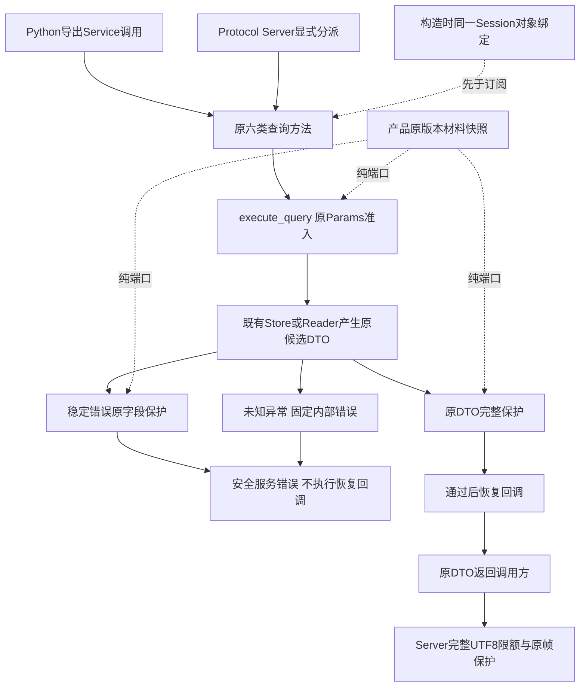
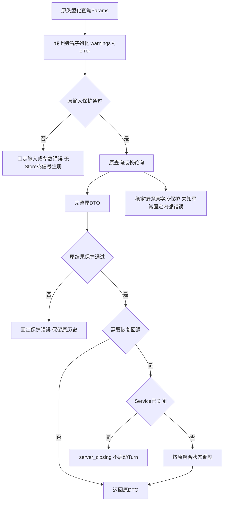
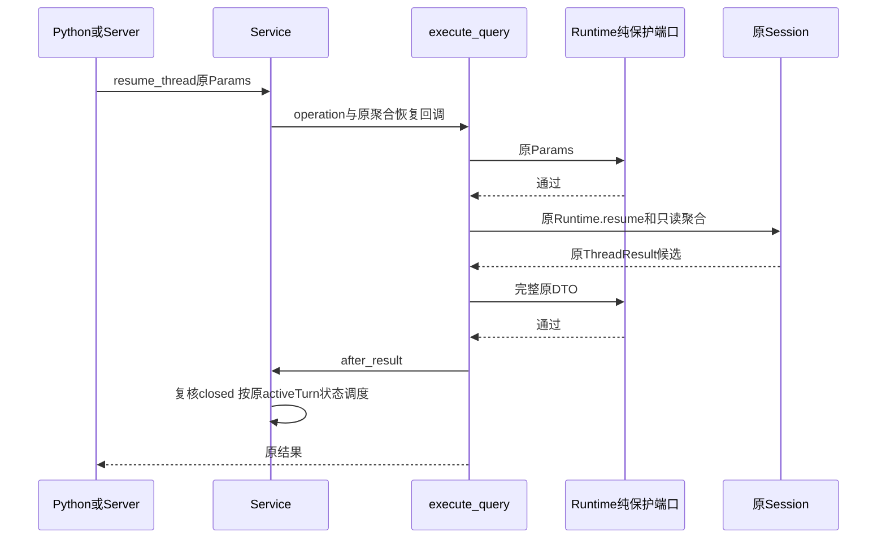
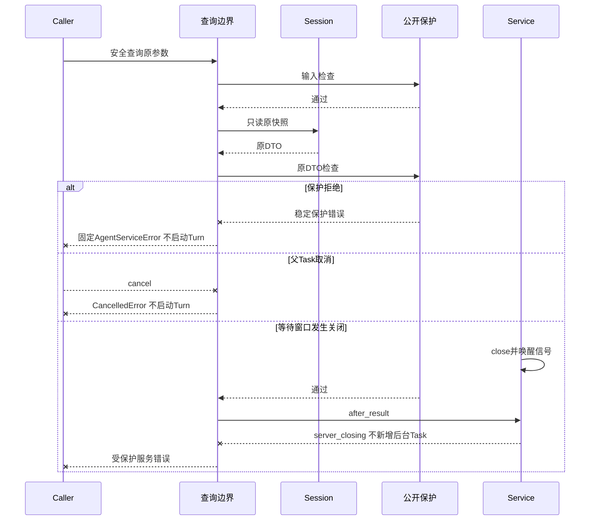
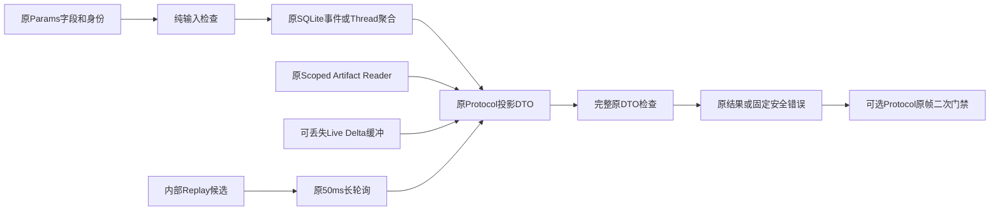

# 0.9.4a 导出查询公开边界与同一Session宿主绑定详细设计

## 1. 需求背景与源码研究

Protocol原帧保护只约束经过`AgentProtocolServer`的调用；`AgentApplicationService`是正式导出类，
其get/list/resume/replay/next原先直接返回DTO。Python应用可绕过Transport获得当前已登记材料。
`resume_thread`还在原结果检查之前调度后台Turn，拒绝响应不等于拒绝恢复执行。

固定`d105d6212b374c20ffef5b20d95cc2de6a88d48f`的独立探针用真实Runtime、SQLite、导出Service，
确认五个DTO都含合成原材料，未使用Transport Guard，Provider为0、原历史不变。
同一基线还接受Runtime与查询Session不同对象，甚至同一路径的另一个对象；构造时没有明确所有权绑定。
[版本绑定观察](../validation/query-publication-2026-09-28-v1/contract-facts.json)保留基线与同脚本整改结果，不保存材料或原请求。

本地Codex固定版本`a0dcfe2ada3f5bbd5059a34c0fc6fac244741a67`的
[`SessionScopedOutgoingSender`](https://github.com/openai/codex/blob/a0dcfe2ada3f5bbd5059a34c0fc6fac244741a67/codex-rs/app-server/src/outgoing_message.rs#L202-L214)
将逻辑响应交给连接发布器。这一职责区分不能证明绕过发布器的本产品Python查询安全。
Harnessix复用既有输入/输出纯保护端口，在导出应用边界独立准入和发布，不复制上游代码。

## 2. 设计目标、非目标与方案取舍

1. 六类查询的完整原Params进入Store、Reader、Runtime.resume或Live信号注册之前检查。
2. 所有原DTO，包括Thread/List/Replay/Live Delta/Artifact页，在返回Python调用方之前检查；不改原字段、Hash和引用。
3. 稳定Kernel/Service错误的原code/message/retryable先检查再返回；未知异常和序列化诊断使用固定内部错误。
4. 恢复调度必须晚于完整原快照通过保护；输出拒绝、父取消和关闭竞态不新增后台Turn。
5. 构造时Runtime.store与查询store、Artifact Reader.session必须为同一对象；绑定拒绝先于Workspace解析和Delta订阅。
6. 提取长轮询编排，保持50ms复读、信号窗口防竞态、关闭唤醒和Replay事实；不放宽代码结构门禁。

非目标：持久历史Seal、未知版本凭据识别、SQLite文件物理身份验证、任意自定义Request Store归属证明、
跨租户/远程认证、全部Provider凭据、直接内部SessionStore/Runtime聚合授权、全局Delta内存、同步恶意扩展硬抢占、三平台真实安装或整个0.9发布完成。
当前材料检查不能授予跨重启或旧历史授权；默认产品装配Scope，纯嵌入None保护继续兼容。

| 方案 | 取舍 |
|---|---|
| 仅约束Server入口 | 否决：导出Service的Python调用可绕过传输。 |
| 遇到敏感字段替换后继续恢复 | 否决：改变原身份与任务内容，拒绝响应也无法撤销后台运行。 |
| 在每个查询复制扫描/错误实现 | 否决：易漏Artifact和Delta；独立规则与错误命名空间会漂移。 |
| 新建Query数据库或新服务 | 否决：查询无需持久命令Claim，不能重建独立Action Plane。 |
| 通用原Params/DTO边界＋原候选构造 | 采用：`execute_query`复用纯端口，持久事实原样保留，恢复回调后置。 |
| 通过路径相等绑定Session | 否决：同一路径的另一对象不具有同一Runtime租约和装配生命周期。 |
| 任意扩展Request Store全部宣称绑定 | 否决：现行端口无身份声明，不从Duck类型属性推导数据库授权。 |

## 3. 总体架构与模块边界



`service.py`仍拥有Session、Reader、Tasks、Delta与关闭状态，只保留具体查询与恢复条件。
`query_runtime.execute_query`统一原参数、结果、错误及后置回调顺序，不拥有Store、不Claim命令、不创建Task。
`replay_snapshot`只读既有事件并生成候选；`poll_events`只组织有界等待和原快照回调。
`server.py`对`UnexpectedQueryError`保留既有`-32603`分类，其他Service错误仍走原领域映射；原帧门禁继续独立生效。
没有新增一级依赖边、环或Protocol Schema；既有模块导出和查询方法签名不变。
直接Python调用的Store/Kernel稳定错误统一为公开的`AgentServiceError`，调用方不得依赖旧的底层异常类型。

## 4. 查询核心流程图与完整文字说明



查询原参数使用`mode=json/by_alias=True/warnings=error`。非法构造模型不会把Pydantic诊断打印到stderr，
序列化失败转换固定`invalid_params`，不进入IO。输入保护成功后才调用operation，所以关闭Scope和敏感UUID/cursor不会访问Store或注册Live信号。
返回原DTO前扫描完整结构，不只扫描预览、text或某个Result字段。Artifact引用Hash和原分页正文不被改写。
保护错误、稳定异常和未知异常均返回安全服务错误，父Task取消不被Exception分支吞掉。

## 5. 正常查询与后置恢复时序



原聚合由operation闭包保存，恢复回调只使用该原聚合的activeTurn，不根据公共摘要猜测恢复对象。
输入、读取、原DTO保护与回调顺序明确。完整候选检查成功且服务未关闭，才调用既有`_spawn`。
原Task Registry仍按Turn ID去重；普通查询没有命令request_id、账本Claim或持久查询事务。

## 6. 输出失败、取消和关闭时序



输出失败保持已有Session、Turn和Protocol账本，不清洗旧正文、不创建失败Turn、不删除或重写事实。
`resume_thread`只读阶段的固定生命周期Telemetry不代表恢复Task已经运行；公开保护失败时没有Provider消费。
同步恶意扩展不能被Python协程硬抢占，仍遵守既有检查点与10秒单次保护期限；不宣称跨全部阶段单一总期限。

## 7. 数据流程、持久化和事务



无数据库迁移、事件变更、Hash变更或持久Proof。`replay_snapshot`不是公开授权，只供查询内部候选构造，
最终仍要通过`execute_query`。不在每次50ms复读上重复完整公开扫描，只有最终准备返回的原候选需要扫描。
Delta在候选形成时可能从缓冲取走；出口拒绝不能承诺该增量可重读，也不能以无结果认定副作用未发生。
恢复事实依赖持久Replay，旧未登记历史仍需要后续Seal与原材料版本授权。

## 8. 类、接口设计与数据结构

| 符号 | 输入/输出 | 职责及失败边界 |
|---|---|---|
| `execute_query` | Runtime、Protocol Params、async operation、可选after_result → 原Protocol Result | 检查原参数后IO；检查原结果后回调；稳定错误字段检查；未知异常固定化。 |
| `replay_snapshot` | SessionStore、EventsReplayParams → EventsReplayResult候选 | 复用原events/page/cursor/has_more投影；内部使用，不替代公开保护。 |
| `poll_events` | Params、Event、snapshot/replay/closed回调 → EventsNextResult候选 | 原截止时间、信号清空窗口复读、50ms轮询与最终快照；不创建模型Task。 |
| `UnexpectedQueryError` | 无动态构造参数 → AgentServiceError子类型 | 固定internal_error与固定中文消息，Server保持`-32603`而不误归领域失败。 |
| `AgentApplicationService.__init__` | 原Runtime/Store/Request Store/可选Reader | 同一Session对象检查先于Workspace解析、Delta订阅；失败只抛固定ValueError。 |
| `resume_thread.drive` | 已保护ThreadResult与原聚合闭包 | 仅原ACCEPTED/EXECUTING_TOOLS/WAITING_APPROVAL/WAITING_ACTION activeTurn可调度；关闭拒绝。 |

| 关键字段/回调 | 类型 | 原始语义与所有权 |
|---|---|---|
| `params.thread_id/artifact_id/cursor` | UUID或有界str | 原只读资源身份；序列化后完整检查，不用摘要替代。 |
| `after_cursor/limit/wait_ms` | 受限整数 | 原分页与长轮询合同；不增加无限读取承诺。 |
| `include_deltas` | bool | 必须是原生bool；错误类型先固定拒绝，不注册信号。 |
| `operation` | async Callable | 原Store/Reader/Runtime只读操作；不得额外调度恢复Task。 |
| `after_result` | sync Callable或None | 仅原DTO保护通过后调用，不能当作持久事实事务。 |
| `thread`闭包 | Thread或None | 原Runtime聚合，保留精确activeTurn，公共DTO不重建私有状态。 |
| `signal` | asyncio.Event | Service拥有的线程级信号，唤醒只是提示，必须复读Session。 |
| `closed` | Callable返回bool | 动态观察原Service关闭，不能从缓存false推断仍可恢复。 |
| `failure.code/message/retryable` | str/str/bool | 稳定原错误字段经保护后保留；保护失败改固定错误，不返回外部诊断。 |

Session绑定是对象所有权与生命周期约束，不是Tenant授权或SQLite文件完整性证明。
自定义Request Store现行端口没有身份声明，不能仅凭路径或属性证明同库；仍列发布开放。
产品组合根继续用同一`sessions.path`创建SQLite命令账本；受信宿主动态改写Store/Reader绑定不属支持配置。

## 9. 核心伪代码

```text
execute_query(params, operation, after_result):
  encode original typed params with alias and warnings=error
  validate original input or fixed service rejection
  original_result = await operation()
  validate complete original DTO
  if after_result: invoke only after successful protection
  return original result
  on stable Kernel/Service error:
    validate original code/message/retryable
    if protection fails: use fixed protection error
    raise public AgentServiceError
  on unexpected exception: raise fixed UnexpectedQueryError
  parent cancellation propagates

resume_drive(original_thread):
  if original activeTurn is in supported recoverable states:
    if service.closed: raise server_closing
    original _spawn(activeTurn)

poll_events:
  fixed deadline = now + original wait_ms
  read snapshot; if ready return candidate
  check deadline/closed; clear signal; re-read snapshot
  await signal at most min(50ms, remaining); repeat
  final re-read snapshot and original Replay; return candidate or timed_out
```

## 10. 失败、取消、超时、关闭与恢复

| 情形 | 对外语义 | 不变事实与后续行为 |
|---|---|---|
| 原参数包含当前已登记材料 | public_input_secret_leak | 不读Store/Reader，不注册信号，不恢复Turn。 |
| Scope不可用/预算/期限/扩展失败 | 有限public_input或public_output错误 | 原错误固定，不覆盖Session；父取消自然传播。 |
| 原DTO或稳定错误字段命中材料 | public_output_secret_leak | 不公开原值，原Thread/Turn/引用不修改，无恢复调度。 |
| 手工构造的非法模型 | 固定invalid_params或internal_error | 序列化warnings=error，不打印含字段原值的stderr诊断。 |
| Query宿主未知异常 | UnexpectedQueryError/internal_error | Python稳定服务错误，JSON-RPC仍`-32603`。 |
| Service关闭时恢复回调 | server_closing | 不创建Task；只读查询可在Runtime仍开放时返回受保护结果。 |
| 已closed宿主重放旧命令 | 原completed回执仍可读取 | `_spawn`不再创建Task；回执accepted只是原事实，不保证该关闭宿主继续执行。 |
| 空长轮询关闭/到期 | 原Replay＋timed_out | 关闭唤醒，候选仍需完整公开保护；不改变持久序列。 |
| Delta候选已取走后拒绝 | 固定保护错误 | 不承诺Live无损重读；只能依赖持久Replay。 |
| 未登记旧版本材料 | 当前扫描仍不能识别 | 明确开放风险，不作为历史授权验收成功。 |

不把Service关闭等同于Runtime/Store关闭，关闭后的只读缓存访问与新执行不同。
正常重连应创建新Service/Server；不得将关闭宿主返回原回执误解为后台Task已调度。
外层Frame限额/Scope保护仍需保留：DTO保护不能覆盖JSON-RPC id、method、校验path及真实编码字节。

## 11. 安全、权限、部署、兼容与可观测性

默认产品同一进程内持有Scope、Provider、Session、Agent和Service，未新增监听端口或远程服务。
同一Python发行物，无迁移；安全原字段/DTO/Hash/签名/Schema不变，不清洗持久历史。
错误类型在直接Python接口统一为AgentServiceError；意外失败保持原JSON-RPC内部错误分类。
反向Scope纯端口继续由产品装配，None纯嵌入不构成生产材料保护。

绑定检查先于订阅，避免错误装配持有其他Runtime的信号生命周期；同路径不同对象仍拒绝。
不推导SQLite物理文件身份、宿主内存攻击或跨租户授权；Tenant、远程MCP和Request Store身份另行治理。
观测只记录稳定code、状态、版本与布尔验证事实，不记录材料、原请求、旧正文或外部诊断。
回滚旧源码会重新打开直调旁路，不能作为安全回滚方案；产品升级、备份与正式安装验收仍由0.9.5关闭。

## 12. 测试、真实验证与风险

新增61项Service查询测试，含1项未登记旧历史开放观察；另1项默认产品Root直接API验证及2项证据治理测试。
专项181项（62新增功能/观察＋119既有）通过，组间计数不相加；全量结果以[固定证据](../validation/query-publication-2026-09-28-v1/README.md)为准。

覆盖五查询×raw/Base64、六输入拒绝、六敏感UUID/cursor、原安全DTO、四类错误来源、稳定重试码、
Live Delta、Artifact完整引用/正文、三错误绑定、接受Turn的快照拒绝/取消/超时/关闭/安全恢复、
输入/输出各五故障、实际长轮询关闭/取消/到期、非法构造模型和非法Live选项。
默认产品Root使用真实配置/Scope/Session/默认Action与只读宿主装配，仅模型工厂和驱动替身；直接Service调用，无Transport代理。
不接受新Turn，不消费Provider，不清洗既有私有历史；退出清理原材料。既有真实CLI OS管道回归仍覆盖发行入口。

开放：旧历史授权/跨重启Seal、全部Provider凭据、内部聚合/Store公开权限、Request Store物理归属、
Owner同步阻塞、Scope不可用SDK相关ID、12项Archive权利、编号威胁场景、远端MCP、三平台安装/升级/Beta和真实Provider成本。
本切片不关闭整个0.9.4a或0.9。同步恶意宿主硬抢占、任意DLP和所有编码识别均不宣称实现。

## 13. 源码映射与阅读顺序

1. [`query_runtime.py`](../../src/harnessix/app_server/query_runtime.py)：`execute_query`顺序及错误分支，`replay_snapshot`只产候选，`poll_events`保持原等待语义。
2. [`service.py`](../../src/harnessix/app_server/service.py)：构造绑定、六查询、resume闭包和`_spawn`关闭分支。
3. [`server.py`](../../src/harnessix/app_server/server.py)：UnexpectedQueryError映射与完整原帧门禁。
4. [`查询测试`](../../tests/app_server/test_query_publication.py)及[`默认Root验证`](../../tests/product_config/test_query_publication_root.py)：输入零IO、输出零恢复、原事实不变、开放旧历史。
5. [ADR-0101](../adr/0101-query-publication-and-session-host-binding.md)及[六文件证据](../validation/query-publication-2026-09-28-v1/README.md)：固定来源、检查口径、剩余发布阻塞。
